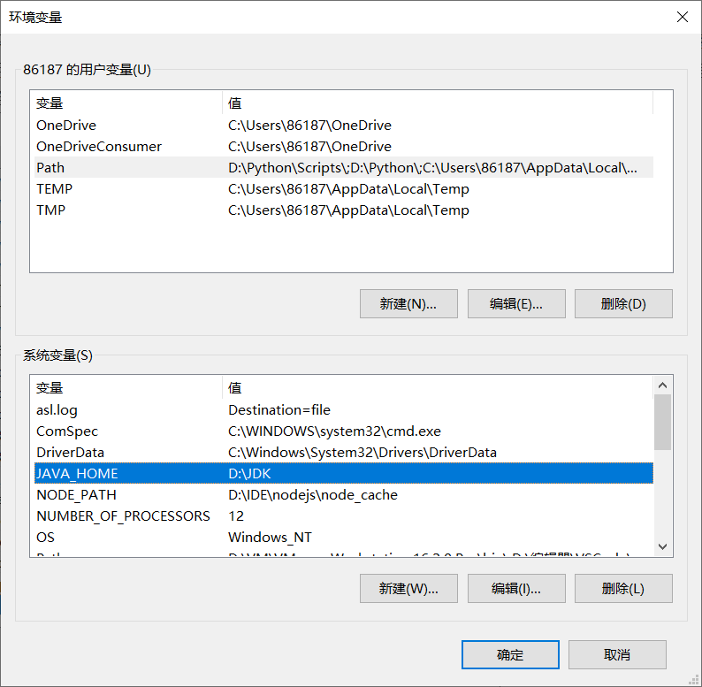

[toc]

# Java语言概述

- 是**SUN**(Stanford University Network，斯坦福大学网络公司) **1995年**推出的一门高级编程语言。
- 是一种面向Internet的编程语言。Java一开始富有吸引力是因为Java程序可以在Web浏览器中运行。这些Java程序被称为Java小程序（applet）。applet使用现代的图形用户界面与Web用户进行交互。applet内嵌在HTML代码中。
- 随着Java技术在web方面的不断成熟，已经成为Web应用程序的首选开发语言。**后台开发：Java、PHP、Python、Go、Node.js**

## Java简史

- 1991年Green项目，开发语言最初命名为Oak (橡树)
- 1994年，开发组意识到Oak 非常适合于互联网
- 1996年，发布JDK 1.0，约8.3万个网页应用Java技术来制作
- 1997年，发布JDK 1.1，JavaOne会议召开，创当时全球同类会议规模之最
- 1998年，发布JDK 1.2，同年发布企业平台J2EE
- 1999年，Java分成J2SE、J2EE和J2ME，JSP/Servlet技术诞生
- **2004年，发布里程碑式版本：JDK 1.5，为突出此版本的重要性，更名为JDK 5.0**
- 2005年，J2SE -> JavaSE，J2EE -> JavaEE，J2ME -> JavaME
- 2009年，Oracle公司收购SUN，交易价格74亿美元
- 2011年，发布JDK 7.0
- **2014年，发布JDK 8.0，是继JDK 5.0以来变化最大的版本**
- 2017年，发布JDK 9.0，最大限度实现模块化
- 2018年3月，发布JDK 10.0，版本号也称为18.3
- 2018年9月，发布JDK 11.0，版本号也称为18.9
- 2019年3月20日，Java SE 12 发布。Java 12是短期支持版本。
- 2019年9月23日，Java SE 13发布，此版本中添加了“文本块”，文本块是一个多行字符串文字，避免对大多数转义序列的需要，以可预测的方式自动格式化字符串，并在需要时让开发人员控制格式。

## Java技术体系平台

> **1、JavaSE(Java Standard Edition)标准版**

支持面向桌面级应用（如Windows下的应用程序）的Java平台，提供了完整的Java核心API，此版本以前称为J2SE

> **2、JavaEE(Java Enterprise Edition)企业版**

是为开发企业环境下的应用程序提供的一套解决方案。该技术体系中包含的技术如:Servlet 、Jsp等，主要针对于Web应用程序开发。版本以前称为J2EE

> 3、Java ME(Java Micro Edition)小型版

支持Java程序运行在移动终端（手机、PDA）上的平台，对Java API有所精简，并加入了针对移动终端的支持，此版本以前称为J2ME

> 4、Java Card

支持一些Java小程序（Applets）运行在小内存设备（如智能卡）上的平台

> 5、从Java的应用领域来分，Java语言的应用方向主要表现在以下几个方面：

- 企业级应用：主要指复杂的大企业的软件系统、各种类型的网站。Java的安全机制以及它的跨平台的优势，使它在分布式系统领域开发中有广泛应用。应用领域包括金融、电信、交通、电子商务等。

- Android平台应用：Android应用程序使用Java语言编写。Android开发水平的高低很大程度上取决于Java语言核心能力是否扎实。
- 大数据平台开发：各类框架有Hadoop，spark，storm，flink等，就这类技术生态圈来讲，还有各种中间件如flume，kafka，sqoop等等，这些框架以及工具大多数是用Java编写而成，但提供诸如Java，scala，Python，R等各种语言API供编程。
- 移动领域应用：主要表现在消费和嵌入式领域，是指在各种小型设备上的应用，包括手机、PDA、机顶盒、汽车通信设备等。

> Java主要特性

- Java语言是易学的。Java语言的语法与C语言和C++语言很接近，使得大多数程序员很容易学习和使用Java。
- Java语言是强制面向对象的。Java语言提供类、接口和继承等原语，为了简单起见，只支持类之间的单继承，但支持接口之间的多继承，并支持类与接口之间的实现机制（关键字为implements）。
- Java语言是分布式的。Java语言支持Internet应用的开发，在基本的Java应用编程接口中有一个网络应用编程接口（java net），它提供了用于网络应用编程的类库，包括URL、URLConnection、Socket、ServerSocket等。Java的RMI（远程方法激活）机制也是开发分布式应用的重要手段。
- Java语言是健壮的。Java的强类型机制、异常处理、垃圾的自动收集等是Java程序健壮性的重要保证。对指针的丢弃是Java的明智选择。
- Java语言是安全的。Java通常被用在网络环境中，为此，Java提供了一个安全机制以防恶意代码的攻击。如：安全防范机制（类ClassLoader），如分配不同的名字空间以防替代本地的同名类、字节代码检查。
- Java语言是体系结构中立的。Java程序（后缀为java的文件）在Java平台上被编译为体系结构中立的字节码格式（后缀为class的文件），然后可以在实现这个Java平台的任何系统中运行。
- Java语言是解释型的。如前所述，Java程序在Java平台上被编译为字节码格式，然后可以在实现这个Java平台的任何系统的解释器中运行。先编译后解释。
- Java是性能略高的。与那些解释型的高级脚本语言相比，Java的性能还是较优的。
- Java语言是原生支持多线程的。在Java语言中，线程是一种特殊的对象，它必须由Thread类或其子（孙）类来创建。

# Java程序运行机制及运行过程

-  特点一：面向对象
  - 两个基本概念：类、对象
  - **三大特性：封装、继承、多态**
- 特点二：健壮性
  - 吸收了C/C++语言的优点，但去掉了其影响程序健壮性的部分（如指针、内存的申请与释放等），提供了一个相对安全的内存管理和访问机制
- 特点三：跨平台性
  - 跨平台性：通过Java语言编写的应用程序在不同的系统平台上都可以运行。“Write once , Run Anywhere”
  - 原理：只要在需要运行java 应用程序的操作系统上，先安装一个Java虚拟机(JVM Java Virtual Machine) 即可。由JVM来负责Java程序在该系统中的运行。

## Java两种核心机制

> 1、Java虚拟机(Java VirtalMachine)

- JVM是一个虚拟的计算机，具有指令集并使用不同的存储区域。负责执行指令，管理数据、内存、寄存器。

- 对于不同的平台，有不同的虚拟机。

- 只有某平台提供了对应的java虚拟机，java程序才可在此平台运行。[外链图片转存失败,源站可能有防盗链机制,建议将图片保存下来直接上传

- Java虚拟机机制屏蔽了底层运行平台的差别，实现了“一次编译，到处运行”。[外链图片转存失败,源站可能有防盗在这里插入!链机制,建描述]议将图片上https://传(imblog-dnimg.cn/img_convert/UEET6e8896a45811378ed13d38b7df66.png#pic_center344)(#pic_center)]

> 2、垃圾收集机制(Garbage Collection)

- 不再使用的内存空间应回收——垃圾回收。
- 在C/C++等语言中，由程序员负责回收无用内存。
- Java 语言消除了程序员回收无用内存空间的责任：它提供一种系统级线程跟踪存储空间的分配情况。并在JVM空闲时，检查并释放那些可被释放的存储空间。
- 垃圾回收在Java程序运行过程中自动进行，程序员无法精确控制和干预。

**Java程序还会出现内存泄漏和内存溢出问题吗？Yes!**

# Java语言的环境搭建

> 1、明确什么是JDK, JRE

- JDK(Java Development Kit Java开发工具包)
  - JDK是提供给Java开发人员使用的，其中包含了java的开发工具，也包括了JRE。所以安装了JDK，就不用在单独安装JRE了。其中的开发工具：编译工具(javac.exe) 打包工具(jar.exe)等。
- JRE(Java Runtime Environment Java运行环境)
  - 包括Java虚拟机(JVM Java Virtual Machine)和Java程序所需的核心类库等，**如果想要运行一个开发好的Java程序，计算机中只需要安装JRE即可**。

> 2、**简单而言，使用JDK的开发工具完成的java程序，交给JRE去运行。**

- **JDK = JRE + 开发工具集（例如Javac编译工具等）**
- **JRE = JVM + Java SE标准类库**

> 3、**官方网址：**

- 下载JDK：https://www.oracle.com/java/technologies/downloads/
- java.sun.com
- 安装JDK
  - 傻瓜式安装，下一步即可。
  - **建议：安装路径不要有中文或者空格等特殊符号。**
  - 如果操作系统是64位的，软件尽量选择支持64位的（除非软件本身不区分）。
  - 当提示安装JRE 时，正常在JDK安装时已经装过了，但是为了后续使用Eclipse等开发工具不报错，建议也根据提示安装JRE。

> 4、配置环境变量

环境变量配置的目的是让`jdk\bin`目录下的java开发应用程序（各种.exe）在任何地方都能执行

- 配置步骤：只需找到电脑的环境变量配置，首先里面有两套环境变量，一套是当前用户的，一套是当前系统的，一般我们在下面一个也就是当前用户的环境变量里配置，复制你安装的jdk的bin目录，如：`D:\JDK\bin`，找到环境变量里有个path变量，新建，粘贴，确定 即可。至此环境变量就安装完成了。
  
- **但是**，开发中我们不这样配置，我们会在环境变量中重新定义一个变量叫`JAVA_HOME`，然后将jdk的目录（注意，是上面提到的bin的上一层目录）当做值写在这里，然后在刚才的path变量中引用一下这个变量，再加个`\bin`，如：`%JAVA_HOME%\bin`。这样做是因为在后面的服务器开发或其他开发中（至少Tomcat是）会自动寻找你的环境变量里有没有`JAVA_HOME`变量，方便配置。
  

> 5、验证是否成功

