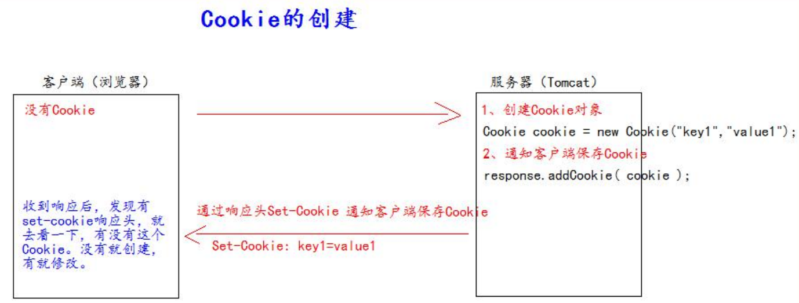
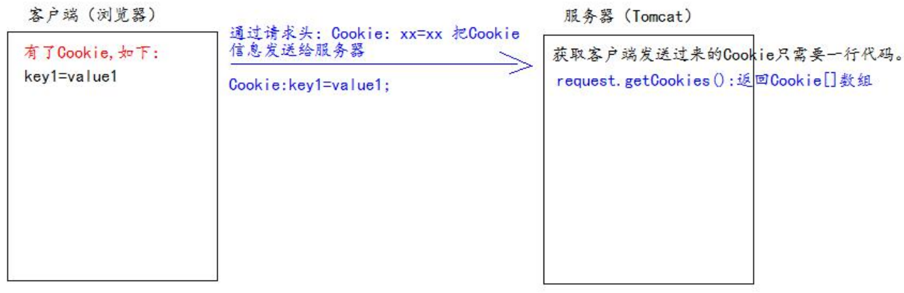
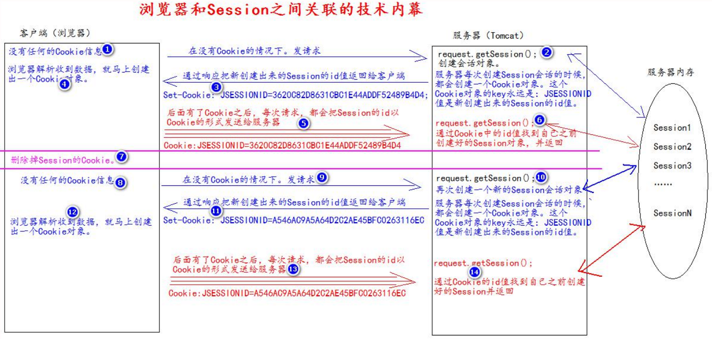

# Cookie饼干

## 1、什么是 Cookie? 

1、Cookie 翻译过来是饼干的意思。 

2、Cookie 是服务器通知客户端保存键值对的一种技术。 

3、客户端有了 Cookie 后，每次请求都发送给服务器。 

4、每个 Cookie 的大小不能超过 4kb 

## 2、如何创建Cookie



* 代码：
```java
//1 创建 Cookie 对象Cookie cookie = new Cookie("key4", "value4");
//2 通知客户端保存 Cookie
resp.addCookie(cookie);
//1 创建 Cookie 对象
Cookie cookie1 = new Cookie("key5", "value5");
//2 通知客户端保存 Cookie
resp.addCookie(cookie1);
```
## 3、服务器如何获取Cookie

服务器获取客户端的 Cookie 只需要一行代码：req.getCookies():Cookie[]



* Cookie的工具类
```java
public class CookieUtils {
  /**
    * 查找指定名称的 Cookie 对象
    * @param name
    * @param cookies
    * @return
  */
  public static Cookie findCookie(String name , Cookie[] cookies){
    if (name == null || cookies == null || cookies.length == 0) {
      return null;
    }
    for (Cookie cookie : cookies) {
      if (name.equals(cookie.getName())) {
        return cookie;
      }
    }
    return null;
  }
}
```
* Servlet中的代码
```java
protected void getCookie(HttpServletRequest req, HttpServletResponse resp) 
  throws ServletException,IOException {
  Cookie[] cookies = req.getCookies();
  for (Cookie cookie : cookies) {
// getName 方法返回 Cookie 的 key（名）
// getValue 方法返回 Cookie 的 value 值
    resp.getWriter().write("Cookie[" + cookie.getName() + "=" + cookie.getValue() + "] <br/>");
  }
  Cookie iWantCookie = CookieUtils.findCookie("key1", cookies);
//   for (Cookie cookie : cookies) {
//     if ("key2".equals(cookie.getName())) {
//       iWantCookie = cookie;
//       break;
//     }
//   }
// 如果不等于 null，说明赋过值，也就是找到了需要的 Cookie
  if (iWantCookie != null) {
    resp.getWriter().write("找到了需要的 Cookie");
  }
}
```
## 4、Cookie 值的修改 

方案一： 

1、先创建一个要修改的同名（指的就是 key）的 Cookie 对象 

2、在构造器，同时赋于新的 Cookie 值。 

3、调用 response.addCookie( Cookie );

```java
// 方案一：
// 1、先创建一个要修改的同名的 Cookie 对象
// 2、在构造器，同时赋于新的 Cookie 值。
Cookie cookie = new Cookie("key1","newValue1");
// 3、调用 response.addCookie( Cookie ); 通知 客户端 保存修改
resp.addCookie(cookie);
```
方案二： 
1、先查找到需要修改的 Cookie 对象 

2、调用 setValue()方法赋于新的 Cookie 值。 

3、调用 response.addCookie()通知客户端保存修改

```java
// 方案二：
// 1、先查找到需要修改的 Cookie 对象
Cookie cookie = CookieUtils.findCookie("key2", req.getCookies());
if (cookie != null) {
// 2、调用 setValue()方法赋于新的 Cookie 值。
  cookie.setValue("newValue2");
// 3、调用 response.addCookie()通知客户端保存修改
  resp.addCookie(cookie);
}
```
## 5、Cookie 生命控制 

Cookie 的生命控制指的是如何管理 Cookie 什么时候被销毁（删除） 

setMaxAge() 

正数，表示在指定的秒数后过期 

负数，表示浏览器一关，Cookie 就会被删除（默认值是-1） 

零，表示马上删除 Cookie

```java
/**
* 设置存活 1 个小时的 Cooie
* @param req
* @param resp
* @throws ServletException
* @throws IOException
*/
protected void life3600(HttpServletRequest req, HttpServletResponse resp) 
    throws ServletException,IOException {
  Cookie cookie = new Cookie("life3600", "life3600");
  cookie.setMaxAge(60 * 60); // 设置 Cookie 一小时之后被删除。无效
  resp.addCookie(cookie);
  resp.getWriter().write("已经创建了一个存活一小时的 Cookie");
}
/**
* 马上删除一个 Cookie
* @param req
* @param resp
* @throws ServletException
* @throws IOException
*/
protected void deleteNow(HttpServletRequest req, HttpServletResponse resp) 
    throws ServletException,IOException {// 先找到你要删除的 Cookie 对象
  Cookie cookie = CookieUtils.findCookie("key4", req.getCookies());
  if (cookie != null) {
// 调用 setMaxAge(0);
    cookie.setMaxAge(0); // 表示马上删除，都不需要等待浏览器关闭
// 调用 response.addCookie(cookie);
    resp.addCookie(cookie);
    resp.getWriter().write("key4 的 Cookie 已经被删除");
  }
}
```
## 6、cookie在以后开发中的作用:

1、cookie可以将数据保存在客户端，之前学习过域对象request、servletContext (将数据保存在服务端)

2、cookie保存数据的大小不能超过4kb

3、在开发登录模块的时候，我们通常会将用户名和密码的数据保存在cookie中(免密码登录)

4、如果我们开发- -个购物车模块，我们会将购物车的商品信息保存在cookie中

用户将商品添加到购物车，没有必要将商品数据添加到数据库中，因为你不知道他们会不会付款


# Session 会话 

## 1、什么是 Session 会话? 

1. Session 就一个接口（HttpSession）。 
2. Session 就是会话。它是用来维护一个客户端和服务器之间关联的一种技术。 
3. 每个客户端都有自己的一个 Session 会话。 
4. Session 会话中，我们经常用来保存用户登录之后的信息。 
## 2、如何创建 Session 和获取(id 号,是否为新) 

* 如何创建和获取 Session。它们的 API 是一样的。 
    * request.getSession() 
    第一次调用是：创建 Session 会话 
    之后调用都是：获取前面创建好的 Session 会话对象。 
    * isNew(); 判断到底是不是刚创建出来的（新的） 
    true 表示刚创建 
    false 表示获取之前创建 
* 每个会话都有一个身份证号。也就是 ID 值。而且这个 ID 是唯一的。 
    * getId() 得到 Session 的会话 id 值。
## 3、Seesion域数据的存取

```java
req.getSession().setAttribute("key1", "value1");
resp.getWriter().write("已经往 Session 中保存了数据");
Object attribute = req.getSession().getAttribute("key1");
resp.getWriter().write("从 Session 中获取出 key1 的数据是：" + attribute);
```
## 4、Session 生命周期控制 

* public void setMaxInactiveInterval(int interval)
 设置 Session 的超时时间（以秒为单位），超过指定的时长，Session 就会被销毁。

值为正数的时候，设定 Session 的超时时长。 

负数表示永不超时（极少使用） 

* public int getMaxInactiveInterval()
获取 Session 的超时时间 
* public void invalidate() 让当前 Session 会话马上超时无效。
* Session 默认的超时时间长为 30 分钟。 

因为在 Tomcat 服务器的配置文件 web.xml中默认有以下的配置，它就表示配置了当前 Tomcat 服务器下所有的 Session 超时配置默认时长为：30 分钟。

```xml
<session-config>
  <session-timeout>30</session-timeout>
</session-config>
```
* 如果说。你希望你的 web 工程，默认的 Session 的超时时长为其他时长。你可以在你自己的 web.xml 配置文件中做 以上相同的配置。就可以修改你的 web 工程所有 Seession 的默认超时时长。 
```xml
<!--表示当前 web 工程。创建出来 的所有 Session 默认是 20 分钟 超时时长-->
<session-config>
  <session-timeout>20</session-timeout>
</session-config> 
```
* 如果你想只修改个别 Session 的超时时长。就可以使用上面的API进行单独设置
session.setMaxInactiveInterval(int interval) 单独设置超时时长。
* session的超时指的是， 客户端两次请求的最大间隔时长。
## 5、Session与客户端的技术内幕

Session技术，底层其实是基于Cookie技术来实现的。



# Cookie与Session的区别

Cookie是客户端保存数据的技术：只能存放一些基本的字符串，json串，不能存放java对象，而且相对来说是不安全的，因为Cookie可以存放在浏览器中的

Session


