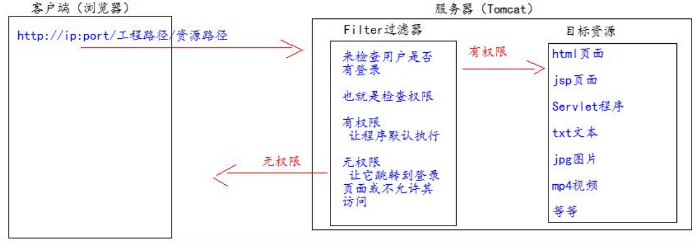
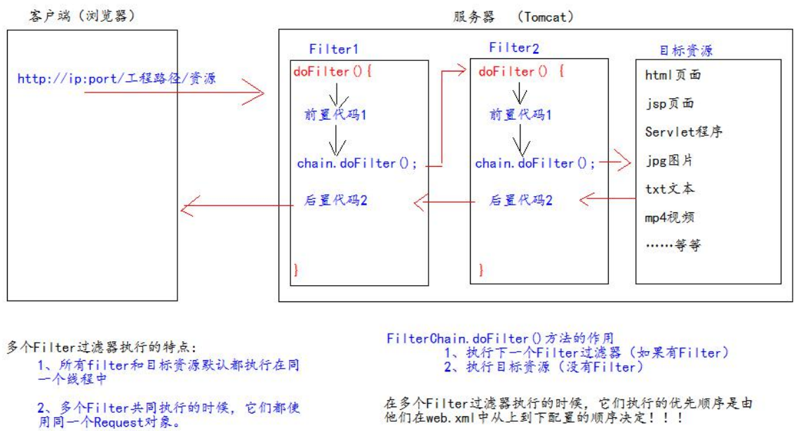

[toc]


# 1、Filter 什么是过滤器 

1、Filter 过滤器它是 JavaWeb 的三大组件之一。三大组件分别是：Servlet 程序、Listener 监听器、Filter 过滤器

2、Filter 过滤器它是 JavaEE 的规范。也就是接口

3、Filter 过滤器它的作用是：拦截请求，过滤响应。

- 拦截请求常见的应用场景有： 
  1、权限检查 
  2、日记操作 
  3、事务管理 ……等等 

# 2、Filter 的初体验 

**要求：**在你的 web 工程下，有一个 admin 目录。这个 admin 目录下的所有资源（html 页面、jpg 图片、jsp 文件、等等）都必 须是用户登录之后才允许访问。 思考：根据之前我们学过内容。我们知道，用户登录之后都会把用户登录的信息保存到 Session 域中。所以要检查用户是否 登录，可以判断 Session 中否包含有用户登录的信息即可！！！

**Filter 的工作流程图：**



**Filter 的代码：** 

```java
public class AdminFilter implements Filter { 
    /**
    * doFilter 方法，专门用于拦截请求。可以做权限检查 
    */ 
    @Override public void doFilter(ServletRequest servletRequest, ServletResponse servletResponse, FilterChain filterChain) throws IOException, ServletException {
        HttpServletRequest httpServletRequest = (HttpServletRequest) servletRequest;
        HttpSession session = httpServletRequest.getSession(); 
        Object user = session.getAttribute("user"); // 如果等于 null，说明还没有登录 
        if (user == null) { 						servletRequest.getRequestDispatcher("/login.jsp").forward(servletRequest,servletResponse); 
                           return; } else { 
            // 让程序继续往下访问用户的目标资源 
            filterChain.doFilter(servletRequest,servletResponse); 
        } 
    } 
}
```

**web.xml中配置filter**

```xml
<!--filter 标签用于配置一个 Filter 过滤器--> <filter> <!--给 filter 起一个别名--> 
    <filter-name>AdminFilter</filter-name> 
    <!--配置 filter 的全类名--> 
    <filter-class>com.atguigu.filter.AdminFilter</filter-class> 
</filter>
<!--filter-mapping 配置 Filter 过滤器的拦截路径--> 
<filter-mapping> 
    <!--filter-name 表示当前的拦截路径给哪个 filter 使用-->
    <filter-name>AdminFilter</filter-name>
    <!--url-pattern 配置拦截路径 
		/ 表示请求地址为：http://ip:port/工程路径/ 映射到 IDEA 的 web 目录 
		/admin/* 表示请求地址为：http://ip:port/工程路径/admin/* 
	--> 
    <url-pattern>/admin/*</url-pattern> 
</filter-mapping>
```

Filter 过滤器的使用步骤： 

1、编写一个类去实现 Filter 接口 

2、实现过滤方法 doFilter() 

3、到 web.xml 中去配置 Filter 的拦截路径

# 3、Filter的生命周期

Filter 的生命周期包含几个方法 

1、构造器方法 

2、init 初始化方法 

第 1，2 步，在 web 工程启动的时候执行（Filter 已经创建） 

3、doFilter 过滤方法 

第 3 步，每次拦截到请求，就会执行 

4、destroy 销毁 

第 4 步，停止 web 工程的时候，就会执行（停止 web 工程，也会销毁 Filter 过滤器）

# 4、FilterConfig类

FilterConfig 类见名知义，它是 Filter 过滤器的配置文件类。 

Tomcat 每次创建 Filter 的时候，也会同时创建一个 FilterConfig 类，这里包含了 Filter 配置文件的配置信息。 

FilterConfig 类的作用是获取 filter 过滤器的配置内容 

1、获取 Filter 的名称 filter-name 的内容 

2、获取在 Filter 中配置的 init-param 初始化参数 

3、获取 ServletContext 对象

# 5、FilterChain 过滤器链 

Filter 过滤器 

Chain 链，链条 

FilterChain 就是过滤器链（多个过滤器如何一起工作）



# 6、Filter的拦截路径

## 精确匹配

```xml
<url-pattern>/target.jsp</url-pattern> 
```

以上配置的路径，表示请求地址必须为：http://ip:port/工程路径/target.jsp 

## 目录匹配

```xml
<url-pattern>/admin/</url-pattern> 
```

以上配置的路径，表示请求地址必须为：http://ip:port/工程路径/admin/* 

## 后缀名匹配

```xml
<url-pattern>*.html</url-pattern>
```

以上配置的路径，表示请求地址必须以.html 结尾才会拦截到 

```xml
<url-pattern>*.do</url-pattern> 
```

以上配置的路径，表示请求地址必须以.do 结尾才会拦截到 

```xml
<url-pattern>*.action</url-pattern>
```

以上配置的路径，表示请求地址必须以.action 结尾才会拦截到 

Filter 过滤器它只关心请求的地址是否匹配，不关心请求的资源是否存在！！！