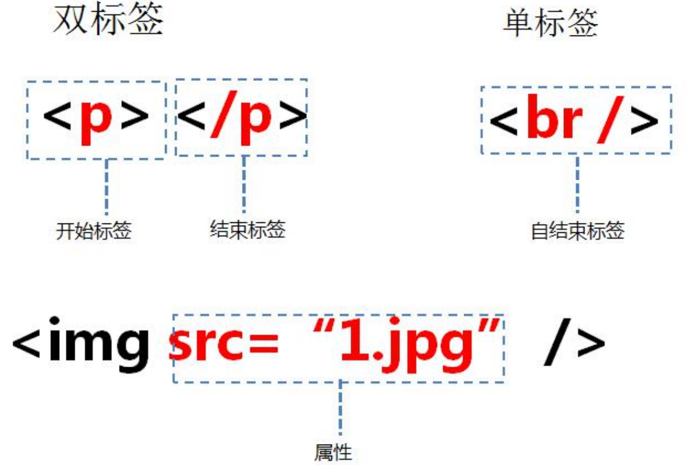
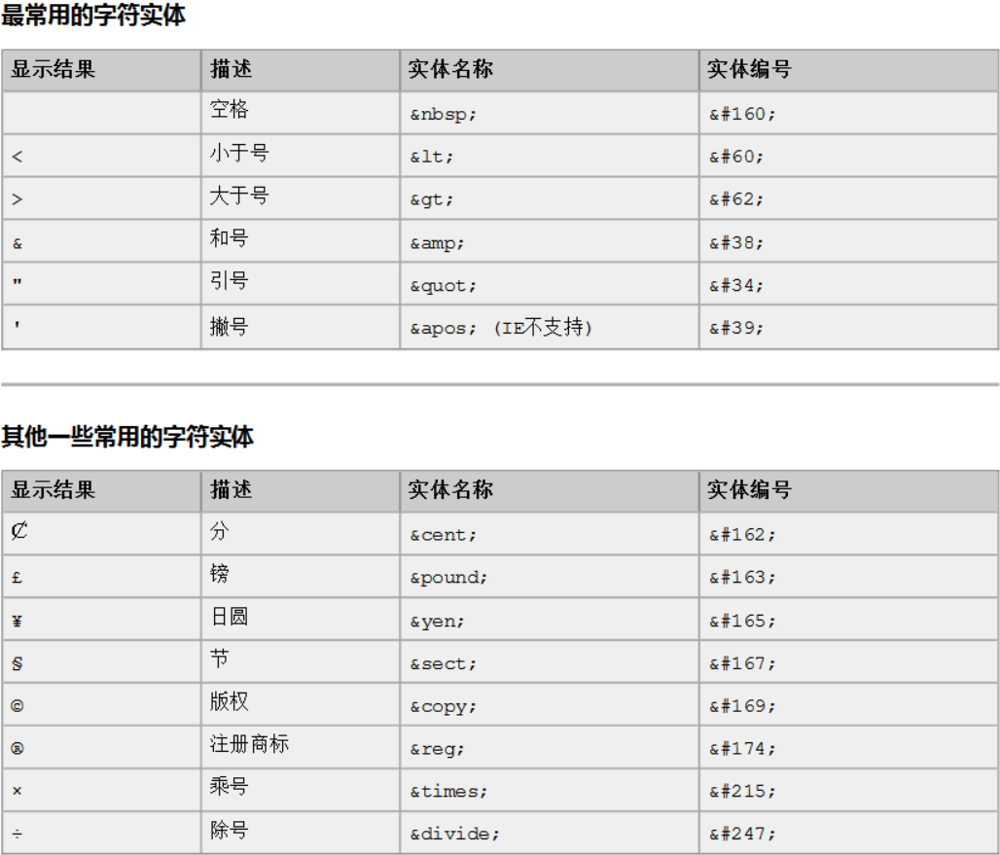

# Day9

需求：

完成登录的模块

1、在前端需要输入用户名和密码，在后端进行接收，处理数据！

2、在后端进行一个数据的校验，校验成功之后，响应数据给浏览器端！

Servlet(不会系统的讲) + jsp + oop(面向对象) + Tomcat

搭建工程的步骤：

1、创建动态的web工程

2、引入servlet相关的依赖（jar包)

3、创建包，写一个Servlet类，配置后端资源路径(浏览器可以访问到的资源)

4、我们需要给Tomcat也添加一份jar包依赖

5、编写前端页面（html + css）

     网页的组成部分：html（网页的架构） + css（网页的样式） + js（网页的动态交互）

6、处理后端逻辑

    将web工程打成一个War包，部署在tomcat上面，如果想访问这个过程，我们要提供一个工程路径

    工程/有很多资源

    如果想访问一个工程下面具体的资源，那么一定要针对这些资源做一个资源路径的配置

    [http://localhost:8081/工程路径/资源路径](http://localhost:8081/工程路径/资源路径)  localhost本地的（127.0.0.1）

    [www.baidu.com](http://www.baidu.com) 192.168.xx 域名 每一个域名都会去映射一个ip地址

    全类名组成部分 包名com.ygkj.servlet + 类名LoginServlet

    com.ygkj.servlet.LoginServlet

    com.ygkj.servlet.LoginServlet

### 前端开发流程

1. 美术实现（Ps）网页设计师根据需求设计网页
2. 前端工程师（HTML）前端_工程师将设计做成静态网页
3. java程序员（JSP）后台工程师将静态网页修改为动态网页
### 网页的组成部分

* 页面由三部分内容组成!
  分别是内容(结构)、表现、行为。
    * 内容(结构)，是我们在页面中可以看到的数据。我们称之为内容。-般内容我们使用html技术来展示。
    * 表现，指的是这些内容在页面上的展示形式。比如说。布局，颜色，大小等等。一般使用CSS技术实现。
    * 行为，指的是页面中元素与输入设备交互的响应。一般使用javascript技术实现。
### HTML简介

* Hjyper Text Markup Language ( 超文本标记语言)，简写: HTML
* HTML通过标签来标记要显示的网页中的各个部分。网页文件本身是一种文本文件，通过在文本文件中添加标记符，可以告诉浏览器如何显示其中的内容(如:文字如何处理，画面如何安排，图片如何显示等)
### HTML 文件的书写规范

```xml
<html>                 表示整个 html 页面的开始
  <head>               头信息
    <title>标题</title> 标题
  </head>
  <body>                body 是页面的主体内容
    页面主体内容
  </body>
</html>                 表示整个 html 页面的结束
 Html 的代码注释 <!-- 这是 html 注释，可以在页面右键查看源代码中看到 -->
```

### HTML 标签介绍 

1. 标签的格式: <标签名>封装的数据</标签名> 
2. 标签名大小写不敏感。 
3. 标签拥有自己的属性。 
    1. 分为基本属性：bgcolor="red" 
    可以修改简单的样式效果
    2. 事件属性： onclick="alert('你好！');" 
    可以直接设置事件响应后的代码。 
4. 标签又分为，单标签和双标签。 
    1. 单标签格式： <标签名 /> 
    br 换行 hr 水平线
    2. 双标签格式: <标签名> ...封装的数据...</标签名>



### 标签的语法

```xml
<!-- ①标签不能交叉嵌套 -->
正确：<div><span>早安，尚硅谷</span></div>
错误：<div><span>早安，尚硅谷</div></span>
<hr />
<!-- ②标签必须正确关闭 -->
<!-- i.有文本内容的标签： -->
正确：<div>早安，尚硅谷</div>
错误：<div>早安，尚硅谷
<hr />
<!-- ii.没有文本内容的标签： -->
正确：<br />
错误：<br>
<hr />
<!-- ③属性必须有值，属性值必须加引号 -->
正确：<font color="blue">早安，尚硅谷</font>
错误：<font color=blue>早安，尚硅谷</font>
错误：<font color>早安，尚硅谷</font>
<hr />
<!-- ④注释不能嵌套 -->
正确：<!-- 注释内容 --> <br/>
错误：<!-- <!-- 这是错误的 html 注释 --> -->
<hr />

```
**注意事项：** html 代码不是很严谨。有时候标签不闭合，也不会报错。
### 常用标签介绍

#### font 字体标签

```xml
<body>
<!-- 字体标签
需求 1：在网页上显示 我是字体标签 ，并修改字体为 宋体，颜色为红色。
font 标签是字体标签,它可以用来修改文本的字体,颜色,大小(尺寸)
  color 属性修改颜色
  face 属性修改字体
  size 属性修改文本大小
-->
  <font color="red" face="宋体" size="7">我是字体标签</font>
</body>
```

#### 特殊字符

```xml
<body>
<!-- 特殊字符
需求 1：把 <br> 换行标签 变成文本 转换成字符显示在页面上
常用的特殊字符:
  < ===>>>>  &lt;
  > ===>>>>  &gt;
  空格 ===>>>>  &nbsp;
-->
  我是<br>标签<br/>
  国哥好&nbsp;&nbsp;&nbsp;&nbsp;&nbsp;&nbsp;&nbsp;&nbsp;&nbsp;帅啊!
</body>
```


#### 标题标签

```xml
<body>
<!-- 标题标签
需求 1：演示标题 1 到 标题 6 的
h1 - h6 都是标题标签
h1 最大
h6 最小
  align 属性是对齐属性
    left 左对齐(默认)
    center  中
    right 右对齐
-->
  <h1 align="left">标题 1</h1>
  <h2 align="center">标题 2</h2>
  <h3 align="right">标题 3</h3>
  <h4>标题 4</h4>
  <h5>标题 5</h5>
  <h6>标题 6</h6>
  <h7>标题 7</h7>
</body>
```
#### 超链接（重点）

```xml
<body>
<!-- 
a 标签是 超链接
  href 属性设置连接的地址
  target 属性设置哪个目标进行跳转
  _self 表示当前页面(默认值)
  _blank 表示打开新页面来进行跳转
-->
  <a href="http://localhost:8080">百度</a><br/>
  <a href="http://localhost:8080" target="_self">百度_self</a><br/>
  <a href="http://localhost:8080" target="_blank">百度_blank</a><br/>
</body>
```
#### 列表标签

```xml
<body>
<!--需求 1：使用无序，列表方式，把东北 F4，赵四，刘能，小沈阳，宋小宝，展示出来
ul 是无序列表
  type 属性可以修改列表项前面的符号
li 是列表项
-->
  <ul type="none">
    <li>赵四</li>
    <li>刘能</li>
    <li>小沈阳</li>
    <li>宋小宝</li>
  </ul>
</body>
```

#### img标签

```xml
<body>
<!--需求 1：使用 img 标签显示一张美女的照片。并修改宽高，和边框属性
img 标签是图片标签,用来显示图片
  src 属性可以设置图片的路径
  width 属性设置图片的宽度
  height 属性设置图片的高度
  border 属性设置图片边框大小
  alt 属性设置当指定路径找不到图片时,用来代替显示的文本内容在 
JavaSE 中路径也分为相对路径和绝对路径.
  相对路径:从工程名开始算
  绝对路径:盘符:/目录/文件名
在 web 中路径分为相对路径和绝对路径两种
  相对路径:
    . 表示当前文件所在的目录
    .. 表示当前文件所在的上一级目录
    文件名 表示当前文件所在目录的文件,相当于 ./文件名 ./ 可以省略
  绝对路径:
    正确格式是: http://ip:port/工程名/资源路径
    错误格式是: 盘符:/目录/文件名
-->
  
  
  
  
  
  
</body>
```
#### 表格标签（重点）

```xml
<body>
<!--
需求 1：做一个 带表头的 ，三行，三列的表格，并显示边框
需求 2：修改表格的宽度，高度，表格的对齐方式，单元格间距。
table 标签是表格标签
  border 设置表格标签
  width 设置表格宽度
  height 设置表格高度
  align 设置表格相对于页面的对齐方式
  cellspacing 设置单元格间距
  
tr 是行标签
th 是表头标签
td 是单元格标签
  align 设置单元格文本对齐方式
  
b 是加粗标签
-->
  <table align="center" border="1" width="300" height="300" cellspacing="0">
    <tr>
      <th>1.1</th>
      <th>1.2</th>
      <th>1.3</th>
    </tr>
    <tr>
      <td>2.1</td>
      <td>2.2</td>
      <td>2.3</td>
    </tr>
    <tr>
      <td>3.1</td>
      <td>3.2</td>
      <td>3.3</td>
    </tr>
  </table>
</body>
```
#### 跨行跨列表格（次重点）

```xml
<body>
<!-- 需求 1：
  新建一个五行，五列的表格，
  第一行，第一列的单元格要跨两列，
  第二行第一列的单元格跨两行，
  第四行第四列的单元格跨两行两列。
  colspan 属性设置跨列
  rowspan 属性设置跨行
-->
  <table width="500" height="500" cellspacing="0" border="1">
    <tr>
      <td colspan="2">1.1</td>
      <td>1.3</td>
      <td>1.4</td>
      <td>1.5</td>
    </tr>
    <tr>
      <td rowspan="2">2.1</td>
      <td>2.2</td>
      td>2.3</td>
      <td>2.4</td>
      <td>2.5</td>
    </tr>
    <tr>
      <td>3.2</td>
      <td>3.3</td>
      <td>3.4</td>
      <td>3.5</td>
    </tr>
  </table>
</body>
```
#### 了解iframe框架标签（内嵌窗口）

```xml
<body>
  我是一个单独的完整的页面<br/><br/>
<!--ifarme 标签可以在页面上开辟一个小区域显示一个单独的页面
      ifarme 和 a 标签组合使用的步骤:
        1.在 iframe 标签中使用 name 属性定义一个名称
        2.在 a 标签的 target 属性上设置 iframe 的 name 的属性值
-->
  <iframe src="3.标题标签.html" width="500" height="400" name="abc"></iframe>
  <br/>
  <ul>
    <li><a href="0-标签语法.html" target="abc">0-标签语法.html</a></li>
    <li><a href="1.font 标签.html" target="abc">1.font 标签.html</a></li>
    <li><a href="2.特殊字符.html" target="abc">2.特殊字符.html</a></li></ul>
</body>
```
#### 表单标签（重点）

```xml
<body>
<!--需求 1:创建一个个人信息注册的表单界面。包含用户名，密码，确认密码。性别（单选），兴趣爱好（多选），国籍（下拉列表）。
隐藏域，自我评价（多行文本域）。重置，提交。-->
<!--
  form 标签就是表单
  input type=text 是文件输入框
    value 设置默认显示内容
  input type=password 是密码输入框
    value 设置默认显示内容
  input type=radio 是单选框
    name 属性可以对其进行分组
    checked="checked"表示默认选中
  input type=checkbox 是复选框
    checked="checked"表示默认选中
  input type=reset 是重置按钮
    value 属性修改按钮上的文本
  input type=submit 是提交按钮
    value 属性修改按钮上的文本
  input type=button 是按钮
    value 属性修改按钮上的文本
  input type=file 是文件上传域
  input type=hidden 是隐藏域
    当我们要发送某些信息，而这些信息，不需要用户参与，就可以使用隐藏域
    （提交的时候同时发送给服务器）

  select 标签是下拉列表框
  option 标签是下拉列表框中的选项
    selected="selected"设置默认选中
  textarea 表示多行文本输入框 （起始标签和结束标签中的内容是默认值）
    rows 属性设置可以显示几行的高度
    cols 属性设置每行可以显示几个字符宽度
-->
  <form>
    用户名称：<input type="text" value="默认值"/><br/>
    用户密码：<input type="password" value="abc"/><br/>
    确认密码：<input type="password" value="abc"/><br/>
    性别：<input type="radio" name="sex"/>男
         <input type="radio" name="sex" checked="checked" />女<br/>
    兴趣爱好：<input type="checkbox" checked="checked" />Java
             <input type="checkbox" />JavaScript
             <inputtype="checkbox" />C++<br/>
    国籍：<select>
           <option>--请选择国籍--</option>
           <option selected="selected">中国</option>
           <option>美国</option>
           <option>小日本</option>
         </select><br/>
    自我评价：<textarea rows="10" cols="20">我才是默认值</textarea><br/>
    <input type="reset" value="abc" />
    <input type="submit"/>
  </form>
</body>
```
**还可以将表单放入表格当中，就会自动对齐，显得美观**
**表单提交细节（get与post）**

```xml
<body>
<!--
  form 标签是表单标签
    action 属性设置提交的服务器地址
    method 属性设置提交的方式 GET(默认值)或 POST
    
  表单提交的时候，数据没有发送给服务器的三种情况：
    1、表单项没有 name 属性值
    2、单选、复选（下拉列表中的 option 标签）都需要添加 value 属性，以便发送给服务器
    3、表单项不在提交的 form 标签中
    
  GET 请求的特点是：
    1、浏览器地址栏中的地址是：action 属性[+?+请求参数]
      请求参数的格式是：name=value&name=value
    2、不安全
    3、它有数据长度的限制
  POST 请求的特点是：
    1、浏览器地址栏中只有 action 属性值
    2、相对于 GET 请求要安全
    3、理论上没有数据长度的限制
-->
  <form action="http://localhost:8080" method="post">
    <input type="hidden" name="action" value="login" />
    <h1 align="center">用户注册</h1>
    <table align="center">
      <tr>
        <td> 用户名称：</td>
        <td>
          <input type="text" name="username" value="默认值"/>
        </td>
      </tr>
      <tr>
        <td> 用户密码：</td>
        <td>
          <input type="password" name="password" value="abc"/>
        </td>
      </tr>
      <tr>
        <td>性别：</td>
        <td>
          <input type="radio" name="sex" value="boy"/>男
          <input type="radio" name="sex" checked="checked" value="girl" />女
        </td>
      </tr>
      <tr>
        <td> 兴趣爱好：</td>
        <td>
          <input name="hobby" type="checkbox" checked="checked" value="java"/>Java
          <input name="hobby" type="checkbox" value="js"/>JavaScript
          <input name="hobby" type="checkbox" value="cpp"/>C++
        </td>
      </tr>
      <tr>
        <td>国籍：</td>
        <td>
          <select name="country">
            <option value="none">--请选择国籍--</option>
            <option value="cn" selected="selected">中国</option>
            <option value="usa">美国</option>
            <option value="jp">小日本</option>
          </select>
        </td>
      </tr>
      <tr>
        <td>自我评价：</td>
        <td>
          <textarea name="desc" rows="10" cols="20">我才是默认值
          </textarea>
        </td>
      </tr>
      <tr>
        <td><input type="reset" /></td>
        <td align="center"><input type="submit"/></td>
      </tr>
    </table>
  </form>
</body>
```
#### 其他标签

```xml
<body>
  <!--需求 1：div、span、p 标签的演示
    div 标签 默认独占一行
    span 标签 它的长度是封装数据的长度
    p 段落标签 默认会在段落的上方或下方各空出一行来（如果已有就不再空）
-->
  <div>div 标签 1</div>
  <div>div 标签 2</div>
  <span>span 标签 1</span>
  <span>span 标签 2</span>
  <p>p 段落标签 1</p>
  <p>p 段落标签 2</p>
</body>
```


