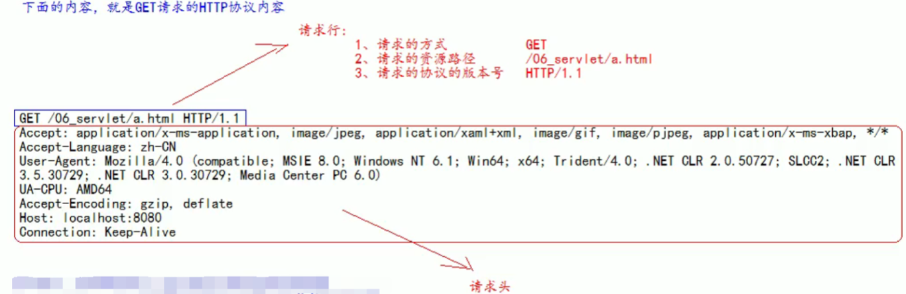
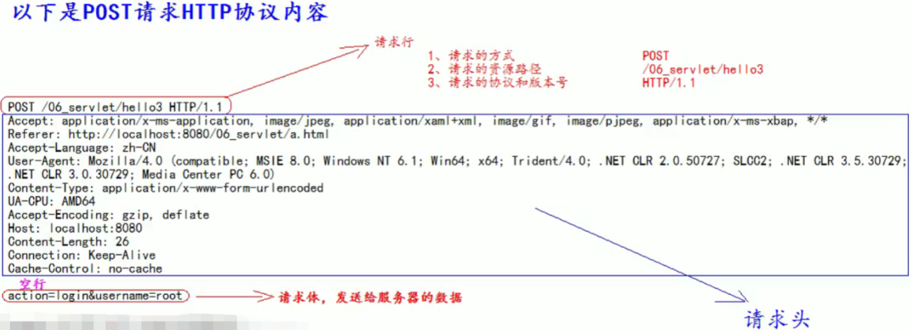
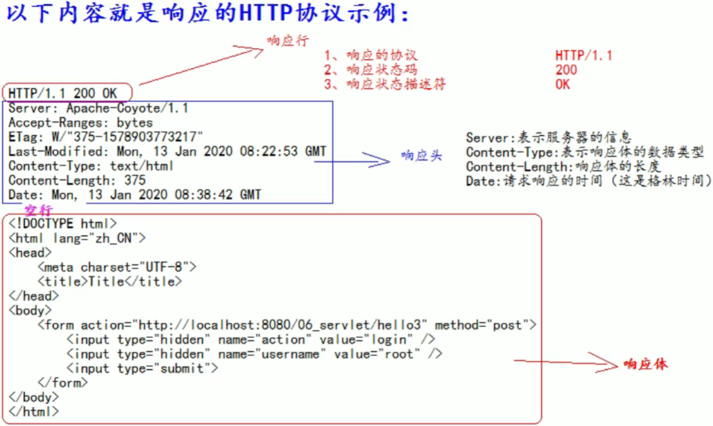
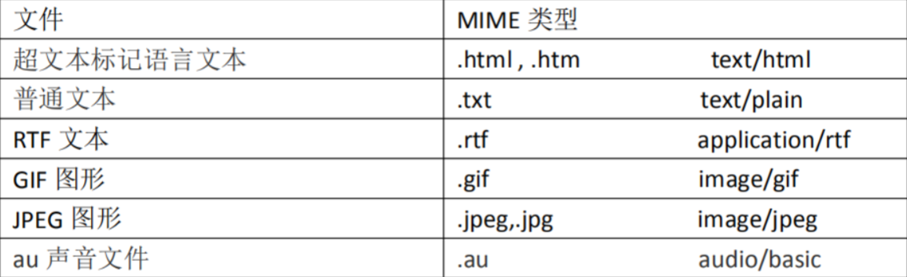
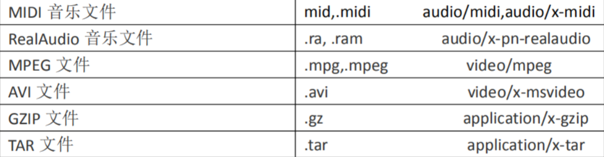
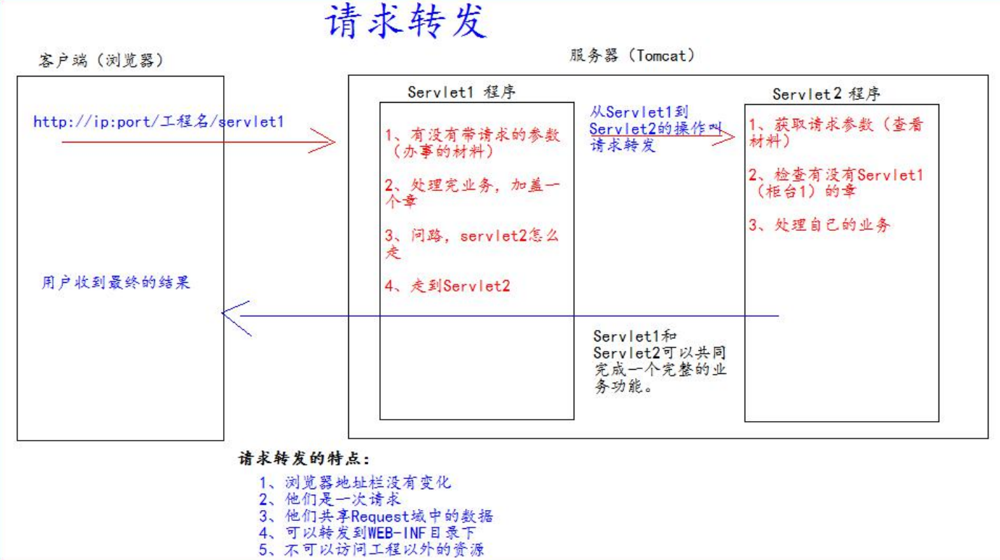
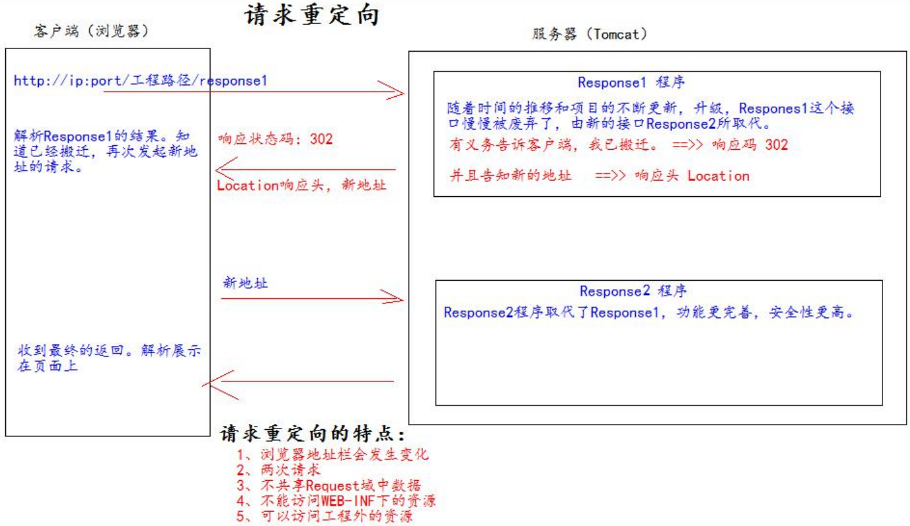
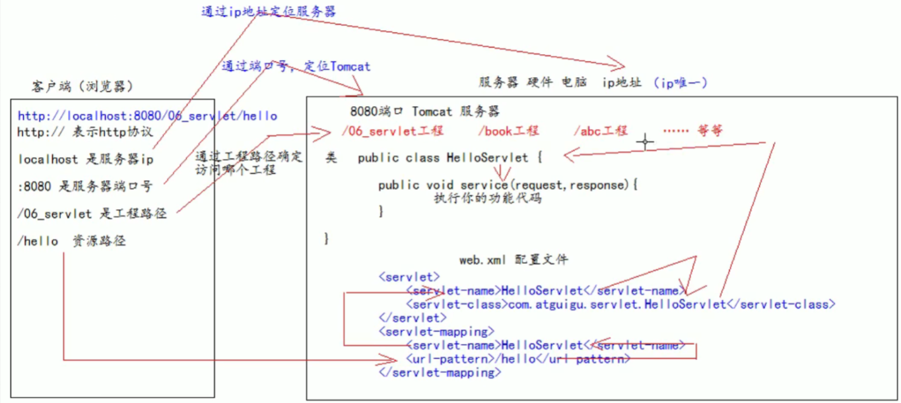
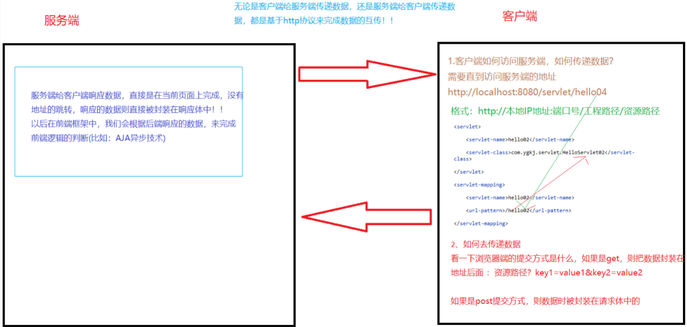
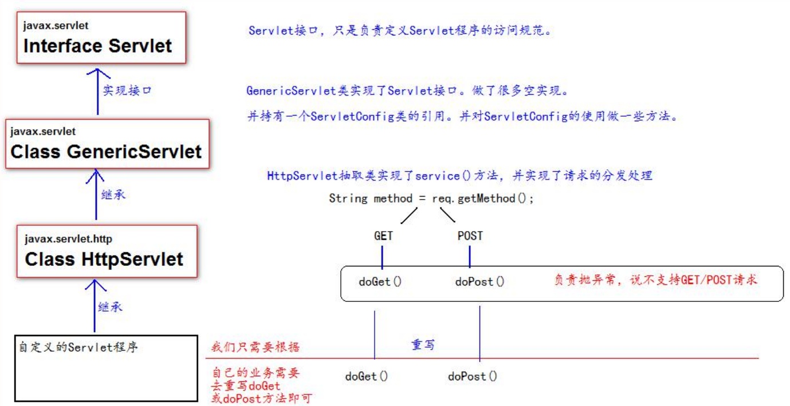

# HTTP协议

## 1、什么是 HTTP 协议 

* 什么是协议? 

协议是指双方，或多方，相互约定好，大家都需要遵守的规则，叫协议。 

* 所谓 HTTP 协议，就是指，客户端和服务器之间通信时，发送的数据，需要遵守的规则，叫 HTTP 协议。 
* HTTP 协议中的数据又叫报文。 

## 2、请求的 HTTP 协议格式 

* 客户端给服务器发送数据叫请求。 
* 服务器给客户端回传数据叫响应。 
* 请求又分为 GET 请求，和 POST 请求两种

### 2.1GET 请求 

1. 请求行 
   1. 请求的方式：GET 
   2. 请求的资源路径[+?+请求参数] 
   3. 请求的协议的版本号：HTTP/1.1 
1. 请求头 

key : value 组成 不同的键值对，表示不同的含义。



**注：**

Accept：告诉服务器，客户端可以接收的数据类型

Accept-Language：告诉服务器客户端可以接收的语言类型

zh_ _CN：中文中国

en_ _US：英文美国

User-Agent：就是浏览器的信息

Accept-Encoding：告诉服务器，客户端可以接收的数据编码(压缩)格式.

Host：表示请求的服务器ip和端口号

Connection：告诉服务器请求连接如何处理

Keep-Alive：告诉服务 器回传数据不要马上关闭，保持一小段时间的连接

CIosed：马上关闭

### 2.2POST 请求 

1. 请求行
   1. 请求的方式 POST 
   2. 请求的资源路径[+?+请求参数] 
   3. 请求的协议的版本号 HTTP/1.1 
2. 请求头
   key : value 不同的请求头，有不同的含义 
   空行 
3. 请求体 ===>>> 就是发送给服务器的数据



**注：**

Accept：表示客户端可以接收的数据类型

Accept-Language：表示客户端可以接收的语言类型

Referer：表示请求发起时，浏览器地址栏中的地址(从哪来)

User-Agent：表示浏览器的信息

Content-Type：表示发送的数据的类型

​	application/x- www- form-urIencoded

​		表示提交的数据格式是: name=value&name=value,然后对其进行urI编码

​		urI编码是把非英文内容转换为：%xx%xx

​	multipart/form-data

​		表示以多段的形式提交数据给服务器(以流的形式提交，用于上传)

Content-Lnegth：表示发送的数据的长度

Cache -Control：表示如何控制缓存 no-cache不缓存

### 2.3post与get请求的区别

get请求方式会将数据封装在地址上，post请求方式会将数据封装在请求体中。因此post请求方式比较安全，而且post请求方式能传递的数据大小比get大。所以推荐使用post

### 2.4常用请求头的说明 

Accept：表示客户端可以接收的数据类型 

Accpet-Languege：表示客户端可以接收的语言类型 

User-Agent：表示客户端浏览器的信息 

Host：表示请求时的服务器 ip 和端口号 

### 2.5哪些是 GET 请求，哪些是 POST 请求 

* GET 请求有哪些： 

1. form 标签 method=get 
2. a 标签 
3. link 标签引入 css 
4. Script 标签引入 js 文件 
5. img 标签引入图片 
6. iframe 引入 html 页面 
7. 在浏览器地址栏中输入地址后敲回车 

* POST 请求有哪些： 
  * form 标签 method=post

## 3、响应的 HTTP 协议格式 

1. 响应行 
   1. 响应的协议和版本号 
   2. 响应状态码 
   3. 响应状态描述符 
2. 响应头 
   key : value 不同的响应头，有其不同含义 
   空行 
3. 响应体 ---->>> 就是回传给客户端的数据



**注：**

Server：表示服务器的信息

Content-Type：表示响应体的数据类型

Content-Length：响应体的长度

Date：请求响应的时间(这是格林时间)

## 4、常用的响应码说明 

200 表示请求成功 

302 表示请求重定向（明天讲） 

404 表示请求服务器已经收到了，但是你要的数据不存在（请求地址错误） 

500 表示服务器已经收到请求，但是服务器内部错误（代码错误）

## 5、MIME 类型说明 

**MIME 是 HTTP 协议中数据类型。** 

MIME 的英文全称是"Multipurpose Internet Mail Extensions" 多功能 Internet 邮件扩充服务。MIME 类型的格式是“大类型/小 类型”，并与某一种文件的扩展名相对应。 

* 常见的 MIME 类型： 





# HttpServletRequest 类 

## 1、HttpServletRequest 类有什么作用。 

每次只要有请求进入Tomcat服务器，Tomcat服务器就会把请求过来的HTTP协议信息解析好封装到Request对象中。然后传递到service方法（doGet和doPost）中给我们使用。我们可以通过HttpServletRequest对象，获取到所有请求的信息。 

## 2、HttpServletRequest 类的常用方法 

1. getRequestURI() 获取请求的资源路径 
2. getRequestURL() 获取请求的统一资源定位符（绝对路径） 
3. getRemoteHost() 获取客户端的 ip 地址 
4. getHeader() 获取请求头 
5. getParameter() 获取请求的参数 
6. getParameterValues() 获取请求的参数（一个键对应多个值的时候使用，例如什么复选框）
7. getMethod() 获取请求的方式 GET 或 POST 
8. setAttribute(key, value); 设置域数据 
9. getAttribute(key); 获取域数据 
10. getRequestDispatcher() 获取请求转发对象

* 常用API示例代码

```java
public class RequestAPIServlet extends HttpServlet {
  @Override
  protected void doGet(HttpServletRequest req, HttpServletResponse resp) 
      throws ServletException,IOException {
// i.getRequestURI() 获取请求的资源路径
    System.out.println("URI => " + req.getRequestURI());
// ii.getRequestURL() 获取请求的统一资源定位符（绝对路径）
    System.out.println("URL => " + req.getRequestURL());// iii.getRemoteHost() 获取客户端的 ip 地址
/**
* 在 IDEA 中，使用 localhost 访问时，得到的客户端 ip 地址是 ===>>> 127.0.0.1<br/>
* 在 IDEA 中，使用 127.0.0.1 访问时，得到的客户端 ip 地址是 ===>>> 127.0.0.1<br/>
* 在 IDEA 中，使用 真实 ip 访问时，得到的客户端 ip 地址是 ===>>> 真实的客户端 ip 地址<br/>
*/
    System.out.println("客户端 ip 地址 => " + req.getRemoteHost());
// iv.getHeader() 获取请求头
    System.out.println("请求头 User-Agent ==>> " + req.getHeader("User-Agent"));
// vii.getMethod() 获取请求的方式 GET 或 POST
    System.out.println( "请求的方式 ==>> " + req.getMethod() );
// 获取请求的参数，获取客户端传递过来的数据
    String parameter1 = request.getParameter("key1");
// 通过请求对象来接收value有多个的key
    String[] hobbies = request.getParameterValues("hobby");
    for (String hobby : hobbies) {
        System.out.println(hobby);
    }
  }
}
```

## 3、如何获取请求参数

* 表单

```xml
<body>
  <form action="http://localhost:8080/07_servlet/parameterServlet" method="get">
    用户名：<input type="text" name="username"><br/>
    密码：<input type="password" name="password"><br/>
    兴趣爱好：<input type="checkbox" name="hobby" value="cpp">C++
    <input type="checkbox" name="hobby" value="java">Java
    <input type="checkbox" name="hobby" value="js">JavaScript<br/>
    <input type="submit">
  </form>
</body>
```

* 代码

```java
public class ParameterServlet extends HttpServlet {
  @Override
  protected void doGet(HttpServletRequest req, HttpServletResponse resp) 
    throws ServletException,IOException {
// 获取请求参数
    String username = req.getParameter("username");
    String password = req.getParameter("password");
    String[] hobby = req.getParameterValues("hobby");
    System.out.println("用户名：" + username);
    System.out.println("密码：" + password);
    System.out.println("兴趣爱好：" + Arrays.asList(hobby));}
  }
}
```

## 4、doGet请求的中文乱码问题的解决

```java
// 获取请求参数
String username = req.getParameter("username");
//1 先以 iso8859-1 进行编码
//2 再以 utf-8 进行解码
username = new String(username.getBytes("iso-8859-1"), "UTF-8");
```

## 5、doPost请求的中文乱码问题的解决

```java
@Override
protected void doPost(HttpServletRequest req, HttpServletResponse resp) 
  throws ServletException,IOException {
// 设置请求体的字符集为 UTF-8，从而解决 post 请求的中文乱码问题
  req.setCharacterEncoding("UTF-8");
  System.out.println("-------------doPost------------");
// 获取请求参数
  String username = req.getParameter("username");
  String password = req.getParameter("password");
  String[] hobby = req.getParameterValues("hobby");
  System.out.println("用户名：" + username);
  System.out.println("密码：" + password);
  System.out.println("兴趣爱好：" + Arrays.asList(hobby));
}
```

## 6、请求的转发

什么是请求的转发? 

请求转发是指，服务器收到请求后，从一次资源跳转到另一个资源的操作叫请求转发。



### 请求转发的特点

1. 浏览器地址栏没有变化
2. 他们是一次请求
3. 他们共享Request域中的数据
4. 可以转发到WEB-INF目录下
5. 不可以访问工程以外的资源
6. 请求转发要求相对路径

* Servlet1代码

```java
public class Servlet1 extends HttpServlet {
@Override
  protected void doGet(HttpServletRequest req, HttpServletResponse resp) 
    throws ServletException,IOException {
// 获取请求的参数（办事的材料）查看
    String username = req.getParameter("username");
    System.out.println("在 Servlet1（柜台 1）中查看参数（材料）：" + username);
// 给材料 盖一个章，并传递到 Servlet2（柜台 2）去查看
    req.setAttribute("key1","柜台 1 的章");
// 问路：Servlet2（柜台 2）怎么走
/**
* 请求转发必须要以斜杠打头，/ 斜杠表示地址为：http://ip:port/工程名/ , 映射到 IDEA 代码的 web 目录
<br/>
*
*/
    RequestDispatcher requestDispatcher = req.getRequestDispatcher("/servlet2");
// RequestDispatcher requestDispatcher = req.getRequestDispatcher("http://www.baidu.com");
// 走向 Sevlet2（柜台 2）
    requestDispatcher.forward(req,resp);}
  }
}
```

* Servlet2代码

```java
public class Servlet2 extends HttpServlet {
  @Override
  protected void doGet(HttpServletRequest req, HttpServletResponse resp) 
    throws ServletException,IOException {
// 获取请求的参数（办事的材料）查看
    String username = req.getParameter("username");
    System.out.println("在 Servlet2（柜台 2）中查看参数（材料）：" + username);
// 查看 柜台 1 是否有盖章
    Object key1 = req.getAttribute("key1");
    System.out.println("柜台 1 是否有章：" + key1);
// 处理自己的业务
    System.out.println("Servlet2 处理自己的业务 ");
  }
}
```

## 7、base标签

当我们点击a标签进行跳转的时候，浏觅器地址栏中的地址是: http://loca lhost: 8080/07_ servlet/a/b/c. html
跳转回去的a标签路径是: ../.. /index. html

所有相对路径在工作时候都会参照当前浏览器地址栏中的地址来进行跳转。

那么参照后得到的地址是:
http://loca lhost:8080/07_ servlet/index. html
正确的跳转路径，

**base标签可以设置当前页面中所有相对路径工作时，参照哪个路径来进行跳转。**

当我们使用请求转发来进行跳转的时候，浏览器地址栏中的地址是：http://loca lhost :8080/07_ _servlet/forwardC
跳转回去的a标签路径是: ../.. /index. html

所有相对路径在工作时候都会参照当前浏览器地址栏中的地址来进行跳转。
那么参照后得到的地址是:
http://localhost : 8080/index. html
错误的路径

```xml
<!DOCTYPE html>
<html lang="zh_CN">
<head>
  <meta charset="UTF-8">
  <title>Title</title>
<!--base 标签设置页面相对路径工作时参照的地址
href 属性就是参数的地址值
-->
  <base href="http://localhost:8080/07_servlet/a/b/">
</head>
<body>
这是 a 下的 b 下的 c.html 页面<br/>
  <a href="../../index.html">跳回首页</a><br/>
</body>
</html>
```

## 8、Web 中的相对路径和绝对路径 

在 javaWeb 中，路径分为相对路径和绝对路径两种： 

相对路径是： 

    * . 表示当前目录 
    * .. 表示上一级目录 
    * 资源名 表示当前目录/资源名 

绝对路径： 

[http://ip:port/](http://ip:port/)工程路径/资源路径 

* 在实际开发中，路径都使用绝对路径，而不简单的使用相对路径。 

1、绝对路径 

2、base+相对

## 9、web 中 / 斜杠的不同意义 

在 web 中 / 斜杠 是一种绝对路径。 

* / 斜杠 如果被浏览器解析，得到的地址是：[http://ip:port/](http://ip:port/) 
  <a href="/">斜杠</a> 
* / 斜杠 如果被服务器解析，得到的地址是：[http://ip:port/](http://ip:port/)工程路径 
  例如：
    * `<url-pattern>/servlet1</url-pattern>` 
    * `servletContext.getRealPath(“/”);` 
    * `request.getRequestDispatcher(“/”);` 

特殊情况：response.sendRediect(“/”); 把斜杠发送给浏览器解析。得到 [http://ip:port/](http://ip:port/)

# HttpServletResponse 类 

## 1、HttpServletResponse 类的作用 

HttpServletResponse 类和 HttpServletRequest 类一样。每次请求进来，Tomcat 服务器都会创建一个 Response 对象传 递给 Servlet 程序去使用。HttpServletRequest 表示请求过来的信息，HttpServletResponse 表示所有响应的信息， 我们如果需要设置返回给客户端的信息，都可以通过 HttpServletResponse 对象来进行设置

## 2、两个输出流的说明 

1. 字节流 getOutputStream(); 常用于下载（传递二进制数据） 
2. 字符流 getWriter(); 常用于回传字符串（常用） 

* 两个流同时只能使用一个。 使用了字节流，就不能再使用字符流，反之亦然，否则就会报错。

## 3、如何往客户端回传数据

要求 ： 往客户端回传 字符串 数据。

```java
public class ResponseIOServlet extends HttpServlet {
  @Override
  protected void doGet(HttpServletRequest req, HttpServletResponse resp) 
    throws ServletException,IOException {
// 要求 ： 往客户端回传 字符串 数据。
    PrintWriter writer = resp.getWriter();
    writer.write("response's content!!!");
  }
}
```

## 4、响应的乱码解决

* 解决响应中文乱码方案一（不推荐使用）：

```java
// 设置服务器字符集为 UTF-8
resp.setCharacterEncoding("UTF-8");
// 通过响应头，设置浏览器也使用 UTF-8 字符集
resp.setHeader("Content-Type", "text/html; charset=UTF-8");
```

* 解决响应中文乱码方案二（推荐）：

```java
// 它会同时设置服务器和客户端都使用 UTF-8 字符集，还设置了响应头
// 此方法一定要在获取流对象之前调用才有效
resp.setContentType("text/html; charset=UTF-8");
```

# 请求重定向 

请求重定向，是指客户端给服务器发请求，然后服务器告诉客户端说。我给你一些地址。你去新地址访问。叫请求重定向（因为之前的地址可能已经被废弃）。 



### 请求重定向的特点:

1. 浏览器地址栏会发生变化
2. 两次请求
3. 不共享Request城中数据
4. 不能访问WEB-INF下的资源
5. 可以访问工程外的资源
6. 请求重定向要求绝对路径

* 请求重定向的第一种方案：

```java
// 设置响应状态码 302 ，表示重定向，（已搬迁）
resp.setStatus(302);
// 设置响应头，说明 新的地址在哪里
resp.setHeader("Location", "http://localhost:8080"); 
```

* 请求重定向的第二种方案：

```java
resp.sendRedirect("http://localhost:8080");
```

## 请求转发与请求重定向的区别：

request除了可以作为请求对象之外，还可以作为域对象，但是该域对象的取值范围，是-次请求范围之类!

* 请求转发:内部资源的跳转，通过浏览器发起访问，工程中的资源会从 一个地址跳转到另外一个地址，浏览器的地址不会发生改变! 
* 请求重定向:也可以完成内部资源的跳转，而且浏览器的地址是会发生改变的,这种情况下我们是不能取到request域中的数据的! !

# Servlet技术

## 1、什么是 Servlet 

1、Servlet 是 JavaEE 规范之一。规范就是接口 

2、Servlet 就 JavaWeb 三大组件之一。三大组件分别是：Servlet 程序、Filter 过滤器、Listener 监听器。 

3、Servlet 是运行在服务器上的一个 java 小程序，它可以接收客户端发送过来的请求，并响应数据给客户端。 

## 2、手动实现 Servlet 程序 

1、编写一个类去实现 Servlet 接口 

2、实现 service 方法，处理请求，并响应数据 

3、到 web.xml 中去配置 servlet 程序的访问地址

web.xml 中的配置：

```xml
< ?xml version="1.0" encoding= "UTF-8"?>
<web- app xm1ns="http: //xmlns. jcp. org/ xml/ns/javaee"
xmIns :xsi="http://www . w3. org/2001/XMLSchema- instance"
xsi:schemaLocation= "http:/ /xmlns. jcp. org/xml/ns/javaee
http://xmIns .jcp. org/ xml/ns/javaee/web-app_ 4_ 0. xsd"
version="4.0">
<!-- servlet标签给Tomcat配置Servlet程序-->
  <servlet>
<!--servlet-name标签Servlet 程序起一个别名(- -般是类名) -->
    <servlet-name>HelloServlet< / servlet -name>
<!--servlet-class是Servlet程序的全类名-->
    <servlet-class>com. atguigu. servlet . HelloServlet</serv1et-class>
  </serv1et>
<!--servlet-mapping标签给servlet程序配置访问地址 -->
  <serv1et -mapping>
<!--servlet -name标签的作用是告诉服务器，我当前配置的地址给哪个Servlet程序使用-->
    <servlet -name>Hel loServ1et</serv1et- name>
<!--urL-pattern标签配置访问地址<br/>
/斜杠在服务器解析的时候，表示地址为: http://ip:port/I程路径
<br/>
/hello表示地址为: http://ip:port/. 工程路径/hello 
<br/>
-->
    <url-pattern> /hello</url-pattern>
  </servlet -mapping>
</web-app>

```

## 3、从url 地址到 Servlet 程序的访问流程图





## 4、Servlet的生命周期

1. 执行 Servlet 构造器方法 
2. 执行 init 初始化方法 
   第一、二步，只是在第一次访问的时候创建 Servlet 程序会调用。 
3. 执行 service 方法 
   第三步，每次访问都会调用。 
4. 执行 destroy 销毁方法 
   第四步，在 web工程停止的时候调用

## 5、GET和POST请求的分发处理

```java
public class HelloServlet implements Servlet {
/**
* service 方法是专门用来处理请求和响应的
* @param servletRequest
* @param servletResponse
* @throws ServletException
* @throws IOException
*/
@Override
public void service(ServletRequest servletRequest, ServletResponse servletResponse) 
    throws ServletException, IOException {
  System.out.println("3 service === Hello Servlet 被访问了");
// 类型转换（因为它有 getMethod()方法）
  HttpServletRequest httpServletRequest = (HttpServletRequest) servletRequest;
// 获取请求的方式
  String method = httpServletRequest.getMethod();
  if ("GET".equals(method)) {
    doGet();
  } else if ("POST".equals(method)) {
    doPost();
  }
}
/**
* 做 get 请求的操作
*/
  public void doGet(){
    System.out.println("get 请求");
    System.out.println("get 请求");
  }
/**
* 做 post 请求的操作
*/
  public void doPost(){
    System.out.println("post 请求");
    System.out.println("post 请求");
  }
}
```

## 6、通过继承 HttpServlet 实现 Servlet 程序 

一般在实际项目开发中，都是使用继承 HttpServlet 类的方式去实现 Servlet 程序。 

* 编写一个类去继承 HttpServlet 类 
* 根据业务需要重写 doGet 或 doPost 方法 
* 到 web.xml 中的配置 Servlet 程序的访问地址

Servlet 类的代码： 

```java
public class HelloServlet2 extends HttpServlet {
/**
* doGet（）在 get 请求的时候调用
* @param req
* @param resp
* @throws ServletException
* @throws IOException
*/
@Override
  protected void doGet(HttpServletRequest req, HttpServletResponse resp) 
      throws ServletException,IOException {
    System.out.println("HelloServlet2 的 doGet 方法");
  }
/**
* doPost（）在 post 请求的时候调用
* @param req
* @param resp
* @throws ServletException
* @throws IOException
*/
@Override
  protected void doPost(HttpServletRequest req, HttpServletResponse resp) 
      throws ServletException,IOException {
    System.out.println("HelloServlet2 的 doPost 方法");
  }
} 
```

web.xml 中的配置： 

```xml
<servlet>
  <servlet-name>HelloServlet2</servlet-name>
  <servlet-class>com.atguigu.servlet.HelloServlet2</servlet-class>
</servlet>
<servlet-mapping>
  <servlet-name>HelloServlet2</servlet-name>
  <url-pattern>/hello2</url-pattern>
</servlet-mapping>
```

## 7、Serlet类的继承体系



## 8、ServletConfig类

* ServletConfig 类从类名上来看，就知道是 Servlet 程序的配置信息类。 
* Servlet 程序和 ServletConfig 对象都是由 Tomcat 负责创建，我们负责使用。 
* Servlet 程序默认是第一次访问的时候创建，ServletConfig是每个Servlet程序创建时，就创建一个对应的ServletConfig对象。（因此每个Servlet有且只有自己的ServletConfig类）

### 8.1ServletConfig 类的三大作用 

1. 可以获取 Servlet 程序的别名 servlet-name 的值 
2. 获取初始化参数 init-param 
3. 获取 ServletContext 对象

* 在web.xml 中的配置Config初始化得参数：

```xml
<servlet>
  <servlet-name>HelloServlet</servlet-name>
  <servlet-class>com.atguigu.servlet.HelloServlet</servlet-class>
<!--init-param 是初始化参数-->
  <init-param>
<!--是参数名-->
    <param-name>username</param-name>
<!--是参数值-->
    <param-value>root</param-value>
  </init-param>
<!--init-param 是初始化参数-->
  <init-param>
<!--是参数名-->
    <param-name>url</param-name>
<!--是参数值-->
    <param-value>jdbc:mysql://localhost:3306/test</param-value>
  </init-param>
</servlet>
<servlet-mapping>
  <servlet-name>HelloServlet</servlet-name>
  <url-pattern>/hello</url-pattern>
</servlet-mapping>
```

* Servlet中的代码

```java
@Override
public void init(ServletConfig servletConfig) throws ServletException {
  System.out.println("2 init 初始化方法");
// 1、可以获取 Servlet 程序的别名 servlet-name 的值
  System.out.println("HelloServlet 程序的别名是:" + servletConfig.getServletName());
// 2、获取初始化参数 init-param
  System.out.println("初始化参数 username 的值是;" + servletConfig.getInitParameter("username"));
  System.out.println("初始化参数 url 的值是;" + servletConfig.getInitParameter("url"));
// 3、获取 ServletContext 对象
  System.out.println(servletConfig.getServletContext());
}
```


## 9、ServletContext类

### 9.1什么是 ServletContext? 

1. ServletContext 是一个接口，它表示 Servlet 上下文对象 
2. 一个 web 工程，只有一个 ServletContext 对象实例。 
3. ServletContext 对象是一个域对象。 
4. ServletContext 是在 web 工程部署启动的时候创建。在 web 工程停止的时候销毁。 
5. 后面会接触到的域对象：request（该域对象的取值范围是一次请求范围之内）、session（会话对象，会对服务端和客户端进行一个绑定）

#### 什么是域对象? 

域对象，是可以像 Map 一样存取数据的对象，叫域对象。 这里的域指的是存取数据的操作范围，整个web工程。 

|        | 存数据         | 取数据         | 删除数据          |
| :----- | :------------- | :------------- | :---------------- |
| Map    | put()          | get()          | remove()          |
| 域对象 | setAttribute() | getAttribute() | removeAttribute() |

### 9.2ServletContext 类的四个作用

1. 获取 web.xml 中配置的上下文参数 context-param （全局的）
2. 获取当前的工程路径，格式: /工程路径 
3. 获取工程部署后在服务器硬盘上的绝对路径 
4. 像 Map 一样存取数据

* 先在web.xml中配置context-param

```xml
<!--context-param 是上下文参数(它属于整个 web 工程)-->
  <context-param>
    <param-name>username</param-name>
    <param-value>context</param-value>
  </context-param>
<!--context-param 是上下文参数(它属于整个 web 工程)-->
  <context-param>
    <param-name>password</param-name>
    <param-value>root</param-value>
  </context-param>
```

* ServletContext演示代码 

```java
protected void doGet(HttpServletRequest request, HttpServletResponse response) 
    throws ServletException, IOException {
// 1、获取 web.xml 中配置的上下文参数 context-param
  ServletContext context = getServletConfig().getServletContext();
  String username = context.getInitParameter("username");
  System.out.println("context-param 参数 username 的值是:" + username);
  System.out.println("context-param 参数 password 的值是:" +
  context.getInitParameter("password"));
// 2、获取当前的工程路径，格式: /工程路径System.out.println( "当前工程路径:" + context.getContextPath() );
// 3、获取工程部署后在服务器硬盘上的绝对路径
/**
* / 斜杠被服务器解析地址为:http://ip:port/工程名/ 映射到 IDEA 代码的 web 目录<br/>
*/
  System.out.println("工程部署的路径是:" + context.getRealPath("/"));
  System.out.println("工程下 css 目录的绝对路径是:" + context.getRealPath("/css"));
  System.out.println("工程下 imgs 目录 1.jpg 的绝对路径是:" + context.getRealPath("/imgs/1.jpg"));
} 
```

* ServletContext 像 Map 一样存取数据： 

ContextServlet1 代码： 

```java
public class ContextServlet1 extends HttpServlet {
  protected void doGet(HttpServletRequest request, HttpServletResponse response) 
      throws ServletException, IOException {
// 获取 ServletContext 对象
    ServletContext context = getServletContext();
    System.out.println(context);
    System.out.println("保存之前: Context1 获取 key1 的值是:"+ context.getAttribute("key1"));
    context.setAttribute("key1", "value1");
    System.out.println("Context1 中获取域数据 key1 的值是:"+ context.getAttribute("key1"));
  }
}
```

ContextServlet2 代码： 

```java
protected void doGet(HttpServletRequest request, HttpServletResponse response) throws ServletException,
IOException {
  ServletContext context = getServletContext();System.out.println(context);
  System.out.println("Context2 中获取域数据 key1 的值是:"+ context.getAttribute("key1"));
}
```


