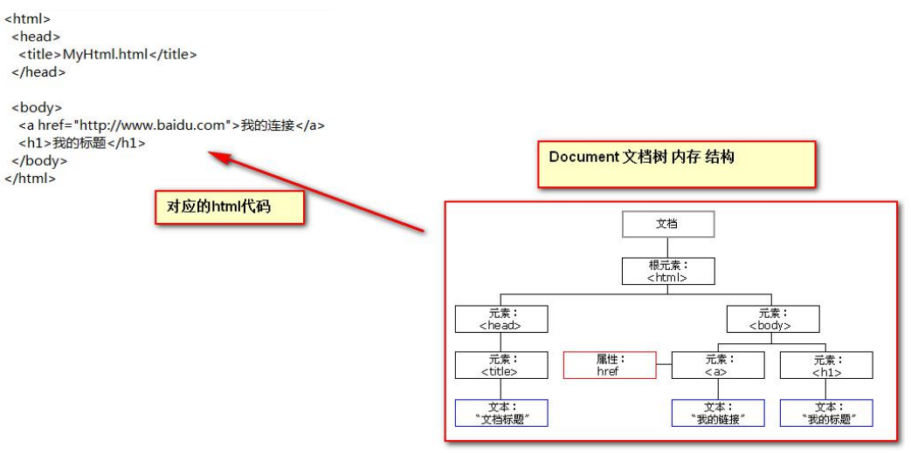

# JavaScript

## 1、JavaScript 介绍 

* Javascript 语言诞生主要是完成页面的数据验证。因此它运行在客户端，需要运行浏览器来解析执行 JavaScript 代码。 
* JS 是 Netscape 网景公司的产品，最早取名为 LiveScript;为了吸引更多 java 程序员。更名为 JavaScript。 
* JS 是弱类型，Java 是强类型。 
* 特点： 

1. 交互性（它可以做的就是信息的动态交互） 

2. 安全性（不允许直接访问本地硬盘） 

3. 跨平台性（只要是可以解释 JS 的浏览器都可以执行，和平台无关） 

## 2、JavaScript 和前端页面代码的结合方式 

### 2.1、第一种方式 

只需要在 head 标签中，或者在 body 标签中， 使用 script 标签 来书写 JavaScript 代码

```javascript
<!DOCTYPE html>
<html lang="en">
<head>
  <meta charset="UTF-8"><title>Title</title>
  <script type="text/javascript">
// alert 是 JavaScript 语言提供的一个警告框函数。
// 它可以接收任意类型的参数，这个参数就是警告框的提示信息
    alert("hello javaScript!");
  </script>
</head>
<body>
</body>
</html>
```
### 2.2、第二种方式 

使用 script 标签引入 单独的 JavaScript 代码文件

* 代码
```javascript
<!--
  现在需要使用 script 引入外部的 js 文件来执行
    src 属性专门用来引入 js 文件路径（只能是相对路径，不可以是绝对路径）
  script 标签可以用来定义 js 代码，也可以用来引入 js 文件
  但是，两个功能二选一使用。不能同时使用两个功能
-->
<script type="text/javascript" src="1.js"></script>
```
## 3、变量  

* JavaScript 的变量类型： 

数值类型： number 

字符串类型： string 

对象类型： object 

布尔类型： boolean 

函数类型： function 

* JavaScript 里特殊的值： 

undefined 未定义，所有 js 变量未赋于初始值的时候，默认值都是 undefined. 

null 空值 

NaN 全称是：Not a Number 非数字,非数值。 

* JS 中的定义变量格式： 

var 变量名; 

var 变量名 = 值; 

### 3.1、关系（比较）运算 

等于： == 等于是简单的做字面值的比较 

全等于： === 除了做字面值的比较之外，还会比较两个变量的数据类型

### 3.2、逻辑运算 

且运算： && 

或运算： || 

取反运算： ! 

* 在 JavaScript 语言中，所有的变量，都可以做为一个 boolean 类型的变量去使用。 
* 0 、null、 undefined、””(空串) 都认为是 false； 
1. && 且运算。 有两种情况：
第一种：当表达式全为真的时候。返回最后一个表达式的值。 
第二种：当表达式中，有一个为假的时候。返回第一个为假的表达式的值 
2. || 或运算 
第一种情况：当表达式全为假时，返回最后一个表达式的值 
第二种情况：只要有一个表达式为真。就会把回第一个为真的表达式的值 
* 并且 && 与运算 和 ||或运算 有短路。短路就是说，当这个&&或||运算有结果了之后 。后面的表达式不再执行 
## 4、数组（重点） 

### 数组定义方式 

JS 中 数组的定义格式： 

var 数组名 = []; // 空数组 

var 数组名 = [1 , ’abc’ , true]; // 定义数组同时赋值元素 

示例代码： 

```javascript
<!DOCTYPE html>
<html lang="en">
<head>
  <meta charset="UTF-8">
  <title>Title</title>
  <script type="text/javascript">
    var arr = [true,1]; // 定义一个空数组
// alert( arr.length ); // 0
    arr[0] = 12;
// alert( arr[0] );//12
// alert( arr.length ); // 0
// javaScript 语言中的数组，只要我们通过数组下标赋值，那么最大的下标值，就会自动的给数组做扩容操作。
    arr[2] = "abc";
    alert(arr.length); //3
// alert(arr[1]);// undefined
// 数组的遍历
    for (var i = 0; i < arr.length; i++){
      alert(arr[i]);
    }
</script>
</head>
<body>
</body>
</html> 
```

## 5、函数(重点) 

### 5.1、函数的二种定义方式 

#### 第一种，可以使用 function 关键字来定义函数。 

使用的格式如下: 

function 函数名(形参列表){ 

函数体 

}

* 在 JavaScript 语言中，想要带有返回值的函数，只需要在函数体内直接使用 return 语句返回值即可！ 
#### 函数的第二种定义方式，格式如下： 

使用格式如下： 

var 函数名 = function(形参列表) {

 函数体

} 

示例代码： 

```javascript
<!DOCTYPE html>
    <html lang="en">
        <head>
        <meta charset="UTF-8">
            <title>Title</title>
<script type="text/javascript">
    var fun = function () {
        alert("无参函数");
    }
// fun();
var fun2 = function (a,b) {
    alert("有参函数 a=" + a + ",b=" + b);
}
// fun2(1,2);
var fun3 = function (num1,num2) {
    return num1 + num2;
}
alert( fun3(100,200) );
</script></head>
    <body>
    </body>
</html> 
```
**注：**在 Java 中函数允许重载。但是在 JS 中函数的重载会直接覆盖掉上一次的定义 
### 5.2、函数的 arguments 隐形参数（只在 function 函数内） 

就是在 function 函数中不需要定义，但却可以直接用来获取所有参数的变量。我们管它叫隐形参数。 

隐形参数特别像 java 基础的可变长参数一样。 

public void fun( Object ... args ); 

可变长参数其他是一个数组。 

那么 js 中的隐形参数也跟 java 的可变长参数一样。操作类似数组。

```javascript
<title>Title</title>
<script type="text/javascript">
        function fun(a) {
        alert( arguments.length );//可看参数个数
        alert( arguments[0] );
        alert( arguments[1] );
        alert( arguments[2] );
        alert("a = " + a);
        for (var i = 0; i < arguments.length; i++){
            alert( arguments[i] );
        }
        alert("无参函数 fun()");
    }
    // fun(1,"ad",true);
    // 需求：要求 编写 一个函数。用于计算所有参数相加的和并返回
    function sum(num1,num2) {
        var result = 0;
        for (var i = 0; i < arguments.length; i++) {
            if (typeof(arguments[i]) == "number") {
                result += arguments[i];
            }
        }
        return result;
    }
    alert( sum(1,2,3,4,"abc",5,6,7,8,9) );
</script>
```

## 6、JS 中的自定义对象（扩展内容） 

### Object 形式的自定义对象 

对象的定义： 

var 变量名 = new Object(); // 对象实例（空对象） 

变量名.属性名 = 值; // 定义一个属性 

变量名.函数名 = function(){} // 定义一个函数 

对象的访问： 

变量名.属性 / 函数名(); 

示例代码： 

```javascript
<script type="text/javascript">
    // 对象的定义：
    // var 变量名 = new Object(); // 对象实例（空对象）
    // 变量名.属性名 = 值; // 定义一个属性
    // 变量名.函数名 = function(){} // 定义一个函数
    var obj = new Object();
obj.name = "华仔";
obj.age = 18;
obj.fun = function () {
    alert("姓名：" + this.name + " , 年龄：" + this.age);
}
// 对象的访问：
// 变量名.属性 / 函数名();
// alert( obj.age );
obj.fun();
</script>
```
### {}花括号形式的自定义对象 

对象的定义： 

var 变量名 = { // 空对象 

属性名：值, // 定义一个属性 

属性名：值, // 定义一个属性 

函数名：function(){} // 定义一个函数 

}; 

对象的访问： 

变量名.属性 / 函数名();

```javascript
<script type="text/javascript">
    // 对象的定义：
    // var 变量名 = { // 空对象
    // 属性名：值, // 定义一个属性
    // 属性名：值, // 定义一个属性
    // 函数名：function(){} // 定义一个函数
    // };
    var obj = {
        name:"国哥",
        age:18,
        fun : function () {
            alert("姓名：" + this.name + " , 年龄：" + this.age);
        }
    };
// 对象的访问：
// 变量名.属性 / 函数名();
alert(obj.name);
obj.fun();
</script>
```
## 7、js中的事件

什么是事件？事件是电脑输入设备与页面进行交互的响应。我们称之为事件。 

### 常用的事件：

onload 加载完成事件： 页面加载完成之后，常用于做页面 js 代码初始化操作 

onclick 单击事件： 常用于按钮的点击响应操作。 

onblur 失去焦点事件： 常用用于输入框失去焦点后验证其输入内容是否合法。 

onchange 内容发生改变事件： 常用于下拉列表和输入框内容发生改变后操作 

onsubmit 表单提交事件： 常用于表单提交前，验证所有表单项是否合法。

### 事件的注册又分为静态注册和动态注册两种： 

什么是事件的注册（绑定）？ 

其实就是告诉浏览器，当事件响应后要执行哪些操作代码，叫事件注册或事件绑定。 

* 静态注册事件：通过 html 标签的事件属性直接赋于事件响应后的代码，这种方式我们叫静态注册。 
* 动态注册事件：是指先通过 js 代码得到标签的 dom 对象，然后再通过 dom 对象.事件名 = function(){} 这种形式赋于事件 响应后的代码，叫动态注册。 

动态注册基本步骤： 

1、获取标签对象 

2、标签对象.事件名 = fucntion(){}

#### onload 加载完成事件 

```javascript
<!DOCTYPE html>
    <html lang="en">
        <head>
        <meta charset="UTF-8">
            <title>Title</title>
<script type="text/javascript">
    // onload 事件的方法
    function onloadFun() {
    alert('静态注册 onload 事件，所有代码');
}
// onload 事件动态注册。是固定写法
window.onload = function () {
    alert("动态注册的 onload 事件");
}
</script>
</head>
<!--静态注册 onload 事件
onload 事件是浏览器解析完页面之后就会自动触发的事件
    <body onload="onloadFun();">
        -->
        <body>
        </body>
</html>
```
#### onclick 单击事件 

```javascript
<!DOCTYPE html>
    <html lang="en">
        <head>
        <meta charset="UTF-8">
            <title>Title</title>
<script type="text/javascript">
    function onclickFun() {
    alert("静态注册 onclick 事件");
}
// 动态注册 onclick 事件
window.onload = function () {
    // 1 获取标签对象
    /*
* document 是 JavaScript 语言提供的一个对象（文档）<br/>
* get 获取
* Element 元素（就是标签）
* By 通过。。 由。。经。。。
* Id id 属性
*
* getElementById 通过 id 属性获取标签对象
**/
    var btnObj = document.getElementById("btn01");
    // alert( btnObj );
    // 2 通过标签对象.事件名 = function(){}
    btnObj.onclick = function () {
        alert("动态注册的 onclick 事件");
    }
}
</script>
</head>
<body>
    <!--静态注册 onClick 事件-->
        <button onclick="onclickFun();">按钮 1</button>
<button id="btn01">按钮 2</button>
</body>
</html>
```
#### onchange 内容发生改变事件 

```javascript
<!DOCTYPE html>
    <html lang="en">
        <head>
        <meta charset="UTF-8">
            <title>Title</title>
<script type="text/javascript">
    function onchangeFun() {
    alert("女神已经改变了");
}
window.onload = function () {
    //1 获取标签对象
    var selObj = document.getElementById("sel01");
    // alert( selObj );
    //2 通过标签对象.事件名 = function(){}
    selObj.onchange = function () {
        alert("男神已经改变了");
    }
}
</script>
</head>
<body>
    请选择你心中的女神：
<!--静态注册 onchange 事件-->
    <select onchange="onchangeFun();">
        <option>--女神--</option>
<option>芳芳</option>
<option>佳佳</option>
<option>娘娘</option>
</select>
请选择你心中的男神：
    <select id="sel01">
        <option>--男神--</option>
<option>国哥</option>
<option>华仔</option>
<option>富城</option>
</select>
</body>
</html>
```
#### onsubmit 表单提交事件 

```javascript
<!DOCTYPE html>
    <html lang="en">
        <head>
        <meta charset="UTF-8">
            <title>Title</title>
<script type="text/javascript" >
    // 静态注册表单提交事务
    function onsubmitFun(){
    // 要验证所有表单项是否合法，如果，有一个不合法就阻止表单提交
    alert("静态注册表单提交事件----发现不合法");
    return flase;
}
window.onload = function () {
    //1 获取标签对象
    var formObj = document.getElementById("form01");
    //2 通过标签对象.事件名 = function(){}
    formObj.onsubmit = function () {
        // 要验证所有表单项是否合法，如果，有一个不合法就阻止表单提交
        alert("动态注册表单提交事件----发现不合法");
        return false;
    }
}
</script>
</head>
<body>
    <!--return false 可以阻止 表单提交 -->
        <form action="http://localhost:8080" method="get" onsubmit="return onsubmitFun();">
            <input type="submit" value="静态注册"/>
                </form>
<form action="http://localhost:8080" id="form01">
    <input type="submit" value="动态注册"/>
        </form>
</body>
</html>
```

## 8、DOM 模型 

DOM 全称是 Document Object Model 文档对象模型 大白话，就是把文档中的标签，属性，文本，转换成为对象来管理。

### 8.1DOM对象



**Document 对象的理解：**

第一点：Document 它管理了所有的 HTML 文档内容。 

第二点：document 它是一种树结构的文档。有层级关系。 

第三点：它让我们把所有的标签 都 对象化 

第四点：我们可以通过 document 访问所有的标签对象。

* 那么 html 标签 要 对象化 怎么办？ 
```xml
<body>
    <div id="div01">div01</div>
</body> 
```
模拟对象化，相当于： 
```java
class Dom{
    private String id; // id 属性
    private String tagName; //表示标签名
    private Dom parentNode; //父亲
    private List<Dom> children; // 孩子结点
    private String innerHTML; // 起始标签和结束标签中间的内容
}
```
### 8.2Document 对象中的方法介绍（*****重点） 

document.getElementById(elementId) 

​	通过标签的 id 属性查找标签 dom 对象，elementId 是标签的 id 属性值 

document.getElementsByName(elementName) 

​	通过标签的 name 属性查找标签 dom 对象，elementName 标签的 name 属性值 

document.getElementsByTagName(tagname) 

​	通过标签名查找标签 dom 对象。tagname 是标签名 

document.createElement( tagName) 

​	通过给定的标签名，创建一个标签对象。tagName 是要创建的标签名 

**注：**

document 对象的三个查询方法，如果有 id 属性，优先使用 getElementById 方法来进行查询 

如果没有 id 属性，则优先使用 getElementsByName 方法来进行查询 

如果 id 属性和 name 属性都没有最后再按标签名查 getElementsByTagName 

以上三个方法，一定要在页面加载完成之后执行，才能查询到标签对象。

* getElementById 方法示例代码：****
```javascript
<!DOCTYPE html>
    <html lang="en">
        <head>
        <meta charset="UTF-8">
            <title>Title</title>
<script type="text/javascript" >
    /*
* 需求：当用户点击了较验按钮，要获取输出框中的内容。然后验证其是否合法。<br/>
* 验证的规则是：必须由字母，数字。下划线组成。并且长度是 5 到 12 位。
* */
    function onclickFun() {
    // 1 当我们要操作一个标签的时候，一定要先获取这个标签对象。
    var usernameObj = document.getElementById("username");
    // [object HTMLInputElement] 它就是 dom 对象
    var usernameText = usernameObj.value;
    // 如何 验证 字符串，符合某个规则 ，需要使用正则表达式技术
    var patt = /^\w{5,12}$/;
    /*
* test()方法用于测试某个字符串，是不是匹配我的规则 ，
* 匹配就返回 true。不匹配就返回 false.
* */
    var usernameSpanObj = document.getElementById("usernameSpan");
    // innerHTML 表示起始标签和结束标签中的内容
    // innerHTML 这个属性可读，可写
    usernameSpanObj.innerHTML = "国哥真可爱！";
    if (patt.test(usernameText)) {
        // alert("用户名合法！");
        // usernameSpanObj.innerHTML = "用户名合法！";
        usernameSpanObj.innerHTML = "";
    } else {
        // alert("用户名不合法！");
        // usernameSpanObj.innerHTML = "用户名不合法！";
        usernameSpanObj.innerHTML = "";
    }
}
</script>
</head>
<body>
    用户名：<input type="text" id="username" value="wzg"/>
        <span id="usernameSpan" style="color:red;"></span>
<button onclick="onclickFun()">较验</button></body>
    </html>
```
## 正则表达式

```javascript
//表示要求字符串中，是否包含字母e
var patt = new RegExp("e");
var patt = /e/; //也是正则表达式对象
//表示要求字符串中，是否包含字母a或b或c
var patt = /[abc]/;
//表示要求字符串，是否包含小写字母
var patt = /[a-z]/;
//表示要求字符串，是否包含任意大写字母
var patt = /[A-Z]/;
//表示要求字符串，是否包含任意数字
var patt = /[0-9]/;
//表示要求字符串，是否包含字母，数字，下划线
varpatt=/\w/;
//表示要求字符串中是否包含至少一个a
var patt = /a+/; 
//表示要求字符串中是否*包含*零个或多个a
var patt = /a*/;
//表示要求字符串是否包含一个或零个a
var patt = /a?/;
//表示要求字符串是否包含连续三个a
var patt = /a{3}/;
//表示要求字符串是否包至少3个连续的a，最多5个连续的a
var patt = /a{3,5}/;
//表示要求字符串是否包至少3个连续的a, 
var patt = /a{3,}/;
//表示要求字符串必须以a结尾
var patt = /a$/;
//表示要求字符串必须以a打头
var patt = /^a/;
//要求字符串中是否*包含*至少3个连续的a
var patt = /a{3,5}/;
//要求字符串，从头到尾都必须完全匹配
var patt = /^a{3,5}$/;

