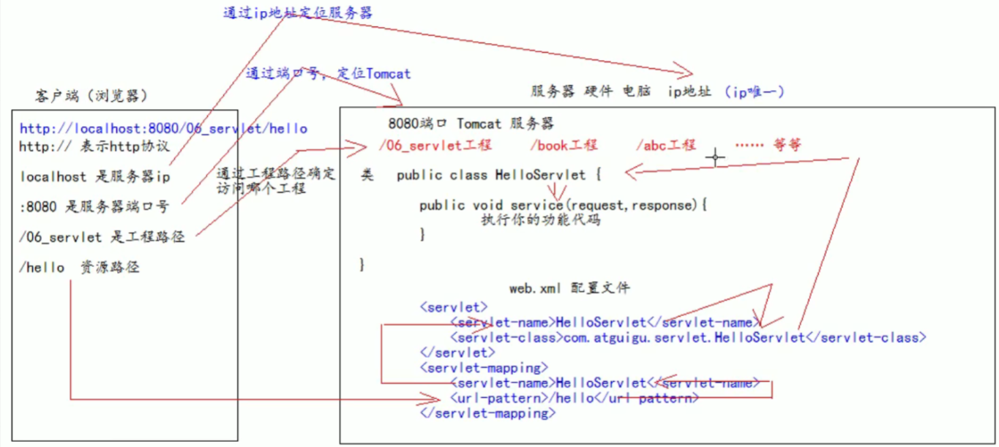
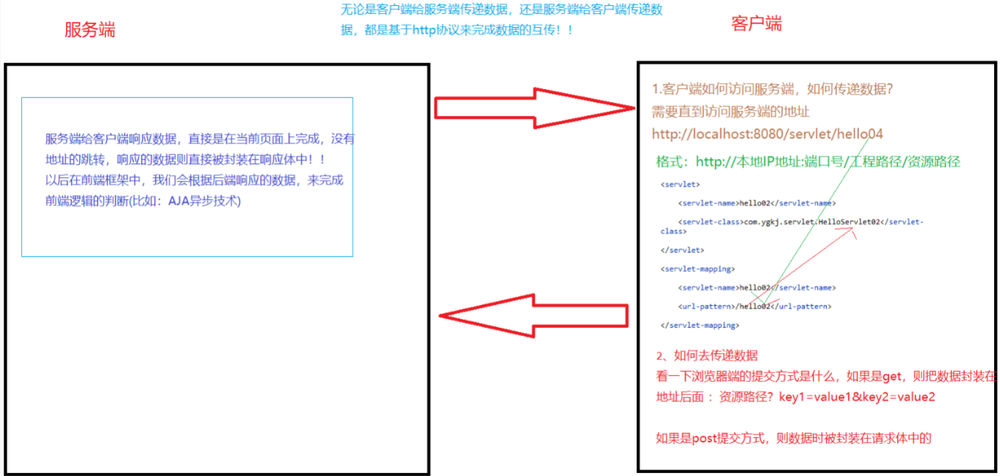
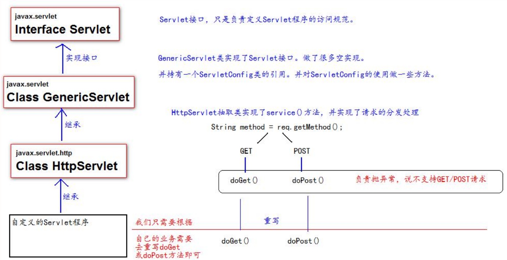

# Servlet技术

## 1、什么是 Servlet 

1、Servlet 是 JavaEE 规范之一。规范就是接口 

2、Servlet 就 JavaWeb 三大组件之一。三大组件分别是：Servlet 程序、Filter 过滤器、Listener 监听器。 

3、Servlet 是运行在服务器上的一个 java 小程序，它可以接收客户端发送过来的请求，并响应数据给客户端。 

## 2、手动实现 Servlet 程序 

1、编写一个类去实现 Servlet 接口 

2、实现 service 方法，处理请求，并响应数据 

3、到 web.xml 中去配置 servlet 程序的访问地址

web.xml 中的配置：

```xml
< ?xml version="1.0" encoding= "UTF-8"?>
<web- app xm1ns="http: //xmlns. jcp. org/ xml/ns/javaee"
xmIns :xsi="http://www . w3. org/2001/XMLSchema- instance"
xsi:schemaLocation= "http:/ /xmlns. jcp. org/xml/ns/javaee
http://xmIns .jcp. org/ xml/ns/javaee/web-app_ 4_ 0. xsd"
version="4.0">
<!-- servlet标签给Tomcat配置Servlet程序-->
  <servlet>
<!--servlet-name标签Servlet 程序起一个别名(- -般是类名) -->
    <servlet-name>HelloServlet< / servlet -name>
<!--servlet-class是Servlet程序的全类名-->
    <servlet-class>com. atguigu. servlet . HelloServlet</serv1et-class>
  </serv1et>
<!--servlet-mapping标签给servlet程序配置访问地址 -->
  <serv1et -mapping>
<!--servlet -name标签的作用是告诉服务器，我当前配置的地址给哪个Servlet程序使用-->
    <servlet -name>Hel loServ1et</serv1et- name>
<!--urL-pattern标签配置访问地址<br/>
/斜杠在服务器解析的时候，表示地址为: http://ip:port/I程路径
<br/>
/hello表示地址为: http://ip:port/. 工程路径/hello 
<br/>
-->
    <url-pattern> /hello</url-pattern>
  </servlet -mapping>
</web-app>

```
## 3、从url 地址到 Servlet 程序的访问流程图





## 4、Servlet的生命周期

1. 执行 Servlet 构造器方法 
2. 执行 init 初始化方法 
第一、二步，只是在第一次访问的时候创建 Servlet 程序会调用。 
3. 执行 service 方法 
第三步，每次访问都会调用。 
4. 执行 destroy 销毁方法 
第四步，在 web工程停止的时候调用
## 5、GET和POST请求的分发处理

```java
public class HelloServlet implements Servlet {
/**
* service 方法是专门用来处理请求和响应的
* @param servletRequest
* @param servletResponse
* @throws ServletException
* @throws IOException
*/
@Override
public void service(ServletRequest servletRequest, ServletResponse servletResponse) 
    throws ServletException, IOException {
  System.out.println("3 service === Hello Servlet 被访问了");
// 类型转换（因为它有 getMethod()方法）
  HttpServletRequest httpServletRequest = (HttpServletRequest) servletRequest;
// 获取请求的方式
  String method = httpServletRequest.getMethod();
  if ("GET".equals(method)) {
    doGet();
  } else if ("POST".equals(method)) {
    doPost();
  }
}
/**
* 做 get 请求的操作
*/
  public void doGet(){
    System.out.println("get 请求");
    System.out.println("get 请求");
  }
/**
* 做 post 请求的操作
*/
  public void doPost(){
    System.out.println("post 请求");
    System.out.println("post 请求");
  }
}
```
## 6、通过继承 HttpServlet 实现 Servlet 程序 

一般在实际项目开发中，都是使用继承 HttpServlet 类的方式去实现 Servlet 程序。 

* 编写一个类去继承 HttpServlet 类 
* 根据业务需要重写 doGet 或 doPost 方法 
* 到 web.xml 中的配置 Servlet 程序的访问地址

Servlet 类的代码： 

```java
public class HelloServlet2 extends HttpServlet {
/**
* doGet（）在 get 请求的时候调用
* @param req
* @param resp
* @throws ServletException
* @throws IOException
*/
@Override
  protected void doGet(HttpServletRequest req, HttpServletResponse resp) 
      throws ServletException,IOException {
    System.out.println("HelloServlet2 的 doGet 方法");
  }
/**
* doPost（）在 post 请求的时候调用
* @param req
* @param resp
* @throws ServletException
* @throws IOException
*/
@Override
  protected void doPost(HttpServletRequest req, HttpServletResponse resp) 
      throws ServletException,IOException {
    System.out.println("HelloServlet2 的 doPost 方法");
  }
} 
```
web.xml 中的配置： 
```xml
<servlet>
  <servlet-name>HelloServlet2</servlet-name>
  <servlet-class>com.atguigu.servlet.HelloServlet2</servlet-class>
</servlet>
<servlet-mapping>
  <servlet-name>HelloServlet2</servlet-name>
  <url-pattern>/hello2</url-pattern>
</servlet-mapping>
```
## 7、Serlet类的继承体系



## 8、ServletConfig类

* ServletConfig 类从类名上来看，就知道是 Servlet 程序的配置信息类。 
* Servlet 程序和 ServletConfig 对象都是由 Tomcat 负责创建，我们负责使用。 
* Servlet 程序默认是第一次访问的时候创建，ServletConfig是每个Servlet程序创建时，就创建一个对应的ServletConfig对象。（因此每个Servlet有且只有自己的ServletConfig类）
### 8.1ServletConfig 类的三大作用 

1. 可以获取 Servlet 程序的别名 servlet-name 的值 
2. 获取初始化参数 init-param 
3. 获取 ServletContext 对象
* 在web.xml 中的配置Config初始化得参数：
```xml
<servlet>
  <servlet-name>HelloServlet</servlet-name>
  <servlet-class>com.atguigu.servlet.HelloServlet</servlet-class>
<!--init-param 是初始化参数-->
  <init-param>
<!--是参数名-->
    <param-name>username</param-name>
<!--是参数值-->
    <param-value>root</param-value>
  </init-param>
<!--init-param 是初始化参数-->
  <init-param>
<!--是参数名-->
    <param-name>url</param-name>
<!--是参数值-->
    <param-value>jdbc:mysql://localhost:3306/test</param-value>
  </init-param>
</servlet>
<servlet-mapping>
  <servlet-name>HelloServlet</servlet-name>
  <url-pattern>/hello</url-pattern>
</servlet-mapping>
```
* Servlet中的代码
```java
@Override
public void init(ServletConfig servletConfig) throws ServletException {
  System.out.println("2 init 初始化方法");
// 1、可以获取 Servlet 程序的别名 servlet-name 的值
  System.out.println("HelloServlet 程序的别名是:" + servletConfig.getServletName());
// 2、获取初始化参数 init-param
  System.out.println("初始化参数 username 的值是;" + servletConfig.getInitParameter("username"));
  System.out.println("初始化参数 url 的值是;" + servletConfig.getInitParameter("url"));
// 3、获取 ServletContext 对象
  System.out.println(servletConfig.getServletContext());
}
```


## 9、ServletContext类

### 9.1什么是 ServletContext? 

1. ServletContext 是一个接口，它表示 Servlet 上下文对象 
2. 一个 web 工程，只有一个 ServletContext 对象实例。 
3. ServletContext 对象是一个域对象。 
4. ServletContext 是在 web 工程部署启动的时候创建。在 web 工程停止的时候销毁。 
5. 后面会接触到的域对象：request（该域对象的取值范围是一次请求范围之内）、session（会话对象，会对服务端和客户端进行一个绑定）
#### 什么是域对象? 

域对象，是可以像 Map 一样存取数据的对象，叫域对象。 这里的域指的是存取数据的操作范围，整个web工程。 

|    |存数据|取数据|删除数据|
|:----|:----|:----|:----|
|Map |put()|get()|remove() |
|域对象|setAttribute()|getAttribute()|removeAttribute()|

### 9.2ServletContext 类的四个作用

1. 获取 web.xml 中配置的上下文参数 context-param （全局的）
2. 获取当前的工程路径，格式: /工程路径 
3. 获取工程部署后在服务器硬盘上的绝对路径 
4. 像 Map 一样存取数据
* 先在web.xml中配置context-param
```xml
<!--context-param 是上下文参数(它属于整个 web 工程)-->
  <context-param>
    <param-name>username</param-name>
    <param-value>context</param-value>
  </context-param>
<!--context-param 是上下文参数(它属于整个 web 工程)-->
  <context-param>
    <param-name>password</param-name>
    <param-value>root</param-value>
  </context-param>
```
* ServletContext演示代码 
```java
protected void doGet(HttpServletRequest request, HttpServletResponse response) 
    throws ServletException, IOException {
// 1、获取 web.xml 中配置的上下文参数 context-param
  ServletContext context = getServletConfig().getServletContext();
  String username = context.getInitParameter("username");
  System.out.println("context-param 参数 username 的值是:" + username);
  System.out.println("context-param 参数 password 的值是:" +
  context.getInitParameter("password"));
// 2、获取当前的工程路径，格式: /工程路径System.out.println( "当前工程路径:" + context.getContextPath() );
// 3、获取工程部署后在服务器硬盘上的绝对路径
/**
* / 斜杠被服务器解析地址为:http://ip:port/工程名/ 映射到 IDEA 代码的 web 目录<br/>
*/
  System.out.println("工程部署的路径是:" + context.getRealPath("/"));
  System.out.println("工程下 css 目录的绝对路径是:" + context.getRealPath("/css"));
  System.out.println("工程下 imgs 目录 1.jpg 的绝对路径是:" + context.getRealPath("/imgs/1.jpg"));
} 
```
* ServletContext 像 Map 一样存取数据： 

ContextServlet1 代码： 

```java
public class ContextServlet1 extends HttpServlet {
  protected void doGet(HttpServletRequest request, HttpServletResponse response) 
      throws ServletException, IOException {
// 获取 ServletContext 对象
    ServletContext context = getServletContext();
    System.out.println(context);
    System.out.println("保存之前: Context1 获取 key1 的值是:"+ context.getAttribute("key1"));
    context.setAttribute("key1", "value1");
    System.out.println("Context1 中获取域数据 key1 的值是:"+ context.getAttribute("key1"));
  }
}
```
ContextServlet2 代码： 
```java
protected void doGet(HttpServletRequest request, HttpServletResponse response) throws ServletException,
IOException {
  ServletContext context = getServletContext();System.out.println(context);
  System.out.println("Context2 中获取域数据 key1 的值是:"+ context.getAttribute("key1"));
}
```


