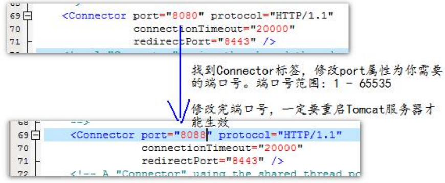
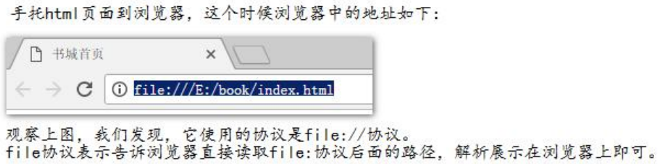
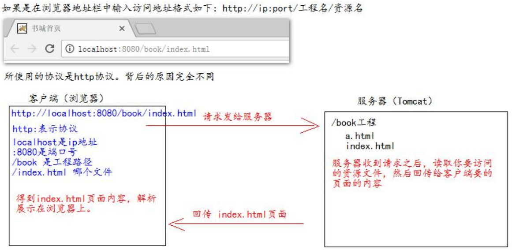
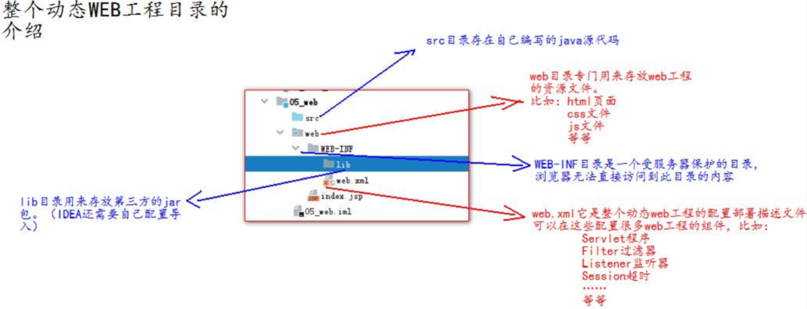
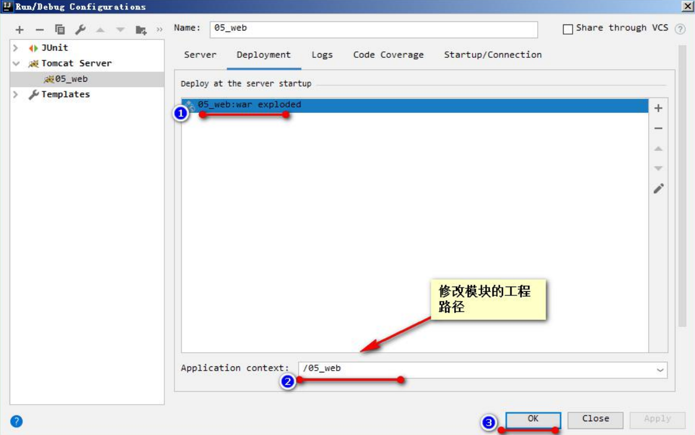
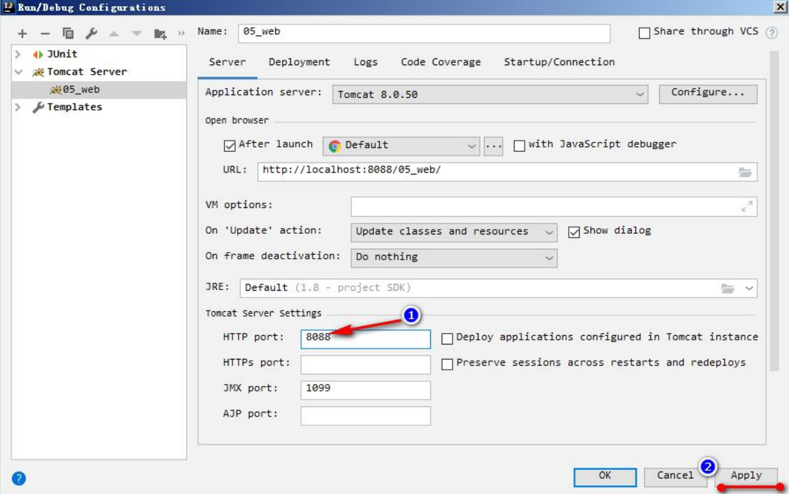

# Tomcat的使用

## 目录介绍 

* bin——专门用来存放 Tomcat 服务器的可执行程序 
* conf——专门用来存放 Tocmat 服务器的配置文件 
* lib——专门用来存放 Tomcat 服务器的 jar 包 
* logs——专门用来存放 Tomcat 服务器运行时输出的日记信息 
* temp——专门用来存放 Tomcdat 运行时产生的临时数据 
* webapps——专门用来存放部署的 Web 工程。 
* work——是 Tomcat 工作时的目录，用来存放 Tomcat 运行时 jsp 翻译为 Servlet 的源码，和 Session 钝化的目录。
## Tomcat 的停止 

1. 点击 tomcat 服务器窗口的 x 关闭按钮 
2. 把 Tomcat 服务器窗口置为当前窗口，然后按快捷键 Ctrl+C 
3. **找到 Tomcat 的 bin 目录下的 shutdown.bat 双击，就可以停止 Tomcat 服务器**
## 如何修改 Tomcat 的端口号 

Mysql 默认的端口号是：3306 

Tomcat 默认的端口号是：8080 

找到 Tomcat 目录下的 conf 目录，找到 server.xml 配置文件。 

 

平时上百度：[http://www.baidu.com:80](http://www.baidu.com:80) 

HTTP 协议默认的端口号是:80 ，所以80端口号会被抹掉

## 如何部暑 web 工程到 Tomcat 中 

### 第一种部署方法：

只需要把 web 工程的目录拷贝到 Tomcat 的 webapps 目录下 即可。 

1. 在 webapps 目录下创建一个 文件夹（工程）
2. 把做的工程拷贝到该目录即可 
3. 如何访问 Tomcat 下的 web 工程？
只需要在浏览器中输入访问地址格式如下： 
[http://ip:port/](http://ip:port/)工程名/目录下/文件名 
**注意**：在网站输入
[http://ip:port/](http://ip:port/)就是到Tomcat的webapps文件夹里面

### 第二种部署方法： 

找到 Tomcat 下的 conf 目录\Catalina\localhost\ 下,创建如下的配置文件： 

abc.xml 配置文件内容如下： 

```xml
<!-- Context 表示一个工程上下文
path 表示工程的访问路径:/abc
docBase 表示你的工程目录在哪里
-->
<Context path="/abc" docBase="E:\book" /> 
```
访问这个工程的路径如下:http://ip:port/abc/ 就表示访问 E:\book 目录
### 手动托取html 页面到浏览器和在浏览器中输入 [http://ip:](http://ip:)端 口号/工程名/访问的区别 

* 手托 html 页面的原理： 

 

* 输入访问地址访问的原因： 

 

### ROOT 的工程的访问，以及 默认 index.html 页面的访问

* 当我们在浏览器地址栏中输入访问地址如下： 

[http://ip:port/](http://ip:port/) ====>>>> 没有工程名的时候，默认访问的是 ROOT工程。 

* 当我们在浏览器地址栏中输入的访问地址如下： 

[http://ip:port/](http://ip:port/)工程名/ ====>>>> 没有资源名，默认访问 index.html 页面

## IDEA中动态web工程的操作

### web工程的目录介绍



### 在IDEA中部署工程到Tomcat上运行

* 建议修改 web 工程对应的 Tomcat 运行实例名称：

* 确认你的 Tomcat 实例中有你要部署运行的 web 工程模块
* 还可以修改你的 Tomcat 实例启动后默认的访问地址

### 修改工程访问路径



### 修改运行端口号



### 配置热部署资源

**注：**热部署就是你在idea中修改代码，在浏览器刷新后就立即生效

# XML

## 1、什么是 xml？ 

xml 是可扩展的标记性语言。 

## 2、xml 的作用？ 

xml 的主要作用有： 

1、用来保存数据，而且这些数据具有自我描述性 

2、它还可以做为项目或者模块的配置文件 

3、还可以做为网络传输数据的格式（现在 JSON 为主）。

## 3、xml 语法 

1. 文档声明。 

2. 元素（标签） 

3. xml 属性 

4. xml 注释 

5. 文本区域（CDATA 区） 

### 3.1、文档声明 

1)创建一个xml文件

文件名：

```xml
<?xml version="1.0" encoding="UTF-8"?> xml 声明。
<!-- xml 声明 version 是版本的意思 encoding 是编码 -->
而且这个<?xml 要连在一起写，否则会有报错 
```
**属性**
version 是版本号 

encoding 是 xml 的文件编码 

standalone="yes/no" 表示这个 xml 文件是否是独立的 xml 文件

## dom4j 编程步骤： 

第一步： 先加载 xml 文件创建 Document 对象 

第二步：通过 Document 对象拿到根元素对象 

第三步：通过根元素.elelemts(标签名); 可以返回一个集合，这个集合里放着。所有你指定的标签名的元素对象 

第四步：找到你想要修改、删除的子元素，进行相应在的操作 

第五步，保存到硬盘上


