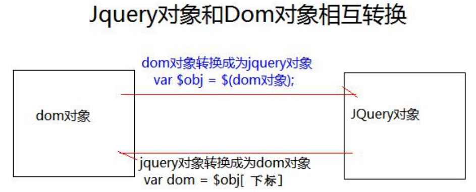

[toc]


# jQuery

## 1、jQuery 介绍 

什么是 jQuery ? 

jQuery，顾名思义，也就是 JavaScript 和查询（Query），它就是辅助 JavaScript 开发的 js 类库。 

jQuery 核心思想！！！ 

它的核心思想是 write less,do more(写得更少,做得更多)，所以它实现了很多浏览器的兼容问题。 

jQuery 流行程度 

jQuery 现在已经成为最流行的 JavaScript 库，在世界前 10000 个访问最多的网站中，有超过 55%在使用 jQuery。 

jQuery 好处！！！ 

jQuery 是免费、开源的，jQuery 的语法设计可以使开发更加便捷，例如操作文档对象、选择 DOM 元素、 制作动画效果、事件处理、使用 Ajax 以及其他功能

## 2、jQuery 核心函数 

> $是 jQuery 的核心函数，能完成 jQuery 的很多功能。()就是调用这个函数

1、传入参数为 [ 函数 ] 时： 

表示页面加载完成之后。相当于 window.onload = function(){} 

2、传入参数为 [ HTML 字符串 ] 时： 

会对我们创建这个 html 标签对象 

3、传入参数为 [ 选择器字符串 ] 时： 

$(“#id 属性值”); id 选择器，根据 id 查询标签对象 

$(“标签名”); 标签名选择器，根据指定的标签名查询标签对象 

$(“.class 属性值”); 类型选择器，可以根据 class 属性查询标签对象 

4、传入参数为 [ DOM 对象 ] 时： 

会把这个 dom 对象转换为 jQuery 对象

## 3、jQuery 对象和 dom 对象区分 

### 3.1、什么是 jQuery 对象，什么是 dom 对象 

**Dom 对象**

1.通过 getElementById()查询出来的标签对象是 Dom 对象 

2.通过 getElementsByName()查询出来的标签对象是 Dom 对象 

3.通过 getElementsByTagName()查询出来的标签对象是 Dom 对象 

4.通过 createElement() 方法创建的对象，是 Dom 对象 

DOM 对象 Alert 出来的效果是：*[object HTML 标签名 Element]*

**jQuery 对象**

5.通过 JQuery 提供的 API 创建的对象，是 JQuery 对象 

6.通过 JQuery 包装的 Dom 对象，也是 JQuery 对象 

7.通过 JQuery 提供的 API 查询到的对象，是 JQuery 对象 

jQuery 对象 Alert 出来的效果是：[object Object]

### 3.2、问题：jQuery 对象的本质是什么？ 

jQuery 对象是 dom 对象的数组 + jQuery 提供的一系列功能函数。 

### 3.3、jQuery 对象和 Dom 对象使用区别 

jQuery 对象不能使用 DOM 对象的属性和方法 

DOM 对象也不能使用 jQuery 对象的属性和方法 

### 3.4、Dom 对象和 jQuery 对象互转 

#### 1、dom 对象转化为 jQuery 对象（*重点） 

1、先有 DOM 对象 

2、$( DOM 对象 ) 就可以转换成为 jQuery 对象 

#### 2、jQuery 对象转为 dom 对象（*重点） 

1、先有 jQuery 对象 

2、jQuery 对象[下标]取出相应的 DOM 对象



## 4、jQuery 选择器（重点） 

### 4.1、基本选择器（重点） 

#ID 选择器：根据 id 查找标签对象 

.class 选择器：根据 class 查找标签对象 

element 选择器：根据标签名查找标签对象 

* 选择器：表示任意的，所有的元素 

selector1，selector2 组合选择器：合并选择器 1，选择器 2 的结果并返回 

#### jQuery中的遍历

```javascript
let $hobby = $(".hobby");

//    jQuery中遍历
    $hobby.each(function () {
        // this 是遍历时获取到的dom对象
        alert(this.value)
        //或者先将this转成jQuery对象，再调用val函数获取标签中的value
        alert($(this).val())
    })
```

### 4.2、层级选择器（重点） 

ancestor descendant 后代选择器 ：在给定的祖先元素下匹配所有的后代元素 

parent > child 子元素选择器：在给定的父元素下匹配所有的子元素 

prev + next 相邻元素选择器：匹配所有紧接在 prev 元素后的 next 元素 

prev ~ sibings 之后的兄弟元素选择器：匹配 prev 元素之后的所有 siblings 元素

### 4.3、过滤选择器 

#### 基本过滤器： 

:first 获取第一个元素 

:last 获取最后个元素 

:not(selector) 去除所有与给定选择器匹配的元素 

:even 匹配所有索引值为偶数的元素，从 0 开始计数 

:odd 匹配所有索引值为奇数的元素，从 0 开始计数 

:eq(index) 匹配一个给定索引值的元素 

:gt(index) 匹配所有大于给定索引值的元素 

:lt(index) 匹配所有小于给定索引值的元素 

:header 匹配如 h1, h2, h3 之类的标题元素 

:animated 匹配所有正在执行动画效果的元素 

#### 内容过滤器： 

:contains(text) 匹配包含给定文本的元素 

:empty 匹配所有不包含子元素或者文本的空元素 

:parent 匹配含有子元素或者文本的元素 

:has(selector) 匹配含有选择器所匹配的元素的元素

#### 属性过滤器： 

[attribute] 匹配包含给定属性的元素。 

[attribute=value] 匹配给定的属性是某个特定值的元素 

[attribute!=value] 匹配所有不含有指定的属性，或者属性不等于特定值的元素。 

[attribute^=value] 匹配给定的属性是以某些值开始的元素 

[attribute$=value] 匹配给定的属性是以某些值结尾的元素 

[attribute*=value] 匹配给定的属性是以包含某些值的元素 

[attrSel1][attrSel2][attrSelN] 复合属性选择器，需要同时满足多个条件时使用。 

```javascript
//    通过属性过滤选择器来选择被选中的标签
    let $hobby1 = $(".hobby:checked");

    $hobby1.each(function (){
        alert(this)
    })

    $("[checked=true]").each(function (){
        alert(this)
    })
```

#### 表单过滤器: 

:input 匹配所有 input, textarea, select 和 button 元素 

:text 匹配所有 文本输入框 

:password 匹配所有的密码输入框 

:radio 匹配所有的单选框 

:checkbox 匹配所有的复选框 

:submit 匹配所有提交按钮 

:image 匹配所有 img 标签 

:reset 匹配所有重置按钮 

:button 匹配所有 input type=button <button>按钮 

:file 匹配所有 input type=file 文件上传 

:hidden 匹配所有不可见元素 display:none 或 input type=hidden

表单对象属性过滤器： 

:enabled 匹配所有可用元素 

:disabled 匹配所有不可用元素 

:checked 匹配所有选中的单选，复选，和下拉列表中选中的 option 标签对象 

:selected 匹配所有选中的 option 

## 5、jQuery 元素筛选 

eq() 获取给定索引的元素 功能跟 :eq() 一样 

first() 获取第一个元素 功能跟 :first 一样 

last() 获取最后一个元素 功能跟 :last 一样 

filter(exp) 留下匹配的元素 

is(exp) 判断是否匹配给定的选择器，只要有一个匹配就返回，true 

has(exp) 返回包含有匹配选择器的元素的元素 功能跟 :has 一样 

not(exp) 删除匹配选择器的元素 功能跟 :not 一样 

children(exp) 返回匹配给定选择器的子元素 功能跟 parent>child 一样 

find(exp) 返回匹配给定选择器的后代元素 功能跟 ancestor descendant 一样next() 返回当前元素的下一个兄弟元素 功能跟 prev + next 功能一样 

nextAll() 返回当前元素后面所有的兄弟元素 功能跟 prev ~ siblings 功能一样 

nextUntil() 返回当前元素到指定匹配的元素为止的后面元素 

parent() 返回父元素 

prev(exp) 返回当前元素的上一个兄弟元素 

prevAll() 返回当前元素前面所有的兄弟元素 

prevUnit(exp) 返回当前元素到指定匹配的元素为止的前面元素 

siblings(exp) 返回所有兄弟元素 

add() 把 add 匹配的选择器的元素添加到当前 jquery 对象中

## 6、jQuery 的属性操作 

jQuery 属性操作 

html() 它可以设置和获取起始标签和结束标签中的内容。 跟dom属性 innerHTML 一样。 

text() 它可以设置和获取起始标签和结束标签中的文本。 跟 dom 属性 innerText 一样。 

val() 它可以设置和获取表单项的 value 属性值。 跟 dom 属性 value 一样

attr() 可以设置和获取属性的值，不推荐操作checked、readOnly、selected、disabled等 

attr 方法还可以操作非标准的属性。比如自定义属性：abc,bbj 

prop() 可以设置和获取属性的值,只推荐操作checked、readOnly、selected、disabled 等

## 7、DOM 的增删改 

内部插入：（插到标签里面）

appendTo() a.appendTo(b) 把 a 插入到 b 子元素末尾，成为最后一个子元素prependTo() a.prependTo(b) 把 a 插到 b 所有子元素前面，成为第一个子元素 

外部插入：（与被插的标签平级）

insertAfter() a.insertAfter(b) 得到 ba 

insertBefore() a.insertBefore(b) 得到 ab 

替换: 

replaceWith() a.replaceWith(b) 用 b 替换掉 a 

replaceAll() a.replaceAll(b) 用 a 替换掉所有 b 

删除： 

remove() a.remove(); 删除 a 标签 

empty() a.empty(); 清空 a 标签里的内容

## 8、jQuery 动画 

基本动画 

show() 将隐藏的元素显示 

hide() 将可见的元素隐藏。 

toggle() 可见就隐藏，不可见就显示。 

* 以上动画方法都可以添加参数。 

1、第一个参数是动画 执行的时长，以毫秒为单位 

2、第二个参数是动画的回调函数 (动画完成后自动调用的函数) 

淡入淡出动画 

fadeIn() 淡入（慢慢可见） 

fadeOut() 淡出（慢慢消失） 

fadeTo() 在指定时长内慢慢的将透明度修改到指定的值。0 透明，1 完成可见，0.5 半透明 

fadeToggle() 淡入/淡出 切换

## 9、jQuery 事件操作 

**$( function(){} ); 和window.onload = function(){} 的区别？**

他们分别是在什么时候触发？ 

1、jQuery 的页面加载完成之后是浏览器的内核解析完页面的标签创建好 DOM 对象之后就会马上执行。 

2、原生 js 的页面加载完成之后，除了要等浏览器内核解析完标签创建好 DOM 对象，还要等标签显示时需要的内容加载 完成。

他们触发的顺序？ 

1、jQuery 页面加载完成之后先执行 

2、原生 js 的页面加载完成之后 

他们执行的次数？ 

1、原生 js 的页面加载完成之后，只会执行最后一次的赋值函数。 

2、jQuery 的页面加载完成之后是全部把注册的 function 函数，依次顺序全部执行。

