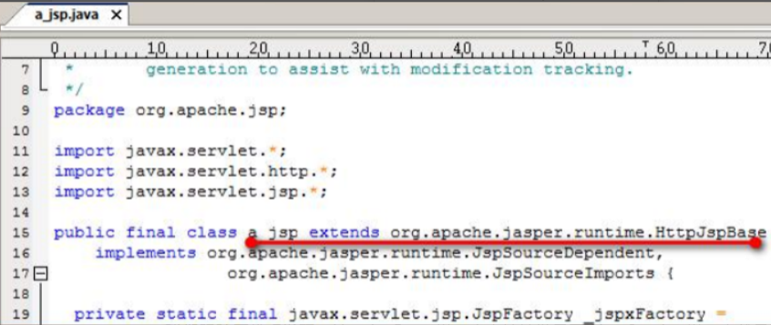
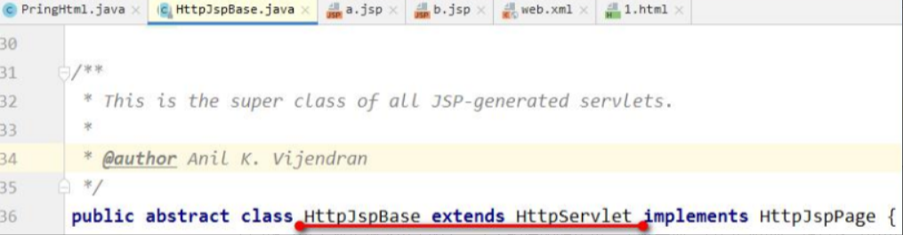
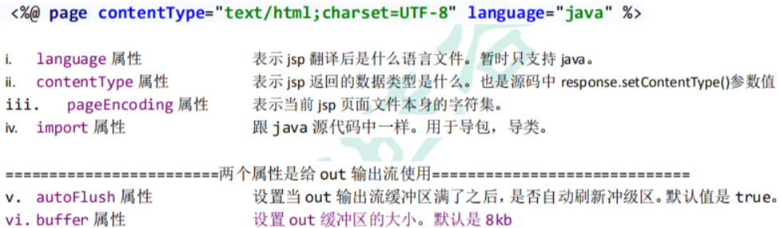
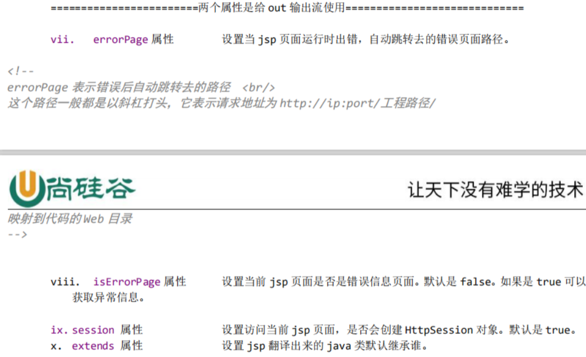
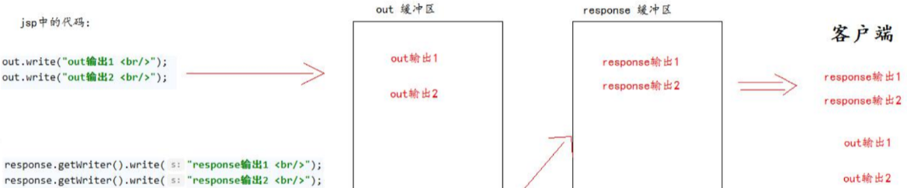
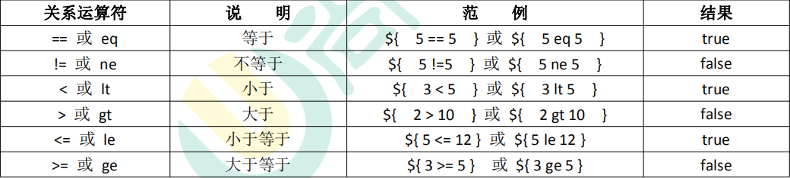
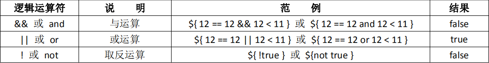
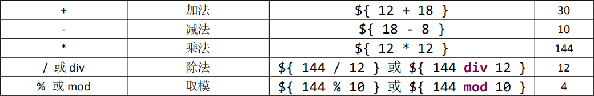
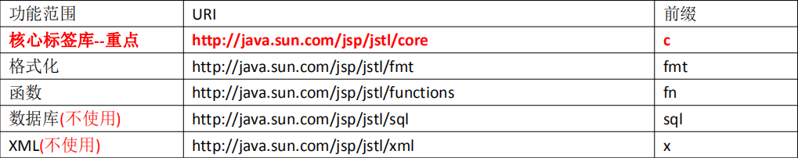

[toc]

# jsp

## 1、什么是 jsp，它有什么用? 

jsp 的全换是 java server pages。Java 的服务器页面。 

jsp 的主要作用是代替 Servlet 程序回传 html 页面的数据。 

因为 Servlet 程序回传 html 页面数据是一件非常繁锁的事情。开发成本和维护成本都极高。 

## 2、jsp 的本质是什么。 

jsp 页面本质上是一个 Servlet 程序。 

当我们第一次访问 jsp 页面的时候。Tomcat 服务器会帮我们把 jsp 页面翻译成为一个 java 源文件。并且对它进行编译成 为.class 字节码程序。我们打开 java 源文件不难发现其里面的内容是：



我们跟踪原代码发现，HttpJspBase 类。它直接地继承了 HttpServlet 类。也就是说。jsp 翻译出来的 java 类，它间接了继 承了 HttpServlet 类。也就是说，翻译出来的是一个 Servlet 程序 



总结：通过翻译的 java 源代码我们就可以得到结果：jsp 就是 Servlet 程序。 

大家也可以去观察翻译出来的 Servlet 程序的源代码，不难发现。其底层实现，也是通过输出流。把 html 页面数据回传 给客户端。

## 3、jsp 的三种语法 

### 3.1jsp 头部的 page 指令 

jsp 的 page 指令可以修改 jsp 页面中一些重要的属性，或者行为。 





### 3.2jsp 中的常用脚本

#### 声明脚本(极少使用) 

声明脚本的格式是： <%! 声明 java 代码 %> 

作用：可以给 jsp 翻译出来的 java 类定义属性和方法甚至是静态代码块。内部类等。

#### 表达式脚本（常用） 

表达式脚本的格式是：<%=表达式%> 

表达式脚本的作用是：的 jsp 页面上输出数据。 

* 表达式脚本的特点： 

1、所有的表达式脚本都会被翻译到_jspService() 方法中 

2、表达式脚本都会被翻译成为 out.print()输出到页面上 

3、由于表达式脚本翻译的内容都在_jspService() 方法中,所以_jspService()方法中的对象都可以直接使用。 

4、表达式脚本中的表达式不能以分号结束。

#### 代码脚本 

代码脚本的格式是： 

```xml
<%
  java 语句
%> 
```
代码脚本的作用是：可以在 jsp 页面中，编写我们自己需要的功能（写的是 java 语句）。 
* 代码脚本的特点是： 

1、代码脚本翻译之后都在_jspService 方法中 

2、代码脚本由于翻译到_jspService()方法中，所以在_jspService()方法中的现有对象都可以直接使用。 

3、还可以由多个代码脚本块组合完成一个完整的 java 语句。 

4、代码脚本还可以和表达式脚本一起组合使用，在 jsp 页面上输出数据

### 3.3jsp 中的三种注释

### 

## 4、jsp中的九大内置对象

那么 jsp 中九大内置对象分别是： 

request对象：请求对象，可以获取请求信息 

response对象：响应对象。可以设置响应信息 

pageContext对象：当前页面上下文对象。可以在当前上下文保存属性信息 

session对象：会话对象。可以获取会话信息。 

exception对象：异常对象只有在 jsp 页面的 page 指令中设置 isErrorPage=*"true"*的时候才会存在 

application对象：ServletContext 对象实例，可以获取整个工程的一些信息。 

config对象：ServletConfig 对象实例，可以获取 Servlet 的配置信息 

out对象：输出流。 

page对象：表示当前 Servlet 对象实例（无用，用它不如使用 this 对象）。

**注：**九大内置对象，都是我们可以在【代码脚本】中或【表达式脚本】中直接使用的对 

象。

## 5、jsp四大域对象

四大域对象经常用来保存数据信息。 

pageContext：可以保存数据在同一个 jsp 页面中使用 

request：可以保存数据在同一个 request 对象中使用。经常用于在转发的时候传递数据 

session：可以保存在一个会话中使用 

application(ServletContext)：就是 ServletContext 对象

## 6、jsp 中的 out 输出和 response.getWriter 输出的区 别

response 中表示响应，我们经常用于设置返回给客户端的内容（输出） 

out 也是给用户做输出使用的。



**注：**

当jsp页西中所有代码执行完成后会做以下两个操作:

1、执行out. flush0操作，会把out缓冲区中的数据追加写入到response暖冲区末尾

2、会执行response的刷新操作。把全部数据与给客户端

由于 jsp 翻译之后，底层源代码都是使用 out 来进行输出，所以一般情况下。我们在 jsp 页面中统一使用 out 来进行输出。避免打乱页面输出内容的顺序。 

out.write() 输出字符串没有问题 

out.print() 输出任意数据都没有问题（都转换成为字符串后调用的 write 输出） 

深入源码，浅出结论：在 jsp 页面中，可以统一使用 out.print()来进行输出

## 7、jsp 的常用标签 

### 7.1jsp 静态包含 

示例说明： 

```xml
<%--
  <%@ include file=""%> 就是静态包含
      file 属性指定你要包含的 jsp 页面的路径
      地址中第一个斜杠 / 表示为 http://ip:port/工程路径/ 映射到代码的 web 目录
  静态包含的特点：
    1、静态包含不会翻译被包含的 jsp 页面。
    2、静态包含其实是把被包含的 jsp 页面的代码拷贝到包含的位置执行输出。
--%>
<%@ include file="/include/footer.jsp"%> 
```
### 7.2jsp 动态包含 

示例说明： 

```xml
<%--
  <jsp:include page=""></jsp:include> 这是动态包含
  page 属性是指定你要包含的 jsp 页面的路径
  动态包含也可以像静态包含一样。把被包含的内容执行输出到包含位置
  动态包含的特点：
    1、动态包含会把包含的 jsp 页面也翻译成为 java 代码
    2、动态包含底层代码使用如下代码去调用被包含的 jsp 页面执行输出。
      JspRuntimeLibrary.include(request, response, "/include/footer.jsp", out, false);
    3、动态包含，还可以传递参数
--%>
<jsp:include page="/include/footer.jsp">
    <jsp:param name="username" value="bbj"/>
    <jsp:param name="password" value="root"/>
</jsp:include> 
```
动态包含的底层原理：
### 7.3jsp 标签-转发 

示例说明： 

```xml
<%--
  <jsp:forward page=""></jsp:forward> 是请求转发标签，它的功能就是请求转发
    page 属性设置请求转发的路径
--%>
<jsp:forward page="/scope2.jsp"></jsp:forward>
```

# EL 表达式 

## 1、什么是 EL 表达式，EL 表达式的作用? 

EL 表达式的全称是：Expression Language。是表达式语言。 

EL 表达式的什么作用：EL 表达式主要是代替 jsp 页面中的表达式脚本在 jsp 页面中进行数据的输出。因为 EL 表达式在输出数据的时候，要比 jsp 的表达式脚本要简洁很多。 

EL 表达式的格式是：${表达式} 

EL 表达式在输出 null 值的时候，输出的是空串。jsp 表达式脚本输出 null 值的时候，输出的是 null 字符串。

## 2、EL 表达式搜索域数据的顺序 

EL 表达式主要是在 jsp 页面中输出数据。 主要是输出域对象中的数据。 

当四个域中都有相同的 key 的数据的时候，EL 表达式会按照四个域的从小到大的顺序去进行搜索，找到就输出。

## 3、EL 表达式输出 Bean 的普通属性，数组属性。List 集合属性，map 集合属性

**注：**通过el表达式来获取实体中元素的时候，在底层是根据get方法进行获取的，所以以后在进行项目开发的时候 一定要注意实体中有没有写get方法

* Person类
```java
public class Person {
// i.需求——输出 Person 类中普通属性，数组属性。list 集合属性和 map 集合属性。
  private String name;
  private String[] phones;
  private List<String> cities;
  private Map<String,Object> map;
  public int getAge() {
    return 18;
  }
}
```
* jsp中的代码
```xml
<body>
  <%
    Person person = new Person();
    person.setName("国哥好帅！");
    person.setPhones(new String[]{"18610541354","18688886666","18699998888"});
    List<String> cities = new ArrayList<String>();
    cities.add("北京");
    cities.add("上海");
    cities.add("深圳");
    person.setCities(cities);
    Map<String,Object>map = new HashMap<>();
    map.put("key1","value1");
    map.put("key2","value2");
    map.put("key3","value3");
    person.setMap(map);
    pageContext.setAttribute("p", person);
  %>
  输出 Person：${ p }<br/>
  输出 Person 的 name 属性：${p.name} <br>
  输出 Person 的 pnones 数组属性值：${p.phones[2]} <br>
  输出 Person 的 cities 集合中的元素值：${p.cities} <br>
  输出 Person 的 List 集合中个别元素值：${p.cities[2]} <br>
  输出 Person 的 Map 集合: ${p.map} <br>
  输出 Person 的 Map 集合中某个 key 的值: ${p.map.key3} <br>
  输出 Person 的 age 属性：${p.age} <br>
</body>
```

## 4、EL 表达式——运算 

语法：${ 运算表达式 } ， EL 表达式支持如下运算符： 

### 关系运算



### 逻辑运算



### 算数运算




### empty 运算 

empty 运算可以判断一个数据是否为空，如果为空，则输出 true,不为空输出 false。 

* 以下几种情况为空： 

1、值为 null 值的时候，为空 

2、值为空串的时候，为空 

3、值是 Object 类型数组，长度为零的时候 

4、list 集合，元素个数为零 

5、map 集合，元素个数为零

```html
<body>
  <%
// 1、值为 null 值的时候，为空
    request.setAttribute("emptyNull", null);
// 2、值为空串的时候，为空
    request.setAttribute("emptyStr", "");
// 3、值是 Object 类型数组，长度为零的时候
    request.setAttribute("emptyArr", new Object[]{});
// 4、list 集合，元素个数为零
    List<String> list = new ArrayList<>();
// list.add("abc");
    request.setAttribute("emptyList", list);
// 5、map 集合，元素个数为零
    Map<String,Object> map = new HashMap<String, Object>();
// map.put("key1", "value1");
    request.setAttribute("emptyMap", map);
  %>
  ${ empty emptyNull } <br/>
  ${ empty emptyStr } <br/>
  ${ empty emptyArr } <br/>
  ${ empty emptyList } <br/>
  ${ empty emptyMap } <br/>
</body>
```
### 三元运算 

表达式 1？表达式 2：表达式 3 

如果表达式 1 的值为真，返回表达式 2 的值，如果表达式 1 的值为假，返回表达式 3 的值。

# jstl标签库：

* 我们可以通过el表达式来来取到后端的数据，需要让这些数据规范的显示在前端，所以我们要针对这些数据
* 进行遍历，可能还会用到相关的逻辑判断，但是html并没有直接支持逻辑判断的标签、遍历的标签，
* 所以我们需要引入第三方的标签库，来完成数据的遍历，以及逻辑的判断！！
* JSTL 标签库 全称是指 JSP Standard Tag Library JSP 标准标签库。是一个不断完善的开放源代码的 JSP 标 签库。
* EL 表达式主要是为了替换 jsp 中的表达式脚本，而标签库则是为了替换代码脚本。这样使得整个 jsp 页面 变得更佳简洁。

**JSTL 由五个不同功能的标签库组成。**



* 在 jsp 标签库中使用 taglib 指令引入标签库 
```xml
CORE 标签库
<%@ taglib prefix="c" uri="http://java.sun.com/jsp/jstl/core" %>
XML 标签库<%@ taglib prefix="x" uri="http://java.sun.com/jsp/jstl/xml" %>
FMT 标签库
<%@ taglib prefix="fmt" uri="http://java.sun.com/jsp/jstl/fmt" %>
SQL 标签库
<%@ taglib prefix="sql" uri="http://java.sun.com/jsp/jstl/sql" %>
FUNCTIONS 标签库
<%@ taglib prefix="fn" uri="http://java.sun.com/jsp/jstl/functions" %>
```

### 
## 1、JSTL 标签库的使用步骤 

1、先导入 jstl 标签库的 jar 包。 

taglibs-standard-impl-1.2.1.jar 

taglibs-standard-spec-1.2.1.jar 

2、第二步，使用 taglib 指令引入标签库。 

```xml
<%@ taglib prefix="c" uri="http://java.sun.com/jsp/jstl/core" %>
```

## 2、core核心库的使用

### <c:if /> 

* if 标签用来做 if 判断。 
```xml
<%--
  <c:if />
    if 标签用来做 if 判断。
    test 属性表示判断的条件（使用 EL 表达式输出）
--%>
<c:if test="${ 12 == 12 }">
  <h1>12 等于 12</h1>
</c:if>
<c:if test="${ 12 != 12 }">
  <h1>12 不等于 12</h1>
</c:if>
```
### <c:choose> <c:when> <c:otherwise>标签 

* 作用：多路判断。跟 switch ... case .... default 非常接近 
```xml
<%--
<c:choose> <c:when> <c:otherwise>标签
作用：多路判断。跟 switch ... case .... default 非常接近
  choose 标签开始选择判断
  when 标签表示每一种判断情况
    test 属性表示当前这种判断情况的值
  otherwise 标签表示剩下的情况
<c:choose> <c:when> <c:otherwise>标签使用时需要注意的点：
  1、标签里不能使用 html 注释，要使用 jsp 注释
  2、when 标签的父标签一定要是 choose 标签
--%>
<%
  request.setAttribute("height", 180);
%>
<c:choose>
<%-- 这是 html 注释 --%>
  <c:when test="${ requestScope.height > 190 }">
    <h2>小巨人</h2>
  </c:when>
  <c:when test="${ requestScope.height > 180 }">
    <h2>很高</h2>
  </c:when>
  <c:when test="${ requestScope.height > 170 }">
    <h2>还可以</h2>
  </c:when>
  <c:otherwise>
</c:choose>
```

### <c:forEach /> 

* 作用：遍历输出使用。
#### a)遍历 1 到 10，输出 

示例代码： 

```xml
<%--1.遍历 1 到 10，输出
  begin 属性设置开始的索引
  end 属性设置结束的索引
  var 属性表示循环的变量(也是当前正在遍历到的数据)
for (int i = 1; i < 10; i++)
--%>
<table border="1">
  <c:forEach begin="1" end="10" var="i">
    <tr>
      <td>第${i}行</td>
    </tr>
  </c:forEach>
</table>
```

#### b)遍历 Object 数组 

示例代码：

```xml
<%-- 2.遍历 Object 数组
  for (Object item: arr)
  items 表示遍历的数据源（遍历的集合）
  var 表示当前遍历到的数据
--%>
<%
  request.setAttribute("arr", new String[]{"18610541354","18688886666","18699998888"});
%>
<c:forEach items="${ requestScope.arr }" var="item">
  ${ item } <br>
</c:forEach>
```

#### c)遍历 Map 集合 

示例代码： 

```xml
<%
  Map<String,Object> map = new HashMap<String, Object>();
  map.put("key1", "value1");
  map.put("key2", "value2");
  map.put("key3", "value3");
// for ( Map.Entry<String,Object> entry : map.entrySet()) {
// }
  request.setAttribute("map", map);
%>
<c:forEach items="${ requestScope.map }" var="entry">
  <h1>${entry.key} = ${entry.value}</h1>
</c:forEach>
```


