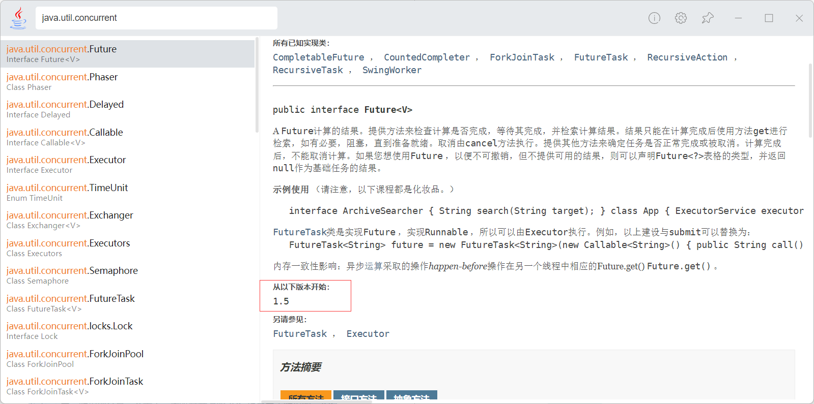

# 什么是JUC

## JUC简介

在 Java 中，线程部分是一个重点，本篇文章说的 JUC 也是关于线程的。JUC就是 java.util .concurrent 工具包的简称。这是一个处理线程的工具包，JDK 1.5 开始出现的。



## 进程与线程

**进程（Process）** 是计算机中的程序关于某数据集合上的一次运行活动，是系统进行资源分配和调度的基本单位，是操作系统结构的基础。 在当代面向线程设计的计算机结构中，进程是线程的容器。程序是指令、数据及其组织形式的描述，进程是程序的实体。是计算机中的程序关于某数据集合上的一次运行活动，是系统进行资源分配和调度的基本单位，是操作系统结构的基础。程序是指令、数据及其组织形式的描述，进程是程序的实体。

 

**线程（thread）** 是操作系统能够进行运算调度的最小单位。它被包含在进程之中，是进程中的实际运作单位。一条线程指的是进程中一个单一顺序的控制流，一个进程中可以并发多个线程，每条线程并行执行不同的任务。

 

**总结来说:**

- 进程：指在系统中正在运行的一个应用程序；程序一旦运行就是进程；进程——资源分配的最小单位。

- 线程：系统分配处理器时间资源的基本单元，或者说进程之内独立执行的一个单元执行流。线程——程序执行的最小单位。

## 线程的状态

### 线程状态枚举类

**Thread.State**

```java
public enum State {
    /**
	* Thread state for a thread which has not yet started.
	*/
    NEW,//(新建)
    /**
    * Thread state for a runnable thread. A thread in the runnable
    * state is executing in the Java virtual machine but it may
    * be waiting for other resources from the operating system
    * such as processor.
    */
    RUNNABLE,//（准备就绪）
    /**
    * Thread state for a thread blocked waiting for a monitor lock.
    * A thread in the blocked state is waiting for a monitor lock
    * to enter a synchronized block/method or
    * reenter a synchronized block/method after calling
    * {@link Object#wait() Object.wait}.
    */
    BLOCKED,//（阻塞）
    /**
    * Thread state for a waiting thread.
    * A thread is in the waiting state due to calling one of the
    * following methods:
    * <ul>
    * <li>{@link Object#wait() Object.wait} with no timeout</li>
    * <li>{@link #join() Thread.join} with no timeout</li>
    * <li>{@link LockSupport#park() LockSupport.park}</li>
    * </ul>
    ** <p>A thread in the waiting state is waiting for another thread to
    * perform a particular action.
    *
    * For example, a thread that has called <tt>Object.wait()</tt>
    * on an object is waiting for another thread to call
    * <tt>Object.notify()</tt> or <tt>Object.notifyAll()</tt> on
    * that object. A thread that has called <tt>Thread.join()</tt>
    * is waiting for a specified thread to terminate.
    */
    WAITING,//（不见不散）
    /**
    * Thread state for a waiting thread with a specified waiting time.
    * A thread is in the timed waiting state due to calling one of
    * the following methods with a specified positive waiting time:
    * <ul>
    * <li>{@link #sleep Thread.sleep}</li>
    * <li>{@link Object#wait(long) Object.wait} with timeout</li>
    * <li>{@link #join(long) Thread.join} with timeout</li>
    * <li>{@link LockSupport#parkNanos LockSupport.parkNanos}</li>
    * <li>{@link LockSupport#parkUntil LockSupport.parkUntil}</li>
    * </ul>
    */
    TIMED_WAITING,//（过时不候）
    /**
    * Thread state for a terminated thread.
    * The thread has completed execution.
    */
    TERMINATED;//(终结) 
}
```

### wait和sleep的区别

- sleep 是 Thread 的静态方法，wait 是 Object 的方法，任何对象实例都能调用。
- sleep 不会释放锁，它也不需要占用锁。wait 会释放锁，但调用它的前提是当前线程占有锁(即代码要在 synchronized 中)。 
- 它们都可以被 interrupted 方法中断。

## 并发和并行

### 串行模式

串行表示所有任务都一一按先后顺序进行。串行意味着必须先装完一车柴才能运送这车柴，只有运送到了，才能卸下这车柴，并且只有完成了这整个三个步骤，才能进行下一个步骤。

**串行是一次只能取得一个任务，并执行这个任务**。

### 并行模式

并行意味着可以同时取得多个任务，并同时去执行所取得的这些任务。并行模式相当于将长长的一条队列，划分成了多条短队列，所以并行缩短了任务队列的长度。并行的效率从代码层次上强依赖于多进程/多线程代码，从硬件角度上则依赖于多核 CPU。

### 并发现象

**并发(concurrent)指的是多个程序可以同时运行的现象，更细化的是多进程可以同时运行或者多指令可以同时运行**。但这不是重点，在描述并发的时候也不会去扣这种字眼是否精确，**并发的重点在于它是一种现象**，**并发描述的是多进程同时运行的现象**。但实际上，对于单核心 CPU 来说，同一时刻只能运行一个线程。所以，这里的"同时运行"表示的不是真的同一时刻有多个线程运行的现象，这是并行的概念，而是提供一种功能让用户看来多个程序同时运行起来了，但实际上这些程序中的进程不是一直霸占 CPU 的，而是执行一会停一会。

**要解决大并发问题，通常是将大任务分解成多个小任务**，由于操作系统对进程的调度是随机的，所以切分成多个小任务后，可能会从任一小任务处执行。这可能会出现一些现象：

- 可能出现一个小任务执行了多次，还没开始下个任务的情况。这时一般会采用队列或类似的数据结构来存放各个小任务的成果
- 可能出现还没准备好第一步就执行第二步的可能。这时，一般采用多路复用或异步的方式，比如只有准备好产生了事件通知才执行某个任务。
- 可以多进程/多线程的方式并行执行这些小任务。也可以单进程/单线程执行这些小任务，这时很可能要配合多路复用才能达到较高的效率

### 小结

- **并发：**同一时刻多个线程在访问同一个资源，多个线程对一个点

  例子：春运抢票 电商秒杀...

- **并行：**多项工作一起执行，之后再汇总

  例子：泡方便面，电水壶烧水，一边撕调料倒入桶中

## 管程

管程(monitor)是保证了同一时刻只有一个进程在管程内活动,即管程内定义的操作在同一时刻只被一个进程调用(由编译器实现).但是这样并不能保证进程以设计的顺序执行

JVM 中同步是基于进入和退出管程(monitor)对象实现的，每个对象都会有一个管程(monitor)对象，管程(monitor)会随着 java 对象一同创建和销毁

执行线程首先要持有管程对象，然后才能执行方法，当方法完成之后会释放管程，方法在执行时候会持有管程，其他线程无法再获取同一个管程

## 用户线程和守护线程

**用户线程**：平时用到的普通线程，自定义线程

**守护线程**：运行在后台，是一种特殊的线程，比如垃圾回收

**当主线程结束后**，用户线程还在运行，JVM存活

**如果没有用户线程**，都是守护线程，JVM结束

# Lock接口

## Synchronized

### Synchronized关键字回顾

synchronized 是 Java 中的关键字，是一种同步锁。它修饰的对象有以下几种：

1. 修饰一个代码块，被修饰的代码块称为同步语句块，其作用的范围是大括号{}括起来的代码，作用的对象是调用这个代码块的对象；

2. 修饰一个方法，被修饰的方法称为同步方法，其作用的范围是整个方法，作用的对象是调用这个方法的对象；
   - 虽然可以使用 synchronized 来定义方法，但 synchronized 并不属于方法定义的一部分，因此，**synchronized 关键字不能被继承**。如果在父类中的某个方法使用了 synchronized 关键字，而在子类中覆盖了这个方法，在子类中的这个方法默认情况下并不是同步的，而必须显式地在子类的这个方法中加上synchronized 关键字才可以。当然，还可以在子类方法中调用父类中相应的方法，这样虽然子类中的方法不是同步的，但子类调用了父类的同步方法，因此，子类的方法也就相当于同步了。

3. 修改一个静态的方法，其作用的范围是整个静态方法，作用的对象是这个类的所有对象；

4. 修改一个类，其作用的范围是 synchronized 后面括号括起来的部分，作用主的对象是这个类的所有对象。

### 案例

```java
class Ticket {
    //票数
    private int number = 30;
    //操作方法：卖票
    public synchronized void sale() {
        //判断：是否有票
        if(number > 0) {
            System.out.println(Thread.currentThread().getName()+" : 卖出"+(number--)+" 剩下："+number);
        }
    } 
}
```

如果一个代码块被 synchronized 修饰了，当一个线程获取了对应的锁，并执行该代码块时，其他线程便只能一直等待，等待获取锁的线程释放锁，而这里获取锁的线程释放锁只会有两种情况：

1. 获取锁的线程执行完了该代码块，然后线程释放对锁的占有；
2. 线程执行发生异常，此时 JVM 会让线程自动释放锁。

那么如果这个获取锁的线程由于要等待 IO 或者其他原因（比如调用 sleep方法）被阻塞了，但是又没有释放锁，其他线程便只能干巴巴地等待，试想一下，这多么影响程序执行效率。

因此就需要有一种机制可以不让等待的线程一直无期限地等待下去（比如只等待一定的时间或者能够响应中断），通过 Lock 就可以办到。

## 什么是Lock

Lock 锁实现提供了比使用同步方法和语句可以获得的更广泛的锁操作。它们允许更灵活的结构，可能具有非常不同的属性，并且可能支持多个关联的条件对象。Lock 提供了比 synchronized 更多的功能。

Lock 与的 Synchronized 区别：

- Lock 不是 Java 语言内置的，synchronized 是 Java 语言的关键字，因此是内置特性。Lock 是一个接口，通过这个接口实现类可以实现同步访问；
- Lock 和 synchronized 有一点非常大的不同，采用 synchronized 不需要用户去手动释放锁，当 synchronized 方法或者 synchronized 代码块执行完之后，系统会自动让线程释放对锁的占用；而 Lock 则必须要用户去手动释放锁，如果没有主动释放锁，就有可能导致出现死锁现象。

### Lock接口

```java
package java.util.concurrent.locks;

import java.util.concurrent.TimeUnit;

public interface Lock {
    void lock();

    void lockInterruptibly() throws InterruptedException;

    boolean tryLock();

    boolean tryLock(long var1, TimeUnit var3) throws InterruptedException;

    void unlock();

    Condition newCondition();
}
```

 

### lock()

lock()方法是平常使用得最多的一个方法，就是用来获取锁。如果锁已被其他线程获取，则进行等待。

采用 Lock，必须主动去释放锁，并且在发生异常时，不会自动释放锁。因此一般来说，使用 Lock 必须在 try{}catch{}块中进行，并且将释放锁的操作放在finally 块中进行，以保证锁一定被被释放，防止死锁的发生。通常使用 Lock来进行同步的话，是以下面这种形式去使用的

### newCondition()

关键字 synchronized 与 wait()/notify() 这两个方法一起使用可以实现等待/通知模式， Lock 锁的 newContition()方法返回 Condition 对象，Condition 类也可以实现等待/通知模式。

用 notify() 通知时，JVM 会随机唤醒某个等待的线程， 使用 Condition 类可以进行选择性通知， Condition 比较常用的两个方法：

- await()会使当前线程等待，同时会释放锁，当其他线程调用 signal() 时，线程会重新获得锁并继续执行。
- signal()用于唤醒一个等待的线程。

**注意**：在调用 Condition 的 await()/signal() 方法前，也需要线程持有相关的 Lock 锁，调用 await() 后线程会释放这个锁，在 singal() 调用后会从当前 Condition 对象的等待队列中，唤醒 一个线程，唤醒的线程尝试获得锁， 一旦获得锁成功就继续执行。

## ReentrantLock

ReentrantLock，意思是“可重入锁”，关于可重入锁的概念将在后面讲述。

ReentrantLock 是唯一实现了 Lock 接口的类，并且 ReentrantLock 提供了更多的方法。下面通过一些实例看具体看一下如何使用。

