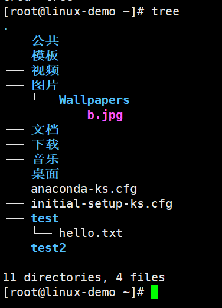
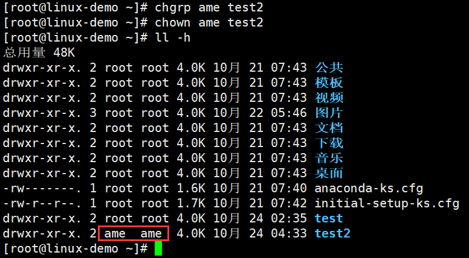
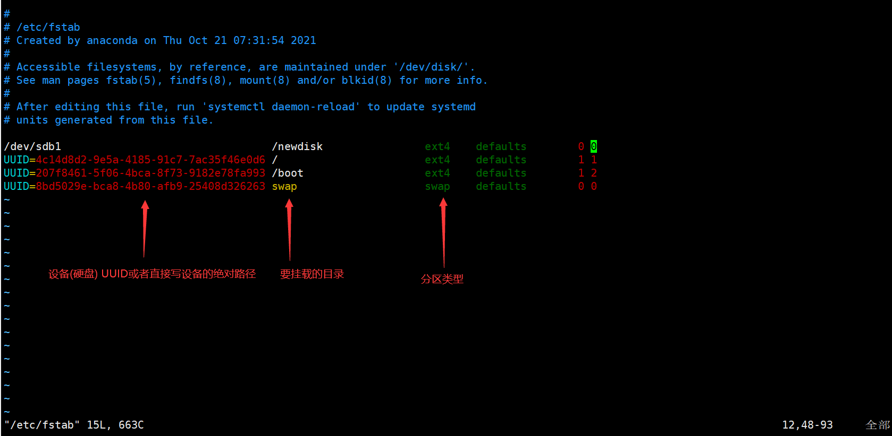
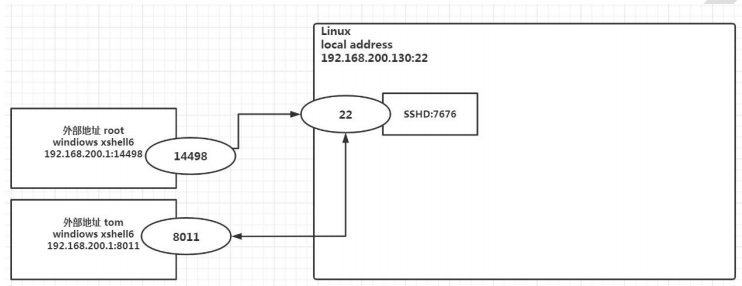
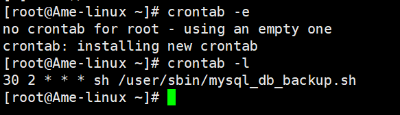

[toc]


# 1、Linux 介绍 

## 1.1 Linux概述

1. linux 怎么读， 不下 10 种 

2. > Linux，全称GNU/Linux，是一种免费使用和自由传播的[类UNIX](https://baike.baidu.com/item/类UNIX/9032872)操作系统，其内核由[林纳斯·本纳第克特·托瓦兹](https://baike.baidu.com/item/林纳斯·本纳第克特·托瓦兹/1034429)于1991年10月5日首次发布，它主要受到[Minix](https://baike.baidu.com/item/Minix/7106045)和Unix思想的启发，是一个基于[POSIX](https://baike.baidu.com/item/POSIX)的多用户、[多任务](https://baike.baidu.com/item/多任务/1011764)、支持[多线程](https://baike.baidu.com/item/多线程/1190404)和多[CPU](https://baike.baidu.com/item/CPU)的操作系统。它能运行主要的[Unix](https://baike.baidu.com/item/Unix/219943)工具软件、应用程序和网络协议。它支持[32位](https://baike.baidu.com/item/32位/5812218)和[64位](https://baike.baidu.com/item/64位)硬件。Linux继承了Unix以网络为核心的设计思想，是一个性能稳定的多用户网络操作系统。Linux有上百种不同的发行版，如基于社区开发的[debian](https://baike.baidu.com/item/debian/748667)、[archlinux](https://baike.baidu.com/item/archlinux/10857530)，和基于商业开发的[Red Hat Enterprise Linux](https://baike.baidu.com/item/Red Hat Enterprise Linux/10770503)、[SUSE](https://baike.baidu.com/item/SUSE/60409)、[Oracle Linux](https://baike.baidu.com/item/Oracle Linux/6876458)等。
   >
   > linux 是一个开源、免费的操作系统，其稳定性、安全性、处理多并发已经得到业界的认可，目前很多企业级的项目 (c/c++/php/python/java/go)都会部署到 Linux/unix 系统上。

3. 常见的操作系统(windows、IOS、Android、MacOS, Linux, Unix)

4. Linux 吉祥物 


5. Linux 之父 

> **林纳斯·本纳第克特·托瓦兹**（Linus Benedict Torvalds，1969年12月28日- ），芬兰赫尔辛基人，著名的电脑程序员，Linux内核的发明人及该计划的合作者 [1] ，毕业于赫尔辛基大学计算机系，1997年至2003年在美国加州硅谷任职于全美达公司（Transmeta Corporation），现受聘于开放源代码开发实验室（OSDL：Open Source Development Labs, Inc），全力开发Linux内核。

## 1.2 Linux与Unix

> UNIX 与 Linux 之间的关系是一个很有意思的话题。在目前主流的服务器端操作系统中，UNIX 诞生于 20 世纪 60 年代末，Windows 诞生于 20 世纪 80 年代中期，Linux 诞生于 20 世纪 90 年代初，可以说 UNIX 是操作系统中的"老大哥"，后来的 Windows 和 Linux 都参考了 UNIX。

http://c.biancheng.net/view/707.html

# 2、VM与Linux的安装

## 2.1 安装 vm 和 Centos 

**基本说明：**学习 Linux 需要一个环境，我们需要创建一个虚拟机，然后在虚拟机上安装一个 Centos 系统来学习 

1. 先安装 virtual machine 15.5 

2. 再安装 Linux (CentOS 7.6/centOS8.1) 

3. 原理示意图

## 2.2 vmware15.5 下载与安装

1. 官方地址：https://www.vmware.com/cn.html 

2. 其它地址：https://www.nocmd.com/windows/740.html

**在安装之前要去 BIOS 里修改设置开启虚拟化设备支持**（一般是已经开启虚拟化的）

## 2.4 CentOS 下载和安装

https://developer.aliyun.com/mirror/centos?spm=a2c6h.13651102.0.0.21a41b11zAyrWR

用于生成复杂密码：https://suijimimashengcheng.51240.com/

- 网络连接三种方式
  - 桥接模式，虚拟系统可以和外部系统通讯，但是容易造成IP冲突
  - NAT模式，网络地址转换模式虚拟系统可以和外部系统通讯，不易造成IP冲突
  - 主机模式，独立的系统

## 2.5 启动CentOS

## 2.6 虚拟机克隆 

如果你已经安装了一台 linux 操作系统，你还想再更多的，没有必要再重新安装，你只需要克隆就可 以。 

1) 方式 1，直接拷贝一份安装好的虚拟机文件 

2) 方式 2，使用 vmware 的克隆操作，注意， 克隆时，需要先关闭 linux 系统

## 2.7 虚拟机快照 

如果你在使用虚拟机系统的时候(比如 linux)，你想回到原先的某一个状态，也就是说你担心可能有些误操作造成系 统异常，需要回到原先某个正常运行的状态，vmware 也提供了这样的功能，就叫快照管理 。

## 2.8 虚拟机迁移和删除 

在前面讲过，虚拟系统安装好了，它的本质就是文件(放在文件夹的)。因此虚拟系统的迁移很方便，你可以把安 装好的虚拟系统这个**文件夹整体拷贝或者剪切**到另外位置使用。删除也很简单，用 **vmware** **进行移除**，再点击菜单->从磁盘删除即可，或者直**接手动删除虚拟系统对应的文件夹**即可。

## 2.9 安装 vmtools 

**介绍：**

1) vmtools 安装后，可以让我们在 windows 下更好的管理 vm 虚拟机 

2) 可以设置 windows 和 centos 的共享文件夹

**步骤：**

```shell
1) 进入 centos 
2) 点击 vm 菜单的->install vmware tools 
3) centos 会出现一个 vm 的安装包, xx.tar.gz 
4) 拷贝到 /opt 
5) 使用解压命令 tar, 得到一个安装文件 
    cd /opt [进入到 opt 目录] 
    tar -zxvf xx.tar.gz 
6) 进入该 vm 解压的目录 , /opt 目录下 
	cd vmware...
7) 安装 ./vmware-install.pl 
8) 全部使用默认设置即可, 就可以安装成功 
9) 注意：安装 vmtools 需要有 gcc . 
	gcc -v
```

# 3、Linux的目录结构

**特点：**

1. `/`（根）是所有目录的顶点。
2. 目录结构像一颗倒挂的树。
3. 目录和磁盘分区，默认是没有关联的。
4. `/`（根）下不同的目录可能会对应不同的分区或磁盘。
5. 所有的目录都是按照一定的类别和规律组成的。


1) /bin [常用] (/usr/bin 、 /usr/local/bin) 是 Binary 的缩写, 这个目录存放着最经常使用的命令 

2) /sbin (/usr/sbin 、 /usr/local/sbin) s 就是 Super User 的意思，这里存放的是系统管理员使用的系统管理程序。 

3) /home [常用] 存放普通用户的主目录，在 Linux 中每个用户都有一个自己的目录，一般该目录名是以用户的账号命名

4) /root [常用] 该目录为系统管理员，也称作超级权限者的用户主目录 

5) /lib 系统开机所需要最基本的动态连接共享库，其作用类似于 Windows 里的 DLL 文件。几乎所有的应用程序都需要 用到这些共享库 

6) /lost+found 这个目录一般情况下是空的，当系统非法关机后，这里就存放了一些文件 

7) /etc [常用] 所有的系统管理所需要的配置文件和子目录, 比如安装 mysql 数据库 my.conf 

8) /usr [常用] 这是一个非常重要的目录，用户的很多应用程序和文件都放在这个目录下，类似与 windows 下的 program files 目录。 

9) /boot [常用] 存放的是启动 Linux 时使用的一些核心文件，包括一些连接文件以及镜像文件 

10) /proc [不能动] 这个目录是一个虚拟的目录，它是系统内存的映射，访问这个目录来获取系统信息 

11) /srv [不能动] service 缩写，该目录存放一些服务启动之后需要提取的数据 

12) /sys [不能动]这是 linux2.6 内核的一个很大的变化。该目录下安装了 2.6 内核中新出现的一个文件系统 sysfs =》【别动】 

13) /tmp 这个目录是用来存放一些临时文件的 

14) /dev 类似于 windows 的设备管理器，把所有的硬件用文件的形式存储 

15) /media [常用] linux 系统会自动识别一些设备，例如 U 盘、光驱等等，当识别后，linux 会把识别的设备挂载到这个 目录下 

16) /mnt [常用] 系统提供该目录是为了让用户临时挂载别的文件系统的，我们可以将外部的存储挂载在/mnt/上，然后进入该目录就可以查看里的内容了。 d:/myshare 

17) /opt 这是给主机额外安装软件所存放的目录。如安装 ORACLE 数据库就可放到该目录下。默认为空 

18) /usr/local [常用] 这是另一个给主机额外安装软件所安装的目录。一般是通过编译源码方式安装的程序 

19) /var [常用] 这个目录中存放着在不断扩充着的东西，习惯将经常被修改的目录放在这个目录下。包括各种日志文件 

20) /selinux [security-enhanced linux] SELinux 是一种安全子系统,它能控制程序只能访问特定文件, 有三种工作模式，可以自行设置.

# 4、远程登录到Linux

**为什么需要远程登录 Linux** 

**说明:** 公司开发时候， 具体的应用场景是这样的 

1) linux 服务器是开发小组共享 

2) 正式上线的项目是运行在公网 

3) 因此程序员需要远程登录到 Linux 进行项目管理或者开发 

4) 画出简单的网络拓扑示意图(帮助理解) 

5) 远程登录客户端有 Xshell6， Xftp6 , 我们学习使用 Xshell 和 Xftp6 , 其它的远程工具大同小异

## 4.1 远程登录Xshell

> Xshell [1] 是一个强大的安全终端模拟[软件](https://baike.baidu.com/item/软件/12053)，它支持SSH1, SSH2, 以及Microsoft Windows 平台的TELNET 协议。Xshell 通过互联网到远程[主机](https://baike.baidu.com/item/主机/455151)的安全连接以及它创新性的设计和特色帮助用户在复杂的网络环境中享受他们的工作。
>
> Xshell可以在Windows界面下用来访问远端不同系统下的[服务器](https://baike.baidu.com/item/服务器/100571)，从而比较好的达到远程控制终端的目的。除此之外，其还有丰富的外观配色方案以及样式选择。

地址：https://www.netsarang.com/en/free-for-home-school/

在连接Linux时需要IP地址，可在Linux终端输入ifconfig查看


## 4.2 文件上传和下载Xftp

> Xftp是一个功能强大的[SFTP](https://baike.baidu.com/item/SFTP/1184182)、[FTP](https://baike.baidu.com/item/FTP/13839) 文件传输软件。使用了 Xftp 以后，MS Windows 用户能安全地在 [UNIX](https://baike.baidu.com/item/UNIX/219943)/[Linux](https://baike.baidu.com/item/Linux/27050) 和 [Windows](https://baike.baidu.com/item/Windows/165458) PC 之间传输文件。Xftp 能同时适应初级用户和高级用户的需要。它采用了标准的 Windows 风格的向导，它简单的界面能与其他 Windows 应用程序紧密地协同工作，此外它还为高级用户提供了众多强劲的功能特性。

连接和Xshell类似

# 5、Vi和Vim编辑器

## 5.1 vi 和 vim 的基本介绍 

Linux 系统会内置 vi 文本编辑器 

Vim 具有程序编辑的能力，可以看做是 Vi 的增强版本，可以主动的以字体颜色辨别语法的正确性，方便程序设计。 代码补完、编译及错误跳转等方便编程的功能特别丰富，在程序员中被广泛使用。

## 5.2 vi 和 vim 常用的三种模式 

- **正常模式** 

以 vim 打开一个档案就直接进入一般模式了(这是**默认的模式**)。在这个模式中， 你可以使用『上下左右』按键来 移动光标，你可以使用『删除字符』或『删除整行』来处理档案内容， 也可以使用『复制、粘贴』来处理你的文件数 据。

- **插入模式** 

按下 i, I, o, O, a, A, r, R 等任何一个字母之后才会进入编辑模式, 一般来说按 i 即可. 

- **命令行模式** 

输入 esc 再输入：在这个模式当中， 可以提供你相关指令，完成读取、存盘、替换、离开 vim 、显 示行号等的动作则是在此模式中达成的！


## 5.3 常用快捷键

1) 拷贝当前行 yy , 拷贝当前行向下的 5 行 5yy，并粘贴（输入 p）。 

2) 删除当前行 dd , 删除当前行向下的 5 行 5dd 

3) 在文件中查找某个单词 [命令行下 /关键字 ， 回车 查找 , 输入 n 就是查找下一个 ] 

4) 设置文件的行号，取消文件的行号.[命令行下 : set nu 和 :set nonu] 

5) 编辑 /etc/profile 文件，在一般模式下, 使用快捷键到该文档的最末行[G]和最首行[gg] 

6) 在一个文件中输入 "hello" ,在一般模式下, 然后又撤销这个动作 u 

7) 编辑 /etc/profile 文件，在一般模式下, 并将光标移动到 , 输入 20,再输入 shift+g


# 6、开机 重启 用户管理

## 6.1 关机 重启命令 

1) shutdown –h now 	立该进行关机 

2) shudown -h 1             "hello, 1 分钟后会关机了" 

3) shutdown –r now      现在重新启动计算机 

4) halt                               关机，作用和上面一样. 

5) reboot                          现在重新启动计算机 

6) sync                              把内存的数据同步到磁盘.

**注意细节：** 

1) 不管是重启系统还是关闭系统，首先要运行 **sync** 命令，把内存中的数据写到磁盘中 

2) 目前的 shutdown/reboot/halt 等命令均已经在关机前进行了 sync ，不过还是小心驶得万年船

## 6.2 用户登录和注销

Linux 系统是一个多用户多任务的操作系统，任何一个要使用系统资源的用户，都必须首先向系统管理员申请一个 账号，然后以这个账号的身份进入系统

1) 登录时尽量少用 root 帐号登录，因为它是系统管理员，最大的权限，避免操作失误。可以利用普通用户登录，登录后再用`su - 用户名`命令来切换成系统管理员身份. 

2) 在提示符下输入 logout 即可注销用户 

**注意:** logout 注销指令在图形运行级别无效，在运行级别 3 下有效.

## 6.3 添加用户

```
useradd 用户名
```

添加一个用户xxx时, 默认该用户的家目录在 /home/xxx

也可以通过 `useradd -d 指定目录 用户名`，给新创建的用户指定家目录

## 6.4 密码修改

```
passwd 用户名
```


## 6.5 用户删除

```
userdel 用户名
```

**注意：**

1) 删除用户 milan，但是要保留家目录`userdel milan `

2) 删除用户以及用户主目录, 比如 tom, `userdel -r tom`

## 6.6 查询用户信息

```
id 用户名
```


## 6.7 切换用户

```
su 用户名
```

**说明：**

1) 从权限高的用户切换到权限低的用户，不需要输入密码，反之需要。 

2) 当需要返回到原来用户时，使用 `exit`/`logout `指令

## 6.8 查看当前用户

```
whoami
who am i
```


## 6.9 用户组

将不同的用户进行分组，可能拥有的权限不同

- **新增组**

```
groupadd 组名
```

- **删除组**

```
groupdel 组名
```

- **修改用户的组**

```
usermod –g 用户组 用户名
```

**说明：**在创建用户的时候如果不分组则会默认以用户名创建一个组，也可在创建时分组`useradd -g 组名 用户名`

## 6.10 用户和组相关文件

- **/etc/passwd 文件**

用户（user）的配置文件，记录用户的各种信息 

**每行的含义：**用户名:口令:用户标识号:组标识号:注释性描述:主目录:登录 Shell

> 什么是shell
>
> 在计算机科学中，Shell俗称壳（用来区别于核），是指“为使用者提供操作界面”的[软件](https://baike.baidu.com/item/软件/12053)（command interpreter，命令解析器）。它类似于[DOS](https://baike.baidu.com/item/DOS/32025)下的[COMMAND.COM](https://baike.baidu.com/item/COMMAND.COM/8063418)和后来的[cmd.exe](https://baike.baidu.com/item/cmd.exe/8192925)。它接收用户命令，然后调用相应的[应用程序](https://baike.baidu.com/item/应用程序/5985445)。
>
> 通俗的讲就是：我们敲的各种命令其实Linux内核并不认识，而shell则充当这个翻译官的角色


此处用户ame就用的是bashell

- **/etc/shadow 文件** 

口令的配置文件 

**每行的含义：**登录名:加密口令:最后一次修改时间:最小时间间隔:最大时间间隔:警告时间:不活动时间:失效时间:标志


- **/etc/group 文件** 

组(group)的配置文件，记录 Linux 包含的组的信息 

**每行含义：**组名:口令:组标识号:组内用户列表


# 7、实用命令

## 7.1 指定运行级别

- **运行级别说明：** 

0 ：关机 

1 ：单用户【找回丢失密码】 

2：多用户状态没有网络服务 

3：**多用户状态有网络服务** 

4：系统未使用保留给用户 

5：图形界面 

6：系统重启 

常用运行级别是 3 和 5 ，也可以指定默认运行级别，

- **切换运行级别**

```
init 运行级别对应数字
```

可以用这种方式来关机和重启

- **修改开机默认运行级别**

在 centos7 以前， **/etc/inittab** 文件中

进行了简化 ，如下:

```
multi-user.target: analogous to runlevel 3 
graphical.target: analogous to runlevel 5 
# To view current default target, run: 
systemctl get-default 
# To set a default target, run: 
systemctl set-default TARGET.target
```

查看当前开机默认运行级别：

```
systemctl get-default
```


修改当前开机默认运行级别：

```
systemctl set-default TARGET.target
```

例如修改为3级别


## 7.2 帮助指令

### man 获得帮助信息 

获得帮助信息

```
man [命令或配置文件] 指令
```

### help指令

获得 shell 内置命令的帮助信息

```
help 指令
指令 --help
```

## 7.3 文件目录类

### pwd指令

显示当前工作目录的绝对路径

```
pwd
```

### ls指令

查看当前目录

```
ls [选项] [目录或是文件]
```

`-a` ：显示当前目录所有的文件和目录，包括隐藏的。 

`-l` ：以列表的方式显示信息（`ls -l`指令可以缩写成`ll`）

`-h`：给文件大小加上单位，更加人性化


- 选项可以搭配使用


### tree指令

```
tree
```



### cd指令

切换到指定目录

```
cd 绝对目录或相对目录
```

`cd ~` 或者 cd ：回到自己的家目录, 比如 你是 root ， cd ~ 到 /root 

`cd ..` 回到当前目录的上一级目录

### mkdir指令

创建目录

```
mkdir [选项] 要创建的目录
```

`-p` ：创建多级目录

### rmdir指令

删除空目录

```
rmdir [选项] 要删除的空目录
```

- 说明

rmdir 删除的是空目录，如果目录下有内容时无法删除的。 如果需要删除非空目录，需要使用 rm -rf 要删除的目录

比如： rm -rf /home/animal

### touch指令

在该目录下创建空文件

```
touch 文件名
```

### cp指令

拷贝文件到指定目录

```
cp [选项] 要拷贝的文件 要拷贝到的目录
```

`-r`：递归复制整个文件夹

- 说明

强制覆盖不提示的方法：`\cp` , 例如 `\cp -r /home/bbb /opt`

### rm指令

移除文件或目录

```
rm [选项] 要删除的文件或目录
```

`-r` ：递归删除整个文件夹 

`-f` ： 强制删除不提示

### mv指令

移动文件与目录或重命名

```
mv /temp/movefile /targetFolder (文件移动，也就是剪切)
mv oldNameFile newNameFile (当要移动的目录就是本目录就是改名操作，或者在要移动的目录下添加一个新的名字也是改名操作)
```


### cat指令

查看文件内容

```
cat [选项] 要查看的文件
```

`-n` ：显示行号

- 说明

cat 只能浏览文件，而不能修改文件，为了浏览方便，一般会带上 管道命令 | more 

cat -n /etc/profile | more [进行交互]

### more指令

more 指令是一个基于 VI 编辑器的文本过滤器，它以全屏幕的方式按页显示文本文件的内容。more 指令中内置了若 干快捷键(交互的指令)，详见操作说明

```
more 要查看的文件
```


| 操作           | 功能说明                            |
| -------------- | ----------------------------------- |
| 空白键( space) | 代表向下翻一页;                     |
| Enter          | 代表向下翻『一行』;                 |
| q              | 代表立刻离开more,不再显示该文件内容 |
| CtrI+F         | 向下滚动一屏                        |
| Ctrl+B         | 返回上一屏                          |
| =              | 输出当前行的行号                    |
| :f             | 输出文件名和当前行的行号            |

### less指令

less 指令用来分屏查看文件内容，它的功能与 more 指令类似，但是比 more 指令更加强大，支持各种显示终端。**less 指令在显示文件内容时，并不是一次将整个文件加载之后才显示，而是根据显示需要加载内容，对于显示大型文件具有 较高的效率。**

```
less 要查看的文件
```

| 操作       | 功能说明                                       |
| ---------- | ---------------------------------------------- |
| 空白键     | 向下翻动一页;                                  |
| [pagedown] | 向下翻动一页                                   |
| [pageup]   | 向上翻动一页;                                  |
| /字串      | 向下搜寻[字串J的功能;n:向下查找;N:向上查找;    |
| ?字串      | 向上搜寻[字串」的功能; n:向上查找; N:向下查找; |
| q          | 离开less这个程序;                              |

### echo指令

输出内容到控制台

```
echo [选项] [输出内容]
```

### head指令

用于输出文件中尾部的内容，默认情况下 tail 指令显示文件的前 10 行内容。

```
tail 文件  		（功能描述：查看文件尾 10 行内容）
tail -n 5 文件 	（功能描述：查看文件尾 5 行内容，5 可以是任意行数）
tail -f 文件 		（功能描述：实时追踪该文档的所有更新）
```

### tail指令

用于输出文件中尾部的内容，默认情况下 tail 指令显示文件的前 10 行内容。

```
tail 文件 		（功能描述：查看文件尾 10 行内容）
tail -n 5 文件 	（功能描述：查看文件尾 5 行内容，5 可以是任意行数）
tail -f 文件 		（功能描述：实时追踪该文档的所有更新）
```

### > 指令和 >> 指令

`>` 输出重定向(覆盖)

`>>` 追加

可以将要输出到终端的内容覆盖或追加到具体文件中，通常和其他指令配合使用

### ln指令

软链接也称为符号链接，类似于 windows 里的快捷方式，主要存放了链接其他文件的路径

```
ln -s [原文件或目录] [软链接名]
```


- **说明：**当我们pwd时，看得到仍然是软连接目录


软连接也是一个目录可以删除


### history指令

查看已经执行过历史命令,也可以执行历史指令

```
history 		（查看已经执行过历史命令）
history 10		（显示最近使用过的 10 个指令。）
```


```
!历史指令所在行号	（再次执行该指令）
```


## 7.4 时间日期

### date指令

```
date 						（功能描述：显示当前时间）
date +%Y					（功能描述：显示当前年份）
date +%m					（功能描述：显示当前月份）
date +%d 					（功能描述：显示当前是哪一天）
date "+%Y-%m-%d %H:%M:%S"	（功能描述：显示年月日时分秒）
```

`-s`：设置系统时间日期，比如设置成 2020-11-03 20:02:10，`date -s "2020-11-03 20:02:10"`

### cal指令

```
cal			（显示本月日历）
cal 2021	（显示2021年的一整年日历）
```

## 7.5 搜索查找

### find指令

find 指令将从指定目录向下递归地遍历其各个子目录，将满足条件的文件或者目录显示在终端。

```
find [搜索范围] [选项]
```

`-name 文件名`：按照指定的文件名查找模式查找文件

`-user 用户名`：查找属于指定用户名所有文件

`-size 文件大小`：按照指定的文件大小查找文件。（+n 大于 -n 小于 n 等于, 单位有 k,M,G）

`-atime +时间n` ：表示查找n天前的文件/目录。也是用 + - 表示，用法同上

例如：在全盘查找大于200M的文件，`find / -size +200M`

### locate指令

locate 指令可以快速定位文件路径。**locate 指令利用事先建立的系统中所有文件名称及路径的 locate 数据库实现快速定位给定的文件。Locate 指令无需遍历整个文件系统，查询速度较快。为了保证查询结果的准确度，管理员必须定期更新 locate。**

```
locate 文件名
```

- **说明：**由于 locate 指令基于数据库进行查询，所以第一次运行前，必须使用 `updatedb` 指令创建 locate 数据库。

### which指令

可以查看某个指令在哪个目录下

```
which 指令
```


### grep指令和管道符 |

grep 过滤查找 ， 管道符`|`，表示将前一个命令的处理结果输出传递给后面的命令处理。

```
grep [选项] 查找内容 源文件
```

`-n`：显示匹配行及行号。

`-i`：忽略字母大小写

`-v` ：匹配不包含后面查找内容的文件

## 7.6 压缩和解压

### gzip/gunzip 指令

gzip 用于压缩文件， gunzip 用于解压的

```
gzip 文件 		（功能描述：压缩文件，只能将文件压缩为*.gz 文件） 
gunzip 文件.gz 	（功能描述：解压缩文件命令）
```

### zip unzip指令

zip 用于压缩文件， unzip 用于解压的

```
zip [选项] XXX.zip 将要压缩的内容	（功能描述：压缩文件和目录的命令） 
unzip [选项] XXX.zip				（功能描述：解压缩文件）
```

zip 常用选项:

`-r`：递归压缩，即压缩目录

unzip 的常用选项：

`-d 目录`：指定解压后文件的存放目录

### tar指令

将文件夹打包，也能将包解开成文件夹。

``` 
tar [选项] XXX.tar.gz 打包的内容 		（打包目录，压缩后的文件格式.tar.gz）
tar [选项] 要解压的文件 -C 要解压到的目录（解压）
tar -zxvf XXX
```

`-c` ：（create）建立打包文件

`-t ` ：查看打包文件的内容含有哪些文件

`-x` ：解打包或解压缩的功能，可以搭配-C(大写)在特定目录解开

`-j` ：通过bzip2的支持进行压缩/解压缩，此时文件最好为*.tar.bz2

`-z` ：通过gzip的支持进行压缩/解压缩，此时文件最好为*.tar.gz

`-v` ：在压缩/解压缩的过程中，将正在处理的文件名显示出来

`-f 要处理的文件名`：-f 后面跟处理后文件的全名称（路径+文件名+后缀名）

`-C 目录`：这个选项用在解压缩，若要在特定目录解压缩，可以使用这个选项

`-p`：保留备份数据的原本权限与属性，常用于备份(-c)重要的配置文件

`--exclude=FILE` :在压缩的过程中,不要将那些文件打包

# 8、组管理和权限管理

## 8.1 Linux 组基本介绍及创建

在 linux 中的每个用户必须属于一个组，不能独立于组外。在 linux 中每个文件有所有者、所在组、其它组的概念。

```
groupadd 组名	（创建组）
```

## 8.2 文件/目录 所有者 

一般为文件的创建者,谁创建了该文件，就自然的成为该文件的所有者。


## 8.3 修改文件/目录的所有者和组

```
chown 用户名 文件名				（修改文件所有者）
chgrp 组名 文件名				（修改文件的组）
chown newowner:newgroup 文件/目录 （改变所有者和所在组）
```

`-R` 如果是目录 则使其下所有子文件或目录递归生效



## 8.4 rwx权限介绍

- **rwx 作用到文件** 

1) [ r ]代表可读(read): 可以读取,查看 

2) [ w ]代表可写(write): 可以修改,但是不代表可以删除该文件,**删除一个文件的前提条件是对该文件所在的目录有写权 限，才能删除该文件**

3) [ x ]代表可执行(execute):可以被执行

- **rwx 作用到目录** 

1. [ r ]代表可读(read): 可以读取，ls 查看目录内容 

2) [ w ]代表可写(write): 可以修改, 对目录内创建+删除+重命名目录 

3) [ x ]代表可执行(execute):可以进入该目录

## 8.5 文件/目录的权限及具体信息


例如：

```
drwxr-xr-x. 2 root root 4096 10月 24 02:35 test
```

- `drwxr-xr-x`
  - 第一位确定文件类型(d, - , l , c , b) 
    l 是链接，相当于 windows 的快捷方式
    d 是目录，相当于 windows 的文件夹 
    c 是字符设备文件，鼠标，键盘 
    b 是块设备，比如硬盘
  - 再后三位（2到4位）是文件**所有者**拥有的权限，通常是rwx，如果没有其中的一个权限则用`-`表示---User
  - 再后三位（5到7位）是文件**所属组**（该组用户）的权限---Group
  - 最后三位（8到10位）是**其他用户**（非所有者、非该组的用户）的权限---Other

- `2` 如果这是一个文件则该数为1，如果是一个目录则该数字表示该目录下的目录或文件个数
- `4096` 是该文件的大小，默认为字节，可以`-h`切换单位
- `10月 24 02:35` 文件最后一次修改的时间

## 8.6 文件/目录权限的修改 chmod指令

通过 chmod 指令，可以修改**文件或者目录**的权限。

```
chmod [选项] 文件名
```

`u` 所有者

`g` 所有组

`o` 其他用户

`a` 所有用户（u、g、o 的总和）

- 第一种方式通过`+ - =` 变更权限，例如
  - `chmod u=rwx,g=rx,o=x 文件/目录名` 赋予所有者读写执行的权限，所有组读和执行权限，其他人执行的权限
  - `chmod o+w 文件/目录名` 给其他用户添加写的权限
  - `chmod a-x 文件/目录名` 取消所有用户执行的权限
  - 以此类推...

- 第二种方式通过数字变更权限
  其中`r=4 w=2 x=1` ，由这三个权限所组成的七种不同的权限组合对应了七个不同的数组（不同的权限组合只需将数字相加）
  例如：`chmod u=rwx,g=rx,o=x 文件/目录名`相当于 `chmod 751 文件/目录名`

# 9、定时任务调度

## 9.1 crond 任务调度

crond是linux下用来周期性的执行某种任务或等待处理某些事件的一个守护进程，与windows下的计划任务类似，当安装完成操作系统后，默认会安装此服务工具，并且会自动启动crond进程，crond进程每分钟会定期检查是否有要执行的任务，如果有要执行的任务，则自动执行该任务。Linux下的任务调度分为两类，系统任务调度和用户任务调度。

**系统任务调度**：系统周期性所要执行的工作，比如写缓存数据到硬盘、日志清理等。在/etc目录下有一个crontab文件，这个就是系统任务调度的配置文件

**用户任务调度**：用户定期要执行的工作，比如用户数据备份、定时邮件提醒等。用户可以使用 crontab 工具来定制自己的计划任务。所有用户定义的crontab 文件都被保存在 /var/spool/cron目录中。其文件名与用户名一致。下面是几个特殊的文件介绍：

- 文件：/etc/cron.deny                该文件中所列用户不允许使用crontab命令
- 文件：/etc/cron.allow                该文件中所列用户允许使用crontab命令
- 文件：/var/spool/cron/              所有用户crontab文件存放的目录,以用户名命名

==**crontab文件**==

​        用户所建立的crontab文件中，每一行都代表一项任务，每行的每个字段代表一项设置，它的格式共分为六个字段，前五段是时间设定段，第六段是要执行的命令段，格式如下：

```
minute hour day month week command
```

其中：

- minute： 表示分钟，可以是从0到59之间的任何整数。
- hour：表示小时，可以是从0到23之间的任何整数。
- day：表示日期，可以是从1到31之间的任何整数。
- month：表示月份，可以是从1到12之间的任何整数。
- week：表示星期几，可以是从0到7之间的任何整数，这里的0或7代表星期日。

- command：要执行的命令，可以是系统命令，也可以是自己编写的脚本文件。

在以上各个字段中，还可以使用以下特殊字符：

- 星号（`*`）：代表所有可能的值，例如month字段如果是星号，则表示在满足其它字段的制约条件后每月都执行该命令操作。
- 逗号（`,`）：可以用逗号隔开的值指定一个列表范围，例如，“1,2,5,7,8,9”
- 中杠（`-`）：可以用整数之间的中杠表示一个整数范围，例如“2-6”表示“2,3,4,5,6”
- 正斜线（`/`）：可以用正斜线指定时间的间隔频率，例如“0-23/2”表示每两小时执行一次。同时正斜线可以和星号一起使用，例如*/10，如果用在minute字段，表示每十分钟执行一次。


**==crontab命令详解==**

```
crontab [-u user] file
crontab [-u user] [ -e | -l | -r ]
```

**命令功能**

通过crontab 命令，我们可以在固定的间隔时间执行指定的系统指令或 shell script脚本。时间间隔的单位可以是分钟、小时、日、月、周及以上的任意组合。这个命令非常设合周期性的日志分析或数据备份等工作。

**命令参数**

- `-u user`：用来设定某个用户的crontab服务，例如，“-u ixdba”表示设定ixdba用户的crontab服务，此参数一般有root用户来运行。
- `file`：file是命令文件的名字,表示将file做为crontab的任务列表文件并载入crontab。如果在命令行中没有指定这个文件，crontab命令将接受标准输入（键盘）上键入的命令，并将它们载入crontab。
- `-e`：编辑某个用户的crontab文件内容。如果不指定用户，则表示编辑当前用户的crontab文件。
- `-l`：显示某个用户的crontab文件内容，如果不指定用户，则表示显示当前用户的crontab文件内容。
- `-r`：从/var/spool/cron目录中删除某个用户的crontab文件，如果不指定用户，则默认删除当前用户的crontab文件。
- `-i`：在删除用户的crontab文件时给确认提示。

## 9.2 at定时任务

1) at 命令是一次性定时计划任务，at 的守护进程 atd 会以后台模式运行，检查作业队列来运行。 

2) 默认情况下，atd 守护进程每 60 秒检查作业队列，有作业时，会检查作业运行时间，如果时间与当前时间匹配，则运行此作业。 

3) at 命令是一次性定时计划任务，执行完一个任务后不再执行此任务了 

4) 在使用 at 命令的时候，一定要保证 atd 进程的启动，可以使用`ps -ef | grep atd`指令来查看atd 是否在运行

```
at [选项] [时间] 
输入两次Ctrl + D （结束 at 命令的输入）
```

`-m` 当指定的任务被完成后,将给用户发送邮件,即使没有标准输出

`-I` atq的别名

`-d` atrm的别名

`-v` 显示任务将被执行的时间

`-c` 打印任务的内容到标准输出

`-V` 显示版本信息

`-q <队列>` 使用指定的队列

`-f <文件>` 从指定文件读入任务而不是从标准输入读入

`-t <时间参数>` 以时间参数的形式提交要运行的任务

**at 时间定义**

at允许使用一套相当复杂的指定时间的方法

1）能够接受在当天的hh:mm（小时:分钟）式的时间指定。假如该时间已过去，那么就放在第二天执行。 例如：04:00

2）能够使用midnight（深夜），noon（中午），teatime（饮茶时间，一般是下午4点）等比较模糊的词语来指定时间。

3）能够采用12小时计时制，即在时间后面加上AM（上午）或PM（下午）来说明是上午还是下午。 例如：12pm

4）能够指定命令执行的具体日期，指定格式为month day（月 日）或mm/dd/yy（月/日/年）或dd.mm.yy（日.月.年），指定的日期必须跟在指定时间的后面。 例如：04:00 2009-03-1

5）能够使用相对计时法。指定格式为：now + count time-units ，now就是当前时间，time-units是时间单位，这里能够是minutes（分钟）、hours（小时）、days（天）、weeks（星期）。count是时间的数量，几天，几小时。 例如：now + 5 minutes 04pm + 3 days

6）能够直接使用today（今天）、tomorrow（明天）来指定完成命令的时间。

# 10、Linux磁盘、磁盘分区、挂载

## 10.1 Linux磁盘

**硬盘说明 ：**
（1）Linux硬盘分**IDE硬盘**和**SCSI硬盘**，目前基本上是SCSI硬盘

（2）对于**IDE硬盘**，驱动器标识符为“hdx~”,其中“hd”表明分区所在设备的类型，这里是指 IDE硬盘了。“x”为盘号（a为基本盘，b为基本从属盘，c为辅助主盘，d为辅助从属 盘）,“~”代表分区，前四个分区用数字1到4表示，它们是主分区或扩展分区，从5开始就 是逻辑分区。例，hda3表示为第一个IDE硬盘上的第三个主分区或扩展分区,hdb2表示为 第二个IDE硬盘上的第二个主分区或扩展分区。

（3）对于**SCSI硬盘**则标识为“sdx~”，SCSI硬盘是用“sd”来表示分区所在设备的类型的，其余则和IDE硬盘的表示方法一样。

`lsblk` 或 `lsblk -f` 指令可以查看所有设备挂载情况

> 列出块设备的信息。(所谓块设备就是磁盘)


可以使用虚拟机为centOS添加磁盘

## 10.2 磁盘分区

Linux 来说无论有几个分区，分给哪一目录使用，它归根结底就只有一个根目录，一个独立且唯一的文件结构 , Linux 中每个分区都是用来组成整个文件系统的一部分。 

Linux 采用了一种叫“载入”的处理方法，它的整个文件系统中包含了一整套的文件和目录，且将一个分区和一个目录联系起来。这时要载入的一个分区将使它的存储空间在一个目录下获得。


**说明：**分区格式化后才有这个UUID标识

**磁盘分区命令：**


前面提到Linux的/dev目录把所有的硬件用文件的形式存储，所以：

```
fdisk /dev/磁盘名
```

`d`   删除分区

`F`   列出未分区的空闲区

`l`   列出已知分区类型

`n`   添加新分区

`p`   打印分区表

`t`   更改分区类型

`v`   检查分区表

`i`   打印某个分区的相关信息

`w`   将分区表写入磁盘并退出

`q`   退出而不保存更改

**说明：** 开始分区后输入n新增分区，然后选择p设置分区类型为主分区。1指的是主分区的第1块分区。两次回车默认剩余空间。最后输入w写入分区并退出，若不保存退出输入q。
`lsblk -f`，就会看到新增的分区sdb1


## 10.3 格式化磁盘

>  创建一个Linux 文件系统。(作用在磁盘上就可以认为是格式化磁盘)

```
mkfs -t ext4 /dev/磁盘名 
```

其中 ext4 是分区类型

格式化后sdb1也有了UUID：


## 10.4 挂载

> 挂载文件系统。

```
mount 设备名称 挂载目录
```

例如：`mount /dev/sdb1 newdisk/`

==**注意：**以上命令行方式挂载，重启后会失效，也就意味着这种方式的挂载是临时的==

想要永久挂载，需要修改/etc/fstab文件，打开该文件：



保存退出即可

## 10.5 卸载

> 卸载文件系统。

```
umount 设备名称 挂载目录
```

被卸载的磁盘分区就可以自由挂载到其他目录

## 10.6 磁盘使用情况查询

```
df -h
```

`-s` 指定目录占用大小汇总，不指定则默认为当前目录

`-h` 带计量单位 

`-a` 含文件 

`--max-depth=1` 子目录深度 

`-c` 列出明细的同时，增加汇总值

**例如：**

1) 统计/opt 文件夹下文件的个数 `ls -l /opt | grep "^-" | wc -l` 

2) 统计/opt 文件夹下目录的个数 `ls -l /opt | grep "^d" | wc -l`

3) 统计/opt 文件夹下文件的个数，包括子文件夹里的 `ls -lR /opt | grep "^-" | wc -l`

4) 统计/opt 文件夹下目录的个数，包括子文件夹里的 `ls -lR /opt | grep "^d" | wc -l`

# 11、网络配置


## 11.1 VM查看网络IP和网关


**说明：**如果要修改IP和网关需要以管理员身份运行VM

## 11.2 Windows查看网络配置(ipconfig)


## 11.3 Linux查看网络配置(ifconfig)


## 11.4 ping指令

测试当前服务器是否可以连接目的主机（ping指令在dos命令行也管用）

```
ping 域名或IP地址
```

## 11.5 Linux网络环境配置

### 11.5.1 自动获取IP

**说明：**登陆后，通过界面的来设置自动获取 ip，linux 启动后会自动获取 IP，但是每次自动获取的 ip 地址可能不一样


### 11.5.2 手动指定IP

**说明：**直接修改配置文件来指定 IP，并可以连接到外网，**一般我们部署的服务器肯定要固定IP地址**

**步骤：**

我们需要修改 `/etc/sysconfig/network-scripts/ifcfg-ens33` 文件，将 ip 地址配置的静态的，比如: ip 地址为 192.168.200.130 

ifcfg-ens33 文件需要修改的地方（没有就直接添加）：

```shell
# IP 的配置方法[none|static|bootp|dhcp]（引导时不使用协议|静态分配 IP|BOOTP 协议|DHCP 协议） 
BOOTPROTO=static 
#IP 地址
IPADDR=192.168.200.130 
#网关 
GATEWAY=192.168.200.2 
#域名解析器 
DNS1=192.168.200.2
```

修改VM虚拟网络编辑器NAT的子网IP和网关，使之在同一网段下


重启网络服务 `service network restart` 或者重启系统生效 `reboot`

## 11.6 主机名的查看及设置

为了方便记忆，可以给 linux 系统设置主机名, 也可以根据需要修改主机名

```
hostname （查看主机名）
```

**设置主机名：**修改文件 `/etc/hostname` 


修改后，重启生效

## 11.7 设置hosts映射

**什么是hosts：**一个文本文件，用来**记录 IP 和 Hostname(主机名)**的映射关系

思考：如何通过 主机名能够找到(比如 ping) 某个 linux 系统？

例如，我们在本机（Windows）dos直接ping我们虚拟机里的主机名达到直接访问的效果，而不是ping IP地址

这就需要在Windows中设置：打开 **C:\Windows\System32\drivers\etc\hosts** 文件，添加IP地址以及对应的名字，保存后就可以直接通过该名字ping通虚拟机中的主机


相同的，也可以在Linux中设置相关文件达到此效果

具体文件是 `/etc/hosts` ，比如：


## 11.8 DNS

**DNS**，就是 **Domain Name System** 的缩写，翻译过来就是域名系统是互联网上作为域名和 IP 地址相互映射的一个**分布式数据**库

1) 浏览器先检查浏览器缓存中有没有该域名解析 IP 地址，有就先调用这个 IP 完成解析；如果没有，就检查 DNS 解析器缓存，如果有直接返回 IP 完成解析。这两个缓存，可以理解为 本地解析器缓存 

2) 一般来说，当电脑第一次成功访问某一网站后，在一定时间内，浏览器或操作系统会缓存他的 IP 地址（DNS 解析记录）.如 在 cmd 窗口中输入 

```
ipconfig /displaydns //DNS 域名解析缓存 
ipconfig /flushdns //手动清理 dns 缓存 
```

3) 如果本地解析器缓存没有找到对应映射，检查系统中 hosts 文件中有没有配置对应的域名 IP 映射，如果有，则完成 解析并返回。 

4) 如果 本地 DNS 解析器缓存 和 hosts 文件 中均没有找到对应的 IP，则到域名服务 DNS 进行解析域


# 12、进程管理（重点）

1) 在 LINUX 中，每个执行的程序都称为一个进程。每一个进程都分配一个 ID 号(pid,进程号)。=>windows => linux 

2) 每个进程都可能以两种方式存在的。前台与后台，所谓前台进程就是用户目前的屏幕上可以进行操作的。后台进程 则是实际在操作，但由于屏幕上无法看到的进程，通常使用后台方式执行。 

3) 一般系统的服务都是以后台进程的方式存在，而且都会常驻在系统中。直到关机才才结束。

**程序与进程的关系：**其实程序就是代码，而这些代码跑起来了就变成了进程，只不过这些进程有的看得见有的看不见（比如数据库）

## 12.1  显示系统执行的进程

ps 命令是用来查看目前系统中，有哪些正在执行，以及它们执行的状况。可以不加任何参数

```
ps
```

`-a` 显示现行终端机下的所有程序，包括其他用户的程序

`-e` 列出程序时，显示每个程序所使用的环境变量

`-u` 以用户为主的格式来显示程序状况

`-f` 显示UID,PPIP,C与STIME栏位。

`-x` 显示后台进程运行的参数

| 字段     | 说明                                                         |
| :------- | ------------------------------------------------------------ |
| System V | 展示风格                                                     |
| USER     | 进程执行的用户                                               |
| PID      | 进程号                                                       |
| %CPU     | 进程占用 CPU 的百分比                                        |
| %MEM     | 进程占用物理内存的百分比                                     |
| VSZ      | 进程占用的虚拟内存大小（单位：KB）                           |
| RSS      | 进程占用的物理内存大小（单位：KB）                           |
| TTY      | 终端的次要装置号码                                           |
| STAT     | 进程状态，其中 S-睡眠，s-表示该进程是会话的先导进程，N-表示进程拥有比普通优先级更低的优先级，R-正在运行，D-短期等待，Z-僵死进程，T-被跟踪或者被停止等等 |
| STARTED  | 进程的启动时间                                               |
| TIME     | CPU 时间，即进程使用 CPU 的总时间                            |
| COMMAND  | 启动进程所用的命令和参数，如果过长会被截断显示               |


## 12.2 终止进程

若是某个进程执行一半需要停止时，或是已消了很大的系统资源时，此时可以考虑停止该进程。使用 kill 命令来完成此项任务。

```
kill [选项] 进程号（功能描述：通过进程号杀死/终止进程） 
killall 进程名称 （功能描述：通过进程名称杀死进程，也支持通配符，这在系统因负载过大而变得很慢时很有用）
```

`-9` 表示强迫进程立即停止

## 11.3 进程树

```
pstree [选项] ,可以更加直观的来看进程信息 
```

`-p` 显示进程的 PID 

`-u` 显示进程的所属用户

# 13、服务(service)管理

服务(service) 本质就是进程，但是是运行在后台的，通常都会监听某个端口，等待其它程序的请求，比如(mysqld , sshd防火墙等)，因此我们又称为守护进程，是 Linux 中非常重要的知识点。

## 13.1 service指令

```shell
service 服务名 [start | stop | restart | reload | status]
```

<u>在 CentOS7.0 后 很多服务不再使用 service ,而是 systemctl</u> 

service 指令管理的服务在 /etc/init.d 查看


## 13.2 查看服务名

- **方式一：**使用 `setup` 系统服务 就可以看到全部


- **方式 2:**  `/etc/init.d` 看到 service 指令管理的服务

## 13.3 服务的运行级别(runlevel)

不同的服务在不同的运行级别下有可能是自启动或关闭的，也可以设置（下面讲）

Linux 系统有 7 种运行级别(runlevel)：常用的是**级别** **3** **和** **5** 

运行级别 0：系统停机状态，系统默认运行级别不能设为 0，否则不能正常启动 

运行级别 1：单用户工作状态，root 权限，用于系统维护，禁止远程登陆 

运行级别 2：多用户状态(没有 NFS)，不支持网络 

运行级别 3：完全的多用户状态(有 NFS)，无界面，登陆后进入控制台命令行模式 

运行级别 4：系统未使用，保留 

运行级别 5：X11 控制台，登陆后进入图形 GUI 模式 

运行级别 6：系统正常关闭并重启，默认运行级别不能设为 6，否则不能正常启动

**开机的流程说明：**


有关系统运行级别的设置可以看上面的7.1

## 13.4 chkconfig指令

通过 chkconfig 命令可以给服务的各个运行级别设置自 启动/关闭

**注意:** Centos7.0 后，很多服务使用 systemctl 管理

```
查看服务 chkconfig --list [| grep xxx] 
chkconfig 服务名 --list 
chkconfig --level 5 服务名 on/off
```

## 13.5 systemctl指令

系统级命令

```
systemctl [start | stop | restart | status] 服务名
```

| 指令                                    | 作用                             |
| --------------------------------------- | -------------------------------- |
| systemctl start 服务名                  | 开启服务                         |
| systemctl stop 服务名                   | 关闭服务                         |
| systemctl status 服务名                 | 显示状态                         |
| systemctl restart 服务名                | 重启服务                         |
| systemctl enable 服务名                 | 开机启动服务                     |
| systemctl disable 服务名                | 禁止开机启动                     |
| systemctl is-enabled 服务名             | 查询某个服务是否是自启动的       |
| systemctl list-units                    | 查看系统中所有正在运行的服务     |
| systemctl list-unit-files               | 查看系统中所有服务的开机启动状态 |
| systemctl list-dependencies 服务名      | 查看系统中服务的依赖关系         |
| systemctl mask 服务名                   | 冻结服务                         |
| systemctl unmask 服务名                 | 解冻服务                         |
| systemctl set-default multi-user.target | 开机时不启动图形界面             |
| systemctl set-default graphical.target  | 开机时启动图形界面               |

## 13.6 有关防火墙(firewall指令)

> 防火墙技术是通过有机结合各类用于安全管理与筛选的软件和硬件设备，帮助计算机网络于其内、外网之间构建一道相对隔绝的保护屏障，以保护用户资料与信息安全性的一种技术。

在真正的生产环境，往往需要将防火墙打开，但问题来了，如果我们把防火墙打开，那么外部请求数据包就不能跟服务器监听端口通讯。这时，需要打开指定的端口。比如 80、22、8080 等，这个又怎么做呢？


```shell
firewall-cmd --permanent --add-port=端口号/协议    （打开端口）
firewall-cmd --permanent --remove-port=端口号/协议 （关闭端口）
firewall-cmd --reload 							 （重新载入,才能生效）
firewall-cmd --query-port=端口/协议 			  （查询端口是否开放）
#查看已经开发的端口号
firewall-cmd --list-all

#查看防火墙状态
systemctl status firewalld 
# 或
firewall-cmd --state

#开关防火墙
systemctl stop firewalld.service
systemctl start firewalld.service
#若不管用则：
#先用：
systemctl unmask firewalld.service 
#然后：
systemctl start firewalld.service

#防火墙开机启动
systemctl enable firewalld.service
#关闭防火墙开机启动
systemctl disable firewalld.service

```

其中端口号的协议可以通过 `netstat - atulnp` 查看


## 13.7 动态监控进程(top 指令)

top 与 ps 命令很相似。它们都用来显示正在执行的进程。Top 与 ps 最大的不同之处，在于 top 在执行一段时间可以更新正在运行的的进程。说白了就是top指令可以打开一个类似**Windows任务管理器的界面**

```
top 
```

`-d` 指定每两次屏幕信息刷新之间的时间间隔。当然用户可以使用s交互命令来改变之。

`p` 通过指定监控进程ID来仅仅监控某个进程的状态。

`q` 该选项将使top没有任何延迟的进行刷新。如果调用程序有超级用户权限，那么top将以尽可能高的优先级运行。

`S` 指定累计模式。

`s` 使top命令在安全模式中运行。这将去除交互命令所带来的潜在危险。

`i` 使top不显示任何闲置或者僵死进程。

`c` 显示整个命令行而不只是显示命令名。


**第一行，任务队列信息，同 uptime 命令的执行结果**

> 系统时间：07:27:05
>
> 运行时间：up 1:57 min,
>
> 当前登录用户： 3 user
>
> 负载均衡(uptime) load average: 0.00, 0.00, 0.00
>
>    average后面的三个数分别是1分钟、5分钟、15分钟的负载情况。
>
> load average数据是每隔5秒钟检查一次活跃的进程数，然后按特定算法计算出的数值。如果这个数除以逻辑CPU的数量，结果高于5的时候就表明系统在超负荷运转了

**第二行，Tasks — 任务（进程）**

> 总进程:150 total, 运行:1 running, 休眠:149 sleeping, 停止: 0 stopped, 僵尸进程: 0 zombie

**第三行，cpu状态信息**

> 0.0%us【user space】— 用户空间占用CPU的百分比。
>
> 0.3%sy【sysctl】— 内核空间占用CPU的百分比。
>
> 0.0%ni【】— 改变过优先级的进程占用CPU的百分比
>
> 99.7%id【idolt】— 空闲CPU百分比
>
> 0.0%wa【wait】— IO等待占用CPU的百分比
>
> 0.0%hi【Hardware IRQ】— 硬中断占用CPU的百分比
>
> 0.0%si【Software Interrupts】— 软中断占用CPU的百分比

**第四行,内存状态**

>  1003020k total,  234464k used,  777824k free,  24084k buffers【缓存的内存量】

**第五行，swap交换分区信息**

> 2031612k total,   536k used, 2031076k free,  505864k cached【缓冲的交换区总量】

> 备注：
>
> 可用内存=free + buffer + cached
>
> 对于内存监控，在top里我们要时刻监控第五行swap交换分区的used，如果这个数值在不断的变化，说明内核在不断进行内存和swap的数据交换，这是真正的内存不够用了。
>
> 第四行中使用中的内存总量（used）指的是现在系统内核控制的内存数，
>
> 第四行中空闲内存总量（free）是内核还未纳入其管控范围的数量。
>
> 纳入内核管理的内存不见得都在使用中，还包括过去使用过的现在可以被重复利用的内存，内核并不把这些可被重新使用的内存交还到free中去，因此在linux上free内存会越来越少，但不用为此担心。

**第六行，空行**

**第七行以下：各进程（任务）的状态监控**

> PID — 进程id
> USER — 进程所有者
> PR — 进程优先级
> NI — nice值。负值表示高优先级，正值表示低优先级
> VIRT — 进程使用的虚拟内存总量，单位kb。VIRT=SWAP+RES
> RES — 进程使用的、未被换出的物理内存大小，单位kb。RES=CODE+DATA
> SHR — 共享内存大小，单位kb
> S —进程状态。D=不可中断的睡眠状态 R=运行 S=睡眠 T=跟踪/停止 Z=僵尸进程
> %CPU — 上次更新到现在的CPU时间占用百分比
> %MEM — 进程使用的物理内存百分比
> TIME+ — 进程使用的CPU时间总计，单位1/100秒
> COMMAND — 进程名称（命令名/命令行）


**top 运行中可以通过 top 的内部命令对进程的显示方式进行控制。内部命令如下：**
N – 以 PID 的大小的顺序排列表示进程列表

P – 以 CPU 占用率大小的顺序排列进程列表

M – 以内存占用率大小的顺序排列进程列表

u - 输入u后再输入用户名，就可以查看该用户的服务进程

k - 输入u后再输入对应PID，就可以结束对应服务进程（如果是比较重要的进程要强制结束还需要再输入参数9）

h – 显示帮助

n – 设置在进程列表所显示进程的数量

q – 退出 top

## 13.8 监控网络状态

Netstat是控制台命令,是一个监控TCP/IP网络的非常有用的工具，它可以显示路由表、实际的网络连接以及每一个网络接口设备的状态信息。Netstat用于显示与IP、TCP、UDP和ICMP协议相关的统计数据，一般用于检验本机各端口的网络连接情况。



```
netstat [选项]
```

`-a` (all) 显示所有选项，默认不显示LISTEN相关

`-t` (tcp) 仅显示tcp相关选项。

`-u` (udp) 仅显示udp相关选项。

`-n` 拒绝显示别名，能显示数字的全部转化成数字。

`-l` 仅列出有在 Listen (监听) 的服务状态。

`-p` 显示建立相关链接的程序名

`-r` 显示路由信息，路由表

`-e` 显示扩展信息，例如uid等

`-s` 按各个协议进行统计

`-c` 每隔一个固定时间，执行该netstat命令。

常用：

- 请查看服务名为 sshd 的服务的信息 netstat -anp | grep sshd


# 14、RPM和YUM

## 14.1 RPM

rpm 用于互联网下载包的打包及安装工具，它包含在某些 Linux 分发版中。它生成具有.RPM 扩展名的文件。RPM 是 RedHat Package Manager（RedHat 软件包管理工具）的缩写，类似 windows 的 setup.exe，这一文件格式名称虽然打上 了 RedHat 的标志，但理念是通用的。 

Linux 的分发版本都有采用（suse,redhat, centos 等等），可以算是公认的行业标准了。

**rpm 包名基本格式** 

> 一个 rpm 包名：firefox-60.2.2-1.el7.centos.x86_64 
>
> 名称:firefox 
>
> 版本号：60.2.2-1 
>
> 适用操作系统: el7.centos.x86_64 
>
> 表示 centos7.x 的 64 位系统 
>
> 如果是 i686、i386 表示 32 位系统，noarch 表示通用

| 选项                         | 描述                                                  |
| ---------------------------- | ----------------------------------------------------- |
| -a                           | 查询所有套件。                                        |
| -q                           | 使用询问模式，当遇到任何问题时，rpm指令会先询问用户。 |
| -i                           | 显示套件的相关信息。                                  |
| -i<套件档>或–install<套件档> | 安装指定的套件档。                                    |
| -l                           | 显示套件的文件列表。                                  |
| -f<文件>                     | 查询拥有指定文件的套件。                              |
| -e （erase）                 | 后面加软件包表示卸载某个软件                          |
| -v                           | 显示指令执行过程。                                    |
| -h或–hash                    | 套件安装时列出标记。                                  |

常用命令：

- 查询已安装的 rpm 列表 rpm –qa|grep xx 
- rpm -q 软件包名 :查询软件包是否安装
- rpm -qi 软件包名 ：查询软件包信息
- rpm -ql 软件包名 :查询软件包中的文件
- rpm -qf 文件全路径名 查询文件所属的软件包
- rpm -e RPM包的名称 卸载
- rpm -ivh XXX 显示过程并加密安装

## 14.2 YUM

Yum 是一个 Shell 前端软件包管理器。基于 RPM 包管理，能够从指定的服务器自动下载 RPM 包并且安装，可以自动处理依赖性关系，并且一次安装所有依赖的软件包。

常用指令：

- 查询 yum 服务器是否有需要安装的软件 yum list|grep xx 软件列表
- yum install xxx 下载安装

# 15、搭建JavaEE环境


## 15.1 安装JDK

**安装步骤：**

1) `mkdir /opt/jdk`

2) 通过 xftp6 上传到 /opt/jdk 下 

3) `cd /opt/jdk` 

4) 解压 `tar -zxvf jdk-8u261-linux-x64.tar.gz` 

5) `mkdir /usr/local/java` 

6) `mv /opt/jdk/jdk1.8.0_261 /usr/local/java` 

7) 配置环境变量的配置文件 `vim /etc/profile` 

   ```
   export JAVA_HOME=JDK安装的绝对路径（例如：/usr/local/java/jdk1.8.0_261）
   export PATH=$JAVA_HOME/bin:$PATH
   ```

8) `source /etc/profile` [让新的环境变量生效]

最后到任意一个位置输入`java -version` 


## 15.2 tomcat安装

https://tomcat.apache.org/download-80.cgi

1) 上传安装文件，并解压缩到/opt/tomcat 

2) 进入解压目录/bin , 启动 tomcat ./startup.sh 

3) 开放端口 8080 , 回顾 firewall-cmd

在 windows、Linux 下 访问 http://linuxip:8080

## 15.3 idea安装

1) 下载地址: https://www.jetbrains.com/idea/download/#section=windows 

2) 解压缩到/opt/idea 

3) 启动 idea bin 目录下 ./idea.sh，配置 jdk （要到有界面的级别才能用）

4) 编写 Hello world 程序并测试成功！

## 15.4 mysql安装

1. 新建文件夹/opt/mysql，并cd进去

2. 运行wget http://dev.mysql.com/get/mysql-5.7.26-1.el7.x86_64.rpm-bundle.tar，下载mysql安装包（或者Xftp拖过去也行）

 **PS：**centos7.6自带的类mysql数据库是mariadb，会跟mysql冲突，要先删除。

3. 运行`tar -xvf mysql-5.7.26-1.el7.x86_64.rpm-bundle.tar` 

4. 运行`rpm -qa|grep mari`，查询mariadb相关安装包

 

5. 运行`rpm -e --nodeps mariadb-libs`，卸载（将上面这两个都卸了）

6. 然后开始真正安装mysql，依次运行以下几条

```
rpm -ivh mysql-community-common-5.7.26-1.el7.x86_64.rpm
rpm -ivh mysql-community-libs-5.7.26-1.el7.x86_64.rpm
rpm -ivh mysql-community-client-5.7.26-1.el7.x86_64.rpm
rpm -ivh mysql-community-server-5.7.26-1.el7.x86_64.rpm
```

7. 运行`systemctl start mysqld.service`，启动mysql

8. 然后开始设置root用户密码

Mysql自动给root用户设置随机密码，运行`grep "password" /var/log/mysqld.log`可看到当前密码

 

9. 运行`mysql -u root  -p`，用root用户登录，提示输入密码可用上述的，可以成功登陆进入mysql命令行

10. 设置root密码，对于个人开发环境，如果要设比较简单的密码**（生产环境服务器要设复杂密码）**，可以运行
    `set global validate_password_policy=0;`  提示密码设置策略

（validate_password_policy默认值1，）

 

11. `set password for 'root'@'localhost' =password('hspedu100');`
12. 运行`flush privileges;`使密码设置生效

# 16、Shell编程

## 16.1 什么是shell

Shell是命令解释器(command interpreter)，是Unix操作系统的用户接口，程序从用户接口得到输入信息，shell将用户程序及其输入翻译成操作系统内核（kernel）能够识别的指令，并且操作系统内核执行完将返回的输出通过shell再呈现给用户，下图所示用户、shell和操作系统的关系：


 Shell也是一门编程语言，即shell脚本，shell是解释执行的脚本语言，可直接调用linux命令。 .java -> .class

一个系统可以存在多个shell，可以通过cat /etc/shells命令查看系统中安装的shell，不同的shell可能支持的命令语法是不相同的。

## 16.2 Shell脚本的基本内容

一个shell脚本通常包含如下部分：

**首行：**

第一行内容在脚本的首行左侧，表示脚本将要调用的shell解释器，内容如下：

```
#!/bin/bash
```

#！符号能够被内核识别成是一个脚本的开始，这一行必须位于脚本的首行，/bin/bash是bash程序的绝对路径，在这里表示后续的内容将通过bash程序解释执行。

**注释：**

注释符号# 放在需注释内容的前面，如下：


**内容：**

可执行内容和shell结构

 

## 16.3 Shell的执行

- 一般情况下，默认创建的脚本是没有执行权限的。没有权限不能执行，需要赋予可执行权限。


- **bash或sh +脚本** 
  注：当脚本没有x权限时，root和文件所有者通过该方式可以正常执行。


## 16.4 Shell变量

变量：是shell传递数据的一种方式，用来代表每个取值的符号名。当shell脚本需要保存一些信息时，如一个文件名或是一个数字，就把它存放在一个变量中。

**变量设置规则**

1. 变量名称可以由字母，数字和下划线组成，但是不能以数字开头，环境变量名建议大写，便于区分。
2. 在bash中，变量的默认类型都是字符串型，如果要进行数值运算，则必须指定变量类型为数值型。
3. 变量用等号连接值，等号左右两侧不能有空格。
4. 变量的值如果有空格，需要使用单引号或者双引号包括。

**变量分类**

Linux Shell中的变量分为**用户自定义变量**，**环境变量**，**位置参数变量**和**预定义变量**。可以通过set命令查看系统中存在的所有变量。

- 系统变量：保存和系统操作环境相关的数据。`$HOME、$PWD、$SHELL、$USER` 等等
- 位置参数变量：主要用来向脚本中传递参数或数据，变量名不能自定义，变量作用固定。
- 预定义变量：是Bash中已经定义好的变量，变量名不能自定义，变量作用也是固定的。

### 用户自定义变量

用户自定义的变量由字母或下划线开头，由字母，数字或下划线序列组成，并且大小写字母意义不同，变量名长度没有限制。

习惯上用大写字母来命名变量。变量名以字母表示的字符开头，不能用数字。

**变量调用**

在使用变量时，要在变量名前加上前缀“$”.

使用echo 命令查看变量值。eg:echo $A

**变量赋值**

1. 定义时赋值：

   ```
   变量＝值　　　　　　（等号两侧不能有空格）
   eg:
       STR="hello world"
       A=9 
   ```

2. 将一个命令的执行结果赋给变量

   ```
   A=`ls -la` 反引号，运行里面的命令，并把结果返回给变量A
   A=$(ls -la) 等价于反引号
   
   eg: 
       aa=$((4+5))
       bb=`expr 4 + 5 `
   ```

3. 将一个变量赋给另一个变量

   ```
   eg : A=$STR
   ```

**变量叠加**

```
eg:#aa=123
eg:#cc="$aa"456
eg:#dd=${aa}789
```

单引号和双引号的区别：

​	现象：单引号里的内容会全部输出，而双引号里的内容会有变化

​	原因：单引号会将所有特殊字符脱意

```
NUM=10    
SUM="$NUM hehe"     echo $SUM     输出10 hehe
SUM2='$NUM hehe'     echo $SUM2    输出$NUM hehe
```

**列出所有的变量**

```
set
```

**删除变量**

```shell
unset  NAME

eg :
	unset A 撤销变量 A
	readonly B=2 声明静态的变量 B=2 ，不能 unset
```

 

用户自定义的变量，作用域为当前的shell环境。

### 环境变量

用户自定义变量只在当前的shell中生效，而环境变量会在当前shell和其所有子shell中生效。如果把环境变量写入相应的配置文件`/etc/profile`，那么这个环境变量就会在所有的shell中生效。

```shell
export 变量名=变量值  申明变量
```

作用域：当前shell以及所有的子shell。


别忘了要刷新环境配置 `source /etc/profile`


### 位置参数变量

| 语法 | 功能                                                         |
| ---- | ------------------------------------------------------------ |
| `$n` | n为数字，`$0` 代表命令本身，`$1` 到 `$9`代表第一到第9个参数,十以上的参数需要用大括号包含，如`${10}`。 |
| `$*` | 代表命令行中所有的参数，把所有的参数看成一个整体。以"`$1`  `$2` … `$n`"的形式输出所有参数 |
| `$@` | 代表命令行中的所有参数，把每个参数区分对待。以"`$1`" " `$2`" … "`$n`"的形式输出所有参数 |
| `$#` | 代表命令行中所有参数的个数。添加到shell的参数个数            |

shift指令：参数左移，每执行一次，参数序列顺次左移一个位置，$# 的值减1，用于分别处理每个参数，移出去的参数不再可用

- `$*` 和 `$@` 的区别：
  `$*` 和 `$@` 都表示传递给函数或脚本的所有参数，不被双引号" "包含时，都以的形式输出所有参数；当它们被双引号" "包含时，`$*` 会将所有的参数作为一个整体，以"`$1`  `$2` … `$n`"的形式输出所有参数；`$@` 会将各个参数分开，以 "`$1`" " `$2`" … "`$n`" 的形式输出所有参数。

###  预定义变量

| 语法 | 功能                                                         |
| ---- | ------------------------------------------------------------ |
| $?   | 执行上一个命令的返回值  执行成功，返回0，执行失败，返回非0（具体数字由命令决定） |
| $$   | 当前进程的进程号（PID），即当前脚本执行时生成的进程号        |
| $!   | 后台运行的最后一个进程的进程号（PID），最近一个被放入后台执行的进程  & |

##  16.5 运算符

加减乘除和取余分别是：`+ - \* / %` ，只有乘号稍微不一样是 `\*` 

```shell
$((运算式))
$[运算式]
expr m + n	（注意：运算符前后必须要有空格）
```

## 16.6 条件判断

```
[ condition ] && 语句2 || 语句2
```

条件满足就执行语句1，不满足就语句2，类似三目运算符（注意：条件前后都有个空格）

1) = 字符串比较 

2) 两个整数的比较 

   -lt 小于 
   -le 小于等于less equal 
   -eq 等于 
   -gt 大于 
   -ge 大于等于 
   -ne 不等于

3. 按照文件权限进行判断 
   -r 有读的权限 
   -w 有写的权限 
   -x 有执行的权限 
4. 按照文件类型进行判断 
   -f 文件存在并且是一个常规的文件 
   -e 文件存在 
   -d 文件存在并是一个目录


## 16.7  流程控制

### if/else 命令

1. **单分支if条件语句**

```shell
　　if [ 条件判断式 ]
　　　　then
　　　　　　程序
　　fi  

或者

　　if [ 条件判断式 ] ; then 
　　　　 程序
　　fi

eg:
　　#!/bin/sh
　　if [ -x /etc/rc.d/init.d/httpd ]
  　　then
  　 /etc/rc.d/init.d/httpd restart
　　fi
```

单分支条件语句需要注意几个点：

- if语句使用fi结尾，和一般语言使用大括号结尾不同。
- [ 条件判断式 ] 就是使用test命令判断，所以中括号和条件判断式之间必须有空格
- then后面跟符号条件之后执行的程序，可以放在[]之后，用“;”分割，也可以换行写入，就不需要"；"了。

2. **多分支if条件语句**

```shell
　　if [ 条件判断式1 ]
  　 then
     　　当条件判断式1成立时，执行程序1
　　elif  [ 条件判断式2 ] 
  　　then    
    　　当条件判断式2成立时，执行程序2
　　...省略更多条件
　　else
  　　当所有条件都不成立时，最后执行此程序
　　fi

eg:
　　#!/bin/bash
　　read -p "please input your name:" NAME
　　#echo $NAME
　　if [ “$NAME” == root ]
    　　then
        　　echo "hello ${NAME}, welcome !"
    　　elif [ $NAME == tom ]
        　　then
            　　echo "hello ${NAME}, welcome !"
    　　else
        　　echo "SB, get out here !"
　　fi
```

### case语句

```shell
case $变量名 in 
"值 1"） 
如果变量的值等于值 1，则执行程序 1 
;;
"值 2"） 
如果变量的值等于值 2，则执行程序 2 
;;

…省略其他分支…

*）
如果变量的值都不是以上的值，则执行此程序 
;;
esac
```

### for循环

```shell
for 变量 in 值 1 值 2 值 3… 
do
程序/代码 
done
```

```shell
for (( 初始值;循环控制条件;变量变化 ))
do
程序/代码 
done
```

### while循环

```shell
while [ 条件判断式 ]
do
程序 /代码
done 
```

**注意：**while 和 [有空格，条件判断式和 [也有空格

## 16.8 read读取控制台输入

```
read [选项] [参数]
```

`-p`：指定读取值时的提示符； 

`-t`：指定读取值时等待的时间（秒），如果没有在指定的时间内输入，就不再等待了

参数就是指定读取值的变量名

```shell
#!/bin/bash 
#案例 1：读取控制台输入一个 NUM1 值 
read -p "请输入一个数 NUM1=" NUM1 
echo "你输入的 NUM1=$NUM1" 
#案例 2：读取控制台输入一个 NUM2 值，在 10 秒内输入。 
read -t 10 -p "请输入一个数 NUM2=" NUM2 
echo "你输入的 NUM2=$NUM2"
```

## 16.9 函数

shell 编程和其它编程语言一样，有**系统函数**和**自定义函数**。

其中系统函数，我们在控制台和Xshell中敲的命令都是系统函数。这里再介绍两个：

**basename** 基本语法 

功能：返回完整路径最后 / 的部分，常用于获取文件名 

```
basename [pathname] [suffix] 
```

功能描述：basename 命令会删掉所有的前缀包括最后一个 / 字符，然后将字符串显示出来。 

选项： suffix 为后缀，如果 suffix 被指定了，basename 会将 pathname 或 string 中的 suffix 去掉。

例如：`basename /home/aaa/test.txt` 的执行结果就是 test.txt

**dirname** 基本语法 

功能：返回完整路径最后 / 的前面的部分，常用于返回路径部分 

```
dirname 文件绝对路径 
```

功能描述：从给定的包含绝对路径的文件名中去除文件名（非目录的部分），然后返回剩下的路径（目录的部分）

例如：`basename /home/aaa/test.txt` 的执行结果就是 /home/aaa


**自定义函数**

```shell
[function] 函数名 [()] {
	函数体
	[return int;]
}
```

**注意：**function、()、return都可以不写，如果函数名后没有（），在函数名和{ 之间，必须要有**空格**以示区分。函数返回值，只能通过`$?` 系统变量获得，可以显示加：return 返回值，如果不加，将以最后一条命令运行结果，作为返回值。 return后跟数值n(0-255)

```shell
#!/bin/bash 
#案例 1：计算输入两个参数的和(动态的获取)， getSum
#定义函数 getSum 
function getSum() { 
	SUM=$[$n1+$n2] 
echo "和是=$SUM" 
}
#输入两个值 
read -p "请输入一个数 n1=" n1 
read -p "请输入一个数 n2=" n2 
#调用自定义函数 
getSum $n1 $n2
```

## 综合案例：数据库备份

需求：

1) 每天凌晨 2:30 备份 数据库  到 /data/backup/db 

2) 备份开始和备份结束能够给出相应的提示信息 

3) 备份后的文件要求以备份时间为文件名，并打包成 .tar.gz 的形式，比如：2021-03-12_230201.tar.gz 

4) 在备份的同时，检查是否有 10 天前备份的数据库文件，如果有就将其删除。


```shell
#!/bin/bash
#备份目录 
BACKUP=/data/backup/db 
#当前时间 
DATETIME=$(date +%Y-%m-%d_%H%M%S) 
echo $DATETIME 
#数据库的地址 
HOST=localhost 
#数据库用户名 
DB_USER=root 
#数据库密码 
DB_PW=hspedu100 
#备份的数据库名 
DATABASE=XXX 
#创建备份目录, 如果不存在，就创建 
[ ! -d "${BACKUP}/${DATETIME}" ] && mkdir -p "${BACKUP}/${DATETIME}"

#备份数据库 
mysqldump -u${DB_USER} -p${DB_PW} --host=${HOST} -q -R --databases ${DATABASE} | gzip > ${BACKUP}/${DATETIME}/$DATETIME.sql.gz 
#将文件处理成 tar.gz 
cd ${BACKUP} tar -zcvf $DATETIME.tar.gz ${DATETIME} 
#删除对应的备份目录 
rm -rf ${BACKUP}/${DATETIME} 
#删除 10 天前的备份文件 
find ${BACKUP} -atime +10 -name "*.tar.gz" -exec rm -rf {} \; 
echo "备份数据库${DATABASE} 成功~"
```

最后再设置一下定时调度任务




# 17、Linux系统日志

[linux](https://so.csdn.net/so/search?from=pc_blog_highlight&q=linux)系统拥有非常强大的日志功能，保存着几乎有所有操作记录，包括内核和程序产生的各种错误信息，警告信息或其他提示信息，对这些信息管理员了解系统的运行状态和分析问题非常有用。可以从日志文件中获得自已想要的信息。

## 17.1 日志进程

默认日志守护进程为syslog，位于/usr/sbin/syslog 或/usr/sbin/syslogd或/usr/sbin/rsyslog.d，默认配置文件为：/etc/syslog.conf 或/etc/rsyslog.conf，**可以配置生成的日志**

查看命令：`ps -ef | grep syslog`


syslog服务可以根据日志的类型、优先级将日志保存到不同文件中。

linux系统log日志文件默认路径在/var/log中。


## 17.2 常用日志类型及优先级

| 类型    | 说明                                        |
| ------- | ------------------------------------------- |
| auth    | 用户认证时产生的日志，如login命令、su命令。 |
| console | 针对系统控制台的消息。                      |
| cron    | 系统定期执行计划任务时产生的日志。          |
| daemon  | 某些守护进程产生的日志。                    |
| kern    | 系统内核消息。                              |
| mail    | 邮件日志。                                  |
| news    | 网络新闻传输协议(nntp)产生的消息。          |
| ntp     | 网络时间协议(ntp)产生的消息。               |
| user    | 用户进程。                                  |

| 优先级  | 说明                                                       |
| ------- | ---------------------------------------------------------- |
| emerg   | 紧急情况，系统不可用（例如系统崩溃），一般会通知所有用户。 |
| alert   | 需要立即修复，例如系统数据库损坏。                         |
| crit    | 危险情况，例如硬盘错误，可能会阻碍程序的部分功能。         |
| err     | 一般错误消息。                                             |
| warning | 警告。                                                     |
| notice  | 不是错误，但是可能需要处理。                               |
| info    | 通用性消息，一般用来提供有用信息。                         |
| debug   | 调试程序产生的信息。                                       |
| none    | 没有优先级，不记录任何日志消息                             |

由下到上，日志等级越来越高，其实日志内容也就越少

## 17.3 常用的日志

1. /var/log/messages: 包括整体系统普通信息，其中也包含系统启动期间的日志。此外，还包括mail,cron,daemon,kern,auth等内容.

2. /var/log/syslog:它上messages日志不同，它只记录警告信息，通常是系统出问题的信息。

3. /var/log/user.log: 记录所有等级用户信息的日志.

4. /var/log/auth.log: 包含系统授权信息，用户登陆和使用权限机制

5. /var/log/daemon.log: 包含各种系统后台守护进程日志信息

6. /var/log/kern.log: 包含内核产生的日志，有助于在定制内核时解决问题.

7. /var/log/boot.log: 记录系统在引导过程中发生的事件，即linux系统开机自检过程显示的信息

8. /var/log/lastlog: 记录最后一次用户成功登陆的时间，IP等信息，lastlog查看

9. /var/log/secure: linux系统安全日志，记录用户和工作组变坏情况，用户登陆认证情况

10. /var/log/btmp:记录linux登陆失败的用户，时间和远程IP

11. /var/log/wtmp:此日志文件永久记录每个用户登录，注销及系统的启动，停机的事件，用last查看

12. /var/log/utmp:记录有关当前登录的每个用户的信息。如who,w,users,finger等需要访问此文件

## 17.4 日志简介

以/var/log/secure为例


## 17.5 日志轮替

>   如果从一开始的所有记录都记录在一个文件中，势必会造成读写变慢、占用增加，甚至增加由于单个文件损坏导致所有日志丢失的风险。为了解决这个问题，Linux系统采用日志轮替方式，将一段时间以前的记录切割打包到另外的存档文件中，而主日志文件从全新重新开始记录。

日志轮替的配置文件为/etc/logrotate.conf


具体分析如下：

```shell
# see "man logrotate" for details
# rotate log files weekly 每周对日志文件进行一次轮替，也可以是下面这些参数
weekly

# keep 4 weeks worth of backlogs 共保存4份日志文件，当建立新的日志文件时，旧的将会被删除
rotate 4

# create new (empty) log files after rotating old ones 创建新的空的日志文件，在日志轮替后
create

# use date as a suffix of the rotated file 使用日期作为日志轮替文件的后缀
dateext

# uncomment this if you want your log files compressed 日志文件是否压缩。如果取消注释，则日志会在转储的同时进行压缩
#compress

# RPM packages drop log rotation information into this directory 目录中所有的子配置文件。也就 是说会把这个目录中所有子配置文件读取进来
include /etc/logrotate.d

# system-specific logs may be also be configured here. 当然也可以不在外面其他的文件中配置，而是直接写在下面

```

**有关dateext：**

如果配置文件中有“dateext”参数，那么日志会用日期来作为日志文件的后缀，例如 “secure-20201010”。这样日志文件名不会重叠，也就不需要日志文件的改名， 只需要指定保存日志个数，删除多余的日志文件即可。 如果配置文件中没有“dateext”参数，日志文件就需要进行改名了。当第一次进行日志轮替时，当前的“secure”日 志会自动改名为“secure.1”，然后新建“secure”日志，用来保存新的日志。当第二次进行日志轮替时，“secure.1” 会自动改名为“secure.2”，当前的“secure”日志会自动改名为“secure.1”，然后也会新建“secure”日志，用来保存新的日志，以此类推。

**有关/etc/logrotate.d文件：**

如果需要单独为其他日志配置就可以写在该文件中（当然也可以直接写在/etc/logrotate.conf下面），格式如下：

```shell
/var/log/日志名 { 
	配置
}

eg:
/var/log/btmp { 
    missingok # 如果日志不存在，则忽略该日志的警告信息 
    monthly 
    create 0600 root utmp 
    rotate 1 
}
```

**配置参数**

| 参数                          | 说明                                                         |
| ----------------------------- | ------------------------------------------------------------ |
| daily                         | 按日轮替                                                     |
| weekly                        | 按天轮替                                                     |
| monthly                       | 按月轮替                                                     |
| rotate n                      | n为数字，为保留的日志文件的个数，0指不备份                   |
| compress                      | 对旧的日志进行压缩                                           |
| create [mode] [owner] [group] | 建立新日志的权限模式，所有者和所属组，如create 0640 root adm |
| mail address                  | 当日志轮替时，输出内容通过邮件发送到指定的邮件地址。         |
| missingok                     | 如果日志不存在，则忽略该日志的警告信息                       |
| notifempty                    | 如果日志为空文件，则不进行日志轮替                           |
| minsize 大小                  | 日志轮替的最小值。也就是日志一定要达到这个最小值才会轮替，否则就算时间达到也不轮替 |
| size 大小                     | 日志只有大于指定大小才进行日志轮替，而不是按照时间轮替。     |
| dateext                       | 使用日期作为日志轮替文件的后缀。                             |
| sharedscripts                 | 在此关键字之后的脚本只执行一次。                             |
| prerotate/endscript           | 在日志轮替之前执行脚本命令。                                 |
| postrotate/endscript          | 在日志轮替之后执行脚本命令。                                 |

# 18、Linux可视化管理

## 18.1 bt(宝塔)

bt 宝塔 Linux 面板是提升运维效率的服务器管理软件，支持一键 LAMP/LNMP/集群/监控/网站/FTP/数据库/JAVA 等多项服务器管理功能。

安装：`yum install -y wget && wget -O install.sh http://download.bt.cn/install/install_6.0.sh && sh install.sh`

安装完成后，会显示内外网的面板URL以及初始用户名密码


如果后续bt的初始用户名密码忘了，还可以用 `bt default` 查看


