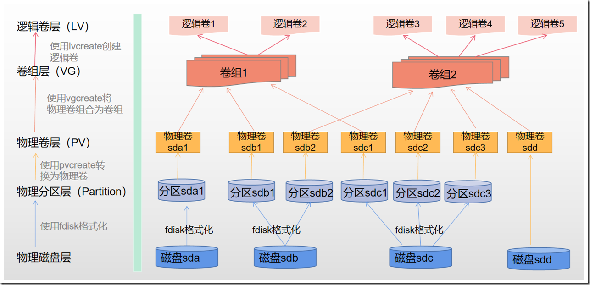

# 物理卷、卷组、逻辑卷的概念及配置

## 一、概念

**磁盘分区**：计算机中存放信息的主要的存储设备就是硬盘，但是硬盘不能直接使用，必须对硬盘进行分割，分割成的一块一块的硬盘区域就是磁盘分区。在传统的磁盘管理中，将一个硬盘分为两大类分区：主分区和扩展分区。

主分区是能够安装操作系统，能够进行计算机启动的分区，这样的分区可以直接格式化，然后安装系统，直接存放文件。在一个 MBR 分区表类型的硬盘中最多只能存在 4 个主分区。如果一个硬盘上需要超过 4 个以上的磁盘分区，那么就需要使用扩展分区。

如果使用扩展分区，那么一个物理硬盘上最多只能划分 3 个主分区和 1 个扩展分区。扩展分区不能直接使用，它必须经过第二次分割成为一个一个的逻辑分区，然后才可以使用。一个扩展分区中的逻辑分区可以有任意多个。

逻辑卷是使用逻辑卷组管理 (Logic Volume Manager) 创建出来的设备，如果要了解逻辑卷，那么首先需要了解逻辑卷管理中的一些概念。

- **逻辑卷管理器（Logical Volume Manager，LVM）**：LVM 将一个或多个硬盘的分区在逻辑上集合，相当于一个大硬盘来使用，当硬盘的空间不够使用的时候，可以继续将其它的硬盘的分区加入其中，这样可以实现磁盘空间的动态管理，相对于普通的磁盘分区有很大的灵活性。LVM 使系统管理员可以更方便的为应用与用户分配存储空间。
- **物理卷（Physical Volume，PV）**：指硬盘分区或从逻辑上与磁盘分区具有同样功能的设备（如 RAID），是 LVM 的基本存储逻辑块。
- **卷组（Volume Group，VG）**：PV的集合。是由一个或多个物理卷所组成的存储池，在卷组上能创建一个或多个逻辑卷。
- **逻辑卷（Logic Volume，LV）**：VG中画出来的一块逻辑磁盘。类似于非 LVM 系统中的硬盘分区，它建立在卷组之上，是一个标准的块设备，在逻辑卷之上可以建立文件系统。

理解物理卷、卷组、逻辑卷的概念之后，逻辑卷的产生就清楚了：物理磁盘或者磁盘分区转换为物理卷，一个或多个物理卷聚集形成一个或多个卷组，而逻辑卷就是从某个卷组里面抽象出来的一块磁盘空间。具体架构如下：



**为什么要使用逻辑卷?**
对于物理磁盘，我们直接分区、格式化为文件系统之后就可以使用，那为什么还需要使用逻辑卷的方式来管理磁盘呢？主要有 2 个原因：

1. 业务上使用大容量的磁盘。例如：我们需要在 /data 下挂载 30TB 的存储，而单个磁盘没有这么大的容量。如果使用逻辑卷，将多个小容量的磁盘聚合为一个大的逻辑磁盘，就能满足需求。
2. 扩展和收缩磁盘。在业务初期规划磁盘时，我们并不能完全知道需要分配多少磁盘空间，如果使用物理卷，后期无法扩展和收缩，如果使用逻辑卷，可以根据后期的需求量，手动扩展或收缩。

## 二、LVM 管理命令

LVM 管理命令如下表所示：

| 功能            | 物理卷管理 | 卷组管理  | 逻辑卷管理 |
| --------------- | ---------- | --------- | ---------- |
| Scan（扫描）    | pvscan     | vgscan    | lvscan     |
| Creant（创建）  | pvcreate   | vgcreate  | lvcreate   |
| Display（显示） | pvdisplay  | vgdisplay | lvdisplay  |
| Remove（删除）  | pvremove   | vgremove  | lvremove   |
| Extend（扩展）  |            | vgextend  | lvextend   |
| Reduce（减少）  |            | vgreduce  | lvreduce   |

## 三、查看硬盘及分区信息

### 1、fdisk 命令

```shell
# 命令格式：
Fdisk -l   #列出当前系统中所有硬盘设备及分区情况

[root@localhost ~]# fdisk -l

磁盘 /dev/sda：10.7 GB, 10737418240 字节，20971520 个扇区
Units = 扇区 of 1 * 512 = 512 bytes
扇区大小(逻辑/物理)：512 字节 / 512 字节
I/O 大小(最小/最佳)：512 字节 / 512 字节
磁盘标签类型：dos
磁盘标识符：0x000b27ea

   设备 Boot      Start         End      Blocks   Id  System
/dev/sda1   *        2048     2099199     1048576   83  Linux
/dev/sda2         2099200    20971519     9436160   8e  Linux LVM

磁盘 /dev/sdb：5368 MB, 5368709120 字节，10485760 个扇区
Units = 扇区 of 1 * 512 = 512 bytes
扇区大小(逻辑/物理)：512 字节 / 512 字节
I/O 大小(最小/最佳)：512 字节 / 512 字节


磁盘 /dev/sdc：5368 MB, 5368709120 字节，10485760 个扇区
Units = 扇区 of 1 * 512 = 512 bytes
扇区大小(逻辑/物理)：512 字节 / 512 字节
I/O 大小(最小/最佳)：512 字节 / 512 字节
磁盘标签类型：dos
磁盘标识符：0x421da3c5

   设备 Boot      Start         End      Blocks   Id  System
/dev/sdc1            2048     2099199     1048576   83  Linux
/dev/sdc2         2099200     4196351     1048576   83  Linux
/dev/sdc3         4196352     6293503     1048576   83  Linux
/dev/sdc4         6293504    10485759     2096128    5  Extended
/dev/sdc5         6295552     7319551      512000   83  Linux
/dev/sdc6         7321600     8345599      512000   83  Linux
/dev/sdc7         8347648    10485759     1069056   83  Linux

磁盘 /dev/mapper/cl-root：8585 MB, 8585740288 字节，16769024 个扇区
Units = 扇区 of 1 * 512 = 512 bytes
扇区大小(逻辑/物理)：512 字节 / 512 字节
I/O 大小(最小/最佳)：512 字节 / 512 字节


磁盘 /dev/mapper/cl-swap：1073 MB, 1073741824 字节，2097152 个扇区
Units = 扇区 of 1 * 512 = 512 bytes
扇区大小(逻辑/物理)：512 字节 / 512 字节
I/O 大小(最小/最佳)：512 字节 / 512 字节
```

## 四、物理卷管理命令

### 1、pvcreate——创建物理卷

```shell
# 命令格式：
pvcreate <选项> <参数>
#<选项>说明：
-f：强制创建物理卷，不需要用户确认
-u：指定设备的UUID
-y：所有的问题都回答 yes
-Z：是否利用前4个扇区
#<参数>说明：指定要创建的物理卷对应的设备文件名。
```

举例：把磁盘 sdb 与磁盘分区 sdc1~sdc5 创建为物理卷

```shell
[root@localhost ~]# pvcreate /dev/sdb /dev/sdc{1,2,3,5}
  Device /dev/sdc4 not found (or ignored by filtering).
  Physical volume "/dev/sdb" successfully created.
  Physical volume "/dev/sdc1" successfully created.
  Physical volume "/dev/sdc2" successfully created.
  Physical volume "/dev/sdc3" successfully created.
  Physical volume "/dev/sdc5" successfully created.

#使用 pvscan 命令查看物理卷
[root@localhost ~]# pvscan
  PV /dev/sda2   VG cl              lvm2 [9.00 GiB / 0    free]
  PV /dev/sdc2                      lvm2 [1.00 GiB]
  PV /dev/sdc5                      lvm2 [500.00 MiB]
  PV /dev/sdc3                      lvm2 [1.00 GiB]
  PV /dev/sdb                       lvm2 [5.00 GiB]
  PV /dev/sdc1                      lvm2 [1.00 GiB]
  Total: 6 [17.48 GiB] / in use: 1 [9.00 GiB] / in no VG: 5 [8.49 GiB]
  
  #使用 pvdisplay 命令查看物理卷
  [root@localhost ~]# pvdisplay
  --- Physical volume ---
  PV Name               /dev/sda2
  VG Name               cl
  PV Size               9.00 GiB / not usable 3.00 MiB
  Allocatable           yes (but full)
  PE Size               4.00 MiB
  Total PE              2303
  Free PE               0
  Allocated PE          2303
  PV UUID               4Ff31K-tEEB-IMf1-6oFY-dIw8-rKoh-WuaZFO
   
  "/dev/sdc2" is a new physical volume of "1.00 GiB"
  --- NEW Physical volume ---
  PV Name               /dev/sdc2
  VG Name               
  PV Size               1.00 GiB
  Allocatable           NO
  PE Size               0   
  Total PE              0
  Free PE               0
  Allocated PE          0
  PV UUID               4dNiIy-tO3Y-zcYr-ENIc-46Ln-T03y-kLGr0O
   
  "/dev/sdc5" is a new physical volume of "500.00 MiB"
  --- NEW Physical volume ---
  PV Name               /dev/sdc5
  VG Name               
  PV Size               500.00 MiB
  Allocatable           NO
  PE Size               0   
  Total PE              0
  Free PE               0
  Allocated PE          0
  PV UUID               CI9Ysb-oJe1-HSMs-4g0E-bPxE-WLw6-qfM408
   
  "/dev/sdc3" is a new physical volume of "1.00 GiB"
  --- NEW Physical volume ---
  PV Name               /dev/sdc3
  VG Name               
  PV Size               1.00 GiB
  Allocatable           NO
  PE Size               0   
  Total PE              0
  Free PE               0
  Allocated PE          0
  PV UUID               gFz7se-GpLj-BScP-lOSB-ijxs-Aby2-X4TnuU
   
  "/dev/sdb" is a new physical volume of "5.00 GiB"
  --- NEW Physical volume ---
  PV Name               /dev/sdb
  VG Name               
  PV Size               5.00 GiB
  Allocatable           NO
  PE Size               0   
  Total PE              0
  Free PE               0
  Allocated PE          0
  PV UUID               gGM96Y-ALyO-bEH4-cLms-XtF0-h7DN-9xPfhZ
   
  "/dev/sdc1" is a new physical volume of "1.00 GiB"
  --- NEW Physical volume ---
  PV Name               /dev/sdc1
  VG Name               
  PV Size               1.00 GiB
  Allocatable           NO
  PE Size               0   
  Total PE              0
  Free PE               0
  Allocated PE          0
  PV UUID               8Thy4d-ce6e-YeVv-K9mt-tbkK-Tx08-y2rAiZ
```

### 2、pvremove——删除物理卷

```shell
[root@localhost ~]# pvremove /dev/sdc5
  Labels on physical volume "/dev/sdc5" successfully wiped.
[root@localhost ~]# pvscan
  PV /dev/sda2   VG cl              lvm2 [9.00 GiB / 0    free]
  PV /dev/sdc2                      lvm2 [1.00 GiB]
  PV /dev/sdc3                      lvm2 [1.00 GiB]
  PV /dev/sdb                       lvm2 [5.00 GiB]
  PV /dev/sdc1                      lvm2 [1.00 GiB]
  Total: 5 [17.00 GiB] / in use: 1 [9.00 GiB] / in no VG: 4 [8.00 GiB]
```

## 五、卷组管理命令

### 1、vgcreate——创建卷组

```shell
# 格式如下：
vgcreate <选项> <参数>
# <选项>说明：
-l：卷组上允许创建的最大逻辑卷数
-p：卷组中允许添加的最大物理卷数
-s：卷组上的物理卷的PE大小
# <参数>说明：
卷组名：要创建的卷组名称
物理卷列表：要加入到卷组中的物理卷列表
```

举例：创建卷组 vg001（包含物理卷 sdb），vg002（包含物理卷 sdc1、sdc2、sdc3）

```shell
[root@localhost ~]# vgcreate vg001 /dev/sdb
  Volume group "vg001" successfully created
[root@localhost ~]# vgcreate vg002 /dev/sdc{1,2,3}
  Volume group "vg002" successfully created
```

### 2、使用 vgscan 和 vgdisplay 查看卷组信息

```shell
[root@localhost ~]# vgscan
  Reading volume groups from cache.
  Found volume group "vg002" using metadata type lvm2
  Found volume group "vg001" using metadata type lvm2
  Found volume group "cl" using metadata type lvm2
  
[root@localhost ~]# vgdisplay
  --- Volume group ---
  VG Name               vg002
  System ID             
  Format                lvm2
  Metadata Areas        3
  Metadata Sequence No  1
  VG Access             read/write
  VG Status             resizable
  MAX LV                0
  Cur LV                0
  Open LV               0
  Max PV                0
  Cur PV                3
  Act PV                3
  VG Size               2.99 GiB
  PE Size               4.00 MiB
  Total PE              765
  Alloc PE / Size       0 / 0   
  Free  PE / Size       765 / 2.99 GiB
  VG UUID               P4TOEn-YxvT-vJvh-d7Zh-I18z-61Fd-pq6iMj
   
  --- Volume group ---
  VG Name               vg001
  System ID             
  Format                lvm2
  Metadata Areas        1
  Metadata Sequence No  1
  VG Access             read/write
  VG Status             resizable
  MAX LV                0
  Cur LV                0
  Open LV               0
  Max PV                0
  Cur PV                1
  Act PV                1
  VG Size               5.00 GiB
  PE Size               4.00 MiB
  Total PE              1279
  Alloc PE / Size       0 / 0   
  Free  PE / Size       1279 / 5.00 GiB
  VG UUID               AIsDKF-TGzx-ngZq-tAXe-xFOF-48NC-o1oe3u
   
  --- Volume group ---
  VG Name               cl
  System ID             
  Format                lvm2
  Metadata Areas        1
  Metadata Sequence No  3
  VG Access             read/write
  VG Status             resizable
  MAX LV                0
  Cur LV                2
  Open LV               2
  Max PV                0
  Cur PV                1
  Act PV                1
  VG Size               9.00 GiB
  PE Size               4.00 MiB
  Total PE              2303
  Alloc PE / Size       2303 / 9.00 GiB
  Free  PE / Size       0 / 0   
  VG UUID               gPKeKZ-Xu7w-7YOS-RrXD-f0dX-1gq0-g9HP4b
```

### 3、使用 vgextend 扩充卷组的大小

```shell
# 格式如下：
vgextend <选项> <参数>
# <选项> 说明：
-d：调试模式
-t：仅测试
# <参数>说明：
卷组：指定要操作的卷组名称
物理卷列表：指定要添加到卷组中的物理卷列表
```

举例：把物理卷 sd5 添加到卷组 vg002 中

```shell
[root@localhost ~]# pvcreate /dev/sdc5   #创建物理卷
  Physical volume "/dev/sdc5" successfully created.
  
[root@localhost ~]# vgextend vg002 /dev/sdc5  #把物理卷添加到卷组 vg002
  Volume group "vg002" successfully extended
  
# 查看卷组信息
[root@localhost ~]# vgdisplay
  --- Volume group ---
  VG Name               vg002
  System ID             
  Format                lvm2
  Metadata Areas        4
  Metadata Sequence No  2
  VG Access             read/write
  VG Status             resizable
  MAX LV                0
  Cur LV                0
  Open LV               0
  Max PV                0
  Cur PV                4
  Act PV                4
  VG Size               3.47 GiB
  PE Size               4.00 MiB
  Total PE              889
  Alloc PE / Size       0 / 0   
  Free  PE / Size       889 / 3.47 GiB
  VG UUID               P4TOEn-YxvT-vJvh-d7Zh-I18z-61Fd-pq6iMj
  ......
```

### 4、使用 vgreduce 命令通过删除卷组中的物理卷来减少卷组容量

```shell
# 格式如下：
vgreduce <选项> <参数>
# <选项> 说明：
-a：如果命令行中没有指定要删除的物理卷，则删除所有的空物理卷
--removemissing：删除卷组中丢失的物理卷，使卷组恢复正常状态
# <参数>说明：
卷组：指定要操作的卷组名称
物理卷列表：指定要删除的物理卷列表
```

举例：删除卷组 vg002 中的物理卷 /dev/sdc1

```shell
[root@localhost ~]# vgreduce vg002 /dev/sdc1
  Removed "/dev/sdc1" from volume group "vg002"
  
[root@localhost ~]# vgdisplay
  --- Volume group ---
  VG Name               vg002
  System ID             
  Format                lvm2
  Metadata Areas        3
  Metadata Sequence No  3
  VG Access             read/write
  VG Status             resizable
  MAX LV                0
  Cur LV                0
  Open LV               0
  Max PV                0
  Cur PV                3
  Act PV                3
  VG Size               2.48 GiB
  PE Size               4.00 MiB
  Total PE              634
  Alloc PE / Size       0 / 0   
  Free  PE / Size       634 / 2.48 GiB
  VG UUID               P4TOEn-YxvT-vJvh-d7Zh-I18z-61Fd-pq6iMj
  .....
```

### 5、使用 vgremove 命令删除卷组

```shell
# 格式如下：
vgremove <选项> <参数>
# <选项>说明：
-f：强制删除
# <参数>说明：
卷组：指定要删除的卷组名称
```

## 六、逻辑卷管理命令

逻辑卷是创建在卷组之上的，逻辑卷对应的设备文件保存在卷组目录下。例如：在卷组 vg001 上创建一个逻辑卷 lvol0，则此逻辑卷对应的设备文件为 /dev/vg001/lvol0。

### 1、使用 lvcreate 命令在卷组中创建逻辑卷

```shell
# 格式如下：
lvcreate <选项> <参数>
# <选项> 说明：
-L：指定逻辑卷的大小，单位为 K、M、G、T
-l：指定逻辑卷的大小（LE数），（1）以卷组的大小百分比来指定逻辑卷的大小（如：20%VG）；（2）使用卷组剩余的所有空间创建逻辑卷（100%free）
-n：指定逻辑卷的名称
# <参数> 说明：
逻辑卷：指定要创建逻辑卷的卷组名称
```

举例：在卷组 vg001 中创建两个大小为 1G 的逻辑卷

```shell
[root@localhost ~]# lvcreate -L 1G vg001
  Logical volume "lvol0" created.
[root@localhost ~]# lvcreate -L 1G -n lv-001 vg001
  Logical volume "lv-001" created.
[root@localhost ~]# ls /dev/vg001/
lv-001  lvol0

[root@localhost ~]# lvcreate -l 20%vg -n lv-002 vg001
  Logical volume "lv-002" created.
[root@localhost ~]# lvcreate -l 100%free -n lv-003 vg001
  Logical volume "lv-003" created.
[root@localhost ~]# ls /dev/vg001
lv-001  lv-002  lv-003  lvol0
[root@localhost ~]# lvscan
  ACTIVE            '/dev/vg001/lvol0' [1.00 GiB] inherit
  ACTIVE            '/dev/vg001/lv-001' [1.00 GiB] inherit
  ACTIVE            '/dev/vg001/lv-002' [1020.00 MiB] inherit
  ACTIVE            '/dev/vg001/lv-003' [2.00 GiB] inherit
  ACTIVE            '/dev/cl/swap' [1.00 GiB] inherit
  ACTIVE            '/dev/cl/root' [8.00 GiB] inherit
```

### 2、使用 lvscan 和 lvdisplay 查看逻辑卷信息

```shell
[root@localhost ~]# lvscan
  ACTIVE            '/dev/vg001/lvol0' [1.00 GiB] inherit
  ACTIVE            '/dev/vg001/lv-001' [1.00 GiB] inherit
  ACTIVE            '/dev/vg001/lv-002' [1020.00 MiB] inherit
  ACTIVE            '/dev/vg001/lv-003' [2.00 GiB] inherit
  ACTIVE            '/dev/cl/swap' [1.00 GiB] inherit
  ACTIVE            '/dev/cl/root' [8.00 GiB] inherit
  
[root@localhost ~]# lvdisplay
  --- Logical volume ---
  LV Path                /dev/vg001/lvol0
  LV Name                lvol0
  VG Name                vg001
  LV UUID                5KtJUL-hTV6-8IA4-Y2jR-j056-x34K-I1TlhJ
  LV Write Access        read/write
  LV Creation host, time localhost.localdomain, 2021-03-28 00:17:42 +0800
  LV Status              available
  # open                 0
  LV Size                1.00 GiB
  Current LE             256
  Segments               1
  Allocation             inherit
  Read ahead sectors     auto
  - currently set to     8192
  Block device           253:2
   
  --- Logical volume ---
  LV Path                /dev/vg001/lv-001
  LV Name                lv-001
  VG Name                vg001
  LV UUID                XpAPKk-q3Ji-u9fK-PS2N-Jf6g-AeuX-ID4j95
  LV Write Access        read/write
  LV Creation host, time localhost.localdomain, 2021-03-28 00:18:00 +0800
  LV Status              available
  # open                 0
  LV Size                1.00 GiB
  Current LE             256
  Segments               1
  Allocation             inherit
  Read ahead sectors     auto
  - currently set to     8192
  Block device           253:3
   
  --- Logical volume ---
  LV Path                /dev/vg001/lv-002
  LV Name                lv-002
  VG Name                vg001
  LV UUID                06M5rf-UM0N-vHWO-1czX-WjqN-QfYb-DXCUla
  LV Write Access        read/write
  LV Creation host, time localhost.localdomain, 2021-03-28 00:24:16 +0800
  LV Status              available
  # open                 0
  LV Size                1020.00 MiB
  Current LE             255
  Segments               1
  Allocation             inherit
  Read ahead sectors     auto
  - currently set to     8192
  Block device           253:4
   
  --- Logical volume ---
  LV Path                /dev/vg001/lv-003
  LV Name                lv-003
  VG Name                vg001
  LV UUID                yFkZ9A-JD4q-owLq-U428-2Wmx-kCKe-txnaqd
  LV Write Access        read/write
  LV Creation host, time localhost.localdomain, 2021-03-28 00:24:36 +0800
  LV Status              available
  # open                 0
  LV Size                2.00 GiB
  Current LE             512
  Segments               1
  Allocation             inherit
  Read ahead sectors     auto
  - currently set to     8192
  Block device           253:5
   
  --- Logical volume ---
  LV Path                /dev/cl/swap
  LV Name                swap
  VG Name                cl
  LV UUID                09vQ05-pUVd-uNkf-r2fq-KIxn-t2Ef-mPtN1U
  LV Write Access        read/write
  LV Creation host, time localhost.localdomain, 2021-03-28 03:09:16 +0800
  LV Status              available
  # open                 2
  LV Size                1.00 GiB
  Current LE             256
  Segments               1
  Allocation             inherit
  Read ahead sectors     auto
  - currently set to     8192
  Block device           253:1
   
  --- Logical volume ---
  LV Path                /dev/cl/root
  LV Name                root
  VG Name                cl
  LV UUID                jd4PGH-9wK6-YUnN-wOdZ-7qWA-gJBB-Nwbwqg
  LV Write Access        read/write
  LV Creation host, time localhost.localdomain, 2021-03-28 03:09:16 +0800
  LV Status              available
  # open                 1
  LV Size                8.00 GiB
  Current LE             2047
  Segments               1
  Allocation             inherit
  Read ahead sectors     auto
  - currently set to     8192
  Block device           253:0
```

### 3、使用 lvremove 删除逻辑卷

```shell
# 格式如下：
lvremove <选项> <参数>
# <选项> 说明：
-f：强制删除
# <参数> 说明：
逻辑卷：指定要删除的逻辑卷
```

举例：删除逻辑卷 lv-003

```shell
[root@localhost ~]# lvremove /dev/vg001/lv-003
Do you really want to remove active logical volume vg001/lv-003? [y/n]: y
  Logical volume "lv-003" successfully removed
[root@localhost ~]# lvscan
  ACTIVE            '/dev/vg001/lvol0' [1.00 GiB] inherit
  ACTIVE            '/dev/vg001/lv-001' [1.00 GiB] inherit
  ACTIVE            '/dev/vg001/lv-002' [1020.00 MiB] inherit
  ACTIVE            '/dev/cl/swap' [1.00 GiB] inherit
  ACTIVE            '/dev/cl/root' [8.00 GiB] inherit
```

### 4、使用 lvextend 扩充逻辑卷的大小

```shell
# 格式如下：
lvextend <选项> <参数>
# <选项>说明：
-L：指定逻辑卷的大小，单位为 K、M、G、T
-l：指定逻辑卷的大小（LE数）
# <参数>说明：
逻辑卷：指定要扩展空间的逻辑卷名称
```

举例：把逻辑卷 /dev/vg001/lv-002 的大小增加 500M

```shell
[root@localhost ~]# lvextend -L +500M /dev/vg001/lv-002
  Size of logical volume vg001/lv-002 changed from 1020.00 MiB (255 extents) to 1.48 GiB (380 extents).
  Logical volume vg001/lv-002 successfully resized.
[root@localhost ~]# lvscan
  ACTIVE            '/dev/vg001/lvol0' [1.00 GiB] inherit
  ACTIVE            '/dev/vg001/lv-001' [1.00 GiB] inherit
  ACTIVE            '/dev/vg001/lv-002' [1.48 GiB] inherit
  ACTIVE            '/dev/cl/swap' [1.00 GiB] inherit
  ACTIVE            '/dev/cl/root' [8.00 GiB] inherit
```

### 5、使用 lvreduce 命令缩小逻辑卷的空间

```shell
# 格式如下：
lvreduce <选项> <参数>
# <选项>说明：
-L：指定逻辑卷的大小，单位为 K、M、G、T
-l：指定逻辑卷的大小（LE数）
# <参数>说明：
逻辑卷：指定要扩展空间的逻辑卷名称
```

举例：把逻辑卷 /dev/vg001/lv-001 的大小减少 500M

```shell
[root@localhost ~]# lvreduce -L -500M /dev/vg001/lv-001
  WARNING: Reducing active logical volume to 524.00 MiB.
  THIS MAY DESTROY YOUR DATA (filesystem etc.)
Do you really want to reduce vg001/lv-001? [y/n]: y
  Size of logical volume vg001/lv-001 changed from 1.00 GiB (256 extents) to 524.00 MiB (131 extents).
  Logical volume vg001/lv-001 successfully resized.
[root@localhost ~]# lvscan
  ACTIVE            '/dev/vg001/lvol0' [1.00 GiB] inherit
  ACTIVE            '/dev/vg001/lv-001' [524.00 MiB] inherit
  ACTIVE            '/dev/vg001/lv-002' [1.48 GiB] inherit
  ACTIVE            '/dev/cl/swap' [1.00 GiB] inherit
  ACTIVE            '/dev/cl/root' [8.00 GiB] inherit
```
