# 1、Nginx简介


## 1.1 什么是 nginx 和可以做什么事情

> 百度：
>
> Nginx是一款[轻量级](https://baike.baidu.com/item/轻量级/10002835)的[Web](https://baike.baidu.com/item/Web/150564) 服务器/[反向代理](https://baike.baidu.com/item/反向代理/7793488)服务器及[电子邮件](https://baike.baidu.com/item/电子邮件/111106)（IMAP/POP3）代理服务器，在BSD-like 协议下发行。其特点是占有内存少，[并发](https://baike.baidu.com/item/并发/11024806)能力强，事实上nginx的并发能力在同类型的网页服务器中表现较好，中国大陆使用nginx网站用户有：百度、[京东](https://baike.baidu.com/item/京东/210931)、[新浪](https://baike.baidu.com/item/新浪/125692)、[网易](https://baike.baidu.com/item/网易/185754)、[腾讯](https://baike.baidu.com/item/腾讯/112204)、[淘宝](https://baike.baidu.com/item/淘宝/145661)等。

- Nginx 是高性能的 HTTP 和反向代理的web服务器，处理高并发能力是十分强大的，能经受高负 载的考验,有报告表明能支持高达 50,000 个并发连接数。
- 其特点是占有内存少，并发能力强，事实上nginx的并发能力确实在同类型的网页服务器中表现较好，中国大陆使用nginx网站用户有：百度、京东、新浪、网易、腾讯、淘宝等。

## 1.2 Nginx 作为 web 服务器

Nginx 可以作为静态页面的 web 服务器，同时还支持 CGI 协议的动态语言，比如 perl、php 等。但是不支持 java。Java 程序只能通过与 tomcat 配合完成。**Nginx 专为性能优化而开发**， 性能是其最重要的考量，实现上非常注重效率 ，能经受高负载的考验,有报告表明能支持高 达 **50,000** 个并发连接数。
https://lnmp.org/nginx.html

## 1.3 正向代理

Nginx 不仅可以做反向代理，实现负载均衡。还能用作正向代理来进行上网等功能。 **正向代理：如果把局域网外的 Internet 想象成一个巨大的资源库，则局域网中的客户端要访问 Internet，则需要通过代理服务器来访问，这种代理服务就称为正向代理。**

- 需要在客户端配置代理服务器进行指定网站访问
- 简单一点：通过代理服务器来访问服务器的过程 就叫 正向代理。

 

## 1.4 反向代理

- 反向代理，**其实客户端对代理是无感知的，因为客户端不需要任何配置就可以访问。**
- 我们只需要将请求发送到反向代理服务器，由反向代理服务器去选择目标服务器获取数据后，在返回给客户端，**此时反向代理服务器和目标服务器对外就是一个服务器，暴露的是代理服务器 地址，隐藏了真实服务器 IP 地址。**

==其实是**站在开发者的角度**，对资源部署的服务器前面再部署一个用于将对资源的访问先由该服务器接收，再转发给具体资源部署的服务器，**而此时资源部署的服务器和反向代理的服务器对外可以看成一个整体**==

 

## 1.5 负载均衡

客户端发送多个请求到服务器，服务器处理请求，有一些可能要与数据库进行交互，服务器处理完毕后，再将结果返回给客户端。

这种架构模式对于早期的系统相对单一，并发请求相对较少的情况下是比较适合的，成本也低。但是随着信息数量的不断增长，访问量和数据量的飞速增长，以及系统业务的复杂度增加，这种架构会造成服务器相应客户端的请求日益缓慢，并发量特别大的时候，还容易造成服务器直接崩溃。很明显这是由于服务器性能的瓶颈造成的问题，那么如何解决这种情况呢？

我们首先想到的可能是升级服务器的配置，比如提高 CPU 执行频率，加大内存等提高机器的物理性能来解决此问题，但是我们知道<u>摩尔定律</u>的日益失效，硬件的性能提升已经不能满足日益提升的需求了。最明显的一个例子，天猫双十一当天，某个热销商品的瞬时访问量是极其庞大的，那么类似上面的系统架构，将机器都增加到现有的顶级物理配置，都是不能够满足需求的。那么怎么办呢？

上面的分析我们去掉了增加服务器物理配置来解决问题的办法，也就是说纵向解决问题的办法行不通了，那么横向增加服务器的数量呢？这时候集群的概念产生了，单个服务器解决不了，我们==增加服务器的数量，然后将请求分发到各个服务器上，将原先请求集中到单个服务器上的情况改为将请求分发到多个服务器上，将负载分发到不同的服务器，也就是我们所说的**负载均衡**==

**负载均衡是十分常用的**

 

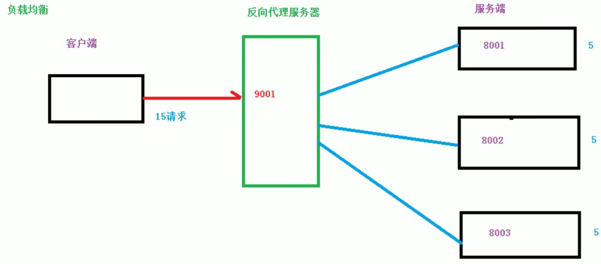

## 1.6 动静分离

为了加快网站的解析速度，可以把动态页面和静态页面由不同的服务器来解析，加快解析速度。降低原来单个服务器的压力。

 

# 2、Nginx的安装和运行

安装Nginx需要两个依赖：**pcre**和**openssl**，先安装这两个软件，下面就用网上下载tar.gz传到linux中，然后解压编译的方式安装（yum什么的也行，之前安装RabbitMQ是弄怕了）

## 2.1 安装pcre

1. http://www.pcre.org/

   然后可以到github中下载想要的版本的tar.gz文件


2. 传到linux中`tar -xvf pcre...`解压，然后进到解压出来的文件里

3. 执行`./configure`命令，再执行`make && make install`进行编译安装

4. 安装完成后可以执行`pcre-config --version`查看版本

     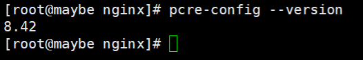

## 2.2 安装openssl

1. tar.gz文件下载地址http://distfiles.macports.org/openssl/，越下面版本越新
2. 然后后上面一样：上传源码压缩包，解压、编译、安装 三部曲。只有中间执行的`./configure`可能会换成`./config`命令，其他一样

## 2.3 安装zlib

1. tar.gz文件下载地址http://www.zlib.net/

   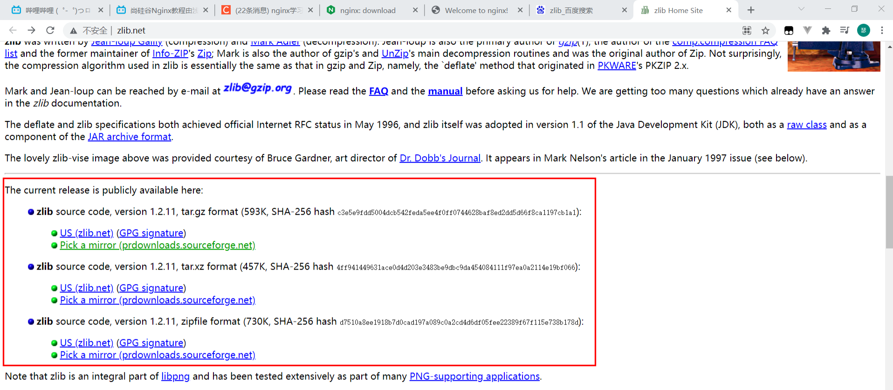

2. 然后后上面一样：上传源码压缩包，解压、编译、安装 三部曲。只有中间执行的`./configure`可能会换成`./config`命令，其他一样

## 2.4 安装Nginx

1. tar.gz文件下载地址http://nginx.org/en/download.html，可以下载中间的稳定版

    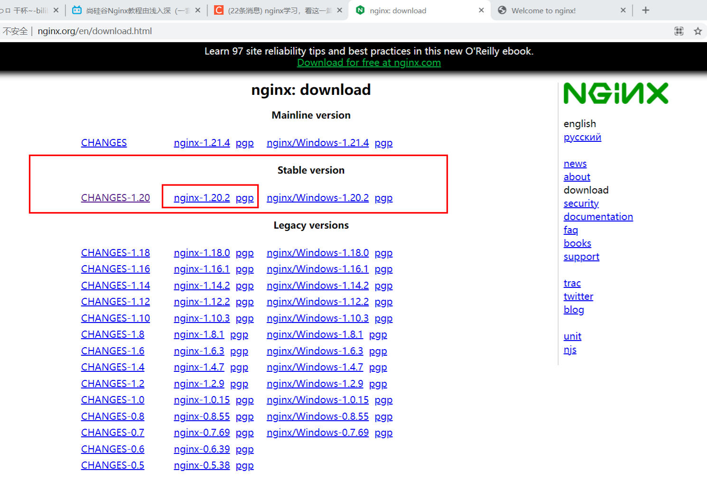

2. 然后后上面一样：上传源码压缩包，解压、编译、安装 三部曲。只有中间执行的`./configure`可能会换成`./config`命令，其他一样

## 2.5 运行Nginx

- 安装完nginx后，会在 路径 /usr/local 下自动生成 nginx 文件夹。这是自动生成的。

- 进入这个目录

- 进入sbin文件夹

   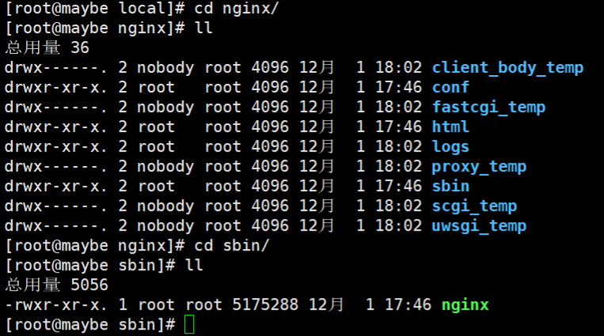

- 执行命令：**./nginx** 即可执行

- 测试启动： **ps -ef | grep nginx**

   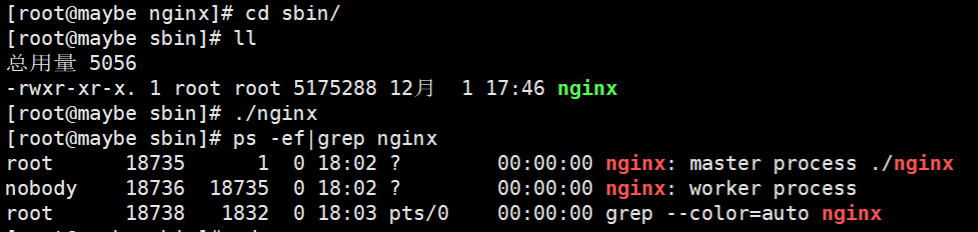

- 查看nginx默认端口（默认为80），使用网页的形式测试，（像Tomcat一样。）

- **进入目录查看端口：cd /usr/local/nginx/conf 下的 nginx.conf文件**。这个文件也是nginx的配置文件。vim 下：

   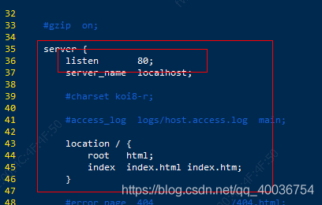

- 上浏览器看一下：（如下就成功）

  

- 还有如果没打开的就要看一下是不是防火墙问题，可以去设置一下。

# 3、Nginx的基本命令及配置文件

## 3.1 Nginx基本命令

使用nginx操作命令前提：==**必须进入到nginx的自动生成目录的下/sbin文件夹下**==。该目录是自动生成的 `/usr/local/nginx/`

1. 启动Nginx

   `./nginx`

2. 关闭Nginx

   `./nginx -s stop`

3. 查看Nginx版本号

   `./nginx -v`

4. 重新加载Nginx，热部署操作，在修改配置文件后可以使用该命令，免于重启

   `./nginx -s reload`

## 3.2 Nginx配置文件

### 配置文件位置

也是在自动生成的那个目录下：`/usr/local/nginx/conf`

 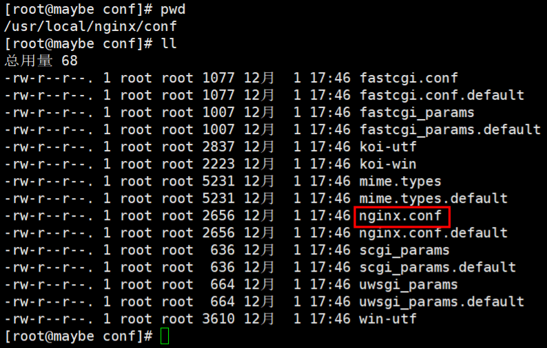

### 配置文件组成部分

配置文件中大部分是由#号注释掉的一些说明和方案，精简过后大概如下：

```shell
worker_processes  1;

events {
    worker_connections  1024;
}

http {
    include       mime.types;
    default_type  application/octet-stream;
    sendfile        on;
    keepalive_timeout  65;
    
    server {
        listen       80;
        server_name  localhost;
        
        location / {
            root   html;
            index  index.html index.htm;
        }
        
        error_page   500 502 503 504  /50x.html;
        location = /50x.html {
            root   html;
        }
    }
}

```

#### 第一部分：全局块

从配置文件开始到 events 块之间的内容，主要会设置一些影响nginx 服务器整体运行的配置指令，主要包括配 置运行 Nginx 服务器的用户（组）、允许生成的 worker process 数，进程 PID 存放路径、日志存放路径和类型以 及配置文件的引入等。
比如上面第一行配置的：

```shell
worker_processes  1;
```

这是 Nginx 服务器并发处理服务的关键配置，worker_processes 值越大，可以支持的并发处理量也越多，但是 会受到硬件、软件等设备的制约。

#### 第二部分：events块

```shell
events {
    worker_connections  1024;
}
```

events 块涉及的指令**主要影响 Nginx 服务器与用户的网络连接，常用的设置包括是否开启对多 work process 下的网络连接进行序列化，是否 允许同时接收多个网络连接，选取哪种事件驱动模型来处理连接请求，每个 word process 可以同时支持的最大连接数等。**
上述例子就表示每个 work process 支持的最大连接数为 1024

这部分的配置对 Nginx 的性能影响较大，在实际中应该灵活配置。

#### 第三部分：http块

这算是 Nginx 服务器配置中最频繁的部分，代理、缓存和日志定义等绝大多数功能和第三方模块的配置都在这里。

需要注意的是：**http 块也可以包括 http全局块、server 块**

```shell
http {
    include       mime.types;
    default_type  application/octet-stream;
    sendfile        on;
    keepalive_timeout  65;

    server {
        listen       80;					#nginx服务的端口
        server_name  localhost;				#反向代理（虚拟主机）的IP

        location / {
            root   html;
            index  index.html index.htm;
        }
        error_page   500 502 503 504  /50x.html;
        location = /50x.html {
            root   html;
        }
    }
}
```

- ==**http全局块**==
  http全局块配置的指令包括文件引入、MIME-TYPE 定义、日志自定义、连接超时时间、单链接请求数上限等。

- ==**server 块**==

  这块和虚拟主机有密切关系，虚拟主机从用户角度看，和一台独立的硬件主机是完全一样的，该技术的产生是为了 节省互联网服务器硬件成本。

  **每个 http 块可以包括多个 server 块，而每个 server 块就相当于一个==虚拟主机==。**

  **而每个 server 块也分为全局 server 块，以及可以同时包含多个 locaton 块。**

1. **全局 server 块**

   最常见的配置是本虚拟机主机的监听配置和本虚拟主机的名称或IP配置。

2. **location 块**
   一个 server 块可以配置多个 location 块。
   这块的主要作用是**基于 Nginx 服务器接收到的请求字符串（例如 server_name/uri-string），对虚拟主机名称 （也可以是IP 别名）之外的字符串（例如 前面的 /uri-string）进行匹配，对特定的请求进行处理**。 地址定向、数据缓 存和应答控制等功能，还有许多第三方模块的配置也在这里进行。

# 4、有关Nginx端口号的说明

Nginx可以配置多个server模块，也就是可以从多个端口代理，但要注意的是：**80端口是Nginx的默认端口，在访问时如果没加端口号则默认访问的是80端口，如果配置了其他端口需要加端口号访问。**

# 5、Nginx配置反向代理

## 5.1 tomcat服务器安装

首先要安装tomcat服务器，https://tomcat.apache.org/

直接下载tar.gz文件，上传，解压，进入解压出来的tomcat目录，再进入到bin目录，启动tomcat `./startup.sh`

**有关修改tomcat的访问端口号：**

1. 进入解压出来的tomcat目录，再进入到bin目录，打开里面的一个 server.xml 文件

2. 修改两个端口号：

   一个是shutdown的端口号

    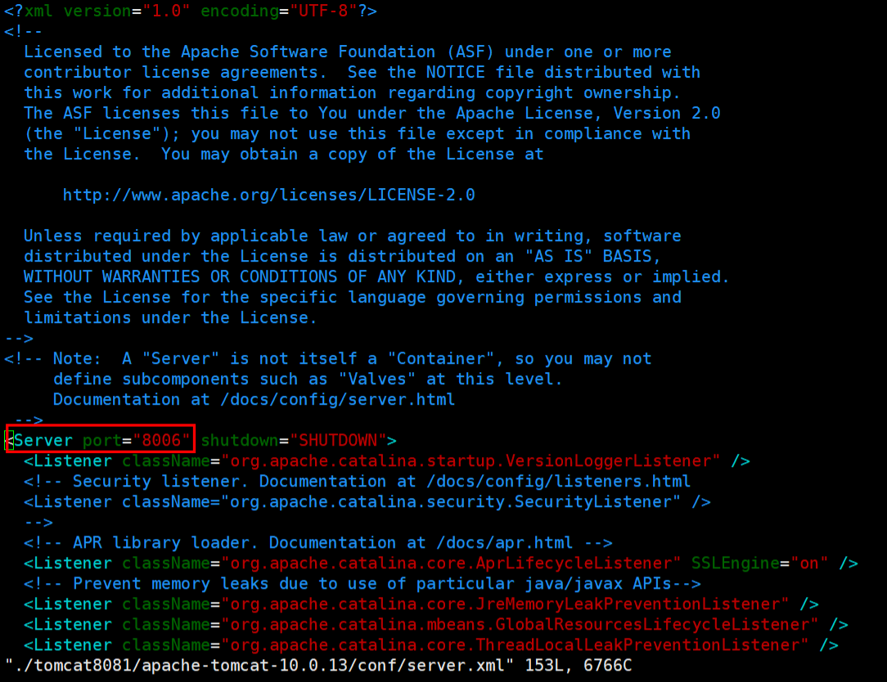

   另一个就是访问的端口号：

    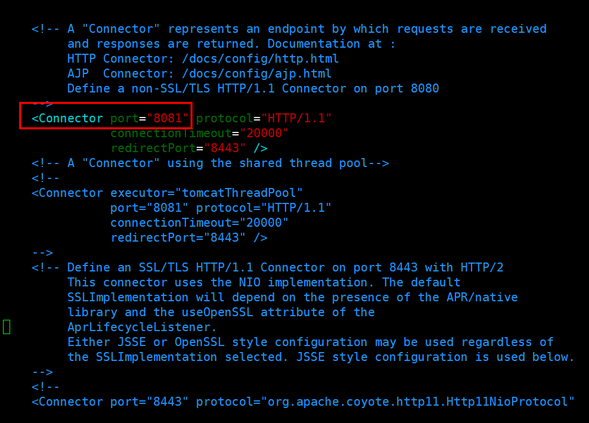

## 5.2 反向代理的配置

**通过实例来演示反向代理：**

使用 nginx 反向代理，根据访问的路径跳转到不同端口的服务中，nginx 监听端口为 9001

访问 http://127.0.0.1:9001/edu/ 直接跳转到 127.0.0.1:8081
访问 http://127.0.0.1:9001/vod/ 直接跳转到 127.0.0.1:8082

上面的配置文件中说道：**一个server块就是一个虚拟主机**，所以我们只需要在http块中添加server块：

```shell
    server {
       listen   9001;
       server_name  192.168.17.129;

       location ~ /edu/ {
          proxy_pass http://127.0.0.1:8080;
       }

       location ~ /vod/ {
          proxy_pass http://127.0.0.1:8081;
       }

    }
```

 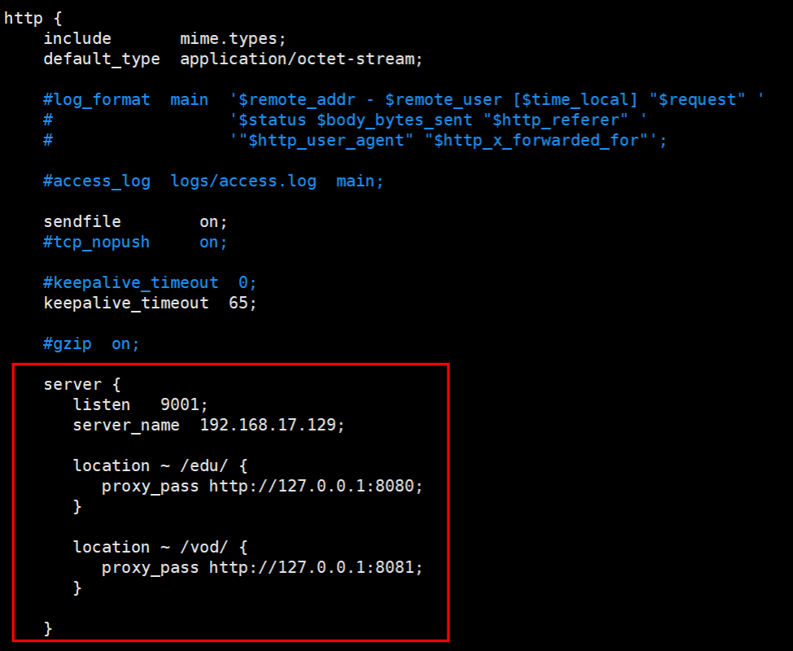

**有关location后面地址的说明：**

该指令用于匹配 URL。

语法如下：

- `=` ：用于不含正则表达式的 uri 前，要求请求字符串与 uri 严格匹配，如果匹配成功，就停止继续向下搜索并立即处理该请求。
- `~`：用于表示 uri 包含正则表达式，并且区分大小写。
- `~*`：用于表示 uri 包含正则表达式，并且不区分大小写。
- `^~`：用于不含正则表达式的 uri 前，要求 Nginx 服务器找到标识 uri 和请求字符串匹配度最高的 location 后，立即使用此 location 处理请求，而不再使用 location 块中的正则 uri 和请求字符串做匹配。

**注意：如果 uri 包含正则表达式，则必须要有 ~ 或者 ~* 标识。**

在两个tomcat的webapps中分别写个标题文件用于页面显示，然后分别启动tomcat

访问：

 

 

## 5.3 有关正向代理和反向代理的总结

正向代理与反向代理的**区别**：

- 正向代理相对于目标服务器而言隐藏了客户端的真实IP地址，因为对于目标服务器而言所有请求都是从正向代理服务器发出的，正向代理主要是为了突破网络访问限制，比如科学上网，还有就是隐藏客户端IP地址。
- 反向代理对于客户端而言隐藏了目标服务器IP地址，只需要知道代理服务器地址就能访问到目标服务器的资源。其主功能是可以做负载均衡和安全防护。

不过，不管正向代理还是反向代理，**都能加快客户端的访问速度**，因为nginx服务器是一个高性能的http web服务器，其能够对代理中的数据作缓冲。

# 6、负载均衡

在两台 tomcat 里面 webapps 目录中，**创建名称是 edu 文件夹，在 edu 文件夹中创建 页面 a.html，用于测试。**

准备好后先测试一下：

 

 

## 6.1 负载均衡配置

**在Nignx配置文件中进行负载均衡配置：**

1. 在http模块中先写一个upstream模块，后面跟一个该**负载均衡配置的名字**，里面写**具体资源的IP和端口号以及负载均衡的策略**
2. 然后在下面的server模块中的location模块中，写要代理的IP，端口号的地方直接换成上面**负载均衡配置的名字**即可。（==其实就是用原来的没有负载均衡配置的要代理的IP换成有负载均衡策略的具体模块的名字==）

```shell
    upstream server1 {
       server 192.168.200.128:8080;
       server 192.168.200.128:8081;
    }

    server {
       listen   80;
       server_name  192.168.200.128;

       location / {
          proxy_pass http://server1;
       }

#       location ~ /edu/ {
#         proxy_pass http://192.168.200.128:8080;
#       }

#       location ~ /vod/ {
#          proxy_pass http://192.168.200.128:8081;
#       }

    }
```

 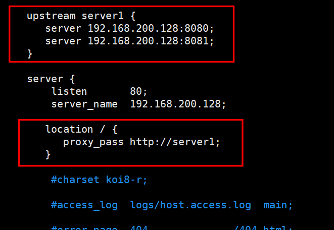

测试，直接由代理IP加具体资源来访问：

 

刷新再访问：

 

可以看到刷新后的资源来自8081的那台服务器，其实这就是**Nginx的默认策略：==轮询策略==**

## 6.2 负载均衡的具体策略

随着互联网信息的爆炸性增长，负载均衡（load balance）已经不再是一个很陌生的话题， 顾名思义，负载均衡即是将负载分摊到不同的服务单元，既保证服务的可用性，又保证响应 足够快，给用户很好的体验。快速增长的访问量和数据流量催生了各式各样的负载均衡产品， 很多专业的负载均衡硬件提供了很好的功能，但却价格不菲，这使得负载均衡软件大受欢迎， nginx 就是其中的一个，在 linux 下有 Nginx、LVS、Haproxy 等等服务可以提供负载均衡服 务，而且 Nginx 提供了几种分配方式(策略)：

### 轮询（默认）

每个请求按时间顺序逐一分配到不同的后端服务器，如果后端服务器 down 掉，能自动剔除。

### weight

weight 代表权重, 默认为 1,权重越高被分配的客户端越多

直接在upstream模块的 `server IP端口号` 后面加上 `weight=具体数字` 即可

```shell
    upstream server1 {
       server 192.168.200.128:8080 weight=10;
       server 192.168.200.128:8081 weight=5;
    }

    server {
       listen   9000;
       server_name  192.168.200.128;

       location / {
          proxy_pass http://server1;
       }

    }
```

### ip_hash

ip_hash 策略是每个请求按访问 ip 的 hash 结果分配，这样**每个访客固定访问一个后端服务器**

直接在upstream模块里加上 `ip_hash` 即可

```shell
    upstream server1 {
       ip_hash;
       server 192.168.200.128:8080;
       server 192.168.200.128:8081;
    }

    server {
       listen   9000;
       server_name  192.168.200.128;

       location / {
          proxy_pass http://server1;
       }

    }
```

### fair（第三方）

fair（第三方），按**后端服务器的响应时间来分配请求**，响应时间短的优先分配。

也是直接在upstream模块里加上 `fair` 即可

```shell
    upstream server1 {
       f;
       server 192.168.200.128:8080;
       server 192.168.200.128:8081;
    }

    server {
       listen   9000;
       server_name  192.168.200.128;

       location / {
          proxy_pass http://server1;
       }

    }
```

# 7、动静分离

## 7.1 动静分离概念

 

Nginx 动静分离简单来说就是把动态跟静态请求分开，不能理解成只是单纯的把动态页面和 静态页面物理分离。严格意义上说应该是动态请求跟静态请求分开，可以理解成使用 Nginx 处理静态页面，Tomcat 处理动态页面。动静分离从目前实现角度来讲大致分为两种：

- 一种是纯粹把静态文件独立成单独的域名，放在独立的服务器上，也是目前主流推崇的方案；
- 另外一种方法就是动态跟静态文件混合在一起发布，通过 nginx 来分开。

**通过 location 指定不同的后缀名实现不同的请求转发。**

**通过 expires 参数设置，可以使浏览器缓存过期时间，减少与服务器之前的请求和流量**。
具体 Expires 定义：是给一个资源设定一个过期时间，也就是说无需去服务端验证，直接通过浏览器自身确认是否过期即可， 所以不会产生额外的流量。此种方法非常适合不经常变动的资源。（如果经常更新的文件， 不建议使用 Expires 来缓存），我这里设置 3d，表示在这 3 天之内访问这个 URL，发送 一个请求，比对服务器该文件最后更新时间没有变化，则不会从服务器抓取，返回状态码 304，如果有修改，则直接从服务器重新下载，返回状态码 200。

**也就是说我们直接将静态资源放在部署Nginx的服务器上，然后动态请求再由location模块转发到具体动态资源服务器**，如：

## 7.2 动静分离配置

在根目录下创建一个data文件夹，里面放一张图片和一个html页面，结构如下：

 

接着去nginx.config中去配置一下

  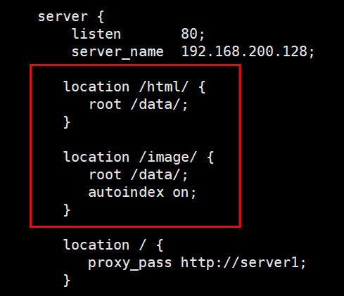

在server块中使用location块配置静态资源，**location后面是访问路径也要与服务器中具体静态资源的路径一致，下面的root后面则是具体静态资源的完整路径的前面一部分**（==上下是承接关系，也就是由root到上面的路径构成完整路径==）

如果是一些图片、文档资源，可以在location块里加个 `autoindex on;` 的配置，开启索引，效果如下：


最后测试如下：

html页面


图片，额(⊙o⊙)…


# 8、Nginx的高可用（集群）

## 8.1 概述

所谓Nginx的高可用就是Nginx的集群（现在什么都要配成集群，没办法），防止Nginx服务器宕机

 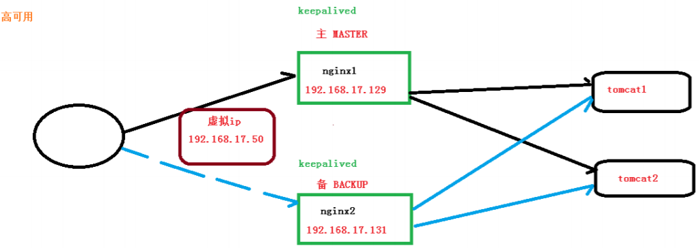

<u>这里准备两台linux测试：192.168.200.128和192.168.200.131</u>

## 8.2 keepalived的安装

**方式一：**使用yum命令安装：

```shell
[root@CentOS8 usr]# yum install keepalived -y
```

**方式二：**解压，编译安装（和上面说的三部曲一样）

keepalived下载tar.gz文件：https://www.keepalived.org/download.html

```shell
cd /usr/feng/
tar -zxvf keepalived-2.0.18.tar.gz
cd keepalived-2.0.18
./configure
make && make install
```

安装完成后，会在**/etc/**目录下生成一个**keepalived目录**，里面有个**keepalived.conf**配置（马上主要就是对这个文件进行配置）

直接重写==/etc/keepalived/keepalived.conf==配置：

```shell
global_defs { 
   notification_email { 
     acassen@firewall.loc 
     failover@firewall.loc 
     sysadmin@firewall.loc 
   } 
   notification_email_from Alexandre.Cassen@firewall.loc 
   smtp_server 208.208.128.122
   smtp_connect_timeout 30 
   router_id LVS_DEVEL 
} 
  
vrrp_script chk_http_port { 
  
   script "/usr/local/src/nginx_check.sh" 
   
   interval 2      #（检测脚本执行的间隔） 
  
   weight 2 
  
} 
  
vrrp_instance VI_1 {     
	state MASTER   # 备份服务器上将 MASTER 改为 BACKUP       
	interface ens192  # 网卡     
	virtual_router_id 51   # 主、备机的 virtual_router_id 必须相同     
	priority 100     # 主、备机取不同的优先级，主机值较大，备份机值较小 
    advert_int 1 
    authentication { 
        auth_type PASS 
        auth_pass 1111 
    } 
    virtual_ipaddress {         
		208.208.128.50 // VRRP H 虚拟地址 
    } 
}
```

- router_id LVS_DEVEL

  路由ID，后面一定要跟Nginx服务器的主机名，可在`/etc/hosts`里面查看，若没有，要配置一下

- script "/usr/local/src/nginx_check.sh"

  用于检测、切换Nginx主机的脚本的位置

- interval 2

  脚本执行的间隔，单位是秒

- weight 2

  权重，如果脚本成立，就改变当前主机的权重

- state MASTER

  看Nginx是主服务器，还是备份服务器，主服务器写MASTER，备份的写BACKUP

- interface ens192

  用ifconfig看一下是什么名字的网卡

- virtual_router_id 51

  主、备机的 virtual_router_id 必须相同

- priority 100

  主、备机取不同的优先级，主机值较大，备份机值较小

- virtual_ipaddress { 208.208.128.50 }

  **虚拟地址**，因为是备份，所有当你主Nginx宕掉了，就要启用备份的，那IP不一样怎么办呢，这里就采用一个虚拟IP来代替，也就是说，主服务器宕掉了，就由这个虚拟IP来连备份的

在==/usr/local/src/nginx_check.sh==添加一个nginx_check.sh脚本：

```shell
#!/bin/bash
A=`ps -C nginx –no-header |wc -l`
if [ $A -eq 0 ];then
    /usr/local/nginx/sbin/nginx
    sleep 2
    if [ `ps -C nginx --no-header |wc -l` -eq 0 ];then
        killall keepalived
    fi
fi
```

测试：

**把两台服务器上的Nginx和keepalived都启动**

keepalived启动：`systemctl start keepalived.service`

keepalived启动：`systemctl stop keepalived.service`

都启动后用`ip a`命令看一下：

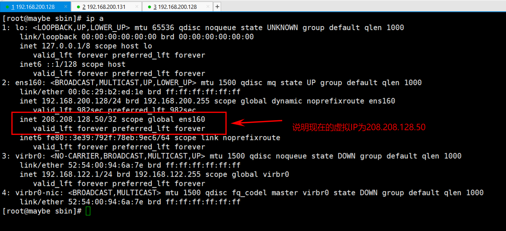

现在就可以用这个虚拟IP来做事，**当Nginx主机宕掉了，keepalived就会把这个虚拟IP加到备份服务器上**，这样备份服务器就会代替原来的工作

# 9、Nginx原理

## 9.1 master和worker

- nginx 启动后，是由两个进程组成的。master（管理者）和worker（工作者）。
- 一个nginx 只有一个master。但可以有多个worker

 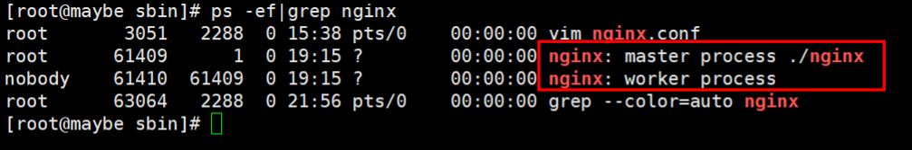

- 过来的请求由master管理，worker进行争抢式的方式去获取请求。

 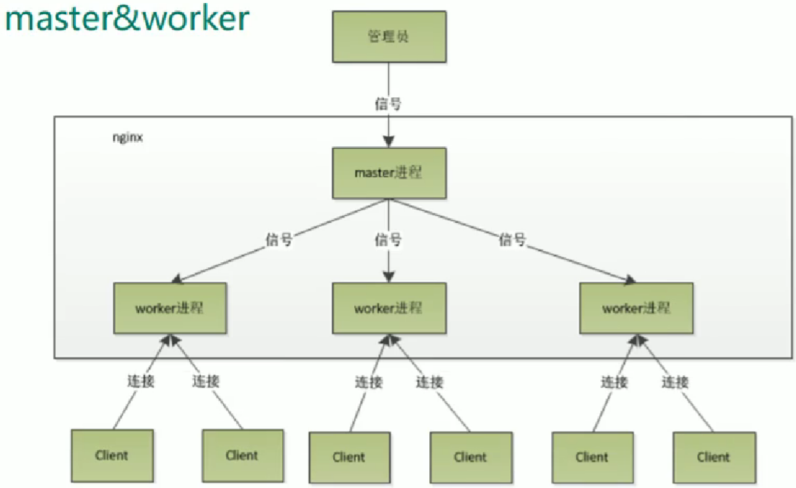

 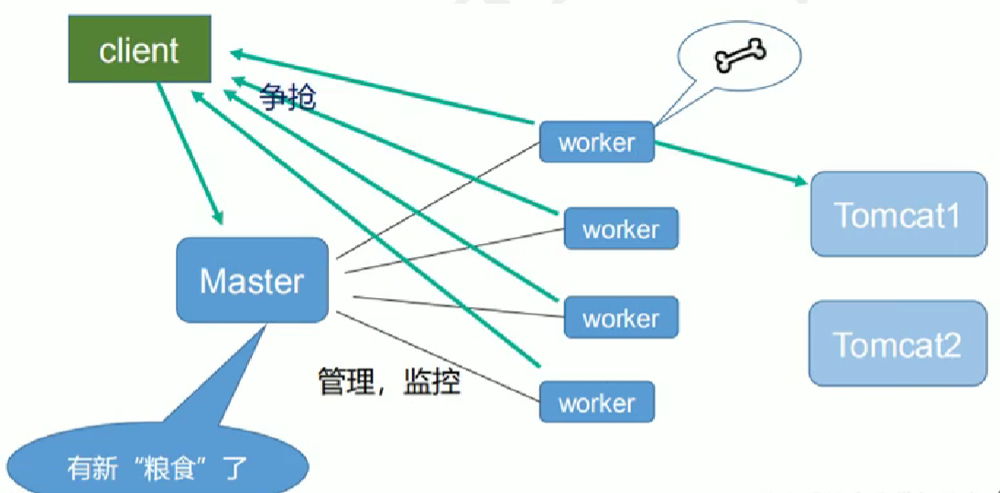

## 9.2 master-workers 的机制的好处

- 首先，对于每个 worker 进程来说，独立的进程，不需要加锁，所以省掉了锁带来的开销， 同时在编程以及问题查找时，也会方便很多。
- 可以使用 `nginx –s reload` 热部署，利用 nginx 进行热部署操作
- 其次，采用独立的进程，可以让互相之间不会 影响，一个进程退出后，其它进程还在工作，服务不会中断，master 进程则很快启动新的 worker 进程。当然，worker 进程的异常退出，肯定是程序有 bug 了，异常退出，会导致当 前 worker 上的所有请求失败，不过不会影响到所有请求，所以降低了风险。

## 9.3 设置多少个 worker

Nginx 同 redis 类似都采用了 io 多路复用机制，每个 worker 都是一个独立的进程，但每个进 程里只有一个主线程，通过异步非阻塞的方式来处理请求， 即使是千上万个请求也不在话 下。每个 worker 的线程可以把一个 cpu 的性能发挥到极致。所以 worker 数和服务器的 cpu 数相等是最为适宜的。设少了会浪费 cpu，设多了会造成 cpu 频繁切换上下文带来的损耗。

==**worker 数和服务器的 cpu 数相等是最为适宜**==

## 9.4 连接数 worker_connection问题

**第一个：**发送请求，占用了 woker 的几个连接数？

答案：2 或者 4 个

**第二个：**nginx 有一个 master，有四个 woker，每个 woker 支持最大的连接数 1024，支持的 最大并发数是多少？

普通的静态访问最大并发数是： worker_connections * worker_processes /2，
而如果是 HTTP 作 为反向代理来说，最大并发数量应该是 worker_connections * worker_processes/4。

这个值是表示每个 worker 进程所能建立连接的最大值，所以，一个 nginx 能建立的最大连接 数，应该是 worker_connections * worker_processes。当然，这里说的是最大连接数，对于 HTTP 请 求 本 地 资 源 来 说 ， 能 够 支 持 的 最 大 并 发 数 量 是 worker_connections * worker_processes，如果是支持 http1.1 的浏览器每次访问要占两个连接，所以普通的静态访 问最大并发数是： worker_connections * worker_processes /2，而如果是 HTTP 作 为反向代 理来说，最大并发数量应该是 worker_connections * worker_processes/4。因为作为反向代理服务器，每个并发会建立与客户端的连接和与后端服 务的连接，会占用两个连接。
