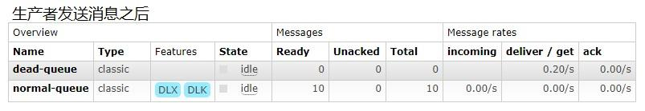

[toc]

# 1. 消息队列

>  特别鸣谢《尚硅谷》

## 1.1. MQ 的相关概念

### 1.1.1. 什么是MQ

MQ(message queue)，从字面意思上看，本质是个队列，FIFO 先入先出，只不过队列中存放的内容是message 而已，还是一种跨进程的通信机制，用于上下游传递消息。在互联网架构中，MQ 是一种非常常见的上下游“逻辑解耦+物理解耦”的消息通信服务。使用了 MQ 之后，消息发送上游只需要依赖 MQ，不用依赖其他服务。

### 1.1.2. 为什么要用MQ

1.流量消峰

举个例子，如果订单系统最多能处理一万次订单，这个处理能力应付正常时段的下单时绰绰有余，正常时段我们下单一秒后就能返回结果。但是在高峰期，如果有两万次下单操作系统是处理不了的，只能限制订单超过一万后不允许用户下单。使用消息队列做缓冲，我们可以取消这个限制，把一秒内下的订单分散成一段时间来处理，这时有些用户可能在下单十几秒后才能收到下单成功的操作，但是比不能下单的体验要好。

2.应用解耦

以电商应用为例，应用中有订单系统、库存系统、物流系统、支付系统。用户创建订单后，如果耦合调用库存系统、物流系统、支付系统，任何一个子系统出了故障，都会造成下单操作异常。当转变成基于消息队列的方式后，系统间调用的问题会减少很多，比如物流系统因为发生故障，需要几分钟来修复。在这几分钟的时间里，物流系统要处理的内存被缓存在消息队列中，用户的下单操作可以正常完成。当物流系统恢复后，继续处理订单信息即可，中单用户感受不到物流系统的故障，提升系统的可用性。

 

3.异步处理

有些服务间调用是异步的，例如 A 调用 B，B 需要花费很长时间执行，但是 A 需要知道 B 什么时候可以执行完，以前一般有两种方式，A 过一段时间去调用 B 的查询 api 查询。或者 A 提供一个 callback api， B 执行完之后调用 api 通知 A 服务。这两种方式都不是很优雅，使用消息总线，可以很方便解决这个问题，A 调用 B 服务后，只需要监听 B 处理完成的消息，当 B 处理完成后，会发送一条消息给 MQ，MQ 会将此消息转发给 A 服务。这样 A 服务既不用循环调用 B 的查询 api，也不用提供 callback api。同样B 服务也不用做这些操作。A 服务还能及时的得到异步处理成功的消息。

 

### 1.1.3. MQ 的分类

1.ActiveMQ

优点：单机吞吐量万级，时效性 ms 级，可用性高，基于主从架构实现高可用性，消息可靠性较低的概率丢失数据

缺点：官方社区现在对 ActiveMQ 5.x **维护越来越少，高吞吐量场景较少使用**。

尚硅谷官网视频: http://www.gulixueyuan.com/course/322

2.Kafka

大数据的杀手锏，谈到大数据领域内的消息传输，则绕不开 Kafka，这款为**大数据而生**的消息中间件，以其**百万级** **TPS** 的吞吐量名声大噪，迅速成为大数据领域的宠儿，在数据采集、传输、存储的过程中发挥着举足轻重的作用。目前已经被 LinkedIn，Uber, Twitter, Netflix 等大公司所采纳。

优点：性能卓越，单机写入 TPS 约在百万条/秒，最大的优点，就是吞**吐量高**。时效性 ms 级可用性非常高，kafka 是分布式的，一个数据多个副本，少数机器宕机，不会丢失数据，不会导致不可用,消费者采用 Pull 方式获取消息, 消息有序, 通过控制能够保证所有消息被消费且仅被消费一次;有优秀的第三方KafkaWeb 管理界面 Kafka-Manager；在日志领域比较成熟，被多家公司和多个开源项目使用；功能支持： 功能较为简单，主要支持简单的 MQ 功能，在大数据领域的实时计算以及**日志采集**被大规模使用

缺点：Kafka 单机超过 64 个队列/分区，Load 会发生明显的飙高现象，队列越多，load 越高，发送消息响应时间变长，使用短轮询方式，实时性取决于轮询间隔时间，消费失败不支持重试；支持消息顺序，但是一台代理宕机后，就会产生消息乱序，**社区更新较慢**；

3.RocketMQ

RocketMQ 出自阿里巴巴的开源产品，用 Java 语言实现，在设计时参考了 Kafka，并做出了自己的一些改进。被阿里巴巴广泛应用在订单，交易，充值，流计算，消息推送，日志流式处理，binglog 分发等场景。

优点：单机吞吐量十万级**,可用性非常高，分布式架构,**消息可以做到 **0** **丢失**，MQ 功能较为完善，还是分布式的，扩展性好,**支持** **10** **亿级别的消息堆积**，不会因为堆积导致性能下降,源码是 java 我们可以自己阅读源码，定制自己公司的 MQ

缺点：**支持的客户端语言不多**，目前是 java 及 c++，其中 c++不成熟；社区活跃度一般,没有在MQ核心中去实现 JMS 等接口,有些系统要迁移需要修改大量代码

4.RabbitMQ

2007 年发布，是一个在AMQP(高级消息队列协议)基础上完成的，可复用的企业消息系统，**是当前最主流的消息中间件之一。**

优点：由于 erlang 语言的**高并发特性**，性能较好；**吞吐量到万级**，MQ 功能比较完备,健壮、稳定、易用、跨平台、**支持多种语言** 如：Python、Ruby、.NET、Java、JMS、C、PHP、ActionScript、XMPP、STOMP等，支持 AJAX 文档齐全；开源提供的管理界面非常棒，用起来很好用,**社区活跃度高**；更新频率相当高，https://www.rabbitmq.com/news.html

缺点：商业版需要收费,学习成本较高

### 1.1.4. MQ 的选择

1.Kafka

Kafka 主要特点是基于Pull 的模式来处理消息消费，追求高吞吐量，一开始的目的就是用于日志收集和传输，适合产生**大量数据**的互联网服务的数据收集业务。**大型公司**建议可以选用，如果有**日志采集**功能，肯定是首选 kafka 了。尚硅谷官网 kafka 视频连接http://www.gulixueyuan.com/course/330/tasks

2.RocketMQ

天生为**金融互联网**领域而生，对于可靠性要求很高的场景，尤其是电商里面的订单扣款，以及业务削峰，在大量交易涌入时，后端可能无法及时处理的情况。RoketMQ 在稳定性上可能更值得信赖，这些业务场景在阿里双 11 已经经历了多次考验，如果你的业务有上述并发场景，建议可以选择 RocketMQ。

3.RabbitMQ

结合 erlang 语言本身的并发优势，性能好**时效性微秒级**，**社区活跃度也比较高**，管理界面用起来十分方便，如果你的**数据量没有那么大**，中小型公司优先选择功能比较完备的 RabbitMQ。

## 1.2. RabbitMQ

### 1.2.1. RabbitMQ 的概念

RabbitMQ 是一个消息中间件：它接受并转发消息。你可以把它当做一个快递站点，当你要发送一个包裹时，你把你的包裹放到快递站，快递员最终会把你的快递送到收件人那里，按照这种逻辑 RabbitMQ 是一个快递站，一个快递员帮你传递快件。RabbitMQ 与快递站的主要区别在于，它不处理快件而是接收，存储和转发消息数据。

### 1.2.2**.** 四大核心概念

- 生产者

  产生数据发送消息的程序是生产者

- 交换机

  交换机是 RabbitMQ 非常重要的一个部件，一方面它接收来自生产者的消息，另一方面它将消息推送到队列中。交换机必须确切知道如何处理它接收到的消息，是将这些消息推送到特定队列还是推送到多个队列，亦或者是把消息丢弃，这个得有交换机类型决定

- 队列

  队列是 RabbitMQ 内部使用的一种数据结构，尽管消息流经 RabbitMQ 和应用程序，但它们只能存储在队列中。队列仅受主机的内存和磁盘限制的约束，本质上是一个大的消息缓冲区。许多生产者可以将消息发送到一个队列，许多消费者可以尝试从一个队列接收数据。这就是我们使用队列的方式

- 消费者

  消费与接收具有相似的含义。消费者大多时候是一个等待接收消息的程序。请注意生产者，消费者和消息中间件很多时候并不在同一机器上。同一个应用程序既可以是生产者又是可以是消费者。

### 1.2.3. RabbitMQ 核心部分


### 1.2.4. 各个名词介绍


- **Broker**：接收和分发消息的应用，RabbitMQ Server 就是 Message Broker
- **Virtual host**：出于多租户和安全因素设计的，把 AMQP 的基本组件划分到一个虚拟的分组中，类似于网络中的 namespace 概念。当多个不同的用户使用同一个 RabbitMQ server 提供的服务时，可以划分出多个 vhost，每个用户在自己的 vhost 创建 exchange／queue 等
- **Connection**：publisher／consumer 和 broker 之间的 TCP 连接
- **Channel**：如果每一次访问 RabbitMQ 都建立一个 Connection，在消息量大的时候建立 TCPConnection 的开销将是巨大的，效率也较低。Channel 是在 connection 内部建立的逻辑连接，如果应用程序支持多线程，通常每个 thread 创建单独的 channel 进行通讯，AMQP method 包含了 channel id 帮助客户端和 message broker 识别 channel，所以 channel 之间是完全隔离的。**Channel 作为轻量级的Connection** **极大减少了操作系统建立** **TCP connection** **的开销**
- **Exchange**：message 到达 broker 的第一站，根据分发规则，匹配查询表中的 routing key，分发消息到 queue 中去。常用的类型有：direct (point-to-point), topic (publish-subscribe) and fanout(multicast)
- **Queue**：消息最终被送到这里等待 consumer 取走
- **Binding**：exchange 和 queue 之间的虚拟连接，binding 中可以包含 routing key，Binding 信息被保存到 exchange 中的查询表中，用于 message 的分发依据

### 1.2.5. 安装

参考博客：（这个安装我tm直接EMO）

Erlang安装：https://blog.csdn.net/u010476739/article/details/108623310

https://www.cnblogs.com/fengyumeng/p/11133924.html

1. 官网地址

​	https://www.rabbitmq.com/download.html

2. 文件上传

​	上传到/usr/local/software 目录下(如果没有 software 需要自己创建)


3. 安装文件(分别按照以下顺序安装)

​	`rpm -ivh erlang-21.3-1.el7.x86_64.rpm`

​	`yum install socat -y`

​	`rpm -ivh rabbitmq-server-3.8.8-1.el7.noarch.rpm`

3. 常用命令(按照以下顺序执行)

​	添加开机启动 RabbitMQ 服务

​	`chkconfig rabbitmq-server on`

​	启动服务

​	`/sbin/service rabbitmq-server start` 

​	查看服务状态

​	`/sbin/service rabbitmq-server status`

​	

​	停止服务(选择执行)

​	`/sbin/service rabbitmq-server stop`

​	开启 web 管理插件

​	`rabbitmq-plugins enable rabbitmq_management`

​	用默认账号密码(guest)访问地址 http://47.115.185.244:15672/出现权限问题


4. 添加一个新的用户

​	创建账号

​	rabbitmqctl add_user admin 123

​	设置用户角色

​	rabbitmqctl set_user_tags admin administrator

​	设置用户权限

​	`set_permissions [-p <vhostpath>] <user> <conf> <write> <read>`

​	`rabbitmqctl set_permissions -p "/" admin ".*" ".*" ".*"`

​	用户 user_admin 具有/vhost1 这个 virtual host 中所有资源的配置、写、读权限当前用户和角色

​	`rabbitmqctl list_users`

5. 再次利用 admin 用户登录

​	

6. 重置命令

​	关闭应用的命令为

​	`rabbitmqctl stop_app`

​	清除的命令为rabbitmqctl reset

​	重新启动命令为

​	`rabbitmqctl start_app`


# 2、简单模式

RabbitMQ是一个消息中间件，你可以想象它是一个邮局。当你把信件放到邮箱里时，能够确信邮递员会正确地递送你的信件。RabbitMq就是一个邮箱、一个邮局和一个邮递员。

- 发送消息的程序是==生产者==
- ==队列==就代表一个邮箱。虽然消息会流经RbbitMQ和你的应用程序，但消息只能被存储在队列里。队列存储空间只受服务器内存和磁盘限制，它本质上是一个大的消息缓冲区。多个生产者可以向同一个队列发送消息，多个消费者也可以从同一个队列接收消息.
- ==消费者==等待从队列接收消息

 

## pom.xml

```xml
<!--指定 jdk 编译版本--> 
<build> 
    <plugins> 
        <plugin>
            <groupId>org.apache.maven.plugins</groupId>
            <artifactId>maven-compiler-plugin</artifactId> 
            <configuration> 
                <source>8</source> 
                <target>8</target>
            </configuration>
        </plugin>
    </plugins>
</build> 
<dependencies>
    <!--rabbitmq 依赖客户端--> 
    <dependency> 
        <groupId>com.rabbitmq</groupId>
        <artifactId>amqp-client</artifactId>
        <version>5.8.0</version>
    </dependency>
    <!--操作文件流的一个依赖--> 
    <dependency>
        <groupId>commons-io</groupId>
        <artifactId>commons-io</artifactId>
        <version>2.6</version>
    </dependency>
</dependencies>
```

## 生产者发送消息

```java
package rabbitmq.simple;

import com.rabbitmq.client.Channel;
import com.rabbitmq.client.Connection;
import com.rabbitmq.client.ConnectionFactory;

public class Test1 {
	public static void main(String[] args) throws Exception {
		//创建连接工厂,并设置连接信息
		ConnectionFactory f = new ConnectionFactory();
		f.setHost("192.168.64.140");
		f.setPort(5672);//可选,5672是默认端口
		f.setUsername("admin");
		f.setPassword("admin");

		/*
		 * 与rabbitmq服务器建立连接,
		 * rabbitmq服务器端使用的是nio,会复用tcp连接,
		 * 并开辟多个信道与客户端通信
		 * 以减轻服务器端建立连接的开销
		 */
		Connection c = f.newConnection();
		//建立信道
		Channel ch = c.createChannel();

		/*
		 * 声明队列,会在rabbitmq中创建一个队列
		 * 如果已经创建过该队列，就不能再使用其他参数来创建
		 * 
		 * 参数含义:
		 *   -queue: 队列名称
		 *   -durable: 队列持久化,true表示RabbitMQ重启后队列仍存在
		 *   -exclusive: 排他,true表示限制仅当前连接可用
		 *   -autoDelete: 当最后一个消费者断开后,是否删除队列
		 *   -arguments: 其他参数
		 */
		ch.queueDeclare("helloworld", false,false,false,null);

		/*
		 * 发布消息
		 * 这里把消息向默认交换机发送.
		 * 默认交换机隐含与所有队列绑定,routing key即为队列名称
		 * 
		 * 参数含义:
		 * 	-exchange: 交换机名称,空串表示默认交换机"(AMQP default)",不能用 null 
		 * 	-routingKey: 对于默认交换机,路由键就是目标队列名称
		 * 	-props: 其他参数,例如头信息
		 * 	-body: 消息内容byte[]数组
		 */
		ch.basicPublish("", "helloworld", null, "Hello world!".getBytes());

		System.out.println("消息已发送");
		c.close();
	}
}
```

## 消费者接收消息

```java
package rabbitmq.simple;

import java.io.IOException;
import java.util.concurrent.TimeoutException;

import com.rabbitmq.client.CancelCallback;
import com.rabbitmq.client.Channel;
import com.rabbitmq.client.Connection;
import com.rabbitmq.client.ConnectionFactory;
import com.rabbitmq.client.DeliverCallback;
import com.rabbitmq.client.Delivery;

public class Test2 {
	public static void main(String[] args) throws Exception {
		//连接工厂
		ConnectionFactory f = new ConnectionFactory();
		f.setHost("192.168.64.140");
		f.setUsername("admin");
		f.setPassword("admin");
		//建立连接
		Connection c = f.newConnection();
		//建立信道
		Channel ch = c.createChannel();
		//声明队列,如果该队列已经创建过,则不会重复创建
		ch.queueDeclare("helloworld",false,false,false,null);
		System.out.println("等待接收数据");
		
		//收到消息后用来处理消息的回调对象
		DeliverCallback callback = new DeliverCallback() {
			@Override
			public void handle(String consumerTag, Delivery message) throws IOException {
				String msg = new String(message.getBody(), "UTF-8");
				System.out.println("收到: "+msg);
			}
		};
		
		//消费者取消时的回调对象
		CancelCallback cancel = new CancelCallback() {
			@Override
			public void handle(String consumerTag) throws IOException {
			}
		};
		/**
		 * 消费者消费消息
		 * 1.消费哪个队列
		 * 2.消费成功之后是否要自动应答 true 代表自动应答 false 手动应答
		 * 3.消费者成功消费的回调
		 * 4.消费者未成功消费的回调
		 */
		ch.basicConsume("helloworld", true, callback, cancel);
	}
}
```

# 3、工作模式

 

 

工作队列(即任务队列)背后的主要思想是避免立即执行资源密集型任务，并且必须等待它完成。相反，我们将任务安排在稍后完成。

我们将任务封装为消息并将其发送到队列。后台运行的工作进程将获取任务并最终执行任务。当运行多个消费者时，任务将在它们之间分发。

使用任务队列的一个优点是能够轻松地并行工作。如果我们正在积压工作任务，我们可以添加更多工作进程，这样就可以轻松扩展。

**抽取工具类**

```java
public class RabbitMqUtils {
    private RabbitMqYtils(){
    }
    //得到一个连接的 channel
    public static Channel getChannel() throws Exception{
        //创建一个连接工厂
        ConnectionFactory factory = new ConnectionFactory();
        factory.setHost("182.92.234.71");
        factory.setUsername("admin");
        factory.setPassword("123");
        Connection connection = factory.newConnection();
        Channel channel = connection.createChannel();
        return channel;
    } 
}
```

## 3.1 负载均衡（轮训发送）

**生产者发送消息**

这里模拟耗时任务,发送的消息中,每个点使工作进程暂停一秒钟,例如"Hello…"将花费3秒钟来处理

```java
public class Test1 {
	public static void main(String[] args) throws Exception {
		Channel ch = RabbitMQUtils.getChannel();
		//参数:queue,durable,exclusive,autoDelete,arguments
		ch.queueDeclare("helloworld", false,false,false,null);

		while (true) {
		    //控制台输入的消息发送到rabbitmq
			System.out.print("输入消息: ");
			String msg = new Scanner(System.in).nextLine();
			//如果输入的是"exit"则结束生产者进程
			if ("exit".equals(msg)) {
				break;
			}
			//参数:exchage,routingKey,props,body
			ch.basicPublish("", "helloworld", null, msg.getBytes());
			System.out.println("消息已发送: "+msg);
		}

		c.close();
	}
}
```

**消费者接收消息**

```java
public class Test2 {
	public static void main(String[] args) throws Exception {
        Channel ch = RabbitMQUtils.getChannel();
		ch.queueDeclare("helloworld",false,false,false,null);
		System.out.println("等待接收数据");
		
		//收到消息后用来处理消息的回调对象
		DeliverCallback callback = new DeliverCallback() {
			@Override
			public void handle(String consumerTag, Delivery message) throws IOException {
				String msg = new String(message.getBody(), "UTF-8");
				System.out.println("收到: "+msg);

				//遍历字符串中的字符,每个点使进程暂停一秒
				for (int i = 0; i < msg.length(); i++) {
					if (msg.charAt(i)=='.') {
						try {
							Thread.sleep(1000);
						} catch (InterruptedException e) {
						}
					}
				}
				System.out.println("处理结束");
			}
		};
		
		//消费者取消时的回调对象
		CancelCallback cancel = new CancelCallback() {
			@Override
			public void handle(String consumerTag) throws IOException {
			}
		};
		
		ch.basicConsume("helloworld", true, callback, cancel);
	}
}
```

**运行测试**

运行:

- 一个生产者
- 两个消费者

生产者发送多条消息,
如: 1,2,3,4,5. 两个消费者分别收到:

- 消费者一: 1,3,5
- 消费者二: 2,4

rabbitmq在所有消费者中轮询分发消息，把消息均匀地发送给所有消费者

## 3.2 消息应答

- **概念：**

消费者完成一个任务可能需要一段时间，如果其中一个消费者处理一个长的任务并仅只完成了部分突然它挂掉了，会发生什么情况。RabbitMQ 一旦向消费者传递了一条消息，便立即将该消息标记为删除。在这种情况下，突然有个消费者挂掉了，我们将丢失正在处理的消息。以及后续发送给该消费这的消息，因为它无法接收到。

为了保证消息在发送过程中不丢失，rabbitmq 引入消息应答机制，消息应答就是：**消费者在接收到消息并且处理该消息之后，告诉 rabbitmq 它已经处理了，rabbitmq 可以把该消息删除了。**

### 自动应答

消息发送后立即被认为已经传送成功，这种模式需要在**高吞吐量和数据传输安全性方面做权衡**,因为这种模式如果消息在接收到之前，消费者那边出现连接或者 channel 关闭，那么消息就丢失 了,当然另一方面这种模式消费者那边可以传递过载的消息，**没有对传递的消息数量进行限制**，当然这样有可能使得消费者这边由于接收太多还来不及处理的消息，导致这些消息的积压，最终使得内存耗尽，最终这些消费者线程被操作系统杀死，**所以这种模式仅适用在消费者可以高效并以某种速率能够处理这些消息的情况下使用**。

### 手动应答

**A**.Channel.basicAck(用于肯定确认) 

​	RabbitMQ 已知道该消息并且成功的处理消息，可以将其丢弃了

**B**.Channel.basicNack(用于否定确认) 

**C**.Channel.basicReject(用于否定确认) 

​	与 Channel.basicNack 相比少一个参数

​	不处理该消息了直接拒绝，可以将其丢弃了

- **Multiple 的解释**

**手动应答的好处是可以批量应答并且减少网络拥堵**

 

multiple 的 true 和 false 代表不同意思

true 代表批量应答 channel 上未应答的消息，比如说 channel 上有传送 tag 的消息 5,6,7,8 当前 tag 是8 那么此时5-8 的这些还未应答的消息都会被确认收到消息应答

false 同上面相比只会应答 tag=8 的消息 5,6,7 这三个消息依然不会被确认收到消息应答

 

### 消息自动重新入队

如果消费者由于某些原因失去连接(其通道已关闭，连接已关闭或 TCP 连接丢失)，导致消息未发送 ACK 确认，RabbitMQ 将了解到消息未完全处理，并将对其重新排队。如果此时其他消费者可以处理，它将很快将其重新分发给另一个消费者。这样，即使某个消费者偶尔死亡，也可以确保不会丢失任何消息。

 

### 消息手动应答代码

默认消息采用的是自动应答，所以我们要想实现消息消费过程中不丢失，需要把自动应答改为手动应答，消费者代码变化如下：

```java
public class Consumer {
    public static final String QUEUE_NAME = "hello";

    public static void main(String[] args) throws IOException, TimeoutException {
        Channel channel = RabbitMQUtils.getChannel();
        DeliverCallback deliverCallback = (String consumerTag, Delivery message) -> {
            String messageBody = new String(message.getBody(), StandardCharsets.UTF_8);
            System.out.println("接收到的消息为："+messageBody);
            //1.消息总标记tag
            // 2.false代表只应答接收到的那个传递的消总，true为应答所有消总包括传递过来的所有消息
            channel.basicAck(message.getEnvelope().getDeliveryTag(),false);
        };
        CancelCallback cancelCallback=(String consumerTag)->{
            System.out.println("消费者取消消息");
        };
        //自动应答改为false
        channel.basicConsume(QUEUE_NAME, false,deliverCallback,cancelCallback);
    }
}
```

生产者不变

### 手动应答效果演示

正常情况下消息发送方发送两个消息 C1 和 C2 分别接收到消息并进行处理

 

在发送者发送消息 dd，发出消息之后的把 C2 消费者停掉，按理说该 C2 来处理该消息，但是由于它处理时间较长，在还未处理完，也就是说 C2 还没有执行 ack 代码的时候，C2 被停掉了，此时会看到消息被 C1 接收到了，说明消息 dd 被重新入队，然后分配给能处理消息的 C1 处理了

 

 

 

## 3.3 RabbitMQ 持久化

- **概念**

刚刚我们已经看到了如何处理任务不丢失的情况，但是如何保障当 RabbitMQ 服务停掉以后消息生产者发送过来的消息不丢失。默认情况下 RabbitMQ 退出或由于某种原因崩溃时，它忽视队列和消息，除非告知它不要这样做。确保消息不会丢失需要做两件事：**我们需要将队列和消息都标记为持久化**。

### 队列如何实现持久化

之前我们创建的队列都是非持久化的，rabbitmq 如果重启的化，该队列就会被删除掉，如果要队列实现持久化 需要在声明队列的时候把 durable 参数设置为持久化


但是需要注意的就是如果之前声明的队列不是持久化的，需要把原先队列先删除，或者重新创建一个持久化的队列，不然就会出现错误


以下为控制台中持久化与非持久化队列的 UI 显示区

 

这个时候即使重启 rabbitmq 队列也依然存在

### 消息实现持久化

**注意：**上面实现队列持久化不等于队列里的消息持久化，还需要将消息持久化

要想让消息实现持久化需要在消息生产者修改代码，MessageProperties.PERSISTENT_TEXT_PLAIN 添加这个属性。


将消息标记为持久化并不能完全保证不会丢失消息。尽管它告诉 RabbitMQ 将消息保存到磁盘，但是这里依然存在当消息刚准备存储在磁盘的时候 但是还没有存储完，消息还在缓存的一个间隔点。此时并没有真正写入磁盘。持久性保证并不强，但是对于我们的简单任务队列而言，这已经绰绰有余了。如果需要更强有力的持久化策略，参考后边课件发布确认章节。

### 不公平分发

在最开始的时候我们学习到 RabbitMQ 分发消息采用的**轮训分发**，但是在某种场景下这种策略并不是很好，比方说有两个消费者在处理任务，其中有个消费者 1 处理任务的速度非常快，而另外一个消费者 2处理速度却很慢，这个时候我们还是采用轮训分发的化就会到这处理速度快的这个消费者很大一部分时间处于空闲状态，而处理慢的那个消费者一直在干活，这种分配方式在这种情况下其实就不太好，但是RabbitMQ 并不知道这种情况它依然很公平的进行分发。

为了避免这种情况，我们可以设置参数 `channel.basicQos(1);`


 

 

意思就是如果这个任务我还没有处理完或者我还没有应答你，你先别分配给我，我目前只能处理一个任务，然后 rabbitmq 就会把该任务分配给没有那么忙的那个空闲消费者，当然如果所有的消费者都没有完成手上任务，队列还在不停的添加新任务，队列有可能就会遇到队列被撑满的情况，这个时候就只能添加新的 worker 或者改变其他存储任务的策略。

### 预取值

本身消息的发送就是异步发送的，所以在任何时候，channel 上肯定不止只有一个消息另外来自消费者的手动确认本质上也是异步的。因此这里就存在一个未确认的消息缓冲区，因此希望开发人员能 **限制此缓冲区的大小，以避免缓冲区里面无限制的未确认消息问题**。这个时候就可以通过使用 basic.qos 方法设置“预取计数”值来完成的。**该值定义通道上允许的未确认消息的最大数量**。一旦数量达到配置的数量，RabbitMQ 将停止在通道上传递更多消息，除非至少有一个未处理的消息被确认，例如，假设在通道上有未确认的消息 5、6、7，8，并且通道的预取计数设置为 4，此时RabbitMQ 将不会在该通道上再传递任何消息，除非至少有一个未应答的消息被 ack。比方说 tag=6 这个消息刚刚被确认 ACK，RabbitMQ 将会感知这个情况到并再发送一条消息。消息应答和 QoS 预取值对用户吞吐量有重大影响。通常，增加预取将提高向消费者传递消息的速度。**虽然自动应答传输消息速率是最佳的，但是，在这种情况下已传递但尚未处理的消息的数量也会增加，从而增加了消费者的RAM** **消耗**(随机存取存储器)应该小心使用具有无限预处理的自动确认模式或手动确认模式，消费者消费了大量的消息如果没有确认的话，会导致消费者连接节点的内存消耗变大，所以找到合适的预取值是一个反复试验的过程，不同的负载该值取值也不同 100 到 300 范围内的值通常可提供最佳的吞吐量，并且不会给消费者带来太大的风险。预取值为 1 是最保守的。当然这将使吞吐量变得很低，特别是消费者连接延迟很严重的情况下，特别是在消费者连接等待时间较长的环境中。对于大多数应用来说，稍微高一点的值将是最佳的。

 

 


# 4、发布确认

## 4.1 发布确认原理

生产者将信道设置成 confirm 模式，一旦信道进入 confirm 模式，**所有在该信道上面发布的消息都将会被指派一个唯一的 ID**(从 1 开始)，一旦消息被投递到所有匹配的队列之后，broker 就会发送一个确认给生产者(包含消息的唯一 ID)，这就使得生产者知道消息已经正确到达目的队列了，如果消息和队列是可持久化的，那么确认消息会在将消息写入磁盘之后发出，broker 回传给生产者的确认消息中 delivery-tag 域包含了确认消息的序列号，此外 broker 也可以设置basic.ack 的multiple 域，表示到这个序列号之前的所有消息都已经得到了处理。

confirm 模式最大的好处在于他是异步的，一旦发布一条消息，生产者应用程序就可以在等信道返回确认的同时继续发送下一条消息，当消息最终得到确认之后，生产者应用便可以通过回调方法来处理该确认消息，如果 RabbitMQ 因为自身内部错误导致消息丢失，就会发送一条 nack 消息，生产者应用程序同样可以在回调方法中处理该 nack 消息。

## 4.2 发布确认策略

### 开启发布确认

发布确认默认是没有开启的，如果要开启需要调用方法 confirmSelect，每当你要想使用发布确认，都需要在 channel 上调用该方法

 

### 单个确认发布

这是一种简单的确认方式，它是一种**同步确认发布**的方式，也就是发布一个消息之后只有它被确认发布，后续的消息才能继续发布,`waitForConfirmsOrDie(long)`**这个方法只有在消息被确认的时候才返回**，如果在指定时间范围内这个消息没有被确认那么它将抛出异常。

这种确认方式有一个最大的**缺点**就是:**发布速度特别的慢，**因为如果没有确认发布的消息就会阻塞所有后续消息的发布，这种方式最多提供每秒不超过数百条发布消息的吞吐量。当然对于某些应用程序来说这可能已经足够了。

```java
public static void publishMessageIndividually() throws Exception {
    Channel channel = RabbitMqUtils.getChannel();
    String queueName = UUID.randomUUID().toString();
    channel.queueDeclare(queueName, false, false, false, null);
    //开启发布确认
    channel.confirmSelect();
    long begin = System.currentTimeMillis();
    for (int i = 0; i < MESSAGE_COUNT; i++) {
        String message = i + "";
        channel.basicPublish("", queueName, null, message.getBytes());
        //服务端返回 false 或超时时间内未返回，生产者可以消息重发
        boolean flag = channel.waitForConfirms();
        if(flag){
            System.out.println("消息发送成功");
        } 
    }
    long end = System.currentTimeMillis();
    System.out.println("发布" + MESSAGE_COUNT + "个单独确认消息,耗时" + (end - begin) + "ms");
} 
```

### 批量确认发布

上面那种方式非常慢，与单个等待确认消息相比，先发布一批消息然后一起确认可以极大地提高吞吐量，当然这种方式的**缺点就是:当发生故障导致发布出现问题时，不知道是哪个消息出现问题了**，我们必须将整个批处理保存在内存中，以记录重要的信息而后重新发布消息。当然这种方案仍然是同步的，也一样阻塞消息的发布。

```java
public static void publishMessageBatch() throws Exception {
    Channel channel = RabbitMqUtils.getChannel();
    String queueName = UUID.randomUUID().toString();
    channel.queueDeclare(queueName, false, false, false, null);
    //开启发布确认
    channel.confirmSelect();
    //批量确认消息大小
    int batchSize = 100;
    long begin = System.currentTimeMillis();
    for (int i = 0; i < MESSAGE_COUNT; i++) {
        String message = i + "";
        channel.basicPublish("", queueName, null, message.getBytes());
        //判断达到100条消息的时候批量确认一次
        if (i%batchSize == 0){
            //发布确认
            channel.waitForConfirm();
        }
    }
    long end = System.currentTimeMillis();
    System.out.println("发布" + MESSAGE_COUNT + "批量确认消息,耗时" + (end - begin) + "ms");
} 
```

### 异步确认发布

异步确认虽然编程逻辑比上两个要复杂，但是性价比最高，无论是可靠性还是效率都没得说，他是利用回调函数来达到消息可靠性传递的，这个中间件也是通过函数回调来保证是否投递成功，下面就让我们来详细讲解异步确认是怎么实现的。

 

```java
public static void publishMessageAsync() throws Exception {
    Channel channel = RabbitMqUtils.getChannel();
    String queueName = UUID.randomUUID().toString();
    channel.queueDeclare(queueName, false, false, false, null);
    //开启发布确认
    channel.confirmSelect();
    /**
	 * 线程安全有序的一个哈希表，适用于高并发的情况
	 * 1.轻松的将序号与消息进行关联
	 * 2.轻松批量删除条目 只要给到序列号
	 * 3.支持并发访问
	 */
    ConcurrentSkipListMap<Long, String> outstandingConfirms = new ConcurrentSkipListMap<>();
    /**
	 * 确认收到消息的一个回调
	 * 1.消息序列号
	 * 2.true 可以确认小于等于当前序列号的消息
 	 * 	 false 确认当前序列号消息
	 */
    ConfirmCallback ackCallback = (sequenceNumber, multiple) -> {
        if (multiple) {
            //返回的是小于等于当前序列号的未确认消息 是一个 map
            ConcurrentNavigableMap<Long, String> confirmed =
                outstandingConfirms.headMap(sequenceNumber, true);
            //清除该部分未确认消息
            confirmed.clear();
        }else{
            //只清除当前序列号的消息
            outstandingConfirms.remove(sequenceNumber);
        }
    };
    ConfirmCallback nackCallback = (sequenceNumber, multiple) -> {
        String message = outstandingConfirms.get(sequenceNumber);
        System.out.println("发布的消息"+message+"未被确认，序列号"+sequenceNumber);
    };
    /**
	 * 添加一个异步确认的监听器
	 * 1.确认收到消息的回调
	 * 2.未收到消息的回调
 	 */
    channel.addConfirmListener(ackCallback, nackCallback);
    long begin = System.currentTimeMillis();
    for (int i = 0; i < MESSAGE_COUNT; i++) {
        String message = "消息" + i;
        /**
		 * channel.getNextPublishSeqNo()获取下一个消息的序列号
		 * 通过序列号与消息体进行一个关联
		 * 全部都是未确认的消息体
		 */
        outstandingConfirms.put(channel.getNextPublishSeqNo(), message);
        channel.basicPublish("", queueName, null, message.getBytes());

    }
    long end = System.currentTimeMillis();
    System.out.println("发布" + MESSAGE_COUNT + "个异步确认消息,耗时" + (end - begin) + "ms");
}
```

### 如何处理异步未确认消息

最好的解决的解决方案就是把未确认的消息放到一个基于内存的能被发布线程访问的队列，比如说用 ConcurrentLinkedQueue 这个队列在 confirm callbacks 与发布线程之间进行消息的传递。

### 以上 3 种发布确认速度对比

- 单独发布消息;同步等待确认，简单，但吞吐量非常有限。
- 批量发布消息：批量同步等待确认，简单，合理的吞吐量，一旦出现问题但很难推断出是那条消息出现了问题。
- 异步处理：最佳性能和资源使用，在出现错误的情况下可以很好地控制，但是实现起来稍微难些

```java
public static void main(String[] args) throws Exception {
    //这个消息数量设置为 1000 好些 不然花费时间太长
    publishMessagesIndividually();//发布 1,000 个单独确认消息耗时 722 ms
    publishMessagesInBatch();//发布 1,000 个批量确认消息耗时 147 ms
    handlePublishConfirmsAsynchronously();//发布 1,000 个异步确认消息耗时 62 ms
}
```

# 5、交换机

在上一节中，我们创建了一个工作队列。我们假设的是工作队列背后，每个任务都恰好交付给一个消费者(工作进程)。在这一部分中，我们将做一些完全不同的事情-我们将消息传达给多个消费者。这种模式称为 ”发布/订阅”.

为了说明这种模式，我们将构建一个简单的日志系统。它将由两个程序组成:第一个程序将发出日志消息，第二个程序是消费者。其中我们会启动两个消费者，其中一个消费者接收到消息后把日志存储在磁盘，另外一个消费者接收到消息后把消息打印在屏幕上，事实上第一个程序发出的日志消息将广播给所有消费者

## 5.1 Exchanges

### Exchanges 概念

RabbitMQ 消息传递模型的核心思想是: **生产者生产的消息从不会直接发送到队列**。实际上，通常生产者甚至都不知道这些消息传递传递到了哪些队列中。相反，**生产者只能将消息发送到交换机(exchange)**，交换机工作的内容非常简单，一方面它接收来自生产者的消息，另一方面将它们推入队列。交换机必须确切知道如何处理收到的消息。是应该把这些消息放到特定队列还是说把他们到许多队列中还是说应该丢弃它们。这就的由交换机的类型来决定。

 

### Exchanges 的类型

总共有以下类型：

直接(direct)也叫路由模式、 主题(topic) 、标题(headers)现在用得少、扇出(fanout)也就是发布订阅模式

### 无名exchange

在本教程的前面部分我们对 exchange 一无所知，但仍然能够将消息发送到队列。之前能实现的原因是因为我们使用的是默认交换，我们通过空字符串(“”)进行标识。

 

第一个参数是交换机的名称。**空字符串表示默认或无名称交换机**：<u>消息能路由发送到队列中其实是由 routingKey(bindingkey)绑定 key 指定的</u>，如果它存在的话

## 5.2 临时队列

之前的章节我们使用的是具有特定名称的队列(还记得 hello 和 ack_queue 吗？)。队列的名称对我们来说至关重要，我们需要指定我们的消费者去消费哪个队列的消息。

每当我们连接到 Rabbit 时，我们都需要一个全新的空队列，为此我们可以创建一个具有**随机名称的队列**，或者能让服务器为我们选择一个随机队列名称那就更好了。其次**一旦我们断开了消费者的连接，队列将被自动删除。**

创建临时队列的方式如下：（==其实就是没有指定队列名称，没有持久化==）

`String queueName = channel.queueDeclare().getQueue();`

创建出来之后长成这样：

 

## 5.3 绑定(bindings)

什么是 bingding 呢，binding 其实是 exchange 和 queue 之间的桥梁，它告诉我们 exchange 和那个队列进行了绑定关系。比如说下面这张图告诉我们的就是 X 与 Q1 和 Q2 进行了绑定

 

## 5.4 Fanout

### Fanout 介绍

Fanout 这种类型非常简单。正如从名称中猜到的那样，它是将接收到的所有消息**广播**到它知道的所有队列中。系统中默认有些 exchange 类型

 

### Fanout 代码实现

 

Logs 和临时队列的绑定关系如下图

 

生产者 EmitLog 发送消息给两个消费者接收

```java
public class EmitLog {
    private static final String EXCHANGE_NAME = "logs";
    public static void main(String[] argv) throws Exception {
        Channel channel = RabbitUtils.getChannel();
        /**
		 * 声明一个 exchange
		 * 1.exchange 的名称
		 * 2.exchange 的类型
		 */
        channel.exchangeDeclare(EXCHANGE_NAME, BuiltinExchangeType.FANOUT);
        Scanner sc = new Scanner(System.in);
        System.out.println("请输入信息");
        while (sc.hasNext()) {
            String message = sc.nextLine();
            channel.basicPublish(EXCHANGE_NAME, "", null, message.getBytes("UTF-8"));
            System.out.println("生产者发出消息" + message);
        }
    }
}
```

两个消费者 ReceiveLogs01 和 ReceiveLogs02 将接收到的消息打印在控制台

```java
public class ReceiveLogs01 {
    private static final String EXCHANGE_NAME = "logs";
    public static void main(String[] argv) throws Exception {
        Channel channel = RabbitUtils.getChannel();
        channel.exchangeDeclare(EXCHANGE_NAME, BuiltinExchangeType.FANOUT);
        /**
		 * 生成一个临时的队列 队列的名称是随机的
		 * 当消费者断开和该队列的连接时 队列自动删除
		 */
        String queueName = channel.queueDeclare().getQueue();
        //把该临时队列绑定我们的 exchange 其中 routingkey(也称之为 binding key)为空字符串
        channel.queueBind(queueName, EXCHANGE_NAME, "");
        System.out.println("等待接收消息,把接收到的消息打印在屏幕........... ");
        DeliverCallback deliverCallback = (consumerTag, delivery) -> {
            String message = new String(delivery.getBody(), "UTF-8");
            System.out.println("控制台打印接收到的消息"+message);
        };
        channel.basicConsume(queueName, true, deliverCallback, consumerTag -> { });
    } 
}
```

## 5.5 Direct exchange

在上面，我们构建了一个简单的日志记录系统。我们能够向许多接收者广播日志消息。在本节我们将向其中添加一些特别的功能-比方说我们只让某个消费者订阅发布的部分消息。例如我们只把严重错误消息定向存储到日志文件(以节省磁盘空间)，同时仍然能够在控制台上打印所有日志消息。

我们再次来回顾一下什么是 bindings，绑定是交换机和队列之间的桥梁关系。也可以这么理解：**队列只对它绑定的交换机的消息感兴趣**。绑定用参数：routingKey 来表示也可称该参数为 binding key，创建绑定我们用代码 `channel.queueBind(queueName, EXCHANGE_NAME, "routingKey");` **绑定之后的意义由其交换类型决定。**

### Direct exchange 介绍

上面我们的日志系统将所有消息广播给所有消费者，对此我们想做一些改变，<u>例如我们希望将日志消息写入磁盘的程序仅接收严重错误(errros)，而不存储哪些警告(warning)或信息(info)日志消息避免浪费磁盘空间。</u>Fanout 这种交换类型并不能给我们带来很大的灵活性-它只能进行无意识的广播，在这里我们将使用 direct 这种类型来进行替换，这种类型的工作方式是，消息只去到它绑定的routingKey 队列中去。

 

在上面这张图中，我们可以看到 X 绑定了两个队列，绑定类型是 direct。队列Q1 绑定键为 orange，队列 Q2 绑定键有两个:一个绑定键为 black，另一个绑定键为 green.

在这种绑定情况下，生产者发布消息到 exchange 上，**绑定键为 orange 的消息会被发布到队列Q1。绑定键为 blackgreen 和的消息会被发布到队列 Q2，其他消息类型的消息将被丢弃。**

### 多重绑定

 

当然如果 exchange 的绑定类型是direct，**但是它绑定的多个队列的** **key** **如果都相同**，在这种情况下虽然绑定类型是 direct **但是它表现的就和** **fanout** **有点类似了**，就跟广播差不多，如上图所示。

 

 

生产者代码：

```java
public class EmitLogDirect {
    private static final String EXCHANGE_NAME = "direct_logs";
    public static void main(String[] argv) throws Exception {
        Channel channel = RabbitUtils.getChannel();
        channel.exchangeDeclare(EXCHANGE_NAME, BuiltinExchangeType.DIRECT);
        //创建多个 bindingKey
        Map<String, String> bindingKeyMap = new HashMap<>();
        bindingKeyMap.put("info","普通 info 信息");
        bindingKeyMap.put("warning","警告 warning 信息");
        bindingKeyMap.put("error","错误 error 信息");
        //debug 没有消费这接收这个消息 所有就丢失了
        bindingKeyMap.put("debug","调试 debug 信息");
        for (Map.Entry<String, String> bindingKeyEntry: bindingKeyMap.entrySet()){
            String bindingKey = bindingKeyEntry.getKey();
            String message = bindingKeyEntry.getValue();
            channel.basicPublish(EXCHANGE_NAME,bindingKey, null,message.getBytes("UTF-8"));
            System.out.println("生产者发出消息:" + message);
        } 
    } 
}
```

消费者代码：

```java
public class ReceiveLogsDirect02 {
    private static final String EXCHANGE_NAME = "direct_logs";
    public static void main(String[] argv) throws Exception {
        Channel channel = RabbitUtils.getChannel();
        channel.exchangeDeclare(EXCHANGE_NAME, BuiltinExchangeType.DIRECT);
        String queueName = "console";
        channel.queueDeclare(queueName, false, false, false, null);
        channel.queueBind(queueName, EXCHANGE_NAME, "info");
        channel.queueBind(queueName, EXCHANGE_NAME, "warning");
        System.out.println("等待接收消息........... ");
        DeliverCallback deliverCallback = (consumerTag, delivery) -> {
            String message = new String(delivery.getBody(), "UTF-8");
            System.out.println(" 接收绑定键 :"+delivery.getEnvelope().getRoutingKey()+", 消 息:"+message);
        };
        channel.basicConsume(queueName, true, deliverCallback, consumerTag -> {});
    } 
}
```

```java
public class ReceiveLogsDirect01 {
    private static final String EXCHANGE_NAME = "direct_logs";
    public static void main(String[] argv) throws Exception {
        Channel channel = RabbitUtils.getChannel();
        channel.exchangeDeclare(EXCHANGE_NAME, BuiltinExchangeType.DIRECT);
        String queueName = "disk";
        channel.queueDeclare(queueName, false, false, false, null);
        channel.queueBind(queueName, EXCHANGE_NAME, "error");
        System.out.println("等待接收消息........... ");
        DeliverCallback deliverCallback = (consumerTag, delivery) -> {
            String message = new String(delivery.getBody(), "UTF-8");
            message="接收绑定键:"+delivery.getEnvelope().getRoutingKey()+",消息:"+message;
            File file = new File("C:\\work\\rabbitmq_info.txt");
            FileUtils.writeStringToFile(file,message,"UTF-8");
            System.out.println("错误日志已经接收");
        };
        channel.basicConsume(queueName, true, deliverCallback, consumerTag -> {});
    } 
}
```

## 5.6 Topics

### 之前类型的问题

在上面，我们改进了日志记录系统。我们没有使用只能进行随意广播的 fanout 交换机，而是使用了 direct 交换机，从而有能实现有选择性地接收日志。

尽管使用direct 交换机改进了我们的系统，但是它仍然存在局限性-比方说我们想接收的日志类型有info.base 和 info.advantage，某个队列只想 info.base 的消息，那这个时候direct 就办不到了。这个时候就只能使用 topic 类型

### Topic 的要求

发送到类型是 topic 交换机的消息的 routing_key 不能随意写，必须满足一定的要求，它**必须是一个单词列表，以点号分隔开**。这些单词可以是任意单词，比如说："stock.usd.nyse" , "nyse.vmw" , "quick.orange.rabbit".这种类型的。当然这个单词列表最多不能超过 255 个字节。

在这个规则列表中，其中有**两个替换符是大家需要注意的**

- `*` **(星号)可以代替一个单词**
- `#` **(井号)可以替代零个或多个单词**

### Topic 匹配案例

下图绑定关系如下

Q1-->绑定的是中间带 orange 带 3 个单词的字符串(`*.orange.*`)

Q2-->绑定的是最后一个单词是 rabbit 的 3 个单词(`*.*.rabbit`)，第一个单词是 lazy 的多个单词(`lazy.#`)

 

上图是一个队列绑定关系图，我们来看看他们之间数据接收情况是怎么样的

quick.orange.rabbit 被队列 Q1Q2 接收到

lazy.orange.elephant 被队列 Q1Q2 接收到

quick.orange.fox 被队列 Q1 接收到

lazy.brown.fox 被队列 Q2 接收到

lazy.pink.rabbit 虽然满足两个绑定但只被队列 Q2 接收一次

quick.brown.fox 不匹配任何绑定不会被任何队列接收到会被丢弃

quick.orange.male.rabbit 是四个单词不匹配任何绑定会被丢弃

lazy.orange.male.rabbit 是四个单词但匹配 Q2

**当队列绑定关系是下列这种情况时需要引起注意**

- **当一个队列绑定键是#,那么这个队列将接收所有数据，就有点像 fanout 了**
- **如果队列绑定键当中没有#和*出现，那么该队列绑定类型就是 direct 了**

 

生产者代码：

```java
/**
 * @Author Maybe
 * Date on 2021/11/25  21:09
 */
public class publisher {
    public static final String EXCHANGE_NAME = "topicExchange";

    public static void main(String[] args) throws IOException, TimeoutException {
        Channel channel = RabbitMQUtils.getChannel();
        channel.exchangeDeclare(EXCHANGE_NAME, BuiltinExchangeType.TOPIC);
        HashMap<String, String> bindingKeyMap = new HashMap<>();
        bindingKeyMap.put("lazy.pink.rabbit", "虽然满足两个绑定但只被队列 Q2 接收一次");
        bindingKeyMap.put("quick.brown.fox", "不匹配任何绑定不会被任何队列接收到会被丢弃");
        bindingKeyMap.put("quick.orange.male.rabbit", "是四个单词不匹配任何绑定会被丢弃");
        bindingKeyMap.put("lazy.orange.male.rabbit", "是四个单词但匹配 Q2");

        for (Map.Entry<String, String> bindingKeyEntry : bindingKeyMap.entrySet()) {
            String bindingKey = bindingKeyEntry.getKey();
            String message = bindingKeyEntry.getValue();
            channel.basicPublish(EXCHANGE_NAME, bindingKey, MessageProperties.PERSISTENT_TEXT_PLAIN,
                    message.getBytes(StandardCharsets.UTF_8));
        }
    }
}
```

两个消费者代码：

```java
/**
 * @Author Maybe
 * Date on 2021/11/25  21:08
 */

public class Consumer1 {
    public static final String EXCHANGE_NAME = "topicExchange";

    public static void main(String[] args) throws IOException, TimeoutException {
        Channel channel = RabbitMQUtils.getChannel();
        channel.exchangeDeclare(EXCHANGE_NAME, BuiltinExchangeType.TOPIC);
        String queueName = "Q1";
        channel.queueDeclare(queueName, false, false, false, null);
        channel.queueBind(queueName, EXCHANGE_NAME, "*.orange.*");
        System.out.println("等待接收消息");
        DeliverCallback deliverCallback = (String consumerTag, Delivery message) -> {
            String mes = new String(message.getBody(), StandardCharsets.UTF_8);
            System.out.println("队列：" + queueName + " 收到的消息为：" + mes + "绑定键为：" + message.getEnvelope().getRoutingKey());
            channel.basicAck(message.getEnvelope().getDeliveryTag(), false);
        };
        CancelCallback cancelCallback = (String consumerTag) -> {
            System.out.println("被取消的消息序号为：" + consumerTag);
        };
        channel.basicConsume(queueName, false, deliverCallback, cancelCallback);
    }
}
```

```java
/**
 * @Author Maybe
 * Date on 2021/11/25  21:08
 */
public class Consumer2 {
    public static final String EXCHANGE_NAME = "topicExchange";

    public static void main(String[] args) throws IOException, TimeoutException {
        Channel channel = RabbitMQUtils.getChannel();
        channel.exchangeDeclare(EXCHANGE_NAME, BuiltinExchangeType.TOPIC);
        String queueName = "Q2";
        channel.queueDeclare(queueName, false, false, false, null);
        channel.queueBind(queueName, EXCHANGE_NAME, "*.*.rabbit");
        channel.queueBind(queueName, EXCHANGE_NAME, "lazy.#");
        System.out.println("等待接收消息");

        DeliverCallback deliverCallback = (String consumerTag, Delivery message) -> {
            String mes = new String(message.getBody(), StandardCharsets.UTF_8);
            System.out.println("队列：" + queueName + " 收到的消息为：" + mes + "绑定键为：" + message.getEnvelope().getRoutingKey());
            channel.basicAck(message.getEnvelope().getDeliveryTag(), false);
        };

        CancelCallback cancelCallback = (String consumerTag) -> {
            System.out.println("被取消的消息序号为：" + consumerTag);
        };

        channel.basicConsume(queueName, false, deliverCallback, cancelCallback);
    }
}
```

# 6、死信队列

## 6.1 死信的概念

先从概念解释上搞清楚这个定义，死信，顾名思义就是无法被消费的消息，字面意思可以这样理解，一般来说，producer 将消息投递到 broker 或者直接到queue 里了，consumer 从 queue 取出消息进行消费，但某些时候由于特定的**原因导致** **queue** **中的某些消息无法被消费**，这样的消息如果没有后续的处理，就变成了死信，有死信自然就有了死信队列。

应用场景：为了保证订单业务的消息数据不丢失，需要使用到 RabbitMQ 的死信队列机制，当消息消费发生异常时，将消息投入死信队列中。还有比如说: 用户在商城下单成功并点击去支付后在指定时间未支付时自动失效

## 6.2 死信的来源

- 消息 TTL 过期
- 队列达到最大长度(队列满了，无法再添加数据到 mq 中)
- 消息被拒绝(basic.reject 或 basic.nack)并且 requeue=false.

## 6.3 案例

 

### 消息TTL（time to live）过期

正常消费者

```java
/**
 * @Author Maybe
 * Date on 2021/11/26  15:10
 */
public class Consumer1 {
    //普通交换机名称
    private static final String NORMAL_EXCHANGE = "normal_exchange";
    //死信交换机名称
    private static final String DEAD_EXCHANGE = "dead_exchange";

    public static void main(String[] args) throws IOException, TimeoutException {
        Channel channel = RabbitMQUtils.getChannel();
        channel.exchangeDeclare(NORMAL_EXCHANGE, BuiltinExchangeType.DIRECT);
        channel.exchangeDeclare(DEAD_EXCHANGE, BuiltinExchangeType.DIRECT);

        String normalQueue = "normalQueue";
        String deadQueue = "deadQueue";
        //声明死信队列
        channel.queueDeclare(deadQueue, false, false, false, null);
        //绑定死信队列
        channel.queueBind(deadQueue, DEAD_EXCHANGE, "deadMessage");

        //在queueDeclare()的最后一个参数可以传一个map，map里面可以写具体配置参数，如：
        /**
         * 正常队列设置死信交换机 参数 key 是固定值
         * params.put("x-dead-letter-exchange", DEAD_EXCHANGE);
         * 正常队列设置死信 routing-key 参数 key 是固定值
         * params.put("x-dead-letter-routing-key", "deadMessage");
         */
        Map<String, Object> arguments = new HashMap<>();
        arguments.put("x-dead-letter-exchange", DEAD_EXCHANGE);
        arguments.put("x-dead-letter-routing-key", "deadMessage");
        //声明、绑定普通队列
        /**
         * 在声明声明队列的最后一个多参map中如果设置了死信交换机以及相应的routingKey，
         * 在该队列出现死信的情况下，会将这个死信转交给多参map中设置的死信交换机，再由死信交换机
         * 发给对应的死信队列处理
         */
        channel.queueDeclare(normalQueue, false, false, false, arguments);
        channel.queueBind(normalQueue, NORMAL_EXCHANGE, "normalMessage");

        DeliverCallback deliverCallback = (consumerTag, message) -> {
            String s = new String(message.getBody(), StandardCharsets.UTF_8);
            System.out.println("已收到消息：" + s);
            channel.basicAck(message.getEnvelope().getDeliveryTag(), false);
        };
        channel.basicConsume(normalQueue, false, deliverCallback, consumerTag -> {
        });
    }
}
```

**arguments：** 
队列中的消息什么时候会自动被删除？

- Message TTL(x-message-ttl)：设置队列中的所有消息的生存周期(统一为整个队列的所有消息设置生命周期), 也可以在发布消息的时候单独为某个消息指定剩余生存时间,单位毫秒, 类似于redis中的ttl，生存时间到了，消息会被从队里中删除，注意是消息被删除，而不是队列被删除， 特性Features=TTL, 单独为某条消息设置过期时间AMQP.BasicProperties.Builder properties = new AMQP.BasicProperties().builder().expiration(“6000”); 
  channel.basicPublish(EXCHANGE_NAME, “”, properties.build(), message.getBytes(“UTF-8”));
- Auto Expire(x-expires): 当队列在指定的时间没有被访问(consume, basicGet, queueDeclare…)就会被删除,Features=Exp
- Max Length(x-max-length): 限定队列的消息的最大值长度，超过指定长度将会把最早的几条删除掉， 类似于mongodb中的固定集合，例如保存最新的100条消息, Feature=Lim
- Max Length Bytes(x-max-length-bytes): 限定队列最大占用的空间大小， 一般受限于内存、磁盘的大小, Features=Lim B
- Dead letter exchange(x-dead-letter-exchange)： 当队列消息长度大于最大长度、或者过期的等，将从队列中删除的消息推送到指定的交换机中去而不是丢弃掉,Features=DLX
- Dead letter routing key(x-dead-letter-routing-key)：将删除的消息推送到指定交换机的指定路由键的队列中去, Feature=DLK
- Maximum priority(x-max-priority)：优先级队列，声明队列时先定义最大优先级值(定义最大值一般不要太大)，在发布消息的时候指定该消息的优先级， 优先级更高（数值更大的）的消息先被消费,
- Lazy mode(x-queue-mode=lazy)： Lazy Queues: 先将消息保存到磁盘上，不放在内存中，当消费者开始消费的时候才加载到内存中
- Master locator(x-queue-master-locator)

死信消息处理的消费者

```java
/**
 * @Author Maybe
 * Date on 2021/11/26  15:10
 */
public class Consumer2 {

    public static void main(String[] args) throws IOException, TimeoutException {
        Channel channel = RabbitMQUtils.getChannel();

        String deadQueue = "deadQueue";

        DeliverCallback deliverCallback = (consumerTag, message) -> {
            String s = new String(message.getBody(), StandardCharsets.UTF_8);
            System.out.println("已处理死信消息：" + s);
            channel.basicAck(message.getEnvelope().getDeliveryTag(), false);
        };
        channel.basicConsume(deadQueue, false, deliverCallback, consumerTag -> {
        });
    }
}
```

生产者

```java
/**
 * @Author Maybe
 * Date on 2021/11/26  15:36
 */
public class Publisher {
    //普通交换机名称
    private static final String NORMAL_EXCHANGE = "normal_exchange";

    public static void main(String[] args) throws IOException, TimeoutException {
        Channel channel = RabbitMQUtils.getChannel();

        //对消息的具体设置
        AMQP.BasicProperties build = new AMQP.BasicProperties().builder().expiration("10000").build();
        for (int i = 0; i < 10; i++) {
            String message = "info" + i;
            channel.basicPublish(NORMAL_EXCHANGE, "normalMessage", build,
                    message.getBytes(StandardCharsets.UTF_8));
        }

    }
}
```

其中对消息的设置，也就是 basicPublish() 的第三个参数当中可以设置以下选项（AMQP是一个接口，BasicProperties是它的内部类）

```java
public static class BasicProperties extends com.rabbitmq.client.impl.AMQBasicProperties {

    private String contentType;   //消息类型如(text/plain)

    private String contentEncoding; //编码

    private Map<String,Object> headers; //header

    private Integer deliveryMode; //消息的投递模式

    private Integer priority; //优先级

    private String correlationId;

    private String replyTo;

    private String expiration; //过期时间

    private String messageId;

    private Date timestamp;

    private String type;

    private String userId;

    private String appId;

    private String clusterId;
```

 **结果：**

 

以上步骤完成后 启动 C2 消费者 它消费死信队列里面的消息

 

### 队列到达最大长度

去掉生产者中对消息保留时间的设置


C1 消费者修改以下代码(**启动之后关闭该消费者 模拟其接收不到消息**) 


**注意此时需要把原先队列删除 因为参数改变了**

C2 消费者代码不变(启动 C2 消费者)

 

### 消息被拒

消息生产者代码同上生产者一致

C1 消费者代码(**启动之后关闭该消费者 模拟其接收不到消息**) 


 

C2 消费者代码不变

**启动消费者 1 然后再启动消费者 2** 

 

# 7、延迟队列


## 7.1 延迟队列概念

延时队列内部是有序的，最重要的特性就体现在它的延时属性上，延时队列中的元素是希望在指定时间到了以后或之前取出和处理，简单来说，延时队列就是用来存放需要在指定时间被处理的元素的队列。**其实就是将上面死信队列中TTL的情况拿出来单独细说。**

## 7.2 延迟队列使用场景

1. 订单在十分钟之内未支付则自动取消

2. 新创建的店铺，如果在十天内都没有上传过商品，则自动发送消息提醒。

3. 用户注册成功后，如果三天内没有登陆则进行短信提醒。

4. 用户发起退款，如果三天内没有得到处理则通知相关运营人员。

5. 预定会议后，需要在预定的时间点前十分钟通知各个与会人员参加会议

这些场景都有一个特点，需要在某个事件发生之后或者之前的指定时间点完成某一项任务，如：发生订单生成事件，在十分钟之后检查该订单支付状态，然后将未支付的订单进行关闭；看起来似乎使用定时任务，一直轮询数据，每秒查一次，取出需要被处理的数据，然后处理不就完事了吗？如果数据量比较少，确实可以这样做，比如：对于“如果账单一周内未支付则进行自动结算”这样的需求，如果对于时间不是严格限制，而是宽松意义上的一周，那么每天晚上跑个定时任务检查一下所有未支付的账单，确实也是一个可行的方案。但对于数据量比较大，并且时效性较强的场景，如：“订单十分钟内未支付则关闭“，短期内未支付的订单数据可能会有很多，活动期间甚至会达到百万甚至千万级别，对这么庞大的数据量仍旧使用轮询的方式显然是不可取的，很可能在一秒内无法完成所有订单的检查，同时会给数据库带来很大压力，无法满足业务要求而且性能低下。

 

TTL 是什么呢？TTL 是 RabbitMQ 中一个消息或者队列的属性，表明一条消息或者该队列中的所有消息的最大存活时间，

单位是毫秒。换句话说，如果**一条消息设置了 TTL 属性**或者**进入了设置TTL 属性的队列**，那么这条消息如果在TTL 设置的时间内没有被消费，则会成为"死信"。如果同时配置了队列的TTL 和消息的TTL，那么较小的那个值将会被使用，有两种方式设置 TTL。

- 第一种是在创建队列的时候设置队列的“x-message-ttl”属性
   

- 另一种方式便是针对每条消息设置TTL
   

**两者区别：**

如果设置了队列的 TTL 属性，那么一旦消息过期，就会被队列丢弃(如果配置了死信队列被丢到死信队列中)，而第二种方式，消息即使过期，也不一定会被马上丢弃，因为**消息是否过期是在即将投递到消费者之前判定的**，如果当前队列有严重的消息积压情况，则已过期的消息也许还能存活较长时间；另外，还需要注意的一点是，如果不设置 TTL，表示消息永远不会过期，如果将 TTL 设置为 0，则表示除非此时可以直接投递该消息到消费者，否则该消息将会被丢弃。

## 7.3 延迟队列的应用以及一个问题

创建两个队列 QA 和 QB，两者队列 TTL 分别设置为 10S 和 40S，然后在创建一个交换机 X 和死信交换机 Y，它们的类型都是direct，创建一个死信队列 QD，它们的绑定关系如下：

 

在这里新增了一个队列 QC,绑定关系如下,该队列不设置TTL 时间

 

**这里没有写QA和QB，旨在说明延迟队列的一个问题**

配置类：

```java
/**
 * @Author Maybe
 * Date on 2021/11/28  15:52
 */
public class TTLConfig {
    @Configuration
    public class TtlQueueConfig {
        public static final String X_EXCHANGE = "X";
        public static final String Y_DEAD_LETTER_EXCHANGE = "Y";
        public static final String DEAD_LETTER_QUEUE = "QD";
        public static final String QUEUE_C = "QC";

        // 声明 xExchange
        @Bean("xExchange")
        public DirectExchange xExchange() {
            return new DirectExchange(X_EXCHANGE);
        }

        // 声明 yExchange
        @Bean("yExchange")
        public DirectExchange yExchange() {
            return ExchangeBuilder.directExchange(Y_DEAD_LETTER_EXCHANGE).durable(true).build();
        }

        //声明队列 C 死信交换机
        @Bean("queueC")
        public Queue queueB() {
            Map<String, Object> args = new HashMap<>(3);
            //声明当前队列绑定的死信交换机
            args.put("x-dead-letter-exchange", Y_DEAD_LETTER_EXCHANGE);
            //声明当前队列的死信路由 key
            args.put("x-dead-letter-routing-key", "YD");
            //没有声明 TTL 属性
            return QueueBuilder.durable(QUEUE_C).withArguments(args).build();
        }

        //声明队列 B 绑定 X 交换机
        @Bean
        public Binding queuecBindingX(@Qualifier("queueC") Queue queueC,
                                      @Qualifier("xExchange") DirectExchange xExchange) {
            return BindingBuilder.bind(queueC).to(xExchange).with("XC");
        }
        
        //声明死信队列 QD
        @Bean("queueD")
        public Queue queueD() {
            return new Queue(DEAD_LETTER_QUEUE);
        }

        //声明死信队列 QD 绑定关系
        @Bean
        public Binding deadLetterBindingQAD(@Qualifier("queueD") Queue queueD,
                                            @Qualifier("yExchange") DirectExchange yExchange) {
            return BindingBuilder.bind(queueD).to(yExchange).with("YD");
        }
    }
}
```

生产者：

```java
/**
 * @Author Maybe
 * Date on 2021/11/28  15:54
 */
@RequestMapping("ttl")
@RestController
public class ProducerController {
    @Autowired
    private RabbitTemplate rabbitTemplate;

    @GetMapping("sendExpirationMsg/{message}/{ttlTime}")
    public void sendMsg(@PathVariable String message, @PathVariable String ttlTime) {
        rabbitTemplate.convertAndSend("X", "XC", message, msg -> {
            msg.getMessageProperties().setExpiration(ttlTime);
            return msg;
        });
        System.out.println("当前时间：" + new Date().toString() + ",发送一条时长" + ttlTime +
                "ms的 TTL 信息给队列 C:" + message);
    }
}
```

消费者：

```java
/**
 * @Author Maybe
 * Date on 2021/11/28  15:57
 */
@Component
public class Consumer {
    @RabbitListener(queues = "QD")
    public void receiveD(Message message, Channel channel) throws IOException {
        String msg = new String(message.getBody());
        System.out.println("当前时间：" + new Date().toString() + ",收到死信队列信息：" + msg);
    }
}
```

 发起请求：

```
http://localhost:8080/ttl/sendExpirationMsg/你好 1/20000
http://localhost:8080/ttl/sendExpirationMsg/你好 2/2000
```

 

看起来似乎没什么问题，但是在最开始的时候，就介绍过如果使用在消息属性上设置 TTL 的方式，消息可能并不会按时“死亡“，因为 **RabbitMQ** **只会检查第一个消息是否过期**，如果过期则丢到死信队列，**如果第一个消息的延时时长很长，而第二个消息的延时时长很短，第二个消息并不会优先得到执行**。

## 7.4 Rabbitmq 插件实现延迟队列

上面出现的问题，确实是一个问题，如果不能实现在消息粒度上的 TTL，并使其在设置的TTL 时间及时死亡，就无法设计成一个通用的延时队列。那如何解决呢，接下来我们就去解决该问题。

在官网上下载 https://www.rabbitmq.com/community-plugins.html，下载**rabbitmq_delayed_message_exchange** 插件，然后解压放置到 RabbitMQ 的插件目录。

进入 RabbitMQ 的安装目录下的 plgins 目录，执行下面命令让该插件生效，然后重启 RabbitMQ

```shell
/usr/lib/rabbitmq/lib/rabbitmq_server-3.8.8/plugins
rabbitmq-plugins enable rabbitmq_delayed_message_exchange
```


 

**可以看到在网页客户端的增加交换机的交换机类型中多了一个新的类型，但在代码API中还没有该类型（不知道后面的更新中会如何解决），那该怎样使用这个延迟交换机呢？要使用自定义交换机类 CustomExchange**

**有关延迟交换机的说明：**在我们自定义的交换机中，这是一种新的交换类型，**该类型消息支持延迟投递机制 消息传递后并不会立即投递到目标队列中，而是存储在 mnesia(一个分布式数据系统)表中，当达到投递时间时，才投递到目标队列中。**

具体配置：

```java
/**
 * @Author Maybe
 * Date on 2021/11/28  16:31
 */
@Configuration
public class DelayedQueueConfig {
    public static final String DELAYED_QUEUE_NAME = "delayed.queue";
    public static final String DELAYED_EXCHANGE_NAME = "delayed.exchange";
    public static final String DELAYED_ROUTING_KEY = "delayed.routingkey";

    @Bean
    public Queue delayedQueue(){
        return QueueBuilder.durable(DELAYED_QUEUE_NAME).build();
    }
    @Bean
    public CustomExchange delayedExchange(){
        HashMap<String, Object> argsMap = new HashMap<>();
        argsMap.put("x-delayed-type","direct");
        //这里就不要用构造类了，构造类里面没有CustomExchange
        return new CustomExchange(DELAYED_EXCHANGE_NAME,"x-delayed-message",
                true,false,argsMap);
    }
    @Bean
    public Binding bindingDelayedQueue(){
        return BindingBuilder.bind(delayedQueue()).to(delayedExchange()).with(DELAYED_ROUTING_KEY).noargs();
    }
}
```

再次发起请求：

```
http://localhost:8080/ttl/sendDelayMsg/come on baby1/20000
http://localhost:8080/ttl/sendDelayMsg/come on baby2/2000
```

 

第二个消息被先消费掉了，符合预期

**总结**

延时队列在需要延时处理的场景下非常有用，使用 RabbitMQ 来实现延时队列可以很好的利用RabbitMQ 的特性，如：消息可靠发送、消息可靠投递、死信队列来保障消息至少被消费一次以及未被正确处理的消息不会被丢弃。另外，通过 RabbitMQ 集群的特性，可以很好的解决单点故障问题，不会因为单个节点挂掉导致延时队列不可用或者消息丢失。

当然，延时队列还有很多其它选择，比如利用 Java 的 DelayQueue，利用 Redis 的 zset，利用 Quartz或者利用 kafka 的时间轮，这些方式各有特点,看需要适用的场景

# 8、SpringBoot整合及RabbitMQ高级用法

## pom.xml

```xml
<dependencies>
    <!--RabbitMQ 依赖--> 
    <dependency> 
        <groupId>org.springframework.boot</groupId>
        <artifactId>spring-boot-starter-amqp</artifactId>
    </dependency>
    <!--RabbitMQ 测试依赖-->
    <dependency>
        <groupId>org.springframework.amqp</groupId> 
        <artifactId>spring-rabbit-test</artifactId> 
        <scope>test</scope>
    </dependency>
</dependencies>
```

## application.yaml

```yaml
spring:
  rabbitmq:
    host: 192.168.200.128
    port: 5672
    username: admin
    password: 123
  application:
    name: springboot-rabbitMQ
```

## RabbitMQ配置类

```java
/**
 * @Author Maybe
 * Date on 2021/11/27  15:51
 */
@Configuration
public class TTL_QueueConfig {
    public static final String X_EXCHANGE = "X";
    public static final String QUEUE_A = "QA";
    public static final String QUEUE_B = "QB";

    public static final String Y_DEAD_LETTER_EXCHANGE = "Y";
    public static final String DEAD_LETTER_QUEUE = "QD";

    //xExchange交换机
    @Bean()
    public DirectExchange xExchange() {
//        return new DirectExchange(X_EXCHANGE, true, false);
        //直接new或采用对应构造类（链式编程）都行
        return ExchangeBuilder.directExchange(X_EXCHANGE).durable(true).build();
    }

    //yExchange死信交换机
    @Bean()
    public DirectExchange yExchange() {
        return new DirectExchange(Y_DEAD_LETTER_EXCHANGE, true, false);
    }

    //声明队列 A ttl 为 10s 并绑定到对应的死信交换机
    @Bean()
    public Queue queueA() {
        HashMap<String, Object> argsMap = new HashMap<>(3);
        //声明当前队列绑定的死信交换机
        argsMap.put("x-dead-letter-exchange", Y_DEAD_LETTER_EXCHANGE);
        //声明当前队列的死信路由 key
        argsMap.put("x-dead-letter-routing-key", "YD");
        //声明队列的 TTL
        argsMap.put("x-message-ttl", 10000);

        return new Queue(QUEUE_A, true, false, false, argsMap);
    }

    //队列 A 绑定 X 交换机
    @Bean
    public Binding queueABindingX() {
        return BindingBuilder.bind(queueA()).to(xExchange()).with("XA");
    }

    //声明队列 B ttl 为 40s 并绑定到对应的死信交换机
    @Bean
    public Queue queueB() {
        HashMap<String, Object> argsMap = new HashMap<>(3);
        argsMap.put("x-dead-letter-exchange", Y_DEAD_LETTER_EXCHANGE);
        argsMap.put("x-dead-letter-routing-key", "YD");
        argsMap.put("x-message-ttl", 40000);

        return QueueBuilder.durable(QUEUE_B).withArguments(argsMap).build();
    }

    @Bean
    public Binding queueBBindingX() {
        return BindingBuilder.bind(queueB()).to(xExchange()).with("XD");
    }

    @Bean
    public Queue queueD() {
        return QueueBuilder.durable(DEAD_LETTER_QUEUE).build();
    }

    @Bean
    public Binding queueDBindingY() {
        return BindingBuilder.bind(queueD()).to(yExchange()).with("YD");
    }

}
```

### 队列的Arguments参数：

> 1. x-message-ttl 发送到队列的消息在丢弃之前可以存活多长时间（毫秒）。
> 2. x-expires 队列在被自动删除（毫秒）之前可以使用多长时间。
> 3. x-max-length 队列在开始从头部删除之前可以包含多少就绪消息。
> 4. x-max-length-bytes 队列在开始从头部删除之前可以包含的就绪消息的总体大小。
> 5. x-dead-letter-exchange 设置队列溢出行为。这决定了在达到队列的最大长度时消息会发生什么。有效值为drop-head或reject-publish。交换的可选名称，如果消息被拒绝或过期，将重新发布这些名称。
> 6. x-dead-letter-routing-key 可选的替换路由密钥，用于在消息以字母为单位时使用。如果未设置，将使用消息的原始路由密钥。
> 7. x-max-priority 队列支持的最大优先级数;如果未设置，队列将不支持消息优先级。
> 8. x-queue-mode 将队列设置为延迟模式，在磁盘上保留尽可能多的消息以减少内存使用;如果未设置，队列将保留内存缓存以尽快传递消息。
> 9.  x-queue-master-locator 将队列设置为主位置模式，确定在节点集群上声明时队列主机所在的规则。


## 8.1 RabbitTemplate

RabbitTemplate是我们在与SpringAMQP整合的时候进行发送消息的关键类，该类提供了丰富的发送消息的方法，包括可靠性消息投递、回调监听消息接口ConfirmCallback、返回值确认接口ReturnCallback等等同样我们需要注入到Spring容器中，然后直接使用。在与spring整合时需要实例化，但是在与Springboot整合时，只需要添加配置文件即可。

### convertAndSend()方法

```java
/**
 * @Author Maybe
 * Date on 2021/11/27  20:58
 */
@RestController
@RequestMapping("ttl")
public class TTLMsgController {
    @Resource
    RabbitTemplate rabbitTemplate;

    @GetMapping("getMsg/{message}/{ttlTime}")
    public void sendMsg(@PathVariable String message, @PathVariable String ttlTime) {
        rabbitTemplate.convertAndSend("X", "XC", message, msg -> {
            msg.getMessageProperties().setExpiration(ttlTime);
            return msg;
        });
    }
}
```

 

- 上面这个重载方法其中最后一个参数**MessagePostProcessor**是一个函数式接口，里面有三个重载方法

```java
@FunctionalInterface
public interface MessagePostProcessor {

	/**
	 * Change (or replace) the message.
	 */
	Message postProcessMessage(Message message) throws AmqpException;

	/**
	 * Change (or replace) the message and/or change its correlation data. Only applies to
	 * outbound messages.
	 */
	default Message postProcessMessage(Message message, Correlation correlation) {
		return postProcessMessage(message);
	}

	/**
	 * Change (or replace) the message and/or change its correlation data. Only applies to
	 * outbound messages.
	 */
	default Message postProcessMessage(Message message, Correlation correlation, String exchange, String routingKey) {
		return postProcessMessage(message, correlation);
	}

}
```

可以对要发送的消息进行一些设置，比如上面的设置消息的过期时间等

- 在众多重载方法中，里面还有一个陌生参数 **CorrelationData correlationData** ：

  用于消息发布确认模式下给每个消息指定唯一的ID以及回调返回的消息

## 8.2 消息接收

```java
package com.eagle.rabbitHandle;

import com.rabbitmq.client.Channel;
import org.springframework.amqp.core.Message;
import org.springframework.amqp.rabbit.annotation.RabbitHandler;
import org.springframework.amqp.rabbit.annotation.RabbitListener;
import org.springframework.stereotype.Component;

import java.io.IOException;
import java.nio.charset.StandardCharsets;

/**
 * @Author Maybe
 * Date on 2021/11/27  19:54
 */
@Component
public class Handle1 {

    @RabbitListener(queues = "QD")
    @RabbitHandler
    //注意Message和Channel别导错包
    public void handle1(Message message, Channel channel) throws IOException {
        String msg = new String(message.getBody(), StandardCharsets.UTF_8);
        System.out.println(msg);
        long deliveryTag = message.getMessageProperties().getDeliveryTag();
        //1.消息总标记tag
        //2.false代表只应答接收到的那个传递的消总，true为应答所有消总包括传递过来的所有消息
        //3.手动应答要事先配置
        channel.basicAck(deliveryTag, false);
    }
}
```

 

### @RabbitListener

使用 @RabbitListener 注解标记方法，当监听到队列 debug 中有消息时则会进行接收并处理

```java
@RabbitListener(queues = "debug")
public void processMessage1(Message bytes) {
    System.out.println(new String(bytes));
}
```

**注意：**消息的 content_type 属性表示消息 body 数据以什么数据格式存储，接收消息除了使用 Message 对象接收消息（包含消息属性等信息）之外，还可直接使用对应类型接收消息 body 内容，但若方法参数类型不正确会抛异常：

- application/octet-stream：二进制字节数组存储，使用 byte[]
- application/x-java-serialized-object：java 对象序列化格式存储，使用 Object、相应类型（反序列化时类型应该同包同名，否者会抛出找不到类异常）
- text/plain：文本数据类型存储，使用 String
- application/json：JSON 格式，使用 Object、相应类型

### 通过 @RabbitListener 注解声明 Binding

通过 @RabbitListener 的 bindings 属性声明 Binding（**若 RabbitMQ 中不存在该绑定所需要的 Queue、Exchange、RouteKey 则自动创建，若存在则抛出异常**）

```java
@RabbitListener(bindings = @QueueBinding(
        exchange = @Exchange(value = "topic.exchange",durable = "true",type = "topic"),
        value = @Queue(value = "consumer_queue",durable = "true"),
        key = "key.#"
))
public void processMessage1(Message message) {
    System.out.println(message);
}
```

###  @RabbitHandler

@RabbitListener 也可以标注在类上面，**需配合 @RabbitHandler 注解一起使用**
@RabbitListener 标注在类上面表示当有收到消息的时候，就交给 @RabbitHandler 的方法处理，具体使用哪个方法处理，根据 MessageConverter 转换后的参数类型

## 8.3 ConfirmCallback 消息发布确认的回调监听函数式接口

需要现在配置中进行配置

- NONE：禁用发布确认模式，是默认值

- CORRELATED：发布消息成功到交换器后会触发回调方法（**相当于异步确认**）

- SIMPLE：经测试有两种效果（**相当于同步确认**）
  其一效果和 CORRELATED 值一样会触发回调方法

  其二在发布消息成功后使用 rabbitTemplate 调用 waitForConfirms 或 waitForConfirmsOrDie 方法等待 broker 节点返回发送结果，根据返回结果来判定下一步的逻辑，要注意的点是waitForConfirmsOrDie 方法如果返回 false 则会关闭 channel，则接下来无法发送消息到 broker

**无论失败与否，只要开启了消息的发布确认，该回调方法都会执行**

 

用rabbitTemplate的setConfirmCallback()方法设置消息发布确认，参数为 `ConfirmCallback` 函数式接口


可以使用Lambda表达式直接写：

```java
/**
 * @Author Maybe
 * Date on 2021/11/27  20:58
 */
@RestController
@RequestMapping("ttl")
public class TTLMsgController {
    @Resource
    RabbitTemplate rabbitTemplate;

    @GetMapping("getMsg/{message}/{ttlTime}")
    public void sendMsg(@PathVariable String message, @PathVariable String ttlTime) {

        rabbitTemplate.setConfirmCallback(
                /**
                 *    @param correlationData 用于消息发布确认模式下给每个消息指定唯一的ID
                 *                           以及回调返回的消息
                 *    @param ack broker 是否落盘成功
                 *    @param cause 失败的一些异常信息
                 */
                (@Nullable CorrelationData correlationData, boolean ack, @Nullable String cause) -> {
                    if (!ack) {
                        System.out.println("ID为：" + correlationData.getId() +
                                "的消息未接收到，因为：" + cause);
                    }
                });
        rabbitTemplate.convertAndSend("X", "XC", message, msg -> {
            msg.getMessageProperties().setExpiration(ttlTime);
            return msg;
        });
    }
}
```

## 8.4 消息回退

**在仅开启了生产者确认机制的情况下，交换机接收到消息后，会直接给消息生产者发送确认消息**，**如果发现该消息不可路由，那么消息会被直接丢弃，此时生产者是不知道消息被丢弃这个事件的**。那么如何让无法被路由的消息帮我想办法处理一下？最起码通知我一声，我好自己处理啊。通过设置 ReturnCallback函数式接口可以在当消息传递过程中不可达目的地（队列）时将消息返回给生产者。**也就是消息到达交换机了，但无处路由导致消息被丢弃**

开启配置：

 

和上面的ConfirmCallback 函数式接口类似，这也是个函数式接口

```java
rabbitTemplate.setReturnCallback(
    (Message message1, int replyCode, String replyText, String exchange, String routingKey) -> {
        log.error(" 消息 {},被交换机 {} 退回,退回原因: {}, 路由key:{}",
                  message1.toString(), exchange, replyText, routingKey);
    });
```

## 8.5 备份交换机

有了回退消息，我们获得了对无法投递消息的感知能力，有机会在生产者的消息无法被投递时发现并处理。但有时候，我们并不知道该如何处理这些无法路由的消息，最多打个日志，然后触发报警，再来手动处理。而通过日志来处理这些无法路由的消息是很不优雅的做法，特别是当生产者所在的服务有多台机器的时候，手动复制日志会更加麻烦而且容易出错。而且设置 mandatory 参数会增加生产者的复杂性，需要添加处理这些被退回的消息的逻辑。

如果既不想丢失消息，又不想增加生产者的复杂性，该怎么做呢？**前面在设置死信队列的文章中，我们提到，可以为队列设置死信交换机来存储那些处理失败的消息，可是这些不可路由消息根本没有机会进入到队列，因此无法使用死信队列来保存消息**。在 RabbitMQ 中，**有一种备份交换机的机制存在**，可以很好的应对这个问题。什么是备份交换机呢？备份交换机可以理解为 RabbitMQ 中交换机的“备胎”，**当我们为某一个交换机声明一个对应的备份交换机时，就是为它创建一个备胎，当交换机接收到一条不可路由消息时，将会把这条消息转发到备份交换机中，由备份交换机来进行转发和处理，通常备份交换机的类型为 Fanout ，这样就能把所有消息都投递到与其绑定的队列中，然后我们在备份交换机下绑定一个队列，这样所有那些原交换机无法被路由的消息，就会都进入这个队列了。**当然，我们还可以建立一个报警队列，用独立的消费者来进行监测和报警。

例如：

 

备份交换机的配置：

```java
/**
 * @Author Maybe
 * Date on 2021/11/29  13:40
 */
@Configuration
public class BackupExchangeConfig {
    public static final String CONFIRM_EXCHANGE_NAME = "confirm.exchange";
    public static final String CONFIRM_QUEUE_NAME = "confirm.queue";
    public static final String BACKUP_EXCHANGE_NAME = "backup.exchange";
    public static final String BACKUP_QUEUE_NAME = "backup.queue";
    public static final String WARNING_QUEUE_NAME = "warning.queue";

    @Bean
    public FanoutExchange backupExchange() {
        return ExchangeBuilder.fanoutExchange(BACKUP_EXCHANGE_NAME).build();
    }

    //因为这个交换机有备份交换机，所以在声明市要加一个参数"alternate-exchange"，绑定备份交换机的名字
    @Bean
    public DirectExchange directExchange() {
        return ExchangeBuilder.directExchange(CONFIRM_EXCHANGE_NAME)
                .withArgument("alternate-exchange", BACKUP_EXCHANGE_NAME).build();
    }

    @Bean
    public Queue configQueue() {
        return QueueBuilder.durable(CONFIRM_QUEUE_NAME).build();
    }

    @Bean
    public Binding configQueueBindingDirectExchange(Queue configQueue, DirectExchange directExchange) {
        return BindingBuilder.bind(configQueue).to(directExchange).with("key1");
    }

    @Bean
    public Queue backupQueue() {
        return QueueBuilder.durable(BACKUP_QUEUE_NAME).build();
    }

    @Bean
    public Binding backupQueueBindingBackupExchange(Queue backupQueue, FanoutExchange backupExchange) {
        return BindingBuilder.bind(backupQueue).to(backupExchange);
    }

    @Bean
    public Queue warningQueue() {
        return QueueBuilder.durable(WARNING_QUEUE_NAME).build();
    }

    @Bean
    public Binding warningQueueBindingBackupExchange(Queue warningQueue, FanoutExchange backupExchange) {
        return BindingBuilder.bind(warningQueue).to(backupExchange);
    }
}
```

这样一来，在交换机这里无处路由的消息不仅可以由上面的消息回退让生产者处理，还可以由备份交换机来处理

**那么问题来了，在备份交换机和消息回退同时存在的情况下，消息何去何从呢？**

经过实验结果显示答案是**备份交换机优先级高**。

## 8.6 优先级队列

场景：

在我们系统中有一个**订单催付**的场景，我们的客户在天猫下的订单,淘宝会及时将订单推送给我们，如果在用户设定的时间内未付款那么就会给用户推送一条短信提醒，很简单的一个功能对吧，但是，tmall商家对我们来说，肯定是要分大客户和小客户的对吧，比如像苹果，小米这样大商家一年起码能给我们创造很大的利润，所以理应当然，他们的订单必须得到优先处理，而曾经我们的后端系统是使用 redis 来存放的定时轮询，大家都知道 redis 只能用 List 做一个简简单单的消息队列，并不能实现一个优先级的场景，所以订单量大了后采用 RabbitMQ 进行改造和优化,如果发现是大客户的订单给一个相对比较高的优先级，否则就是默认优先级。

队列配置：

```java
/**
 * @Author Maybe
 * Date on 2021/11/29  13:40
 */
@Configuration
public class PriorityQueueConfig {
    public static final String CONFIRM_EXCHANGE_NAME = "confirm.exchange";
    public static final String CONFIRM_QUEUE_NAME = "confirm.queue";

    @Bean
    public DirectExchange directExchange() {
        return ExchangeBuilder.directExchange(CONFIRM_EXCHANGE_NAME).build();
    }

    //设置队列的最大优先级 最大可以设置到 255 官网推荐 1-10 如果设置太高比较吃内存和 CPU
    @Bean
    public Queue configQueue() {
        return QueueBuilder.durable(CONFIRM_QUEUE_NAME)
                .withArgument("x-max-priority", 10).build();
    }

    @Bean
    public Binding configQueueBindingDirectExchange(Queue configQueue, DirectExchange directExchange) {
        return BindingBuilder.bind(configQueue).to(directExchange).with("key1");
    }

}
```

消息发送时的设置：（**还是使用MessagePostProcessor函数式接口进行设置**）

```java
/**
 * @Author Maybe
 * Date on 2021/11/29  15:25
 */
@Slf4j
@RestController
public class PriorityQueueProController {
    @Resource
    RabbitTemplate rabbitTemplate;

    @GetMapping("priority")
    public void priorityTest() {

        rabbitTemplate.convertAndSend(PriorityQueueConfig.CONFIRM_EXCHANGE_NAME, "key1", msg -> {
            msg.getMessageProperties().setPriority(5);
            return msg;
        });
    }
}
```

**注意事项：**

要让队列实现优先级需要做的事情：**队列需要设置为优先级队列，消息需要设置消息的优先级，消费者需要等待消息已经发送到队列中才去消费因为，这样才有机会对消息进行排序**

## 8.7 惰性队列

**使用场景**

RabbitMQ 从 3.6.0 版本开始引入了惰性队列的概念。惰性队列会尽可能的将消息存入磁盘中，而在消费者消费到相应的消息时才会被加载到内存中，它的一个重要的设计目标是能够支持更长的队列，即支持更多的消息存储。当消费者由于各种各样的原因(比如消费者下线、宕机亦或者是由于维护而关闭等)而致使长时间内不能消费消息造成堆积时，惰性队列就很有必要了。

默认情况下，当生产者将消息发送到 RabbitMQ 的时候，队列中的消息会尽可能的存储在内存之中，这样可以更加快速的将消息发送给消费者。即使是持久化的消息，在被写入磁盘的同时也会在内存中驻留一份备份。当 RabbitMQ 需要释放内存的时候，会将内存中的消息换页至磁盘中，这个操作会耗费较长的时间，也会阻塞队列的操作，进而无法接收新的消息。虽然 RabbitMQ 的开发者们一直在升级相关的算法，但是效果始终不太理想，尤其是在消息量特别大的时候。

**队列的两种模式**

队列具备两种模式：**default 和 lazy**。默认的为default 模式，在3.6.0 之前的版本无需做任何变更。lazy模式即为惰性队列的模式，可以通过调用 channel.queueDeclare 方法的时候在参数中设置，也可以通过Policy 的方式设置，如果一个队列同时使用这两种方式设置的话，那么 Policy 的方式具备更高的优先级。如果要通过声明的方式改变已有队列的模式的话，那么只能先删除队列，然后再重新声明一个新的。

队列设置：

```java
/**
 * @Author Maybe
 * Date on 2021/11/29  13:40
 */
@Configuration
public class LazyQueueConfig {
    public static final String CONFIRM_EXCHANGE_NAME = "confirm.exchange";
    public static final String CONFIRM_QUEUE_NAME = "confirm.queue";

    @Bean
    public DirectExchange directExchange() {
        return ExchangeBuilder.directExchange(CONFIRM_EXCHANGE_NAME).build();
    }
    
    //设置成惰性队列，消息直接往磁盘上写
    @Bean
    public Queue configQueue() {
        return QueueBuilder.durable(CONFIRM_QUEUE_NAME)
                .withArgument("x-queue-mode", "lazy").build();
    }

    @Bean
    public Binding configQueueBindingDirectExchange(Queue configQueue, DirectExchange directExchange) {
        return BindingBuilder.bind(configQueue).to(directExchange).with("key1");
    }

}
```

**内存开销对比：**


在发送 1 百万条消息，每条消息大概占 1KB 的情况下，普通队列占用内存是 1.2GB，而惰性队列仅仅占用 1.5MB

# 9、幂等性（消息重复消费）

**概念**

用户对于同一操作发起的一次请求或者多次请求的结果是一致的，不会因为多次点击而产生了副作用。举个最简单的例子，那就是支付，用户购买商品后支付，支付扣款成功，但是返回结果的时候网络异常，此时钱已经扣了，用户再次点击按钮，此时会进行第二次扣款，返回结果成功，用户查询余额发现多扣钱了，流水记录也变成了两条。在以前的单应用系统中，我们只需要把数据操作放入事务中即可，发生错误立即回滚，但是再响应客户端的时候也有可能出现网络中断或者异常等等

**消息重复消费**

消费者在消费 MQ 中的消息时，MQ 已把消息发送给消费者，消费者在给MQ 返回 ack 时网络中断，故 MQ 未收到确认信息，该条消息会重新发给其他的消费者，或者在网络重连后再次发送给该消费者，但实际上该消费者已成功消费了该条消息，造成消费者消费了重复的消息。

**解决思路**

MQ 消费者的幂等性的解决一般使用全局 ID 或者写个唯一标识比如时间戳 或者 UUID 或者订单消费者消费 MQ 中的消息也可利用 MQ 的该 id 来判断，或者可按自己的规则生成一个全局唯一 id，每次消费消息时用该 id 先判断该消息是否已消费过。

**消费端的幂等性保障**

在海量订单生成的业务高峰期，生产端有可能就会重复发生了消息，这时候消费端就要实现幂等性，这就意味着我们的消息永远不会被消费多次，即使我们收到了一样的消息。业界主流的幂等性有两种操作:
a.唯一 ID+指纹码机制,利用数据库主键去重
b.利用 redis 的原子性去实现

## 唯一ID+指纹码机制

指纹码:我们的一些规则或者时间戳加别的服务给到的唯一信息码,它并不一定是我们系统生成的，基本都是由我们的业务规则拼接而来，但是一定要保证**唯一性**，然后就利用查询语句进行判断这个 id 是否存在数据库中,优势就是实现简单就一个拼接，然后查询判断是否重复；劣势就是在高并发时，如果是单个数据库就会有写入性能瓶颈当然也可以采用分库分表提升性能，但也不是我们最推荐的方式。

## Redis 原子性

利用 redis 执行 setnx 命令，天然具有幂等性。从而实现不重复消费

# 10、RabbitMQ集群

 当单台 RabbitMQ 服务器的处理消息的能力达到瓶颈时，此时可以通过 RabbitMQ 集群来进行扩展，从而达到提升吞吐量的目的。RabbitMQ 集群是一个或多个节点的逻辑分组，集群中的每个节点都是对等的，每个节点共享所有的用户，虚拟主机，队列，交换器，绑定关系，运行时参数和其他分布式状态等信息。一个高可用，负载均衡的 RabbitMQ 集群架构应类似下图：

 

## 10.1 RabbitMQ集群搭建

### 修改各个集群主机的名称

`vim /etc/hostname`

### 配置各个节点的 hosts 文件

让各个节点都能互相识别对方（集群中的每台主机都要配置集群中的其他主机）

`vim /etc/hosts`

 

### 配置 Erlang Cookie

将 rabbit-node1 上的 `.erlang.cookie` 文件拷贝到其他两台主机上。该 cookie 文件相当于密钥令牌，集群中的 RabbitMQ 节点需要通过交换密钥令牌以获得相互认证，因此处于同一集群的所有节点需要具有相同的密钥令牌，否则在搭建过程中会出现 Authentication Fail 错误。

RabbitMQ 服务启动时，erlang VM 会自动创建该 cookie 文件，默认的存储路径为 `/var/lib/rabbitmq/.erlang.cookie` 或 `$HOME/.erlang.cookie`，该文件是一个隐藏文件，需要使用 `ls -al` 命令查看。（拷贝.cookie时，**各节点都必须停止MQ服务**）：

在node1上执行远程操作命令

```shell
scp /var/lib/rabbitmq/.erlang.cookie root@rabbit-node2:/var/lib/rabbitmq/
scp /var/lib/rabbitmq/.erlang.cookie root@rabbit-node3:/var/lib/rabbitmq/
```

由于你可能在三台主机上使用不同的账户进行操作，为避免后面出现权限不足的问题，这里建议将 cookie 文件原来的 400 权限改为600，命令如下：

```shell
chmod 600 /var/lib/rabbitmq/.erlang.cookie
```

### 启动服务

在三台主机上均执行以下命令，启动 RabbitMQ 服务：

```shell
systemctl start rabbitmq-server
```

epmd进程使用的端口。用于RabbitMQ节点和CLI工具的端点发现服务。

```shell
# 开启防火墙 4369 端口
firewall-cmd --zone=public --add-port=4369/tcp --permanent
# 重启
systemctl restart firewalld.service
```

### 集群搭建

RabbitMQ 集群的搭建需要选择其中任意一个节点为基准，将其它节点逐步加入。这里我们以 rabbit-node1 为基准节点，将 rabbit-node2 和 rabbit-node3 加入集群。在 rabbit-node2 和rabbit-node3 上执行以下命令：

```shell
# 1.停止服务(rabbitmqctl stop 会将Erlang 虚拟机关闭，rabbitmqctl stop_app 只关闭 RabbitMQ 服务)
rabbitmqctl stop_app
# 2.重置状态
rabbitmqctl reset
# 3.节点加入, 在一个node加入cluster之前，必须先停止该node的rabbitmq应用，即先执行stop_app
# rabbit-node2加入node1, rabbit-node3加入node2
rabbitmqctl join_cluster rabbit@rabbit-node1
# 4.启动服务
rabbitmqctl start_app
```

`join_cluster` 命令有一个可选的参数 `--ram` ，该参数代表新加入的节点是内存节点，默认是磁盘节点。如果是内存节点，则所有的队列、交换器、绑定关系、用户、访问权限和 vhost 的元数据都将存储在内存中，如果是磁盘节点，则存储在磁盘中。内存节点可以有更高的性能，但其重启后所有配置信息都会丢失，因此RabbitMQ 要求在集群中至少有一个磁盘节点，其他节点可以是内存节点。当内存节点离开集群时，它可以将变更通知到至少一个磁盘节点；然后在其重启时，再连接到磁盘节点上获取元数据信息。除非是将 RabbitMQ 用于 RPC 这种需要超低延迟的场景，否则在大多数情况下，RabbitMQ 的性能都是够用的，可以采用默认的磁盘节点的形式。这里为了演示， rabbit-node3 我就设置为内存节点。

另外，**如果节点以磁盘节点的形式加入，则需要先使用 ==reset== 命令进行重置，然后才能加入现有群集，重置节点会删除该节点上存在的所有的历史资源和数据。采用内存节点的形式加入时可以略过 reset 这一步，因为内存上的数据本身就不是持久化的。**

### 集群状态

在 rabbit-node3 和 3 上执行以上命令后，集群就已经搭建成功，此时可以在任意节点上使用 `rabbitmqctl cluster_status` 命令查看集群状态，输出如下：

```shell
rabbitmqctl cluster_status
```

```shell
[root@rabbit-node1 keepalived]# rabbitmqctl cluster_status
Cluster status of node rabbit@rabbit-node1 ...
[{nodes,[{disc,['rabbit@rabbit-node1','rabbit@rabbit-node2',
                'rabbit@rabbit-node3']}]},
 {running_nodes,['rabbit@rabbit-node3','rabbit@rabbit-node2',
                 'rabbit@rabbit-node1']},
 {cluster_name,<<"rabbit@rabbit-node1">>},
 {partitions,[]},
 {alarms,[{'rabbit@rabbit-node3',[]},
          {'rabbit@rabbit-node2',[]},
          {'rabbit@rabbit-node1',[]}]}]
```

可以看到 nodes 下显示了全部节点的信息，其中 rabbit-node2 和 rabbit3 上的节点都是 disc 类型，即磁盘节点；而 rabbit-node3 上的节点为 ram，即内存节点。此时代表集群已经搭建成功，默认的 cluster_name 名字为 rabbit@rabbit-node1，如果你想进行修改，可以使用以下命令：

```shell
rabbitmqctl set_cluster_name my_rabbitmq_cluster
```

### 设置用户

```shell
#创建账号
rabbitmqctl add_user admin 123
#设置用户角色
rabbitmqctl set_user_tags admin administrator
#设置用户权限
rabbitmqctl set_permissions -p "/" admin ".*" ".*" ".*"
```

### 解除集群节点（在需要解除的节点上执行）

```shell
rabbitmqctl stop_app
rabbitmqctl reset
rabbitmqctl start_app
rabbitmqctl cluster_status
```

```shell
#在主节点上执行
rabbitmqctl forget_cluster_node rabbit@node2
```

## 10.2 镜像队列

**为什么要使用镜像队列？**

如果 RabbitMQ 集群中只有一个 Broker 节点，那么该节点的失效将导致整体服务的临时性不可用，并且也可能会导致消息的丢失。可以将所有消息都设置为持久化，并且对应队列的durable属性也设置为true，但是这样仍然无法避免由于缓存导致的问题：因为消息在发送之后和被写入磁盘井执行刷盘动作之间存在一个短暂却会产生问题的时间窗。通过 publisherconfirm 机制能够确保客户端知道哪些消息己经存入磁盘，尽管如此，一般不希望遇到因单点故障导致的服务不可用。

引入镜像队列(Mirror Queue)的机制，可以将队列镜像到集群中的其他 Broker 节点之上，**如果集群中的一个节点失效了，队列能自动地切换到镜像中的另一个节点上以保证服务的可用性。**

这里我们为所有队列开启镜像配置，其语法如下：

```shell
rabbitmqctl set_policy ha-all "^" '{"ha-mode":"all"}'
```

- `ha-all` 为该策略的名称，见名知意即可
- `"^"` 为匹配的队列的名称，`"^"` 意为所有名称，**这里支持使用正则表达式来过滤需要进行镜像操作的队列**
- 后面大括号里的就是该策略的具体配置

在上面我们指定了 `ha-mode` 的值为 `all` ，**代表消息会被同步到所有节点的相同队列中**。这里我们之所以这样配置，因为我们本身只有三个节点，因此复制操作的性能开销比较小。如果你的集群有很多节点，那么此时复制的性能开销就比较大，此时需要选择合适的复制系数。通常可以遵循过半写原则，即对于一个节点数为 n 的集群，只需要同步到 n/2+1 个节点上即可。**此时需要同时修改镜像策略为 exactly，并指定复制系数 ha-params**，示例命令如下：

```shell
rabbitmqctl set_policy ha-two "^" '{"ha-mode":"exactly","ha-params":2,"ha-sync-mode":"automatic"}'
```

更多配置可参考官方文档：https://www.rabbitmq.com/ha.html

**当然，也可以在网页端设置：**

 

 

**测试一下**，当我们停掉 node1 之后发现 node2 成为镜像队列，

 

就算整个集群只剩下一台机器了 依然能消费队列里面的消息，说明队列里面的消息被镜像队列传递到相应机器里面了，这就是镜像队列的强大之处

## 10.3 负载均衡

使用负载均衡是因为由上面镜像队列的测试引发一个问题，那就是当我们客户端连的那个节点宕机了那我们岂不是要把连接的IP修改为其他节点才能正常使用，但问题是这样对客户端极不友好，所以我们用到负载均衡和Keepalived，**但负载均衡的作用远不止此**

 

HAProxy 提供高可用性、负载均衡及基于TCPHTTP 应用的代理，支持虚拟主机，它是免费、快速并且可靠的一种解决方案，包括 Twitter,Reddit,StackOverflow,GitHub 在内的多家知名互联网公司在使用。HAProxy 实现了一种事件驱动、单一进程模型，此模型支持非常大的井发连接数。

负载均衡还有： nginx,lvs,haproxy 区别: http://www.ha97.com/5646.html

HAProxy 和Keepalived具体搭建步骤参考：https://blog.csdn.net/qq_28533563/article/details/107932737?ops_request_misc=%257B%2522request%255Fid%2522%253A%2522163818684716780271969239%2522%252C%2522scm%2522%253A%252220140713.130102334..%2522%257D&request_id=163818684716780271969239&biz_id=0&utm_medium=distribute.pc_search_result.none-task-blog-2~all~top_click~default-1-107932737.first_rank_v2_pc_rank_v29&utm_term=rabbitmq%E9%9B%86%E7%BE%A4%E6%90%AD%E5%BB%BA&spm=1018.2226.3001.4187

## 10.4 Federation和Shovel的使用

先参考博客：https://blog.csdn.net/qq_39669058/article/details/102802427?ops_request_misc=&request_id=&biz_id=102&utm_term=Federation%20Exchange&utm_medium=distribute.pc_search_result.none-task-blog-2~all~sobaiduweb~default-6-102802427.first_rank_v2_pc_rank_v29&spm=1018.2226.3001.4187

以后有机会再研究
