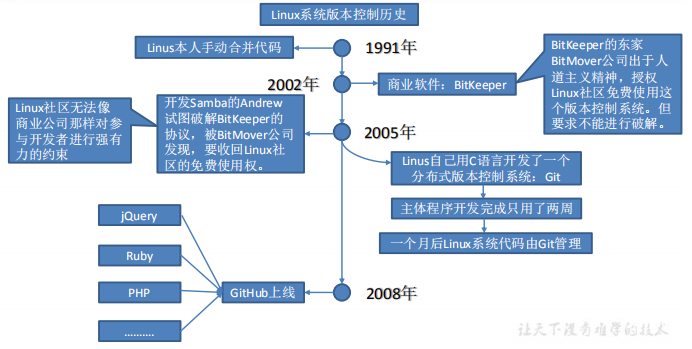
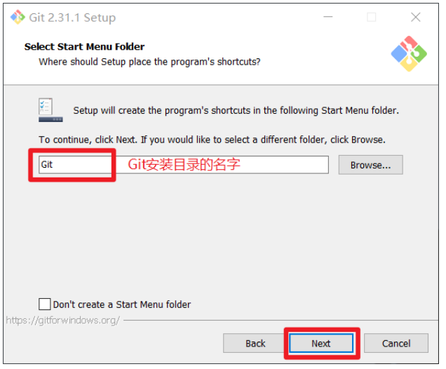
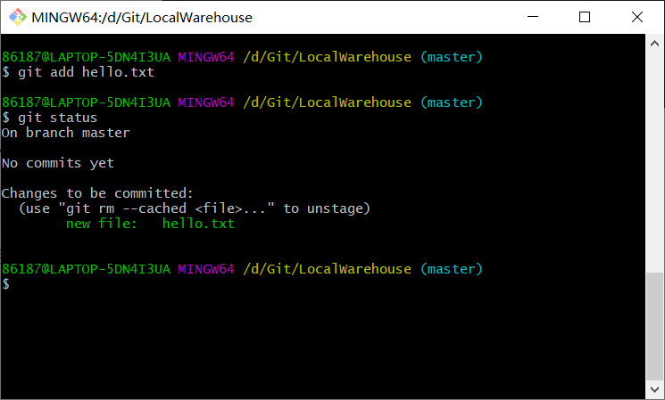

# 1、Git概述

**翻译于Git官网**

> Git 是一个免费的、开源的分布式版本控制系统，可以快速高效地处理从小型到大型的各种项目。
>
> Git 易于学习，占地面积小，性能极快。 它具有廉价的本地库，方便的暂存区域和多个工作流分支等特性。其性能优于 Subversion、CVS、Perforce 和 ClearCase 等版本控制工具。

## 1.1 何为版本控制

版本控制是一种记录文件内容变化，以便将来查阅特定版本修订情况的系统。

版本控制其实最重要的是可以记录文件修改历史记录，从而让用户能够查看历史版本，方便版本切换。


## 1.2 为什么需要版本控制

个人开发过渡到团队协作。

## 1.3 版本控制工具

### 1.3.1 集中式版本控制工具

CVS、SVN(Subversion)、VSS……

集中化的版本控制系统诸如 CVS、SVN 等，都有一个单一的集中管理的服务器，保存所有文件的修订版本，而协同工作的人们都通过客户端连到这台服务器，取出最新的文件或者提交更新。多年以来，这已成为版本控制系统的标准做法。

这种做法带来了许多好处，每个人都可以在一定程度上看到项目中的其他人正在做些什么。而管理员也可以轻松掌控每个开发者的权限，并且管理一个集中化的版本控制系统，要远比在各个客户端上维护本地数据库来得轻松容易。

事分两面，有好有坏。这么做显而易见的缺点是中央服务器的单点故障。如果服务器宕机一小时，那么在这一小时内，谁都无法提交更新，也就无法协同工作。

### 1.3.2 分布式版本控制工具

Git、Mercurial、Bazaar、Darcs……

像 Git 这种分布式版本控制工具，客户端提取的不是最新版本的文件快照，而是把代码仓库完整地镜像下来（本地库）。这样任何一处协同工作用的文件发生故障，事后都可以用其他客户端的本地仓库进行恢复。因为每个客户端的每一次文件提取操作，实际上都是一次对整个文件仓库的完整备份。

分布式的版本控制系统出现之后,解决了集中式版本控制系统的缺陷:

-  服务器断网的情况下也可以进行开发（因为版本控制是在本地进行的）
- 每个客户端保存的也都是整个完整的项目（包含历史记录，更加安全） 

## 1.4 Git简史



## 1.5 工作机制


## 1.6 Git和代码托管中心

代码托管中心是基于网络服务器的远程代码仓库，一般我们简单称为远程库。 

- **局域网**
  - GitLab
- **互联网**
  - GitHub（外网）
  - Gitee 码云（国内网站）

# 2、 Git 安装

官网地址： https://git-scm.com/

查看 GNU 协议，可以直接点击下一步。


选择 Git 安装位置，要求是非中文并且没有空格的目录，然后下一步。


Git 选项配置，推荐默认设置，然后下一步。


Git 安装目录名，不用修改，直接点击下一步。



Git 的默认编辑器，建议使用默认的 Vim 编辑器，然后点击下一步。


默认分支名设置，选择让 Git 决定，分支名默认为 master，下一步。


修改 Git 的环境变量，选第一个，不修改环境变量，只在 Git Bash 里使用 Git。


选择后台客户端连接协议，选默认值 OpenSSL，然后下一步。


配置 Git 文件的行末换行符，Windows 使用 CRLF，Linux 使用 LF，选择第一个自动转换，然后继续下一步。


选择 Git 终端类型，选择默认的 Git Bash 终端，然后继续下一步。


选择 Git pull 合并的模式，选择默认，然后下一步。


选择 Git 的凭据管理器，选择默认的跨平台的凭据管理器，然后下一步。


其他配置，选择默认设置，然后下一步。


实验室功能，技术还不成熟，有已知的 bug，不要勾选，然后点击右下角的 Install按钮，开始安装 Git。


点击 Finsh 按钮，Git 安装成功！


右键任意位置，在右键菜单里选择 Git Bash Here 即可打开 Git Bash 命令行终端。

在 Git Bash 终端里输入 git --version 查看 git 版本，如图所示，说明 Git 安装成功。


# 3、Git 常用命令

| 命令名称                       | 作用                |
| ------------------------------ | ------------------- |
| git config --global user.name  | 用户名 设置用户签名 |
| git config --global user.email | 邮箱 设置用户签名   |
| git init                       | 初始化本地库        |
| git status                     | 查看本地库状态      |
| git add                        | 文件名 添加到暂存区 |
| git commit -m "日志信息"       | 文件名 提交到本地库 |
| git reflog                     | 查看历史记录        |
| git reset --hard               | 版本号 版本穿梭     |

## 3.1 设置用户签名

```
git config --global user.name 用户名
git config --global user.email 邮箱
```

**说明：**签名的作用是区分不同操作者身份。用户的签名信息在每一个版本的提交信息中能够看到，以此确认本次提交是谁做的。Git 首次安装必须设置一下用户签名，否则无法提交代码。

**注意：**这里设置用户签名和将来登录 GitHub（或其他代码托管中心）的账号没有任何关系。

## 3.2 初始化本地库

```
git init
```

在想要作为工作区的目录下直接右击打开Git Bash输入 git init


## 3.3 查看本地状态库

```
git status
```

首次查看没有任何文件


新增文件hello.txt，再次查看（检测到未追踪的文件）


## 3.4 添加到暂存区

```
git add 文件名
```

添加后再次查看状态（检测到暂存区有新文件）



## 3.5 提交本地库

```
git commit -m "日志信息" 文件名
```

提交后查看状态（没有文件需要提交）


## 3.6 修改文件

修改文件后再次查看状态（检测到工作区有文件被修改），须再次添加到暂存区


## 3.7 查看历史版本

```shell
git reflog 查看版本信息
git log 查看版本详细信息
```


## 3.8 版本穿梭

```
git reset --hard 版本号
```

穿梭回原来的版本，查看发现工作区的hello.txt已经变回原来的了


**Git 切换版本，底层其实是移动的 HEAD 指针，HEAD指针指向当前操作的分支（master），master实际上也是一个指针，指向不同的版本号**

# 4、Git分支操作


## 4.1 什么是分支

在版本控制过程中，同时推进多个任务，为每个任务，我们就可以创建每个任务的单独分支。使用分支意味着程序员可以把自己的工作从开发主线上分离开来，开发自己分支的时候，不会影响主线分支的运行。对于初学者而言，分支可以简单理解为副本，一个分支就是一个单独的副本。（分支底层其实也是指针的引用）


## 4.2 分支的好处

同时并行推进多个功能开发，提高开发效率。

各个分支在开发过程中，如果某一个分支开发失败，不会对其他分支有任何影响。失败的分支删除重新开始即可。

## 4.3 分支的操作

| 命令名称            | **作用**                     |
| ------------------- | ---------------------------- |
| git branch 分支名   | 创建分支                     |
| git branch -v       | 查看分支                     |
| git checkout 分支名 | 切换分支                     |
| git merge 分支名    | 把指定的分支合并到当前分支上 |

### 4.3.1 新建 切换 查看分支

创建分支hot-fix，切换分支，查看分支


在hot-fix分支上修改文件然后查看状态等等一系列操作跟之前一样


### 4.3.2 合并分支

```
git merge 分支名
```

当原分支没有改变时，正常合并没有问题（**合并时要回到原分支合并**）


### 4.3.3 产生冲突及解决

冲突产生的表现：后面状态为 MERGING


**冲突产生的原因：**合并分支时，两个分支在**同一个文件的同一个位置**有两套完全不同的修改。Git 无法替我们决定使用哪一个。必须**人为决定**新代码内容。查看状态（检测到有文件有两处修改）

# 5、GitHub

GitHub 网址：https://github.com/

Ps:全球最大同性交友网站，技术宅男的天堂，新世界的大门，你还在等什么?

**远程仓库操作**

| 命令名称                | **作用**                                                     |
| ----------------------- | ------------------------------------------------------------ |
| git remote -v           | 查看当前所有远程地址别名                                     |
| git remote add 别名     | 给远程地址起别名                                             |
| git push 别名 分支      | 推送本地分支上的内容到远程仓库                               |
| git clone 远程地址      | 将远程仓库的内容克隆到本地                                   |
| git pull 远程库地址别名 | 远程分支名 将远程仓库对于分支最新内容拉下来后与当前本地分支直接合并 |

## 5.1 创建远程仓库别名及查看别名

```
git remote -v 查看当前所有远程地址别名
git remote add 别名 远程地址
```


## 5.2 推送本地分支到远程仓库

```
git push 别名 分支
```


## 5.3 克隆远程仓库到本地

```
git clone -b 分支名 远程地址		（默认是当前分支）
```


**注意：**clone 会做如下操作。

1、拉取代码。2、初始化本地仓库。3、为远程仓库创建别名（默认别名为origin）

## 5.4 团队合作

**1）选择邀请合作者**


**2）填入要合作的人**


**3）复制地址发送给该用户**https://github.com/atguiguyueyue/git-shTest/invitations


**4）收到邀请的用户在自己的账号地址栏中打开该链接接收即可**


**5）然后被邀请的人就可以在自己的远程仓库中看到别人的远程仓库**

## 5.5 拉取远程库内容

```
git pull 远程库地址别名 远程分支名
```

```
--将远程仓库对于分支最新内容拉下来后与当前本地分支直接合并
Layne@LAPTOP-Layne MINGW64 /d/Git-Space/SH0720 (master)
$ git pull ori master
remote: Enumerating objects: 5, done.
remote: Counting objects: 100% (5/5), done.
remote: Compressing objects: 100% (1/1), done.
remote: Total 3 (delta 1), reused 3 (delta 1), pack-reused 0
Unpacking objects: 100% (3/3), done.
From https://github.com/atguiguyueyue/git-shTest
* branch master -> FETCH_HEAD
7cb4d02..5dabe6b master -> ori/master
Updating 7cb4d02..5dabe6b
Fast-forward
hello.txt | 2 +-
1 file changed, 1 insertion(+), 1 deletion(-)
Layne@LAPTOP-Layne MINGW64 /d/Git-Space/SH0720 (master)
$ cat hello.txt
hello git! hello atguigu! 2222222222222
hello git! hello atguigu! 33333333333333
hello git! hello atguigu!
hello git! hello atguigu!
hello git! hello atguigu! 我是最帅的，比岳不群还帅
hello git! hello atguigu!
hello git! hello atguigu!
hello git! hello atguigu!
hello git! hello atguigu!
hello git! hello atguigu!
hello git! hello atguigu!
hello git! hello atguigu!
hello git! hello atguigu!
hello git! hello atguigu!
hello git! hello atguigu! master test
hello git! hello atguigu! hot-fix test
```

## 5.6 跨团队协作

**1）将远程仓库的地址复制发给邀请跨团队协作的人**


**2）打开链接，然后点击 Fork 将项目叉到自己的本地仓库。**


**3）叉成功后可以看到当前仓库的信息**


**4）修改后可以pull request进行提交**


**5）检查没问题进行合并**


## 5.7 ssh免密登录

我们可以看到远程仓库中还有一个 SSH 的地址，因此我们也可以使用 SSH 进行访问。

进入用户家目录，看有没有.ssh文件，有的话就删掉再进行以下操作


复制 id_rsa.pub 文件内容，登录 GitHub，点击用户头像→Settings→SSH and GPG keys

接下来再往远程仓库 push 东西的时候使用 SSH 连接就不需要登录了。

# 6、Gitee操作基本跟GitHub一样

# 7、IDEA集成Git

## 7.1 配置Git忽略文件

在集成Git之前，我们要把与项目的实际功能无关，不参与服务器上部署运行的文件给忽略掉。把它们忽略掉能够屏蔽 IDE 工具之间的差异，比如：Maven下的target目录、.idea、.iml等目录和文件

**1）**创建忽略规则文件 xxxx.ignore（前缀名随便起，建议是 git.ignore），这个文件的存放位置原则上在哪里都可以，为了便于让~/.gitconfig 文件引用，建议也放在用户家目录下

**git.ignore 文件模版内容如下：**

```
# Compiled class file
*.class
\# Log file
*.log
\# BlueJ files
*.ctxt
\# Mobile Tools for Java (J2ME)
.mtj.tmp/
\# Package Files #
*.jar
*.war
*.nar
*.ear
*.zip
*.tar.gz
*.rar
\# virtual machine crash logs, see 
http://www.java.com/en/download/help/error_hotspot.xml
hs_err_pid*
.classpath
.project
.settings
target
.idea
*.iml
```

**2）**在.gitconfig 文件中引用忽略配置文件（此文件在 Windows 的家目录中）

```
[user]
	name = Layne
	email = Layne@atguigu.com
[core]
	excludesfile = C:/Users/asus/git.ignore
注意：这里要使用“正斜线（/）”，不要使用“反斜线（\）”
```

## 7.2 定位Git程序


## 7.3 初始化本地库


## 7.4 添加暂存区


## 7.5 提交本地库


## 7.6 版本查看及切换

在 IDEA 的左下角，点击 Version Control，然后点击 Log 查看版本，右击对应版本可进行切换


## 7.7 分支的创建及切换


## 7.8 分支合并及合并冲突的解决


如果代码没有冲突，分支直接合并成功，分支合并成功以后，代码自动提交，无需手动提交本地库。


日志信息


