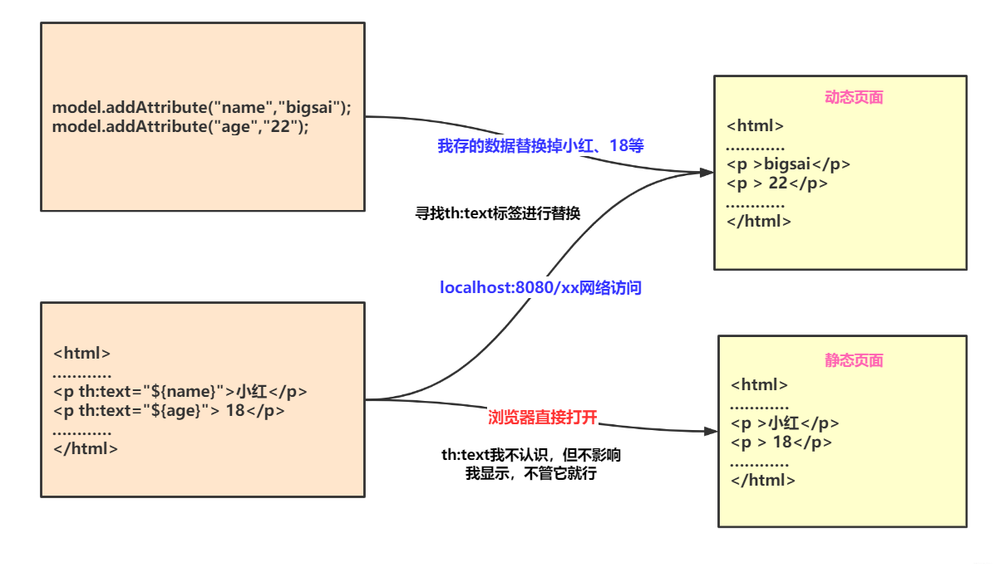
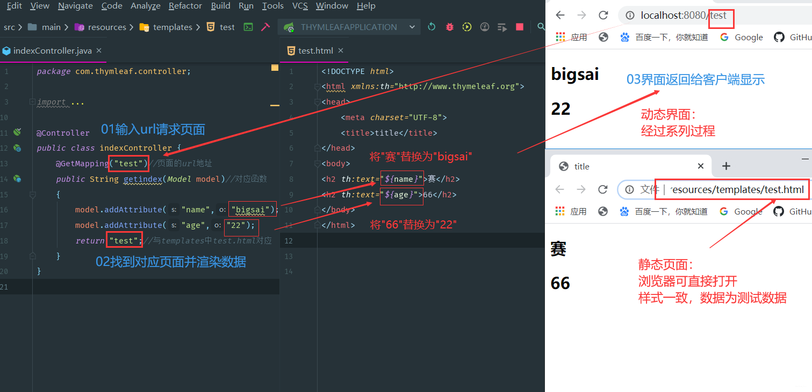
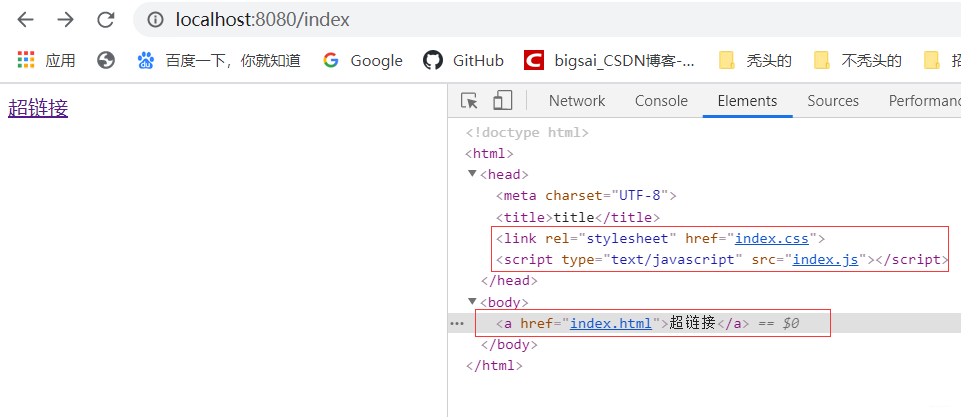

# 什么是Thymeleaf


**什么是Thymeleaf？**

- Thymeleaf 官网是这么解释的：Thymeleaf is a modern server-side Java template engine for both web and standalone environments.
- 译过来就是：Thymeleaf是适用于Web和独立环境的现代服务器端Java模板引擎

## 模板引擎介绍
**什么是模板引擎？**

- 模板引擎（这里特指用于Web开发的模板引擎）是为了使用户界面与业务数据（内容）分离而产生的，它可以生成特定格式的文档，用于网站的模板引擎就会生成一个标准的html文档。从字面上理解模板引擎，最重要的就是模板二字，这个意思就是做好一个模板后套入对应位置的数据，最终以html的格式展示出来，这就是模板引擎的作用。
- 对于模板引擎的理解，可以这样形象的做一个类比：**开会！** 相信你在上学初高中时候每次开会都要提前布置场地、拿小板凳、收拾场地。而你上了大学之后每次开会再也不去大操场了,每次开会都去学校的大会议室，桌子板凳音响主席台齐全，来个人即可，还可复用……。模板引擎的功能就类似我们的会议室开会一样开箱即用，将模板设计好之后直接填充数据即可而不需要重新设计整个页面。提高页面、代码的复用性。

不仅如此，在Java中模板引擎还有很多，模板引擎是动态网页发展进步的产物，在最初并且流传度最广的jsp它就是一个模板引擎。jsp是官方标准的模板，但是由于jsp的缺点比较多也挺严重的，所以很多人弃用jsp选用第三方的模板引擎，市面上开源的第三方的模板引擎也比较多，有<u>Thymeleaf、FreeMaker、Velocity</u>等模板引擎受众较广。

- 所以模板引擎在web领域的主要作用：让网站实现界面和数据分离，这样大大提高了开发效率，让代码重用更加容易。

## Thymeleaf介绍

从官方的介绍来看，Thymeleaf的目标很明确：

- Thymeleaf的主要目标是为您的开发工作流程带来优雅自然的模板-HTML可以在浏览器中正确显示，也可以作为静态原型工作，从而可以在开发团队中加强协作。
- Thymeleaf拥有适用于Spring Framework的模块，与您喜欢的工具的大量集成以及插入您自己的功能的能力，对于现代HTML5 JVM Web开发而言，Thymeleaf是理想的选择——尽管它还有很多工作要做。

并且随着市场使用的验证Thymeleaf也达到的它的目标和大家对他的期望，在实际开发有着广泛的应用。Thymeleaf作为被Springboot官方推荐的模板引擎，一定有很多过人和不寻同之处：

- **动静分离**： Thymeleaf选用html作为模板页，这是任何一款其他模板引擎做不到的！Thymeleaf使用html通过一些特定标签语法代表其含义，但并未破坏html结构，即使无网络、不通过后端渲染也能在浏览器成功打开，大大方便界面的测试和修改。
- **开箱即用**： Thymeleaf提供标准和Spring标准两种方言，可以直接套用模板实现JSTL、 OGNL表达式效果，避免每天套模板、改JSTL、改标签的困扰。同时开发人员也可以扩展和创建自定义的方言。
- Springboot官方大力推荐和支持，Springboot官方做了很多默认配置，开发者只需编写对应html即可，大大减轻了上手难度和配置复杂度。

此外，Thymeleaf在曾经还有一次大的版本升级，从Thymeleaf2.0—>Thymeleaf3.0。在Thymeleaf2.0时代，Thymeleaf基于xml实现，虽然它带来了许多出色强大的功能，但有时会降低性能效率，那个时候Thymeleaf的性能真的太差而被很多人所吐槽带来了很不好的印象。

但是Thymeleaf3.0对比Thymeleaf2.0有着翻天覆地的变化，几乎是全部重写了整个Thymeleaf引擎，在性能、效率上相比Thymeleaf2有了很大改善，能够满足更多项目的需求，且Thymeleaf3.0不再基于xml所以在html环境下有着更宽松的编程环境。

此外，Thymelaf3.0在方言、独立于Java Servlet API、重构核心API、片段表达等方面有着巨大提升和改善，具体可以参看Thymeleaf3十分钟参考指南。

# 学习Thymeleaf必知的知识点
Thymeleaf模板的运行离不开web的环境，所以你需要对相关知识学习理解才能更好的有助于你对Thymeleaf的学习和认知。

## Springboot
我们使用Thymeleaf大多情况都是基于Springboot平台的，并且Thymeleaf的发展推广也离不开Springboot官方得支持，且本文的实战部分也是基于Springboot平台。

而Spring Boot是由Pivotal团队提供的全新框架，其设计目的是用来简化新Spring应用的初始搭建以及开发过程。该框架使用了特定的方式来进行配置，从而使开发人员不再需要定义样板化的配置。通过这种方式，Spring Boot致力于在蓬勃发展的快速应用开发领域(rapid application development)成为领导者。

简而言之，Springboot是当前web开发主流，且其简化了Spring的配置让开发者能够更容易上手Web项目的开发。且Thymeleaf能够快速整合入Springboot，使用方便快捷。

## MVC介绍
我们使用的Thymeleaf模板引擎在整个web项目中起到的作用为视图展示(view)，谈到视图就不得不提起模型(model)以及控制器(view),其三者在web项目中分工和职责不同，但又相互有联系。三者组成当今web项目较为流行的MVC架构。

MVC全名是Model View Controller，是模型(model)－视图(view)－控制器(controller)的缩写，其中：

- Model（模型）表示应用程序核心（用来存储数据供视图层渲染）。
- View（视图）显示数据，而本篇使用的就是Thymeleaf作为视图。
- Controller（控制器）处理输入请求，将模型和视图分离。

使用MVC设计模式程序有很多优点，比如降低程序耦合、增加代码的复用性、降低开发程序和接口的成本，并且通过这样分层结构在部署维护能够提供更大的便捷性。

在Java web体系最流行的MVC框架无疑就是Springmvc框架了，在项目中经常配合模板引擎使用或者提供Restful接口。在下面案例Thymeleaf同样使用Springmvc作为MVC框架进行控制。

## 动静分离
你可能还是不明白什么才是真正的动静分离，其实这个主要是由于Thymeleaf模板基于html，后缀也是.html，所以这样就会产生一些有趣的灵魂。

对于传统jsp或者其他模板来说，没有一个模板引擎的后缀为.html，就拿jsp来说jsp的后缀为.jsp,它的本质就是将一个html文件修改后缀为.jsp，然后在这个文件中增加自己的语法、标签然后执行时候通过后台处理这个文件最终返回一个html页面。

浏览器无法直接识别.jsp文件，需要借助网络(服务端)才能进行访问；而Thymeleaf用html做模板可以直接在浏览器中打开。开发者充分考虑html页面特性，将Thymeleaf的语法通过html的标签属性来定义完成，这些标签属性不会影响html页面的完整性和显示。如果通过后台服务端访问页面服务端会寻找这些标签将服务端对应的数据替换到相应位置实现动态页面！大体区别可以参照下图：



上图的意思就是如果直接打开这个html那么浏览器会对th等标签忽视而显示原始的内容。如果通过服务端访问那么服务端将先寻找th标签将服务端储存的数据替换到对应位置。具体效果可以参照下图,下图即为一个动静结合的实例。

- 右上角为动态页面通过服务端访问，数据显示为服务端提供的数据，样式依然为html的样式
- 右下角为静态页面可通过浏览器直接打开，数据为初始的数据



动态页面每次修改打开都需要重新启动程序、输入链接，这个过程其实是相对漫长的。如果界面设计人员用这种方式进行页面设计时间成本高并且很麻烦，可通过静态页面设计样式，设计完成通过服务端访问即可达成目标UI的界面和应用，达到动静分离的效果。这个特点和优势是所有模板引擎中Thymeleaf所独有的！


# Thymeleaf语法详解

## 配置

虽然Springboot官方对Thymeleaf做了很多默认配置，但咱们引入Thymeleaf的jar包依赖后很可能根据自己特定需求进行更细化的配置，例如页面缓存、字体格式设置等等。

Springboot官方提供的配置内容有以下：

```properties
# THYMELEAF (ThymeleafAutoConfiguration)
spring.thymeleaf.cache=true # Whether to enable template caching.
spring.thymeleaf.check-template=true # Whether to check that the template exists before rendering it.
spring.thymeleaf.check-template-location=true # Whether to check that the templates location exists.
spring.thymeleaf.enabled=true # Whether to enable Thymeleaf view resolution for Web frameworks.
spring.thymeleaf.enable-spring-el-compiler=false # Enable the SpringEL compiler in SpringEL expressions.
spring.thymeleaf.encoding=UTF-8 # Template files encoding.
spring.thymeleaf.excluded-view-names= # Comma-separated list of view names (patterns allowed) that should be excluded from resolution.
spring.thymeleaf.mode=HTML # Template mode to be applied to templates. See also Thymeleaf's TemplateMode enum.
spring.thymeleaf.prefix=classpath:/templates/ # Prefix that gets prepended to view names when building a URL.
spring.thymeleaf.reactive.chunked-mode-view-names= # Comma-separated list of view names (patterns allowed) that should be the only ones executed in CHUNKED mode when a max chunk size is set.
spring.thymeleaf.reactive.full-mode-view-names= # Comma-separated list of view names (patterns allowed) that should be executed in FULL mode even if a max chunk size is set.
spring.thymeleaf.reactive.max-chunk-size=0 # Maximum size of data buffers used for writing to the response, in bytes.
spring.thymeleaf.reactive.media-types= # Media types supported by the view technology.
spring.thymeleaf.servlet.content-type=text/html # Content-Type value written to HTTP responses.
spring.thymeleaf.suffix=.html # Suffix that gets appended to view names when building a URL.
spring.thymeleaf.template-resolver-order= # Order of the template resolver in the chain.
spring.thymeleaf.view-names= # Comma-separated list of view names (patterns allowed) that can be resolved.
```

上面的配置有些我们可能不常使用，因为Springboot官方做了默认配置大部分能够满足我们的使用需求，但如果你的项目有特殊需求也需要妥善使用这些配置。

比如spring.thymeleaf.cache=false是否允许页面缓存的配置，我们在开发时候要确保页面是最新的所以需要禁用缓存；而在上线运营时可能页面不常改动为了减少服务端压力以及提升客户端响应速度会允许页面缓存的使用。

再比如在开发虽然我们大部分使用UTF-8多一些，我们可以使用spring.thymeleaf.encoding=UTF-8来确定页面的编码，但如果你的项目是GBK编码就需要将它改成GBK。

另外Springboot默认模板引擎文件是放在templates目录下：spring.thymeleaf.prefix=classpath:/templates/,如果你有需求将模板引擎也可修改配置，将templates改为自己需要的目录。同理其他的配置如果需要自定义化也可参照上面配置进行修改。

## 常用标签

咱们上面知道Thymeleaf通过特殊的标签来寻找属于Thymeleaf的部分，并渲染该部分内容，而除了上面展示过的th:text之外还有很多常用标签，并且Thymeleaf也主要通过标签来识别替换对应位置内容，Thymeleaf标签有很多很多，功能也很丰富，这里列举一些比较常用的标签如下：

|   标签    |        作用        |                             示例                             |
| :-------: | :----------------: | :----------------------------------------------------------: |
|   th:id   |       替换id       |                `<input th:id="${user.id}"/>`                 |
|  th:text  |      文本替换      |             `<p text:="${user.name}">bigsai</p>`             |
| th:utext  | 支持html的文本替换 |           `<p utext:="${htmlcontent}">content</p>`           |
| th:object |      替换对象      |              `<div th:object="${user}"></div>`               |
| th:value  |       替换值       |              `<input th:value="${user.name}" >`              |
|  th:each  |        迭代        |              `<tr th:each="student:${user}" >`               |
|  th:href  |     替换超链接     |           `<a th:href="@{index.html}">超链接</a>`            |
|  th:src   |      替换资源      | `<script type="text/javascript" th:src="@{index.js}"></script>` |

## 链接表达式: @{…}

上面我们已经学习到Thymeleaf是一个基于html的模板引擎，但是我们还是需要加入特定标签来声明和使用Thymeleaf的语法。我们需要在Thymeleaf的头部加Thymeleaf标识：

```html
<html xmlns:th="http://www.thymeleaf.org">
```

在Thymeleaf 中，如果想引入链接比如link，href，src，需要使用@{资源地址}引入资源。其中资源地址可以static目录下的静态资源，也可以是互联网中的绝对资源。

```html
 <link rel="stylesheet" th:href="@{index.css}">
```

引入JavaScript：

```html
 <script type="text/javascript" th:src="@{index.js}"></script>
```

超链接：

```html
<a th:href="@{index.html}">超链接</a>
```

这样启动程序访问页面，页面的内容就自动修改成标准html语法格式的内容：



## 变量表达式: ${…}

在Thymeleaf中可以通过${…}进行取值，这点和ONGL表达式语法一致。
例如咱们创建这么一个对象：

```java
public class user {

    private String name;
    private  int age;
    private  String detail;

    public user(String name, int age, String detail) {
        this.name = name;
        this.age = age;
        this.detail = detail;
    }
    public String getName() {
        return name;
    }
    public void setName(String name) {
        this.name = name;
    }
    public int getAge() {
        return age;
    }
    public void setAge(int age) {
        this.age = age;
    }
    public String getDetail() {
        return detail;
    }
    public void setDetail(String detail) {
        this.detail = detail;
    }
}
```

先在Model中添一些数据：

```java
 @GetMapping("index")//页面的url地址
 public String getindex(Model model)//对应函数
  {
     user user1=new user("bigsai",22,"一个幽默且热爱java的社会青年");
     List<String>userList=new ArrayList<>();
     userList.add("zhang san 66");
     userList.add("li si 66");
     userList.add("wang wu 66");
     Map<String ,String>map=new HashMap<>();
     map.put("place","博学谷");
     map.put("feeling","very well");
     //数据添加到model中
     model.addAttribute("name","bigsai");//普通字符串
     model.addAttribute("user",user1);//储存javabean
     model.addAttribute("userlist",userList);//储存List
     model.addAttribute("map",map);//储存Map
     return "index";//与templates中index.html对应
  }
```

**取普通字符串：**
如果在controller中的Model直接存储某字符串，我们可以直接`${对象名}`进行取值。完整代码如下：

```html
<h2>普通字符串</h2>
<table border="0">
    <tr>
        <td th:text="'我的名字是：'+${name}"></td>
    </tr>
</table>
```

取JavaBean对象:
取JavaBean对象也很容易，因为JavaBean自身有一些其他属性，所以咱们就可以使用${对象名.对象属性}或者${对象名['对象属性']}来取值，这和JavaScript语法是不是很相似呢！除此之外，如果该JavaBean如果写了get方法，咱们也可以通过get方法取值例如${对象.get方法名}完整代码如下：

```html
<h2>JavaBean对象</h2>
<table bgcolor="#ffe4c4" border="1">
    <tr>
        <td>介绍</td>
        <td th:text="${user.name}"></td>
    </tr>
    <tr>
        <td>年龄</td>
        <td th:text="${user['age']}"></td>
    </tr>
    <tr>
        <td>介绍</td>
        <td th:text="${user.getDetail()}"></td>
    </tr>
</table>
```

取List集合(each):
因为List集合是个有序列表，里面内容可能不止一个，你需要遍历List对其中对象取值，而遍历需要用到标签：th:each,具体使用为`<tr th:each="item:${userlist}">`,其中item就相当于遍历每一次的对象名，在下面的作用域可以直接使用，而userlist就是你在Model中储存的List的名称。完整的代码为：

```html
<h2>List取值</h2>
<table bgcolor="#ffe4c4" border="1">
    <tr th:each="item:${userlist}">
        <td th:text="${item}"></td>
    </tr>
</table>
```

直接取Map:
很多时候我们不存JavaBean而是将一些值放入Map中，再将Map存在Model中，我们就需要对Map取值，对于Map取值你可以`${Map名['key']}`来进行取值。也可以通过`${Map名.key}`取值，当然你也可以使用`${map.get('key')}`(java语法)来取值，完整代码如下：

```html
<h2>Map取值</h2>
<table bgcolor="#8fbc8f" border="1">
    <tr>
        <td>place:</td>
        <td th:text="${map.get('place')}"></td>
    </tr>
    <tr>
        <td>feeling:</td>
        <td th:text="${map['feeling']}"></td>
    </tr>
</table>
```

**遍历Map：**
如果说你想遍历Map获取它的key和value那也是可以的，这里就要使用和List相似的遍历方法，使用`th:each="item:${Map名}"`进行遍历，在下面只需使用`item.key`和`item.value`即可获得值。完整代码如下：

```html
<h2>Map遍历</h2>
<table bgcolor="#ffe4c4" border="1">
    <tr th:each="item:${map}">
        <td th:text="${item.key}"></td>
        <td th:text="${item.value}"></td>
    </tr>
</table>

```

## 选择变量表达式: *{…}

变量表达式不仅可以写成${…}，而且还可以写成*{…}。

但是，有一个重要的区别：星号语法对选定对象而不是整个上下文评估表达式。也就是说，只要没有选定的对象，美元(${…})和星号(*{...})的语法就完全一样。

什么是选定对象？使用th:object属性的表达式的结果。就可以选定对象，具体实例如下：

```html
<div th:object="${user}">
    <p>Name: <span th:text="*{name}">赛</span>.</p>
    <p>Age: <span th:text="*{age}">18</span>.</p>
    <p>Detail: <span th:text="*{detail}">好好学习</span>.</p>
</div>
```

当然`*{…}`也可和`${…}`混用。上面的代码如果不使用选定对象，完全等价于：

```html
<div >
    <p>Name: <span th:text="*{user.name}">赛</span>.</p>
    <p>Age: <span th:text="${user.age}">18</span>.</p>
    <p>Detail: <span th:text="${user.detail}">好好学习</span>.</p>
</div>
```

## 消息表达: #{…}

文本外部化是从模板文件中提取模板代码的片段，以便可以将它们保存在单独的文件(通常是.properties文件)中,文本的外部化片段通常称为“消息”。通俗易懂的来说#{…}语法就是用来读取配置文件中数据的。在Thymeleaf你可以使用#{...}语法获取消息，具体实例代码如下：
首先在templates目录下建立home.properties中写入以下内容：

```properties
bigsai.nane=bigsai
bigsai.age=22
province=Jiang Su
```

在`application.properties`中加入以下内容：

```properties
spring.messages.basename=templates/home
```

这样我们就可以在Thymeleaf中读取配置的文件了，完整代码如下：

```html
<h2>消息表达</h2>
<table bgcolor="#ffe4c4" border="1">
    <tr>
    <td>name</td>
    <td th:text="#{bigsai.name}"></td>
    </tr>
    <tr>
    <td>年龄</td>
    <td th:text="#{bigsai.age}"></td>
    </tr>
    <tr>
    <td>province</td>
    <td th:text="#{province}"></td>
    </tr>
</table>
```

