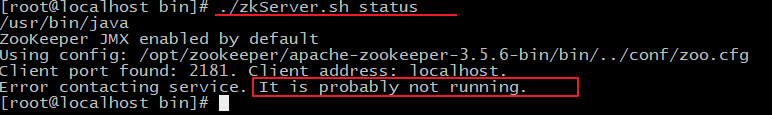
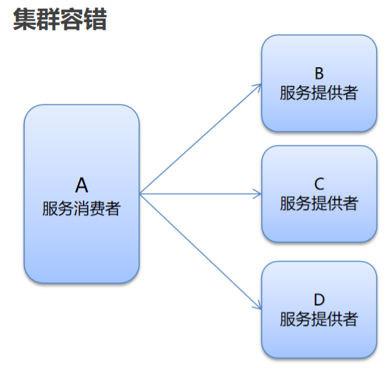

# 分布式系统中的相关概念

## 1、大型互联网项目架构目标

**传统项目和互联网项目**


**互联网项目特点：**

- 用户多
- 流量大，并发高
- 海量数据
- 易受攻击
- 功能繁琐
- 变更快

### 衡量网站的性能指标

> 响应时间：指执行一个请求从开始到最后收到响应数据所花费的总体时间。
>
> 并发数：指系统同时能处理的请求数量。
>
> - 并发连接数：指的是客户端向服务器发起请求，并建立了TCP连接。每秒钟服务器连接的总TCP数量
> - 请求数：也称为QPS(Query Per Second) 指每秒多少请求.
> - 并发用户数：单位时间内有多少用户
>
> 吞吐量：指单位时间内系统能处理的请求数量。
>
> - QPS：Query Per Second 每秒查询数。 
> - TPS：Transactions Per Second 每秒事务数。 
> - 一个事务是指一个客户机向服务器发送请求然后服务器做出反应的过程。客户机在发送请求时开始计时，收到服务器响应后结束计时，以此来计算使用的时间和完成的事务个数。
> - 一个页面的一次访问，只会形成一个TPS；但一次页面请求，可能产生多次对服务器的请求，就会有多个QPS（**QPS >= 并发连接数 >= TPS**）
>
> 高性能：提供快速的访问体验。
>
> 高可用：网站服务一直可以正常访问。
>
> 可伸缩：通过硬件增加/减少，提高/降低处理能力。
>
> 高可扩展：系统间耦合低，方便的通过新增/移除方式，增加/减少新的功能/模块。 
>
> 安全性：提供网站安全访问和数据加密，安全存储等策略。
>
> 敏捷性：随需应变，快速响应。


## 2、集群和分布式

- 集群：很多“人”一起 ，干一样的事。（一个业务模块，部署在多台服务器上）
- 分布式：很多“人”一起，干不一样的事。这些不一样的事，合起来是一件大事。（一个大的业务系统，拆分为小的业务模块，分别部署在不同的机器上）


**发展模拟图**


## 3、架构演进


# Dubbo 概述

## 1、Dubbo概念

- Dubbo是阿里巴巴公司开源的一个高性能、轻量级的 Java RPC 框架。
- 致力于提供高性能和透明化的 RPC 远程服务调用方案，以及 SOA 服务治理方案。
- 官网：http://dubbo.apache.org

## 2、Dubbo框架


**节点角色说明：**

- Provider：暴露服务的服务提供方
- Container：服务运行容器
- Consumer：调用远程服务的服务消费方
- Registry：服务注册与发现的注册中心
- Monitor：统计服务的调用次数和调用时间的监控中心

**实际上就是将每个服务（service、controller等）模块化（在注册中心进行注册），使其单独运行，然后其他模块想调用另一个模块就通过注册中心进行寻找调用**

# Dubbo 快速入门

## 1、Zookeeper安装

### 1.1 下载安装

**1、环境准备**

ZooKeeper服务器是用Java创建的，它运行在JVM之上。需要安装JDK 7或更高版本。

**2、上传**

将下载的ZooKeeper放到/opt/ZooKeeper目录下

```shell
#上传zookeeper alt+p
put f:/setup/apache-zookeeper-3.5.6-bin.tar.gz
#打开 opt目录
cd /opt
#创建zooKeeper目录
mkdir  zooKeeper
#将zookeeper安装包移动到 /opt/zooKeeper
mv apache-zookeeper-3.5.6-bin.tar.gz /opt/zookeeper/
```

**3、解压**

将tar包解压到/opt/zookeeper目录下

```shell
tar -zxvf apache-ZooKeeper-3.5.6-bin.tar.gz 
```

### 1.2 配置启动

**1、配置zoo.cfg**

进入到conf目录拷贝一个zoo_sample.cfg并完成配置

```shell
#进入到conf目录
cd /opt/zooKeeper/apache-zooKeeper-3.5.6-bin/conf/
#拷贝
cp  zoo_sample.cfg  zoo.cfg
```


修改zoo.cfg

```shell
#打开目录
cd /opt/zooKeeper/
#创建zooKeeper存储目录
mkdir  zkdata
#修改zoo.cfg
vim /opt/zooKeeper/apache-zooKeeper-3.5.6-bin/conf/zoo.cfg
```

 

修改存储目录：dataDir=/opt/zookeeper/zkdata

**2、启动ZooKeeper**

```shell
cd /opt/zooKeeper/apache-zooKeeper-3.5.6-bin/bin/
#启动
 ./zkServer.sh  start
```

 

看到上图表示ZooKeeper成功启动

**3、查看ZooKeeper状态**

```shell
./zkServer.sh status
```

zookeeper启动成功。standalone代表zk没有搭建集群，现在是单节点

 

zookeeper没有启动

 

## 2、Spring和SpringMVC整合

**实现步骤：**

1. 创建服务提供者Provider模块
2. 创建服务消费者Consumer模块
3. 在服务提供者模块编写 UserServiceImpl 提供服务
4. 在服务消费者中的 UserController 远程调用UserServiceImpl 提供的服务
5. 分别启动两个服务，测试


这里写两个模块，分别是service模块和web模块，将来web模块依赖于service模块，通过maven的tomcat插件直接启动

**Dubbo以及Zookeeper的pom文件**

```xml
<?xml version="1.0" encoding="UTF-8"?>
<project xmlns="http://maven.apache.org/POM/4.0.0"
         xmlns:xsi="http://www.w3.org/2001/XMLSchema-instance"
         xsi:schemaLocation="http://maven.apache.org/POM/4.0.0 http://maven.apache.org/xsd/maven-4.0.0.xsd">
    <modelVersion>4.0.0</modelVersion>

    <groupId>com.eagle</groupId>
    <artifactId>dubbo-web</artifactId>
    <version>1.0-SNAPSHOT</version>
    <packaging>war</packaging>

    <properties>
        <spring.version>5.1.9.RELEASE</spring.version>
        <dubbo.version>2.7.4.1</dubbo.version>
        <zookeeper.version>4.0.0</zookeeper.version>

    </properties>

    <dependencies>
        <!-- servlet3.0规范的坐标 -->
        <dependency>
            <groupId>javax.servlet</groupId>
            <artifactId>javax.servlet-api</artifactId>
            <version>3.1.0</version>
            <scope>provided</scope>
        </dependency>
        <!--spring的坐标-->
        <dependency>
            <groupId>org.springframework</groupId>
            <artifactId>spring-context</artifactId>
            <version>${spring.version}</version>
        </dependency>
        <!--springmvc的坐标-->
        <dependency>
            <groupId>org.springframework</groupId>
            <artifactId>spring-webmvc</artifactId>
            <version>${spring.version}</version>
        </dependency>
     
        <!--日志-->
        <dependency>
            <groupId>org.slf4j</groupId>
            <artifactId>slf4j-api</artifactId>
            <version>1.7.21</version>
        </dependency>
        <dependency>
            <groupId>org.slf4j</groupId>
            <artifactId>slf4j-log4j12</artifactId>
            <version>1.7.21</version>
        </dependency>

        <!--Dubbo的起步依赖，版本2.7之后统一为rg.apache.dubb -->
        <dependency>
            <groupId>org.apache.dubbo</groupId>
            <artifactId>dubbo</artifactId>
            <version>${dubbo.version}</version>
        </dependency>
        <!--ZooKeeper客户端实现 -->
        <dependency>
            <groupId>org.apache.curator</groupId>
            <artifactId>curator-framework</artifactId>
            <version>${zookeeper.version}</version>
        </dependency>
        <!--ZooKeeper客户端实现 -->
        <dependency>
            <groupId>org.apache.curator</groupId>
            <artifactId>curator-recipes</artifactId>
            <version>${zookeeper.version}</version>
        </dependency>

        <!--公共接口模块-->
        <dependency>
            <groupId>com.eagle</groupId>
            <artifactId>dubbo-interface</artifactId>
            <version>1.0-SNAPSHOT</version>
        </dependency>

    </dependencies>

    <build>
        <plugins>
            <!--tomcat插件-->
            <plugin>
                <groupId>org.apache.tomcat.maven</groupId>
                <artifactId>tomcat7-maven-plugin</artifactId>
                <version>2.1</version>
                <configuration>
                    <port>8000</port>
                    <path>/</path>
                </configuration>
            </plugin>
        </plugins>
    </build>

</project>
```

Service模块然后是Spring配置文件的编写

web模块需要加入一个webapp目录，里面有个WEB-INF目录，在该目录里面再加一个web.xml配置文件

```xml
<?xml version="1.0" encoding="UTF-8"?>
<web-app xmlns:xsi="http://www.w3.org/2001/XMLSchema-instance"
         xmlns="http://java.sun.com/xml/ns/javaee"
         xsi:schemaLocation="http://java.sun.com/xml/ns/javaee http://java.sun.com/xml/ns/javaee/web-app_2_5.xsd"
         version="2.5">

	<!-- spring -->
    <context-param>
        <param-name>contextConfigLocation</param-name>
        <param-value>classpath*:spring/applicationContext*.xml</param-value>
        <!-- 这里的spring配置文件直接引用service模块里的即可，只要在web模块的pom文件引入service模块 -->
    </context-param>
    <listener>
        <listener-class>org.springframework.web.context.ContextLoaderListener</listener-class>
    </listener>
		 
	<!-- Springmvc -->	 
	<servlet>
        <servlet-name>springmvc</servlet-name>
        <servlet-class>org.springframework.web.servlet.DispatcherServlet</servlet-class>
        <!-- 指定加载的配置文件 ，通过参数contextConfigLocation加载-->
        <init-param>
            <param-name>contextConfigLocation</param-name>
            <param-value>classpath:spring/springmvc.xml</param-value>
        </init-param>
    </servlet>

    <servlet-mapping>
        <servlet-name>springmvc</servlet-name>
        <url-pattern>*.do</url-pattern>
    </servlet-mapping>

</web-app>
```

在web模块的source目录下加入springmvc.xml

```xml
<?xml version="1.0" encoding="UTF-8"?>
<beans xmlns="http://www.springframework.org/schema/beans"
       xmlns:xsi="http://www.w3.org/2001/XMLSchema-instance"
       xmlns:dubbo="http://dubbo.apache.org/schema/dubbo"
       xmlns:mvc="http://www.springframework.org/schema/mvc"
       xmlns:context="http://www.springframework.org/schema/context"
       xsi:schemaLocation="http://www.springframework.org/schema/beans http://www.springframework.org/schema/beans/spring-beans.xsd
        http://www.springframework.org/schema/mvc http://www.springframework.org/schema/mvc/spring-mvc.xsd
         http://dubbo.apache.org/schema/dubbo http://dubbo.apache.org/schema/dubbo/dubbo.xsd http://www.springframework.org/schema/context https://www.springframework.org/schema/context/spring-context.xsd">

	<mvc:annotation-driven/>
    <context:component-scan base-package="com.eagle.controller"/>

</beans>
```

service模块也要pom文件的打包改为war文件，并加入Tomcat插件（注意端口）

Service代码编写，在使用 `@Service` 时使用dubbo的 `@Service` 来标注，不要使用spring的，还要在service模块的spring配置文件中配置dubbo的配置（**注意要先导入dubbo的约束**）

```xml
<?xml version="1.0" encoding="UTF-8"?>
<beans xmlns="http://www.springframework.org/schema/beans"
       xmlns:xsi="http://www.w3.org/2001/XMLSchema-instance"
       xmlns:dubbo="http://dubbo.apache.org/schema/dubbo"
       xmlns:mvc="http://www.springframework.org/schema/mvc"
       xmlns:context="http://www.springframework.org/schema/context"
       xsi:schemaLocation="http://www.springframework.org/schema/beans http://www.springframework.org/schema/beans/spring-beans.xsd
        http://www.springframework.org/schema/mvc http://www.springframework.org/schema/mvc/spring-mvc.xsd
         http://dubbo.apache.org/schema/dubbo http://dubbo.apache.org/schema/dubbo/dubbo.xsd http://www.springframework.org/schema/context https://www.springframework.org/schema/context/spring-context.xsd">

	<!--dubbo的配置-->
	<!--1.配置项目的名称,唯一 -->
	<dubbo:application name= "dubbo- service"/>
	<!--2.配置注册中心的地址-->
	<dubbo:registry address="zookeeper://192.168.149.135:2181"/>
	<!--3.配置dubbo包扫描-->
	<dubbo:annotation package="com.eagle.service.impl" />

</beans>
```

最后想要启动service模块还要完善目录结构，将web模块的webapp复制过来，然后删除web.xml中对springmvc的配置即可

### 公共接口的抽离

到此，这两个模块还没有真正做到完全分离，因为都是本地的，所以直接用的maven来依赖，然后用spring自动注入实现调用。

因此，想要实现真正的完全分离，要放弃spring的自动注入，采用**dubbo的一个注解** `@Reference` 来进行远程注入

```java
//注入Service
//@Autowired//本地注入

/*
  1. 从zookeeper注册中心获取userService的访问url
  2. 进行远程调用RPC
  3. 将结果封装为一个代理对象。给变量赋值
 */

@Reference//远程注入
private UserService userService;
```

还要对注册中心进行配置：

```xml
<!--dubbo的配置-->
<!--1.配置项目的名称,唯一-->
<dubbo:application name="dubbo-service"/>
<!--2.配置注册中心的地址-->
<dubbo:registry address="zookeeper://192.168.149.135:2181"/>
<!--3.配置dubbo包扫描-->
<!--这里只要注册需要被调用的类即可-->
<dubbo:annotation package="com.itheima.service.impl" />
```

在一般的开发中对于业务service模块，都需要先写个接口用来实现，这里我们可以选择在每个模块中都写一个**一模一样**的service接口，但这明显太蠢了，因此要对公共接口进行抽离，很简单，重写一个module，把公共的接口写进来，再在其他用到这些接口的模块的pom文件中依赖这个接口模块即可。（注意导包）

# Dubbo 高级特性

## 1、dubbo-admin管理平台


- dubbo-admin管理平台其实就包括了上图Monitor的功能。
- dubbo-admin 管理平台，是图形化的服务管理页面
- 从注册中心中获取到所有的提供者 / 消费者进行配置管理
- 路由规则、动态配置、服务降级、访问控制、权重调整、负载均衡等管理功能
- dubbo-admin 是一个前后端分离的项目。前端使用vue，后端使用springboot
- 安装 dubbo-admin 其实就是部署该项目

### 1.1 dubbo-admin安装

**1、环境准备**

dubbo-admin 是一个前后端分离的项目。前端使用vue，后端使用springboot，安装 dubbo-admin 其实就是部署该项目。我们将dubbo-admin安装到开发环境上。要保证开发环境有jdk，maven，nodejs

安装node**(如果当前机器已经安装请忽略)**

因为前端工程是用vue开发的，所以需要安装node.js，node.js中自带了npm，后面我们会通过npm启动

下载地址

```
https://nodejs.org/en/
```


**2、下载 Dubbo-Admin**

进入github，搜索dubbo-admin

```
https://github.com/apache/dubbo-admin
```

下载：


**3、把下载的zip包解压到指定文件夹(解压到那个文件夹随意)**


**4、修改配置文件**

解压后我们进入…\dubbo-admin-develop\dubbo-admin-server\src\main\resources目录，找到 **application.properties** 配置文件 进行配置修改


修改zookeeper地址


```shell
# centers in dubbo2.7
admin.registry.address=zookeeper://192.168.149.135:2181
admin.config-center=zookeeper://192.168.149.135:2181
admin.metadata-report.address=zookeeper://192.168.149.135:2181

```

admin.registry.address注册中心
admin.config-center 配置中心
admin.metadata-report.address元数据中心

**5、打包项目**

在 dubbo-admin-develop 目录执行打包命令

```shell
mvn  clean package
```


**6、启动后端**

切换到目录

```shell
dubbo-Admin-develop\dubbo-admin-distribution\target>
```

执行下面的命令启动 dubbo-admin，dubbo-admin后台由SpringBoot构建。

```shell
java -jar .\dubbo-admin-0.1.jar
```

**7、前台后端**

dubbo-admin-ui 目录下执行命令

```shell
npm run dev
```


**8、访问**

浏览器输入。用户名密码都是root

```
http://localhost:8081/
```


### 1.2 dubbo-admin简单使用


注意:Dubbo Admin【服务Mock】【服务统计】将在后续版本发布....

在上面的步骤中，我们已经进入了Dubbo-Admin的主界面，在【快速入门】章节中，我们定义了服务生产者、和服务消费者，下面我们从Dubbo-Admin管理界面找到这个两个服务

**1、点击服务查询**


**2、查询结果**


A:输入的查询条件com.itheima.service.UserService

B:搜索类型，主要分为【按服务名】【按IP地址】【按应用】三种类型查询

C:搜索结果

**3.1.4 dubo-admin查看详情**

我们查看com.itheima.service.UserService （服务提供者）的具体详细信息，包含【元数据信息】

**1）点击详情**


从【详情】界面查看，主要分为3个区域

A区域：主要包含服务端 基础信息比如服务名称、应用名称等

B区域：主要包含了生产者、消费者一些基本信息

**C区域：是元数据信息，注意看上面的图,元数据信息是空的**

我们需要打开我们的生产者配置文件加入下面配置

```xml
    <!-- 元数据配置 -->
    <dubbo:metadata-report address="zookeeper://192.168.149.135:2181" />
```

重新启动生产者，再次打开Dubbo-Admin

这样我们的元数据信息就出来了


## 2、序列化


- dubbo 内部已经将序列化和反序列化的过程内部封装了
- 我们只需要在定义pojo类时实现Serializable接口即可
- **一般会定义一个公共的pojo模块，让生产者和消费者都依赖该模块**
- 如果不进行序列化，那么这些对象在传输时就会报错

## 3、地址缓存

**注册中心挂了，服务是否可以正常访问？**

- 可以，因为dubbo服务消费者在第一次调用时，会将服务提供方地址缓存到本地，以后在调用则不会访问注册中心。
- 当服务提供者地址发生变化时，注册中心会通知服务消费者。
- 但如果此时服务端的地址变化并且注册中心还未恢复正常，那么客户端就无能为力了

## 4、超时与重试


- 服务消费者在调用服务提供者的时候发生了阻塞、等待的情形，这个时候，服务消费者会一直等待下去。
- 在某个峰值时刻，大量的请求都在同时请求服务消费者，会造成线程的大量堆积，势必会造成雪崩。

- 
  服务消费者在调用服务提供者的时候发生了阻塞、等待的情形，这个时候，服务消费者会一直等待下去。
- 在某个峰值时刻，大量的请求都在同时请求服务消费者，会造成线程的大量堆积，势必会造成雪崩。
- dubbo 利用超时机制来解决这个问题，设置一个超时时间，在这个时间段内，无法完成服务访问，则自动断开连接。
- 使用timeout属性配置超时时间，默认值1000，单位毫秒。**需要注意的是，timeout属性最好配置在提供者的服务端（例如需要查数据库的地方），比如 @Reference 注解后面，因为dubbo的服务消费者的timeout会覆盖服务提供者的timeout**
- 设置了超时时间，在这个时间段内，无法完成服务访问，则自动断开连接。
- 如果出现网络抖动，则这一次请求就会失败。
- Dubbo 提供重试机制来避免类似问题的发生。
- 通过 **retries  属性**来设置重试次数。默认为 2 次。

## 5、多版本（灰度发布）

- 灰度发布：当出现新功能时，会让一部分用户先使用新功能，用户反馈没问题时，再将所有用户迁移到新功能。


- dubbo 中使用 **version 属性**来设置和调用同一个接口的不同版本

## 6、负载均衡

服务消费者通过 **loadbalance 属性**来进行配置

服务提供者则可以通过 **weight 属性**来配置服务的权重

- 负载均衡策略（4种） ：
  - **Random** ：按权重随机，默认值。按权重设置随机概率。
  - **RoundRobin** ：按权重轮询
    
  - **LeastActive**：最少活跃调用数，相同活跃数的随机。
    
  - **ConsistentHash**：一致性 Hash，相同参数的请求总是发到同一提供者。
    

## 7、集群容错

通过 **cluster 属性**来进行配置



集群容错模式：

- **Failover Cluster**：失败重试。默认值。当出现失败，重试其它服务器 ，默认重试2次，使用 retries 配置。**一般用于读操作**
- **Failfast Cluster** ：快速失败，只发起一次调用，失败立即报错。**通常用于写操作**
- **Failsafe Cluster** ：失败安全，出现异常时，直接忽略。返回一个空结果。
- **Failback Cluster** ：失败自动恢复，后台记录失败请求，定时重发。通常用于消息通知操作。
- **Forking Cluster** ：并行调用多个服务器，只要一个成功即返回。
- **Broadcast  Cluster** ：广播调用所有提供者，逐个调用，任意一台报错则报错。

## 8、服务降级

服务降级用于当一台服务器部署着多个不同的服务模块，并且性能即将耗尽时，我们需要先对一些不重要的服务进行降级，使性能优先让给重要的服务

在服务消费者的远程调用时加上配置：

```java
@Reference(mock ="force:return null")//不再调用userService的服务
private UserService userService;
```

