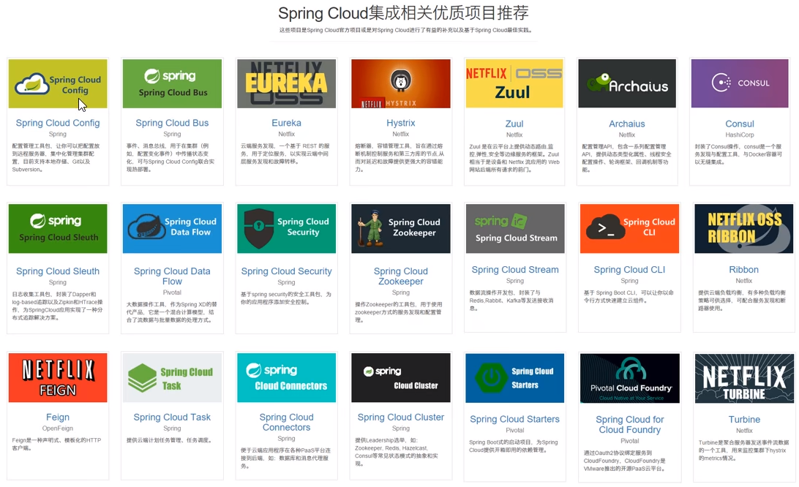
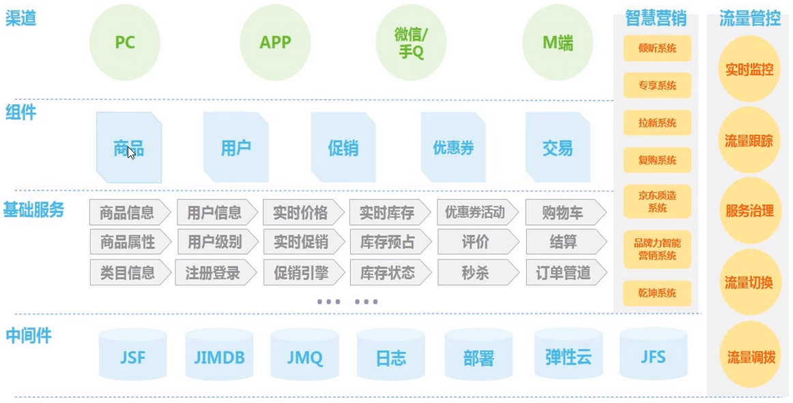
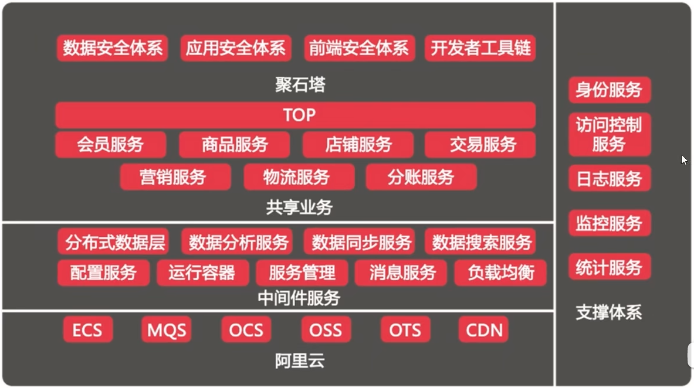
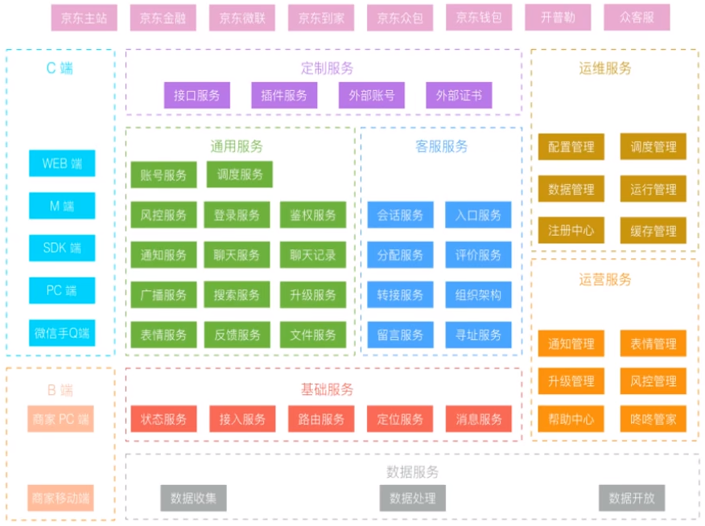
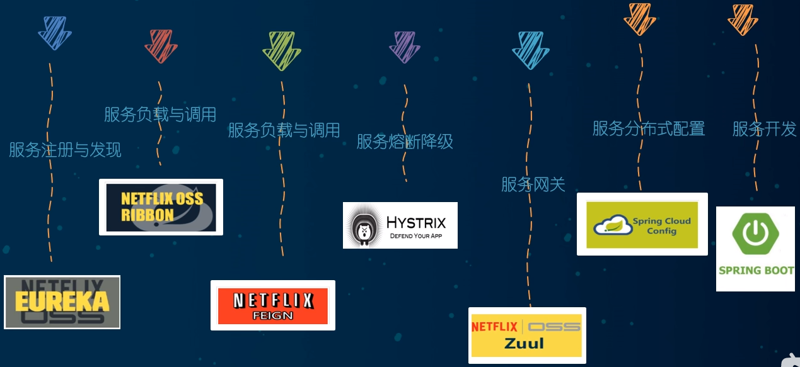

# 1、微服务架构理论入门

## 什么是微服务？

> In short, the microservice architectural style is an approach to developing a single application as a suite of small services, each running in its own process and communicating with lightweight mechanisms, often an HTTP resource API. These services are built around business capabilities and independently deployable by fully automated deployment machinery. There is a bare minimum of centralized management of these services, which may be written in different programming languages and use different data storage technologies.——James Lewis and Martin Fowler (2014)

- **微服务是一种架构风格**
- 一个应用拆分为一组小型服务
- 每个服务运行在自己的进程内，也就是可独立部署和升级
- 服务之间使用轻量级HTTP交互
- 服务围绕业务功能拆分
- 可以由全自动部署机制独立部署
- 去中心化，服务自治。服务可以使用不同的语言、不同的存储技术

**分布式微服务架构-落地维度**

那微服务满足哪些维度？支撑起这些维度又有哪些具体技术？

- 服务调用
- 服务降级
- 服务注册与发先
- 服务熔断
- 负载均衡
- 服务消息队列
- 服务网关
- 配置中心管理
- 自动化构建部署
- 服务监控
- 全链路追踪
- 服务定时任务
- 调度操作

## Spring Cloud简介

是什么？符合微服务技术维度

**SpringCloud=分布式微服务架构的站式解决方案，是多种微服务架构落地技术的集合体，俗称微服务全家桶**

猜猜SpringCloud这个大集合里有多少种技术?

SpringCloud俨然已成为微服务开发的主流技术栈，在国内开发者社区非常火爆。

**“微”力十足，下面例举几个互联网大厂微服务架构案例：**

京东的：

阿里的：

京东物流的：

## Spring Cloud技术栈

