[toc]


# SQL简述

## SQL的分类

1、DDL(Data Definition Language) 数据定义语言，用来操作数据库、表、列等； 常用语句：CREATE、 ALTER、DROP

2、DML(Data Manipulation Language) 数据操作语言，用来操作数据库中表里的数据；常用语句：INSERT、 UPDATE、 DELETE

3、DCL(Data Control Language) 数据控制语言，用来操作访问权限和安全级别； 常用语句：GRANT、DENY

4、DQL(Data Query Language) 数据查询语言，用来查询数据 常用语句：SELECT

# 数据库的数据类型

使用MySQL数据库存储数据时，不同的数据类型决定了 MySQL存储数据方式的不同。为此，MySQL数据库提供了多种数据类型，其中包括整数类型、浮点数类型、定点 数类型、日期和时间类型、字符串类型、二进制…等等数据类型。

## 1.整数类型

根据数值取值范围的不同MySQL 中的整数类型可分为5种，分别是TINYINT、SMALUNT、MEDIUMINT、INT和 BIGINT。下图列举了 MySQL不同整数类型所对应的字节大小和取值范围而最常用的为INT类型的，


## 2.浮点数类型和定点数类型

在MySQL数据库中使用浮点数和定点数来存储小数。浮点数的类型有两种：单精度浮点数类型（FLOAT)和双精度浮点数类型（DOUBLE)。而定点数类型只有一种即DECIMAL类型。下图列举了 MySQL中浮点数和定点数类型所对应的字节大小及其取值范围：

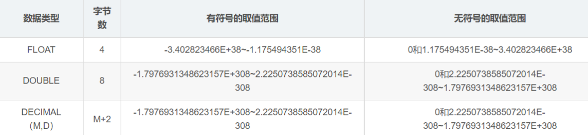

从上图中可以看出：DECIMAL类型的取值范围与DOUBLE类型相同。但是，请注意：DECIMAL类型的有效取值范围是由M和D决定的。其中，M表示的是数据的长 度，D表示的是小数点后的长度。比如，将数据类型为DECIMAL(6,2)的数据6.5243 插人数据库后显示的结果为6.52

## 3.字符串类型

在MySQL中常用CHAR 和 VARCHAR 表示字符串。两者不同的是：VARCHAR存储可变长度的字符串。

**当数据为CHAR(M)类型时，不管插入值的长度是实际是多少它所占用的存储空间都是M个字节；而VARCHAR(M)所对应的数据所占用的字节数为实际长度加1**

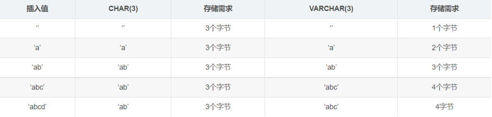

## 4.字符串类型

文本类型用于表示大文本数据，例如，文章内容、评论、详情等，它的类型分为如下4种：

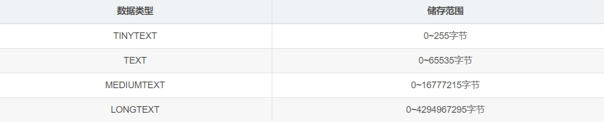

## 5.日期与时间类型

MySQL提供的表示日期和时间的数据类型分别是 ：YEAR、DATE、TIME、DATETIME 和 TIMESTAMP。下图列举了日期和时间数据类型所对应的字节数、取值范围、日期格式以及零值：

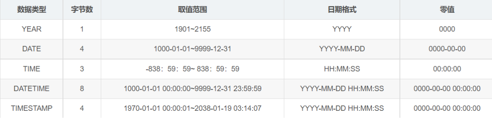

## 6.二进制类型

在MySQL中常用BLOB存储二进制类型的数据，例如：图片、PDF文档等。BLOB类型分为如下四种：

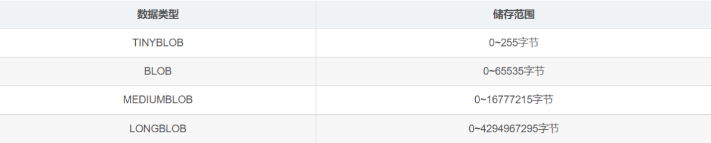

# 数据库、数据表的基本操作

## 1.数据库的基本操作

MySQL安装完成后，要想将数据存储到数据库的表中，首先要创建一个数据库。创建数据库是在数据库系统中划分一块空间存储数据，语法如下：

```sql
create database 数据库名称;
```

创建一个叫db1的数据库MySQL命令：

```sql
-- 创建一个叫db1的数据库
create database db1;
```

运行效果展示：


创建数据库后查看该数据库基本信息MySQL命令：

```sql
show create database db1;
```

运行效果：
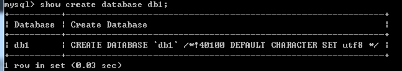

删除数据库MySQL命令：

```sql
drop database db1;
```

运行效果展示：


查询出MySQL中所有的数据库MySQL命令：

```sql
show databases;
```

运行效果展示：
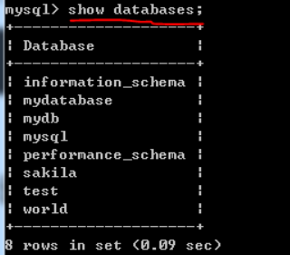

切换数据库 MySQL命令：

```sql
use db1;
```

运行效果展示：


查看当前使用的数据库 MySQL命令：

```sql
select database();
```

运行效果展示：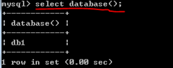

## 2.数据表的基本操作

数据库创建成功后可在该数据库中创建数据表(简称为表)存储数据。请注意：在操作数据表之前应使用“USE 数据库名;”指定操作是在哪个数据库中进行先关操作，否则会抛出“No database selected”错误。

语法如下：

```sql
create table 表名(
       字段1 字段类型,
       字段2 字段类型,
       …
       字段n 字段类型
);
```

### 2.1 创建数据表

示例：创建学生表 MySQL命令：

```sql
create table student(
id int,
name varchar(20),
gender varchar(10),
birthday date
);
```

运行效果展示：
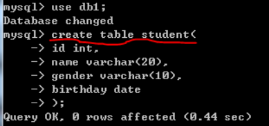

### 2.2 查看数据表

示例：查看当前数据库中所有表 MySQL命令：

```sql
show tables;
```

运行效果展示：
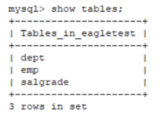

示例：查表的基本信息 MySQL命令：

```sql
show create table student;
```

运行效果展示：


示例：查看表的字段信息 MySQL命令：

```sql
desc student;
```

运行效果展示：
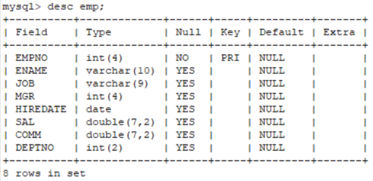

### 2.3 修改数据表

有时，希望对表中的某些信息进行修改，例如：修改表名、修改字段名、修改字段 数据类型…等等。在MySQL中使用alter table修改数据表.

示例：修改表名 MySQL命令：

```sql
alter table student rename to stu;
```

示例：修改字段名 MySQL命令：

```sql
alter table stu change name sname varchar(10);
```

运行效果展示：


示例：修改字段数据类型 MySQL命令：

```sql
alter table stu modify sname int;
```

运行效果展示：
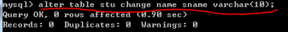

示例：增加字段 MySQL命令：

```sql
alter table stu add address varchar(50);
```

运行效果展示：
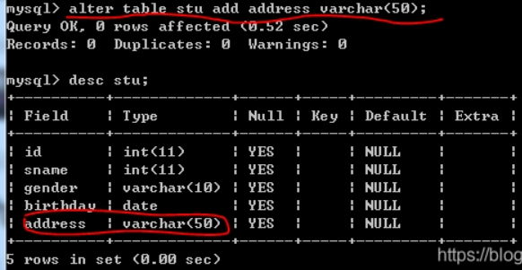

示例：删除字段 MySQL命令：

```sql
alter table stu drop address;
```

运行效果展示：
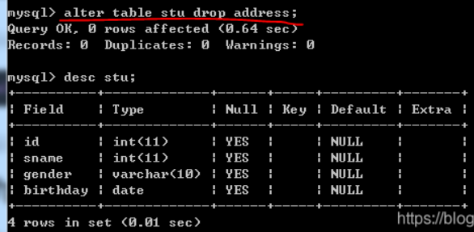

### 2.4 删除数据表

语法：

```sql
drop table 表名;
```

示例：删除数据表 MySQL命令：

```sql
drop table stu;
```

# 数据表的约束

为防止错误的数据被插入到数据表，MySQL中定义了一些维护数据库完整性的规则；这些规则常称为表的约束。常见约束如下：

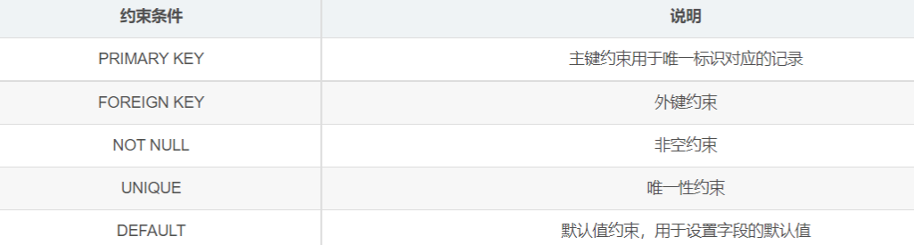

以上五种约束条件针对表中字段进行限制从而保证数据表中数据的正确性和唯一性。换句话说，表的约束实际上就是表中数据的限制条件。

## 1.主键约束

主键约束即primary key用于唯一的标识表中的每一行。被标识为主键的数据在表中是唯一的且其值不能为空。这点类似于我们每个人都有一个身份证号，并且这个身份证号是唯一的。

主键约束基本语法：

```sql
字段名 数据类型 primary key;
```

* 设置主键约束(primary key)的第一种方式

示例：MySQL命令：

```sql
create table student(id int primary key,name varchar(20));
```

运行效果展示：
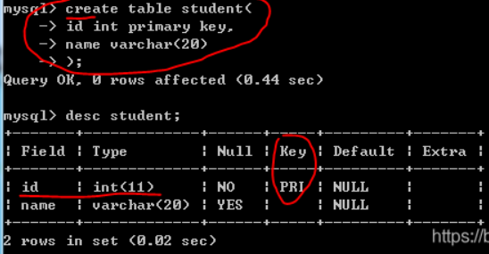

* 设置主键约束(primary key)的第二·种方式

示例：MySQL命令：

```sql
create table student01(id intname varchar(20),primary key(id));
```

运行效果展示：
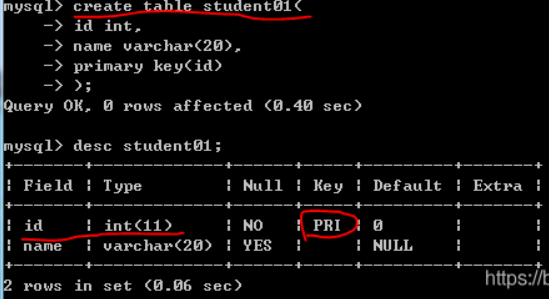

## 2.非空约束

非空约束即 NOT NULL指的是字段的值不能为空，基本的语法格式如下所示：

```sql
字段名 数据类型 NOT NULL;
```

示例：MySQL命令：

```sql
create table student02(
id int
name varchar(20) not null
);
```

运行效果展示：
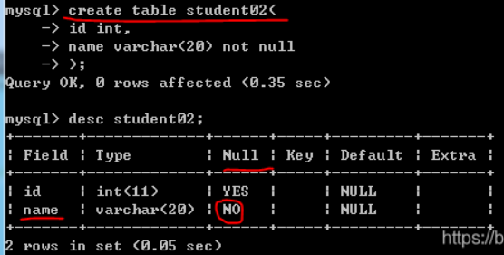

## 3.默认值约束

默认值约束即DEFAULT用于给数据表中的字段指定默认值，即当在表中插入一条新记录时若未给该字段赋值，那么，数据库系统会自动为这个字段插人默认值；其基本的语法格式如下所示：

```sql
字段名 数据类型 DEFAULT 默认值；
```

示例：MySQL命令：

```sql
create table student03(
id int,
name varchar(20),
gender varchar(10) default 'male'
);
```

运行效果展示：
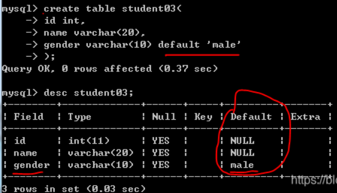

## 5.唯一性约束

唯一性约束即UNIQUE用于保证数据表中字段的唯一性，即表中字段的值不能重复出现，其基本的语法格式如下所示：

```sql
字段名 数据类型 UNIQUE;
```

示例：MySQL命令：

```sql
create table student04(id int,name varchar(20) unique);
```

运行效果展示：
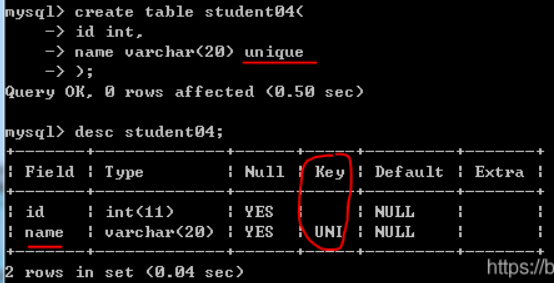

## 6.外键约束

外键约束即FOREIGN KEY常用于多张表之间的约束。基本语法如下：

```sql
-- 在创建数据表时语法如下：CONSTRAINT 外键名 FOREIGN KEY (从表外键字段) REFERENCES 主表 (主键字段)-- 将创建数据表创号后语法如下：ALTER TABLE 从表名 ADD CONSTRAINT 外键名 FOREIGN KEY (从表外键字段) REFERENCES 主表 (主键字段);
```

示例：创建一个学生表 MySQL命令：

```sql
create table student05(id int primary key,name varchar(20));
```

示例：创建一个班级表 MySQL命令：

```sql
create table class(classid int primary key,studentid int);
```

示例：学生表作为主表，班级表作为副表设置外键， MySQL命令：

```sql
alter table class add constraint fk_class_studentid foreign key(studentid) references student05(id);
```

运行效果展示：
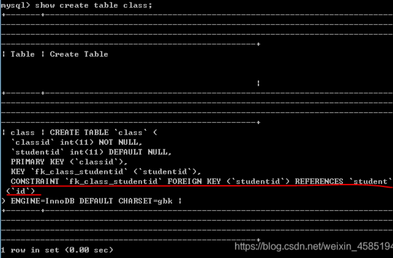

### 6.1 数据一致性概念

大家知道：建立外键是为了保证数据的完整和统一性。但是，如果主表中的数据被删除或修改从表中对应的数据该怎么办呢？很明显，从表中对应的数据也应该被删除，否则数据库中会存在很多无意义的垃圾数据。

### 6.2 删除外键

语法如下：

```sql
alter table 从表名 drop foreign key 外键名；
```

示例：删除外键 MySQL命令：

```sql
alter table class drop foreign key fk_class_studentid;
```

运行效果展示：
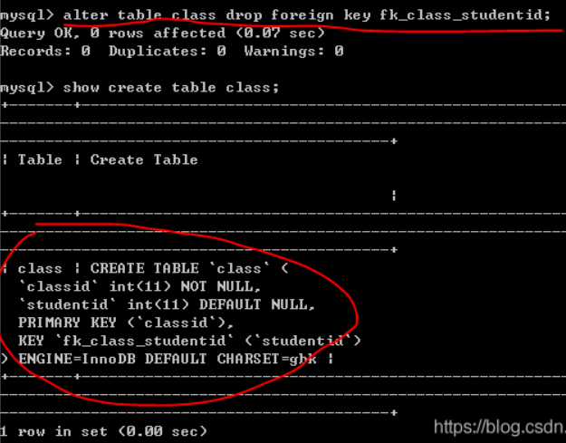

外键的那个字段不在了证明删除成功了

### 6.3 关于外键约束需要注意的细节

1. 从表里的外键通常为主表的主键
2. 从表里外键的数据类型必须与主表中主键的数据类型一致
3. 主表发生变化时应注意主表与从表的数据一致性问题

# 数据表插入数据

在MySQL通过INSERT语句向数据表中插入数据。在此，我们先准备一张学生表，代码如下：

```sql
 create table student( id int, name varchar(30), age int, gender varchar(30) );
```

## 1. 为表中所有字段插入数据

每个字段与其值是严格一一对应的。也就是说：每个值、值的顺序、值的类型必须与对应的字段相匹配。但是，各字段也无须与其在表中定义的顺序一致，它们只要与 VALUES中值的顺序一致即可。

语法如下：

```sql
INSERT INTO 表名（字段名1,字段名2,...) VALUES (值 1,值 2,...);
```

示例：向学生表中插入一条学生信息 MySQL命令：

```sql
insert into student (id,name,age,gender) values (1,'bob',16,'male');
```

运行效果展示：


## 2. 为表中指定字段插入数据

语法如下：

```sql
INSERT INTO 表名（字段名1,字段名2,...) VALUES (值 1,值 2,...);
```

插入数据的方法基本和为表中所有字段插入数据，一样，只是需要插入的字段由你自己指定

## 3. 同时插入多条记录

语法如下：

```sql
INSERT INTO 表名 [(字段名1,字段名2,...)]VALUES (值 1,值 2,…),(值 1,值 2,…),...;
```

在该方式中：(字段名1,字段名2,…)是可选的，它用于指定插人的字段名；(值 1,值 2,…),(值 1,值 2,…)表示要插人的记录，该记录可有多条并且每条记录之间用逗号隔开。
示例：向学生表中插入多条学生信息 MySQL命令：

```sql
insert into student (id,name,age,gender) values (2,'lucy',17,'female'),(3,'jack',19,'male'),(4,'tom',18,'male');
```

运行效果展示：


# 更新数据

在MySQL通过UPDATE语句更新数据表中的数据。在此，我们将就用六中的student学生表

## 1. UPDATE基本语法

```sql
UPDATE 表名 SET 字段名1=值1[,字段名2 =值2,…] [WHERE 条件表达式];
```

在该语法中：字段名1、字段名2…用于指定要更新的字段名称；值1、值 2…用于表示字段的新数据；WHERE 条件表达式 是可选的，它用于指定更新数据需要满足的条件

## 2. UPDATE更新部分数据

示例：将name为tom的记录的age设置为20并将其gender设置为female MySQL命令：

```sql
update student set age=20,gender='female' where name='tom';
```

运行效果展示：
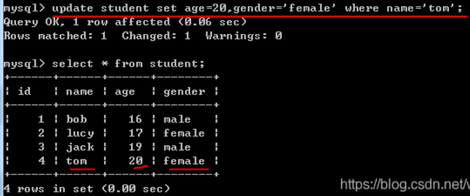

## 3. UPDATE更新全部数据

示例：将所有记录的age设置为18 MySQL命令：

```sql
update student set age=18;
```

运行效果展示：
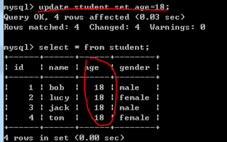

# 删除数据

在MySQL通过DELETE语句删除数据表中的数据。在此，我们先准备一张数据表，代码如下：

```sql
-- 创建学生表
 create table student(
 id int,
 name varchar(30),
 age int,
 gender varchar(30)
 );
 -- 插入数据
 insert into student (id,name,age,gender) values (2,'lucy',17,'female'),(3,'jack',19,'male'),(4,'tom',18,'male'),(5,'sal',19,'female'),(6,'sun',20,'male')
,(7,'sad',13,'female'),(8,'sam',14,'male');
```

## 1. DELETE基本语法

在该语法中：表名用于指定要执行删除操作的表；[WHERE 条件表达式]为可选参数用于指定删除的条件。

```sql
DELETE FROM 表名 [WHERE 条件表达式];
```

## 2. DELETE删除部分数据

示例：删除age等于14的所有记录 MySQL命令：

```sql
delete from student where age=14;
```

## 3. DELETE删除全部数据

示例：删除student表中的所有记录 MySQL命令：

```sql
delete from student;
```

运行效果展示：
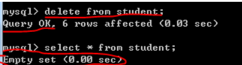

## 4. TRUNCATE和DETELE的区别

TRUNCATE和DETELE都能实现删除表中的所有数据的功能，但两者也是有区别的：

1. DELETE语句后可跟WHERE子句，可通过指定WHERE子句中的条件表达式只删除满足条件的部分记录；但是，TRUNCATE语句只能用于删除表中的所有记录。
2. 使用TRUNCATE语句删除表中的数据后，再次向表中添加记录时自动增加字段的默认初始值重新由1开始；使用DELETE语句删除表中所有记录后，再次向表中添加记录时自动增加字段的值为删除时该字段的最大值加1
3. DELETE语句是DML语句，TRUNCATE语句通常被认为是DDL语句

# MySQL数据表简单查询

## 1.简单查询概述

简单查询即不含where的select语句。在此，我们讲解简单查询中最常用的两种查询：查询所有字段和查询指定字段。

在此，先准备测试数据，代码如下：

```sql
-- 创建数据库
DROP DATABASE IF EXISTS mydb;
CREATE DATABASE mydb;
USE mydb;
-- 创建student表
CREATE TABLE student (
    sid CHAR(6),
    sname VARCHAR(50),
    age INT,
    gender VARCHAR(50) DEFAULT 'male'
);
-- 向student表插入数据
INSERT INTO student (sid,sname,age,gender) VALUES ('S_1001', 'lili', 14, 'male');
INSERT INTO student (sid,sname,age,gender) VALUES ('S_1002', 'wang', 15, 'female');
INSERT INTO student (sid,sname,age,gender) VALUES ('S_1003', 'tywd', 16, 'male');
INSERT INTO student (sid,sname,age,gender) VALUES ('S_1004', 'hfgs', 17, 'female');
INSERT INTO student (sid,sname,age,gender) VALUES ('S_1005', 'qwer', 18, 'male');
INSERT INTO student (sid,sname,age,gender) VALUES ('S_1006', 'zxsd', 19, 'female');
INSERT INTO student (sid,sname,age,gender) VALUES ('S_1007', 'hjop', 16, 'male');
INSERT INTO student (sid,sname,age,gender) VALUES ('S_1008', 'tyop', 15, 'female');
INSERT INTO student (sid,sname,age,gender) VALUES ('S_1009', 'nhmk', 13, 'male');
INSERT INTO student (sid,sname,age,gender) VALUES ('S_1010', 'xdfv', 17, 'female');
```

## 2.查询所有字段（方法不唯一只是举例）

查询所有字段 MySQL命令：

```sql
select * from student;
```

运行效果展示：
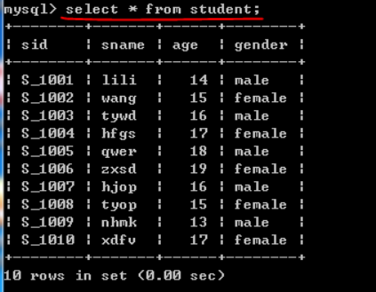

## 3.查询指定字段

查询指定字段（sid、sname） MySQL命令：

```sql
select sid,sname from student;
```

运行效果展示：
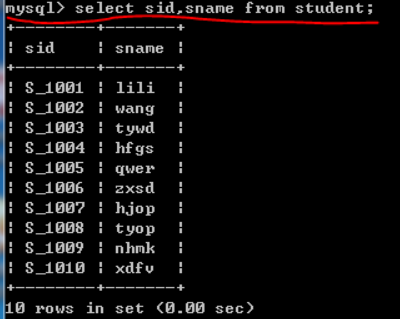

## 4.常数的查询

在SELECT中除了书写列名，还可以书写常数。可以用于标记

常数的查询日期标记 MySQL命令：

```sql
select sid,sname,'2021-03-02' from student;
```

运行效果展示：
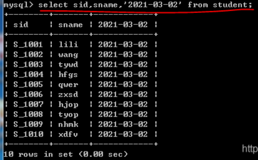

## 5.从查询结果中过滤重复数据

在使用DISTINCT 时需要注意：

在SELECT查询语句中DISTINCT关键字只能用在第一个所查列名之前。

MySQL命令：

```sql
select distinct gender from student;
```

运行效果展示：
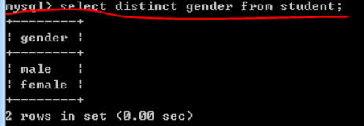

## 6.算术运算符（举例加运算符）

在SELECT查询语句中还可以使用加减乘除运算符。

查询学生10年后的年龄 MySQL命令：

```sql
 select sname,age+10 from student;
```

运行效果展示：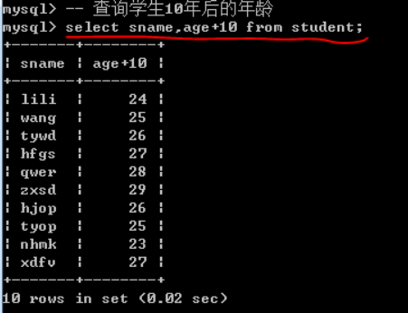

# 函数

在此，先准备测试数据，代码如下：

```sql
-- 创建数据库DROP DATABASE IF EXISTS mydb;CREATE DATABASE mydb;USE mydb;-- 创建student表CREATE TABLE student (    sid CHAR(6),    sname VARCHAR(50),    age INT,    gender VARCHAR(50) DEFAULT 'male');-- 向student表插入数据INSERT INTO student (sid,sname,age,gender) VALUES ('S_1001', 'lili', 14, 'male');INSERT INTO student (sid,sname,age,gender) VALUES ('S_1002', 'wang', 15, 'female');INSERT INTO student (sid,sname,age,gender) VALUES ('S_1003', 'tywd', 16, 'male');INSERT INTO student (sid,sname,age,gender) VALUES ('S_1004', 'hfgs', 17, 'female');INSERT INTO student (sid,sname,age,gender) VALUES ('S_1005', 'qwer', 18, 'male');INSERT INTO student (sid,sname,age,gender) VALUES ('S_1006', 'zxsd', 19, 'female');INSERT INTO student (sid,sname,age,gender) VALUES ('S_1007', 'hjop', 16, 'male');INSERT INTO student (sid,sname,age,gender) VALUES ('S_1008', 'tyop', 15, 'female');INSERT INTO student (sid,sname,age,gender) VALUES ('S_1009', 'nhmk', 13, 'male');INSERT INTO student (sid,sname,age,gender) VALUES ('S_1010', 'xdfv', 17, 'female');
```

## 1.聚合函数

在开发中，我们常常有类似的需求：统计某个字段的最大值、最小值、 平均值等等。为此，MySQL中提供了聚合函数来实现这些功能。所谓聚合，就是将多行汇总成一行；其实，所有的聚合函数均如此——输入多行，输出一行。聚合函数具有自动滤空的功能，若某一个值为NULL，那么会自动将其过滤使其不参与运算。

* 聚合函数使用规则：
  只有SELECT子句和HAVING子句、ORDER BY子句中能够使用聚合函数。例如，在WHERE子句中使用聚合函数是错误的。

接下来，我们学习常用聚合函数。

### 1.1、count（）

统计表中数据的行数或者统计指定列其值不为NULL的数据个数

查询有多少该表中有多少人

MySQL命令：

```sql
select count(*) from student;
```

运行效果展示：
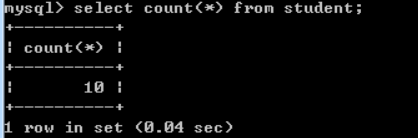

### 1.2、max（）

计算指定列的最大值，如果指定列是字符串类型则使用字符串排序运算

查询该学生表中年纪最大的学生

MySQL命令：

```sql
select max(age) from student;
```

运行效果展示：
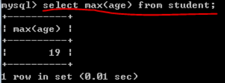

1.3、min（）

计算指定列的最小值，如果指定列是字符串类型则使用字符串排序运算

查询该学生表中年纪最小的学生 MySQL命令：

```sql
select sname,min(age) from student;
```

运行效果展示：
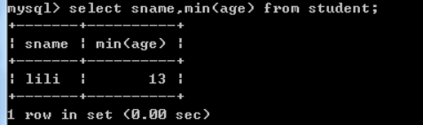

### 1.4、sum（）

计算指定列的数值和，如果指定列类型不是数值类型则计算结果为0

查询该学生表中年纪的总和 MySQL命令：

```sql
select sum(age) from student;
```

运行效果展示：
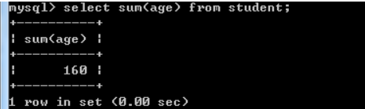

1.5、avg（）

计算指定列的平均值，如果指定列类型不是数值类型则计算结果为

查询该学生表中年纪的平均数 MySQL命令：

```sql
select avg(age) from student;
```

运行效果展示：
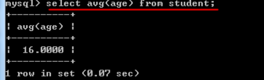

## 2.其他常用函数

这里就不一一举例了，基本混个眼熟，以后用到再细说

### 2.1、时间函数

```sql
SELECT NOW();SELECT DAY (NOW());SELECT DATE (NOW());SELECT TIME (NOW());SELECT YEAR (NOW());SELECT MONTH (NOW());SELECT CURRENT_DATE();SELECT CURRENT_TIME();SELECT CURRENT_TIMESTAMP();SELECT ADDTIME('14:23:12','01:02:01');SELECT DATE_ADD(NOW(),INTERVAL 1 DAY);SELECT DATE_ADD(NOW(),INTERVAL 1 MONTH);SELECT DATE_SUB(NOW(),INTERVAL 1 DAY);SELECT DATE_SUB(NOW(),INTERVAL 1 MONTH);SELECT DATEDIFF('2019-07-22','2019-05-05');
```

### 2.2、字符串函数

```sql
--连接函数SELECT CONCAT ()--SELECT INSTR ();--统计长度SELECT LENGTH();
```

### 2.3、数学函数

```sql
-- 绝对值SELECT ABS(-136);-- 向下取整SELECT FLOOR(3.14);-- 向上取整SELECT CEILING(3.14);
```

# 条件查询

数据库中存有大量数据，我们可根据需求获取指定的数据。此时，我们可在查询语句中通过WHERE子句指定查询条件对查询结果进行过滤。

在开始学习条件查询之前，我们先准备测试数据，代码如下：

```sql
-- 创建数据库DROP DATABASE IF EXISTS mydb;CREATE DATABASE mydb;USE mydb;-- 创建student表CREATE TABLE student (    sid CHAR(6),    sname VARCHAR(50),    age INT,    gender VARCHAR(50) DEFAULT 'male');-- 向student表插入数据INSERT INTO student (sid,sname,age,gender) VALUES ('S_1001', 'lili', 14, 'male');INSERT INTO student (sid,sname,age,gender) VALUES ('S_1002', 'wang', 15, 'female');INSERT INTO student (sid,sname,age,gender) VALUES ('S_1003', 'tywd', 16, 'male');INSERT INTO student (sid,sname,age,gender) VALUES ('S_1004', 'hfgs', 17, 'female');INSERT INTO student (sid,sname,age,gender) VALUES ('S_1005', 'qwer', 18, 'male');INSERT INTO student (sid,sname,age,gender) VALUES ('S_1006', 'zxsd', 19, 'female');INSERT INTO student (sid,sname,age,gender) VALUES ('S_1007', 'hjop', 16, 'male');INSERT INTO student (sid,sname,age,gender) VALUES ('S_1008', 'tyop', 15, 'female');INSERT INTO student (sid,sname,age,gender) VALUES ('S_1009', 'nhmk', 13, 'male');INSERT INTO student (sid,sname,age,gender) VALUES ('S_1010', 'xdfv', 17, 'female');INSERT INTO student (sid,sname,age,gender) VALUES ('S_1012', 'lili', 14, 'male');INSERT INTO student (sid,sname,age,gender) VALUES ('S_1013', 'wang', 15, 'female');
```

## 1.使用关系运算符查询

在WHERE中可使用关系运算符进行条件查询，常用的关系运算符如下所示：

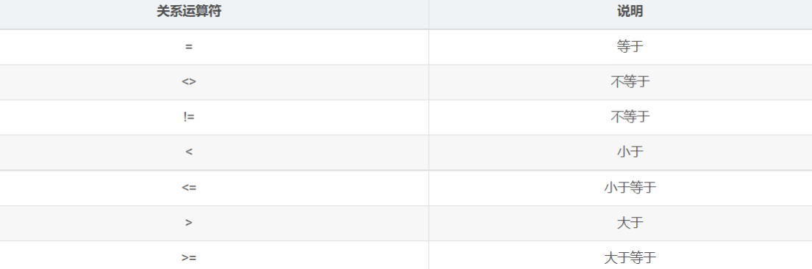

查询年龄等于或大于17的学生的信息 MySQL命令：

```sql
select * from student where age>=17;
```

运行效果展示：
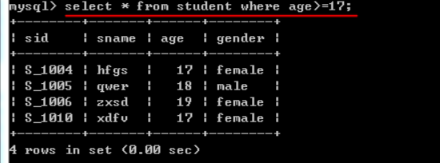

## 2.使用IN关键字查询

IN关键字用于判断某个字段的值是否在指定集合中。如果字段的值恰好在指定的集合中，则将字段所在的记录将査询出来。

查询sid为S_1002和S_1003的学生信息 MySQL命令：

```sql
select * from student where sid in ('S_1002','S_1003');
```

运行效果展示：
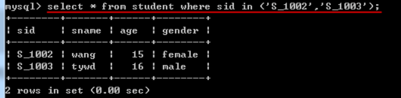

查询sid为S_1001以外的学生的信息 MySQL命令：

```sql
select * from student where sid not in ('S_1001');
```

运行效果展示：
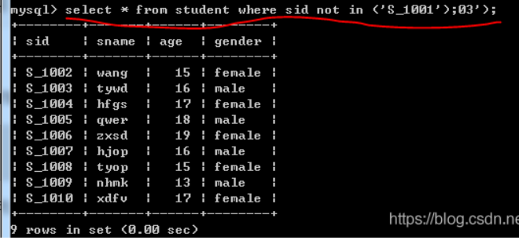

## 3.使用BETWEEN AND关键字查询

BETWEEN AND用于判断某个字段的值是否在指定的范围之内。如果字段的值在指定范围内，则将所在的记录将查询出来

查询15到18岁的学生信息 MySQL命令：

```sql
select * from student where age between 15 and 18;
```

运行效果展示：
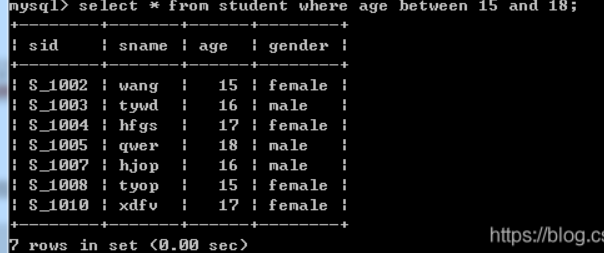

查询不是15到18岁的学生信息 MySQL命令：

```sql
select * from student where age not between 15 and 18;
```

运行效果展示：
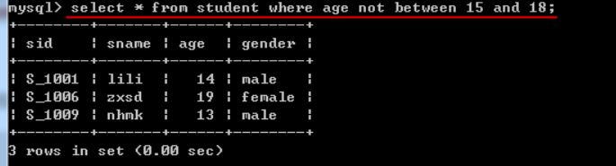

## 4.使用空值查询

在MySQL中，使用 IS NULL关键字判断字段的值是否为空值。请注意：空值NULL不同于0，也不同于空字符串

由于student表没有空值就不演示查询空值的了

查询sname不为空值的学生信息 MySQL命令：

```sql
select * from student where sname is not null;
```

运行效果展示：
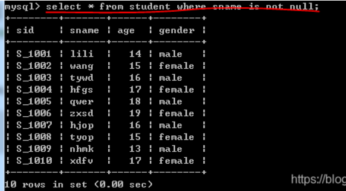

## 5.使用AND关键字查询

在MySQL中可使用AND关键字可以连接两个或者多个查询条件。

查询年纪大于15且性别为male的学生信息 MySQL命令：

```sql
select * from student where age>15 and gender='male';
```

运行效果展示：
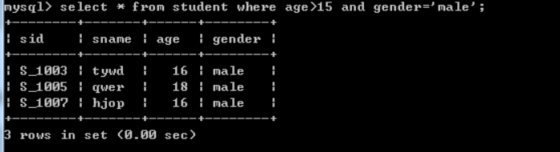

## 6.使用OR关键字查询

在使用SELECT语句查询数据时可使用OR关键字连接多个査询条件。在使用OR关键字时，只要记录满足其中任意一个条件就会被查询出来

查询年纪大于15或者性别为male的学生信息 MySQL命令：

```sql
select * from student where age>15 or gender='male';
```

运行效果展示：
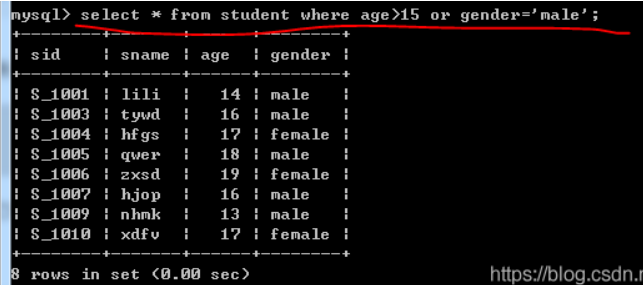

## 7.使用LIKE关键字查询

MySQL中可使用LIKE关键字可以判断两个字符串是否相匹配

### 7.1 普通字符串

查询sname中与wang匹配的学生信息 MySQL命令：

```sql
select * from student where sname like 'wang';
```

运行效果展示：
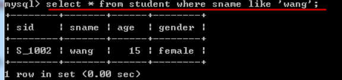

### 7.2 含有%通配的字符串

%用于匹配任意长度的字符串。例如，字符串“a%”匹配以字符a开始任意长度的字符串

查询学生姓名以li开始的记录 MySQL命令：

```sql
select * from student where sname like 'li%';
```

运行效果展示：


查询学生姓名以g结尾的记录 MySQL命令：

```sql
select * from student where sname like '%g';
```

运行效果展示：
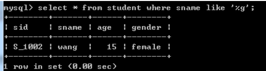

查询学生姓名包含s的记录 MySQL命令：

```sql
select * from student where sname like '%s%';
```

运行效果展示
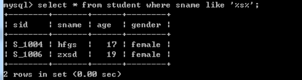

### 7.3 含有_通配的字符串

下划线通配符只匹配单个字符，如果要匹配多个字符，需要连续使用多个下划线通配符。例如，字符串“ab_”匹配以字符串“ab”开始长度为3的字符串，如abc、abp等等；字符串“a__d”匹配在字符“a”和“d”之间包含两个字符的字符串，如"abcd"、"atud"等等。

查询学生姓名以zx开头且长度为4的记录 MySQL命令：

```sql
select * from student where sname like 'zx__';
```

运行效果展示
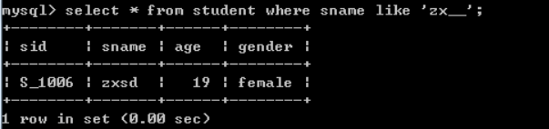

查询学生姓名以g结尾且长度为4的记录 MySQL命令：

```sql
select * from student where sname like '___g';
```

运行效果展示
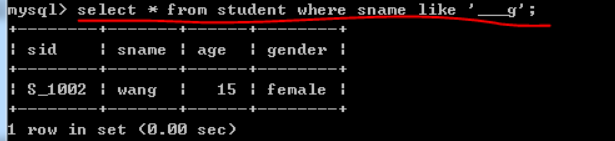

## 8.使用LIMIT限制查询结果的数量

当执行查询数据时可能会返回很多条记录，而用户需要的数据可能只是其中的一条或者几条

查询学生表中年纪最小的3位同学 MySQL命令：

```sql
select * from student order by age asc limit 3;
```

运行效果展示
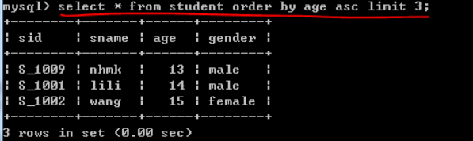

## 9.使用GROUP BY进行分组查询

GROUP BY 子句可像切蛋糕一样将表中的数据进行分组，再进行查询等操作。换言之，可通俗地理解为：通过GROUP BY将原来的表拆分成了几张小表。

接下来，我们通过一个例子开始学习GROUP BY，代码如下

```sql
-- 创建数据库DROP DATABASE IF EXISTS mydb;CREATE DATABASE mydb;USE mydb;-- 创建员工表CREATE TABLE employee (    id int,    name varchar(50),    salary int,    departmentnumber int);-- 向员工表中插入数据INSERT INTO employee values(1,'tome',2000,1001); INSERT INTO employee values(2,'lucy',9000,1002); INSERT INTO employee values(3,'joke',5000,1003); INSERT INTO employee values(4,'wang',3000,1004); INSERT INTO employee values(5,'chen',3000,1001); INSERT INTO employee values(6,'yukt',7000,1002); INSERT INTO employee values(7,'rett',6000,1003); INSERT INTO employee values(8,'mujk',4000,1004); INSERT INTO employee values(9,'poik',3000,1001);
```

### 9.1 GROUP BY和聚合函数一起使用

统计各部门员工个数 MySQL命令：

```sql
select count(*), departmentnumber from employee group by departmentnumber;
```

运行效果展示


统计部门编号大于1001的各部门员工个数 MySQL命令：

```sql
select count(*), departmentnumber from employee where departmentnumber>1001 group by departmentnumber;
```

运行效果展示


### 9.2 GROUP BY和聚合函数以及HAVING一起使用

统计工资总和大于8000的部门 MySQL命令：

```sql
select sum(salary),departmentnumber from employee group by departmentnumber having sum(salary)>8000;
```

运行效果展示


## 10.使用ORDER BY对查询结果排序

从表中査询出来的数据可能是无序的或者其排列顺序不是我们期望的。为此，我们可以使用ORDER BY对查询结果进行排序

其语法格式如下所示：

```sql
SELECT 字段名1,字段名2,…FROM 表名ORDER BY 字段名1 [ASC 丨 DESC],字段名2 [ASC | DESC];
```

在该语法中：字段名1、字段名2是查询结果排序的依据；参数 ASC表示按照升序排序，DESC表示按照降序排序；默认情况下，按照ASC方式排序。通常情况下，ORDER BY子句位于整个SELECT语句的末尾。
查询所有学生并按照年纪大小升序排列 MySQL命令：

```sql
select * from student order by age asc;
```

运行效果展示


查询所有学生并按照年纪大小降序排列 MySQL命令：

```sql
select * from student order by age desc;
```

运行效果展示


# 别名设置

在査询数据时可为表和字段取別名，该别名代替表和字段的原名参与查询操作。

操作的表事先已准备

## 1.为表取别名

在查询操作时，假若表名很长使用起来就不太方便，此时可为表取一个別名，用该别名来代替表的名称。语法格式如下所示：

```sql
SELECT * FROM 表名 [AS] 表的别名 WHERE .... ;
```

将student改为stu查询整表 MySQL命令：

```sql
select * from student as stu;
```

运行效果展示


## 2.为字段取别名

在查询操作时，假若字段名很长使用起来就不太方便，此时可该字段取一个別名，用该别名来代替字段的名称。语法格式如下所示：

```sql
SELECT 字段名1 [AS] 别名1 , 字段名2 [AS] 别名2 , ... FROM 表名 WHERE ... ;
```

将student中的name取别名为“姓名” 查询整表 MySQL命令：

```sql
select name as '姓名',id from student;
```

运行效果展示


# 表的关联关系

在实际开发中数据表之间存在着各种关联关系。在此，介绍MySQL中数据表的三种关联关系。

* 多对一

多对一(亦称为一对多)是数据表中最常见的一种关系。例如：员工与部门之间的关系，一个部门可以有多个员工；而一个员工不能属于多个部门只属于某个部门。在多对一的表关系 中，应将外键建在多的一方否则会造成数据的冗余。

* 多对多

多对多是数据表中常见的一种关系。例如：学生与老师之间的关系，一个学生可以有多个老师而且一个老师有多个学生。通常情况下，为了实现这种关系需要定义一张中间表(亦称为连接表)该表会存在两个外键分别参照老师表和学生表。

* 一对一

在开发过程中，一对一的关联关系在数据库中并不常见；因为以这种方式存储的信息通常会放在同一张表中。

接下来，我们来学习在一对多的关联关系中如果添加和删除数据。先准备一些测试数据，代码如下：

```sql
DROP TABLE IF EXISTS student;DROP TABLE IF EXISTS class;-- 创建班级表CREATE TABLE class(    cid int(4) NOT NULL PRIMARY KEY,    cname varchar(30) );-- 创建学生表CREATE TABLE student(    sid int(8) NOT NULL PRIMARY KEY,    sname varchar(30),    classid int(8) NOT NULL);-- 为学生表添加外键约束ALTER TABLE student ADD CONSTRAINT fk_student_classid FOREIGN KEY(classid) REFERENCES class(cid);-- 向班级表插入数据INSERT INTO class(cid,cname)VALUES(1,'Java');INSERT INTO class(cid,cname)VALUES(2,'Python'); -- 向学生表插入数据INSERT INTO student(sid,sname,classid)VALUES(1,'tome',1);INSERT INTO student(sid,sname,classid)VALUES(2,'lucy',1);INSERT INTO student(sid,sname,classid)VALUES(3,'lili',2);INSERT INTO student(sid,sname,classid)VALUES(4,'domi',2);
```

## 1.关联查询

查询Java班的所有学生 MySQL命令：

```sql
select * from student where classid=(select cid from class where cname='Java');
```

运行效果展示


## 2.关于关联关系的删除数据

请从班级表中删除Java班级。在此，请注意：班级表和学生表之间存在关联关系；要删除Java班级，应该先删除学生表中与该班相关联的学生。否则，假若先删除Java班那么学生表中的cid就失去了关联

删除Java班 MySQL命令：

```sql
delete from student where classid=(select cid from class where cname='Java');delete from class where cname='Java';
```

运行效果展示


# 十四、多表连接查询

## 1.交叉连接查询

交叉连接返回的结果是被连接的两个表中所有数据行的笛卡儿积；比如：集合A={a,b}，集合B={0,1,2}，则集合A和B的笛卡尔积为{(a,0),(a,1),(a,2),(b,0),(b,1),(b,2)}。所以，交叉连接也被称为笛卡尔连接，其语法格式如下：

```sql
SELECT * FROM 表1 CROSS JOIN 表2;
```

在该语法中：CROSS JOIN用于连接两个要查询的表，通过该语句可以查询两个表中所有的数据组合。
由于这个交叉连接查询在实际运用中没有任何意义，所以只做为了解即可

## 2.内连接查询

内连接(Inner Join)又称简单连接或自然连接，是一种非常常见的连接查询。内连接使用比较运算符对两个表中的数据进行比较并列出与连接条件匹配的数据行，组合成新的 记录。也就是说在内连接查询中只有满足条件的记录才能出现在查询结果中。其语法格式如下：

```sql
SELECT 查询字段1,查询字段2, ... FROM 表1 [INNER] JOIN 表2 ON 表1.关系字段=表2.关系字段
```

在该语法中：INNER JOIN用于连接两个表，ON来指定连接条件；其中INNER可以省略。
准备数据，代码如下：

```sql
-- 若存在数据库mydb则删除DROP DATABASE IF EXISTS mydb;-- 创建数据库mydbCREATE DATABASE mydb;-- 选择数据库mydbUSE mydb;-- 创建部门表CREATE TABLE department(  did int (4) NOT NULL PRIMARY KEY,   dname varchar(20));-- 创建员工表CREATE TABLE employee (  eid int (4) NOT NULL PRIMARY KEY,   ename varchar (20),   eage int (2),   departmentid int (4) NOT NULL);-- 向部门表插入数据INSERT INTO department VALUES(1001,'财务部');INSERT INTO department VALUES(1002,'技术部');INSERT INTO department VALUES(1003,'行政部');INSERT INTO department VALUES(1004,'生活部');-- 向员工表插入数据INSERT INTO employee VALUES(1,'张三',19,1003);INSERT INTO employee VALUES(2,'李四',18,1002);INSERT INTO employee VALUES(3,'王五',20,1001);INSERT INTO employee VALUES(4,'赵六',20,1004);
```

查询员工姓名及其所属部门名称 MySQL命令：

```sql
select employee.ename,department.dname from department inner join employee on department.did=employee.departmentid;
```

运行效果展示


## 3.外连接查询

在使用内连接查询时我们发现：返回的结果只包含符合查询条件和连接条件的数据。但是，有时还需要在返回查询结果中不仅包含符合条件的数据，而且还包括左表、右表或两个表中的所有数据，此时我们就需要使用外连接查询。外连接又分为左(外)连接和右(外)连接。其语法格式如下：

```sql
SELECT 查询字段1,查询字段2, ... FROM 表1 LEFT | RIGHT [OUTER] JOIN 表2 ON 表1.关系字段=表2.关系字段 WHERE 条件
```

由此可见，外连接的语法格式和内连接非常相似，只不过使用的是LEFT [OUTER] JOIN、RIGHT [OUTER] JOIN关键字。其中，关键字左边的表被称为左表，关键字右边的表被称为右表；OUTER可以省略。
在使用左(外)连接和右(外)连接查询时，查询结果是不一致的，具体如下：

1. LEFT [OUTER] JOIN 左(外)连接：返回包括左表中的所有记录和右表中符合连接条件的记录。
2. RIGHT [OUTER] JOIN 右(外)连接：返回包括右表中的所有记录和左表中符合连接条件的记录。

先准备数据，代码如下：

```sql
-- 若存在数据库mydb则删除DROP DATABASE IF EXISTS mydb;-- 创建数据库mydbCREATE DATABASE mydb;-- 选择数据库mydbUSE mydb;-- 创建班级表CREATE TABLE class(  cid int (4) NOT NULL PRIMARY KEY,   cname varchar(20));-- 创建学生表CREATE TABLE student (  sid int (4) NOT NULL PRIMARY KEY,   sname varchar (20),   sage int (2),   classid int (4) NOT NULL);-- 向班级表插入数据INSERT INTO class VALUES(1001,'Java');INSERT INTO class VALUES(1002,'C++');INSERT INTO class VALUES(1003,'Python');INSERT INTO class VALUES(1004,'PHP');-- 向学生表插入数据INSERT INTO student VALUES(1,'张三',20,1001);INSERT INTO student VALUES(2,'李四',21,1002);INSERT INTO student VALUES(3,'王五',24,1002);INSERT INTO student VALUES(4,'赵六',23,1003);INSERT INTO student VALUES(5,'Jack',22,1009);
```

准备这组数据有一定的特点，为的是让大家直观的看出左连接与右连接的不同之处

1. 班级编号为1004的PHP班级没有学生
2. 学号为5的学生王跃跃班级编号为1009，该班级编号并不在班级表中

### 3.1 左（外）连接查询

左(外)连接的结果包括LEFT JOIN子句中指定的左表的所有记录，以及所有满足连接条件的记录。如果左表的某条记录在右表中不存在则在右表中显示为空。

查询每个班的班级ID、班级名称及该班的所有学生的名字 MySQL命令：

```sql
select class.cid,class.cname,student.sname from class left outer join student on class.cid=student.classid;
```

运行效果展示


展示结果分析：

1. 分别找出Java班、C++班、Python班的学生
2. 右表的王跃跃不满足查询条件故其没有出现在查询结果中
3. 虽然左表的PHP班没有学生，但是任然显示了PHP的信息；但是，它对应的学生名字为NULL

### 3.2 右（外）连接查询

右(外)连接的结果包括RIGHT JOIN子句中指定的右表的所有记录，以及所有满足连接条件的记录。如果右表的某条记录在左表中没有匹配，则左表将返回空值。

查询每个班的班级ID、班级名称及该班的所有学生的名字 MySQL命令：

```sql
select class.cid,class.cname,student.sname from class right outer join student on class.cid=student.classid;
```

运行效果展示


展示结果分析：

1. 分别找出Java班、C++班、Python班的学生
2. 左表的PHP班不满足查询条件故其没有出现在查询结果中
3. 虽然右表的jack没有对应班级，但是任然显示王跃跃的信息；但是，它对应的班级以及班级编号均为NULL


# 总结

## 重要（从关键字分析）：

### 查询语句的书写顺序和执行顺序

select ===> from ===> where ===> group by ===> having ===> order by ===> limit

### 查询语句的执行顺序

from ===> where ===> group by ===> having ===> select ===> order by ===> limi

# 子查询

## **在where语句中使用子查询，也就是在where语句中加入select语句**

* 查询员工信息，查询哪些人是管理者，要求显示出其员工编号和员工姓名
  实现思路：
    * 首先取得管理者的编号，去除重复的

```sql
select distinct mgr from emp where mgr is not null; distinct 去除重复行
```

    * 查询员工编号包含管理者编号的

```sql
select empno, ename from emp where empno in(select mgr from emp where mgr is not null);
```

* 查询哪些人的薪水高于员工的平均薪水，需要显示员工编号，员工姓名，薪水

实现思路

    * 取得平均薪水

```sql
select avg(sal) from emp;
```

    * 取得大于平均薪水的员工

```sql
select empno, ename, sal from emp where sal > (select avg(sal) from emp);
```

## **在from语句中使用子查询，可以将该子查询看做一张表**

* 查询员工信息，查询哪些人是管理者，要求显示出其员工编号和员工姓名

首先取得管理者的编号，去除重复的

```sql
select distinct mgr from emp where mgr is not null;
```

将以上查询作为一张表，放到from语句的后面

```sql
使用92语法：select e.empno, e.ename from emp e, (select distinct mgr from emp where mgr is not null) m where e.empno=m.mgr;使用99语法：select e.empno, e.ename from emp e join (select distinct mgr from emp where mgr is not null) m on e.empno=m.mgr;
```

* 查询各个部门的平均薪水所属等级，需要显示部门编号，平均薪水，等级编号

实现思路

    * 首先取得各个部门的平均薪水

```sql
select deptno, avg(sal) avg_sal from emp group by deptno;
```

    * 将部门的平均薪水作为一张表与薪水等级表建立连接，取得等级

```sql
select deptno,avg(sal) avg_sal from emp group by deptno;select * from salgrade;select a.deptno,a.avg_sal,g.grade from (select deptno,avg(sal) avg_sal from emp group by deptno ) a join salgrade g on a.avg_sal between g.losal and hisal;
```

## **在select语句中使用子查询**

* 查询员工信息，并显示出员工所属的部门名称

第一种做法，将员工表和部门表连接

```sql
select e.ename, d.dname from emp e, dept d where e.deptno=d.deptno;
```

第二种做法，在select语句中再次嵌套select语句完成部分名称的查询

```sql
select e.ename, (select d.dname from dept d where e.deptno=d.deptno) as dname from emp e;
```

# 分页

分页：limit关键字

```sql
select * from emp limit 起始索引位置,分页单位;select * from emp limit 0,3;select * from emp limit 3,3;select * from emp limit 6,3;select * from emp limit 9,3;
```

起始索引位置：从那个位置开始查(下标索引是从0开始的)
	

分页单位：查询多少条数据

* 起始索引位置跟当前页的关系
  起始索引位置 = （当前页 - 1 ） * 分页单位

根据分页来查询5-10条的数据

select * from emp limit 4,6;

​	

根据分页来查询7-11条的数据

select * from emp limit 6,5;


