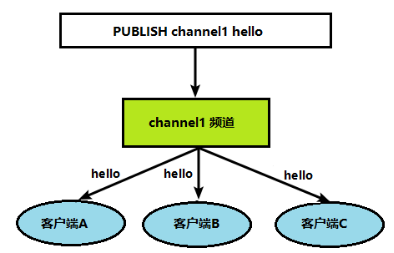
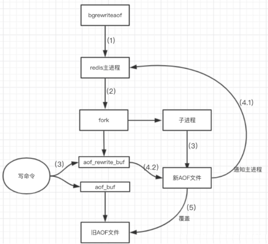
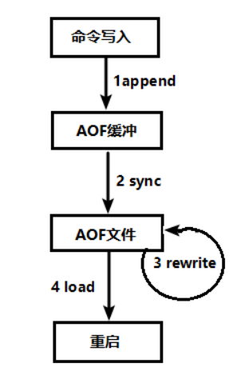
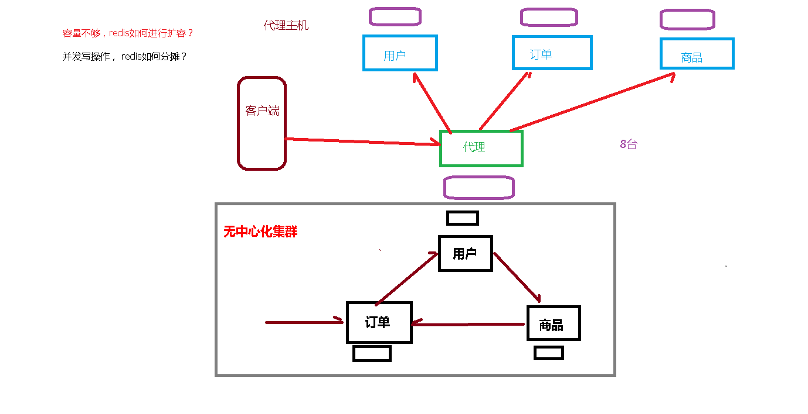
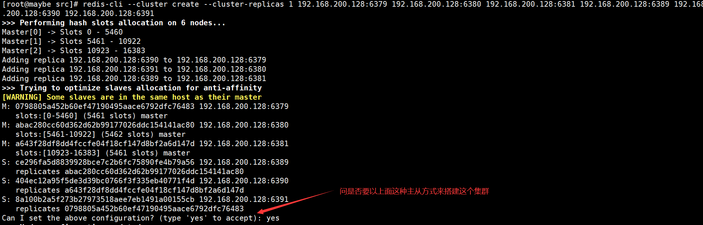
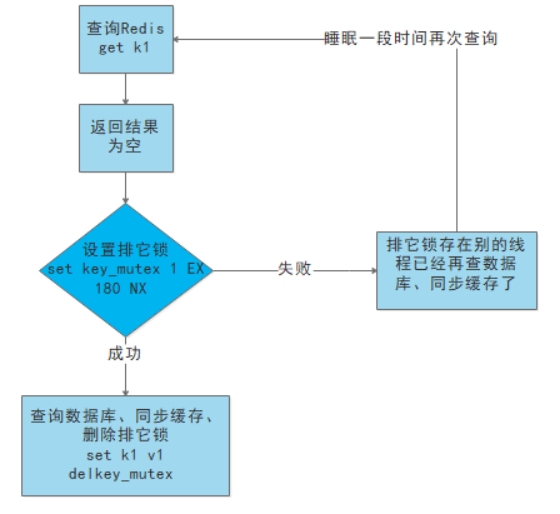

# Redis概述

> 技术的分类

1、解决功能性的问题：Java、Jsp、RDBMS、Tomcat、HTML、Linux、JDBC、SVN

2、解决扩展性的问题：Struts、Spring、SpringMVC、Hibernate、Mybatis

3、解决性能的问题：NoSQL、Java线程、Hadoop、Nginx、MQ、ElasticSearch

> NoSql数据库的由来

随着Web2.0的时代的到来，用户访问量大幅度提升，同时产生了大量的用户数据。加上后来的智能移动设备的普及，所有的互联网平台都面临了巨大的性能挑战。

 

**解决CPU及内存压力**

 

**解决IO压力**

 

## NoSQL数据库概述

**NoSQL(NoSQL = Not Only SQL )**，意即“不仅仅是SQL”，泛指非关系型的数据库。 

NoSQL 不依赖业务逻辑方式存储，而以简单的key-value模式存储。因此大大的增加了数据库的扩展能力。

- 不遵循SQL标准。
- 不支持ACID。
- 远超于SQL的性能。

> Nosql适用场景

1. 热点数据加速查询(主要场景)，如热点商品、热点信息等访问量较高的数据
2. 即时信息查询，如公交到站信息、在线人数信息等
3. 时效性信息控制，如验证码控制、投票控制等
4. 分布式数据共享，如分布式集群架构中的session分离消息队列

**不适用场景：**

- 需要事务支持
- 基于sql 的结构化查询存储，处理复杂的关系需要即席查询。
- (用不着sql的和用了sql也不行的情况，请考虑用NoSql)

# Redis的下载和安装

在安装Redis之前要先检查一下有没有安装gcc（就把gcc当成c语言编译器, g++当成c++语言编译器用就是了），可以`gcc --version`查看一下，没有的话就安装一下。`yum -y install gcc gcc-c++ autoconf pcre pcre-devel make automake`

1. 去官网下载redis-3.0.4.tar.gz安装包，并放入Linux中的/opt目录（不考虑在Windows下安装）
2. 在/opt目录下，执行解压命令tar -zxvf redis-3.0.4.tar.gz
3. 解压完成后出现文件夹redis-3.0.4
4. 进入文件夹redis-3.0.4，在此目录下执行make && make install命令（这里就是用的gcc的c语言编译）
5. 进入默认安装目录`cd /usr/local/bin`，此目录中有如下文件

```shell
[root@maybe bin]# ll
总用量 24844
-rwxr-xr-x. 1 root root  6537976 11月  4 15:53 redis-benchmark
#性能测试工具，可以在自己本子运行，看看自己本子性能如何
lrwxrwxrwx. 1 root root       12 11月  4 15:53 redis-check-aof -> redis-server
#修复有问题的AOF文件，rdb和aof后面讲
lrwxrwxrwx. 1 root root       12 11月  4 15:53 redis-check-rdb -> redis-server
#修复有问题的dump.rdb文件
-rwxr-xr-x. 1 root root  6754488 11月  4 15:53 redis-cli
#客户端，操作入口
lrwxrwxrwx. 1 root root       12 11月  4 15:53 redis-sentinel -> redis-server
#Redis集群使用
-rwxr-xr-x. 1 root root 12137584 11月  4 15:53 redis-server
#Redis服务器启动命令
```

# Redis启动

**前台启动（不推荐）**

前台启动，命令行窗口不能关闭，否则服务器停止


**后台启动（==推荐==）**

1. 首先备份redis.conf（也可以不拷贝直接修改`vim /opt/redis-3.0.4/redis.conf`，拷贝的目的是启动时要带个配置文件方便启动）
   拷贝一份redis.conf到其他目录
   `cp  /opt/redis-3.2.5/redis.conf  /myredis`

2. 后台启动设置daemonize no改成yes
   修改redis.conf(128行)文件将里面的daemonize no 改成 yes，让服务在后台启动

3. Redis启动
   `redis-server /opt/redis/redis-6.2.6/redis.conf`
4. 查看服务是否启动`ps aux|grep redis-server`


**用客户端访问：redis-cli**

多个端口后面可以加个参数p：`redis-cli -p 端口号`

 

**关闭Redis服务：**

- ```shell
  [root@maybe ~]# redis-cli shutdown
  ```

- 在redis-cli里面关，输入`shutdown`或`exit`

# Redis基础知识

1. Redis采用单线程机制进行工作
2. Redis默认拥有16个数据库，数据库编号从0开始，默认使用0号数据库

3. 使用select 数据库编号 可以切换使用的数据库

4. `dbsize` 命令查看当前数据库key的数量
5. `keys *` 命令查看当前数据库所有的key
6. `flushdb` 命令清空当前数据库
7. `flushall` 命令清空所有数据库
8. Redis中所有数据库使用同一个密码，默认没有密码，Redis认为安全层面应该由Linux来保证

9. Redis中所有索引都是从0开始

10. Redis默认端口是6379（这是有故事的，据说Redis开发者的女神的名字Merz在拼音九键中字母对应的数字）

**Redis是单线程+多路IO复用技术**
多路复用是指使用一个线程来检查多个文件描述符（Socket）的就绪状态，比如调用select和poll函数，传入多个文件描述符，如果有一个文件描述符就绪，则返回，否则阻塞直到超时。得到就绪状态后进行真正的操作可以在同一个线程里执行，也可以启动线程执行（比如使用线程池）

# Redis数据类型

**Redis有五大数据类型：String、List、Set、Zset、Hash**

注意：Redis采用键值对存储数据，key永远是String类型，五大数据类型指的是value部分

## key (键)

| 命令                    | 作用                                                         |
| ----------------------- | ------------------------------------------------------------ |
| `keys *`                | 查看当前库所有key    (匹配：keys *1)                         |
| `exists key`            | 判断某个key是否存在                                          |
| `type key`              | 查看你的key所储存的值是什么类型                              |
| `del key`               | 该命令用于在key存在时删除key                                 |
| `unlink key`            | 根据value选择非阻塞删除<br />仅将keys从keyspace元数据中删除，真正的删除会在后续异步操作。 |
| `expire key seconds`    | 为给定key设置过期时间，以秒计。                              |
| `ttl key`               | 以秒为单位，返回给定key的剩余生存时间(TTL, time to live)。-1表示永不过期；-2表示已经过期；正整数表示还剩多长时间过期 |
| `select 数据库索引序号` | 切换数据库，默认一共有16个数据库，索引从0开始                |
| `dbsize`                | 查看当前数据库的key的数量                                    |
| `flushdb`               | 清空当前库                                                   |
| `flushall`              | 通杀全部库                                                   |

 

 

## 1.String (字符串)

> 简介

一个key对应一个value；String类型是二进制安全的，意味着String可以包含任何数据，比如jpg图片等；String是Redis最基本的 数据类型，一个String的value最大可支持512M

| 命令                              | 作用                                                         |
| --------------------------------- | ------------------------------------------------------------ |
| `set key value`                   | 设置指定key的值，如果没有该key创建                           |
| `get key`                         | 查询对应键值                                                 |
| `append key value`                | 如果key已经存在并且是一个字符串，APPEND 命令将指定的value追加到该key原来值(value)的末尾 |
| `strlen key`                      | 返回key所储存的字符串值的长度                                |
| `setnx key value`                 | 只有在key不存在时设置key的值，key存在则不会对此key修改值     |
| `incr key`                        | 将key中储存数字值加一，必须是数字（integer）                 |
| `decr key`                        | 将key中储存数字值减一，必须是数字（integer）                 |
| `incrby/decrby key 步长`          | 将key所储存的值减去/加上给定的步长                           |
| `mset key value [key value...]`   | 同时设置一个或多个 key-value对                               |
| `mget key value [key value...]`   | 同时获取一个或多个 value                                     |
| `msetnx key value [key value...]` | 同时设置-一个或多个key-value对，当且仅当所有给定key都不存在，一旦有一个存在的key，则全部执行不成功 |
| `getrange key start end`          | 返回key中字符串值的子字符，0到-1表示返回字符串的所有字符     |
| `setrange key 起始索引 value`     | 用value参数覆盖key所储存的字符串值，从起始索引开始。         |
| `setex key seconds value`         | 设置键值的同时，设置过期时间，单位秒                         |
| `getset key value `               | 将给定key的值设为value，并返回key的旧值(old value)。         |


> 数据结构

**String的数据结构为简单动态字符串**(Simple Dynamic String,缩写SDS)。是可以修改的字符串，内部结构实现上类似于Java的ArrayList，采用预分配冗余空间的方式来减少内存的频繁分配

 

如图中所示，内部为当前字符串实际分配的空间capacity一般要高于实际字符串长度len。当字符串长度小于1M时，扩容都是加倍现有的空间，如果超过1M，扩容时一次只会多扩1M的空间。需要注意的是字符串最大长度为512M

## 2. List（列表）

> 简介

Redis 列表是简单的字符串列表，按照插入顺序排序。你可以添加一个元素到列表的头部（左边）或者尾部（右边），它的底层实际是个双向链表，对两端的操作性能很高，通过索引下标的操作中间的节点性能会较差。

 

| 命令                                 | 作用                                                         |
| ------------------------------------ | ------------------------------------------------------------ |
| `lpush/rpush key value1 [value2...]` | 从左边/右边插入一个或多个值                                  |
| `lpop/rpop key`                      | 从左边/右边吐出一个值，代表该值就被移除了                    |
| `rpoplpush key1 key2`                | 从key1列表右边吐出一个值，插到key2列表左边                   |
| `lrange key start stop`              | 按照索引下标获得元素(从左到右)，0是最左边一个元素，-1是最右边 |
| `lindex key index`                   | 按照索引下标获得元素(从左到右)                               |
| `llen key`                           | 获取列表长度                                                 |
| `linsert key before value newvalue`  | 在value的后面插入newvalue插入值                              |
| `lrem key count value`               | 从左往右删除count个value值，count为0表示删除全部给定的值     |
| `lset key index value`               | 通过索引设置列表元素的值                                     |

 

 

> 数据结构

**List的数据结构为快速链表quickList**。

首先在列表元素较少的情况下会使用一块连续的内存存储，这个结构是ziplist，也即是压缩列表，它将所有的元素紧挨着一起存储，分配的是一块连续的内存。当数据量比较多的时候才会改成quicklist。

因为普通的链表需要的附加指针空间太大，会比较浪费空间。比如这个列表里存的只是int类型的数据，结构上还需要两个额外的指针prev和next

 

Redis将链表和ziplist结合起来组成了quicklist。也就是将多个ziplist使用双向指针串起来使用。这样既满足了快速的插入删除性能，又不会出现太大的空间冗余

## 3. Set（集合）

> 简介

Redis set对外提供的功能与list类似是一个列表的功能，特殊之处在于set是可以**自动排重**的，当你需要存储一个列表数据，又不希望出现重复数据时，set是一个很好的选择，并且set提供了判断某个成员是否在一个set集合内的重要接口，这个也是list所不能提供的。

Redis的Set是string类型的无序集合。它底层其实是一个value为null的hash表，所以添加，删除，**查找的复杂度都是O(1)**。
一个算法，随着数据的增加，执行时间的长短，如果是O(1)，数据增加，查找数据的时间不变

| 命令                              | 作用                                                         |
| --------------------------------- | ------------------------------------------------------------ |
| `sadd key member1 [member2...]`   | 向集合添加一个或多个成员，`sadd key 1 1 2 2 3 3`，则只会存入1 2 3三个值 |
| `smembers key`                    | 返回集合中的所有成员                                         |
| `sismember key member`            | 判断member元素是否是集合key的成员                            |
| `scard key`                       | 获取集合的成员数                                             |
| `srem key member1 [member2...]`   | 删除集合中的某个（些）元素                                   |
| `spop key`                        | 移除并返回集合中的一个随机元素                               |
| `srandmember key count`           | 返回集合中count个随机数，但不移除。如果count超过集合元素个数，则返回所有元素；如果写的是负数，如-3，表示返回可能重复的三个数 |
| `smove source destination member` | 将member元素从source集合移动到destinatlon 集合               |
| `sinter key1 key2`                | 返回两个集合的交集                                           |
| `sunion key1 key2`                | 返回两个集合的并集                                           |
| `sdiff key1 key2`                 | 返回第一个集合与其他集合之间的差集。返回在第一个集合中，而不在后面任何一个集合中的值 |

 

 

> 数据结构

Set数据结构是dict字典，字典是用哈希表实现的。
Java中HashSet的内部实现使用的是HashMap，只不过所有的value都指向同一个对象。Redis的set结构也是一样，它的内部也使用hash结构，所有的value都指向同一个内部值。

## 4. Zset(sorted set)有序集合

> 简介

Redis有序集合zset与普通集合set非常相似，是一个**没有重复元素的字符串集合**。

不同之处是有序集合的每个成员都关联了一个**==评分（score）==**,这个评分（score）被用来按照从最低分到最高分的方式排序集合中的成员。**集合的成员是唯一的，但是评分可以是重复了 。**

因为元素是有序的, 所以你也可以很快的根据评分（score）或者次序（position）来获取一个范围的元素。访问有序集合的中间元素也是非常快的,因此你能够使用有序集合作为一个没有重复成员的智能列表。

| 命令                                             | 作用                                                         |
| ------------------------------------------------ | ------------------------------------------------------------ |
| `zadd key score1 member1 [score2 member2...]`    | 向有序集合添加一个或多个成员，或者更新已存在成员的分数。分数一般取整数值型 |
| `zrange key start stop [WITHSCORES]`             | 通过索引区间返回有序集合指定区间内的成员，带WITHSCORES，可以让分数一起和值返回到结果集 |
| `zrangebyscore key min max [WITHSCORES] [LIMIT]` | 返回有序集 key 中，所有 score 值介于 min 和 max 之间(包括等于 min 或 max )的成员。有序集成员按 score 值递增(从小到大)次序排列 |
| `zrangebyscore key max min [WITHSCORES] [LIMIT]` | 同上，改为从大到小                                           |
| `zincrby key increament member`                  | 有序集合中对指定成员的分数加上增量increment                  |
| `zrem key member1 [member2...]`                  | 移除有序集合中的一个或多个成员                               |
| `zcount key min max`                             | 计算在有序集合中指定区间分数的成员数                         |
| `zrank key member`                               | 返回有序集合中指定成员的索引                                 |

 

> 数据结构

SortedSet(zset)是Redis提供的一个非常特别的数据结构，一方面它等价于Java的数据结构Map<String, Double>，可以给每一个元素value赋予一个权重score，另一方面它又类似于TreeSet，内部的元素会按照权重score进行排序，可以得到每个元素的名次，还可以通过score的范围来获取元素的列表。
zset底层使用了两个数据结构：
（1）hash，hash的作用就是关联元素value和权重score，保障元素value的唯一性，可以通过元素value找到相应的score值。
（2）跳跃表，跳跃表的目的在于给元素value排序，根据score的范围获取元素列表。

## 5. Hash (哈希)

> 简介

Redis hash 是一个键值对集合。

Redis hash是一个string类型的field和value的映射表，hash特别适合用于存储对象。类似Java里面的Map<String,Object>

用户ID为查找的key，存储的value用户对象包含姓名，年龄，生日等信息，如果用普通的key/value结构来存储


 通过 ==key(用户ID) + field(属性标签)== 就可以操作对应属性数据了，既不需要重复存储数据，也不会带来序列化和并发修改控制的问题

| 命令                                         | 作用                                                         |
| -------------------------------------------- | ------------------------------------------------------------ |
| `hset key field value [field value...]`      | 将哈希表key中的字段field的值设为value                        |
| `hget key field`                             | 获取存储在哈希表中指定字段的值。                             |
| `hmset key field1 value1 [field2 value2...]` | 同时将多个field-value (域-值)对设置到哈希表key中。这个和hset不同的地方在于它返回的是OK |
| `hexists key field`                          | 查看哈希表key中，指定的字段是否存在。                        |
| `hkeys key`                                  | 获取哈希表key中所有的字段                                    |
| `hvals key`                                  | 获取哈希表中所有值。                                         |
| `hincrby key field increment`                | 为哈希表key中的指定字段(field)的整数值加上增量increment。    |
| `hsetnx key field value`                     | 只有在字段feld不存在时，设置哈希表字段的值。                 |

 

> 数据结构

Hash类型对应的数据结构是两种：ziplist（压缩列表），hashtable（哈希表）。当field-value长度较短且个数较少时，使用ziplist，否则使用hashtable。

# Redis配置文件介绍

## 1、Units单位

配置大小单位,开头定义了一些基本的度量单位，只支持bytes，不支持bit。大小写不敏感

```shell
   1 # Redis configuration file example.
   2 #
   3 # Note that in order to read the configuration file, Redis must be
   4 # started with the file path as first argument:
   5 #
   6 # ./redis-server /path/to/redis.conf
   7 
   8 # Note on units: when memory size is needed, it is possible to specify
   9 # it in the usual form of 1k 5GB 4M and so forth:
  10 #
  11 # 1k => 1000 bytes
  12 # 1kb => 1024 bytes
  13 # 1m => 1000000 bytes
  14 # 1mb => 1024*1024 bytes
  15 # 1g => 1000000000 bytes
  16 # 1gb => 1024*1024*1024 bytes
  17 #
  18 # units are case insensitive so 1GB 1Gb 1gB are all the same.
```

## 2、INCLUDES包含

类似jsp中的include，多实例的情况可以把公用的配置文件提取出来

```shell
  20 ################################## INCLUDES ###################################
  21 
  22 # Include one or more other config files here.  This is useful if you
  23 # have a standard template that goes to all Redis servers but also need
  24 # to customize a few per-server settings.  Include files can include
  25 # other files, so use this wisely.
  26 #
  27 # Note that option "include" won't be rewritten by command "CONFIG REWRITE"
  28 # from admin or Redis Sentinel. Since Redis always uses the last processed
  29 # line as value of a configuration directive, you'd better put includes
  30 # at the beginning of this file to avoid overwriting config change at runtime.
  31 #
  32 # If instead you are interested in using includes to override configuration
  33 # options, it is better to use include as the last line.
  34 #
  35 # include /path/to/local.conf
  36 # include /path/to/other.conf
```

## 3、NETWORK网络相关配置

### 3.1 bind

默认情况bind=127.0.0.1只能接受本机的访问请求，不写的情况下，无限制接受任何ip地址的访问

生产环境肯定要写你**应用服务器的地址**；服务器是需要远程访问的，所以需要将其注释掉

如果开启了protected-mode，那么在没有设定bind ip且没有设密码的情况下，Redis只允许接受本机的响应


可以看到是本机访问的，开发中药将这个配置注释掉，还需要开启远程访问（下面提到）

### 3.2 protected-mode

本机访问保护模式，默认为yes，也就意味着不能远程访问，需要改为no


### 3.3 port

端口号，默认 6379

 

### 3.4 tcp-backlog

设置tcp的backlog，backlog其实是一个连接队列，backlog队列总和=未完成三次握手队列 + 已经完成三次握手队列。

在高并发环境下你需要一个高backlog值来避免慢客户端连接问题。

注意Linux内核会将这个值减小到/proc/sys/net/core/somaxconn的值（128），所以需要确认增大/proc/sys/net/core/somaxconn和/proc/sys/net/ipv4/tcp_max_syn_backlog（128）两个值来达到想要的效果

 

### 3.5 timeout

一个空闲的客户端维持多少秒会关闭，0表示关闭该功能。即**永不关闭**

 

### 3.6 tcp-keepalive

对访问客户端的一种**心跳检测**，每个n秒检测一次。（就是多长时间检测一次客户端是否连接），单位为秒，如果设置为0，则不会进行Keepalive检测，建议设置成60 

 

## 4、GENERAL通用

### 4.1 daemonize

是否为后台进程，设置为yes，守护进程，后台启动

 

### 4.2 pidfile

存放pid（进程号）文件的位置，每个实例会产生一个不同的pid文件

 

### 4.3 loglevel 

指定日志记录级别，Redis总共支持四个级别：debug、verbose、notice、warning，默认为notice
四个级别根据使用阶段来选择，生产环境选择notice 或者warning

 

### 4.4 logfile

日志文件名称

 

### 4.5 databases 16

设定库的数量 默认16，默认数据库为0，可以使用`SELECT <dbid>`命令在连接上指定数据库id

 

## 5、SECURITY安全

### 5.1 设置密码

访问密码的查看、设置和取消

 

在命令中设置密码，只是临时的。重启redis服务器，密码就还原了。

永久设置，需要再配置文件中进行设置。

 

## 6、其他的一些限制

**说明：这些限制以前是在LIMITS模块中的，后面的版本就直接在各自独立的模块中了**

### 6.1 maxclients

**注意：**新版的maxclients可能不在LIMITS里面，在单独的一个模块叫CLIENTS里面。

- 设置redis同时可以与多少个客户端进行连接。
- 默认情况下为10000个客户端。
- 如果达到了此限制，redis则会拒绝新的连接请求，并且向这些连接请求方发出“max number of clients reached”以作回应

 

### 6.2 maxmemory

- 建议**必须设置**，否则，将内存占满，造成服务器宕机
- 设置redis可以使用的内存量。一旦到达内存使用上限，redis将会试图移除内部数据，移除规则可以通过**maxmemory-policy**来指定。
- 如果redis无法根据移除规则来移除内存中的数据，或者设置了“不允许移除”，那么redis则会针对那些需要申请内存的指令返回错误信息，比如SET、LPUSH等。
- 但是对于无内存申请的指令，仍然会正常响应，比如GET等。如果你的redis是主redis（说明你的redis有从redis），那么在设置内存使用上限时，需要在系统中留出一些内存空间给同步队列缓存，只有在你设置的是“不移除”的情况下，才不用考虑这个因素。

 

### 6.3 maxmemory-policy

- volatile-lru：使用LRU算法移除key，只对设置了过期时间的键；（最近最少使用）
- allkeys-lru：在所有集合key中，使用LRU算法移除key
- volatile-random：在过期集合中移除随机的key，只对设置了过期时间的键
- allkeys-random：在所有集合key中，移除随机的key
- volatile-ttl：移除那些TTL值最小的key，即那些最近要过期的key
- noeviction：不进行移除。针对写操作，只是返回错误信息

 

### 6.4 maxmemory-samples

- 设置样本数量，LRU算法和最小TTL算法都并非是精确的算法，而是估算值，所以你可以设置样本的大小，redis默认会检查这么多个key并选择其中LRU的那个。（类似于抽样，抽到的样本合格，就认为这些合格）
- 一般设置3到7的数字，数值越小样本越不准确，但性能消耗越小。

 

# Redis的发布和订阅

Redis 发布订阅 (pub/sub) 是一种消息通信模式：发送者 (pub) 发送消息，订阅者 (sub) 接收消息。
Redis 客户端可以订阅任意数量的频道

- 客户端可以订阅频道如下图
  
- 当给这个频道发布消息后，消息就会发送给订阅的客户端
  

> 命令实现

1. 打开一个客户端订阅channel1
   `SUBSCRIBE channel1`

 

2. 打开另一个客户端，给channel1发布消息hello

   `publish channel1 hello`

 

3. 打开第一个客户端可以看到发送的消息

 

**注：**发布的消息没有持久化，如果在订阅的客户端收不到hello，只能收到订阅后发布的消息

# Redis新数据类型

## 1、Bitmaps

> 简介

现代计算机用二进制（位） 作为信息的基础单位， 1个字节等于8位， 例如“abc”字符串是由3个字节组成， 但实际在计算机存储时将其用二进制表示， “abc”分别对应的ASCII码分别是97、 98、 99， 对应的二进制分别是01100001、 01100010和01100011，如下图

 

合理地使用操作位能够有效地提高内存使用率和开发效率。

Redis提供了Bitmaps这个“数据类型”可以实现对位的操作：

- Bitmaps本身不是一种数据类型， 实际上它就是字符串（key-value），但是它可以对字符串的位进行操作。

- Bitmaps单独提供了一套命令， 所以在Redis中使用Bitmaps和使用字符串的方法不太相同。 **可以把Bitmaps想象成一个以位为单位的数组， 数组的每个单元只能存储0和1， 数组的下标在Bitmaps中叫做偏移量**


### setbit

`setbit <key> <offset> <value>`

设置Bitmaps中某个偏移量的值（0或1），一开始都是0

> 实例

1、每个独立用户是否访问过网站存放在Bitmaps中， 将访问的用户记做1， 没有访问的用户记做0， 用偏移量作为用户的id。

设置键的第offset个位的值（从0算起） ， 假设现在有20个用户，userid=1， 6， 11， 15， 19的用户对网站进行了访问， 那么当前Bitmaps初始化结果如图

 

2、再比如将key设置为具体日期，偏移量则代表访问的用户等

 

**注意：**很多应用的用户id以一个指定数字（例如10000） 开头， 直接将用户id和Bitmaps的偏移量对应势必会造成一定的浪费， 通常的做法是每次做setbit操作时将用户id减去这个指定数字。在第一次初始化Bitmaps时， 假如偏移量非常大， 那么整个初始化过程执行会比较慢， 可能会造成Redis的阻塞。

### getbit

`getbit <key> <offset>`

获取Bitmaps中某个偏移量的值（0或1）

### bitcount

`bitcount <key> [start end]`

统计字符串从start字节到end字节比特值为1的数量，==start和end代表起始和结束字节数==

### bitop

`bitop and(or/not/xor) <destkey> [key…]`

bitop是一个复合操作， 它可以做多个Bitmaps的and（交集） 、 or（并集） 、 not（非） 、 xor（异或） **操作并将结果保存在destkey中**。

## Bitmaps与set对比

假设网站有1亿用户， 每天独立访问的用户有5千万， 如果每天用集合类型和Bitmaps分别存储活跃用户可以得到表

| set和Bitmaps存储一天活跃用户对比 |                    |                  |                        |
| -------------------------------- | ------------------ | ---------------- | ---------------------- |
| 数据类型                         | 每个用户id占用空间 | 需要存储的用户量 | 全部内存量             |
| 集合类型                         | 64位               | 50000000         | 64位*50000000 = 400MB  |
| Bitmaps                          | 1位                | 100000000        | 1位*100000000 = 12.5MB |

很明显， 这种情况下使用Bitmaps能节省很多的内存空间， 尤其是随着时间推移节省的内存还是非常可观的

| set和Bitmaps存储独立用户空间对比 |        |        |       |
| -------------------------------- | ------ | ------ | ----- |
| 数据类型                         | 一天   | 一个月 | 一年  |
| 集合类型                         | 400MB  | 12GB   | 144GB |
| Bitmaps                          | 12.5MB | 375MB  | 4.5GB |

但Bitmaps并不是万金油， 假如该网站每天的独立访问用户很少， 例如只有10万（大量的僵尸用户） ， 那么两者的对比如下表所示， 很显然， 这时候使用Bitmaps就不太合适了， 因为基本上大部分位都是0。

| set和Bitmaps存储一天活跃用户对比（独立用户比较少） |                    |                  |                        |
| -------------------------------------------------- | ------------------ | ---------------- | ---------------------- |
| 数据类型                                           | 每个userid占用空间 | 需要存储的用户量 | 全部内存量             |
| 集合类型                                           | 64位               | 100000           | 64位*100000 = 800KB    |
| Bitmaps                                            | 1位                | 100000000        | 1位*100000000 = 12.5MB |

## 2、HyperLogLog

> 简介

在工作当中，我们经常会遇到与统计相关的功能需求，比如统计网站PV（PageView页面访问量）,可以使用Redis的incr、incrby轻松实现。但像UV（UniqueVisitor，独立访客）、独立IP数、搜索记录数等需要去重和计数的问题如何解决？这种求集合中不重复元素个数的问题称为**基数问题**。

- 什么是基数?
  比如数据集 {1, 3, 5, 7, 5, 7, 8}， 那么这个数据集的基数集为 {1, 3, 5 ,7, 8}, 基数(不重复元素)为5。 基数估计就是在误差可接受的范围内，快速计算基数。

- 解决基数问题有很多种方案：
  （1）数据存储在MySQL表中，使用distinct count计算不重复个数
  （2）使用Redis提供的hash、set、bitmaps等数据结构来处理

以上的方案结果精确，但随着数据不断增加，导致占用空间越来越大，对于非常大的数据集是不切实际的。能否能够降低一定的精度来平衡存储空间？Redis推出了**HyperLogLog**：

Redis HyperLogLog 是用来做基数统计的算法，HyperLogLog 的优点是，在输入元素的数量或者体积非常非常大时，计算基数所需的空间总是固定的、并且是很小的。在 Redis 里面，**每个 HyperLogLog 键只需要花费 12 KB 内存，就可以计算接近 2^64 个不同元素的基数**。这和计算基数时，元素越多耗费内存就越多的集合形成鲜明对比。

但是，因为 HyperLogLog 只会根据输入元素来计算基数，而**不会储存输入元素本身**，所以 HyperLogLog 不能像集合那样，返回输入的各个元素。

### pfadd

`pfadd <key> < element> [element ...]`

添加指定元素到 HyperLogLog 中，将所有元素添加到指定HyperLogLog数据结构中。如果执行命令后HLL估计的近似基数发生变化，则返回1，否则返回0。

### pfcount

`pfcount <key> [key ...]`

计算HLL的近似基数，可以计算多个HLL，比如用HLL存储每天的UV，计算一周的UV可以使用7天的UV合并计算即可

### pfmerge

`pfmerge <destkey> <sourcekey> [sourcekey ...]`

将一个或多个HLL合并后的结果存储在另一个HLL中，比如每月活跃用户可以使用每天的活跃用户来合并计算可得

## 3、Geospatial

> 简介

Redis 3.2 中增加了对GEO类型的支持。GEO，Geographic，**地理信息**的缩写。该类型，就是元素的2维坐标，在地图上就是经纬度。redis基于该类型，**提供了经纬度设置，查询，范围查询，距离查询，经纬度Hash**等常见操作。

### geoadd

`geoadd <key> <longitude>(经度) <latitude>(纬度) <member> [longitude latitude member...]`  

添加地理位置（经度，纬度，名称）

两极无法直接添加，一般会下载城市数据，直接通过 Java 程序一次性导入。**有效的经度从 -180 度到 180 度**。**有效的纬度从 -85.05112878 度到 85.05112878 度**。当坐标位置超出指定范围时，该命令将会返回一个错误。已经添加的数据，是无法再次往里面添加的。

### geopos

`geopos <key> <member> [member...]`

获得指定地区的坐标值

### geodist

`geodist <key> <member1> <member2>  [m|km|ft|mi]`

获取两个位置之间的直线距离

**单位：**如果用户没有显式地指定单位参数， 那么 GEODIST 默认使用米作为单位

- m 表示单位为米[默认值]。
- km 表示单位为千米。
- mi 表示单位为英里。
- ft 表示单位为英尺。

### georadius

`georadius <key> <longitude> <latitude> radius [m|km|ft|mi]`

以给定的经纬度为中心，找出某一半径内的元素

# Jedis API的使用

Jedis就类似于Java中的Jdbc，是Java用来操作Redis数据库的API

在使用Jedis之前要先有这**两点保证**：

1. redis的配置里，NETWORK中的bind IP不能只局限在默认的本地IP，要么注释掉（不建议，防止被攻击），要么bind上你应用服务器的IP；还有就是NETWORK中的protected-mode要是可远程访问的，改为NO
2. Redis所在的服务器要将redis-server服务所占用的端口放开（6379）

```xml
<dependency>
    <groupId>redis.clients</groupId>
    <artifactId>jedis</artifactId>
    <version>x.x.x</version>
</dependency>
```

```java
Jedis jedis = new Jedis(String ip , String port)
```

测试一下

```java
public class Demo01 {
    public static void main(String[] args) {
        Jedis jedis = new Jedis("192.168.137.3",6379);
        String pong = jedis.ping();
        System.out.println("连接成功："+pong);
        jedis.close();
    }
}
```

**redis是一种高级的key-value的存储系统**

**其中的key是字符串类型，尽可能满足如下几点：**

1）key不要太长，最好不要操作1024个字节，这不仅会消耗内存还会降低查找 效率
2）key不要太短，如果太短会降低key的可读性
3）在项目中，key最好有一个统一的命名规范（根据企业的需求）

## 1、jedis中对键通用的操作

| 方法                                 | 描述                              | 返回值 /补充说明           |
| ------------------------------------ | --------------------------------- | -------------------------- |
| `jedis.flush`                        |                                   |                            |
| `jedis.flushDB`                      | 清空数据                          |                            |
| `boolean jedis.exists(String key)`   | 判断某个键是否存在                | true = 存在，false= 不存在 |
| `jedis.set(String key,String value)` | 新增键值对（key,value）           | 返回String类型的OK代表成功 |
| `Set<String> jedis.keys(*)`          | 获取所有key                       | 返回set 无序集合           |
| `jedis.del(String key)`              | 删除键为key的数据项               |                            |
| `jedis.expire(String key,int i)`     | 设置键为key的过期时间为i秒        |                            |
| `int jedis.ttl(String key)`          | 获取建委key数据项的剩余时间（秒） |                            |
| `jedis.persist(String key)`          | 移除键为key属性项的生存时间限制   |                            |
| `jedis.type(String key)`             | 查看键为key所对应value的数据类型  |                            |

## 2、jedis中 字符串的操作

字符串类型是Redis中最为基础的数据存储类型，它在Redis中是二进制安全的，这便意味着该类型可以接受任何格式的数据，如JPEG图像数据或Json对象描述信息等。 在Redis中字符串类型的Value最多可以容纳的数据长度是512M。

| 语法                                                    | 描述                                           |
| ------------------------------------------------------- | ---------------------------------------------- |
| `jedis.set(String key,String value)`                    | 增加（或覆盖）数据项                           |
| `jedis.setnx(String key,String value)`                  | 不覆盖增加数据项（重复的不插入）               |
| `jedis.setex(String ,int t,String value)`               | 增加数据项并设置有效时间                       |
| `jedis.del(String key)`                                 | 删除键为key的数据项                            |
| `jedis.get(String key)`                                 | 获取键为key对应的value                         |
| `jedis.append(String key, String s)`                    | 在key对应value 后边扩展字符串 s                |
| `jedis.mset(String k1,String V1,String K2,String V2,…)` | 增加多个键值对                                 |
| `String[] jedis.mget(String K1,String K2,…)`            | 获取多个key对应的value                         |
| `jedis.del(new String[](String K1,String K2,.... ))`    | 删除多个key对应的数据项                        |
| `String jedis.getSet(String key,String value)`          | 获取key对应value并更新value                    |
| `String jedis.getrang(String key , int i, int j)`       | 获取key对应value第i到j字符 ，从0开始，包头包尾 |

## 3、jedis中对整数和浮点数操作

| 语法                               | 描述                  |
| ---------------------------------- | --------------------- |
| `jedis.incr(String key)`           | 将key对应的value 加1  |
| `jedis.incrBy(String key,int n)`   | 将key对应的value 加 n |
| `jedis.decr(String key)`           | 将key对应的value 减1  |
| `jedis.decrBy(String key , int n)` | 将key对应的value 减 n |

## 4、jedis中对列表（list）操作

在Redis中，List类型是按照插入顺序排序的字符串链表。和数据结构中的普通链表 一样，我们可以在其头部(left)和尾部(right)添加新的元素。在插入时，如果该键并不存在，Redis将为该键创建一个新的链表。**如果链表中所有的元素均被移除，那么该键也将会被从数据库中删除**。**List中可以包含的最大元素数量是 4294967295**。

从元素插入和删除的效率视角来看，如果我们是在链表的两头插入或删除元素，这将 会是非常高效的操作，即使链表中已经存储了百万条记录，该操作也可以在常量时间内完成。然而需要说明的是，如果元素插入或删除操作是作用于链表中间，那将会是非常低效的。

 

> list 元素的下表从0开始

| 语法                                                 | 描述                                                         |
| ---------------------------------------------------- | ------------------------------------------------------------ |
| `jedis.lpush(String key, String v1, String v2,....)` | 添加一个List , 注意：如果已经有该List对应的key, 则按顺序在左边追加 一个或多个 |
| `jedis.rpush(String key , String vn)`                | key对应list右边插入元素                                      |
| `jedis.lrange(String key,int i,int j)`               | 获取key对应list区间[i,j]的元素，注：从左边0开始，包头包尾    |
| `jedis.lrem(String key,int n , String val)`          | 删除list中 n个元素val                                        |
| `jedis.ltrim(String key,int i,int j)`                | 删除list区间[i,j] 之外的元素                                 |
| `jedis.lpop(String key)`                             | key对应list ,左弹出栈一个元素                                |
| `jedis.rpop(String key)`                             | key对应list ,右弹出栈一个元素                                |
| `jedis.lset(String key,int index,String val)`        | 修改key对应的list指定下标index的元素                         |
| `jedis.llen(String key)`                             | 获取key对应list的长度                                        |
| `jedis.lindex(String key,int index)`                 | 获取key对应list下标为index的元素                             |
| `jedis.sort(String key)`                             | 把key对应list里边的元素从小到大排序 （后边详细介绍）         |

## 5、jedis 集合set 操作

在Redis中，我们可以将Set类型看作为**没有排序的字符集合**，和List类型一样，也可以在该类型的数据值上执行添加、删除或判断某一元素是否存在等操作。需要说明的是，这些操作的时间是常量时间。Set可包含的最大元素数是4294967295。

和List类型不同的是，**Set集合中不允许出现重复的元素**。和List类型相比，Set类型在功能上还存在着一个非常重要的特性，即在服务器端完成多个Sets之间的聚合计算操作，如unions、intersections和differences（就是交集并集那些了）。由于这些操作均在服务端完成， 因此效率极高，而且也节省了大量的网络IO开销

> set 的方法都以s开头

| 语法                                                | 操作                            |
| --------------------------------------------------- | ------------------------------- |
| `jedis.sadd(String key,String v1,String v2,…)`      | 添加一个set                     |
| `jedis.smenbers(String key)`                        | 获取key对应set的所有元素        |
| `jedis.srem(String key,String val)`                 | 删除集合key中值为val的元素      |
| `jedis.srem(String key, Sting v1, String v2,…)`     | 删除值为v1, v2 , …的元素        |
| `jedis.spop(String key)`                            | 随机弹出栈set里的一个元素       |
| `jedis.scared(String key)`                          | 获取set元素个数                 |
| `jedis.smove(String key1, String key2, String val)` | 将元素val从集合key1中移到key2中 |
| `jedis.sinter(String key1, String key2)`            | 获取集合key1和集合key2的交集    |
| `jedis.sunion(String key1, String key2)`            | 获取集合key1和集合key2的并集    |
| `jedis.sdiff(String key1, String key2)`             | 获取集合key1和集合key2的差集    |

## 6、jedis中 有序集合Zsort

Sorted-Sets和Sets类型极为相似，它们都是字符串的集合，都**不允许重复的成员出现在一个Set中**。它们之间的**主要差别是Sorted-Sets中的每一个成员都会有一个分数(score)与之关联**，Redis正是通过分数来为集合中的成员进行从小到大的排序。然 而需要额外指出的是，尽管Sorted-Sets中的成员必须是唯一的，但是分数(score) 却是可以重复的。
在Sorted-Set中添加、删除或更新一个成员都是非常快速的操作，其时间复杂度为集合中成员数量的对数。由于Sorted-Sets中的成员在集合中的位置是有序的，因此，即便是访问位于集合中部的成员也仍然是非常高效的。事实上，Redis所具有的这一特征在很多其它类型的数据库中是很难实现的，换句话说，在该点上要想达到和Redis同样的高效，在其它数据库中进行建模是非常困难的。
例如：游戏排名、微博热点话题等使用场景。

| 语法                                               | 描述                                            |
| -------------------------------------------------- | ----------------------------------------------- |
| `jedis.zadd(String key,Map map)`                   | 添加一个ZSet                                    |
| `jedis.hset(String key,int score , int val)`       | 往 ZSet插入一个元素（Score-Val）                |
| `jedis.zrange(String key, int i , int j)`          | 获取ZSet 里下表[i,j] 区间元素Val                |
| `jedis. zrangeWithScore(String key,int i , int j)` | 获取ZSet 里下表[i,j] 区间元素Score - Val        |
| `jedis.zrangeByScore(String , int i , int j)`      | 获取ZSet里score[i,j]分数区间的元素（Score-Val） |
| `jeids.zscore(String key,String value)`            | 获取ZSet里value元素的Score                      |
| `jedis.zrank(String key,String value)`             | 获取ZSet里value元素的score的排名                |
| `jedis.zrem(String key,String value)`              | 删除ZSet里的value元素                           |
| `jedis.zcard(String key)`                          | 获取ZSet的元素个数                              |
| `jedis.zcount(String key , int i ,int j)`          | 获取ZSet总score在[i,j]区间的元素个数            |
| `jedis.zincrby(String key,int n , String value)`   | 把ZSet中value元素的score+=n                     |

## 7、jedis中 哈希（Hash）操作

Redis中的Hashes类型可以看成具有String Key和String Value的map容器。所以该类型非常适合于存储值对象的信息。如Username、Password和Age等。如果Hash中包含很少的字段，那么该类型的数据也将仅占用很少的磁盘空间。每一个Hash可以存储4294967295个键值对

 

> 规律： 哈希的 方法 都以 h 开头，含有m字符的一般是多个的， （multiple： 多个的）

| 语法                                                | 描述                           |
| --------------------------------------------------- | ------------------------------ |
| `jedis.hmset(String key,Map map)`                   | 添加一个Hash                   |
| `jedis.hset(String key , String key, String value)` | 向Hash中插入一个元素（K-V）    |
| `jedis.hgetAll(String key)`                         | 获取Hash的所有（K-V） 元素     |
| `jedis.hkeys(String key)`                           | 获取Hash所有元素的key          |
| `jedis.hvals(String key)`                           | 获取Hash所有元素 的value       |
| `jedis.hincrBy(String key , String k, int i)`       | 把Hash中对应的k元素的值 val+=i |
| `jedis.hdecrBy(String key,String k, int i)`         | 把Hash中对应的k元素的值 val-=i |
| `jedis.hdel(String key , String k1, String k2,…)`   | 从Hash中删除一个或多个元素     |
| `jedis.hlen(String key)`                            | 获取Hash中元素的个数           |
| `jedis.hexists(String key,String K1)`               | 判断Hash中是否存在K1对应的元素 |
| `jedis.hmget(String key,String K1,String K2)`       | 获取Hash中一个或多个元素value  |

## 8、排序操作

使用排序， 首先需要生成一个排序对象

```java
SortingParams  sortingParams =  new SortingParams();
```

| 语法                                            | 描述                 |
| ----------------------------------------------- | -------------------- |
| `jedis.sort(String key,sortingParams.alpha())`  | 队列按首字母a-z 排序 |
| `jedis.sort(String key, sortingParams.asc() )`  | 队列按数字升序排列   |
| `jedis.sort(String key , sortingParams.desc())` | 队列按数字降序排列   |

# Redis与Springboot整合

## 1、pom文件依赖

```xml
<!-- redis -->
<dependency>
    <groupId>org.springframework.boot</groupId>
    <artifactId>spring-boot-starter-data-redis</artifactId>
</dependency>

<!-- spring2.X集成redis所需common-pool2-->
<dependency>
    <groupId>org.apache.commons</groupId>
    <artifactId>commons-pool2</artifactId>
    <version>2.6.0</version>
</dependency>
```

## 2、Redis的配置

```properties
#Redis服务器地址
spring.redis.host=192.168.140.136
#Redis服务器连接端口
spring.redis.port=6379
#Redis数据库索引（默认为0）
spring.redis.database= 0
#连接超时时间（毫秒）
spring.redis.timeout=1800000
#连接池最大连接数（使用负值表示没有限制）
spring.redis.lettuce.pool.max-active=20
#最大阻塞等待时间(负数表示没限制)
spring.redis.lettuce.pool.max-wait=-1
#连接池中的最大空闲连接
spring.redis.lettuce.pool.max-idle=5
#连接池中的最小空闲连接
spring.redis.lettuce.pool.min-idle=0
```

```yaml
spring:
  redis:
    #Redis服务器地址
    host: 192.168.200.128
    #Redis服务器连接端口
    port: 6379
    #Redis数据库索引（默认为0）
    database: 0
    #连接超时时间（毫秒）
    connect-timeout: 1800000
    jedis:
      pool:
      #连接池最大连接数（使用负值表示没有限制）
      max-active: 8
      #最大阻塞等待时间(负数表示没限制)
      max-wait: -1
      #连接池中的最大空闲连接
      max-idle: 500
      #连接池中的最小空闲连接
      min-idle: 0
    lettuce:
      shutdown-timeout: 0
```

## 3、添加redis配置类

解决对象的序列化问题（具体转https://blog.csdn.net/qq_36781505/article/details/86612988）和开启缓存

```java
@EnableCaching
@Configuration
public class RedisConfig extends CachingConfigurerSupport {

    @Bean
    public RedisTemplate<String, Object> redisTemplate(RedisConnectionFactory factory) {
        RedisTemplate<String, Object> template = new RedisTemplate<>();
        RedisSerializer<String> redisSerializer = new StringRedisSerializer();
        Jackson2JsonRedisSerializer jackson2JsonRedisSerializer = new Jackson2JsonRedisSerializer(Object.class);
        ObjectMapper om = new ObjectMapper();
        om.setVisibility(PropertyAccessor.ALL, JsonAutoDetect.Visibility.ANY);
        om.enableDefaultTyping(ObjectMapper.DefaultTyping.NON_FINAL);
        jackson2JsonRedisSerializer.setObjectMapper(om);
        template.setConnectionFactory(factory);
		//key序列化方式
        template.setKeySerializer(redisSerializer);
		//value序列化
        template.setValueSerializer(jackson2JsonRedisSerializer);
		//value hashmap序列化
        template.setHashValueSerializer(jackson2JsonRedisSerializer);
        return template;
    }

    @Bean
    public CacheManager cacheManager(RedisConnectionFactory factory) {
        RedisSerializer<String> redisSerializer = new StringRedisSerializer();
        Jackson2JsonRedisSerializer jackson2JsonRedisSerializer = new Jackson2JsonRedisSerializer(Object.class);
		//解决查询缓存转换异常的问题
        ObjectMapper om = new ObjectMapper();
        om.setVisibility(PropertyAccessor.ALL, JsonAutoDetect.Visibility.ANY);
        om.enableDefaultTyping(ObjectMapper.DefaultTyping.NON_FINAL);
        jackson2JsonRedisSerializer.setObjectMapper(om);
		// 配置序列化（解决乱码的问题）,过期时间600秒
        RedisCacheConfiguration config = RedisCacheConfiguration.defaultCacheConfig()
                .entryTtl(Duration.ofSeconds(600))
                .serializeKeysWith(RedisSerializationContext.SerializationPair.fromSerializer(redisSerializer))
                .serializeValuesWith(RedisSerializationContext.SerializationPair.fromSerializer(jackson2JsonRedisSerializer))
                .disableCachingNullValues();
        RedisCacheManager cacheManager = RedisCacheManager.builder(factory)
                .cacheDefaults(config)
                .build();
        return cacheManager;
    }
}
```

## 4、测试

```java
@RestController
@RequestMapping("/redisTest")
public class RedisTestController {
    @Autowired
    private RedisTemplate redisTemplate;

    @GetMapping
    public String testRedis() {
        //设置值到redis
        redisTemplate.opsForValue().set("name","lucy");
        //从redis获取值
        String name = (String)redisTemplate.opsForValue().get("name");
        return name;
    }
}
```

# Redis事务

> Allthe commands in a transaction are serialized and executed sequentilly. It can never happen that a request
> issued by another dient is served in the middle of the execution of a Redis transaction. This guarantees that the
> commands are executed as a single isolated operation.

Redis事务是一个单独的隔离操作：事务中的所有命令都会序列化、按顺序地执行。事务在执行的过程中，不会被其他客户端发送来的命令请求所打断。

Redis事务的主要作用就是**串联多个命令**防止别的命令插队。

## 1、multi、exec、discard

从输入Multi命令开始，输入的命令都会依次进入命令队列中，但不会执行，直到输入Exec后，Redis会将之前的命令队列中的命令依次执行。

组队的过程中可以通过discard来放弃组队。

 

## 2、事务的错误处理

- 组队中某个命令出现了报告错误，执行时整个的所有队列都会被取消，也就是都不会执行。

 

- 如果执行阶段某个命令报出了错误，则只有报错的命令不会被执行，而其他的命令都会执行，不会回滚。

 

## 3、redis事务的应用场景及两个锁

一个场景：有很多人有你的账户,同时去参加双十一抢购，而你的钱包只有10000

 

### 悲观锁

 

**悲观锁(Pessimistic Lock)**, 顾名思义，就是很悲观，每次去拿数据的时候都认为别人会修改，所以每次在拿数据的时候都会上锁，这样别人想拿这个数据就会block直到它拿到锁。<u>传统的关系型数据库里边就用到了很多这种锁机制</u>，比如行锁，表锁等，读锁，写锁等，都是在做操作之前先上锁。

### 乐观锁

 

**乐观锁(Optimistic Lock)**, 顾名思义，就是很乐观，每次去拿数据的时候都认为别人不会修改，所以不会上锁，但是在更新的时候会判断一下在此期间别人有没有去更新这个数据，可以使用版本号等机制。**乐观锁适用于多读的应用类型，这样可以提高吞吐量**。Redis就是利用这种check-and-set机制实现事务的。

## 4、watch命令

`watch key [key...]`

在执行multi之前，先执行watch key1 [key2],可以监视一个(或多个) key ，**如果在事务执行之前这个(或这些) key 被其他命令所改动，那么事务将被打断。**

 

## 5、unwatch

取消 WATCH 命令对所有 key 的监视。

**如果在执行 WATCH 命令之后，EXEC 命令或DISCARD 命令先被执行了的话，那么就不需要再执行UNWATCH 了。**

## 6、redis事务的三个特性

- **单独的隔离操作** 
  n事务中的所有命令都会序列化、按顺序地执行。事务在执行的过程中，不会被其他客户端发送来的命令请求所打断。 
- **没有隔离级别的概念** 
  n队列中的命令没有提交之前都不会实际被执行，因为事务提交前任何指令都不会被实际执行
- **不保证原子性** 
  n事务中如果有一条命令执行失败，其后的命令仍然会被执行，没有回滚 

==**其实说到底redis的事务并不像jdbc的事务那样加锁达到绝对隔离，它是使用multi、exc、discard、watch这几个关键字巧妙地达到一种事务的效果。**==

# Redis事务-秒杀案例


在这个秒杀案例中我们要**解决以下几个问题**：

- 超卖问题，秒杀的库存直接变为负的
- 连接超时问题，在上面用事务（乐观锁）解决超卖问题后，会有连接限制问题，大量的连接涌入总有连接超时的
- 还有就是库存遗留问题，在前面使用乐观锁时，当一个用户秒杀成功改变了库存并将版本改掉，会导致已经持有与该用户版本一样的其他用户秒杀失败，但其实库存还有，这就是乐观锁的问题所在，但是redis默认是不支持悲观锁的

## 工具ab模拟高访问

```shell
yum install httpd-tools
```

```shell
[root@vic html]# ab --help
ab: wrong number of arguments
Usage: ab [options] [http[s]://]hostname[:port]/path
Options are:
    -n requests     Number of requests to perform
    -c concurrency  Number of multiple requests to make
    -t timelimit    Seconds to max. wait for responses
    -b windowsize   Size of TCP send/receive buffer, in bytes
    -p postfile     File containing data to POST. Remember also to set -T
    -u putfile      File containing data to PUT. Remember also to set -T
    -T content-type Content-type header for POSTing, eg.
                    'application/x-www-form-urlencoded'
                    Default is 'text/plain'
    -v verbosity    How much troubleshooting info to print
    -w              Print out results in HTML tables
    -i              Use HEAD instead of GET
    -x attributes   String to insert as table attributes
    -y attributes   String to insert as tr attributes
    -z attributes   String to insert as td or th attributes
    -C attribute    Add cookie, eg. 'Apache=1234. (repeatable)
    -H attribute    Add Arbitrary header line, eg. 'Accept-Encoding: gzip'
                    Inserted after all normal header lines. (repeatable)
    -A attribute    Add Basic WWW Authentication, the attributes
                    are a colon separated username and password.
    -P attribute    Add Basic Proxy Authentication, the attributes
                    are a colon separated username and password.
    -X proxy:port   Proxyserver and port number to use
    -V              Print version number and exit
    -k              Use HTTP KeepAlive feature
    -d              Do not show percentiles served table.
    -S              Do not show confidence estimators and warnings.
    -g filename     Output collected data to gnuplot format file.
    -e filename     Output CSV file with percentages served
    -r              Don't exit on socket receive errors.
    -h              Display usage information (this message)
    -Z ciphersuite  Specify SSL/TLS cipher suite (See openssl ciphers)
    -f protocol     Specify SSL/TLS protocol (SSL2, SSL3, TLS1, or ALL)
```

-n：在测试会话中所执行的请求个数。默认时，仅执行一个请求。**请求的总数量**

-c：一次产生的请求个数。默认是一次一个。请求的用户量，**可以看做并发数**

-t：测试所进行的最大秒数。其内部隐含值是-n 50000，它可以使对服务器的测试限制在一个固定的总时间以内。默认时，没有时间限制。

-T：请求方式

## 使用LUA脚本语言

 

Lua 是一个小巧的[脚本语言](http://baike.baidu.com/item/脚本语言)，Lua脚本可以很容易的被C/C++ 代码调用，也可以反过来调用C/C++的函数，Lua并没有提供强大的库，一个完整的Lua解释器不过200k，所以Lua不适合作为开发独立应用程序的语言，而是作为嵌入式脚本语言。

很多应用程序、游戏使用LUA作为自己的嵌入式脚本语言，以此来实现可配置性、可扩展性。这其中包括魔兽争霸地图、魔兽世界、博德之门、愤怒的小鸟等众多游戏插件或外挂。

https://www.w3cschool.cn/lua/

**LUA脚本在Redis中的优势**
将复杂的或者多步的redis操作，写为一个脚本，一次提交给redis执行，减少反复连接redis的次数。提升性能。

**LUA脚本是类似redis事务，有一定的原子性，不会被其他命令插队，可以完成一些redis事务性的操作。**利用lua脚本淘汰用户，解决超卖问题。

但是注意redis的lua脚本功能，<u>只有在Redis 2.6以上的版本才可以使用</u>。**redis 2.6版本以后，通过lua脚本解决争抢问题，实际上是redis 利用其==单线程的特性==，用任务队列的方式解决多任务并发问题。**

> 下面是具体的代码示例

```java
/**
 连接池
*/
public class JedisPoolUtil {
	private static volatile JedisPool jedisPool = null;

	private JedisPoolUtil() {
	}

	public static JedisPool getJedisPoolInstance() {
		if (null == jedisPool) {
			synchronized (JedisPoolUtil.class) {
				if (null == jedisPool) {
					JedisPoolConfig poolConfig = new JedisPoolConfig();
					poolConfig.setMaxTotal(200);
					poolConfig.setMaxIdle(32);
					poolConfig.setMaxWaitMillis(100*1000);
					poolConfig.setBlockWhenExhausted(true);
					poolConfig.setTestOnBorrow(true);  // ping  PONG
				 
					jedisPool = new JedisPool(poolConfig, "192.168.44.168", 6379, 60000 );
				}
			}
		}
		return jedisPool;
	}

	public static void release(JedisPool jedisPool, Jedis jedis) {
		if (null != jedis) {
			jedisPool.returnResource(jedis);
		}
	}

}
```

```java
public class SecKill_redisByScript {
	
	private static final  org.slf4j.Logger logger =LoggerFactory.getLogger(SecKill_redisByScript.class) ;

	public static void main(String[] args) {
		JedisPool jedispool =  JedisPoolUtil.getJedisPoolInstance();
 
		Jedis jedis=jedispool.getResource();
		System.out.println(jedis.ping());
		
		Set<HostAndPort> set=new HashSet<HostAndPort>();

	//	doSecKill("201","sk:0101");
	}
	
	static String secKillScript ="local userid=KEYS[1];\r\n" + 
			"local prodid=KEYS[2];\r\n" + 
			"local qtkey='sk:'..prodid..\":qt\";\r\n" + 
			"local usersKey='sk:'..prodid..\":usr\";\r\n" + 
			"local userExists=redis.call(\"sismember\",usersKey,userid);\r\n" + 
			"if tonumber(userExists)==1 then \r\n" + 
			"   return 2;\r\n" + 
			"end\r\n" + 
			"local num= redis.call(\"get\" ,qtkey);\r\n" + 
			"if tonumber(num)<=0 then \r\n" + 
			"   return 0;\r\n" + 
			"else \r\n" + 
			"   redis.call(\"decr\",qtkey);\r\n" + 
			"   redis.call(\"sadd\",usersKey,userid);\r\n" + 
			"end\r\n" + 
			"return 1" ;
			 
	static String secKillScript2 = 
			"local userExists=redis.call(\"sismember\",\"{sk}:0101:usr\",userid);\r\n" +
			" return 1";

	public static boolean doSecKill(String uid,String prodid) throws IOException {

		JedisPool jedispool =  JedisPoolUtil.getJedisPoolInstance();
		Jedis jedis=jedispool.getResource();

		 //String sha1=  .secKillScript;
		String sha1=  jedis.scriptLoad(secKillScript);
		Object result= jedis.evalsha(sha1, 2, uid,prodid);

		  String reString=String.valueOf(result);
		if ("0".equals( reString )  ) {
			System.err.println("已抢空！！");
		}else if("1".equals( reString )  )  {
			System.out.println("抢购成功！！！！");
		}else if("2".equals( reString )  )  {
			System.err.println("该用户已抢过！！");
		}else{
			System.err.println("抢购异常！！");
		}
		jedis.close();
		return true;
	}
}
```

```java
public class SecKill_redis {

	public static void main(String[] args) {
		Jedis jedis =new Jedis("192.168.44.168",6379);
		System.out.println(jedis.ping());
		jedis.close();
	}

	//秒杀过程
	public static boolean doSecKill(String uid,String prodid) throws IOException {
		//1 uid和prodid非空判断
		if(uid == null || prodid == null) {
			return false;
		}

		//2 连接redis
		//Jedis jedis = new Jedis("192.168.44.168",6379);
		//通过连接池得到jedis对象
		JedisPool jedisPoolInstance = JedisPoolUtil.getJedisPoolInstance();
		Jedis jedis = jedisPoolInstance.getResource();

		//3 拼接key
		// 3.1 库存key
		String kcKey = "sk:"+prodid+":qt";
		// 3.2 秒杀成功用户key
		String userKey = "sk:"+prodid+":user";

		//监视库存
		jedis.watch(kcKey);

		//4 获取库存，如果库存null，秒杀还没有开始
		String kc = jedis.get(kcKey);
		if(kc == null) {
			System.out.println("秒杀还没有开始，请等待");
			jedis.close();
			return false;
		}

		// 5 判断用户是否重复秒杀操作
		if(jedis.sismember(userKey, uid)) {
			System.out.println("已经秒杀成功了，不能重复秒杀");
			jedis.close();
			return false;
		}

		//6 判断如果商品数量，库存数量小于1，秒杀结束
		if(Integer.parseInt(kc)<=0) {
			System.out.println("秒杀已经结束了");
			jedis.close();
			return false;
		}

		//7 秒杀过程
		//使用事务
		Transaction multi = jedis.multi();

		//组队操作
		multi.decr(kcKey);
		multi.sadd(userKey,uid);

		//执行
		List<Object> results = multi.exec();

		if(results == null || results.size()==0) {
			System.out.println("秒杀失败了....");
			jedis.close();
			return false;
		}

		//7.1 库存-1
		//jedis.decr(kcKey);
		//7.2 把秒杀成功用户添加清单里面
		//jedis.sadd(userKey,uid);

		System.out.println("秒杀成功了..");
		jedis.close();
		return true;
	}
}
```

```java
/**
 * 秒杀案例
 */
public class SecKillServlet extends HttpServlet {
	private static final long serialVersionUID = 1L;

    public SecKillServlet() {
        super();
    }

	protected void doPost(HttpServletRequest request, HttpServletResponse response) throws ServletException, IOException {

		String userid = new Random().nextInt(50000) +"" ;
		String prodid =request.getParameter("prodid");
		
		//boolean isSuccess=SecKill_redis.doSecKill(userid,prodid);
		boolean isSuccess= SecKill_redisByScript.doSecKill(userid,prodid);
		response.getWriter().print(isSuccess);
	}

}
```

# Redis持久化

**为什么需要持久化？**
Redis对数据的操作都是基于内存的，当遇到了进程退出、服务器宕机等意外情况，如果没有持久化机制，那么Redis中的数据将会丢失无法恢复。有了持久化机制，Redis在下次重启时可以利用之前持久化的文件进行数据恢复。理解和掌握Redis的持久机制，对于Redis的日常开发和运维都有很大帮助，也是在大厂面试经常被问到的知识点。Redis支持的两种持久化机制：

1. **RDB**：把当前数据生成快照保存在硬盘上。
2. **AOF**：记录每次对数据的操作到硬盘上。

## 1、RDB

在指定的**时间间隔**内将内存中的**数据集快照**写入磁盘， 也就是行话讲的Snapshot快照，它恢复时是将快照文件直接读到内存里

### RDB是如何执行的

Redis会单独创建（fork）一个子进程来进行持久化，会先将数据写入到 一个**临时文件**中，待持久化过程都结束了，**再用这个临时文件替换上次持久化好的文件**。 整个过程中，主进程是不进行任何IO操作的，这就确保了极高的性能 如果需要进行大规模数据的恢复，且对于数据恢复的完整性不是非常敏感，那RDB方式要比AOF方式更加的高效。**RDB的缺点是最后一次持久化后的数据可能丢失。**

### Fork

- Fork的作用是**复制一个与当前进程一样的进程**。新进程的所有数据（变量、环境变量、程序计数器等） 数值都和原进程一致，但是是一个全新的进程，并作为原进程的子进程
- 在Linux程序中，fork()会产生一个和父进程完全相同的子进程，但子进程在此后多会exec系统调用，出于效率考虑，Linux中引入了“**==写时复制技术==**”
- **一般情况父进程和子进程会共用同一段物理内存**，只有进程空间的各段的内容要发生变化时，才会将父进程的内容复制一份给子进程。

 

### 有关RDB在redis.conf中的配置

来到配置的这个模块

```shell
################################ SNAPSHOTTING  ################################
```

> dbfilename dump.rdb

 

> dir ./

rdb文件的保存路径，也可以修改。默认为Redis启动时命令行所在的目录下dir ./


 

> stop-writes-on-bgsave-error yes

 

当Redis无法写入磁盘的话，也就是磁盘满了的话，直接关掉Redis的写操作。推荐yes

> rdbcompression yes

 

对于存储到磁盘中的快照，可以设置是否进行压缩存储。如果是的话，redis会采用**LZF算法**进行压缩。

如果你不想消耗CPU来进行压缩的话，可以设置为关闭此功能。推荐yes

> rdbchecksum yes

 

在存储快照后，还可以让redis使用CRC64算法来**进行数据校验**，**也就是验证数据的完整性**，但是这样做会增加大约10%的性能消耗，如果希望获取到最大的性能提升，可以关闭此功能，**推荐yes**，因为如果数据不完整的话存进去也是白搭

> save

 

上面一个`save ""`，默认是被注释的，上面有一段翻译过来意思是：使用单个空字符串参数可以完全禁用快照，所有默认被注掉了

下面的save则是具体对RDB的策略设置

格式：`save 秒钟 写操作次数`
RDB是整个内存的压缩过的Snapshot，RDB的数据结构，可以配置复合的快照触发条件，默认是1分钟内改了1万次，或5分钟内改了10次，或15分钟内改了1次。禁用可以不设置save指令，或者给save传入空字符串

**举例：**

此时将save改为20秒内三个key变化就持久化一次

 

查看一下dump.rdb的大小

 

在另一个窗口的客户端在20秒内设置四个key

 

再次查看dump.rdb会发现其大小改变了，其实在这里就可以看出为什么说RDB的缺点是最后一次持久化后的数据可能丢失。

### RDB的优势

- 适合大规模的数据恢复
- 对数据完整性和一致性要求不高更适合使用
- 节省磁盘空间
- 恢复速度快

### rdb的备份恢复

直接将备份的dump.rdb文件直接替换到配置里的dir位置，重启redis就可以恢复了


## 2、AOF

### AOF的基本内容

**AOF（Append Only File）以日志的形式来记录每个==写操作==（增量保存）**，将Redis执行过的所有写指令记录下来(**读操作不记录**)， **只许追加文件但不可以改写文件**，redis启动之初会读取该文件重新构建数据，换言之，redis 重启的话就根据日志文件的内容将写指令从前到后执行一次以完成数据的恢复工作

- AOF默认是不开启的，将appendonly改为yes开启，生成的文件为appendonly.aof，位置和dump.rdb一样

   

- **==AOF和RDB同时开启，系统默认取AOF的数据（数据不会存在丢失）==**

- AOF的备份恢复和RDB一样，**但AOF有一个操作就是，当你的appendonly.aof文件损坏的话，在redis的bin目录下（上面说过）有个redis-check-aof文件可以修复损坏的appendonly.aof文件（rdb也可以修复）**

   

  命令是`redis-check-aof --fix .aof文件`，再重启即可

### AOF同步频率设置

- appendfsync always

  始终同步，每次Redis的写入都会立刻记入日志；性能较差但数据完整性比较好

- appendfsync everysec

  每秒同步，每秒记入日志一次，如果宕机，本秒的数据可能丢失。

- appendfsync no

  redis不主动进行同步，把同步时机交给操作系统


 

### Rewrite压缩

> 是什么：

AOF采用文件追加方式，文件会越来越大为避免出现此种情况，新增了重写机制, 当AOF文件的大小超过所设定的阈值时，Redis就会启动AOF文件的内容压缩， 只保留可以恢复数据的最小指令集.可以使用命令bgrewriteaof

> 重写原理，如何实现重写

AOF文件持续增长而过大时，会fork出一条新进程来将文件重写(也是先写临时文件最后再rename)，**redis4.0版本后的重写，是指上就是把rdb 的快照，以二级制的形式附在新的aof头部，作为已有的历史数据，替换掉原来的流水账操作。**

> **no-appendfsync-on-rewrite：**

如果 no-appendfsync-on-rewrite=yes ，不写入aof文件只写入缓存，用户请求不会阻塞，但是在这段时间如果宕机会丢失这段时间的缓存数据。（**降低数据安全性，提高性能**）
如果 no-appendfsync-on-rewrite=no,  还是会把数据往磁盘里刷，但是遇到重写操作，可能会发生阻塞。（**数据安全，但是性能降低**）

 

> 触发机制，何时重写

Redis会记录上次重写时的AOF大小，默认配置是当AOF文件大小是上次rewrite后大小的一倍且文件大于64M时触发
重写虽然可以节约大量磁盘空间，减少恢复时间。但是每次重写还是有一定的负担的，因此设定Redis要满足一定条件才会进行重写。 

> auto-aof-rewrite-percentage：

设置重写的基准值，文件达到100%时开始重写（文件是原来重写后文件的2倍时触发）

> auto-aof-rewrite-min-size：

设置重写的基准值，最小文件64MB。达到这个值开始重写。

 

**例如：**

文件达到70MB开始重写，降到50MB，下次什么时候开始重写？100MB
系统载入时或者上次重写完毕时，Redis会记录此时AOF大小，设为base_size,
如果Redis的AOF当前大小>= base_size +base_size*100% (默认)且当前大小>=64mb(默认)的情况下，Redis会对AOF进行重写。 

### 重写流程

1. bgrewriteaof触发重写，判断是否当前有bgsave或bgrewriteaof在运行，如果有，则等待该命令结束后再继续执行。
2. 主进程fork出子进程执行重写操作，保证主进程不会阻塞。
3. 子进程遍历redis内存中数据到临时文件，客户端的写请求同时写入aof_buf缓冲区和aof_rewrite_buf重写缓冲区保证原AOF文件完整以及新AOF文件生成期间的新的数据修改动作不会丢失。
4. 1).子进程写完新的AOF文件后，向主进程发信号，父进程更新统计信息。
   2).主进程把aof_rewrite_buf中的数据写入到新的AOF文件。
5. 使用新的AOF文件覆盖旧的AOF文件，完成AOF重写。

 

### AOF持久化流程

（1）客户端的请求写命令会被append追加到AOF缓冲区内；
（2）AOF缓冲区根据AOF持久化策略[always,everysec,no]将操作sync同步到磁盘的AOF文件中；
（3）AOF文件大小超过重写策略或手动重写时，会对AOF文件rewrite重写，压缩AOF文件容量；
（4）Redis服务重启时，会重新load加载AOF文件中的写操作达到数据恢复的目的；

 

### 优势

 

- 备份机制更稳健，丢失数据概率更低。
- 可读的日志文本，通过操作AOF稳健，可以处理误操作。

### 劣势

- 比起RDB占用更多的磁盘空间。
- 恢复备份速度要慢。
- 每次读写都同步的话，有一定的性能压力。
- 存在个别Bug，造成恢复不能。

## 3、用哪个

官方推荐两个都启用。

如果对数据不敏感，可以选单独用RDB。

不建议单独用 AOF，因为可能会出现Bug。

如果只是做纯内存缓存，可以都不用。

> **Ok, so what should luse?**
> The general indication is that you should use both persistence methods if you want a degree of data safety
> comparable to what PostgreSQL can provide you.
> If you care a lot about your data, but still can live with a few minutes of data loss in case of disasters, you can simply
> use RDB alone.
> There are many users using AOF alone, but we discourage it since to have an RDB snapshot from time to time is a
> great idea for doing database backups, for faster restarts, and in the event of bugs in the AOF engine.
> Note: for all these reasons we'l likely end up unifying AOF and RDB into a single persistence model in the future (long
> term plan).
> The fllowing sections will lustrate a few more detals about the two persistence models.
> **Snapshotting**
> By default Redis saves snapshots of the dataset on disk, in a binary file called duap. rdb. You can configure Redis to
> have it save the dataset every N seconds if there are at least M changes in the dataset or you can manually call the
> SAVE or BGSAVE commands.
> For example, this configuration will make Redis automatically dump the dataset to disk every 60 seconds if at least
> 1000 keys changed:

- RDB持久化方式能够在指定的时间间隔能对你的数据进行快照存储
- AOF持久化方式记录每次对服务器写的操作,当服务器重启的时候会重新执行这些命令来恢复原始的数据,AOF命令以redis协议追加保存每次写的操作到文件末尾. 
- Redis还能对AOF文件进行后台重写,使得AOF文件的体积不至于过大
- 只做缓存：如果你只希望你的数据在服务器运行的时候存在,你也可以不使用任何持久化方式.
- 同时开启两种持久化方式
- 在这种情况下,当redis重启的时候会优先载入AOF文件来恢复原始的数据, 因为在通常情况下AOF文件保存的数据集要比RDB文件保存的数据集要完整.
- RDB的数据不实时，同时使用两者时服务器重启也只会找AOF文件。那要不要只使用AOF呢？ 
- 建议不要，因为RDB更适合用于备份数据库(AOF在不断变化不好备份)， 快速重启，而且不会有AOF可能潜在的bug，留着作为一个万一的手段。

### 性能建议：

- 因为RDB文件只用作后备用途，建议**只在Slave上持久化RDB文件**，而且只要15分钟备份一次就够了，只保留**save 900 1**这条规则。
- 如果使用AOF，好处是在最恶劣情况下也只会丢失不超过两秒数据，启动脚本较简单只load自己的AOF文件就可以了。
- 代价,一是带来了持续的IO，二是AOF rewrite的最后将rewrite过程中产生的新数据写到新文件造成的阻塞几乎是不可避免的。
- 只要硬盘许可，应该尽量减少AOF rewrite的频率，AOF重写的基础大小默认值**64M太小了**，可以设到**5G以上**。
- 默认超过原大小100%大小时重写可以改到适当的数值。

# Redis主从复制

> 是什么

redis的主从复制是主机数据更新后根据配置和策略， 自动同步到备机的master/slaver机制，**Master以写为主，Slave以读为主**

> 作用

- 读写分离，性能扩展
- 容灾快速恢复

 

> 怎么用

## 1、复制，配置redis.conf

由于redis服务的启动是要跟着一份配置文件的，因此只要有多份不一样的配置文件即可

首先主数据库直接拷贝一份完整的，然后配置好，而从数据库只需要创建一个文件xxx.conf，然后在里面用include引入主数据库的配置，但一定不要忘记修改一些配置如：port、pidfile、dbfilename等（要修改什么就直接在这个xxx.conf里面追加就行，会自动覆盖）

具体如下：

 

然后分别用这几个配置文件启动redis服务，注意这时候还不是主从的关系，可以各开一个redis-cli

## 2、查看三台主机运行情况

指令`info replication`

打印主从复制的相关信息

 

可以看到每个都还是master

## 3、配从数据库

在要成为从数据库的cli上执行命令`slaveof ip port`，输入主数据库的服务器IP和port

成为某个实例的从数据库，只有读的权限而没有写的权限

 

 

再来看一眼主数据库

 

在主数据库上写入就可以在从数据库看到（读出）

 

**要注意的是**：主机（数据库）挂掉，重启就行，一切如初，<u>从机重启需重设：`slaveof ip port`，可以将配置增加到文件中，永久生效</u>。也就是在上面那个从数据库的配置文件中追加`slaveof ip port`即可永久生效

## 主从复制常见的三种模式

### 一主二仆

- 主机shutdown后情况如何？从机是上位还是原地待命？

  从机还是从机，不会变为主机

- 主机又回来了后，主机新增记录，从机还能否顺利复制？ 

  可以，还和之前一样

- 其中一台从机down后情况如何？依照原有它能跟上大部队吗？

  可以再次连上主机，进行数据同步

 

### 薪火相传

**上一个Slave可以是下一个slave的Master，Slave同样可以接收其他 slaves的连接和同步请求**，那么该slave作为了链条中下一个的master，**可以有效减轻master的写压力，去中心化降低风险。**

用 `slaveof <ip> <port>`

中途变更转向:会清除之前的数据，重新建立拷贝最新的

风险是一旦某个slave宕机，后面的slave都没法备份

主机挂了，从机还是从机，无法写数据了

 


### 反客为主

当一个master宕机后，后面的slave可以立刻升为master，其后面的slave不用做任何修改。

用 `slaveof no one`  将从机变为主机。但只能手动改

 

## 复制原理

- Slave启动成功连接到master后会发送一个sync命令
- Master接到命令启动后台的存盘进程，同时收集所有接收到的用于修改数据集命令， 在后台进程执行完毕之后，master将传送整个数据文件到slave,以完成一次完全同步
- 全量复制：而slave服务在接收到数据库文件数据后，将其存盘并加载到内存中。
- 增量复制：Master继续将新的所有收集到的修改命令依次传给slave,完成同步
- 但是只要是重新连接master,一次完全同步（全量复制)将被自动执行

 

## 哨兵模式

哨兵模式就是**反客为主的自动版**，能够后台监控主机是否故障，如果故障了根据投票数自动将从库转换为主库

 

> 步骤

### 1、新建sentinel.conf文件

注意：名字要一个字不差（直接与众多redis的配置文件放一起就行）

### 2、配置哨兵

`sentinel monitor mymaster 127.0.0.1 6379 1`

其中mymaster为监控对象起的服务器名称（也就是起的一个别名），然后后面就是这个主数据库的ip和端口号， **1 为至少有多少个哨兵同意迁移的数量。** 

### 3、启动哨兵

在redis的执行目录下面有个`redis-sentinel`命令，

 

带上上面的sentinel.conf执行`redis-sentinel /etc/myredis/sentinel.conf`


### 4、从机选取规则

(大概10秒左右可以看到哨兵窗口日志，切换了新的主机)

哪个从机会被选举为主机呢？根据优先级别：slave-priority ，这个是旧版本的配置名，比较新的版本名称为 ==replica-priority==，可以在从机的配置文件中追加这个配置，默认为100，**越小优先级越高**

原主机重启后会变为从机。

### 5、故障恢复（哨兵执行流程）

 

- 优先级在redis.conf中默认：slave-priority 100，值越小优先级越高
- 偏移量是指获得原主机数据最全的
- 每个redis实例启动后都会随机生成一个40位的runid


==**说明：**哨兵执行过后会将自己配置中监视的主数据库的IP、端口号自动改为新的主机IP、端口号，所以不用担心要重配哨兵的监视主机==

### 6、复制延时

由于所有的写操作都是先在Master上操作，然后同步更新到Slave上，所以从Master同步到Slave机器有一定的延迟，当系统很繁忙的时候，延迟问题会更加严重，Slave机器数量的增加也会使这个问题更加严重。

## 主从复制的Java代码

```java
private static JedisSentinelPool jedisSentinelPool=null;

public static  Jedis getJedisFromSentinel(){
    if(jedisSentinelPool==null){
        Set<String> sentinelSet = new HashSet<>();
        sentinelSet.add("192.168.200.128:26379");

        JedisPoolConfig jedisPoolConfig =new JedisPoolConfig();
        jedisPoolConfig.setMaxTotal(10); //最大可用连接数
        jedisPoolConfig.setMaxIdle(5); //最大闲置连接数
        jedisPoolConfig.setMinIdle(5); //最小闲置连接数
        jedisPoolConfig.setBlockWhenExhausted(true); //连接耗尽是否等待
        jedisPoolConfig.setMaxWaitMillis(2000); //等待时间
        jedisPoolConfig.setTestOnBorrow(true); //取连接的时候进行一下测试 ping pong

        jedisSentinelPool = new JedisSentinelPool("mymaster",sentinelSet,jedisPoolConfig);
        return jedisSentinelPool.getResource();
    }else{
        return jedisSentinelPool.getResource();
    }
}
```


# Redis集群

> 思考两个问题

- 容量不够，redis如何进行扩容？
- 并发写操作， redis如何分摊？

**另外，主从模式，薪火相传模式，主机宕机，导致ip地址发生变化，应用程序中配置需要修改对应的主机地址、端口等信息。**

之前通过**代理主机**来解决，但是redis3.0中提供了解决方案。就是**无中心化集群**配置。

> 什么是代理主机和无中心化集群

- 代理主机模式是客户端将请求先要发给一个代理主机，由代理主机（服务器）再来发给具体业务的服务器
- 无中心化集群当中每一个业务的主机都可以直接接收客户端的请求，如果不是该服务器的请求，这个业务的服务器会直接转发给对应业务的服务器，也就是任何一个节点都能作为集群的入口

 

## 1、什么是集群

- Redis 集群实现了对Redis的**水平扩容，即启动N个redis节点，将整个数据库分布存储在这N个节点中**，每个节点存储总数据的1/N。
- Redis 集群通过分区（partition）来提供一定程度的可用性（availability）： 即使集群中有一部分节点失效或者无法进行通讯， 集群也可以继续处理命令请求。

**在集群的概念中管理的是一个个的节点，每个节点可能就是对应一个业务的服务器**

## 2、Redis集群的搭建步骤

### 2.1 先删除持久化数据

将rdb、aof文件都删除掉。

### 2.2 制作实例

比如做6个实例：

192.168.200.128:6379 
192.168.200.128:6380 
192.168.200.128:6381 
192.168.200.128:6389 
192.168.200.128:6390 
192.168.200.128:6391

这里我们使用一主一从的方式，==**注意：Redis集群至少要有三个节点**==

### 2.3 配置基本信息

**要对上面的所有实例进行配置**

开启daemonize yes
Pid文件名字
指定端口
Log文件名字
Dump.rdb名字
Appendonly 关掉或者换名字

### 2.4 redis cluster配置修改

在上面的数据库配置里追加以下有关集群的配置

```shell
#打开集群模式
cluster-enabled yes
#设定节点配置文件名
cluster-config-file nodes-6379.conf
#设定节点失联时间，超过该时间（毫秒），集群自动进行主从切换。
cluster-node-timeout 15000
```

### 2.5 合体、启动

先切换到我们安装redis的目录下，进入redis的目录，里面有个src目录，进到该目录里执行以下目录，**一定要在该目录下执行**

```shell
redis-cli --cluster create --cluster-replicas 1 IP:port...
```

- 将上面所有的实例的IP:port写在后面，空格分割
- --replicas 1 表示我们希望为集群中的每个主节点创建一个从节点。一台主机，一台从机，正好三组。



 

### 2.6 cli登录

在集群中每个节点都能作为cli入口登录，无论是主节点还是从节点都一样，在原来的基础上加上参数 `-c` 即可

 

### 2.7 查看集群信息

命令 `cluster nodes` 可以查看集群信息


一个集群至少要有==**三个主节点**==。

选项 --cluster-replicas 1 表示我们希望为集群中的每个主节点创建一个从节点。

**分配原则尽量保证每个主数据库运行在不同的IP地址，每个从库和主库不在一个IP地址上。**

## 3、什么是slots（插槽）

在集群启动成功的时候最后有个信息

 

这个16384就是这个集群的总插槽数

- 一个 Redis 集群包含 16384 个插槽（hash slot）， 数据库中的每个键都属于这 16384 个插槽的其中一个，**但一个插槽不一定只有一个键** 
- 集群使用公式 CRC16(key) % 16384 来计算键 key 属于哪个槽， 其中 CRC16(key) 语句用于计算键 key 的 CRC16 校验和 。
- 集群中的每个节点负责处理一部分插槽。 举个例子， 如果一个集群可以有主节点， 其中：
  - 节点 A 负责处理 0 号至 5460 号插槽。
  - 节点 B 负责处理 5461 号至 10922 号插槽。
  - 节点 C 负责处理 10923 号至 16383 号插槽。
  - **正如上面查看集群信息的时候，每个主节点的最后都会有一段范围，就是插槽范围**

## 4、集群中的读写

> 写

- redis cluster集群是去中心化的，每个节点都是平等的，连接哪个节点都可以获取和设置数据。当然，平等指的是master节点，因为slave节点根本不提供服务，只是作为对应master节点的一个备份。

- 在redis-cli每次录入、查询键值，**redis都会计算出该key应该送往的插槽**，如果不是该客户端对应服务器的插槽，redis会报错，并告知应前往的redis实例地址和端口。

- redis-cli客户端提供了 –c 参数实现自动重定向。

  如： redis-cli  -c –p 6379 登入后，再录入、查询键值对可以自动重定向。

- **不在一个slot下的键值，是不能使用mget,mset等多键操作。**
  

  **可以通过{}来定义组的概念，从而使key中{}内相同内容的键值对放到一个slot中去。**
   

> 读

```shell
CLUSTER GETKEYSINSLOT <slot> <count>  #返回count 个 slot 槽中的键。
```

 

## 5、集群的故障恢复

如果主节点下线？从节点能否自动升为主节点？注意：**15秒超时**

 

主节点恢复后，主从关系会如何？主节点回来变成从机。

 

如果所有某一段插槽的主从节点都宕掉（指这个段插槽的主从节点全宕掉），redis服务是否还能继续?

- 如果某一段插槽的主从都挂掉，而 **cluster-require-full-coverage** 为yes ，那么 ，整个集群都挂掉
- 如果某一段插槽的主从都挂掉，而 **cluster-require-full-coverage** 为no ，那么，该插槽数据全都不能使用，也无法存储。但其他节点正常使用

## 6、增加节点及调整主从

首先，配置好配置

然后在集群中增加节点 `CLUSTER MEET 192.168.30.129 7007` 

当然，如果你没有配置是谁的从节点那默认就是主节点，也可以通过命令配置

例如：将192.168.30.130:7008节点身份改为192.168.30.129:7007的slave

```shell
redis-cli -c -h 192.168.30.130 -p 7008 -a 123456 cluster replicate e51ab166bc0f33026887bcf8eba0dff3d5b0bf14
```

`cluster replicate`后面跟node_id就是对应主节点的。也可以登入集群更改

## 7、集群的Jedis开发

即使连接的不是主机，集群会自动切换主机存储。主机写，从机读。

无中心化主从集群。无论从哪台主机写的数据，其他主机上都能读到数据。

```java
public class JedisClusterTest {
    public static void main(String[] args) { 
        Set<HostAndPort>set =new HashSet<HostAndPort>();
        set.add(new HostAndPort("192.168.31.211",6379));
        JedisCluster jedisCluster=new JedisCluster(set);
        jedisCluster.set("k1", "v1");
        System.out.println(jedisCluster.get("k1"));
    }
}
```

## 8、集群的优缺点

> 优点

- 实现扩容
- 分摊压力
- 无中心配置相对简单

> 缺点

- 多键操作是不被支持的 
- 多键的Redis事务是不被支持的。lua脚本不被支持
- 由于集群方案出现较晚，很多公司已经采用了其他的集群方案，而代理或者客户端分片的方案想要迁移至redis cluster，需要整体迁移而不是逐步过渡，复杂度较大。

# Redis应用问题解决

## 1、缓存穿透

> 问题描述

key对应的数据在数据源并不存在，每次针对此key的请求从缓存获取不到，请求都会压到数据源，从而可能压垮数据源。比如用一个不存在的用户id获取用户信息，不论缓存还是数据库都没有，若黑客利用此漏洞进行攻击可能压垮数据库。


> 解决方案

一个一定不存在缓存及查询不到的数据，由于缓存是不命中时被动写的，并且出于容错考虑，如果从存储层查不到数据则不写入缓存，这将导致这个不存在的数据每次请求都要到存储层去查询，失去了缓存的意义。
解决方案：
**（1）对空值缓存：**
如果一个查询返回的数据为空（不管是数据是否不存在），我们仍然把这个空结果（null）进行缓存，设置空结果的过期时间会很短，最长不超过五分钟

**（2）设置可访问的名单（白名单）：**
使用bitmaps类型定义一个可以访问的名单，名单id作为bitmaps的偏移量，每次访问和bitmap里面的id进行比较，如果访问id不在bitmaps里面，进行拦截，不允许访问。

**（3）采用布隆过滤器：**
(布隆过滤器（Bloom Filter）是1970年由布隆提出的。它实际上是一个很长的二进制向量(位图)和一系列随机映射函数（哈希函数）。
布隆过滤器可以用于检索一个元素是否在一个集合中。它的优点是空间效率和查询时间都远远超过一般的算法，缺点是有一定的误识别率和删除困难。)将所有可能存在的数据哈希到一个足够大的bitmaps中，一个一定不存在的数据会被 这个bitmaps拦截掉，从而避免了对底层存储系统的查询压力。

**（4）进行实时监控：**
当发现Redis的命中率开始急速降低，需要排查访问对象和访问的数据，和运维人员配合，可以设置黑名单限制服务

## 2、缓存击穿

> 问题描述

key对应的数据存在，但在redis中过期，此时若有大量并发请求过来，这些请求发现缓存过期一般都会从后端DB加载数据并回设到缓存，这个时候大并发的请求可能会瞬间把后端DB压垮。


> 解决方案

key可能会在某些时间点被超高并发地访问，是一种非常“热点”的数据。这个时候，需要考虑一个问题：缓存被“击穿”的问题。
解决问题：
**（1）预先设置热门数据：**在redis高峰访问之前，把一些热门数据提前存入到redis里面，加大这些热门数据key的时长
**（2）实时调整：**现场监控哪些数据热门，实时调整key的过期时长
**（3）使用锁：**
			就是在缓存失效的时候（判断拿出来的值为空），不是立即去load db。
			先使用缓存工具的某些带成功操作返回值的操作（比如Redis的SETNX）去set一个mutex key
			当操作返回成功时，再进行load db的操作，并回设缓存,最后删除mutex key；
			当操作返回失败，证明有线程在load db，当前线程睡眠一段时间再重试整个get缓存的方法。

 

## 3、缓存雪崩

> 问题描述

key对应的数据存在，但在redis中过期，此时若有大量并发请求过来，这些请求发现缓存过期一般都会从后端DB加载数据并回设到缓存，这个时候大并发的请求可能会瞬间把后端DB压垮。
缓存雪崩与缓存击穿的区别在于这里针对很多key缓存，前者则是某一个key

**正常访问**

 

**缓存失效瞬间**

 

> 解决方案

**缓存失效时的雪崩效应对底层系统的冲击非常可怕！**
解决方案：
**（1）构建多级缓存架构：**
nginx缓存 + redis缓存 +其他缓存（ehcache等）

**（2）使用锁或队列：**
用加锁或者队列的方式保证来保证不会有大量的线程对数据库一次性进行读写，从而避免失效时大量的并发请求落到底层存储系统上。不适用高并发情况

**（3）设置过期标志更新缓存：**
记录缓存数据是否过期（设置提前量），如果过期会触发通知另外的线程在后台去更新实际key的缓存。

**（4）将缓存失效时间分散开：**
比如我们可以在原有的失效时间基础上增加一个随机值，比如1-5分钟随机，这样每一个缓存的过期时间的重复率就会降低，就很难引发集体失效的事件。

# 分布式锁

> 问题描述

随着业务发展的需要，原单体单机部署的系统被演化成分布式集群系统后，由于分布式系统多线程、多进程并且分布在不同机器上，这将使原单机部署情况下的并发控制锁策略失效，单纯的Java API并不能提供分布式锁的能力。为了解决这个问题就需要一种跨JVM的互斥机制来控制共享资源的访问，这就是分布式锁要解决的问题！
**分布式锁主流的实现方案：**

1. 基于数据库实现分布式锁
2. 基于缓存（Redis等）
3. 基于Zookeeper

**每一种分布式锁解决方案都有各自的优缺点：**

1. 性能：redis最高
2. 可靠性：zookeeper最高

这里，我们就基于redis实现分布式锁。

## 使用redis实现分布式锁

redis:命令

```shell
set sku:1:info “OK” NX PX 10000
```

**有关后面跟的参数的解释：**

EX second ：设置键的过期时间为 second 秒。 SET key value EX second 效果等同于 SETEX key second value 。

PX millisecond ：设置键的过期时间为 millisecond 毫秒。 SET key value PX millisecond 效果等同于 PSETEX key millisecond value 。

NX ：只在键不存在时，才对键进行设置操作。 SET key value NX 效果等同于 SETNX key value 。

XX ：只在键已经存在时，才对键进行设置操作。

 

1. 多个客户端同时获取锁（setnx）
2. 获取成功，执行业务逻辑{从db获取数据，放入缓存}，执行完成释放锁（del）
3. 其他客户端等待重试

**代码：**

Redis: set num 0

```java
@GetMapping("testLock")
public void testLock(){
    //1获取锁，setne
    Boolean lock = redisTemplate.opsForValue().setIfAbsent("lock", "111");
    //2获取锁成功、查询num的值
    if(lock){
        Object value = redisTemplate.opsForValue().get("num");
        //2.1判断num为空return
        if(StringUtils.isEmpty(value)){
            return;
        }
        //2.2有值就转成成int
        int num = Integer.parseInt(value+"");
        //2.3把redis的num加1
        redisTemplate.opsForValue().set("num", ++num);
        //2.4释放锁，del
        redisTemplate.delete("lock");

    }else{
        //3获取锁失败、每隔0.1秒再获取
        try {
            Thread.sleep(100);
            testLock();
        } catch (InterruptedException e) {
            e.printStackTrace();
        }
    }
}
```

重启，服务集群，通过网关压力测试：

`ab -n 1000 -c 100 http://192.168.140.1:8080/test/testLock`

 

查看redis中num的值：

 

基本实现。

**问题：setnx刚好获取到锁，业务逻辑出现异常，导致锁无法释放**

**解决：设置过期时间，自动释放锁。**

## 优化之设置锁的过期时间

设置过期时间有两种方式：

1. 首先想到通过expire设置过期时间（缺乏原子性：如果在setnx和expire之间出现异常，锁也无法释放）

2. 在set时指定过期时间（推荐）
    

**在上面的代码中的设置锁时就加入过期时间**

```java
@GetMapping("testLock")
public void testLock(){
    //1获取锁，setne
    Boolean lock = redisTemplate.opsForValue().setIfAbsent("lock", "111",3,TimeUnit.SECONDS);
    //2获取锁成功、查询num的值
    if(lock){
        Object value = redisTemplate.opsForValue().get("num");
        //2.1判断num为空return
        if(StringUtils.isEmpty(value)){
            return;
        }
        //2.2有值就转成成int
        int num = Integer.parseInt(value+"");
        //2.3把redis的num加1
        redisTemplate.opsForValue().set("num", ++num);
        //2.4释放锁，del
        redisTemplate.delete("lock");

    }else{
        //3获取锁失败、每隔0.1秒再获取
        try {
            Thread.sleep(100);
            testLock();
        } catch (InterruptedException e) {
            e.printStackTrace();
        }
    }
}
```

压力测试肯定也没有问题。自行测试

**现在还有一个问题：可能会释放其他服务器的锁。**

场景：如果业务逻辑的执行时间是7s。执行流程如下

1. index1业务逻辑没执行完（比如突然出现卡顿等情况），3秒后锁被自动释放。

2. index2获取到锁，执行业务逻辑，3秒后锁被自动释放。

3. index3获取到锁，执行业务逻辑

4. index1业务逻辑执行完成，开始调用del释放锁，这时释放的是index3的锁，导致index3的业务只执行1s就被别人释放。最终等于没锁的情况。

 **解决：setnx获取锁时，设置一个指定的唯一值（例如：uuid）；释放前获取这个值，判断是否自己的锁**

## 优化之UUID防误删

 

代码再调整

```java
@GetMapping("testLock")
public void testLock(){
    //1获取锁，setne
    String uuid = UUID.randomUUID().toString();
    Boolean lock = redisTemplate.opsForValue().setIfAbsent("lock",uuid,3,TimeUnit.SECONDS);
    //2获取锁成功、查询num的值
    if(lock){
        Object value = redisTemplate.opsForValue().get("num");
        //2.1判断num为空return
        if(StringUtils.isEmpty(value)){
            return;
        }
        //2.2有值就转成成int
        int num = Integer.parseInt(value+"");
        //2.3把redis的num加1
        redisTemplate.opsForValue().set("num", ++num);
        //2.4释放锁，del
        if(uuid.equals((String)redisTemplate.opsForValue().get("lock"))){
            redisTemplate.delete("lock");
        }
    }else{
        //3获取锁失败、每隔0.1秒再获取
        try {
            Thread.sleep(100);
            testLock();
        } catch (InterruptedException e) {
            e.printStackTrace();
        }
    }
}
```

 

**现在还有最后一个问题：删除操作缺乏原子性。**

场景：

1. index1执行删除时，查询到的lock值确实和uuid相等
   uuid=v1
   set(lock,uuid)；

   ```java
   if(uuid. equals((String)redisTemplate.opsForValue().get("lock"))) 
   ```

2. index1执行删除前，lock刚好过期时间已到，被redis自动释放
   在redis中没有了lock，没有了锁。

   ```java
   this.redisTemplate.delete("1ock"); 
   ```

3. index2获取了lock
   index2线程获取到了cpu的资源，开始执行方法
   uuid=v2
   set(lock,uuid)；

4. index1执行删除，此时会把index2的lock删除
   index1 因为已经在方法中了，所以不需要重新上锁。index1有执行的权限。index1已经比较完成了，这个时候，开始执行

   ```java
   this.redisTemplate.delete("lock");
   ```

   删除的index2的锁！

## 优化之LUA脚本保证删除的原子性

代码最后的完善

```java
@GetMapping("testLockLua")
public void testLockLua() {
    //1 声明一个uuid ,将做为一个value 放入我们的key所对应的值中
    String uuid = UUID.randomUUID().toString();
    //2 定义一个锁：lua 脚本可以使用同一把锁，来实现删除！
    String skuId = "25"; // 访问skuId 为25号的商品 100008348542
    String locKey = "lock:" + skuId; // 锁住的是每个商品的数据

    // 3 获取锁
    Boolean lock = redisTemplate.opsForValue().setIfAbsent(locKey, uuid, 3, TimeUnit.SECONDS);

    // 第一种： lock 与过期时间中间不写任何的代码。
    // redisTemplate.expire("lock",10, TimeUnit.SECONDS);//设置过期时间
    // 如果true
    if (lock) {
        // 执行的业务逻辑开始
        // 获取缓存中的num 数据
        Object value = redisTemplate.opsForValue().get("num");
        // 如果是空直接返回
        if (StringUtils.isEmpty(value)) {
            return;
        }
        // 不是空 如果说在这出现了异常！ 那么delete 就删除失败！ 也就是说锁永远存在！
        int num = Integer.parseInt(value + "");
        // 使num 每次+1 放入缓存
        redisTemplate.opsForValue().set("num", String.valueOf(++num));
        /*使用lua脚本来锁*/
        // 定义lua 脚本
        String script = "if redis.call('get', KEYS[1]) == ARGV[1] then return redis.call('del', KEYS[1]) else return 0 end";
        // 使用redis执行lua执行
        DefaultRedisScript<Long> redisScript = new DefaultRedisScript<>();
        redisScript.setScriptText(script);
        // 设置一下返回值类型 为Long
        // 因为删除判断的时候，返回的0,给其封装为数据类型。如果不封装那么默认返回String 类型，
        // 那么返回字符串与0 会有发生错误。
        redisScript.setResultType(Long.class);
        // 第一个要是script 脚本 ，第二个需要判断的key，第三个就是key所对应的值。
        redisTemplate.execute(redisScript, Arrays.asList(locKey), uuid);
    } else {
        // 其他线程等待
        try {
            // 睡眠
            Thread.sleep(1000);
            // 睡醒了之后，调用方法。
            testLockLua();
        } catch (InterruptedException e) {
            e.printStackTrace();
        }
    }
}
```

**Lua 脚本详解：**

客户端执行以上的命令: 

- 如果服务器返回oKr,那么这个客户端获得锁。
- 如果服务器返回NIL，那么客户端获取锁失败，可以在稍后再重试。

设置的过期时间到达之后，锁将自动释放。

可以通过以下修改，让这个锁实现更健壮:

- 不使用固定的字符串作为键的值，而是设置-个不可猜测 (non-guessable) 的长随机字符串，作为口令串(token) 。
- 不使用DEL命令来释放锁，而是发送一个Lua脚本，这个脚本只在客户端传入的值和键的口令串相匹配时，才对键进行删除。

这两个改动可以防止持有过期锁的客户端误删现有锁的情况出现。

以下是一个简单的解锁脚本示例:

```lua
if redis.coll("get' , wrs[1]) == ARGV[1]
        then
        retun redis. call("del", KEYS[1])
    else
        retun 0
    end
```


## 总结

为了确保分布式锁可用，我们至少要确保锁的实现同时**满足以下四个条件**：

- 互斥性。在任意时刻，只有一个客户端能持有锁。
- 不会发生死锁。即使有一个客户端在持有锁的期间崩溃而没有主动解锁，也能保证后续其他客户端能加锁。
- 解铃还须系铃人。加锁和解锁必须是同一个客户端，客户端自己不能把别人加的锁给解了。
- 加锁和解锁必须具有原子性，即上锁必须要在解锁后，在你判断这是否是自己的锁和解锁必须保证一致。

其实就是对应上面四个操作

# Redis6.0新功能

## 1、ACL

> 简介

Redis ACL是Access Control List（访问控制列表）的缩写，该功能允许根据可以执行的命令和可以访问的键来限制某些连接。

在Redis 5版本之前，Redis 安全规则只有密码控制 还有通过rename 来调整高危命令比如 flushdb ， KEYS* ， shutdown 等。Redis 6 则提供ACL的功能对用户进行更细粒度的权限控制 ：

（1）接入权限:用户名和密码 
（2）可以执行的命令 
（3）可以操作的 KEY

参考官网：https://redis.io/topics/acl

> 命令

- `acl list` 展现用户权限列表

 

- `acl cat` 查看添加权限指令类别

 

加参数类型名可以查看类型下具体命令

 

- `acl whoami` 查看当前用户

 

- 使用`aclsetuser`命令创建和编辑用户ACL

ACL规则：

下面是有效ACL规则的列表。某些规则只是用于激活或删除标志，或对用户ACL执行给定更改的单个单词。其他规则是字符前缀，它们与命令或类别名称、键模式等连接在一起

| ACL规则              |                |                                                              |
| -------------------- | -------------- | ------------------------------------------------------------ |
| 类型                 | 参数           | 说明                                                         |
| 启动和禁用用户       | `on`           | 激活某用户账号                                               |
|                      | `off`          | 禁用某用户账号。注意，已验证的连接仍然可以工作。如果默认用户被标记为off，则新连接将在未进行身份验证的情况下启动，并要求用户使用AUTH选项发送AUTH或HELLO，以便以某种方式进行身份验证。 |
| 权限的添加删除       | `+<command>`   | 将指令添加到用户可以调用的指令列表中                         |
|                      | `-<command>`   | 从用户可执行指令列表移除指令                                 |
|                      | `+@<category>` | 添加该类别中用户要调用的所有指令，有效类别为@admin、@set、@sortedset…等，通过调用ACL CAT命令查看完整列表。特殊类别@all表示所有命令，包括当前存在于服务器中的命令，以及将来将通过模块加载的命令。 |
|                      | `-@<actegory>` | 从用户可调用指令中移除类别                                   |
|                      | `allcommands`  | +@all的别名                                                  |
|                      | `nocommand`    | -@all的别名                                                  |
| 可操作键的添加或删除 | `~<pattern>`   | 添加可作为用户可操作的键的模式。例如~*允许所有的键           |

- `acl setuser user1` 通过命令创建新用户默认权限

   

- `acl setuser user2 on >密码 ~cached:* +get` 设置有用户名、密码、ACL权限、并启用的用户

   

- 切换用户

## 2、IO多线程

> 简介

Redis6终于支撑多线程了，告别单线程了吗？
IO多线程其实指客户端交互部分的网络IO交互处理模块多线程，**而非执行命令多线程**。Redis6执行命令依然是单线程。

> 原理架构

Redis 6 加入多线程,但跟 Memcached 这种从 IO处理到数据访问多线程的实现模式有些差异。Redis 的多线程部分只是用来处理网络数据的读写和协议解析，执行命令仍然是单线程。之所以这么设计是不想因为多线程而变得复杂，需要去控制 key、lua、事务，LPUSH/LPOP 等等的并发问题。整体的设计大体如下:


另外，多线程IO默认也是不开启的，需要再配置文件中配置

io-threads-do-reads  yes 

io-threads 4

## 3、工具支持 Cluster

之前老版Redis想要搭集群需要单独安装ruby环境，Redis 5 将 redis-trib.rb 的功能集成到 redis-cli 。另外官方 redis-benchmark 工具开始支持 cluster 模式了，通过多线程的方式对多个分片进行压测。

## 4、Redis新功能持续关注

Redis6新功能还有：

1、RESP3新的 Redis 通信协议：优化服务端与客户端之间通信

2、Client side caching客户端缓存：基于 RESP3 协议实现的客户端缓存功能。为了进一步提升缓存的性能，将客户端经常访问的数据cache到客户端。减少TCP网络交互。

3、Proxy集群代理模式：Proxy 功能，让 Cluster 拥有像单实例一样的接入方式，降低大家使用cluster的门槛。不过需要注意的是代理不改变 Cluster 的功能限制，不支持的命令还是不会支持，比如跨 slot 的多Key操作。

4、Modules API
Redis 6中模块API开发进展非常大，因为Redis Labs为了开发复杂的功能，从一开始就用上Redis模块。Redis可以变成一个框架，利用Modules来构建不同系统，而不需要从头开始写然后还要BSD许可。Redis一开始就是一个向编写各种系统开放的平台。
