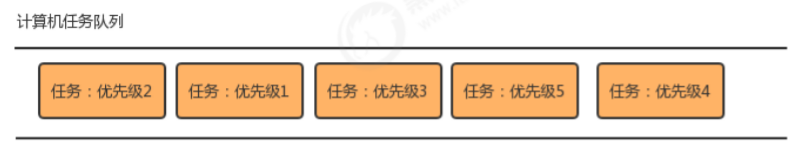
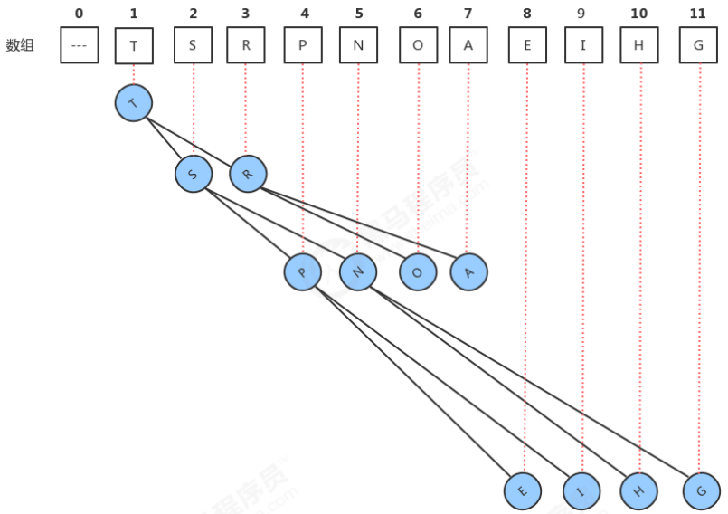
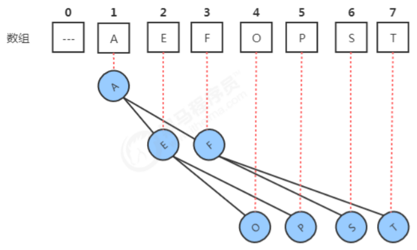
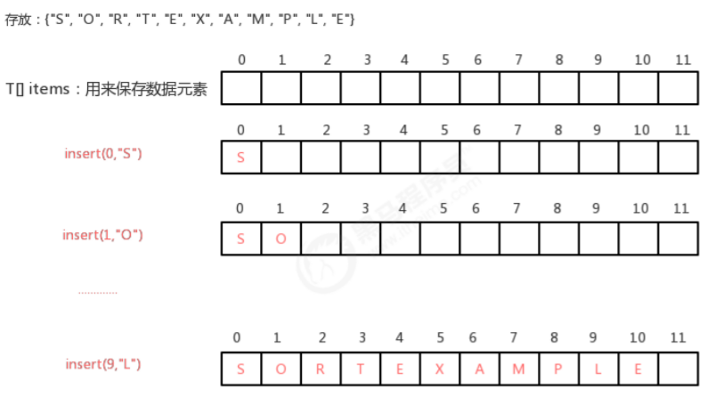
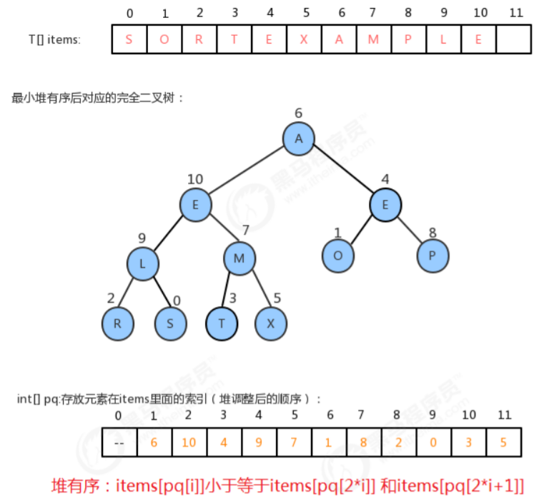
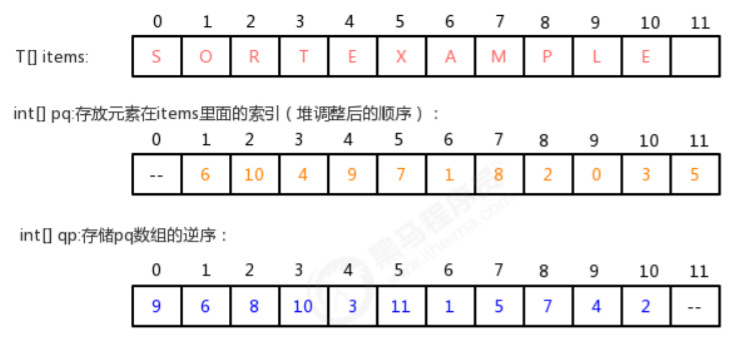

# 概念

普通的队列是一种先进先出的数据结构，元素在队列尾追加，而从队列头删除。在某些情况下，我们可能需要找出队列中的最大值或者最小值，例如使用一个队列保存计算机的任务，一般情况下计算机的任务都是有优先级的，我们需要在这些计算机的任务中找出优先级最高的任务先执行，执行完毕后就需要把这个任务从队列中移除。普通的队列要完成这样的功能，需要每次遍历队列中的所有元素，比较并找出最大值，效率不是很高，这个时候，我们就可以使用一种特殊的队列来完成这种需求，优先队列。

 

优先队列按照其作用不同，可以分为以下两种：

- **最大优先队列**：

  可以获取并删除队列中最大的值

- **最小优先队列**：

  可以获取并删除队列中最小的值

# 1、最大优先队列

我们之前学习过堆，而堆这种结构是可以方便的删除最大的值，所以，接下来我们可以基于堆区实现最大优先队列。

## 1.1 最大优先队列API

| 类名     | MaxPriorityQueue                                             |
| -------- | ------------------------------------------------------------ |
| 构造方法 | MaxPriorityQueue(int capacity)：创建容量为capacity的MaxPriorityQueue对象 |
| 成员变量 | 1.private T[] imtes : 用来存储元素的数组<br/>2.private int N：记录堆中元素的个数 |
| 成员方法 | 1.private boolean less(int i,int j)：判断堆中索引i处的元素是否小于索引j处的元素<br/>2.private void exch(int i,int j):交换堆中i索引和j索引处的值<br/>3.public T delMax():删除队列中最大的元素,并返回这个最大元素<br/>4.public void insert(T t)：往队列中插入一个元素<br/>5.private void swim(int k):使用上浮算法，使索引k处的元素能在堆中处于一个正确的位置<br/>6.private void sink(int k):使用下沉算法，使索引k处的元素能在堆中处于一个正确的位置<br/>7.public int size():获取队列中元素的个数<br/>8.public boolean isEmpty():判断队列是否为空 |

## 1.2 最大优先队列代码实现

```java
/**
 * @Author Maybe
 * Date on 2021/12/11  16:03
 */
//最大优先队列代码
public class MaxPriorityQueue<T extends Comparable<T>> {
    //存储堆中的元素
    private T[] items;
    //记录堆中元素的个数
    private int N;

    public MaxPriorityQueue(int capacity) {
        items = (T[]) new Comparable[capacity + 1];
        N = 0;
    }

    //获取队列中元素的个数
    public int size() {
        return N;
    }

    //判断队列是否为空
    public boolean isEmpty() {
        return N == 0;
    }

    //判断堆中索引i处的元素是否小于索引j处的元素
    private boolean less(int i, int j) {
        return items[i].compareTo(items[j]) < 0;
    }

    //交换堆中i索引和j索引处的值
    private void exch(int i, int j) {
        T tmp = items[i];
        items[i] = items[j];
        items[j] = tmp;
    }

    //往堆中插入一个元素
    public void insert(T t) {
        items[++N] = t;
        swim(N);
    }

    //删除堆中最大的元素,并返回这个最大元素
    public T delMax() {
        T max = items[1];
        //交换索引1处和索引N处的值
        exch(1, N);
        //删除最后位置上的元素
        items[N] = null;
        N--;
        //个数-1
        sink(1);
        return max;
    }

    //使用上浮算法，使索引k处的元素能在堆中处于一个正确的位置
    private void swim(int k) {
        //如果已经到了根结点，就不需要循环了
        while (k > 1) {
            //比较当前结点和其父结点
            if (less(k / 2, k)) {
                //父结点小于当前结点，需要交换
                exch(k / 2, k);
            }
            k = k / 2;
        }
    }

    //使用下沉算法，使索引k处的元素能在堆中处于一个正确的位置
    private void sink(int k) {
        //如果当前已经是最底层了，就不需要循环了
        while (2 * k <= N) {
            //找到子结点中的较大者
            int max = 2 * k;
            if (2 * k + 1 <= N) {
                //存在右子结点
                if (less(2 * k, 2 * k + 1)) {
                    max = 2 * k + 1;
                }
            }
            //比较当前结点和子结点中的较大者，如果当前结点不小，则结束循环
            if (!less(k, max)) {
                break;
            }
            //当前结点小，则交换，
            exch(k, max);
            k = max;
        }
    }
}
```

```java
/**
 * @Author Maybe
 * Date on 2021/12/11  16:06
 */
//测试代码
public class Test {
    public static void main(String[] args) throws Exception {
        String[] arr = {"S", "O", "R", "T", "E", "X", "A", "M", "P", "L", "E"};
        MaxPriorityQueue<String> maxpq = new MaxPriorityQueue<>(20);
        for (String s : arr) {
            maxpq.insert(s);
        }
        System.out.println(maxpq.size());
        String del;
        while (!maxpq.isEmpty()) {
            del = maxpq.delMax();
            System.out.print(del + ",");
        }
    }
}
```

# 2、最小优先队列

最小优先队列实现起来也比较简单，我们同样也可以基于堆来完成最小优先队列。我们前面学习堆的时候，堆中存放数据元素的数组要满足都满足如下特性：

1. **最大的元素放在数组的索引1处。**
2. **每个结点的数据总是大于等于它的两个子结点的数据。**

 

其实我们之前实现的堆可以把它叫做最大堆，我们可以用相反的思想实现最小堆，让堆中存放数据元素的数组满足如下特性：

1. 最小的元素放在数组的索引1处。
2. 每个结点的数据总是小于等于它的两个子结点的数据。

 

这样我们就能快速的访问到堆中最小的数据。

## 2.1 最小优先队列API

| 类名     | MinPriorityQueue                                             |
| -------- | ------------------------------------------------------------ |
| 构造方法 | MinPriorityQueue(int capacity)：创建容量为capacity的MinPriorityQueue对象 |
| 成员变量 | 1.private T[] imtes : 用来存储元素的数组<br/>2.private int N：记录堆中元素的个数 |
| 成员方法 | 1.private boolean less(int i,int j)：判断堆中索引i处的元素是否小于索引j处的元素<br/>2.private void exch(int i,int j):交换堆中i索引和j索引处的值<br/>3.public T delMin():删除队列中最小的元素,并返回这个最小元素<br/>4.public void insert(T t)：往队列中插入一个元素<br/>5.private void swim(int k):使用上浮算法，使索引k处的元素能在堆中处于一个正确的位置<br/>6.private void sink(int k):使用下沉算法，使索引k处的元素能在堆中处于一个正确的位置<br/>7.public int size():获取队列中元素的个数<br/>8.public boolean isEmpty():判断队列是否为空 |

## 2.2 最小优先队列代码实现

```java
/**
 * @Author Maybe
 * Date on 2021/12/11  16:11
 */
//最小优先队列代码
public class MinPriorityQueue<T extends Comparable<T>> {
    //存储堆中的元素
    private T[] items;
    //记录堆中元素的个数
    private int N;

    public MinPriorityQueue(int capacity) {
        items = (T[]) new Comparable[capacity + 1];
        N = 0;
    }

    //获取队列中元素的个数
    public int size() {
        return N;
    }

    //判断队列是否为空
    public boolean isEmpty() {
        return N == 0;
    }

    //判断堆中索引i处的元素是否小于索引j处的元素
    private boolean less(int i, int j) {
        return items[i].compareTo(items[j]) < 0;
    }

    //交换堆中i索引和j索引处的值
    private void exch(int i, int j) {
        T tmp = items[i];
        items[i] = items[j];
        items[j] = tmp;
    }

    //往堆中插入一个元素
    public void insert(T t) {
        items[++N] = t;
        swim(N);
    }

    //删除堆中最小的元素,并返回这个最小元素
    public T delMin() {
        //索引1处的值是最小值
        T min = items[1];
        //交换索引1处和索引N处的值
        exch(1, N);
        //删除索引N处的值
        items[N] = null;
        //数据元素-1
        N--;
        //对索引1处的值做下沉，使堆重新有序
        sink(1);
        //返回被删除的值
        return min;
    }

    //使用上浮算法，使索引k处的元素能在堆中处于一个正确的位置
    private void swim(int k) {
        //如果没有父结点，则不再上浮
        while (k > 1) {
            //如果当前结点比父结点小，则交换
            if (less(k, k / 2)) {
                exch(k, k / 2);
            }
            k = k / 2;
        }
    }

    //使用下沉算法，使索引k处的元素能在堆中处于一个正确的位置
    private void sink(int k) {
        //如果没有子结点，则不再下沉
        while (2 * k <= N) {
            //找出子结点中的较小值的索引
            int min = 2 * k;
            if (2 * k + 1 <= N && less(2 * k + 1, 2 * k)) {
                min = 2 * k + 1;
            }
            //如果当前结点小于子结点中的较小值，则结束循环
            if (less(k, min)) {
                break;
            }
            //当前结点大，交换
            exch(min, k);
            k = min;
        }
    }
}
```

```java
/**
 * @Author Maybe
 * Date on 2021/12/11  16:14
 */
//测试代码
public class Test {
    public static void main(String[] args) throws Exception {
        String[] arr = {"S", "O", "R", "T", "E", "X", "A", "M", "P", "L", "E"};
        MinPriorityQueue<String> minpq = new MinPriorityQueue<>(20);
        for (String s : arr) {
            minpq.insert(s);
        }
        System.out.println(minpq.size());
        String del;
        while (!minpq.isEmpty()) {
            del = minpq.delMin();
            System.out.print(del + ",");
        }
    }
}
```

# 3、索引优先队列

在之前实现的最大优先队列和最小优先队列，他们可以分别快速访问到队列中最大元素和最小元素，但是他们有一个缺点，就是没有办法通过索引访问已存在于优先队列中的对象，并更新它们。为了实现这个目的，在优先队列的基础上，学习一种新的数据结构，索引优先队列。接下来我们以最小索引优先队列举列。

## 3.1 索引优先队列的实现思路

**步骤一：**

存储数据时，给每一个数据元素关联一个整数，例如insert(int k,T t),我们可以看做k是t关联的整数，那么我们的实现需要通过k这个值，快速获取到队列中t这个元素，此时有个k这个值需要具有唯一性。

最直观的想法就是我们可以用一个T[] items数组来保存数据元素，在insert(int k,T t)完成插入时，可以把k看做是items数组的索引，把t元素放到items数组的索引k处，这样我们再根据k获取元素t时就很方便了，直接就可以拿到items[k]即可。

 

**步骤二：**

步骤一完成后的结果，虽然我们给每个元素关联了一个整数，并且可以使用这个整数快速的获取到该元素，但是，items数组中的元素顺序是随机的，并不是堆有序的，所以，为了完成这个需求，我们可以增加一个数组int[]pq,来保存每个元素在items数组中的索引，pq数组需要堆有序，也就是说，pq[1]对应的数据元素items[pq[1]]要小于等于pq[2]和pq[3]对应的数据元素items[pq[2]]和items[pq[3]]。

 

**步骤三：**

通过步骤二的分析，我们可以发现，其实我们通过上浮和下沉做堆调整的时候，其实调整的是pq数组。如果需要对items中的元素进行修改，比如让items[0]=“H”,那么很显然，我们需要对pq中的数据做堆调整，而且是调整pq[9]中元素的位置。但现在就会遇到一个问题，我们修改的是items数组中0索引处的值，如何才能快速的知道需要挑中pq[9]中元素的位置呢？

最直观的想法就是遍历pq数组，拿出每一个元素和0做比较，如果当前元素是0，那么调整该索引处的元素即可，但是效率很低。

我们可以另外增加一个数组，int[] qp,用来存储pq的逆序。例如：

在pq数组中：pq[1]=6;

那么在qp数组中，把6作为索引，1作为值，结果是：qp[6]=1;

 

当有了pq数组后，如果我们修改items[0]="H"，那么就可以先通过索引0，在qp数组中找到qp的索引：qp[0]=9，那么直接调整pq[9]即可。

## 3.2 索引优先队列的API设计

| 类名     | IndexMinPriority                                             |
| -------- | ------------------------------------------------------------ |
| 构造方法 | IndexMinPriorityQueue(int capacity)：创建容量为capacity的IndexMinPriorityQueue对象 |
| 成员变量 | 1.private T[] imtes : 用来存储元素的数组<br/>2.private int[] pq:保存每个元素在items数组中的索引，pq数组需要堆有序<br/>3.private int [] qp:保存qp的逆序，pq的值作为索引，pq的索引作为值<br/>4.private int N：记录堆中元素的个数 |
| 成员方法 | 1.private boolean less(int i,int j)：判断堆中索引i处的元素是否小于索引j处的元素<br/>2.private void exch(int i,int j):交换堆中i索引和j索引处的值<br/>3.public int delMin():删除队列中最小的元素,并返回该元素关联的索引<br/>4.public void insert(int i,T t)：往队列中插入一个元素,并关联索引i<br/>5.private void swim(int k):使用上浮算法，使索引k处的元素能在堆中处于一个正确的位置<br/>6.private void sink(int k):使用下沉算法，使索引k处的元素能在堆中处于一个正确的位置<br/>7.public int size():获取队列中元素的个数<br/>8.public boolean isEmpty():判断队列是否为空<br/>9.public boolean contains(int k):判断k对应的元素是否存在<br/>10.public void changeItem(int i, T t):把与索引i关联的元素修改为为t<br/>11.public int minIndex():最小元素关联的索引<br/>12.public void delete(int i):删除索引i关联的元素 |

## 3.3 索引优先队列的代码实现

```java
/**
 * @Author Maybe
 * Date on 2021/12/11  16:22
 */
public class IndexMinPriorityQueue<T extends Comparable<T>> {
    //存储堆中的元素
    private T[] items;
    //保存每个元素在items数组中的索引，pq数组需要堆有序
    private int[] pq;
    //保存qp的逆序，pq的值作为索引，pq的索引作为值
    private int[] qp;
    //记录堆中元素的个数
    private int N;

    public IndexMinPriorityQueue(int capacity) {
        items = (T[]) new Comparable[capacity + 1];
        pq = new int[capacity + 1];
        qp = new int[capacity + 1];
        N = 0;
        for (int i = 0; i < qp.length; i++) {
            //默认情况下，qp逆序中不保存任何索引
            qp[i] = -1;
        }
    }

    //获取队列中元素的个数
    public int size() {
        return N;
    }

    //判断队列是否为空
    public boolean isEmpty() {
        return N == 0;
    }

    //判断堆中索引i处的元素是否小于索引j处的元素
    private boolean less(int i, int j) {
        //先通过pq找出items中的索引，然后再找出items中的元素进行对比
        return items[pq[i]].compareTo(items[pq[j]]) < 0;
    }

    //交换堆中i索引和j索引处的值
    private void exch(int i, int j) {
        //先交换pq数组中的值
        int tmp = pq[i];
        pq[i] = pq[j];
        pq[j] = tmp;
        //更新qp数组中的值
        qp[pq[i]] = i;
        qp[pq[j]] = j;
    }

    //判断k对应的元素是否存在
    public boolean contains(int k) {
        //默认情况下，qp的所有元素都为-1，如果某个位置插入了数据，则不为-1
        return qp[k] != -1;
    }

    //最小元素关联的索引
    public int minIndex() {
        //pq的索引1处，存放的是最小元素在items中的索引
        return pq[1];
    }

    //往队列中插入一个元素,并关联索引i
    public void insert(int i, T t) {
        //如果索引i处已经存在了元素，则不让插入
        if (contains(i)) {
            throw new RuntimeException("该索引已经存在");
        }
        //个数+1
        N++;
        //把元素存放到items数组中
        items[i] = t;
        //使用pq存放i这个索引
        pq[N] = i;
        //在qp的i索引处存放N
        qp[i] = N;
        //上浮items[pq[N]],让pq堆有序
        swim(N);
    }

    //删除队列中最小的元素,并返回该元素关联的索引
    public int delMin() {
        //找到items中最小元素的索引
        int minIndex = pq[1];
        //交换pq中索引1处的值和N处的值
        exch(1, N);
        //删除qp中索引pq[N]处的值
        qp[pq[N]] = -1;
        //删除pq中索引N处的值
        pq[N] = -1;
        //删除items中的最小元素
        items[minIndex] = null;
        //元素数量-1
        N--;
        //对pq[1]做下沉，让堆有序
        sink(1);
        return minIndex;
    }

    //删除索引i关联的元素
    public void delete(int i) {
        //找出i在pq中的索引
        int k = qp[i];
        //把pq中索引k处的值和索引N处的值交换
        exch(k, N);
        //删除qp中索引pq[N]处的值
        qp[pq[N]] = -1;
        //删除pq中索引N处的值
        pq[N] = -1;
        //删除items中索引i处的值
        items[i] = null;
        //元素数量-1
        N--;
        //对pq[k]做下沉，让堆有序
        sink(k);
        //对pq[k]做上浮，让堆有序
        swim(k);
    }

    //把与索引i关联的元素修改为为t
    public void changeItem(int i, T t) {
        //修改items数组中索引i处的值为t
        items[i] = t;
        //找到i在pq中的位置
        int k = qp[i];
        //对pq[k]做下沉，让堆有序
        sink(k);
        //对pq[k]做上浮，让堆有序
        swim(k);
    }

    //使用上浮算法，使索引k处的元素能在堆中处于一个正确的位置
    private void swim(int k) {
        //如果已经到了根结点，则结束上浮
        while (k > 1) {
            //比较当前结点和父结点，如果当前结点比父结点小，则交换位置
            if (less(k, k / 2)) {
                exch(k, k / 2);
            }
            k = k / 2;
        }
    }

    //使用下沉算法，使索引k处的元素能在堆中处于一个正确的位置
    private void sink(int k) {
        //如果当前结点已经没有子结点了，则结束下沉
        while (2 * k <= N) {
            //找出子结点中的较小值
            int min = 2 * k;
            if (2 * k + 1 <= N && less(2 * k + 1, 2 * k)) {
                min = 2 * k + 1;
            }
            //如果当前结点的值比子结点中的较小值小，则结束下沉
            if (less(k, min)) {
                break;
            }
            exch(k, min);
            k = min;
        }
    }
}
```

```java
/**
 * @Author Maybe
 * Date on 2021/12/11  16:28
 */
//测试代码
public class Test {
    public static void main(String[] args) {
        String[] arr = {"S", "O", "R", "T", "E", "X", "A", "M", "P", "L", "E"};
        IndexMinPriorityQueue<String> indexMinPQ = new IndexMinPriorityQueue<>(20);
        //插入
        for (int i = 0; i < arr.length; i++) {
            indexMinPQ.insert(i, arr[i]);
        }
        System.out.println(indexMinPQ.size());
        //获取最小值的索引
        System.out.println(indexMinPQ.minIndex());
        //测试修改
        indexMinPQ.changeItem(0, "Z");
        int minIndex = -1;
        while (!indexMinPQ.isEmpty()) {
            minIndex = indexMinPQ.delMin();
            System.out.print(minIndex + ",");
        }
    }
}
```

