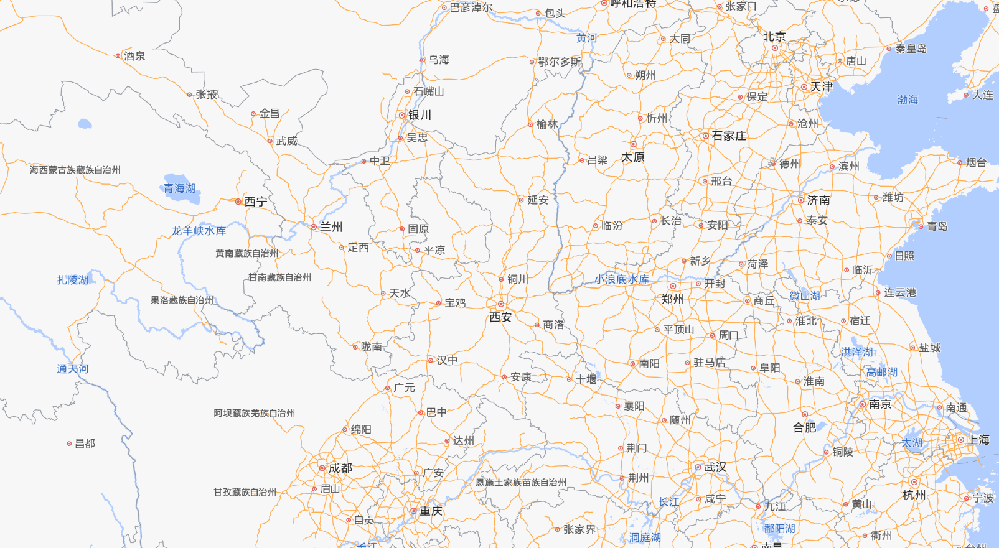
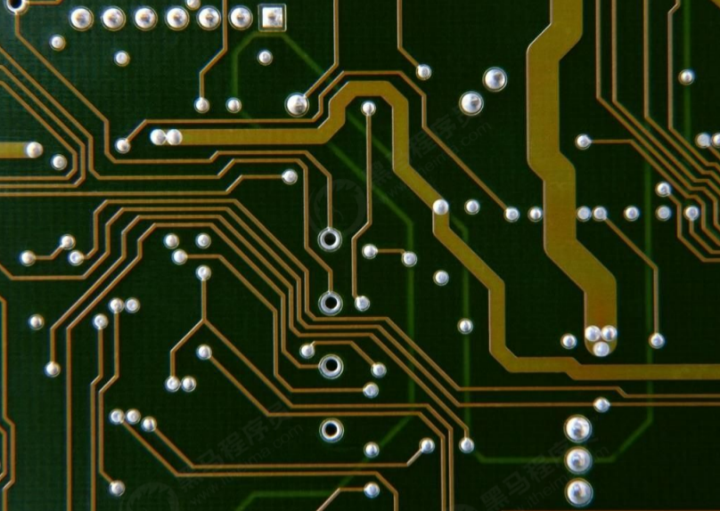
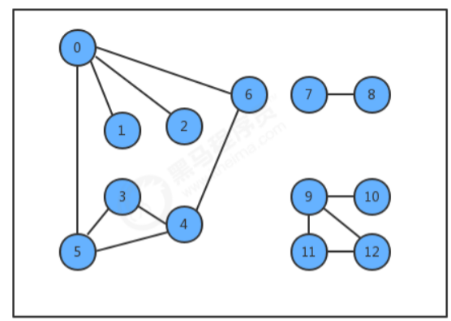

# 1、图的入门

## 1.1 图的实际应用

在现实生活中，有许多应用场景会包含很多点以及点点之间的连接，而这些应用场景我们都可以用即将要学习的图这种数据结构去解决。

**地图：**

我们生活中经常使用的地图，基本上是由城市以及连接城市的道路组成，如果我们把城市看做是一个一个的点，把道路看做是一条一条的连接，那么地图就是我们将要学习的图这种数据结构。

**电路图：**

下面是一个我们生活中经常见到的集成电路板，它其实就是由一个一个触点组成，并把触点与触点之间通过线进行连接，这也是我们即将要学习的图这种数据结构的应用场景

## 1.2 图的定义及分类

**定义：**图是由一组顶点和一组能够将两个顶点相连的边组成的

**特殊的图：**

1. 自环：即一条连接一个顶点和其自身的边；

2. 平行边：连接同一对顶点的两条边；

**图的分类：**

按照连接两个顶点的边的不同，可以把图分为以下两种：

- 无向图：边仅仅连接两个顶点，没有其他含义；
- 有向图：边不仅连接两个顶点，并且具有方向；

