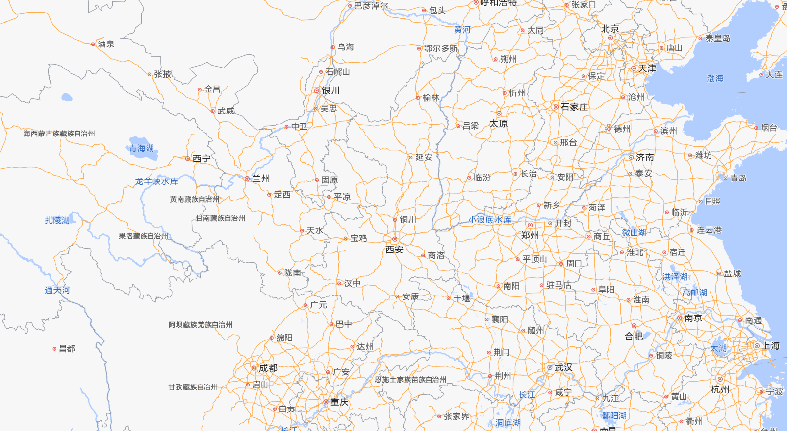
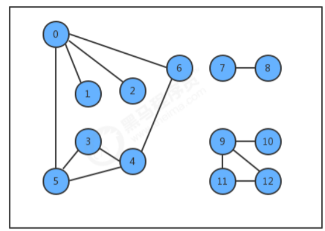
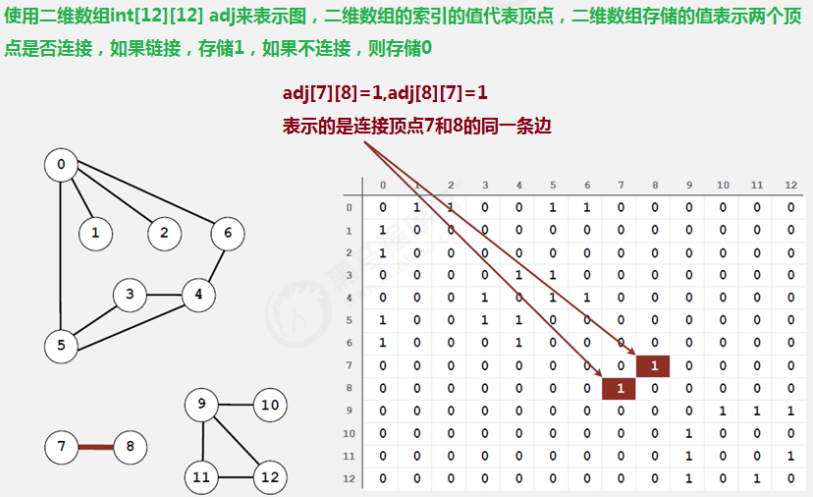
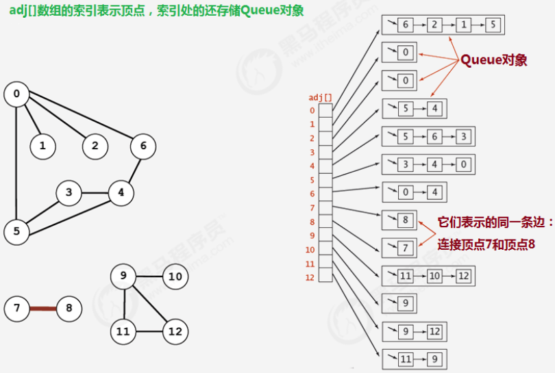
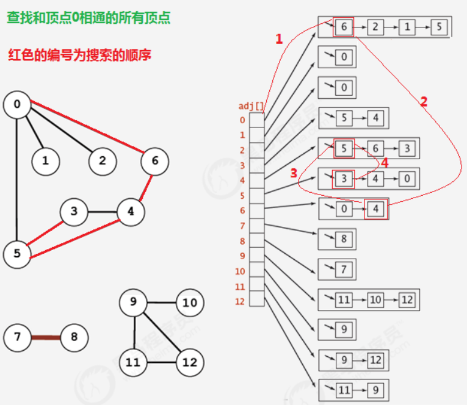
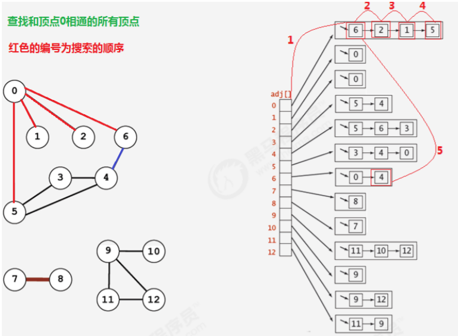

# 1、图的入门

## 1.1 图的实际应用

在现实生活中，有许多应用场景会包含很多点以及点点之间的连接，而这些应用场景我们都可以用即将要学习的图这种数据结构去解决。

**地图：**

我们生活中经常使用的地图，基本上是由城市以及连接城市的道路组成，如果我们把城市看做是一个一个的点，把道路看做是一条一条的连接，那么地图就是我们将要学习的图这种数据结构。



**电路图：**

下面是一个我们生活中经常见到的集成电路板，它其实就是由一个一个触点组成，并把触点与触点之间通过线进行连接，这也是我们即将要学习的图这种数据结构的应用场景


## 1.2 图的定义及分类

**定义：**图是由一组顶点和一组能够将两个顶点相连的边组成的



**特殊的图：**

1. 自环：即一条连接一个顶点和其自身的边；

2. 平行边：连接同一对顶点的两条边；


**图的分类：**

按照连接两个顶点的边的不同，可以把图分为以下两种：

- 无向图：边仅仅连接两个顶点，没有其他含义；
- 有向图：边不仅连接两个顶点，并且具有方向；

# 2、无向图

## 2.1 图的相关术语

**相邻顶点：**
当两个顶点通过一条边相连时，我们称这两个顶点是相邻的，并且称这条边依附于这两个顶点。

**度：**
某个顶点的度就是依附于该顶点的边的个数

**子图：**

是一幅图的所有边的子集(包含这些边依附的顶点)组成的图；

**路径：**
是由边顺序连接的一系列的顶点组成

**环：**
是一条至少含有一条边且终点和起点相同的路径

 

**连通图：**
如果图中任意一个顶点都存在一条路径到达另外一个顶点，那么这幅图就称之为连通图

**连通子图：**
一个非连通图由若干连通的部分组成，每一个连通的部分都可以称为该图的连通子图

## 2.2 图的存储结构

要表示一幅图，只需要表示清楚以下两部分内容即可：

1. 图中所有的顶点；

2. 所有连接顶点的边；

常见的图的存储结构有两种：**邻接矩阵**和**邻接表**

### 邻接矩阵

1. 使用一个V*V的二维数组`int[V][V] adj`，把索引的值看做是顶点；

2. 如果顶点v和顶点w相连，我们只需要将`adj[v][w]`和`adj[w][v]`的值设置为1,否则设置为0即可。

 

很明显，邻接矩阵这种存储方式的空间复杂度是V^2的，如果我们处理的问题规模比较大的话，内存空间极有可能不够用。

### 邻接表

1. 使用一个大小为V的数组 Queue[V] adj，把索引看做是顶点；

2. 每个索引处adj[v]存储了一个队列，该队列中存储的是所有与该顶点相邻的其他顶点

 

很明显，邻接表的空间并不是是线性级别的，所以后面我们一直采用邻接表这种存储形式来表示图。

## 2.3 图的实现

### API设计

| 类名     | Graph                                                        |
| -------- | ------------------------------------------------------------ |
| 构造方法 | Graph(int V)：创建一个包含V个顶点但不包含边的图              |
| 成员变量 | 1.private final int V: 记录顶点数量<br/>2.private int E: 记录边数量<br/>3.private Queue[] adj: 邻接表 |
| 成员方法 | 1.public int V():获取图中顶点的数量<br/>2.public int E():获取图中边的数量<br/>3.public void addEdge(int v,int w):向图中添加一条边 v-w<br/>4.public Queue adj(int v)：获取和顶点v相邻的所有顶点 |

### 代码实现

```java
/**
 * @Author Maybe
 * Date on 2021/12/15  15:17
 */

public class Graph {
    //顶点数目
    private final int V;
    //边的数目
    private int E;
    //邻接表
    private Queue<Integer>[] adj;

    public Graph(int V) {
        //初始化顶点数量
        this.V = V;
        //初始化边的数量
        this.E = 0;
        //初始化邻接表
        this.adj = new Queue[V];
        //初始化邻接表中的空队列
        for (int i = 0; i < adj.length; i++) {
            adj[i] = new Queue<Integer>();
        }
    }

    //获取顶点数目
    public int V() {
        return V;
    }

    //获取边的数目
    public int E() {
        return E;
    }

    //向图中添加一条边 v-w
    public void addEdge(int v, int w) {
        //把w添加到v的链表中，这样顶点v就多了一个相邻点w
        adj[v].enqueue(w);
        //把v添加到w的链表中，这样顶点w就多了一个相邻点v
        adj[w].enqueue(v);
        //边的数目自增1
        E++;
    }

    //获取和顶点v相邻的所有顶点
    public Queue<Integer> adj(int v) {
        return adj[v];
    }
}
```

## 2.4 图的搜索

在很多情况下，我们需要遍历图，得到图的一些性质，例如，找出图中与指定的顶点相连的所有顶点，或者判定某个顶点与指定顶点是否相通，是非常常见的需求。

有关图的搜索，最经典的算法有**深度优先搜索（DFS）**和**广度优先搜索（BFS）**，接下来我们分别讲解这两种搜索算法。

### 深度优先算法

所谓的深度优先搜索，指的是在搜索时，如果遇到一个结点既有子结点，又有兄弟结点，那么先找子结点，然后找兄弟结点。

 

很明显，在由于边是没有方向的，所以，如果4和5顶点相连，那么4会出现在5的相邻链表中，5也会出现在4的相邻链表中，那么为了不对顶点进行重复搜索，应该要有相应的标记来表示当前顶点有没有搜索过，可以使用一个布尔类型的数组 boolean[V] marked，索引代表顶点，值代表当前顶点是否已经搜索，如果已经搜索，标记为true，如果没有搜索，标记为false；

1) 深度优先遍历，从初始访问结点出发，初始访问结点可能有多个邻接结点，深度优先遍历的策略就是首先访问 第一个邻接结点，然后再以这个被访问的邻接结点作为初始结点，访问它的第一个邻接结点， 可以这样理解： 每次都在访问完当前结点后首先访问当前结点的第一个邻接结点。 

2) 我们可以看到，这样的访问策略是优先往纵向挖掘深入，而不是对一个结点的所有邻接结点进行横向访问。 

3) 显然，深度优先搜索是一个递归的过程

#### DFS的API设计

| 类名     | DepthFirstSearch                                             |
| -------- | ------------------------------------------------------------ |
| 构造方法 | DepthFirstSearch(Graph G,int s)：构造深度优先搜索对象，使用深度优先搜索找出G图中s顶点的所有相通顶点 |
| 成员变量 | 1.private boolean[] marked: 索引代表顶点，值表示当前顶点是否已经被搜索<br/>2.private int count：记录有多少个顶点与s顶点相通 |
| 成员方法 | 1.private void dfs(Graph G, int v)：使用深度优先搜索找出G图中v顶点的所有相通顶点<br/>2.public boolean marked(int w):判断w顶点与s顶点是否相通<br/>3.public int count():获取与顶点s相通的所有顶点的总数 |

#### DFS代码演示

```java
/**
 * @Author Maybe
 * Date on 2021/12/15  15:57
 */
//深度优先遍历算法
public class DFS {
    //索引代表顶点，值表示当前顶点是否已经被搜索
    private boolean[] marked;
    //记录有多少个顶点与s顶点相通
    private int count;

    //构造深度优先搜索对象，使用深度优先搜索找出G图中s顶点的所有相邻顶点
    public void DepthFirstSearch(Graph G, int s) {
        //创建一个和图的顶点数一样大小的布尔数组
        marked = new boolean[G.V()];
        //搜索G图中与顶点s相同的所有顶点
        dfs(G, s);
    }

    //使用深度优先搜索找出G图中v顶点的所有相邻顶点
    private void dfs(Graph G, int v) {
        //把当前顶点标记为已搜索
        marked[v] = true;
        //遍历v顶点的邻接表，得到每一个顶点w
        for (Integer w : G.adj(v)) {
            //如果当前顶点w没有被搜索过，则递归搜索与w顶点相通的其他顶点
            if (!marked[w]) {
                dfs(G, w);
            }
        }
        //相通的顶点数量+1
        count++;
    }

    //判断w顶点与s顶点是否相通
    public boolean marked(int w) {
        return marked[w];
    }

    //获取与顶点s相通的所有顶点的总数
    public int count() {
        return count;
    }
}
```

### 广度优先算法

所谓的深度优先搜索，指的是在搜索时，如果遇到一个结点既有子结点，又有兄弟结点，那么先找兄弟结点，然后找子结点。

 

类似于一个**分层搜索**的过程，广度优先遍历需要使用一个队列以保持访问过的结点的顺序，以便按这个顺序来访问这些结点的邻接结点

#### BFS的API设计

| 类名     | BreadthFirstSearch                                           |
| -------- | ------------------------------------------------------------ |
| 构造方法 | BreadthFirstSearch(Graph G,int s)：构造广度优先搜索对象，使用广度优先搜索找出G图中s顶点的所有相邻顶点 |
| 成员变量 | 1.private boolean[] marked: 索引代表顶点，值表示当前顶点是否已经被搜索<br/>2.private int count：记录有多少个顶点与s顶点相通<br/>3.private Queue waitSearch: 用来存储待搜索邻接表的点 |
| 成员方法 | 1.private void bfs(Graph G, int v)：使用广度优先搜索找出G图中v顶点的所有相邻顶点<br/>2.public boolean marked(int w):判断w顶点与s顶点是否相通<br/>3.public int count():获取与顶点s相通的所有顶点的总数 |

#### BFS代码演示

```java
/**
 * @Author Maybe
 * Date on 2021/12/15  16:16
 */

public class BFS {
    //索引代表顶点，值表示当前顶点是否已经被搜索
    private boolean[] marked;
    //记录有多少个顶点与s顶点相通
    private int count;
    //用来存储待搜索邻接表的点
    private Queue<Integer> waitSearch;

    //构造广度优先搜索对象，使用广度优先搜索找出G图中s顶点的所有相邻顶点
    public void BreadthFirstSearch(Graph G, int s) throws InterruptedException {
        //创建一个和图的顶点数一样大小的布尔数组
        marked = new boolean[G.V()];
        //初始化待搜索顶点的队列
        waitSearch = new Queue<Integer>();
        //搜索G图中与顶点s相同的所有顶点
        dfs(G, s);
    }

    //使用广度优先搜索找出G图中v顶点的所有相邻顶点
    private void dfs(Graph G, int v) throws InterruptedException {
        //把当前顶点v标记为已搜索
        marked[v] = true;
        //把当前顶点v放入到队列中，等待搜索它的邻接表
        waitSearch.enqueue(v);
        //使用while循环从队列中拿出待搜索的顶点wait，进行搜索邻接表
        while (!waitSearch.isEmpty()) {
            Integer wait = waitSearch.dequeue();
            //遍历wait顶点的邻接表，得到每一个顶点w
            for (Integer w : G.adj(wait)) {
                //如果当前顶点w没有被搜索过，则递归搜索与w顶点相通的其他顶点
                if (!marked[w]) {
                    dfs(G, w);
                }
            }
        }
        //相通的顶点数量+1
        count++;
    }

    //判断w顶点与s顶点是否相通
    public boolean marked(int w) {
        return marked[w];
    }

    //获取与顶点s相通的所有顶点的总数
    public int count() {
        return count;
    }
}
```

