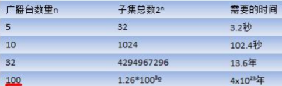

 

# 1、二分查找算法（非递归）

## 1.1 二分查找算法（非递归）介绍

1. 前面学了二分查找算法，是使用递归的方式，下面看一下二分查找算法的非递归方式 

2. **二分查找法只适用于从有序的数列中进行查找**（比如数字和字母等），将数列排序后再进行查找 

3. 二分查找法的运行时间为对数时间 O(㏒₂n) ，即查找到需要的目标位置最多只需要㏒₂n 步，假设从[0,99]的 队列(100 个数，即 n=100)中寻到目标数 30，则需要查找步数为㏒₂100 , 即最多需要查找 7 次( 2^6 < 100 < 2^7)

## 1.2 二分查找算法（非递归）代码实现

数组 {1, 3, 8, 10, 11, 67, 100} , 编程实现二分查找， 要求使用非递归的方式完成

```java
/**
 * @Author Maybe
 * Date on 2021/12/13  20:26
 */
//非递归
public class BinarySearchNoRecur {
    public static void main(String[] args) {
        //测试
        int[] arr = {1, 3, 8, 10, 11, 67, 100};
        int index = binarySearch(arr, 100);
        System.out.println("index=" + index);
    }

    /**
     * 二分查找的非递归实现
     *
     * @param arr    待查找的数组, arr 是升序排序
     * @param target 需要查找的数
     * @return 返回对应下标，-1 表示没有找到
     */
    public static int binarySearch(int[] arr, int target) {
        int left = 0;
        int right = arr.length - 1;
        while (left <= right) {
            //说明继续查找
            int mid = (left + right) / 2;
            if (arr[mid] == target) {
                return mid;
            } else if (arr[mid] > target) {
                right = mid - 1;
                //需要向左边查找
            } else {
                left = mid + 1;
                //需要向右边查找
            }
        }
        return -1;
    }
}
```

# 2、分治算法

## 2.1 分治算法介绍

分治法是一种很重要的算法。字面上的解释是“分而治之”，就是把一个复杂的问题分成两个或更多的相同或 相似的子问题，再把子问题分成更小的子问题……直到最后子问题可以简单的直接求解，原问题的解即子问题 的解的合并。这个技巧是很多高效算法的基础，如排序算法(快速排序，归并排序)，傅立叶变换(快速傅立叶变换)……

分治算法可以求解的一些经典问题：

- 二分搜索 
- 大整数乘法 
- 棋盘覆盖 
- 合并排序 
- 快速排序 
- 线性时间选择 
- 最接近点对问题 
- 循环赛日程表 
- **汉诺塔**

## 2.2 分治算法的基本步骤

**分治法在每一层递归上都有三个步骤：** 

**1) 分解：将原问题分解为若干个规模较小，相互独立，与原问题形式相同的子问题** 

**2) 解决：若子问题规模较小而容易被解决则直接解，否则递归地解各个子问题**

**3) 合并：将各个子问题的解合并为原问题的解。**

## 2.3 分治算法的设计模式

```
Divide-and-Conquer(P)

1. if |P|≤n0

2. then return(ADHOC(P))

3. 将P分解为较小的子问题 P1 ,P2 ,...,Pk

4. for i←1 to k

5. do yi ← Divide-and-Conquer(Pi) △ 递归解决Pi

6. T ← MERGE(y1,y2,...,yk) △ 合并子问题

7. return(T)

其中|P|表示问题P的规模；n0为一阈值，表示当问题P的规模不超过n0时，问题已容易直接解出，不必再继续分解。ADHOC(P)是该分治法中的基本子算法，用于直接解小规模的问题P。因此，当P的规模不超过n0时直接用算法ADHOC(P)求解。算法MERGE(y1,y2,...,yk)是该分治法中的合并子算法，用于将P的子问题P1 ,P2 ,...,Pk的相应的解y1,y2,...,yk合并为P的解。
```

**实际上就是类似于数学归纳法，找到解决本问题的求解方程公式，然后根据方程公式设计递归程序。**

## 2.4 分治算法的代码演示（汉诺塔）

汉诺塔的传说 

汉诺塔：汉诺塔（又称河内塔）问题是源于印度一个古老传说的益智玩具。大梵天创造世界的时候做了三根金刚石柱子，在一根柱子上从下往上按照大小顺序摞着 64 片黄金圆盘。大梵天命令婆罗门把圆盘从下面开始按大小 顺序重新摆放在另一根柱子上。并且规定，在小圆盘上不能放大圆盘，在三根柱子之间一次只能移动一个圆盘。 假如每秒钟一次，共需多长时间呢？移完这些金片需要 5845.54 亿年以上，太阳系的预期寿命据说也就是数百 亿年。真的过了 5845.54 亿年，地球上的一切生命，连同梵塔、庙宇等，都早已经灰飞烟灭。

思路分析：

1) 如果是有一个盘， A->C 
   如果我们有 n >= 2 情况，我们总是可以看做是两个盘 1.最下边的盘 2. 上面的盘 

2) 先把 最上面的盘 A->B 

3) 把最下边的盘 A->C 

4) 把 B 塔的所有盘 从 B->C

```java
/**
 * @Author Maybe
 * Date on 2021/12/13  20:58
 */

public class HanoiTower {
    public static void main(String[] args) {
        hanoiTower(5, 'A', 'B', 'C');
    }

    //汉诺塔的移动的方法
    // 使用分治算法
    public static void hanoiTower(int num, char a, char b, char c) {
        //如果只有一个盘
        if (num == 1) {
            System.out.println("第 1 个盘从 " + a + "->" + c);
        } else {
            //如果我们有 n >= 2 情况，我们总是可以看做是两个盘 1.最下边的一个盘 2. 上面的所有盘
            // 1. 先把 最上面的所有盘 A->B， 移动过程会使用到 c
            hanoiTower(num - 1, a, c, b);
            //2. 把最下边的盘 A->C
            System.out.println("第" + num + "个盘从 " + a + "->" + c);
            //3. 把 B 塔的所有盘 从 B->C , 移动过程使用到 a 塔
            hanoiTower(num - 1, b, a, c);
        }
    }
}
```

# 3、动态规划算法

## 3.1 动态规划算法介绍

1. 动态规划(Dynamic Programming)算法的核心思想是：将**大问题划分为小问题**进行解决，从而一步步获取最优解 的处理算法 

2. 动态规划算法与分治算法类似，其基本思想也是将待求解问题分解成若干个子问题，先求解子问题，然后从这 些子问题的解得到原问题的解。 

3. 与分治法不同的是，适合于用动态规划求解的问题，经分解得到**子问题往往不是互相独立的**。 ( 即下一个子 阶段的求解是建立在上一个子阶段的解的基础上，进行进一步的求解 ) 

4. 动态规划可以通过填表的方式来逐步推进，得到最优解

## 3.2 动态规划代码演示（背包问题）

背包问题：有一个背包，容量为 4 磅 ， 现有如下物品

| 物品    | 重量 | 价格 |
| ------- | ---- | ---- |
| 吉他(G) | 1    | 1500 |
| 音响(S) | 4    | 3000 |
| 电脑(L) | 3    | 2000 |

1. 要求达到的目标为装入的背包的总价值最大，并且重量不超出 

2. 要求装入的物品不能重复

思路分析和图解： 

1. 背包问题主要是指一个给定容量的背包、若干具有一定价值和重量的物品，如何选择物品放入背包使物品的价 值最大。其中又分 **01** **背包**和**完全背包**(完全背包指的是：每种物品都有无限件可用) 

2. 里的问题属于 **01** **背包**，即每个物品最多放一个。而无限背包可以转化为 01 背包。 

3. 算法的主要思想，利用动态规划来解决。每次遍历到的第 i 个物品，根据 w[i]和 v[i]来确定是否需要将该物品 放入背包中。即对于给定的 n 个物品，设 v[i]、w[i]分别为第 i 个物品的价值和重量，C 为背包的容量。再令 v[i][j] 表示在前 i 个物品中能够装入容量为 j 的背包中的最大价值。则我们有下面的结果：

```java
/**
 * @Author Maybe
 * Date on 2021/12/14  15:37
 */
//背包问题
public class KnapsackProblem {
    public static void main(String[] args) {
        // TODO Auto-generated method stub
        int[] w = {1, 4, 3};//物品的重量
        int[] val = {1500, 3000, 2000}; //物品的价值 这里 val[i] 就是前面讲的 v[i]
        int m = 4; //背包的容量
        int n = val.length; //物品的个数
        //创建二维数组，v[i][j] 表示在前 i 个物品中能够装入容量为 j 的背包中的最大价值
        int[][] v = new int[n + 1][m + 1];
        //为了记录放入商品的情况，我们定一个二维数组
        int[][] path = new int[n + 1][m + 1];
        //初始化第一行和第一列, 这里在本程序中，可以不去处理，因为默认就是 0
        for (int i = 0; i < v.length; i++) {
            v[i][0] = 0; //将第一列设置为 0
        }
        for (int i = 0; i < v[0].length; i++) {
            v[0][i] = 0; //将第一行设置 0 }
        }

        //根据前面得到公式来动态规划处理
        for (int i = 1; i < v.length; i++) { //不处理第一行 i 是从 1 开始的
            for (int j = 1; j < v[0].length; j++) {//不处理第一列, j 是从 1 开始的
                // 公式
                if (w[i - 1] > j) { // 因为我们程序 i 是从 1 开始的，因此原来公式中的 w[i] 修改成 w[i-1]
                    v[i][j] = v[i - 1][j];
                } else {
                    //说明:
                    // 因为我们的 i 从 1 开始的， 因此公式需要调整成
                    // v[i][j]=Math.max(v[i-1][j], val[i-1]+v[i-1][j-w[i-1]]);
                    // v[i][j] = Math.max(v[i - 1][j], val[i - 1] + v[i - 1][j - w[i - 1]]);
                    // 为了记录商品存放到背包的情况，我们不能直接的使用上面的公式，需要使用 if-else 来体现公式
                    if (v[i - 1][j] < val[i - 1] + v[i - 1][j - w[i - 1]]) {
                        v[i][j] = val[i - 1] + v[i - 1][j - w[i - 1]];
                        //把当前的情况记录到 path
                        path[i][j] = 1;
                    } else {
                        v[i][j] = v[i - 1][j];
                    }
                }
            }
        }
        //输出一下 v 看看目前的情况
        for (int i = 0; i < v.length; i++) {
            for (int j = 0; j < v[i].length; j++) {
                System.out.print(v[i][j] + " ");
            }
            System.out.println();
        }
        System.out.println("============================");
        //输出最后我们是放入的哪些商品
        //遍历 path, 这样输出会把所有的放入情况都得到, 其实我们只需要最后的放入
//        for (int i = 0; i < path.length; i++) {
//            for (int j = 0; j < path[i].length; j++) {
//                if (path[i][j] == 1) {
//                    System.out.printf("第%d 个商品放入到背包\n", i);
//                }
//            }
//        }
        //动脑筋
        int i = path.length - 1;
        //行的最大下标
        int j = path[0].length - 1;
        //列的最大下标
        while (i > 0 && j > 0) {
            //从 path 的最后开始找
            if (path[i][j] == 1) {
                System.out.printf("第%d 个商品放入到背包\n", i);
                j -= w[i - 1]; //w[i-1]
            }
            i--;
        }
        
    }
}
```

# 4、KMP算法

## 4.1 应用场景：字符串匹配问题

字符串匹配问题：： 

1. 有一个字符串 str1= ""硅硅谷 尚硅谷你尚硅 尚硅谷你尚硅谷你尚硅你好""，和一个子串 str2="尚硅谷你尚硅 你" 

2. 现在要判断 str1 是否含有 str2, 如果存在，就返回第一次出现的位置, 如果没有，则返回-1

## 4.2 暴力匹配算法

如果用暴力匹配的思路，并假设现在 str1 匹配到 i 位置，子串 str2 匹配到 j 位置，则有: 

1. 如果当前字符匹配成功（即 str1[i] == str2[j]），则 i++，j++，继续匹配下一个字符 

2. 如果失配（即 str1[i]! = str2[j]），令 i = i - (j - 1)，j = 0。相当于每次匹配失败时，i 回溯，j 被置为 0。 

3. 用暴力方法解决的话就会有大量的回溯，每次只移动一位，若是不匹配，移动到下一位接着判断，浪费了大量 的时间。(不可行!) 

4. 暴力匹配算法实现：

```java
/**
 * @Author Maybe
 * Date on 2021/12/14  15:50
 */
public class ViolenceMatch {
    public static void main(String[] args) {
        //测试暴力匹配算法
        String str1 = "硅硅谷 尚硅谷你尚硅 尚硅谷你尚硅谷你尚硅你好";
        String str2 = "尚硅谷你尚硅你~";
        int index = violenceMatch(str1, str2);
        System.out.println("index=" + index);
    }

    // 暴力匹配算法实现
    public static int violenceMatch(String str1, String str2) {
        char[] s1 = str1.toCharArray();
        char[] s2 = str2.toCharArray();
        int s1Len = s1.length;
        int s2Len = s2.length;
        int i = 0;
        // i 索引指向 s1
        int j = 0;
        // j 索引指向 s2
        while (i < s1Len && j < s2Len) {
            // 保证匹配时，不越界
            if (s1[i] == s2[j]) {
                //匹配 ok
                i++;
                j++;
            } else {
                //没有匹配成功
                // 如果失配（即 str1[i]! = str2[j]），令 i = i - (j - 1)，j = 0。
                i = i - (j - 1);
                j = 0;
            }
        }
        //判断是否匹配成功
        if (j == s2Len) {
            return i - j;
        } else {
            return -1;
        }
    }
}
```

## 4.3 KMP算法介绍

1) KMP 是一个解决模式串在文本串是否出现过，如果出现过，最早出现的位置的经典算法 

2) Knuth-Morris-Pratt 字符串查找算法，简称为 “KMP 算法”，常用于在一个文本串 S 内查找一个模式串 P 的 出现位置，这个算法由 Donald Knuth、Vaughan Pratt、James H. Morris 三人于 1977 年联合发表，故取这 3 人的 姓氏命名此算法. 

3) KMP 方法算法就利用之前判断过信息，通过一个 next 数组，保存模式串中前后最长公共子序列的长度，每次回溯时，通过 next 数组找到，前面匹配过的位置，省去了大量的计算时间 

4) 参考资料：https://www.cnblogs.com/ZuoAndFutureGirl/p/9028287.html

### 举例分析

举例来说，有一个字符串 `Str1 = “BBC ABCDAB ABCDABCDABDE”`，判断，里面是否包含另一个字符串 `Str2 = “ABCDABD”`？ 

1. 首先，用 Str1 的第一个字符和 Str2 的第一个字符去比较，不符合，关键词向后移动一位


2. 重复第一步，还是不符合，再后移


3. 一直重复，直到 Str1 有一个字符与 Str2 的第一个字符符合为止


4. 接着比较字符串和搜索词的下一个字符，还是符合


5. 遇到 Str1 有一个字符与 Str2 对应的字符不符合。


6. 这时候，想到的是继续遍历 Str1 的下一个字符，重复第 1 步。(其实是很不明智的，因为此时 BCD 已经比较过了， 没有必要再做重复的工作，一个基本事实是，当空格与 D 不匹配时，你其实知道前面六个字符是”ABCDAB”。 KMP 算法的想法是，设法利用这个已知信息，不要把”搜索位置”移回已经比较过的位置，继续把它向后移，这样就提高了效率。)

7. 怎么做到把刚刚重复的步骤省略掉？可以对 Str2 计算出一张《部分匹配表》，这张表的产生在后面介绍


8. 已知空格与 D 不匹配时，前面六个字符”ABCDAB”是匹配的。查表可知，最后一个匹配字符 B 对应的”部分匹配值”为 2，因此按照下面的公式算出向后移动的位数： **移动位数 = 已匹配的字符数 - 对应的部分匹配值**，因为 6 - 2 等于 4，所以将搜索词向后移动 4 位。

9. 因为空格与Ｃ不匹配，搜索词还要继续往后移。这时，已匹配的字符数为 2（”AB”），对应的”部分匹配值”为 0。所以，移动位数 = 2 - 0，结果为 2，于是将搜索词向后移 2 位。


10. 因为空格与 A 不匹配，继续后移一位。


11. 逐位比较，直到发现 C 与 D 不匹配。于是，移动位数 = 6 - 2，继续将搜索词向后移动 4 位。


12. 逐位比较，直到搜索词的最后一位，发现完全匹配，于是搜索完成。如果还要继续搜索（即找出全部匹配）， 移动位数 = 7 - 0，再将搜索词向后移动 7 位，这里就不再重复了。


### 部分匹配表

先介绍前缀，后缀是什么


“部分匹配值”就是”前缀”和”后缀”的最长的共有元素的长度。以”ABCDABD”为例：

- ”A”的前缀和后缀都为空集，共有元素的长度为 0； 
- ”AB”的前缀为[A]，后缀为[B]，共有元素的长度为 0； 
- ”ABC”的前缀为[A, AB]，后缀为[BC, C]，共有元素的长度 0； 
- ”ABCD”的前缀为[A, AB, ABC]，后缀为[BCD, CD, D]，共有元素的长度为 0； 
- ”ABCDA”的前缀为[A, AB, ABC, ABCD]，后缀为[BCDA, CDA, DA, A]，共有元素为”A”，长度为 1； 
- ”ABCDAB”的前缀为[A, AB, ABC, ABCD, ABCDA]，后缀为[BCDAB, CDAB, DAB, AB, B]，共有元素为”AB”， 长度为 2； 
- ”ABCDABD”的前缀为[A, AB, ABC, ABCD, ABCDA, ABCDAB]，后缀为[BCDABD, CDABD, DABD, ABD, BD, D]，共有元素的长度为 0。

”部分匹配”的**实质**是，有时候，字符串头部和尾部会有重复。比如，”ABCDAB”之中有两个”AB”，那么 它的”部分匹配值”就是 2（”AB”的长度）。搜索词移动的时候，第一个”AB”向后移动 4 位（字符串长度- 部分匹配值），就可以来到第二个”AB”的位置。


## 4.4 KMP算法代码实现

```java
/**
 * @Author Maybe
 * Date on 2021/12/14  16:29
 */
//KMP算法
public class KMPAlgorithm {
    public static void main(String[] args) {
        String str1 = "BBC ABCDAB ABCDABCDABDE";
        String str2 = "ABCDABD";
        //String str2 = "BBC";
        int[] next = kmpNext("ABCDABD"); //[0, 1, 2, 0]
        System.out.println("next=" + Arrays.toString(next));
        int index = kmpSearch(str1, str2, next);
        System.out.println("index=" + index); // 15 了
    }

    /**
     * KMP算法
     *
     * @param str1 原字符串
     * @param str2 子串
     * @param next 部分匹配表, 是子串对应的部分匹配表
     * @return 如果是-1 就是没有匹配到，否则返回第一个匹配的位置
     */
    public static int kmpSearch(String str1, String str2, int[] next) {
        //遍历
        for (int i = 0, j = 0; i < str1.length(); i++) {
            //需要处理 str1.charAt(i) ！= str2.charAt(j), 去调整 j 的大小
            // KMP 算法核心点, 可以验证...
            while (j > 0 && str1.charAt(i) != str2.charAt(j)) {
                j = next[j - 1];
            }
            if (str1.charAt(i) == str2.charAt(j)) {
                j++;
            }
            if (j == str2.length()) {//找到了j = 3 i
                return i - j + 1;
            }
        }
        return -1;
    }

    //获取到一个字符串(子串) 的部分匹配值表
    public static int[] kmpNext(String dest) {
        //创建一个 next 数组保存部分匹配值
        int[] next = new int[dest.length()];
        next[0] = 0;
        //如果字符串是长度为 1 部分匹配值就是 0
        for (int i = 1, j = 0; i < dest.length(); i++) {
            // 当 dest.charAt(i) != dest.charAt(j) ，我们需要从 next[j-1]获取新的 j
            // 直到我们发现有 dest.charAt(i) == dest.charAt(j)成立才退出
            // 这是 KMP 算法的核心点
            while (j > 0 && dest.charAt(i) != dest.charAt(j)) {
                j = next[j - 1];
            }
            //当 dest.charAt(i) == dest.charAt(j) 满足时，部分匹配值就是+1
            if (dest.charAt(i) == dest.charAt(j)) {
                j++;
            }
            next[i] = j;
        }
        return next;
    }
}
```

# 5、贪心算法

## 5.1 贪心算法应用场景（集合覆盖问题）

假设存在下面需要付费的广播台，以及广播台信号可以覆盖的地区。 如何选择最少的广播台，让所有的地区都可以接收到信号

| 广播台 | 覆盖地区         |
| ------ | ---------------- |
| K1     | 北京、上海、天津 |
| K2     | 广州、北京、深圳 |
| K3     | 成都、上海、杭州 |
| K4     | 上海、天津       |
| K5     | 杭州、大连       |

## 5.2 贪心算法介绍

1. 贪婪算法(贪心算法)是指在对问题进行求解时，**在每一步选择中都采取最好或者最优(即最有利)的选择**，从而希望能够导致结果是最好或者最优的算法

2. 贪婪算法所得到的结果不一定是最优的结果(有时候会是最优解)，但是都是相对近似(接近)最优解的结果

## 5.3 问题分析

如何找出覆盖所有地区的广播台的集合呢，使用穷举法实现,列出每个可能的广播台的集合，这被称为幂集。假设总的有 n 个广播台，则广播台的组合总共有2ⁿ -1 个



**使用贪婪算法**，效率高: 

1) 目前并没有算法可以快速计算得到准备的值， 使用贪婪算法，则可以得到非常接近的解，并且效率高。选择策略上，因为需要覆盖全部地区的最小集合: 

2) 遍历所有的广播电台, 找到一个覆盖了最多未覆盖的地区的电台(此电台可能包含一些已覆盖的地区，但没有关 系） 

3) 将这个电台加入到一个集合中(比如 ArrayList), 想办法把该电台覆盖的地区在下次比较时去掉。 

4) 重复第 1 步**直到覆盖了全部的**地区

## 5.4 贪心算法代码演示

```java
/**
 * @Author Maybe
 * Date on 2021/12/14  20:15
 */
//贪心算法
public class GreedyAlgorithm {
    public static void main(String[] args) {
        //创建广播电台,放入到 Map
        HashMap<String, HashSet<String>> broadcasts = new HashMap<String, HashSet<String>>();
        //将各个电台放入到 broadcasts
        HashSet<String> hashSet1 = new HashSet<String>();
        hashSet1.add("北京");
        hashSet1.add("上海");
        hashSet1.add("天津");

        HashSet<String> hashSet2 = new HashSet<String>();
        hashSet2.add("广州");
        hashSet2.add("北京");
        hashSet2.add("深圳");

        HashSet<String> hashSet3 = new HashSet<String>();
        hashSet3.add("成都");
        hashSet3.add("上海");
        hashSet3.add("杭州");

        HashSet<String> hashSet4 = new HashSet<String>();
        hashSet4.add("上海");
        hashSet4.add("天津");

        HashSet<String> hashSet5 = new HashSet<String>();
        hashSet5.add("杭州");
        hashSet5.add("大连");

        //加入到 map
        broadcasts.put("K1", hashSet1);
        broadcasts.put("K2", hashSet2);
        broadcasts.put("K3", hashSet3);
        broadcasts.put("K4", hashSet4);
        broadcasts.put("K5", hashSet5);

        //allAreas 存放所有的地区
        HashSet<String> allAreas = new HashSet<String>();
        allAreas.add("北京");
        allAreas.add("上海");
        allAreas.add("天津");
        allAreas.add("广州");
        allAreas.add("深圳");
        allAreas.add("成都");
        allAreas.add("杭州");
        allAreas.add("大连");

        //创建 ArrayList, 存放选择的电台集合
        ArrayList<String> selects = new ArrayList<String>();
        //定义一个临时的集合， 在遍历的过程中，存放遍历过程中的电台覆盖的地区和当前还没有覆盖的地区的交集
        HashSet<String> tempSet = new HashSet<String>();
        //定义给 maxKey ， 保存在一次遍历过程中，能够覆盖最大未覆盖的地区对应的电台的 key
        //如果 maxKey 不为 null , 则会加入到 selects
        String maxKey = null;
        while (allAreas.size() != 0) {
            // 如果 allAreas 不为 0, 则表示还没有覆盖到所有的地区
            // 每进行一次 while,需要
            maxKey = null;
            // 遍历 broadcasts, 取出对应 key
            for (String key : broadcasts.keySet()) {
                //每进行一次 for
                tempSet.clear();
                //当前这个 key 能够覆盖的地区
                HashSet<String> areas = broadcasts.get(key);
                tempSet.addAll(areas);
                //求出 tempSet 和 allAreas 集合的交集, 交集会赋给 tempSet
                tempSet.retainAll(allAreas);
                // 如果当前这个集合包含的未覆盖地区的数量，比 maxKey 指向的集合地区还多
                // 就需要重置 maxKey
                // tempSet.size() >broadcasts.get(maxKey).size()) 体现出贪心算法的特点,每次都选择最优的
                if (tempSet.size() > 0 && 
                        (maxKey == null || tempSet.size() > broadcasts.get(maxKey).size())) {
                    maxKey = key;
                }
            }
            //maxKey != null, 就应该将 maxKey 加入 selects
            if (maxKey != null) {
                selects.add(maxKey);
                //将 maxKey 指向的广播电台覆盖的地区，从 allAreas 去掉
                allAreas.removeAll(broadcasts.get(maxKey));
            }
        }
        System.out.println("得到的选择结果是" + selects);//[K1,K2,K3,K5] }
    }
}
```

## 5.5 贪心算法的注意事项和细节

1) 贪婪算法所得到的结果不一定是最优的结果(有时候会是最优解)，但是都是相对近似(接近)最优解的结果 

2) 比如上题的算法选出的是 K1, K2, K3, K5，符合覆盖了全部的地区 

3) 但是我们发现 K2, K3,K4,K5 也可以覆盖全部地区，如果 K2 的使用成本低于 K1,那么我们上题的 K1, K2, K3, K5 虽然是满足条件，但是并不是最优的

