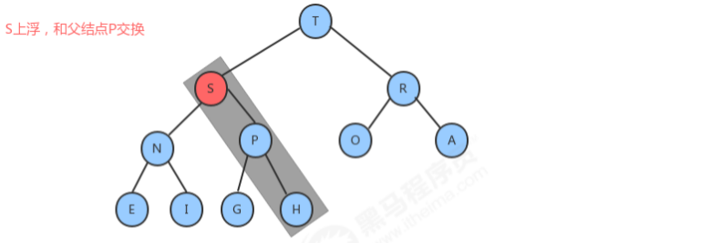

# 1、时间/空间复杂度分析

## 1.1 算法的时间复杂度分析

我们要计算算法时间耗费情况，首先我们得度量算法的执行时间，那么如何度量呢？

**事后分析估算方法：**

比较容易想到的方法就是我们把算法执行若干次，然后拿个计时器在旁边计时，这种事后统计的方法看上去的确不错，并且也并非要我们真的拿个计算器在旁边计算，因为计算机都提供了计时的功能。这种统计方法主要是通过设计好的测试程序和测试数据，利用计算机计时器对不同的算法编制的程序的运行时间进行比较，从而确定算法效率的高低，但是这种方法有很大的缺陷：必须依据算法实现编制好的测试程序，通常要花费大量时间和精力，测试完了如果发现测试的是非常糟糕的算法，那么之前所做的事情就全部白费了，并且不同的测试环境(硬件环境)的差别导致测试的结果差异也很大。

**事前分析估算方法：**

在计算机程序编写前，依据统计方法对算法进行估算，经过总结，我们发现一个高级语言编写的程序程序在计算机上运行所消耗的时间取决于下列因素：

 1.算法采用的策略和方案；

 2.编译产生的代码质量；

 3.问题的输入规模(所谓的问题输入规模就是输入量的多少)；

 4.机器执行指令的速度；

由此可见，抛开这些与计算机硬件、软件有关的因素，一个程序的运行时间依赖于算法的好坏和问题的输入规模。如果算法固定，那么该算法的执行时间就只和问题的输入规模有关系了。

**最经典的需求：**

计算1到100的和。

```java
//如果输入量为n为1，则需要计算1次； 
//如果输入量n为1亿，则需要计算1亿次；
public static void main(String[] args) { 
    int sum = 0;//执行1次 
    int n=100;//执行1次
    for (int i = 1; i <= n; i++) {//执行了n+1次 
        sum += i;//执行了n次 
    }
    System.out.println("sum=" + sum);
}
```

```java
//如果输入量为n为1，则需要计算1次； 
//如果输入量n为1亿，则需要计算1次；
public static void main(String[] args) { 
    int sum = 0;//执行1次
    int n=100;//执行1次 
    sum = (n+1)*n/2;//执行1次 
    System.out.println("sum="+sum);
}
```

因此，当输入规模为n时，第一种算法执行了1+1+(n+1)+n=2n+3次；第二种算法执行了1+1+1=3次。如果我们把第一种算法的循环体看做是一个整体，忽略结束条件的判断，那么其实这两个算法运行时间的差距就是n和1的差距。

为什么循环判断在算法1里执行了n+1次，看起来是个不小的数量，但是却可以忽略呢？我们来看下一个例子：

**需求：**

计算100个1+100个2+100个3+...100个100的结果

代码：

```java
public static void main(String[] args) { 
    int sum=0;
    int n=100; 
    for (int i = 1; i <=n ; i++) { 
        for (int j = 1; j <=n ; j++) {
            sum+=i; 
        }
        System.out.println("sum="+sum);
    }
}
```

上面这个例子中，如果我们要精确的研究循环的条件执行了多少次，是一件很麻烦的事情，并且，由于真正计算和的代码是内循环的循环体，所以，在研究算法的效率时，我们只考虑核心代码的执行次数，这样可以简化分析。

我们研究算法复杂度，侧重的是当输入规模不断增大时，算法的增长量的一个抽象(规律)，而不是精确地定位需要执行多少次，因为如果是这样的话，我们又得考虑回编译期优化等问题，容易主次跌倒。

我们不关心编写程序所用的语言是什么，也不关心这些程序将跑在什么样的计算机上，我们只关心它所实现的算法。这样，不计那些循环索引的递增和循环终止的条件、变量声明、打印结果等操作，最终在分析程序的运行时间时，最重要的是把程序看做是独立于程序设计语言的算法或一系列步骤。我们分析一个算法的运行时间，最重要的就是把核心操作的次数和输入规模关联起来。


### 1.1.1 函数渐进增长

给定两个函数f(n)和g(n),如果存在一个整数N，使得对于所有的n>N,f(n)总是比g(n)大，那么我们说f(n)的增长渐近快于g(n)。

### 1.1.2 算法时间复杂度

#### 大O记法

**定义：**

在进行算法分析时，语句总的执行次数T(n)是关于问题规模n的函数，进而分析T(n)随着n的变化情况并确定T(n)的量级。算法的时间复杂度，就是算法的时间量度，记作:T(n)=O(f(n))。**它表示随着问题规模n的增大，算法执行时间的增长率和f(n)的增长率相同，称作算法的渐近时间复杂度，简称时间复杂度**，其中f(n)是问题规模n的某个函数。

在这里，我们需要明确一个事情：**执行次数=执行时间**

用大写O()来体现算法时间复杂度的记法，我们称之为大O记法。一般情况下，随着输入规模n的增大，T(n)增长最慢的算法为最优算法。

下面我们使用大O表示法来表示一些求和算法的时间复杂度：

算法一：

```java
public static void main(String[] args) {
    int sum = 0;//执行1次
    int n = 100;//执行1次
    sum = (n + 1) * n / 2;//执行1次
    System.out.println("sum=" + sum);
}
```

算法二：

```java
public static void main(String[] args) {
    int sum = 0;//执行1次 
    int n = 100;//执行1次 
    for (int i = 1; i <= n; i++) {
        sum += i;//执行了n次 
    }
    System.out.println("sum=" + sum);
}
```

算法三：

```java
public static void main(String[] args) {
    int sum = 0;//执行1次 
    int n = 100;//执行1次 
    for (int i = 1; i <= n; i++) {
        for (int j = 1; j <= n; j++) {
            sum += i;//执行n^2次 
        }
    }
    System.out.println("sum=" + sum);
}
```

如果忽略判断条件的执行次数和输出语句的执行次数，那么当输入规模为n时，以上算法执行的次数分别为：

算法一：3次

算法二：n+3次

算法三：n^2+2次

如果用大O记法表示上述每个算法的时间复杂度，应该如何表示呢？基于我们对函数渐近增长的分析，**推导大O阶的表示法有以下几个规则可以使用**：

**1.用常数1取代运行时间中的所有加法常数；**

**2.在修改后的运行次数中，只保留高阶项；**

**3.如果最高阶项存在，且常数因子不为1，则去除与这个项相乘的常数；**

所以，上述算法的大O记法分别为：

算法一：O(1)

算法二：O(n)

算法三：O(n^2)

#### 常见的大O阶

**1.线性阶**

一般含有非嵌套循环涉及线性阶，线性阶就是随着输入规模的扩大，对应计算次数呈直线增长，例如：

```java
public static void main(String[] args) { 
    int sum = 0; 
    int n=100; 
    for (int i = 1; i <= n; i++) { 
        sum += i; 
    }
    System.out.println("sum=" + sum); 
}
```

上面这段代码，它的循环的时间复杂度为O(n),因为循环体中的代码需要执行n次

**2.平方阶**

一般嵌套循环属于这种时间复杂度

```java
public static void main(String[] args) {
    int sum = 0, n = 100;
    for (int i = 1; i <= n; i++) {
        for (int j = 1; j <= n; j++) {
            sum += i;
        }
    }
    System.out.println(sum);
}
```

上面这段代码，n=100，也就是说，外层循环每执行一次，内层循环就执行100次，那总共程序想要从这两个循环中出来，就需要执行100*100次，也就是n的平方次，所以这段代码的时间复杂度是O(n^2).

**3.立方阶**

一般三层嵌套循环属于这种时间复杂度

```java
public static void main(String[] args) {
    int x = 0, n = 100;
    for (int i = 1; i <= n; i++) {
        for (int j = i; j <= n; j++) {
            for (int j = i; j <= n; j++) {
                x++;
            }
        }
    }
    System.out.println(x);
}
```

上面这段代码，n=100，也就是说，外层循环每执行一次，中间循环循环就执行100次，中间循环每执行一次，最内层循环需要执行100次，那总共程序想要从这三个循环中出来，就需要执行100*100*100次，也就是n的立方，所以这段代码的时间复杂度是O(n^3).

**4.对数阶**

对数，属于高中数学的内容，我们分析程序以程序为主，数学为辅，所以不用过分担心。

```java
public static void main(String[] args) {
    int i = 1, n = 100;
    while (i < n) {
        i = i * 2;
    }
}
```

由于每次i*2之后，就距离n更近一步，假设有x个2相乘后大于n，则会退出循环。由于是2^x=n,得到x=log(2)n,所以这个循环的时间复杂度为O(logn);

对于对数阶，由于随着输入规模n的增大，不管底数为多少，他们的增长趋势是一样的，所以我们会忽略底数。


**5.常数阶**

一般不涉及循环操作的都是常数阶，因为它不会随着n的增长而增加操作次数。例如：

```java
public static void main(String[] args) {
    int n = 100;
    int i = n + 2;
    System.out.println(i);
}
```

上述代码，不管输入规模n是多少，都执行2次，根据大O推导法则，常数用1来替换，所以上述代码的时间复杂度为O(1)

下面是对常见时间复杂度的一个**总结**：

| 描述         | 增长的数量级 | 说明     | 举例           |
| ------------ | ------------ | -------- | -------------- |
| 常数级别     | 1            | 普通语句 | 将两个数相加   |
| 对数级别     | logN         | 二分策略 | 二分查找       |
| 线性级别     | N            | 循环     | 找出最大元素   |
| 线型对数级别 | NlogN        | 分治思想 | 归并排序       |
| 平方级别     | N^2          | 双层循环 | 检查所有元素对 |
| 立方级别     | N^3          | 三层循环 | 检查所有三元组 |
| 指数级别     | 2^N          | 穷举查找 | 检查所有子集   |

他们的复杂程度从低到高依次为：

`O(1)<O(logn)<O(n)<O(nlogn)<O(n^2)<O(n^3)`

根据前面的折线图分析，我们会发现，从平方阶开始，随着输入规模的增大，时间成本会急剧增大，所以，我们的算法，**尽可能的追求的是O(1),O(logn),O(n),O(nlogn)这几种时间复杂度**，而如果发现算法的时间复杂度为平方阶、立方阶或者更复杂的，那我们可以分为这种算法是不可取的，需要优化。

#### 函数调用的时间复杂度分析

之前，我们分析的都是单个函数内，算法代码的时间复杂度，接下来我们分析函数调用过程中时间复杂度。

案例一：

```java
public static void main(String[] args) {
    int n = 100;
    for (int i = 0; i < n; i++) {
        show(i);
    }
}

private static void show(int i) {
    System.out.println(i);
}
```

在main方法中，有一个for循环，循环体调用了show方法，由于show方法内部只执行了一行代码，所以show方法的时间复杂度为O(1),那main方法的时间复杂度就是O(n)

案例二：

```java
public static void main(String[] args) {
    int n = 100;
    for (int i = 0; i < n; i++) {
        show(i);
    }
}

private static void show(int i) {
    for (int j = 0; j < i; i++) {
        System.out.println(i);
    }
}
```

在main方法中，有一个for循环，循环体调用了show方法，由于show方法内部也有一个for循环，所以show方法的时间复杂度为O(n),那main方法的时间复杂度为O(n^2)

案例三：

```java
public static void main(String[] args) {
    int n = 100;
    show(n);
    for (int i = 0; i < n; i++) {
        show(i);
    }
    for (int i = 0; i < n; i++) {
        for (int j = 0; j < n; j++) {
            System.out.println(j);
        }
    }
}

private static void show(int i) {
    for (int j = 0; j < i; i++) {
        System.out.println(i);
    }
}
```

在show方法中，有一个for循环，所以show方法的时间复杂度为O(n),在main方法中，show(n)这行代码内部执行的次数为n，第一个for循环内调用了show方法，所以其执行次数为`n^2` ，第二个嵌套for循环内只执行了一行代码，所以其执行次数为`n^2` ，那么main方法总执行次数为`n+n^2+n^2=2n^2+n`。根据大O推导规则，去掉n保留最高阶项，并去掉最高阶项的常数因子2，所以最终main方法的时间复杂度为O(n^2)

#### 最坏情况

从心理学角度讲，每个人对发生的事情都会有一个预期，比如看到半杯水，有人会说：哇哦，还有半杯水哦！但也有人会说：天哪，只有半杯水了。一般人处于一种对未来失败的担忧，而在预期的时候趋向做最坏的打算，这样即使最糟糕的结果出现，当事人也有了心理准备，比较容易接受结果。假如最糟糕的结果并没有出现，当事人会很快乐。

算法分析也是类似，假如有一个需求：

有一个存储了n个随机数字的数组，请从中查找出指定的数字。

```java
public int search(int num) {
    int[] arr = {11, 10, 8, 9, 7, 22, 23, 0};
    for (int i = 0; i < arr.length; i++) {
        if (num == arr[i]) {
            return i;
        }
    }
    return -1;
}
```

**最好情况：**
查找的第一个数字就是期望的数字，那么算法的时间复杂度为O(1)

**最坏情况：**
查找的最后一个数字，才是期望的数字，那么算法的时间复杂度为O(n)

**平均情况：**
任何数字查找的平均成本是O(n/2)
最坏情况是一种保证，在应用中，这是一种最基本的保障，即使在最坏情况下，也能够正常提供服务，所以，除非特别指定，我们提到的运行时间都指的是最坏情况下的运行时间。

## 1.2 算法的空间复杂度

计算机的软硬件都经历了一个比较漫长的演变史，作为为运算提供环境的内存，更是如此，从早些时候的512k,经历了1M，2M，4M...等，发展到现在的8G，甚至16G和32G，所以早期，算法在运行过程中对内存的占用情况也是一个经常需要考虑的问题。我么可以用算法的空间复杂度来描述算法对内存的占用。

### 1.2.1 常见数据类型的内存占用

1.  

2. 计算机访问内存的方式都是一次一个字节

 

3. 一个引用（机器地址）需要8个字节表示：

   例如： Date date = new Date()，则date这个变量需要占用8个字节来表示

4. 创建一个对象，比如new Date()，除了Date对象内部存储的数据(例如年月日等信息)占用的内存，该对象本身也有内存开销，每个对象的自身开销是16个字节，用来保存对象的头信息。

5. 一般内存的使用，如果不够8个字节，都会被自动填充为8字节：

6. java中数组被被限定为对象，他们一般都会因为记录长度而需要额外的内存，一个原始数据类型的数组一般需要24字节的头信息(16个自己的对象开销，4字节用于保存长度以及4个填充字节)再加上保存值所需的内存。

### 1.2.2 算法的空间复杂度

了解了java的内存最基本的机制，就能够有效帮助我们估计大量程序的内存使用情况。

算法的空间复杂度计算公式记作：S(n)=O(f(n)),其中n为输入规模，f(n)为语句关于n所占存储空间的函数。

**案例：**

对指定的数组元素进行反转，并返回反转的内容。

解法一：

```java
public static int[] reverse1(int[] arr) {
    int n = arr.length;//申请4个字节 
    int temp;//申请4个字节 
    for (int start = 0, end = n - 1; start <= end; start++, end--) {
        temp = arr[start];
        arr[start] = arr[end];
        arr[end] = temp;
    }
    return arr;
}
```

解法二：

```java
public static int[] reverse2(int[] arr) {
    int n = arr.length;//申请4个字节 
    int[] temp = new int[n];//申请n*4个字节+数组自身头信息开销24个字节 
    for (int i = n - 1; i >= 0; i--) {
        temp[n - 1 - i] = arr[i];
    }
    return temp;
}
```

忽略判断条件占用的内存，我们得出的内存占用情况如下：

算法一：

不管传入的数组大小为多少，始终额外申请4+4=8个字节；

算法二：

4+4n+24=4n+28;

根据大O推导法则，算法一的空间复杂度为O(1),算法二的空间复杂度为O(n),所以从空间占用的角度讲，算法一要优于算法二。

由于java中有内存垃圾回收机制，并且jvm对程序的内存占用也有优化（例如即时编译），我们无法精确的评估一个java程序的内存占用情况，但是了解了java的基本内存占用，使我们可以对java程序的内存占用情况进行估算。

由于现在的计算机设备内存一般都比较大，基本上个人计算机都是4G起步，大的可以达到32G，**所以内存占用一般情况下并不是我们算法的瓶颈，普通情况下直接说复杂度，默认为算法的时间复杂度。**

但是，如果你做的程序是嵌入式开发，尤其是一些传感器设备上的内置程序，由于这些设备的内存很小，一般为几kb，这个时候对算法的空间复杂度就有要求了，但是一般做java开发的，基本上都是服务器开发，一般不存在这样的问题。

# 2、数组

## 2.1 数组的基本概念

如果说现在要求你定义100个整型变量，那么如果按照之前的做法，可能现在定义的的结构如下：

```java
int i1, i2, i3, ... i100;
```

但是这个时候如果按照此类方式定义就会非常麻烦，因为这些变量彼此之间没有任何的关联，也就是说如果现在突然再有一个要求，要求你输出这100个变量的内容，意味着你要编写`System.out.println()`语句`100`次。

其实所谓的数组指的就是一组相关类型的变量集合，并且这些变量可以按照统一的方式进行操作。数组本身属于引用数据类型，那么既然是引用数据类型，这里面实际又会牵扯到内存分配，而数组的定义语法有如下两类：**数组动态初始化**和**数组静态初始化**

数组动态初始化：

- 声明并开辟数组：
  - 数据类型 [] 数组名称 = `new` 数据类型[长度];

- 分布进行数组空间开辟（实例化）
  - `数组类型 [] 数组名称 = null;`
    `数组名称 = new 数组类型[长度];`

那么当数组开辟空间之后，就可以采用如下的方式的操作：

- 数组的访问通过索引完成，即：“数组名称[索引]”，但是需要注意的是，数组的索引从0开始，所以索引的范围就是0 ~ 数组长度-1，例如开辟了3个空间的数组，所以可以使用的索引是：0,1,2，如果此时访问的时候超过了数组的索引范围，会产生`java.lang.ArrayIndexOutOfBoundsException` 异常信息；
- 当我们数组采用动态初始化开辟空间后，数组里面的每一个元素都是该数组对应数据类型的默认值；
- 数组本身是一个有序的集合操作，所以对于数组的内容操作往往会采用循环的模式完成，数组是一个有限的数据集合，所以应该使用 for 循环。
- 在 Java 中提供有一种动态取得数组长度的方式：`数组名称.length;`

**范例：** 定义一个int型数组

```java
public class ArrayDemo {
	public static void main(String args[]) {
		int data[] = new int[3]; /*开辟了一个长度为3的数组*/
		data[0] = 10; // 第一个元素
		data[1] = 20; // 第二个元素
		data[2] = 30; // 第三个元素
		for(int x = 0; x < data.length; x++) {
			System.out.println(data[x]); //通过循环控制索引
		}
	}
}
```

数组本身除了声明并开辟空间之外还有另外一种开辟模式。

**范例：** 采用分步的模式开辟数组空间

```java
public class ArrayDemo {
	public static void main(String args[]) {
		int data[] = null; 
		data = new int[3]; /*开辟了一个长度为3的数组*/
		data[0] = 10; // 第一个元素
		data[1] = 20; // 第二个元素
		data[2] = 30; // 第三个元素
		for(int x = 0; x < data.length; x++) {
			System.out.println(data[x]); //通过循环控制索引
		}
	}
}
```

但是千万要记住，数组属于引用数据类型，所以在数组使用之前一定要开辟控件（实例化），如果使用了没有开辟空间的数组，则一定会出现 `NullPointerException` 异常信息：

```java
public class ArrayDemo {
	public static void main(String args[]) {
		int data[] = null; 
		System.out.println(data[x]);
	}
}
```

这一原则和之前讲解的对象是完全相同的。

数组在开发之中一定会使用，但是像上面的操作很少。在以后的实际开发之中，会更多的使用数组概念，而直接使用，99%情况下都只是做一个 `for` 循环输出

## 2.2 数组引用传递

既然数组属于引用数据类型，那么也一定可以发生引用传递。在这之前首先来研究一下数组的空间开辟。

**范例：** 观察一道程序

```java
public class ArrayDemo {
	public static void main(String args[]) {
		int data[] = null;
		data = new int[3]; //开辟一个长度为3的数组
		data[0] = 10;
		data[1] = 20;
		data[2] = 30;
	}
}
```


那么既然说到了引用数据类型了，就一定可以发生引用传递，而现在的引用传递的本质也一定是：同一块堆内存空间可以被不同的栈内存所指向。

**范例：** 定义一个程序

```java
public class ArrayDemo {
	public static void main(String args[]) {
		int data[] = null;
		data = new int[3]; //开辟一个长度为3的数组
		int temp[] = null; //声明对象
		data[0] = 10;
		data[1] = 20;
		data[2] = 30;
		temp = data;  //int temp[] = data;
		temp[0] = 99;
		for(int i = 0; i < temp.length; i++) {
			System.out.println(data[i]);
		}
	}
}
```


引用传递分析都是一个套路。同一块堆内存被不同的栈内存所指向。

## 2.3 数组静态初始化

在之前所进行的数组定义都有一个明显特点：数组先开辟内存空间，而后再使用索引进行内容的设置，实际上这种做法都叫做动态初始化，而如果希望数组在定义的时候可以同时出现设置内容，那么就可以采用静态初始化完成。

数组的静态初始化一共分为以下两种类型：

| Tables     | Are                                           |
| ---------- | --------------------------------------------- |
| 简化格式： | 数据类型 数组名称 = {值, 值,…}                |
| 完整格式： | 数据类型 数组名称 = new 数据类型[] {值, 值,…} |

**范例：** 采用静态初始化定义数组

```java
public class ArrayDemo {
	public static void main(String args[]) {
		int data[] = {1, 2, 4, 545, 11, 32, 13131, 4444};
		for(int i = 0; i < data.length; i++) {
			System.out.println(data[i]);
		}
	}
}
```

在开发之中，对于静态数组的初始化强烈建议使用完整语法模式，这样可以轻松地使用匿名数组这一概念。

```java
public class ArrayDemo {
	public static void main(String args[]) {
		System.out.println(new int[] {1, 2, 4, 545, 11, 32, 13131, 4444}.length);
	}
}
```

以后使用静态方式定义数组的时候一定要写上完整格式。

数组最大的缺陷：**长度固定**。

# 3、字符串

见 **JavaSE(review)** 中的字符串，有详解

# 4、线性表

线性表是最基本、最简单、也是最常用的一种数据结构。一个线性表是n个具有相同特性的数据元素的有限序列。


前驱元素：

若A元素在B元素的前面，则称A为B的前驱元素

后继元素：

若B元素在A元素的后面，则称B为A的后继元素

**线性表的特征：**数据元素之间具有一种“一对一”的逻辑关系。

1. 第一个数据元素没有前驱，这个数据元素被称为头结点；

2. 最后一个数据元素没有后继，这个数据元素被称为尾结点；

3. 除了第一个和最后一个数据元素外，其他数据元素有且仅有一个前驱和一个后继。

如果把线性表用数学语言来定义，则可以表示为(a1,...ai-1,ai,ai+1,...an)，ai-1领先于ai,ai领先于ai+1，称ai-1是ai的前驱元素，ai+1是ai的后继元素


**线性表的分类：**

线性表中数据存储的方式**可以是顺序存储**，**也可以是链式存储**，按照数据的存储方式不同，可以把线性表分为**顺序表**和**链表**。

## 4.1 顺序表

顺序表是在计算机内存中以数组的形式保存的线性表，线性表的顺序存储是指用一组地址连续的存储单元，依次存储线性表中的各个元素、使得线性表中再逻辑结构上响铃的数据元素存储在相邻的物理存储单元中，即通过数据元素物理存储的相邻关系来反映数据元素之间逻辑上的相邻关系。


### 顺序表的API设计

| 类名     | SequenceList                                                 |
| -------- | ------------------------------------------------------------ |
| 构造方法 | SequenceList(int capacity)：创建容量为capacity的SequenceList对象 |
| 成员方法 | 1.public void clear()：空置线性表<br/>2.publicboolean isEmpty()：判断线性表是否为空，是返回true，否返回false<br/>3.public int length():获取线性表中元素的个数<br/>4.public T get(int i):读取并返回线性表中的第i个元素的值<br/>5.public void insert(int i,T t)：在线性表的第i个元素之前插入一个值为t的数据元素。<br/>6.public void insert(T t):向线性表中添加一个元素t<br/>7.public T remove(int i):删除并返回线性表中第i个数据元素。<br/>8.public int indexOf(T t):返回线性表中首次出现的指定的数据元素的位序号，若不存在，则返回-1。 |
| 成员变量 | 1.private T[] eles：存储元素的数组<br/>2.private int N:当前线性表的长度 |

### 顺序表的代码实现

```java
//顺序表代码
public class SequenceList<T> {
    //存储元素的数组
    private T[] eles;
    //记录当前顺序表中的元素个数
    private int N;

    //构造方法
    public SequenceList(int capacity) {
        eles = (T[]) new Object[capacity];
        N = 0;
    }

    //将一个线性表置为空表
    public void clear() {
        N = 0;
    }

    //判断当前线性表是否为空表
    public boolean isEmpty() {
        return N == 0;
    }

    //获取线性表的长度
    public int length() {
        return N;
    }

    //获取指定位置的元素
    public T get(int i) {
        if (i < 0 || i >= N) {
            throw new RuntimeException("当前元素不存在！");
        }
        return eles[i];
    }

    //向线型表中添加元素t
    public void insert(T t) {
        if (N == eles.length) {
            throw new RuntimeException("当前表已满");
        }
        eles[N++] = t;
    }

    //在i元素处插入元素t
    public void insert(int i, T t) {
        if (i == eles.length) {
            throw new RuntimeException("当前表已满");
        }
        if (i < 0 || i > N) {
            throw new RuntimeException("插入的位置不合法");
        }
        //把i位置空出来，i位置及其后面的元素依次向后移动一位
        for (int index = N; index > i; index--) {
            eles[index] = eles[index - 1];
        }
        //把t放到i位置处
        eles[i] = t;
        //元素数量+1
        N++;
    }

    //删除指定位置i处的元素，并返回该元素
    public T remove(int i) {
        if (i < 0 || i > N - 1) {
            throw new RuntimeException("当前要删除的元素不存在");
        }
        //记录i位置处的元素
        T result = eles[i];
        //把i位置后面的元素都向前移动一位
        for (int index = i; index < N - 1; index++) {
            eles[index] = eles[index + 1];
        }
        //当前元素数量-1 
        N--;
        return result;
    }

    //查找t元素第一次出现的位置 
    public int indexOf(T t) {
        if (t == null) {
            throw new RuntimeException("查找的元素不合法");
        }
        for (int i = 0; i < N; i++) {
            if (eles[i].equals(t)) {
                return i;
            }
        }
        return -1;
    }
}

//测试代码 
public class SequenceListTest {
    public static void main(String[] args) {
        //创建顺序表对象 
        SequenceList<String> sl = new SequenceList<>(10);
        //测试插入 
        sl.insert("姚明");
        sl.insert("科比");
        sl.insert("麦迪");
        sl.insert(1, "詹姆斯");
        //测试获取 
        String getResult = sl.get(1);
        System.out.println("获取索引1处的结果为：" + getResult);
        //测试删除 
        String removeResult = sl.remove(0);
        System.out.println("删除的元素是：" + removeResult);
        //测试清空 
        sl.clear();
        System.out.println("清空后的线性表中的元素个数为:" + sl.length());
    }
}
```

### 顺序表的遍历

一般作为容器存储数据，都需要向外部提供遍历的方式，因此我们需要给顺序表提供遍历方式。

在java中，遍历集合的方式一般都是用的是foreach循环，如果想让我们的SequenceList也能支持foreach循环，则

需要做如下操作：

1. 让SequenceList实现Iterable接口，重写iterator方法；

2. 在SequenceList内部提供一个内部类SIterator,实现Iterator接口，重写hasNext方法和next方法；

### 顺序表的容量可变

在之前的实现中，当我们使用SequenceList时，先new SequenceList(5)创建一个对象，创建对象时就需要指定容器的大小，初始化指定大小的数组来存储元素，当我们插入元素时，如果已经插入了5个元素，还要继续插入数据，则会报错，就不能插入了。这种设计不符合容器的设计理念，因此我们在设计顺序表时，应该考虑它的容量的伸缩性。

考虑容器的容量伸缩性，其实就是改变存储数据元素的数组的大小，那我们需要考虑什么时候需要改变数组的大小？

1. 添加元素时：

   添加元素时，应该检查当前数组的大小是否能容纳新的元素，如果不能容纳，则需要创建新的容量更大的数组，我们这里创建一个是原数组两倍容量的新数组存储元素。

   

2. 移除元素时：

   移除元素时，应该检查当前数组的大小是否太大，比如正在用100个容量的数组存储10个元素，这样就会造成内存空间的浪费，应该创建一个容量更小的数组存储元素。如果我们发现数据元素的数量不足数组容量的1/4，则创建一个是原数组容量的1/2的新数组存储元素。

   

### 顺序表的时间复杂度

- `get(i)`：不难看出，不论数据元素量N有多大，只需要一次eles[i]就可以获取到对应的元素，所以时间复杂度为O(1);
- `insert(int i,T t)`：每一次插入，都需要把i位置后面的元素移动一次，随着元素数量N的增大，移动的元素也越多，时间复杂为O(n);
- `remove(int i)`：每一次删除，都需要把i位置后面的元素移动一次，随着数据量N的增大,移动的元素也越多，时间复杂度为O(n);

由于顺序表的底层由数组实现，数组的长度是固定的，所以在操作的过程中涉及到了容器扩容操作。这样会导致顺序表在使用过程中的时间复杂度不是线性的，在某些需要扩容的结点处，耗时会突增，尤其是元素越多，这个问题越明显

### Java中ArrayList实现

java中ArrayList集合的底层也是一种顺序表，使用数组实现，同样提供了增删改查以及扩容等功能。

1. 是否用数组实现；

2. 有没有扩容操作；

3. 有没有提供遍历方式；

**具体可见 JavaSE(review) 中对ArrayList的源码分析**

## 4.2 链表

之前我们已经使用顺序存储结构实现了线性表，我们会发现虽然顺序表的查询很快，时间复杂度为O(1)，但是**增删的效率是比较低**的，因为每一次增删操作都伴随着大量的数据元素移动。这个问题有没有解决方案呢？有，我们可以使用另外一种存储结构实现线性表，链式存储结构。

链表是一种物理存储单元上非连续、非顺序的存储结构，其物理结构不能只管的表示数据元素的逻辑顺序，数据元素的逻辑顺序是通过链表中的指针链接次序实现的。链表由一系列的结点（链表中的每一个元素称为结点）组成，结点可以在运行时动态生成。

### 4.2.1 单向链表

单向链表是链表的一种，它由多个结点组成，每个结点都由一个数据域和一个指针域组成，数据域用来存储数据，指针域用来指向其后继结点。链表的头结点的数据域不存储数据，指针域指向第一个真正存储数据的结点。


#### 单向链表的API设计

| 类名       | LinkList                                                     |
| ---------- | ------------------------------------------------------------ |
| 构造方法   | LinkList()：创建LinkList对象                                 |
| 成员方法   | 1.public void clear()：空置线性表<br/>2.publicboolean isEmpty()：判断线性表是否为空，是返回true，否返回false<br/>3.public int length():获取线性表中元素的个数<br/>4.public T get(int i):读取并返回线性表中的第i个元素的值<br/>5.public void insert(T t)：往线性表中添加一个元素；<br/>6.public void insert(int i,T t)：在线性表的第i个元素之前插入一个值为t的数据元素。<br/>7.public T remove(int i):删除并返回线性表中第i个数据元素。<br/>8.public int indexOf(T t):返回线性表中首次出现的指定的数据元素的位序号，若不存在，则返回-1。 |
| 成员内部类 | private class Node:结点类                                    |
| 成员变量   | 1.private Node head:记录首结点<br/>2.private int N:记录链表的长度 |

### 4.2.2 双向链表

双向链表也叫双向表，是链表的一种，它由多个结点组成，每个结点都由一个数据域和两个指针域组成，数据域用来存储数据，其中一个指针域用来指向其后继结点，另一个指针域用来指向前驱结点。链表的头结点的数据域不存储数据，指向前驱结点的指针域值为null，指向后继结点的指针域指向第一个真正存储数据的结点。


按照面向对象的思想，我们需要设计一个类，来描述结点这个事物。由于结点是属于链表的，所以我们把结点类作为链表类的一个内部类来实现

#### 节点设计API

| 类名     | Node                                                         |
| -------- | ------------------------------------------------------------ |
| 构造方法 | Node(T t,Node pre,Node next)：创建Node对象                   |
| 成员变量 | T item:存储数据<br/>Node next：指向下一个结点<br/>Node pre:指向上一个结点 |

#### 双向链表API设计

| 类名       | TowWayLinkList                                               |
| ---------- | ------------------------------------------------------------ |
| 构造方法   | TowWayLinkList()：创建TowWayLinkList对象                     |
| 成员方法   | 1.public void clear()：空置线性表<br/>2.publicboolean isEmpty()：判断线性表是否为空，是返回true，否返回false<br/>3.public int length():获取线性表中元素的个数<br/>4.public T get(int i):读取并返回线性表中的第i个元素的值<br/>5.public void insert(T t)：往线性表中添加一个元素；<br/>6.public void insert(int i,T t)：在线性表的第i个元素之前插入一个值为t的数据元素。<br/>7.public T remove(int i):删除并返回线性表中第i个数据元素。<br/>8.public int indexOf(T t):返回线性表中首次出现的指定的数据元素的位序号，若不存在，则返回-1。<br/>9.public T getFirst():获取第一个元素<br/>10.public T getLast():获取最后一个元素 |
| 成员内部类 | private class Node:结点类                                    |
| 成员变量   | 1.private Node first:记录首结点<br/>2.private Node last:记录尾结点<br/>2.private int N:记录链表的长度 |

#### 双向链表代码实现

```java
//双向链表代码
public class TowWayLinkList<T> implements Iterable<T> {
    //首结点
    private Node head;
    //最后一个结点
    private Node last;
    //链表的长度
    private int N;

    public TowWayLinkList() {
        last = null;
        head = new Node(null, null, null);
        N = 0;
    }

    //清空链表
    public void clear() {
        last = null;
        head.next = last;
        head.pre = null;
        head.item = null;
        N = 0;
    }

    //获取链表长度
    public int length() {
        return N;
    }

    //判断链表是否为空
    public boolean isEmpty() {
        return N == 0;
    }

    //插入元素t
    public void insert(T t) {
        if (last == null) {
            last = new Node(t, head, null);
            head.next = last;
        } else {
            Node oldLast = last;
            Node node = new Node(t, oldLast, null);
            oldLast.next = node;
            last = node;
        }
        //长度+1
        N++;
    }

    //向指定位置i处插入元素t
    public void insert(int i, T t) {
        if (i < 0 || i >= N) {
            throw new RuntimeException("位置不合法");
        }
        //找到位置i的前一个结点
        Node pre = head;
        for (int index = 0; index < i; index++) {
            pre = pre.next;
        }
        //当前结点
        Node curr = pre.next;
        //构建新结点
        Node newNode = new Node(t, pre, curr);
        curr.pre = newNode;
        pre.next = newNode;
        //长度+1
        N++;
    }

    //获取指定位置i处的元素
    public T get(int i) {
        if (i < 0 || i >= N) {

            throw new RuntimeException("位置不合法");
        }
        //寻找当前结点
        Node curr = head.next;
        for (int index = 0; index < i; index++) {
            curr = curr.next;
        }
        return curr.item;
    }

    //找到元素t在链表中第一次出现的位置
    public int indexOf(T t) {
        Node n = head;
        for (int i = 0; n.next != null; i++) {
            n = n.next;
            if (n.next.equals(t)) {
                return i;
            }
        }
        return -1;
    }

    //删除位置i处的元素，并返回该元素
    public T remove(int i) {
        if (i < 0 || i >= N) {
            throw new RuntimeException("位置不合法");
        }
        //寻找i位置的前一个元素
        Node pre = head;
        for (int index = 0; index < i; index++) {
            pre = pre.next;
        }
        //i位置的元素
        Node curr = pre.next;
        //i位置的下一个元素
        Node curr_next = curr.next;
        pre.next = curr_next;
        curr_next.pre = pre;
        //长度-1；
        N--;
        return curr.item;
    }

    //获取第一个元素
    public T getFirst() {
        if (isEmpty()) {
            return null;
        }
        return head.next.item;
    }

    //获取最后一个元素
    public T getLast() {
        if (isEmpty()) {
            return null;
        }
        return last.item;
    }

    @Override
    public Iterator<T> iterator() {
        return new TIterator();
    }

    private class TIterator implements Iterator {
        private Node n = head;

        @Override
        public boolean hasNext() {
            return n.next != null;
        }

        @Override
        public Object next() {
            n = n.next;
            return n.item;
        }
    }

    //结点类
    private class Node {
        public Node(T item, Node pre, Node next) {
            this.item = item;
            this.pre = pre;
            this.next = next;
        }

        //存储数据
        public T item;
        //指向上一个结点
        public Node pre;
        //指向下一个结点
        public Node next;
    }
}

//测试代码
public class Test {
    public static void main(String[] args) throws Exception {
        TowWayLinkList<String> list = new TowWayLinkList<>();
        list.insert("乔峰");
        list.insert("虚竹");
        list.insert("段誉");
        list.insert(1, "鸠摩智");
        list.insert(3, "叶二娘");
        for (String str : list) {
            System.out.println(str);
        }
        System.out.println("----------------------");
        String tow = list.get(2);
        System.out.println(tow);
        System.out.println("-------------------------");
        String remove = list.remove(3);
        System.out.println(remove);
        System.out.println(list.length());
        System.out.println("--------------------");
        System.out.println(list.getFirst());
        System.out.println(list.getLast());
    }
}
```

#### Java中LinkedList的实现

java中LinkedList集合也是使用双向链表实现，并提供了增删改查等相关方法

1. 底层是否用双向链表实现；

2. 结点类是否有三个域

### 4.2.3 链表的时间复杂度分析

- `get(int i)`：每一次查询，都需要从链表的头部开始，依次向后查找，随着数据元素N的增多，比较的元素越多，时间复杂度为O(n)

- `insert(int i,T t)`：每一次插入，需要先找到i位置的前一个元素，然后完成插入操作，随着数据元素N的增多，查找的元素越多，时间复杂度为O(n);

- `remove(int i)`：每一次移除，需要先找到i位置的前一个元素，然后完成插入操作，随着数据元素N的增多，查找的元素越多，时间复杂度为O(n)

相比较顺序表，链表插入和删除的时间复杂度虽然一样，但仍然有很大的优势，因为链表的物理地址是不连续的，它不需要预先指定存储空间大小，或者在存储过程中涉及到扩容等操作,,同时它并没有涉及的元素的交换。相比较顺序表，链表的查询操作性能会比较低。因此，如果我们的程序中查询操作比较多，建议使用顺序表，增删操作比较多，建议使用链表。

### 4.2.4 链表反转

单链表的反转，是面试中的一个高频题目。

**需求：**

原链表中数据为：1->2->3>4

反转后链表中数据为：4->3->2->1

**反转API：**

`public void reverse()：对整个链表反转` 

`public Node reverse(Node curr)：反转链表中的某个结点curr,并把反转后的curr结点返回`

使用递归可以完成反转，递归反转其实就是从原链表的第一个存数据的结点开始，依次递归调用反转每一个结点，直到把最后一个结点反转完毕，整个链表就反转完毕。


**代码：**

```java
public void reverse() {
    if (N == 0) {
        //当前是空链表，不需要反转
        return;
    }
    reverse(head.next);
}

/**
 * @param curr 当前遍历的结点
 * @return 反转后当前结点上一个结点
 */
public Node reverse(Node curr) {
    //已经到了最后一个元素
    if (curr.next == null) {
        //反转后，头结点应该指向原链表中的最后一个元素
        head.next = curr;
        return curr;
    }
    //当前结点的上一个结点
    Node pre = reverse(curr.next);
    pre.next = curr;
    //当前结点的下一个结点设为null 
    curr.next = null;
    //返回当前结点 
    return curr;
}

//测试代码 
public class Test {
    public static void main(String[] args) throws Exception {
        LinkList<Integer> list = new LinkList<>();
        list.insert(1);
        list.insert(2);
        list.insert(3);
        list.insert(4);
        for (Integer i : list) {
            System.out.print(i + " ");
        }
        System.out.println();
        System.out.println("--------------------");
        list.reverse();
        for (Integer i : list) {
            System.out.print(i + " ");
        }
    }
}
```

### 4.2.5 快慢指针

快慢指针指的是定义两个指针，这两个指针的移动速度一块一慢，以此来制造出自己想要的差值，这个差值可以让我们找到链表上相应的结点。一般情况下，快指针的移动步长为慢指针的两倍

### 4.2.6 循环链表

循环链表，顾名思义，链表整体要形成一个圆环状。在单向链表中，最后一个节点的指针为null，不指向任何结点，因为没有下一个元素了。要实现循环链表，我们只需要让单向链表的最后一个节点的指针指向头结点即可。


**循环链表的构建：**

```java
public class Test {
    public static void main(String[] args) throws Exception {
        //构建结点
        Node<Integer> first = new Node<Integer>(1, null);
        Node<Integer> second = new Node<Integer>(2, null);
        Node<Integer> third = new Node<Integer>(3, null);
        Node<Integer> fourth = new Node<Integer>(4, null);
        Node<Integer> fifth = new Node<Integer>(5, null);
        Node<Integer> six = new Node<Integer>(6, null);
        Node<Integer> seven = new Node<Integer>(7, null);
        //构建单链表 
        first.next = second;
        second.next = third;
        third.next = fourth;
        fourth.next = fifth;
        fifth.next = six;
        six.next = seven;
        //构建循环链表,让最后一个结点指向第一个结点 
        seven.next = first;
    }
}
```

### 4.2.7 约瑟夫问题

**问题描述：**

传说有这样一个故事，在罗马人占领乔塔帕特后，39 个犹太人与约瑟夫及他的朋友躲到一个洞中，39个犹太人决定宁愿死也不要被敌人抓到，于是决定了一个自杀方式，41个人排成一个圆圈，第一个人从1开始报数，依次往后，如果有人报数到3，那么这个人就必须自杀，然后再由他的下一个人重新从1开始报数，直到所有人都自杀身亡为止。然而约瑟夫和他的朋友并不想遵从。于是，约瑟夫要他的朋友先假装遵从，他将朋友与自己安排在第16个与第31个位置，从而逃过了这场死亡游戏 。

**问题转换：**

41个人坐一圈，第一个人编号为1，第二个人编号为2，第n个人编号为n。

1. 编号为1的人开始从1报数，依次向后，报数为3的那个人退出圈；
2. 自退出那个人开始的下一个人再次从1开始报数，以此类推；
3. 求出最后退出的那个人的编号。

**图示：**

 

**解题思路：**

1. 构建含有41个结点的单向循环链表，分别存储1~41的值，分别代表这41个人；

2. 使用计数器count，记录当前报数的值；

3. 遍历链表，每循环一次，count++；

4. 判断count的值，如果是3，则从链表中删除这个结点并打印结点的值，把count重置为0；

**代码：**

```java
public class Test {
    public static void main(String[] args) throws Exception {
        //1.构建循环链表
        Node<Integer> first = null;
        //记录前一个结点
        Node<Integer> pre = null;
        for (int i = 1; i <= 41; i++) {
            //第一个元素
            if (i == 1) {
                first = new Node(i, null);
                pre = first;
                continue;
            }
            Node<Integer> node = new Node<>(i, null);
            pre.next = node;
            pre = node;
            if (i == 41) {
                //构建循环链表，让最后一个结点指向第一个结点
                pre.next = first;
            }
        }
        //2.使用count，记录当前的报数值
        int count = 0;
        //3.遍历链表，每循环一次，count++
        /Node<Integer> n = first;
        Node<Integer> before = null;
        while (n != n.next) {
            //4.判断count的值，如果是3，则从链表中删除这个结点并打印结点的值，把count重置为0；
            count++;
            if (count == 3) {
                //删除当前结点
                before.next = n.next;
                System.out.print(n.item + ",");
                count = 0;
                n = n.next;
            } else {
                before = n;
                n = n.next;
            }
        }
        /*打印剩余的最后那个人*/
        System.out.println(n.item);
    }
}
```

## 4.3 栈

### 4.3.1 栈的概述

**生活中的栈**

存储货物或供旅客住宿的地方,可引申为仓库、中转站 。例如我们现在生活中的酒店，在古时候叫客栈，是供旅客休息的地方，旅客可以进客栈休息，休息完毕后就离开客栈。


**计算机中的栈**

我们把生活中的栈的概念引入到计算机中，就是供数据休息的地方，它是一种数据结构，数据既可以进入到栈中，又可以从栈中出去。

栈是一种基于先进后出(FILO)的数据结构，是一种只能在一端进行插入和删除操作的特殊线性表。它按照先进后出的原则存储数据，先进入的数据被压入栈底，最后的数据在栈顶，需要读数据的时候从栈顶开始弹出数据（最后一个数据被第一个读出来）。

我们称数据进入到栈的动作为**压栈**，数据从栈中出去的动作为**弹栈**。


### 4.3.2 栈的API设计

| 类名     | Stack                                                        |
| -------- | ------------------------------------------------------------ |
| 构造方法 | Stack()：创建Stack对象                                       |
| 成员方法 | 1.public boolean isEmpty()：判断栈是否为空，是返回true，否返回false<br/>2.public int size():获取栈中元素的个数<br/>3.public T pop():弹出栈顶元素<br/>4.public void push(T t)：向栈中压入元素t |
| 成员变量 | 1.private Node head:记录首结点<br/>2.private int N:当前栈的元素个数 |

### 4.3.3 栈的代码实现

```java
//栈代码
public class Stack<T> implements Iterable<T> {
    //记录首结点
    private Node head;
    //栈中元素的个数
    private int N;

    public Stack() {
        head = new Node(null, null);
        N = 0;
    }

    //判断当前栈中元素个数是否为0
    public boolean isEmpty() {
        return N == 0;
    }

    //把t元素压入栈
    public void push(T t) {
        Node oldNext = head.next;
        Node node = new Node(t, oldNext);
        head.next = node;
        //个数+1
        N++;
    }

    //弹出栈顶元素
    public T pop() {
        Node oldNext = head.next;
        if (oldNext == null) {
            return null;
        }
        //删除首个元素
        head.next = head.next.next;
        //个数-1
        N--;
        return oldNext.item;
    }

    //获取栈中元素的个数
    public int size() {
        return N;
    }

    @Override
    public Iterator<T> iterator() {
        return new SIterator();
    }

    private class SIterator implements Iterator<T> {
        private Node n = head;

        @Override
        public boolean hasNext() {
            return n.next != null;
        }

        @Override
        public T next() {
            Node node = n.next;
            n = n.next;
            return node.item;
        }
    }

    private class Node {
        public T item;
        public Node next;

        public Node(T item, Node next) {
            this.item = item;
            this.next = next;
        }
    }
}

//测试代码
public class Test {
    public static void main(String[] args) throws Exception {
        Stack<String> stack = new Stack<>();
        stack.push("a");
        stack.push("b");
        stack.push("c");
        stack.push("d");
        for (String str : stack) {
            System.out.print(str + " ");
        }
        System.out.println("-----------------------------");
        String result = stack.pop();
        System.out.println("弹出了元素：" + result);
        System.out.println(stack.size());
    }
}
```

### 4.3.4 有关栈的用法案例

#### 括号匹配问题

**问题描述：**

> 给定一个字符串，里边可能包含"()"小括号和其他字符，请编写程序检查该字符串的中的小括号是否成对出现。 
>
> 例如：
>
> ​	"(上海)(长安)"：正确匹配 
>
> ​	"上海((长安))"：正确匹配 
>
> ​	"上海(长安(北京)(深圳)南京)":正确匹配 
>
> ​	"上海(长安))"：错误匹配 
>
> ​	"((上海)长安"：错误匹配 

**代码示例：**

```java
public class BracketsMatch {
    public static void main(String[] args) {
        String str = "(上海(长安)())";
        boolean match = isMatch(str);
        System.out.println(str + "中的括号是否匹配：" + match);
    }

    /**
     * 判断str中的括号是否匹配 
     * @param str 括号组成的字符串 
     * @return 如果匹配，返回true，如果不匹配，返回false 
     */
    public static boolean isMatch(String str) {
        return false;
    }
}
```

完善 isMath方法。**分析：**

1. 创建一个栈用来存储左括号 

2. 从左往右遍历字符串，拿到每一个字符 

3. 判断该字符是不是左括号，如果是，放入栈中存储 

4. 判断该字符是不是右括号，如果不是，继续下一次循环 

5. 如果该字符是右括号，则从栈中弹出一个元素t； 

6. 判断元素t是否为null，如果不是，则证明有对应的左括号，如果不是，则证明没有对应的左括号 

7. 循环结束后，判断栈中还有没有剩余的左括号，如果有，则不匹配，如果没有，则匹配 


```java
public class BracketsMatch {
    public static void main(String[] args) {
        String str = "(fdafds(fafds)())";
        boolean match = isMatch(str);
        System.out.println(str + "中的括号是否匹配：" + match);
    }

    /**
     * 判断str中的括号是否匹配
     *
     * @param str 括号组成的字符串
     * @return 如果匹配，返回true，如果不匹配，返回false
     */
    public static boolean isMatch(String str) {
        //1.创建一个栈用来存储左括号
        Stack<String> chars = new Stack<>();
        //2.从左往右遍历字符串，拿到每一个字符 
        for (int i = 0; i < str.length(); i++) {
            String currChar = str.charAt(i) + "";
            //3.判断该字符是不是左括号，如果是，放入栈中存储 
            if (currChar.equals("(")) {
                chars.push(currChar);
            } else if (currChar.equals(")")) {
                //4.判断该字符是不是右括号，如果不是，继续下一次循环 
                // 5.如果该字符是右括号，则从栈中弹出一个元素t； 
                String t = chars.pop();
                //6.判断元素t是否为null，如果不是，则证明有对应的左括号，如果不是，则证明没有对应的左括号 
                if (t == null) {
                    return false;
                }
            }
        }
        //7.循环结束后，判断栈中还有没有剩余的左括号，如果有，则不匹配，如果没有，则匹配 
        if (chars.size() == 0) {
            return true;
        } else {
            return false;
        }
    }
}
```

#### 逆波兰表达式求值问题

逆波兰表达式求值问题是我们计算机中经常遇到的一类问题，要研究明白这个问题，首先我们得搞清楚什么是逆波兰表达式？要搞清楚逆波兰表达式，我们得从中缀表达式说起。

**中缀表达式：**

中缀表达式就是我们平常生活中使用的表达式，例如：1+3*2,2-(1+3)等等，中缀表达式的特点是：二元运算符总是置于两个操作数中间。

中缀表达式是人们最喜欢的表达式方式，因为简单，易懂。但是对于计算机来说就不是这样了，因为中缀表达式的运算顺序不具有规律性。不同的运算符具有不同的优先级，如果计算机执行中缀表达式，需要解析表达式语义，做大量的优先级相关操作。

**逆波兰表达式(后缀表达式)：**

逆波兰表达式是波兰逻辑学家J・卢卡西维兹(J・ Lukasewicz)于1929年首先提出的一种表达式的表示方法，**后缀表达式的特点：运算符总是放在跟它相关的操作数之后。**

| 中缀表达式 | 逆波兰表达式 |
| ---------- | ------------ |
| a+b        | ab+          |
| a+(b-c)    | abc-+        |
| a+(b-c)*d  | abc-d*+      |
| a*(b-c)+d  | abc-*d+      |

**需求：**给定一个只包含加减乘除四种运算的逆波兰表达式的数组表示方式，求出该逆波兰表达式的结果。

```java
public class ReversePolishNotation {
    public static void main(String[] args) {
        //中缀表达式3*（17-15）+18/6的逆波兰表达式如下 
        String[] notation = {"3", "17", "15", "-", "*", "18", "6", "/", "+"};
        int result = caculate(notation);
        System.out.println("逆波兰表达式的结果为：" + result);
    }

    /*** @param notaion 逆波兰表达式的数组表示方式 * @return 逆波兰表达式的计算结果 */
    public static int caculate(String[] notaion) {
        return -1;
    }
}
```

完善caculate方法，计算出逆波兰表达式的结果。

**分析：**

1. 创建一个栈对象oprands存储操作数 

2. 从左往右遍历逆波兰表达式，得到每一个字符串 

3. 判断该字符串是不是运算符，如果不是，把该该操作数压入oprands栈中 

4. 如果是运算符，则从oprands栈中弹出两个操作数o1,o2 

5. 使用该运算符计算o1和o2，得到结果result 

6. 把该结果压入oprands栈中 

7. 遍历结束后，拿出栈中最终的结果返回 


```java
public class ReversePolishNotation {
    public static void main(String[] args) {
        //中缀表达式3*（17-15）+18/6的逆波兰表达式如下
        String[] notation = {"3", "17", "15", "-", "*", "18", "6", "/", "+"};
        int result = caculate(notation);
        System.out.println("逆波兰表达式的结果为：" + result);
    }

    /**
     * @param notaion 逆波兰表达式的数组表示方式 
     * @return 逆波兰表达式的计算结果 
     */
    public static int caculate(String[] notaion) {
        //1.创建一个栈对象oprands存储操作数
        Stack<Integer> oprands = new Stack<>();
        //2.从左往右遍历逆波兰表达式，得到每一个字符串
        for (int i = 0; i < notaion.length; i++) {
            String curr = notaion[i];
            //3.判断该字符串是不是运算符，如果不是，把该该操作数压入oprands栈中
            Integer o1;
            Integer o2;
            Integer result;
            switch (curr) {
                case "+":
                    //4.如果是运算符，则从oprands栈中弹出两个操作数o1,o2
                    o1 = oprands.pop();
                    o2 = oprands.pop();
                    //5.使用该运算符计算o1和o2，得到结果result
                    result = o2 + o1;
                    //6.把该结果压入oprands栈中
                    oprands.push(result);
                    break;
                case "-":
                    //4.如果是运算符，则从oprands栈中弹出两个操作数o1,o2
                    o1 = oprands.pop();
                    o2 = oprands.pop();
                    //5.使用该运算符计算o1和o2，得到结果result
                    result = o2 - o1;
                    //6.把该结果压入oprands栈中
                    oprands.push(result);
                    break;
                case "*":
                    //4.如果是运算符，则从oprands栈中弹出两个操作数o1,o2
                    o1 = oprands.pop();
                    o2 = oprands.pop();
                    //5.使用该运算符计算o1和o2，得到结果result
                    result = o2 * o1;
                    //6.把该结果压入oprands栈中
                    oprands.push(result);
                    break;
                case "/":
                    //4.如果是运算符，则从oprands栈中弹出两个操作数o1,o2
                    o1 = oprands.pop();
                    o2 = oprands.pop();
                    //5.使用该运算符计算o1和o2，得到结果result 
                    result = o2 / o1;
                    //6.把该结果压入oprands栈中 
                    oprands.push(result);
                    break;
                default:
                    oprands.push(Integer.parseInt(curr));
                    break;
            }
        }
        //7.遍历结束后，拿出栈中最终的结果返回 
        Integer result = oprands.pop();
        return result;
    }
}
```

## 4.4 队列

队列是一种基于先进先出(FIFO)的数据结构，**是一种只能在一端进行插入,在另一端进行删除操作的特殊线性表**，它按照先进先出的原则存储数据，先进入的数据，在读取数据时先读被读出来。


### 4.4.1 队列的API设计

| 类名     | Queue                                                        |
| -------- | ------------------------------------------------------------ |
| 构造方法 | Queue()：创建Queue对象                                       |
| 成员方法 | 1.public boolean isEmpty()：判断队列是否为空，是返回true，否返回false<br/>2.public int size():获取队列中元素的个数<br/>3.public T dequeue():从队列中拿出一个元素<br/>4.public void enqueue(T t)：往队列中插入一个元素 |
| 成员变量 | 1.private Node head:记录首结点<br/>2.private int N:当前栈的元素个数<br/>3.private Node last:记录最后一个结点 |

### 4.4.2 队列的代码实现

```java
import java.util.Iterator;

/**
 * @Author Maybe
 * Date on 2021/12/7  17:29
 */

//队列代码
public class Queue<T> implements Iterable<T> {
    //记录首结点
    private Node head;
    //记录最后一个结点
    private Node last;
    //记录队列中元素的个数
    private int N;

    public Queue() {
        head = new Node(null, null);
        last = null;
        N = 0;
    }

    //判断队列是否为空
    public boolean isEmpty() {
        return N == 0;
    }

    //返回队列中元素的个数
    public int size() {
        return N;
    }

    //向队列中插入元素t
    public void enqueue(T t) {
        if (last == null) {
            last = new Node(t, null);
            head.next = last;
        } else {
            Node oldLast = last;
            last = new Node(t, null);
            oldLast.next = last;
        }
        //个数+1 
        N++;
    }

    //从队列中拿出一个元素 
    public T dequeue() {
        if (isEmpty()) {
            return null;
        }
        Node oldFirst = head.next;
        head.next = oldFirst.next;
        N--;
        if (isEmpty()) {
            last = null;
        }
        return oldFirst.item;
    }

    @Override
    public Iterator<T> iterator() {
        return new QIterator();
    }

    private class QIterator implements Iterator<T> {
        private Node n = head;

        @Override
        public boolean hasNext() {
            return n.next != null;
        }

        @Override
        public T next() {
            Node node = n.next;
            n = n.next;
            return node.item;
        }
    }

    private class Node {
        public T item;
        public Node next;

        public Node(T item, Node next) {
            this.item = item;
            this.next = next;
        }
    }
}
```

```java
/**
 * @Author Maybe
 * Date on 2021/12/7  17:32
 */

//测试代码 
public class Test {
    public static void main(String[] args) throws Exception {
        Queue<String> queue = new Queue<>();
        queue.enqueue("a");
        queue.enqueue("b");
        queue.enqueue("c");
        queue.enqueue("d");
        for (String str : queue) {
            System.out.print(str + " ");
        }
        System.out.println("-----------------------------");
        String result = queue.dequeue();
        System.out.println("出列了元素：" + result);
        System.out.println(queue.size());
    }
}
```

# 5、二叉树

之前我们实现的符号表中，不难看出，符号表的增删查操作，随着元素个数N的增多，其耗时也是线性增多的，时间复杂度都是O(n),为了提高运算效率，接下来我们学习树这种数据结构。

## 5.1 树的基本概念

### 树的定义

树是我们计算机中非常重要的一种数据结构，同时使用树这种数据结构，可以描述现实生活中的很多事物，例如家谱、单位的组织架构、等等。

树是由n（n>=1）个有限结点组成一个具有层次关系的集合。把它叫做“树”是因为它看起来像一棵倒挂的树，也就是说它是根朝上，而叶朝下的。


**树具有以下特点：**

1. 每个结点有零个或多个子结点；

2. 没有父结点的结点为根结点；

3. 每一个非根结点只有一个父结点；

4. 每个结点及其后代结点整体上可以看做是一棵树，称为当前结点的父结点的一个子树；

### 树的相关术语

**结点的度：**

一个结点含有的子树的个数称为该结点的度；

**叶结点：**

度为0的结点称为叶结点，也可以叫做终端结点

**分支结点：**

度不为0的结点称为分支结点，也可以叫做非终端结点

**结点的层次：**

从根结点开始，根结点的层次为1，根的直接后继层次为2，以此类推

**结点的层序编号：**

将树中的结点，按照从上层到下层，同层从左到右的次序排成一个线性序列，把他们编成连续的自然数。

**树的度：**

树中所有结点的度的最大值

**树的高度(深度)：**

树中结点的最大层次

**森林：**

m（m>=0）个互不相交的树的集合，将一颗非空树的根结点删去，树就变成一个森林；给森林增加一个统一的根结点，森林就变成一棵树


**孩子结点：**

一个结点的直接后继结点称为该结点的孩子结点

**双亲结点(父结点)：**

一个结点的直接前驱称为该结点的双亲结点

**兄弟结点：**

同一双亲结点的孩子结点间互称兄弟结点

## 5.2 二叉树的基本定义

二叉树就是度不超过2的树(每个结点最多有两个子结点)


**满二叉树：**

一个二叉树，如果每一个层的结点树都达到最大值，则这个二叉树就是满二叉树。


**完全二叉树：**

叶节点只能出现在最下层和次下层，并且最下面一层的结点都集中在该层最左边的若干位置的二叉树


## 5.3 二叉查找树的实现

### 二叉树的节点类

根据对图的观察，我们发现二叉树其实就是由一个一个的结点及其之间的关系组成的，按照面向对象的思想，我们设计一个结点类来描述结点这个事物。

| 类名     | Node<Key,Value>                                              |
| -------- | ------------------------------------------------------------ |
| 构造方法 | Node(Key key, Value value, Node left, Node right)：创建Node对象 |
| 成员变量 | 1.public Node left:记录左子结点<br/>2.public Node right:记录右子结点<br/>3.public Key key:存储键<br/>4.public Value value:存储值 |

代码：

```java
/**
 * @Author Maybe
 * Date on 2021/12/7  19:46
 */

public class Node<Key, Value> {
    //存储键
    public Key key;
    //存储值
    private Value value;
    //记录左子结点
    public Node left;
    //记录右子结点
    public Node right;

    public Node(Key key, Value value, Node left, Node right) {
        this.key = key;
        this.value = value;
        this.left = left;
        this.right = right;
    }
}
```

### 二叉查找树的API设计

| 类名     | BinaryTree,Value value>                                      |
| -------- | ------------------------------------------------------------ |
| 构造方法 | BinaryTree()：创建BinaryTree对象                             |
| 成员变量 | 1.private Node root:记录根结点<br/>2.private int N:记录树中元素的个数 |
| 成员方法 | 1. public void put(Key key,Value value)：向树中插入一个键值对<br/>2.private Node put(Node x, Key key, Value val)：给指定树x上，添加键一个键值对，并返回添加后的新树<br/>3.public Value get(Key key)：根据key，从树中找出对应的值<br/>4.private Value get(Node x, Key key)：从指定的树x中，找出key对应的值<br/>5.public void delete(Key key)：根据key，删除树中对应的键值对<br/>6.private Node delete(Node x, Key key)：删除指定树x上的键为key的键值对，并返回删除后的新树<br/>7.public int size()：获取树中元素的个数 |

### 二叉查找树分析

#### 插入方法put实现思想

1. 如果当前树中没有任何一个结点，则直接把新结点当做根结点使用

2. 如果当前树不为空，则从根结点开始：
   1. 如果新结点的key小于当前结点的key，则继续找当前结点的左子结点；
   2. 如果新结点的key大于当前结点的key，则继续找当前结点的右子结点；
   3. 如果新结点的key等于当前结点的key，则树中已经存在这样的结点，替换该结点的value值即可。


#### 查询方法get实现思想

从根节点开始：

1. 如果要查询的key小于当前结点的key，则继续找当前结点的左子结点；

2. 如果要查询的key大于当前结点的key，则继续找当前结点的右子结点；

3. 如果要查询的key等于当前结点的key，则树中返回当前结点的value。

#### 删除方法delete实现思想

1. 找到被删除结点；

2. 找到被删除结点右子树中的最小结点minNode

3. 删除右子树中的最小结点

4. 让被删除结点的左子树称为最小结点minNode的左子树，让被删除结点的右子树称为最小结点minNode的右子树

5. 让被删除结点的父节点指向最小结点minNode


## 5.4 二叉树的代码实现

```java
/**
 * @Author Maybe
 * Date on 2021/12/7  20:08
 */

//二叉树代码
public class BinaryTree<Key extends Comparable<Key>, Value> {
    //记录根结点
    private Node root;
    //记录树中元素的个数
    private int N;

    //获取树中元素的个数
    public int size() {
        return N;
    }

    //向树中添加元素key-value
    public void put(Key key, Value value) {
        root = put(root, key, value);
    }

    //向指定的树x中添加key-value,并返回添加元素后新的树
    private Node put(Node x, Key key, Value value) {
        if (x == null) {
            //个数+1
            N++;
            return new Node(key, value, null, null);
        }
        int cmp = key.compareTo(x.key);
        if (cmp > 0) {
            //新结点的key大于当前结点的key，继续找当前结点的右子结点
            x.right = put(x.right, key, value);
        } else if (cmp < 0) {
            //新结点的key小于当前结点的key，继续找当前结点的左子结点
            x.left = put(x.left, key, value);
        } else {
            //新结点的key等于当前结点的key，把当前结点的value进行替换
            x.value = value;
        }
        return x;
    }

    //查询树中指定key对应的value
    public Value get(Key key) {
        return get(root, key);
    }

    //从指定的树x中，查找key对应的值
    public Value get(Node x, Key key) {
        if (x == null) {
            return null;
        }
        int cmp = key.compareTo(x.key);
        if (cmp > 0) {
            //如果要查询的key大于当前结点的key，则继续找当前结点的右子结点；
            return get(x.right, key);
        } else if (cmp < 0) {
            //如果要查询的key小于当前结点的key，则继续找当前结点的左子结点；
            return get(x.left, key);
        } else {
            //如果要查询的key等于当前结点的key，则树中返回当前结点的value。
            return x.value;
        }
    }

    //删除树中key对应的value
    public void delete(Key key) {
        root = delete(root, key);
    }

    //删除指定树x中的key对应的value，并返回删除后的新树
    public Node delete(Node x, Key key) {
        if (x == null) {
            return null;
        }
        int cmp = key.compareTo(x.key);
        if (cmp > 0) {
            //新结点的key大于当前结点的key，继续找当前结点的右子结点
            x.right = delete(x.right, key);
        } else if (cmp < 0) {
            //新结点的key小于当前结点的key，继续找当前结点的左子结点
            x.left = delete(x.left, key);
        } else {
            //新结点的key等于当前结点的key,当前x就是要删除的结点
            // 1.如果当前结点的右子树不存在，则直接返回当前结点的左子结点
            if (x.right == null) {
                return x.left;
            }
            //2.如果当前结点的左子树不存在，则直接返回当前结点的右子结点
            if (x.left == null) {
                return x.right;
            }
            //3.当前结点的左右子树都存在
            // 3.1找到右子树中最小的结点
            Node minNode = x.right;
            while (minNode.left != null) {
                minNode = minNode.left;
            }
            //3.2删除右子树中最小的结点
            Node n = x.right;
            while (n.left != null) {
                if (n.left.left == null) {
                    n.left = null;
                } else {
                    n = n.left;
                }
            }
            //3.3让被删除结点的左子树称为最小结点minNode的左子树，让被删除结点的右子树称为最小结点 minNode的右子树
            minNode.left = x.left;
            minNode.right = x.right;
            //3.4让被删除结点的父节点指向最小结点minNode 
            x = minNode;
            //个数-1
            N--;
        }
        return x;
    }

    private class Node {
        //存储键
        public Key key;
        //存储值
        private Value value;
        //记录左子结点
        public Node left;
        //记录右子结点
        public Node right;

        public Node(Key key, Value value, Node left, Node right) {
            this.key = key;
            this.value = value;
            this.left = left;
            this.right = right;
        }
    }
}

//测试代码
public class Test {
    public static void main(String[] args) throws Exception {
        BinaryTree<Integer, String> bt = new BinaryTree<>();
        bt.put(4, "二哈");
        bt.put(1, "张三");
        bt.put(3, "李四");
        bt.put(5, "王五");
        System.out.println(bt.size());
        bt.put(1, "老三");
        System.out.println(bt.get(1));
        System.out.println(bt.size());
        bt.delete(1);
        System.out.println(bt.size());
    }
}
```

## 5.5 二叉查找树其他便捷方法

### 查找二叉树中最小的键

在某些情况下，我们需要查找出树中存储所有元素的键的最小值，比如我们的树中存储的是学生的排名和姓名数据，那么需要查找出排名最低是多少名？这里我们设计如下两个方法来完成：

- `public Key min()` ：找出树中最小的键
- `private Node min(Node x)` ：找出指定树x中，最小键所在的结点

```java
//找出整个树中最小的键 
public Key min() {
    return min(root).key;
}

//找出指定树x中最小的键所在的结点 
private Node min(Node x) {
    if (x.left != null) {
        return min(x.left);
    } else {
        return x;
    }
}
```

### 查找二叉树中最大的键

在某些情况下，我们需要查找出树中存储所有元素的键的最大值，比如比如我们的树中存储的是学生的成绩和学生的姓名，那么需要查找出最高的分数是多少？这里我们同样设计两个方法来完成：

- `public Key max()` ：找出树中最大的键
- `public Node max(Node x)`： 找出指定树x中，最大键所在的结点

```java
//找出整个树中最大的键 
public Key max() {
    return max(root).key;
}

//找出指定树x中最大键所在的结点 
public Node max(Node x) {
    if (x.right != null) {
        return max(x.right);
    } else {
        return x;
    }
}
```

## 5.6 二叉树的基础遍历

很多情况下，我们可能需要像遍历数组数组一样，遍历树，从而拿出树中存储的每一个元素，由于树状结构和线性结构不一样，它没有办法从头开始依次向后遍历，所以存在如何遍历，也就是按照什么样的**搜索路径**进行遍历的问题。


我们把树简单的画作上图中的样子，由一个根节点、一个左子树、一个右子树组成，那么按照根节点什么时候被访问，我们可以把二叉树的遍历分为以下三种方式：

1. **前序遍历**

   先访问根结点，然后再访问左子树，最后访问右子树

2. **中序遍历**

   先访问左子树，中间访问根节点，最后访问右子树

3. **后序遍历**

   先访问左子树，再访问右子树，最后访问根节点

如果我们分别对下面的树使用三种遍历方式进行遍历，得到的结果如下：


### 前序遍历

我们在4.4中创建的树上，添加前序遍历的API： 

`public Queue<Key> preErgodic()`：使用前序遍历，获取整个树中的所有键 

`private void preErgodic(Node x,Queue<Key> keys)`：使用前序遍历，把指定树x中的所有键放入到keys队列中

实现过程中，我们通过前序遍历，把每个结点的键取出，放入到队列中返回即可。

**实现步骤：**

1. 把当前结点的key放入到队列中;

2. 找到当前结点的左子树，如果不为空，递归遍历左子树

3. 找到当前结点的右子树，如果不为空，递归遍历右子树

**代码：**

```java
//使用前序遍历，获取整个树中的所有键
public Queue<Key> preErgodic() {
    Queue<Key> keys = new Queue<>();
    preErgodic(root, keys);
    return keys;
}

//使用前序遍历，把指定树x中的所有键放入到keys队列中
private void preErgodic(Node x, Queue<Key> keys) {
    if (x == null) {
        return;
    }
    //1.把当前结点的key放入到队列中; 
    keys.enqueue(x.key);
    //2.找到当前结点的左子树，如果不为空，递归遍历左子树 
    if (x.left != null) {
        preErgodic(x.left, keys);
    }
    //3.找到当前结点的右子树，如果不为空，递归遍历右子树 
    if (x.right != null) {
        preErgodic(x.right, keys);
    }
}

//测试代码 
public class Test {
    public static void main(String[] args) throws Exception {
        BinaryTree<String, String> bt = new BinaryTree<>();
        bt.put("E", "5");
        bt.put("B", "2");
        bt.put("G", "7");
        bt.put("A", "1");
        bt.put("D", "4");
        bt.put("F", "6");
        bt.put("H", "8");
        bt.put("C", "3");
        Queue<String> queue = bt.preErgodic();
        for (String key : queue) {
            System.out.println(key + "=" + bt.get(key));
        }
    }
}
```

### 中序遍历

我们在4.4中创建的树上，添加前序遍历的API： 

`public Queue<Key> midErgodic()`：使用中序遍历，获取整个树中的所有键 

`private void midErgodic(Node x,Queue<Key> keys)`：使用中序遍历，把指定树x中的所有键放入到keys队列中

**实现步骤：**

1. 找到当前结点的左子树，如果不为空，递归遍历左子树

2. 当前结点的key放入到队列中;

3. 找到当前结点的右子树，如果不为空，递归遍历右子树

**代码：**

```java
//使用中序遍历，获取整个树中的所有键
public Queue<Key> midErgodic() {
    Queue<Key> keys = new Queue<>();
    midErgodic(root, keys);
    return keys;
}

//使用中序遍历，把指定树x中的所有键放入到keys队列中
private void midErgodic(Node x, Queue<Key> keys) {
    if (x == null) {
        return;
    }
    //1.找到当前结点的左子树，如果不为空，递归遍历左子树 
    if (x.left != null) {
        midErgodic(x.left, keys);
    }
    //2.把当前结点的key放入到队列中; 
    keys.enqueue(x.key);
    //3.找到当前结点的右子树，如果不为空，递归遍历右子树 
    if (x.right != null) {
        midErgodic(x.right, keys);
    }
}

//测试代码 
public class Test {
    public static void main(String[] args) throws Exception {
        BinaryTree<String, String> bt = new BinaryTree<>();
        bt.put("E", "5");
        bt.put("B", "2");
        bt.put("G", "7");
        bt.put("A", "1");
        bt.put("D", "4");
        bt.put("F", "6");
        bt.put("H", "8");
        bt.put("C", "3");
        Queue<String> queue = bt.midErgodic();
        for (String key : queue) {
            System.out.println(key + "=" + bt.get(key));
        }
    }
}
```

### 后序遍历

我们在4.4中创建的树上，添加前序遍历的API： 

`public Queue<Key> afterErgodic()`：使用后序遍历，获取整个树中的所有键 

`private void afterErgodic(Node x,Queue<Key> keys)`：使用后序遍历，把指定树x中的所有键放入到keys队列中

**实现步骤：**

1. 找到当前结点的左子树，如果不为空，递归遍历左子树

2. 找到当前结点的右子树，如果不为空，递归遍历右子树

3. 把当前结点的key放入到队列中;

**代码：**

```java
//使用后序遍历，获取整个树中的所有键 
public Queue<Key> afterErgodic() {
    Queue<Key> keys = new Queue<>();
    afterErgodic(root, keys);
    return keys;
}

//使用后序遍历，把指定树x中的所有键放入到keys队列中 
private void afterErgodic(Node x, Queue<Key> keys) {
    if (x == null) {
        return;
    }
    //1.找到当前结点的左子树，如果不为空，递归遍历左子树 
    if (x.left != null) {
        afterErgodic(x.left, keys);
    }
    //2.找到当前结点的右子树，如果不为空，递归遍历右子树 
    if (x.right != null) {
        afterErgodic(x.right, keys);
    }
    //3.把当前结点的key放入到队列中; 
    keys.enqueue(x.key);
}

//测试代码 
public class Test {
    public static void main(String[] args) throws Exception {
        BinaryTree<String, String> bt = new BinaryTree<>();
        bt.put("E", "5");
        bt.put("B", "2");
        bt.put("G", "7");
        bt.put("A", "1");
        bt.put("D", "4");
        bt.put("F", "6");
        bt.put("H", "8");
        bt.put("C", "3");
        Queue<String> queue = bt.afterErgodic();
        for (String key : queue) {
            System.out.println(key + "=" + bt.get(key));
        }
    }
}
```

## 5.7 二叉树的层序遍历

所谓的层序遍历，就是从根节点（第一层）开始，依次向下，获取每一层所有结点的值，有二叉树如下：


那么层序遍历的结果是：EBGADFHC

我们在4.4中创建的树上，添加层序遍历的API： 

`public Queue<Key> layerErgodic()`：使用层序遍历，获取整个树中的所有键

**实现步骤：**

1. 创建队列，存储每一层的结点；

2. 使用循环从队列中弹出一个结点：
   1. 获取当前结点的key；
   2. 如果当前结点的左子结点不为空，则把左子结点放入到队列中
   3. 如果当前结点的右子结点不为空，则把右子结点放入到队列中


**代码：**

```java
//使用层序遍历得到树中所有的键
public Queue<Key> layerErgodic() {
    Queue<Key> keys = new Queue<>();
    Queue<Node> nodes = new Queue<>();
    nodes.enqueue(root);
    while (!nodes.isEmpty()) {
        Node x = nodes.dequeue();
        keys.enqueue(x.key);
        if (x.left != null) {
            nodes.enqueue(x.left);
        }
        if (x.right != null) {
            nodes.enqueue(x.right);
        }
    }
    return keys;
}

//测试代码
public class Test {
    public static void main(String[] args) throws Exception {
        BinaryTree<String, String> bt = new BinaryTree<>();
        bt.put("E", "5");
        bt.put("B", "2");
        bt.put("G", "7");
        bt.put("A", "1");
        bt.put("D", "4");
        bt.put("F", "6");
        bt.put("H", "8");
        bt.put("C", "3");
        Queue<String> queue = bt.layerErgodic();
        for (String key : queue) {
            System.out.println(key + "=" + bt.get(key));
        }
    }
}
```

## 5.8 二叉树的最大深度问题

**需求：**

给定一棵树，请计算树的最大深度（树的根节点到最远叶子结点的最长路径上的结点数）;


上面这棵树的最大深度为4。

**实现：**

我们在1.4中创建的树上，添加如下的API求最大深度：

`public int maxDepth()` ：计算整个树的最大深度 

`private int maxDepth(Node x)` ：计算指定树x的最大深度 

**实现步骤：**

1. 如果根结点为空，则最大深度为0；

2. 计算左子树的最大深度；

3. 计算右子树的最大深度；

4. 当前树的最大深度=左子树的最大深度和右子树的最大深度中的较大者+1

**代码：**

```java
//计算指定树x的最大深度
private int maxDepth(Node x) {
    //1.如果根结点为空，则最大深度为0；
    if (x == null) {
        return 0;
    }
    int max = 0;
    int maxL = 0;
    int maxR = 0;
    //2.计算左子树的最大深度；
    if (x.left != null) {
        maxL = maxDepth(x.left);
    }
    //3.计算右子树的最大深度；
    if (x.right != null) {
        maxR = maxDepth(x.right);
    }
    //4.当前树的最大深度=左子树的最大深度和右子树的最大深度中的较大者+1
    max = maxL > maxR ? maxL + 1 : maxR + 1;
    return max;
}

//测试代码
public class Test {
    public static void main(String[] args) throws Exception {
        BinaryTree<String, String> bt = new BinaryTree<>();
        bt.put("E", "5");
        bt.put("B", "2");
        bt.put("G", "7");
        bt.put("A", "1");
        bt.put("D", "4");
        bt.put("F", "6");
        bt.put("H", "8");
        bt.put("C", "3");
        int i = bt.maxDepth();
        System.out.println(i);

    }
}
```

## 5.9 折纸问题

**需求：**

请把一段纸条竖着放在桌子上，然后从纸条的下边向上方对折1次，压出折痕后展开。此时 折痕是凹下去的，即折痕突起的方向指向纸条的背面。如果从纸条的下边向上方连续对折2 次，压出折痕后展开，此时有三条折痕，从上到下依次是下折痕、下折痕和上折痕。

给定一 个输入参数N，代表纸条都从下边向上方连续对折N次，请从上到下打印所有折痕的方向 例如：N=1时，打印： down；N=2时，打印： down down up


**分析：**

我们把对折后的纸张翻过来，让粉色朝下，这时把第一次对折产生的折痕看做是根结点，那第二次对折产生的下折痕就是该结点的左子结点，而第二次对折产生的上折痕就是该结点的右子结点，这样我们就可以使用树型数据结构来描述对折后产生的折痕。

这棵树有这样的特点：

1. 根结点为下折痕；

2. 每一个结点的左子结点为下折痕；

3. 每一个结点的右子结点为上折痕；


**实现步骤：**

1. 定义结点类

2. 构建深度为N的折痕树；

3. 使用中序遍历，打印出树中所有结点的内容；

**构建深度为N的折痕树：**

1. 第一次对折，只有一条折痕，创建根结点；

2. 如果不是第一次对折，则使用队列保存根结点；

3. 循环遍历队列：
   1. 从队列中拿出一个结点；
   2. 如果这个结点的左子结点不为空，则把这个左子结点添加到队列中；
   3. 如果这个结点的右子结点不为空，则把这个右子结点添加到队列中；
   4. 判断当前结点的左子结点和右子结点都不为空，如果是，则需要为当前结点创建一个值为down的左子结点，一个值为up的右子结点。

**代码：**

```java
/**
 * @Author Maybe
 * Date on 2021/12/7  21:17
 */

public class PaperFolding {
    public static void main(String[] args) {
        //构建折痕树
        Node tree = createTree(3);
        //遍历折痕树，并打印
        printTree(tree);
    }

    //3.使用中序遍历，打印出树中所有结点的内容；
    private static void printTree(Node tree) {
        if (tree == null) {
            return;
        }
        printTree(tree.left);
        System.out.print(tree.item + ",");
        printTree(tree.right);
    }

    //2.构建深度为N的折痕树；
    private static Node createTree(int N) {
        Node root = null;
        for (int i = 0; i < N; i++) {
            if (i == 0) {
                //1.第一次对折，只有一条折痕，创建根结点；
                root = new Node("down", null, null);
            } else {
                //2.如果不是第一次对折，则使用队列保存根结点；
                Queue<Node> queue = new Queue<>();
                queue.enqueue(root);
                //3.循环遍历队列：
                while (!queue.isEmpty()) {
                    //3.1从队列中拿出一个结点；
                    Node tmp = queue.dequeue();
                    //3.2如果这个结点的左子结点不为空，则把这个左子结点添加到队列中；
                    if (tmp.left != null) {
                        queue.enqueue(tmp.left);
                    }
                    //3.3如果这个结点的右子结点不为空，则把这个右子结点添加到队列中；
                    if (tmp.right != null) {
                        queue.enqueue(tmp.right);
                    }
                    //3.4判断当前结点的左子结点和右子结点都不为空，
                    // 如果是，则需要为当前结点创建一个 值为down的左子结点，一个值为up的右子结点。
                    if (tmp.left == null && tmp.right == null) {
                        tmp.left = new Node("down", null, null);
                        tmp.right = new Node("up", null, null);
                    }
                }
            }
        }
        return root;
    }

    //1.定义结点类
    private static class Node {
        //存储结点元素
        String item;
        //左子结点
        Node left;
        //右子结点
        Node right;

        public Node(String item, Node left, Node right) {
            this.item = item;
            this.left = left;
            this.right = right;
        }
    }
}
```

# 6、堆

## 6.1 堆的定义

堆是计算机科学中一类特殊的数据结构的统称，**堆通常可以被看做是一棵完全二叉树的数组对象**。

**堆的特性：**

1. 它是完全二叉树，除了树的最后一层结点不需要是满的，其它的每一层从左到右都是满的，如果最后一层结点不是满的，那么要求左满右不满。

   

2. 它通常用数组来实现。

   具体方法就是将二叉树的结点按照层级顺序放入数组中，根结点在位置1，它的子结点在位置2和3，而子结点的子结点则分别在位置4,5,6和7，以此类推。

    

   **如果一个结点的位置为k，则它的父结点的位置为[k/2],而它的两个子结点的位置则分别为2k和2k+1**。这样，在不使用指针的情况下，我们也可以通过计算数组的索引在树中上下移动：从a[k]向上一层，就令k等于k/2,向下一层就令k等于2k或2k+1。

3. 每个结点都大于等于它的两个子结点。这里要注意堆中仅仅规定了每个结点大于等于它的两个子结点，但这两个子结点的顺序并没有做规定，跟我们之前学习的二叉查找树是有区别的。

## 6.2 堆的API设计

| 类名     | Heap                                                         |
| -------- | ------------------------------------------------------------ |
| 构造方法 | Heap(int capacity)：创建容量为capacity的Heap对象             |
| 成员变量 | 1.private T[] imtes : 用来存储元素的数组<br/>2.private int N：记录堆中元素的个数 |
| 成员方法 | 1.private boolean less(int i,int j)：判断堆中索引i处的元素是否小于索引j处的元素<br/>2.private void exch(int i,int j)：交换堆中i索引和j索引处的值<br/>3.public T delMax()：删除堆中最大的元素,并返回这个最大元素<br/>4.public void insert(T t)：往堆中插入一个元素<br/>5.private void swim(int k)：使用上浮算法，使索引k处的元素能在堆中处于一个正确的位置<br/>6.private void sink(int k)：使用下沉算法，使索引k处的元素能在堆中处于一个正确的位置 |

## 6.3 堆的分析实现

### insert插入方法的实现

堆是用数组完成数据元素的存储的，由于数组的底层是一串连续的内存地址，所以我们要往堆中插入数据，我们只能往数组中从索引0处开始，依次往后存放数据，但是堆中对元素的顺序是有要求的，每一个结点的数据要大于等于它的两个子结点的数据，所以每次插入一个元素，都会使得堆中的数据顺序变乱，这个时候我们就需要通过一些方法让刚才插入的这个数据放入到合适的位置。




所以，如果往堆中新插入元素，我们只需要不断的比较新结点a[k]和它的父结点a[k/2]的大小，然后根据结果完成数据元素的交换，就可以完成堆的有序调整。

### delMax 删除最大元素方法实现

由堆的特性我们可以知道，索引1处的元素，也就是根结点就是最大的元素，当我们把根结点的元素删除后，需要有一个新的根结点出现，这时我们可以暂时把堆中最后一个元素放到索引1处，充当根结点，但是它有可能不满足堆的有序性需求，这个时候我们就需要通过一些方法，让这个新的根结点放入到合适的位置。


所以，当删除掉最大元素后，只需要将最后一个元素放到索引1处，并不断的拿着当前结点a[k]与它的子结点a[2k]和a[2k+1]中的较大者交换位置，即可完成堆的有序调整。

## 6.4 堆的代码实现

```java
/**
 * @Author Maybe
 * Date on 2021/12/8  17:14
 */
//堆代码
public class Heap<T extends Comparable<T>> {
    //存储堆中的元素
    private T[] items;
    //记录堆中元素的个数
    private int N;

    public Heap(int capacity) {
        items = (T[]) new Comparable[capacity + 1];
        N = 0;
    }

    //判断堆中索引i处的元素是否小于索引j处的元素
    private boolean less(int i, int j) {
        return items[i].compareTo(items[j]) < 0;
    }

    //交换堆中i索引和j索引处的值
    private void exch(int i, int j) {
        T tmp = items[i];
        items[i] = items[j];
        items[j] = tmp;
    }

    //往堆中插入一个元素
    public void insert(T t) {
        items[++N] = t;
        swim(N);
    }

    //删除堆中最大的元素,并返回这个最大元素
    public T delMax() {
        T max = items[1];
        //交换索引1处和索引N处的值
        exch(1, N);
        //删除最后位置上的元素
        items[N] = null;
        N--;
        //个数-1
        sink(1);
        return max;
    }

    //使用上浮算法，使索引k处的元素能在堆中处于一个正确的位置
    private void swim(int k) {
        //如果已经到了根结点，就不需要循环了
        while (k > 1) {
            //比较当前结点和其父结点
            if (less(k / 2, k)) {
                //父结点小于当前结点，需要交换
                exch(k / 2, k);
            }
            k = k / 2;
        }
    }

    //使用下沉算法，使索引k处的元素能在堆中处于一个正确的位置
    private void sink(int k) {
        //如果当前已经是最底层了，就不需要循环了
        while (2 * k <= N) {
            //找到子结点中的较大者
            int max;
            if (2 * k + 1 <= N) {
                //存在右子结点
                if (less(2 * k, 2 * k + 1)) {
                    max = 2 * k + 1;
                } else {
                    max = 2 * k;
                }
            } else {
                //不存在右子结点
                max = 2 * k;
            }
            //比较当前结点和子结点中的较大者，如果当前结点不小，则结束循环
            if (!less(k, max)) {
                break;
            }
            //当前结点小，则交换，
            exch(k, max);
            k = max;
        }
    }
}

//测试代码
class Test {
    public static void main(String[] args) throws Exception {
        Heap<String> heap = new Heap<String>(20);
        heap.insert("S");
        heap.insert("G");
        heap.insert("I");
        heap.insert("E");
        heap.insert("N");
        heap.insert("H");
        heap.insert("O");
        heap.insert("A");
        heap.insert("T");
        heap.insert("P");
        heap.insert("R");
        String del;
        while ((del = heap.delMax()) != null) {
            System.out.print(del + ",");
        }
    }
}
```

## 6.5 堆排序

给定一个数组：

 String[] arr = {"S","O","R","T","E","X","A","M","P","L","E"}

请对数组中的字符按从小到大排序。

**实现步骤：**

1. 构造堆；

2. 得到堆顶元素，这个值就是最大值；

3. 交换堆顶元素和数组中的最后一个元素，此时所有元素中的最大元素已经放到合适的位置；

4. 对堆进行调整，重新让除了最后一个元素的剩余元素中的最大值放到堆顶；

5. 重复2~4这个步骤，直到堆中剩一个元素为止。

### 堆排序类的API设计

| 类名     | HeapSort                                                     |
| -------- | ------------------------------------------------------------ |
| 成员方法 | 1.public static void sort(Comparable[] source)：对source数组中的数据从小到大排序<br/>2.private static void createHeap(Comparable[] source, Comparable[] heap):根据原数组source，构造出堆heap<br/>3.private static boolean less(Comparable[] heap, int i, int j)：判断heap堆中索引i处的元素是否小于索引j处的元素<br/>4.private static void exch(Comparable[] heap, int i, int j):交换heap堆中i索引和j索引处的值<br/>5.private static void sink(Comparable[] heap, int target, int range):在heap堆中，对target处的元素做下沉，范围是0~range。 |

### 过程分析

堆的构造，最直观的想法就是另外再创建一个和新数组数组，然后从左往右遍历原数组，每得到一个元素后，添加到新数组中，并通过上浮，对堆进行调整，最后新的数组就是一个堆。

上述的方式虽然很直观，也很简单，但是我们可以用更聪明一点的办法完成它。创建一个新数组，把原数组`0~length-1`的数据拷贝到新数组的`1~length`处，再从新数组长度的一半处开始往1索引处扫描（从右往左），然后对扫描到的每一个元素做下沉调整即可。


对构造好的堆，我们只需要做类似于堆的删除操作，就可以完成排序。

1. 将堆顶元素和堆中最后一个元素交换位置；

2. 通过对堆顶元素下沉调整堆，把最大的元素放到堆顶(此时最后一个元素不参与堆的调整，因为最大的数据已经到了数组的最右边)

3. 重复1~2步骤，直到堆中剩最后一个元素。


### 堆排序代码实现

```java
/**
 * @Author Maybe
 * Date on 2021/12/8  19:44
 */

//对排序代码
public class HeapSort {
    //对source数组中的数据从小到大排序
    public static void sort(Comparable[] source) {
        //1.创建一个比原数组大1的数组
        Comparable[] heap = new Comparable[source.length + 1];
        //2.构造堆
        createHeap(source, heap);
        //3.堆排序
        // 3.1定义一个变量，记录heap中未排序的所有元素中最大的索引
        int N = heap.length - 1;
        while (N != 1) {
            //3.2交换heap中索引1处的元素和N处的元素
            exch(heap, 1, N);
            N--;
            //3.3对索引1处的元素在0~N范围内做下沉操作
            sink(heap, 1, N);
        }
        //4.heap中的数据已经有序，拷贝到source中
        System.arraycopy(heap, 1, source, 0, source.length);
    }

    //根据原数组source，构造出堆heap
    private static void createHeap(Comparable[] source, Comparable[] heap) {
        //1.把source中的数据拷贝到heap中，从heap的1索引处开始填充
        System.arraycopy(source, 0, heap, 1, source.length);
        //2.从heap索引的一半处开始倒叙遍历，对得到的每一个元素做下沉操作
        for (int i = (heap.length - 1) / 2; i > 0; i--) {
            sink(heap, i, heap.length - 1);
        }
    }

    //判断heap堆中索引i处的元素是否小于索引j处的元素
    private static boolean less(Comparable[] heap, int i, int j) {
        return heap[i].compareTo(heap[j]) < 0;
    }

    //交换heap堆中i索引和j索引处的值
    private static void exch(Comparable[] heap, int i, int j) {
        Comparable tmp = heap[i];
        heap[i] = heap[j];
        heap[j] = tmp;
    }

    //在heap堆中，对target处的元素做下沉，范围是0~range
    private static void sink(Comparable[] heap, int target, int range) {
        //没有子结点了
        while (2 * target <= range) {
            //1.找出target结点的两个子结点中的较大值
            int max = 2 * target;
            if (2 * target + 1 <= range) {
                //存在右子结点
                if (less(heap, 2 * target, 2 * target + 1)) {
                    max = 2 * target + 1;
                }
            }
            //2.如果当前结点的值小于子结点中的较大值，则交换
            if (less(heap, target, max)) {
                exch(heap, target, max);
            }
            //3.更新target的值
            target = max;
        }
    }
}

//测试代码 
class Test1 {
    public static void main(String[] args) throws Exception {
        String[] arr = {"S", "O", "R", "T", "E", "X", "A", "M", "P", "L", "E"};
        HeapSort.sort(arr);
        System.out.println(Arrays.toString(arr));
    }
}
```

