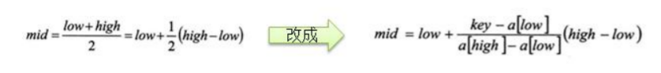
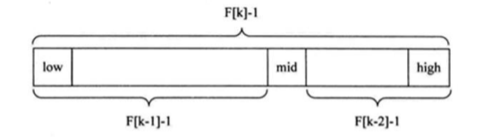

# 查找算法介绍

在 java 中，我们常用的查找有四种: 

1) 顺序(线性)查找 

2) 二分查找/折半查找 

3) 插值查找 

4) 斐波那契查找

# 1、线性查找

有一个数列： {1,8, 10, 89, 1000, 1234} ，判断数列中是否包含此名称【顺序查找】 要求: 如果找到了，就提 示找到，并给出下标值。

## 线性查找代码实现

```java
/**
 * @Author Maybe
 * Date on 2021/12/12  21:49
 */

public class SeqSearch {
    public static void main(String[] args) {
        int arr[] = {1, 9, 11, -1, 34, 89};// 没有顺序的数组
        int index = seqSearch(arr, -11);
        if (index == -1) {
            System.out.println("没有找到到");
        } else {
            System.out.println("找到，下标为=" + index);
        }
    }

    /**
     * 这里我们实现的线性查找是找到一个满足条件的值，就返回
     * @param arr
     * @param value
     * @return
     */
    public static int seqSearch(int[] arr, int value) {
        // 线性查找是逐一比对，发现有相同值，就返回下标
        for (int i = 0; i < arr.length; i++) {
            if (arr[i] == value) {
                return i;
            }
        }
        return -1;
    }
}
```

# 2、二分查找

## 2.1 二分查找

请对一个有序数组进行二分查找 {1,8, 10, 89, 1000, 1234} ，输入一个数看看该数组是否存在此数，并且求出下标，如果没有就提示"没有这个数"。

## 2.2 二分查找的思路

**注意：**==使用二分查找的前提是 该数组是有序的==

1. 首先确定该数组的中间的下标 `mid= (left +right) / 2`
2. 然后让需要查找的数 findVal 和 arr[mid]比较
   1.  findVal>arr[mid],说明你要查找的数在mid的右边，因此需要递归的向右查找
   2. findVal< a[(mid],说明你要查找的数在mid的左边，因此需要递归的向左查找
   3. findVal== arr[mid]说明找到，就返回

**什么时候结束递归？**

- 找到就结束递归
- 递归完整个数组，仍然没有找到findVal ，也需要结束递归当 left> right 就需要退出

##  2.3 二分查找的代码实现

说明：增加了找到所有的满足条件的元素下标

{1, 8, 10, 89, 1000, 1000, 1234} 当一个有序数组中，有多个相同的数值时，如何将所有的数值 都查找到，比如这里的 1000

```java
/**
 * @Author Maybe
 * Date on 2021/12/12  21:59
 */
//注意：使用二分查找的前提是 该数组是有序的.
public class BinarySearch {
    public static void main(String[] args) {
        int arr[] = {1, 8, 10, 89, 1000, 1000, 1234};
        // int resIndex = binarySearch(arr, 0, arr.length - 1, 1000);
        // System.out.println("resIndex=" + resIndex);
        List<Integer> resIndexList = binarySearch2(arr, 0, arr.length - 1, 1000);
        System.out.println("resIndexList=" + resIndexList);
    }

    /**
     * 二分查找算法
     *
     * @param arr     数组
     * @param left    左边的索引
     * @param right   右边的索引
     * @param findVal 要找的值
     * @return
     */
    public static int binarySearch(int[] arr, int left, int right, int findVal) {
        // 当 left > right 时，说明递归整个数组，但是没有找到
        if (left > right) {
            return -1;
        }
        int mid = (left + right) / 2;
        int midVal = arr[mid];
        if (findVal > midVal) {
            // 向右递归
            return binarySearch(arr, mid + 1, right, findVal);
        } else if (findVal < midVal) {
            // 向左递归
            return binarySearch(arr, left, mid - 1, findVal);
        } else {
            return mid;
        }
    }

    /*
     * 课后思考题： {1,8, 10, 89, 1000, 1000，1234} 当一个有序数组中，
     * 有多个相同的数值时，如何将所有的数值都查找到，比如这里的 1000
     */
    public static List<Integer> binarySearch2(int[] arr, int left, int right, int findVal) {
        // 当 left > right 时，说明递归整个数组，但是没有找到
        if (left > right) {
            return new ArrayList<Integer>();
        }
        int mid = (left + right) / 2;
        int midVal = arr[mid];
        if (findVal > midVal) {
            // 向右递归
            return binarySearch2(arr, mid + 1, right, findVal);
        } else if (findVal < midVal) {
            // 向左递归
            return binarySearch2(arr, left, mid - 1, findVal);
        } else {
            // 思路分析
            //  1. 在找到 mid 索引值，不要马上返回
            //  2. 向 mid 索引值的左边扫描，将所有满足 1000， 的元素的下标，加入到集合 ArrayList
            //  3. 向 mid 索引值的右边扫描，将所有满足 1000， 的元素的下标，加入到集合 ArrayList
            //  4. 将 Arraylist 返回
            List<Integer> resIndexList = new ArrayList<Integer>();
            //向 mid 索引值的左边扫描，将所有满足 1000， 的元素的下标，加入到集合ArrayList
            int temp = mid - 1;
            while (true) {
                if (temp < 0 || arr[temp] != findVal) {
                    break;
                }
                //否则，就 temp 放入到 resIndexList
                resIndexList.add(temp);
                temp -= 1;//temp 左移
            }
            resIndexList.add(mid);
            //向 mid 索引值的右边扫描，将所有满足 1000， 的元素的下标，加入到集合ArrayList
            temp = mid + 1;
            while (true) {
                if (temp > arr.length - 1 || arr[temp] != findVal) {
                    break;
                }
                //否则，将 temp 放入到 resIndexList
                resIndexList.add(temp);
                temp += 1;//temp 右移
            }
            return resIndexList;
        }
    }
}
```

# 3、插值查找

## 3.1 插值查找原理介绍

插值查找算法类似于二分查找，不同的是插值查找每次从自适应 mid 处开始查找（==**说明了插值查找也需要先排序**==）。

 将折半查找中的求 mid 索引的公式 , low 表示左边索引 left，high 表示右边索引 right，key 就是前面我们讲的 findVal



## 3.2 插值查找举例说明

数组arr={1, 2, 3, ...100}，假如我们需要查找的值1

使用二分查找的话，我们需要多次递归，才能找到1

使用插值查找算法

```java
int mid = left + (right- left) * (findval - arr[left]) / (arr[right] - arr[left])
int mid = 0 + (99 - 0) * (1 - 1) / (100 - 1) = 0 + 99 * 0 / 99 = 0
```

比如我们查找的值100

```java
int mid = 0 + (99 - 0) * (100 - 1) / (100 - 1) = 0 + 99 * 99 / 99 = 0 + 99 = 99
```

## 3.3 代码实现

请对一个有序数组进行插值查找 {1,8, 10, 89, 1000, 1234} ，输入一个数看看该数组是否存在此数，并且求出下标，如果没有就提示"没有这个数"。

```java
/**
 * @Author Maybe
 * Date on 2021/12/13  15:51
 */
//说明：插值查找算法，也要求数组是有序的
public class InsertValueSearch {
    public static void main(String[] args) {
//        int[] arr = new int[100];
//        for (int i = 0; i < 100; i++) {
//            arr[i] = i + 1;
//        }
        int arr[] = {1, 8, 10, 89, 1000, 1000, 1234};
        int index = insertValueSearch(arr, 0, arr.length - 1, 1234);
//        int index = binarySearch(arr, 0, arr.length, 1);
        System.out.println("index = " + index);
//        System.out.println(Arrays.toString(arr));
    }

    public static int binarySearch(int[] arr, int left, int right, int findVal) {
        System.out.println("二分查找被调用~");
        // 当 left > right 时，说明递归整个数组，但是没有找到
        if (left > right) {
            return -1;
        }
        int mid = (left + right) / 2;
        int midVal = arr[mid];
        if (findVal > midVal) {
            // 向右递归
            return binarySearch(arr, mid + 1, right, findVal);
        } else if (findVal < midVal) {
            // 向左递归
            return binarySearch(arr, left, mid - 1, findVal);
        } else {
            return mid;
        }
    }

    /**
     * 编写插值查找算法
     * 说明：插值查找算法，也要求数组是有序的
     *
     * @param arr     数组
     * @param left    左索引
     * @param right   右索引
     * @param findVal 要查找的值
     * @return 如果找到，就返回对应的下标，如果没有找到，返回-1
     */
    public static int insertValueSearch(int[] arr, int left, int right, int findVal) {
        System.out.println("插值查找次数~~");
        //注意：findVal < arr[0] 和 findVal > arr[arr.length - 1] 必须需要
        //否则我们得到的 mid 可能越界
        if (left > right || findVal < arr[0] || findVal > arr[arr.length - 1]) {
            return -1;
        }
        // 求出 mid, 自适应
        int mid = left + (right - left) * (findVal - arr[left]) / (arr[right] - arr[left]);
        int midVal = arr[mid];
        if (findVal > midVal) {
            // 说明应该向右边递归
            return insertValueSearch(arr, mid + 1, right, findVal);
        } else if (findVal < midVal) {
            // 说明向左递归查找
            return insertValueSearch(arr, left, mid - 1, findVal);
        } else {
            return mid;
        }
    }
}
```

## 3.4 插值查找注意事项

1. 对于数据量较大，关键字分布比较均匀的查找表来说，采用插值查找, 速度较快

2) 关键字分布不均匀的情况下，该方法不一定比折半查找要好

# 4、斐波那契(黄金分割法)查找

## 4.1 斐波那契(黄金分割法)基本介绍

1) 黄金分割点是指把一条线段分割为两部分，使其中一部分与全长之比等于另一部分与这部分之比。取其前三位 数字的近似值是 0.618。由于按此比例设计的造型十分美丽，因此称为黄金分割，也称为中外比。这是一个神奇的数字，会带来意向不大的效果。 

2) 斐波那契数列 {1, 1, 2, 3, 5, 8, 13, 21, 34, 55 } 发现斐波那契数列的两个相邻数 的比例，无限接近 黄金分割值 0.618

## 4.2 斐波那契查找原理

==**斐波那契查找也是需要先排序**==

斐波那契查找原理与前两种相似，仅仅改变了中间结点（mid）的位置，mid 不再是中间或插值得到，而是位于黄金分割点附近，即 `mid=low+F(k-1)-1`（F 代表斐波那契数列），如下图所示

 

### 对F(k-1)-1的理解

1) 由斐波那契数列 F[k]=F[k-1]+F[k-2] 的性质，可以得到 （F[k]-1）=（F[k-1]-1）+（F[k-2]-1）+1 。该式说明： 只要顺序表的长度为 F[k]-1，则可以将该表分成长度为 F[k-1]-1 和 F[k-2]-1 的两段，即如上图所示。从而中间位置为 mid=low+F(k-1)-1

2) 类似的，每一子段也可以用相同的方式分割 

3) 但顺序表长度 n 不一定刚好等于 F[k]-1，所以需要将原来的顺序表长度 n 增加至 F[k]-1。这里的 k 值只要能使 得 F[k]-1 恰好大于或等于 n 即可，由以下代码得到,顺序表长度增加后，新增的位置（从 n+1 到 F[k]-1 位置）， 都赋为 n 位置的值即可。

   ```java
   while(n>fib(k)-1) 
       k++;
   ```

## 4.3 斐波那契查找的代码实现

请对一个**有序数组**进行斐波那契查找 {1,8, 10, 89, 1000, 1234} ，输入一个数看看该数组是否存在此数，并且求 出下标，如果没有就提示"没有这个数"。

```java
/**
 * @Author Maybe
 * Date on 2021/12/13  16:26
 */
//说明：要求数组是有序的
public class FibonacciSearch {
    public static int maxSize = 20;

    public static void main(String[] args) {
        int[] arr = {1, 8, 10, 89, 1000, 1234};
        System.out.println("index=" + fibSearch(arr, 189));// 0
    }

    // 因为后面我们 mid=low+F(k-1)-1，需要使用到斐波那契数列，因此我们需要先获取到一个斐波那契数列
    // 非递归方法得到一个斐波那契数列
    public static int[] fib() {
        int[] f = new int[maxSize];
        f[0] = 1;
        f[1] = 1;
        for (int i = 2; i < maxSize; i++) {
            f[i] = f[i - 1] + f[i - 2];
        }
        return f;
    }

    public static int fibSearch(int[] a, int key) {
        int low = 0;
        int high = a.length - 1;
        int k = 0; //表示斐波那契分割数值的下标
        int mid = 0; //存放 mid 值
        int f[] = fib(); //获取到斐波那契数列
        // 获取到斐波那契分割数值的下标
        while (high > f[k] - 1) {
            k++;
        }
        //因为 f[k] 值 可能大于 a 的 长度，因此我们需要使用 Arrays 类，构造一个新的数组，并指向 temp[]
        // 不足的部分会使用 0 填充
        int[] temp = Arrays.copyOf(a, f[k]);
        //实际上需求使用 a 数组最后的数填充 temp
        // 举例:
        // temp = {1,8, 10, 89, 1000, 1234, 0, 0} => {1,8, 10, 89, 1000, 1234, 1234, 1234,}
        for (int i = high + 1; i < temp.length; i++) {
            temp[i] = a[high];
        }
        // 使用 while 来循环处理，找到我们的数 key
        while (low <= high) { // 只要这个条件满足，就可以找
            mid = low + f[k - 1] - 1;
            if (key < temp[mid]) {
                //我们应该继续向数组的前面查找(左边)
                high = mid - 1;
                //为甚是 k--
                // 说明
                // 1. 全部元素 = 前面的元素 + 后边元素
                // 2. f[k] = f[k-1] + f[k-2]
                // 因为前面有 f[k-1]个元素,所以可以继续拆分 f[k-1] = f[k-2] + f[k-3]
                //即 在 f[k-1] 的前面继续查找 k--
                // 即下次循环 mid = f[k - 1 - 1] - 1
                k--;
            } else if (key > temp[mid]) {
                // 我们应该继续向数组的后面查找(右边)
                low = mid + 1;
                //为什么是 k -=2
                // 说明
                // 1. 全部元素 = 前面的元素 + 后边元素
                // 2. f[k] = f[k-1] + f[k-2]
                // 3. 因为后面我们有 f[k-2] 所以可以继续拆分 f[k-1] = f[k-3] + f[k-4]
                // 4. 即在 f[k-2] 的前面进行查找 k -=2
                // 5. 即下次循环 mid = f[k - 1 - 2] - 1
                k -= 2;
            } else {
                //找到
                //需要确定，返回的是哪个下标
                if (mid <= high) {
                    return mid;
                } else {
                    return high;
                }
            }
        }
        return -1;
    }
}
```

