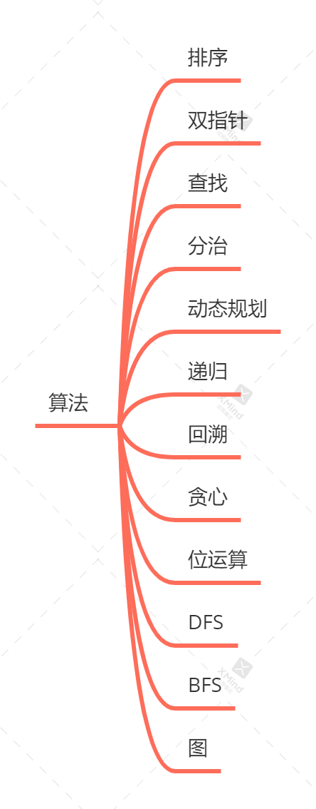
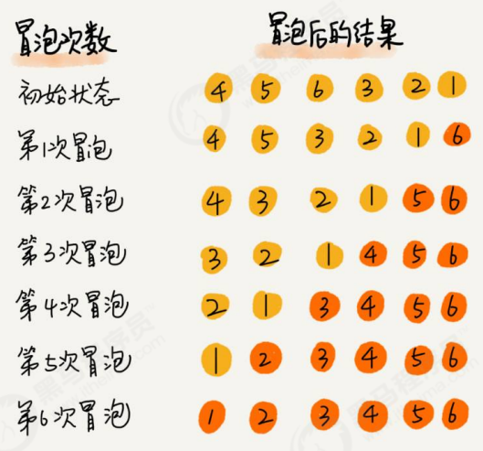
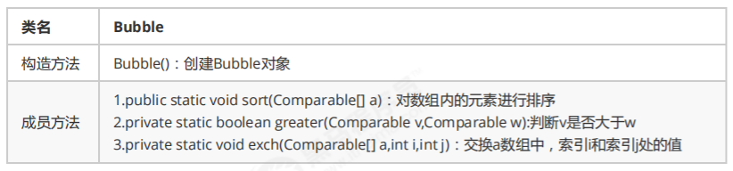
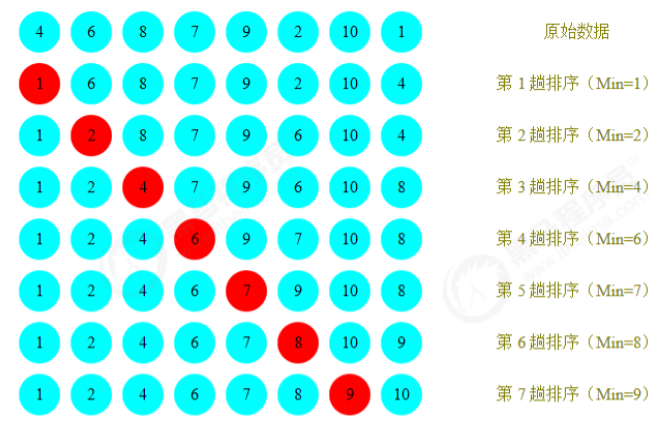
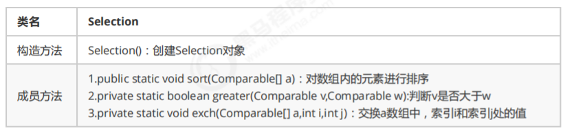
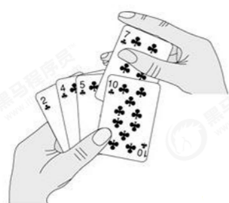
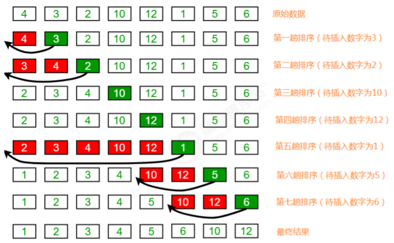
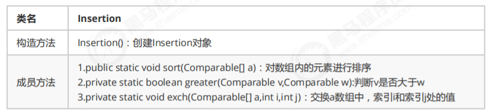

[toc]

 

# 1、简单排序

在我们的程序中，排序是非常常见的一种需求，提供一些数据元素，把这些数据元素按照一定的规则进行排序。比如查询一些订单，按照订单的日期进行排序；再比如查询一些商品，按照商品的价格进行排序等等。所以，接下来我们要学习一些常见的排序算法。

在java的开发工具包jdk中，已经给我们提供了很多数据结构与算法的实现，比如List，Set，Map，Math等等，都是以API的方式提供，这种方式的好处在于一次编写，多处使用。

## 1.1 Comparable接口介绍

由于我们这里要讲排序，所以肯定会在元素之间进行比较，而Java提供了一个接口Comparable就是用来定义排序规则的，在这里我们以案例的形式对Comparable接口做一个简单的回顾。

**需求：**

1. 定义一个学生类Student，具有年龄age和姓名username两个属性，并通过Comparable接口提供比较规则；

2. 定义测试类Test，在测试类Test中定义测试方法`Comparable getMax(Comparable c1,Comparable c2)`完成测试

```java
/**
 * @Author Maybe
 * Date on 2021/12/9  17:22
 */
//学生类
public class Student implements Comparable<Student> {
    private String username;
    private int age;

    public String getUsername() {
        return username;
    }

    public void setUsername(String username) {
        this.username = username;
    }

    public int getAge() {
        return age;
    }

    public void setAge(int age) {
        this.age = age;
    }

    @Override
    public String toString() {
        return "Student{" + "username='" + username + '\'' + ", age=" + age + '}';
    }

    //定义比较规则
    @Override
    public int compareTo(Student o) {
        return this.getAge() - o.getAge();
    }
}
```

```java
/**
 * @Author Maybe
 * Date on 2021/12/9  17:23
 */
//测试类
public class Test1 {
    public static void main(String[] args) {
        Student stu1 = new Student();
        stu1.setUsername("zhangsan");
        stu1.setAge(17);
        Student stu2 = new Student();
        stu2.setUsername("lisi");
        stu2.setAge(19);
        Comparable max = getMax(stu1, stu2);
        System.out.println(max);
    }

    //测试方法，获取两个元素中的较大值
    public static Comparable getMax(Comparable c1, Comparable c2) {
        int cmp = c1.compareTo(c2);
        if (cmp >= 0) {
            return c1;
        } else {
            return c2;
        }
    }
}
```

## 1.2 冒泡排序

冒泡排序（Bubble Sort），是一种计算机科学领域的较简单的排序算法。

**需求：**

排序前：{4,5,6,3,2,1}

排序后：{1,2,3,4,5,6}

**排序原理：**

1. 比较相邻的元素。如果前一个元素比后一个元素大，就交换这两个元素的位置。

2. 对每一对相邻元素做同样的工作，从开始第一对元素到结尾的最后一对元素。最终最后位置的元素就是最大值。



### 冒泡排序API设计

 

### 冒泡排序代码实现

```java
/**
 * @Author Maybe
 * Date on 2021/12/9  17:31
 */
//排序代码
public class Bubble {

    //对数组a中的元素进行排序
    public static void sort(Comparable[] a) {
        for (int i = a.length - 1; i > 0; i--) {
            for (int j = 0; j < i; j++) {
                if (greater(a[j], a[j + 1])) {
                    exchange(a, j, j + 1);
                }
            }
        }
    }

    //比较v元素是否大于w元素
    private static boolean greater(Comparable v, Comparable w) {
        return v.compareTo(w) > 0;
    }

    //数组元素i和j交换位置
    private static void exchange(Comparable[] a, int i, int j) {
        Comparable t = a[i];
        a[i] = a[j];
        a[j] = t;
    }
}
```

```java
/**
 * @Author Maybe
 * Date on 2021/12/9  17:34
 */
//测试代码 
public class Test {
    public static void main(String[] args) {
        Integer[] a = {4, 5, 6, 3, 2, 1};
        Bubble.sort(a);
        System.out.println(Arrays.toString(a));
    }
}
```

**冒泡排序的时间复杂度分析** 冒泡排序使用了双层for循环，其中内层循环的循环体是真正完成排序的代码，所以，我们分析冒泡排序的时间复杂度，主要分析一下内层循环体的执行次数即可。

在最坏情况下，也就是假如要排序的元素为{6,5,4,3,2,1}逆序，那么：

元素比较的次数为：
`(N-1)+(N-2)+(N-3)+...+2+1=((N-1)+1)*(N-1)/2=N^2/2-N/2`;

元素交换的次数为：
`(N-1)+(N-2)+(N-3)+...+2+1=((N-1)+1)*(N-1)/2=N^2/2-N/2`;

总执行次数为：
`(N^2/2-N/2)+(N^2/2-N/2)=N^2-N`;

按照大O推导法则，保留函数中的最高阶项那么最终冒泡排序的时间复杂度为**O(N^2)**

## 1.3 选择排序

选择排序是一种更加简单直观的排序方法。

**需求：**

排序前：{4,6,8,7,9,2,10,1}

排序后：{1,2,4,5,7,8,9,10}

**排序原理：**

1. 每一次遍历的过程中，都假定第一个索引处的元素是最小值，和其他索引处的值依次进行比较，如果当前索引处的值大于其他某个索引处的值，则假定其他某个索引出的值为最小值，最后可以找到最小值所在的索引

2. 交换第一个索引处和最小值所在的索引处的值



### 选择排序API

 

### 选择排序代码实现

```java
/**
 * @Author Maybe
 * Date on 2021/12/9  17:39
 */
public class Selection {
    /* 对数组a中的元素进行排序 */
    public static void sort(Comparable[] a) {
        for (int i = 0; i <= a.length - 2; i++) {
            //假定本次遍历，最小值所在的索引是i
            int minIndex = i;
            for (int j = i + 1; j < a.length; j++) {
                if (greater(a[minIndex], a[j])) {
                    //跟换最小值所在的索引
                    minIndex = j;
                }
            }
            //交换i索引处和minIndex索引处的值
            exch(a, i, minIndex);
        }
    }

    /* 比较v元素是否大于w元素 */
    private static boolean greater(Comparable v, Comparable w) {
        return v.compareTo(w) > 0;
    }

    /* 数组元素i和j交换位置 */
    private static void exch(Comparable[] a, int i, int j) {
        Comparable t = a[i];
        a[i] = a[j];
        a[j] = t;
    }
}
```

```java
/**
 * @Author Maybe
 * Date on 2021/12/9  17:39
 */
//测试代码
public class Test {
    public static void main(String[] args) {
        Integer[] a = {4, 6, 8, 7, 9, 2, 10, 1};
        Selection.sort(a);
        System.out.println(Arrays.toString(a));
    }
}
```

**选择排序的时间复杂度分析：**

选择排序使用了双层for循环，其中外层循环完成了数据交换，内层循环完成了数据比较，所以我们分别统计数据交换次数和数据比较次数：

数据比较次数：
`(N-1)+(N-2)+(N-3)+...+2+1=((N-1)+1)*(N-1)/2=N^2/2-N/2`;

数据交换次数：
N-1

时间复杂度：
`N^2/2-N/2+（N-1）=N^2/2+N/2-1`;

根据大O推导法则，保留最高阶项，去除常数因子，时间复杂度为**O(N^2)**

## 1.4 插入排序

插入排序（Insertion sort）是一种简单直观且稳定的排序算法。

插入排序的工作方式非常像人们排序一手扑克牌一样。开始时，我们的左手为空并且桌子上的牌面朝下。然后，我们每次从桌子上拿走一张牌并将它插入左手中正确的位置。为了找到一张牌的正确位置，我们从右到左将它与已在手中的每张牌进行比较，如下图所示：



**需求：**

排序前：{4,3,2,10,12,1,5,6}

排序后：{1,2,3,4,5,6,10,12}

**排序原理：**

1. 把所有的元素分为两组，已经排序的和未排序的；

2. 找到未排序的组中的第一个元素，向已经排序的组中进行插入；

3. 倒叙遍历已经排序的元素，依次和待插入的元素进行比较，直到找到一个元素小于等于待插入元素，那么就把待插入元素放到这个位置，其他的元素向后移动一位；



### 插入排序API设计

 

### 插入排序代码实现

```java
/**
 * @Author Maybe
 * Date on 2021/12/9  17:45
 */
public class Insertion {
    /* 对数组a中的元素进行排序 */
    public static void sort(Comparable[] a) {
        for (int i = 1; i < a.length; i++) {
            //当前元素为a[i],依次和i前面的元素比较，找到一个小于等于a[i]的元素
            for (int j = i; j > 0; j--) {
                if (greater(a[j - 1], a[j])) {
                    //交换元素
                    exch(a, j - 1, j);
                } else {
                    //找到了该元素，结束
                    break;
                }
            }
        }
    }

    /* 比较v元素是否大于w元素 */
    private static boolean greater(Comparable v, Comparable w) {
        return v.compareTo(w) > 0;
    }

    /*数组元素i和j交换位置 */
    private static void exch(Comparable[] a, int i, int j) {
        Comparable t = a[i];
        a[i] = a[j];
        a[j] = t;
    }
}
```

**插入排序的时间复杂度分析**

插入排序使用了双层for循环，其中内层循环的循环体是真正完成排序的代码，所以，我们分析插入排序的时间复杂度，主要分析一下内层循环体的执行次数即可。

最坏情况，也就是待排序的数组元素为{12,10,6,5,4,3,2,1}，那么：

比较的次数为：
`(N-1)+(N-2)+(N-3)+...+2+1=((N-1)+1)*(N-1)/2=N^2/2-N/2`;

交换的次数为：
`(N-1)+(N-2)+(N-3)+...+2+1=((N-1)+1)*(N-1)/2=N^2/2-N/2`;

总执行次数为：
`(N^2/2-N/2)+(N^2/2-N/2)=N^2-N`;

按照大O推导法则，保留函数中的最高阶项那么最终插入排序的时间复杂度为**O(N^2)**

