[toc]

# Spring概述及IOC理论推导

## 概述

> **简介**

Spring : 春天 --->给软件行业带来了春天

2002年，Rod Jahnson首次推出了Spring框架雏形interface21框架。

2004年3月24日，Spring框架以interface21框架为基础，经过重新设计，发布了1.0正式版。

很难想象Rod Johnson的学历 , 他是悉尼大学的博士，然而他的专业不是计算机，而是音乐学。

Spring理念 : 使现有技术更加实用 . 本身就是一个大杂烩 , 整合现有的框架技术

官网 : http://spring.io/

官方下载地址 : https://repo.spring.io/libs-release-local/org/springframework/spring/

GitHub : https://github.com/spring-projects

### 优点

> **优点**

1、Spring是一个开源免费的框架 , 容器  .

2、Spring是一个轻量级的框架 , 非侵入式的 .

**3、控制反转 IoC  , 面向切面 Aop**

4、对事物的支持 , 对框架的支持

.......

一句话概括：

**Spring是一个轻量级的控制反转(IoC)和面向切面(AOP)的容器（框架）。**

### 组成

> **组成**

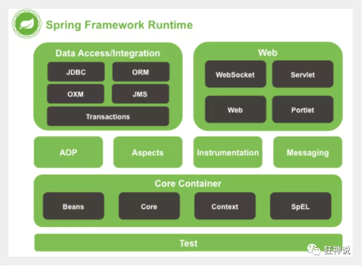

Spring 框架是一个分层架构，由 7 个定义良好的模块组成。Spring 模块构建在核心容器之上，核心容器定义了创建、配置和管理 bean 的方式 .

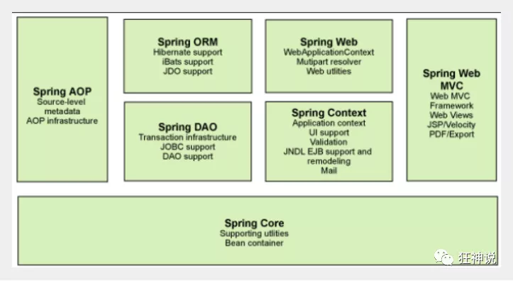

组成 Spring 框架的每个模块（或组件）都可以单独存在，或者与其他一个或多个模块联合实现。每个模块的功能如下：

- **核心容器**：核心容器提供 Spring 框架的基本功能。核心容器的主要组件是 BeanFactory，它是工厂模式的实现。BeanFactory 使用*控制反转*（IOC） 模式将应用程序的配置和依赖性规范与实际的应用程序代码分开。
- **Spring 上下文**：Spring 上下文是一个配置文件，向 Spring 框架提供上下文信息。Spring 上下文包括企业服务，例如 JNDI、EJB、电子邮件、国际化、校验和调度功能。
- **Spring AOP**：通过配置管理特性，Spring AOP 模块直接将面向切面的编程功能 , 集成到了 Spring 框架中。所以，可以很容易地使 Spring 框架管理任何支持 AOP的对象。Spring AOP 模块为基于 Spring 的应用程序中的对象提供了事务管理服务。通过使用 Spring AOP，不用依赖组件，就可以将声明性事务管理集成到应用程序中。
- **Spring DAO**：JDBC DAO 抽象层提供了有意义的异常层次结构，可用该结构来管理异常处理和不同数据库供应商抛出的错误消息。异常层次结构简化了错误处理，并且极大地降低了需要编写的异常代码数量（例如打开和关闭连接）。Spring DAO 的面向 JDBC 的异常遵从通用的 DAO 异常层次结构。
- **Spring ORM**：Spring 框架插入了若干个 ORM 框架，从而提供了 ORM 的对象关系工具，其中包括 JDO、Hibernate 和 iBatis SQL Map。所有这些都遵从 Spring 的通用事务和 DAO 异常层次结构。
- **Spring Web 模块**：Web 上下文模块建立在应用程序上下文模块之上，为基于 Web 的应用程序提供了上下文。所以，Spring 框架支持与 Jakarta Struts 的集成。Web 模块还简化了处理多部分请求以及将请求参数绑定到域对象的工作。
- **Spring MVC 框架**：MVC 框架是一个全功能的构建 Web 应用程序的 MVC 实现。通过策略接口，MVC 框架变成为高度可配置的，MVC 容纳了大量视图技术，其中包括 JSP、Velocity、Tiles、iText 和 POI。

### 拓展

> **拓展**

**Spring Boot与Spring Cloud**

- Spring Boot 是 Spring 的一套快速配置脚手架，可以基于Spring Boot 快速开发单个微服务;
- Spring Cloud是基于Spring Boot实现的；
- Spring Boot专注于快速、方便集成的单个微服务个体，Spring Cloud关注全局的服务治理框架；
- Spring Boot使用了约束优于配置的理念，很多集成方案已经帮你选择好了，能不配置就不配置 , Spring Cloud很大的一部分是基于Spring Boot来实现，Spring Boot可以离开Spring Cloud独立使用开发项目，但是Spring Cloud离不开Spring Boot，属于依赖的关系。
- SpringBoot在SpringClound中起到了承上启下的作用，如果你要学习SpringCloud必须要学习SpringBoot。


## IOC理论推导

> 过程 

那么我们要使用Oracle , 又需要去service实现类里面修改对应的实现 . 假设我们的这种需求非常大 , 这种方式就根本不适用了, 甚至反人类对吧 , 每次变动 , 都需要修改大量代码 . 这种设计的耦合性太高了, 牵一发而动全身 .

**那我们如何去解决呢 ?** 

我们可以在需要用到他的地方 , 不去实现它 , 而是留出一个接口 , 利用set , 我们去代码里修改下 

大家发现了区别没有 ? 可能很多人说没啥区别 . 但是同学们 , 他们已经发生了根本性的变化 , 很多地方都不一样了 . 仔细去思考一下 , 以前所有东西都是由程序去进行控制创建 , 而现在是由我们自行控制创建对象 , 把主动权交给了调用者 . 程序不用去管怎么创建,怎么实现了 . 它只负责提供一个接口 .

这种思想 , 从本质上解决了问题 , 我们程序员不再去管理对象的创建了 , 更多的去关注业务的实现 . 耦合性大大降低 . 这也就是IOC的原型 !

### IOC本质

> **IOC本质**

**控制反转IoC(Inversion of Control)，是一种设计思想，DI(依赖注入)是实现IoC的一种方法**，也有人认为DI只是IoC的另一种说法。没有IoC的程序中 , 我们使用面向对象编程 , 对象的创建与对象间的依赖关系完全硬编码在程序中，对象的创建由程序自己控制，控制反转后将对象的创建转移给第三方，个人认为所谓控制反转就是：获得依赖对象的方式反转了。

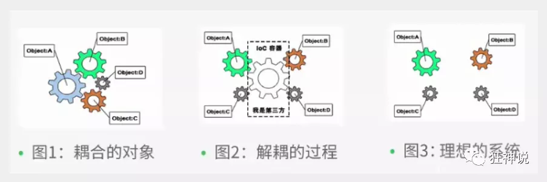

**IoC是Spring框架的核心内容**，使用多种方式完美的实现了IoC，可以使用XML配置，也可以使用注解，新版本的Spring也可以零配置实现IoC。

Spring容器在初始化时先读取配置文件，根据配置文件或元数据创建与组织对象存入容器中，程序使用时再从Ioc容器中取出需要的对象。

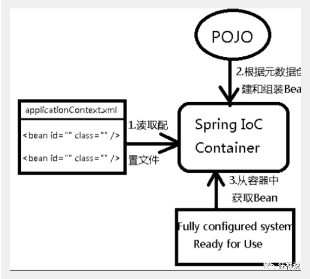

采用XML方式配置Bean的时候，Bean的定义信息是和实现分离的，而采用注解的方式可以把两者合为一体，Bean的定义信息直接以注解的形式定义在实现类中，从而达到了零配置的目的。

**控制反转是一种通过描述（XML或注解）并通过第三方去生产或获取特定对象的方式。在Spring中实现控制反转的是IoC容器，其实现方法是依赖注入（Dependency Injection,DI）。**

# 快速上手Spring

## Hello Spring

> 导入Jar包

注 : spring 需要导入commons-logging进行日志记录 . 我们利用maven , 他会自动下载对应的依赖项 .

```xml
<dependency>
   <groupId>org.springframework</groupId>
   <artifactId>spring-webmvc</artifactId>
   <version>5.1.10.RELEASE</version>
</dependency>
```

> 编写代码

1、编写一个Hello实体类

```java
public class Hello {
   private String name;

   public String getName() {
       return name;
  }
   public void setName(String name) {
       this.name = name;
  }

   public void show(){
       System.out.println("Hello,"+ name );
  }
}
```

2、编写我们的spring文件 , 这里我们命名为beans.xml

```xml
<?xml version="1.0" encoding="UTF-8"?>
<beans xmlns="http://www.springframework.org/schema/beans"
      xmlns:xsi="http://www.w3.org/2001/XMLSchema-instance"
      xsi:schemaLocation="http://www.springframework.org/schema/beans
       http://www.springframework.org/schema/beans/spring-beans.xsd">

   <!--bean就是java对象 , 由Spring创建和管理-->
   <!--
       bean标签的作用：将一个类的实例通过反射机制创建出来，装载进核心容器中

       id属性：唯一标识，不能重复的

       class属性：属性值就是类的权限定类名

       scope属性：可以去设置该实例的作用范围

    -->
   <bean id="hello" class="com.kuang.pojo.Hello">
       <property name="name" value="Spring"/>
   </bean>

</beans>
```

3、我们可以去进行测试了 .

```java
@Test
public void test(){
   //解析beans.xml文件 , 生成管理相应的Bean对象
   ApplicationContext context = new ClassPathXmlApplicationContext("beans.xml");
   //getBean : 参数即为spring配置文件中bean的id .
   Hello hello = (Hello) context.getBean("hello");
   hello.show();
}
```

> 思考

- Hello 对象是谁创建的 ?  【hello 对象是由Spring创建的
- Hello 对象的属性是怎么设置的 ?  hello 对象的属性是由Spring容器设置的

这个过程就叫控制反转 :

- 控制 : 谁来控制对象的创建 , 传统应用程序的对象是由程序本身控制创建的 , 使用Spring后 , 对象是由Spring来创建的
- 反转 : 程序本身不创建对象 , 而变成被动的接收对象 .

依赖注入 : 就是利用set方法来进行注入的.

 <u>IOC是一种编程思想，由主动的编程变成被动的接收</u>

可以通过newClassPathXmlApplicationContext去浏览一下底层源码 .

> **修改案例一**

我们在案例一中， 新增一个Spring配置文件beans.xml

```xml
<?xml version="1.0" encoding="UTF-8"?>
<beans xmlns="http://www.springframework.org/schema/beans"
      xmlns:xsi="http://www.w3.org/2001/XMLSchema-instance"
      xsi:schemaLocation="http://www.springframework.org/schema/beans
       http://www.springframework.org/schema/beans/spring-beans.xsd">

   <bean id="MysqlImpl" class="com.kuang.dao.impl.UserDaoMySqlImpl"/>
   <bean id="OracleImpl" class="com.kuang.dao.impl.UserDaoOracleImpl"/>

   <bean id="ServiceImpl" class="com.kuang.service.impl.UserServiceImpl">
       <!--注意: 这里的name并不是属性 , 而是set方法后面的那部分 , 首字母小写-->
       <!--属性如果是基本数据类型，则可以直接用value赋值-->
       <!--属性如果是引用数据类型则需要引用另外一个bean , 不是用value 而是用 ref-->
       <property name="userDao" ref="OracleImpl"/>
   </bean>

</beans>
```

测试！

```java
@Test
public void test2(){
   ApplicationContext context = new ClassPathXmlApplicationContext("beans.xml");
   UserServiceImpl serviceImpl = (UserServiceImpl) context.getBean("ServiceImpl");
   serviceImpl.getUser();
}
```

OK , 到了现在 , 我们彻底不用再程序中去改动了 , 要实现不同的操作 , 只需要在xml配置文件中进行修改 , 所谓的IoC,**一句话搞定 : 对象由Spring 来创建 , 管理 , 装配 !** 

## IOC创建对象的方式

> 一般是通过无参构造方法来创建

1、User.java

```java
public class User {

   private String name;

   public User() {
       System.out.println("user无参构造方法");
  }

   public void setName(String name) {
       this.name = name;
  }

   public void show(){
       System.out.println("name="+ name );
  }

}
```

2、beans.xml

```xml
<?xml version="1.0" encoding="UTF-8"?>
<beans xmlns="http://www.springframework.org/schema/beans"
      xmlns:xsi="http://www.w3.org/2001/XMLSchema-instance"
      xsi:schemaLocation="http://www.springframework.org/schema/beans
       http://www.springframework.org/schema/beans/spring-beans.xsd">

   <bean id="user" class="com.kuang.pojo.User">
       <property name="name" value="kuangshen"/>
   </bean>

</beans>
```

3、测试类

```java
@Test
public void test(){
   ApplicationContext context = new ClassPathXmlApplicationContext("beans.xml");
   //在执行getBean的时候, user已经创建好了 , 通过无参构造
   User user = (User) context.getBean("user");
   //调用对象的方法 .
   user.show();
}
```

结果可以发现，在调用show方法之前，User对象已经通过无参构造初始化了！

> **通过有参构造来创建**

beans.xml 有三种方式编写

```xml
<!-- 第一种根据index参数下标设置 -->
<bean id="userT" class="com.kuang.pojo.UserT">
   <!-- index指构造方法 , 下标从0开始 -->
   <constructor-arg index="0" value="kuangshen2"/>
</bean>
<!-- 第二种根据参数名字设置 -->
<bean id="userT" class="com.kuang.pojo.UserT">
   <!-- name指参数名 -->
   <constructor-arg name="name" value="kuangshen2"/>
</bean>
<!-- 第三种根据参数类型设置 -->
<bean id="userT" class="com.kuang.pojo.UserT">
   <constructor-arg type="java.lang.String" value="kuangshen2"/>
</bean>
```

**结论：**在配置文件加载的时候。其中管理的对象都已经初始化了！

## Spring配置

> 别名

alias 设置别名 , 为bean设置别名 , 可以设置多个别名

```xml
<!--设置别名：在获取Bean的时候可以使用别名获取-->
<alias name="userT" alias="userNew"/>
```

> Bean的配置

```xml
<!--bean就是java对象,由Spring创建和管理-->

<!--
   id 是bean的标识符,要唯一,如果没有配置id,name就是默认标识符
   如果配置id,又配置了name,那么name是别名
   name可以设置多个别名,可以用逗号,分号,空格隔开
   如果不配置id和name,可以根据applicationContext.getBean(.class)获取对象;

class是bean的全限定名=包名+类名
-->
<bean id="hello" name="hello2 h2,h3;h4" class="com.kuang.pojo.Hello">
   <property name="name" value="Spring"/>
</bean>
```

> import

这个import, 一般用于团队开发使用,他可以将多个配置文件,导入合并为一个
假设，现在项目中有多个人开发,这三个人复制不同的类开发,不同的类需要注册在不同的bean中，我们可以利用import将所有人的beans.xml合并为一个总的!

- 张三
- 李四
- 王五
- applicationContext.xml

```xml
<import resource="beans. xm1"/>
<import resource="beans2. xm1"/>
<import resource="beans3. xm1"/>
```

使用的时候，直接使用总的配置就可以了

# 依赖注入（DI）

> 概念

- 依赖注入（Dependency Injection,DI）。
- 依赖 : 指Bean对象的创建依赖于容器 . Bean对象的依赖资源 .
- 注入 : 指Bean对象所依赖的资源 , 由容器来设置和装配 .

## 构造器注入

> 构造器注入

我们在之前的案例已经讲过了

## set注入

> **Set 注入 （重点）**

要求被注入的属性 , 必须有set方法 , set方法的方法名由set + 属性首字母大写 , 如果属性是boolean类型 , 没有set方法 , 是 is .

1、**常量注入**

```xml
 <bean id="student" class="com.kuang.pojo.Student">
     <property name="name" value="小明"/>
 </bean>
```

测试：

```java
 @Test
 public void test01(){
     ApplicationContext context = new ClassPathXmlApplicationContext("applicationContext.xml");
 
     Student student = (Student) context.getBean("student");
 
     System.out.println(student.getName());
 
 }
```

2、**Bean注入** 

注意点：这里的值是一个引用，ref

```xml
 <bean id="addr" class="com.kuang.pojo.Address">
     <property name="address" value="重庆"/>
 </bean>
 
 <bean id="student" class="com.kuang.pojo.Student">
     <property name="name" value="小明"/>
     <property name="address" ref="addr"/>
 </bean>
```

3、**数组注入**

```xml
 <bean id="student" class="com.kuang.pojo.Student">
     <property name="name" value="小明"/>
     <property name="address" ref="addr"/>
     <property name="books">
         <array>
             <value>西游记</value>
             <value>红楼梦</value>
             <value>水浒传</value>
         </array>
     </property>
 </bean>
```

4、**List注入**

```xml
 <property name="hobbys">
     <list>
         <value>听歌</value>
         <value>看电影</value>
         <value>爬山</value>
     </list>
 </property>
```

5、**Map注入**

```xml
 <property name="card">
     <map>
         <entry key="中国邮政" value="456456456465456"/>
         <entry key="建设" value="1456682255511"/>
     </map>
 </property>
```

6、**set注入**

```xml
 <property name="games">
     <set>
         <value>LOL</value>
         <value>BOB</value>
         <value>COC</value>
     </set>
 </property>
```

7、**Null注入**

```xml
 <property name="wife"><null/></property>
```

8、**Properties注入**

```xml
 <property name="info">
     <props>
         <prop key="学号">20190604</prop>
         <prop key="性别">男</prop>
         <prop key="姓名">小明</prop>
     </props>
 </property>
```

测试结果：

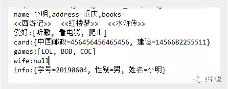

# Bean的作用域

> Bean的作用域

在Spring中，那些组成应用程序的主体及由Spring IoC容器所管理的对象，被称之为bean。简单地讲，bean就是由IoC容器初始化、装配及管理的对象 .

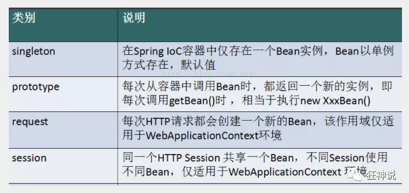

几种作用域中，request、session作用域仅在基于web的应用中使用（不必关心你所采用的是什么web应用框架），只能用在基于web的Spring ApplicationContext环境。

**Singleton**

当一个bean的作用域为Singleton，那么Spring IoC容器中只会存在一个共享的bean实例，并且所有对bean的请求，只要id与该bean定义相匹配，则只会返回bean的同一实例。Singleton是单例类型，就是在创建起容器时就同时自动创建了一个bean的对象，不管你是否使用，他都存在了，每次获取到的对象都是同一个对象。注意，Singleton作用域是Spring中的缺省作用域。要在XML中将bean定义成singleton，可以这样配置：

```xml
 <bean id="ServiceImpl" class="cn.csdn.service.ServiceImpl" scope="singleton">
```

测试：

```java
 @Test
 public void test03(){
     ApplicationContext context = new ClassPathXmlApplicationContext("applicationContext.xml");
     User user = (User) context.getBean("user");
     User user2 = (User) context.getBean("user");
     System.out.println(user==user2);
 }
```

**Prototype**

当一个bean的作用域为Prototype，表示一个bean定义对应多个对象实例。Prototype作用域的bean会导致在每次对该bean请求（将其注入到另一个bean中，或者以程序的方式调用容器的getBean()方法）时都会创建一个新的bean实例。Prototype是原型类型，它在我们创建容器的时候并没有实例化，而是当我们获取bean的时候才会去创建一个对象，而且我们每次获取到的对象都不是同一个对象。根据经验，对有状态的bean应该使用prototype作用域，而对无状态的bean则应该使用singleton作用域。在XML中将bean定义成prototype，可以这样配置：

```xml
 <bean id="account" class="com.foo.DefaultAccount" scope="prototype"/>  
  或者
 <bean id="account" class="com.foo.DefaultAccount" singleton="false"/>
```

**Request**

当一个bean的作用域为Request，表示在一次HTTP请求中，一个bean定义对应一个实例；即每个HTTP请求都会有各自的bean实例，它们依据某个bean定义创建而成。该作用域仅在基于web的Spring ApplicationContext情形下有效。考虑下面bean定义：

```xml
 <bean id="loginAction" class=cn.csdn.LoginAction" scope="request"/>
```

针对每次HTTP请求，Spring容器会根据loginAction bean的定义创建一个全新的LoginAction bean实例，且该loginAction bean实例仅在当前HTTP request内有效，因此可以根据需要放心的更改所建实例的内部状态，而其他请求中根据loginAction bean定义创建的实例，将不会看到这些特定于某个请求的状态变化。当处理请求结束，request作用域的bean实例将被销毁。

**Session**

当一个bean的作用域为Session，表示在一个HTTP Session中，一个bean定义对应一个实例。该作用域仅在基于web的Spring ApplicationContext情形下有效。考虑下面bean定义：

```xml
 <bean id="userPreferences" class="com.foo.UserPreferences" scope="session"/>
```

针对某个HTTP Session，Spring容器会根据userPreferences bean定义创建一个全新的userPreferences bean实例，且该userPreferences bean仅在当前HTTP Session内有效。与request作用域一样，可以根据需要放心的更改所创建实例的内部状态，而别的HTTP Session中根据userPreferences创建的实例，将不会看到这些特定于某个HTTP Session的状态变化。当HTTP Session最终被废弃的时候，在该HTTP Session作用域内的bean也会被废弃掉。

# 自动装配

## 说明

> 自动装配说明

- 自动装配是使用spring满足bean依赖的一种方法
- spring会在应用上下文中为某个bean寻找其依赖的bean。

Spring中bean有三种装配机制，分别是：

1. 在xml中显式配置；
2. 在java中显式配置；
3. 隐式的bean发现机制和自动装配。

这里我们主要讲第三种：自动化的装配bean。

Spring的自动装配需要从两个角度来实现，或者说是两个操作：

1. <u>**组件扫描(component scanning)**：spring会自动发现应用上下文中所创建的bean；</u>
2. <u>**自动装配(autowiring)**：spring自动满足bean之间的依赖，也就是我们说的IoC/DI；</u>

组件扫描和自动装配组合发挥巨大威力，使得显示的配置降低到最少。

**推荐不使用自动装配xml配置 , 而使用注解 .**

## 测试环境搭建

> 测试环境搭建

1、新建一个项目

2、新建两个实体类，Cat  Dog  都有一个叫的方法

```java
public class Cat {
   public void shout() {
       System.out.println("miao~");
  }
}
public class Dog {
   public void shout() {
       System.out.println("wang~");
  }
}
```

3、新建一个用户类 User

```java
public class User {
   private Cat cat;
   private Dog dog;
   private String str;
}
```

4、编写Spring配置文件

```xml
<?xml version="1.0" encoding="UTF-8"?>
<beans xmlns="http://www.springframework.org/schema/beans"
      xmlns:xsi="http://www.w3.org/2001/XMLSchema-instance"
      xsi:schemaLocation="http://www.springframework.org/schema/beans
       http://www.springframework.org/schema/beans/spring-beans.xsd">

   <bean id="dog" class="com.kuang.pojo.Dog"/>
   <bean id="cat" class="com.kuang.pojo.Cat"/>

   <bean id="user" class="com.kuang.pojo.User">
       <property name="cat" ref="cat"/>
       <property name="dog" ref="dog"/>
       <property name="str" value="qinjiang"/>
   </bean>
</beans>
```

5、测试

```java
public class MyTest {
   @Test
   public void testMethodAutowire() {
       ApplicationContext context = new ClassPathXmlApplicationContext("beans.xml");
       User user = (User) context.getBean("user");
       user.getCat().shout();
       user.getDog().shout();
  }
}
```

结果正常输出，环境OK

## autowire byName (按名称自动装配)

> **byName**

**autowire byName (按名称自动装配)**

由于在手动配置xml过程中，常常发生字母缺漏和大小写等错误，而无法对其进行检查，使得开发效率降低。

采用自动装配将避免这些错误，并且使配置简单化。

测试：

1、修改bean配置，增加一个属性  autowire="byName"

```xml
<bean id="user" class="com.kuang.pojo.User" autowire="byName">
   <property name="str" value="qinjiang"/>
</bean>
```

2、再次测试，结果依旧成功输出！

3、我们将 cat 的bean id修改为 catXXX

4、再次测试， 执行时报空指针java.lang.NullPointerException。因为按byName规则找不对应set方法，真正的setCat就没执行，对象就没有初始化，所以调用时就会报空指针错误。

**小结：**

当一个bean节点带有 autowire byName的属性时。

1. 将查找其类中所有的set方法名，例如setCat，获得将set去掉并且首字母小写的字符串，即cat。
2. 去spring容器中寻找是否有此字符串名称id的对象。
3. 如果有，就取出注入；如果没有，就报空指针异常。

## autowire byType (按类型自动装配)

> **byType**

**autowire byType (按类型自动装配)**

使用autowire byType首先需要保证：同一类型的对象，在spring容器中唯一。如果不唯一，会报不唯一的异常。

```java
NoUniqueBeanDefinitionException
```

测试：

1、将user的bean配置修改一下 ： autowire="byType"

2、测试，正常输出

3、在注册一个cat 的bean对象！

```xml
<bean id="dog" class="com.kuang.pojo.Dog"/>
<bean id="cat" class="com.kuang.pojo.Cat"/>
<bean id="cat2" class="com.kuang.pojo.Cat"/>

<bean id="user" class="com.kuang.pojo.User" autowire="byType">
   <property name="str" value="qinjiang"/>
</bean>
```

4、测试，报错：NoUniqueBeanDefinitionException

5、删掉cat2，将cat的bean名称改掉！测试！因为是按类型装配，所以并不会报异常，也不影响最后的结果。甚至将id属性去掉，也不影响结果。

这就是按照类型自动装配！

# 使用注解

> 使用注解

jdk1.5开始支持注解，spring2.5开始全面支持注解。

准备工作：利用注解的方式注入属性。

1、在spring配置文件中引入context文件头

```xml
xmlns:context="http://www.springframework.org/schema/context"

http://www.springframework.org/schema/context
http://www.springframework.org/schema/context/spring-context.xsd
```

2、开启属性注解支持！

```xml
<context:annotation-config/>
```


## @Autowired

- @Autowired是按类型自动转配的，不支持id匹配。
- 需要导入 spring-aop的包！

测试：

1、将User类中的set方法去掉，使用@Autowired注解

```java
public class User {
   @Autowired
   private Cat cat;
   @Autowired
   private Dog dog;
   private String str;

   public Cat getCat() {
       return cat;
  }
   public Dog getDog() {
       return dog;
  }
   public String getStr() {
       return str;
  }
}
```

2、此时配置文件内容

```xml
<context:annotation-config/>

<bean id="dog" class="com.kuang.pojo.Dog"/>
<bean id="cat" class="com.kuang.pojo.Cat"/>
<bean id="user" class="com.kuang.pojo.User"/>
```

3、测试，成功输出结果！

【小狂神科普时间】

@Autowired(required=false)  说明：false，对象可以为null；true，对象必须存对象，不能为null。

```java
//如果允许对象为null，设置required = false,默认为true
@Autowired(required = false)
private Cat cat;
```


## @Qualifier

- @Autowired是根据类型自动装配的，加上@Qualifier则可以根据byName的方式自动装配
- @Qualifier不能单独使用。

测试实验步骤：

1、配置文件修改内容，保证类型存在对象。且名字不为类的默认名字！

```xml
<bean id="dog1" class="com.kuang.pojo.Dog"/>
<bean id="dog2" class="com.kuang.pojo.Dog"/>
<bean id="cat1" class="com.kuang.pojo.Cat"/>
<bean id="cat2" class="com.kuang.pojo.Cat"/>
```

2、没有加Qualifier测试，直接报错

3、在属性上添加Qualifier注解

```java
@Autowired
@Qualifier(value = "cat2")
private Cat cat;
@Autowired
@Qualifier(value = "dog2")
private Dog dog;
```

测试，成功输出！


## @Resource

- @Resource如有指定的name属性，先按该属性进行byName方式查找装配；
- 其次再进行默认的byName方式进行装配；
- 如果以上都不成功，则按byType的方式自动装配。
- 都不成功，则报异常。

实体类：

```java
public class User {
   //如果允许对象为null，设置required = false,默认为true
   @Resource(name = "cat2")
   private Cat cat;
   @Resource
   private Dog dog;
   private String str;
}
```

beans.xml

```xml
<bean id="dog" class="com.kuang.pojo.Dog"/>
<bean id="cat1" class="com.kuang.pojo.Cat"/>
<bean id="cat2" class="com.kuang.pojo.Cat"/>

<bean id="user" class="com.kuang.pojo.User"/>
```

测试：结果OK

配置文件2：beans.xml ， 删掉cat2

```xml
<bean id="dog" class="com.kuang.pojo.Dog"/>
<bean id="cat1" class="com.kuang.pojo.Cat"/>
```

实体类上只保留注解

```java
@Resource
private Cat cat;
@Resource
private Dog dog;
```

结果：OK

结论：先进行byName查找，失败；再进行byType查找，成功。

## 小结

**@Autowired与@Resource异同：**

1、@Autowired与@Resource都可以用来装配bean。都可以写在字段上，或写在setter方法上。

2、@Autowired默认按类型装配（属于spring规范），默认情况下必须要求依赖对象必须存在，如果要允许null 值，可以设置它的required属性为false，如：@Autowired(required=false) ，如果我们想使用名称装配可以结合@Qualifier注解进行使用

3、@Resource（属于J2EE复返），默认按照名称进行装配，名称可以通过name属性进行指定。如果没有指定name属性，当注解写在字段上时，默认取字段名进行按照名称查找，如果注解写在setter方法上默认取属性名进行装配。当找不到与名称匹配的bean时才按照类型进行装配。但是需要注意的是，如果name属性一旦指定，就只会按照名称进行装配。

它们的作用相同都是用注解方式注入对象，但执行顺序不同。@Autowired先byType，@Resource先byName。

# 使用注解开发

> 说明

在spring4之后，想要使用注解形式，必须得要引入aop的包

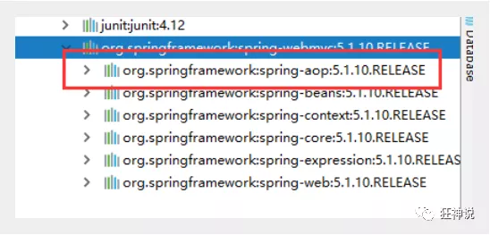

在配置文件当中，还得要引入一个context约束

```xml
<?xml version="1.0" encoding="UTF-8"?>
<beans xmlns="http://www.springframework.org/schema/beans"
      xmlns:xsi="http://www.w3.org/2001/XMLSchema-instance"
      xmlns:context="http://www.springframework.org/schema/context"
      xsi:schemaLocation="http://www.springframework.org/schema/beans
       http://www.springframework.org/schema/beans/spring-beans.xsd
       http://www.springframework.org/schema/context
       http://www.springframework.org/schema/context/spring-context.xsd">

</beans>
```

## Bean的实现

> Bean的实现

我们之前都是使用 bean 的标签进行bean注入，但是实际开发中，我们一般都会使用注解！

1、配置扫描哪些包下的注解

```xml
<!--指定注解扫描包-->
<context:component-scan base-package="com.kuang.pojo"/>
```

2、在指定包下编写类，增加注解

```java
@Component("user")
// 相当于配置文件中 <bean id="user" class="当前注解的类"/>
public class User {
    public String name = "秦疆";
}
```

3、测试

```java
@Test
public void test(){
    ApplicationContext applicationContext =
        new ClassPathXmlApplicationContext("beans.xml");
    User user = (User) applicationContext.getBean("user");
    System.out.println(user.name);
}
```

## 属性注入

> 属性注入

使用注解注入属性

1、可以不用提供set方法，直接在直接名上添加@value("值")

```java
@Component("user")
// 相当于配置文件中 <bean id="user" class="当前注解的类"/>
public class User {
   @Value("秦疆")
   // 相当于配置文件中 <property name="name" value="秦疆"/>
   public String name;
}
```

2、如果提供了set方法，在set方法上添加@value("值");

```java
@Component("user")
public class User {

   public String name;

   @Value("秦疆")
   public void setName(String name) {
       this.name = name;
  }
}
```

## 衍生注解

> 衍生注解

我们这些注解，就是替代了在配置文件当中配置步骤而已！更加的方便快捷！

**@Component三个衍生注解**

为了更好的进行分层，Spring可以使用其它三个注解，功能一样，目前使用哪一个功能都一样。

- @Controller：web层
- @Service：service层
- @Repository：dao层

写上这些注解，就相当于将这个类交给Spring管理装配了！

## 自动装配注解

> 自动装配注解

在Bean的自动装配已经讲过了，可以回顾！

## 作用域

> 作用域

@scope

- singleton：默认的，Spring会采用单例模式创建这个对象。关闭工厂 ，所有的对象都会销毁。
- prototype：多例模式。关闭工厂 ，所有的对象不会销毁。内部的垃圾回收机制会回收

```java
@Controller("user")
@Scope("prototype")
public class User {
   @Value("秦疆")
   public String name;
}
```

## 小结

> **小结**

**XML与注解比较**

- XML可以适用任何场景 ，结构清晰，维护方便
- 注解不是自己提供的类使用不了，开发简单方便

**xml与注解整合开发** ：推荐最佳实践

- xml管理Bean
- 注解完成属性注入
- 使用过程中， 可以不用扫描，扫描是为了类上的注解

```
<context:annotation-config/>  
```

作用：

- 进行注解驱动注册，从而使注解生效
- 用于激活那些已经在spring容器里注册过的bean上面的注解，也就是显示的向Spring注册
- 如果不扫描包，就需要手动配置bean
- 如果不加注解驱动，则注入的值为null！

# 基于Java类进行配置

> 基于Java类进行配置

JavaConfig 原来是 Spring 的一个子项目，它通过 Java 类的方式提供 Bean 的定义信息，在 Spring4 的版本， JavaConfig 已正式成为 Spring4 的核心功能 。

实体类

```java
//这见这个注解的意思，就是说明这个类被Spring接管了，注珊到了容器中
@Component
pub1ic class User {
	private String name;
	pub1ic string getName( {
		return name ;
	}
	@Value ("QINJIANG") //属性注入值
	pub1ic void setName(String name) {
		this. name = name;
	}

	@override
	pub1ic string tostring() {
		return "user{" +
			"name='"+name+'\''+
			'}';
	}
}
```

配置类

```java
// 这个也会Spring容器托管， 注册到容器中，因为他本来就是一个@Component
// @Configuration代表这是一 个配置类，就和我们之前看的beans.xml一样
@Configuration
@ComponentScan("com. kuang.pojo")
//@ComponentScan就是相当于xml中扫描某一区域的标签，使用之后就可以直接用注解到具体类上进行装配
public class KuangConfig {

	//注册一个bean ，就相当于我们之前写的一个bean 标签
	//这个方法的名字，就相当Fbean标签中的d属性
	//这个方法的返回值，就相当Fbean标签中的class属性
	@Bean//通过方法注册一个bean，这里的返回值就Bean的类型，方法名就是bean的id！
	public User user(){
		return new User(); //就是返回要注入到bean的对象!
	}
}
```

测试类

```java
pub1ic class MyTest {
	pub1ic static void main(String[] args) {
	//如果完全使用了配置类方式去做，我们就只能通过AnnotationConfig 上下文来获取容器， 通过配置类的class对象加载!
		Applicati onContext context = new
			Annotati onConfi gApp1 icati onContext (KuangConfig.class);
		user getuser = (User) context. getBean("user");
		System. out. print1n (getuser . getName());
	}
}
```

<u>这种纯Java的配置方式，在SpringBoot中随处可见!</u>

**导入其他配置如何做呢？**

1、我们再编写一个配置类！

```java
@Configuration  //代表这是一个配置类
public class MyConfig2 {
}
```

2、在之前的配置类中我们来选择导入这个配置类

```java
@Configuration
@Import(MyConfig2.class)  //导入合并其他配置类，类似于配置文件中的 inculde 标签
public class MyConfig {
    @Bean
    public Dog dog(){
        return new Dog();
    }
}
```

关于这种Java类的配置方式，我们在之后的SpringBoot 和 SpringCloud中还会大量看到，我们需要知道这些注解的作用即可！

#  	JDK动态代理

**JDK的动态代理需要了解两个类**

核心 : InvocationHandler   和   Proxy  ， 打开JDK帮助文档看看

【InvocationHandler：调用处理程序】

> public interface **Invoc ationHandler**
> InvocationHandler是由代理实例的调用处理程序实现的接口。
> 每个代理实例都有一个关联的调用处理程序。当在代理实例上调用方法时，方法调用将被编码并分派到其调用处理程序的invoke方法

```java
Object invoke(Object proxy, Method method, Object[] args)；
//参数
//proxy - 调用该方法的代理实例
//method -所述方法对应于调用代理实例上的接口方法的实例。方法对象的声明类将是该方法声明的接口，它可以是代理类继承该方法的代理接口的超级接口。
//args -包含的方法调用传递代理实例的参数值的对象的阵列，或null如果接口方法没有参数。原始类型的参数包含在适当的原始包装器类的实例中，例如java.lang.Integer或java.lang.Boolean 。
```

【Proxy  : 代理】

> public class **Proxy**
> extends Object
> implements Serializable
> Proxy提供了创建动态代理类和实例的静态方法，它也是由这些方法创建的所有动态代理类的超类

> 动态代理类(以下简称为代理类)是一个实现在类创建时在运行时指定的接口列表的类，具有如下所述的行为。代理楼P是由代理类实现的接口。代理实例是代理类的一个实例。每个代理实例都有一个关联的调用处理程序对象，它实现了接口InvocationHandler。通过其代理接口之一的代理实例上的方法调用将被分派到实例调用处理程序的invoke方法，传递代理实例，java. lang. reflect .Method被调用方法的java. lang. reflect.Method对象以及包含参数的类型0bject object的数组。调用处理程序适当地处理编码方法调用,并且返回的结果将作为方法在代理实例上调用的结果返回。

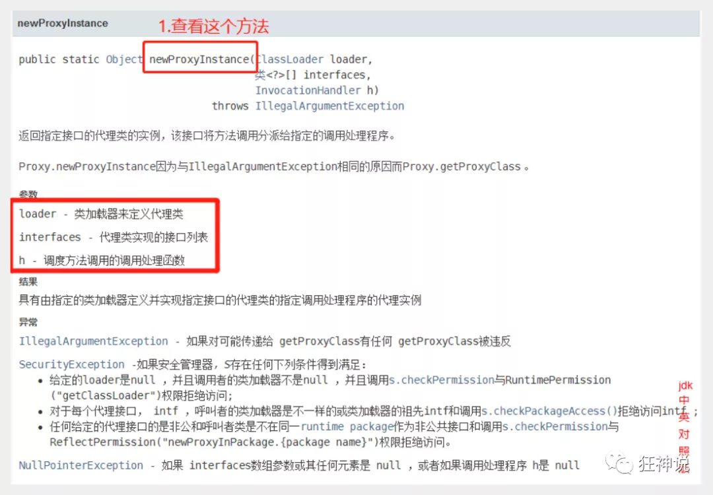

```java
//生成代理类
public Object getProxy(){
   return Proxy.newProxyInstance(this.getClass().getClassLoader(),
                                 rent.getClass().getInterfaces(),this);
}
```

**代码实现** 

抽象角色和真实角色和之前的一样！

Rent . java 即抽象角色

```java
//抽象角色：租房
public interface Rent {
   public void rent();
}
```

Host . java 即真实角色

```java
//真实角色: 房东，房东要出租房子
public class Host implements Rent{
   public void rent() {
       System.out.println("房屋出租");
  }
}
```

ProxyInvocationHandler. java 即代理角色

```java
public class ProxyInvocationHandler implements InvocationHandler {
   private Rent rent;

   public void setRent(Rent rent) {
       this.rent = rent;
  }

   //生成代理类，重点是第二个参数，获取要代理的抽象角色！之前都是一个角色，现在可以代理一类角色
   public Object getProxy(){
       return Proxy.newProxyInstance(this.getClass().getClassLoader(),
               rent.getClass().getInterfaces(),this);
  }

   // proxy : 代理类 
   // method : 代理类的调用处理程序的方法对象.
   // 处理代理实例上的方法调用并返回结果
   @Override
   public Object invoke(Object proxy, Method method, Object[] args) throws Throwable {
       seeHouse();
       //核心：本质利用反射实现！
       Object result = method.invoke(rent, args);
       fare();
       return result;
  }

   //看房
   public void seeHouse(){
       System.out.println("带房客看房");
  }
   //收中介费
   public void fare(){
       System.out.println("收中介费");
  }

}
```

Client . java

```java
//租客
public class Client {

   public static void main(String[] args) {
       //真实角色
       Host host = new Host();
       //代理实例的调用处理程序
       ProxyInvocationHandler pih = new ProxyInvocationHandler();
       pih.setRent(host); //将真实角色放置进去！
       Rent proxy = (Rent)pih.getProxy(); //动态生成对应的代理类！
       proxy.rent();
  }
}
```

核心：**一个动态代理 , 一般代理某一类业务 , 一个动态代理可以代理多个类，代理的是接口！**

## 深化理解

> #### 深化理解

我们来使用动态代理实现代理我们后面写的UserService！

我们也可以编写一个通用的动态代理实现的类！所有的代理对象设置为Object即可！

```java
public class ProxyInvocationHandler implements InvocationHandler {
   private Object target;

   public void setTarget(Object target) {
       this.target = target;
  }

   //生成代理类
   public Object getProxy(){
       return Proxy.newProxyInstance(this.getClass().getClassLoader(),
               target.getClass().getInterfaces(),this);
  }

   // proxy : 代理类
   // method : 代理类的调用处理程序的方法对象.
   public Object invoke(Object proxy, Method method, Object[] args) throws Throwable {
       log(method.getName());
       Object result = method.invoke(target, args);
       return result;
  }

   public void log(String methodName){
       System.out.println("执行了"+methodName+"方法");
  }

}
```

测试！

```java
public class Test {
   public static void main(String[] args) {
       //真实对象
       UserServiceImpl userService = new UserServiceImpl();
       //代理对象的调用处理程序
       ProxyInvocationHandler pih = new ProxyInvocationHandler();
       pih.setTarget(userService); //设置要代理的对象
       UserService proxy = (UserService)pih.getProxy(); //动态生成代理类！
       proxy.delete();
  }
}
```

测试，增删改查，查看结果！

## 动态代理的好处

> ##### 动态代理的好处

静态代理有的它都有，静态代理没有的，它也有！

- 可以使得我们的真实角色更加纯粹 . 不再去关注一些公共的事情 .
- 公共的业务由代理来完成 . 实现了业务的分工 ,
- 公共业务发生扩展时变得更加集中和方便 .
- 一个动态代理 , 一般代理某一类业务
- 一个动态代理可以代理多个类，代理的是接口！

# AOP

## 什么是AOP

> 什么是AOP

AOP（Aspect Oriented Programming）意为：面向切面编程，通过预编译方式和运行期动态代理实现程序功能的统一维护的一种技术。AOP是OOP的延续，是软件开发中的一个热点，也是Spring框架中的一个重要内容，是函数式编程的一种衍生范型。利用AOP可以对业务逻辑的各个部分进行隔离，从而使得业务逻辑各部分之间的耦合度降低，提高程序的可重用性，同时提高了开发的效率。

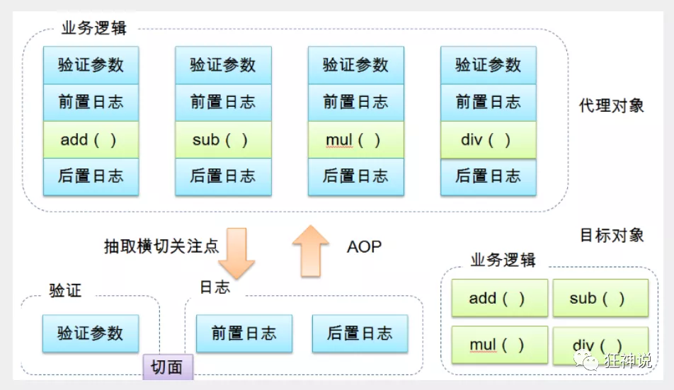

## AOP在Spring中的作用

> Aop在Spring中的作用

<u>提供声明式事务；允许用户自定义切面</u>

以下名词需要了解下：

- 横切关注点：跨越应用程序多个模块的方法或功能。即是，与我们业务逻辑无关的，但是我们需要关注的部分，就是横切关注点。如日志 , 安全 , 缓存 , 事务等等 ....
- 切面（ASPECT）：横切关注点 被模块化 的特殊对象。即，它是一个类。（如：log类）
- 通知（Advice）：切面必须要完成的工作。即，它是类中的一个方法。（如：log中的方法）
- 目标（Target）：被通知对象。
- 代理（Proxy）：向目标对象应用通知之后创建的对象。
- 切入点（PointCut）：切面通知 执行的 “地点”的定义。
- 连接点（JointPoint）：与切入点匹配的执行点。

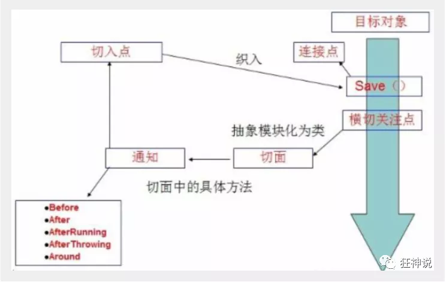

SpringAOP中，通过Advice定义横切逻辑，Spring中支持5种类型的Advice:

|   通知类型   |        连接点        |                    实现接口                     |
| :----------: | :------------------: | :---------------------------------------------: |
|   前置通知   |        方法前        |   org.springframework.aop.MethodBeforeAdvice    |
|   后置通知   |        方法后        |  org.springframework.aop.AfterReturningAdvice   |
|   环绕通知   |       方法前后       |   org.aopalliance.intercept.MethodInterceptor   |
| 异常抛出通知 |     方法抛出异常     |      org.springframework.aop.ThrowsAdvice       |
|   引介通知   | 类中增加新的方法属性 | org.springframework.aop.IntroductionInterceptor |

即 Aop 在 不改变原有代码的情况下 , 去增加新的功能 .

## AOP术语理解

**1、连接点：**

类里面哪些方法可以被增强，这些方法称为连接点
**2、切入点：**

实际被真正增强的方法，称为切入点
**3、通知(增强)：**

实际增强的逻辑部分称为通知(增强)

- 通知有多钟类型
  - 前置通知
  - 后置通知
  - 环绕通知
  - 异常通知
  - 最终通知，类似于try-catch-finally中的finally

**4、切面：**

是动作，把通知应用到切入点过程

## 使用Spring实现AOP

> 使用Spring实现Aop

【重点】使用AOP织入，需要导入一个依赖包！

```xml
<!-- https://mvnrepository.com/artifact/org.aspectj/aspectjweaver -->
<dependency>
   <groupId>org.aspectj</groupId>
   <artifactId>aspectjweaver</artifactId>
   <version>1.9.4</version>
</dependency>
```

**第一种方式**

**通过 Spring API 实现**

首先编写我们的业务接口和实现类

```java
public interface UserService {

   public void add();

   public void delete();

   public void update();

   public void search();

}
public class UserServiceImpl implements UserService{

   @Override
   public void add() {
       System.out.println("增加用户");
  }

   @Override
   public void delete() {
       System.out.println("删除用户");
  }

   @Override
   public void update() {
       System.out.println("更新用户");
  }

   @Override
   public void search() {
       System.out.println("查询用户");
  }
}
```

然后去写我们的增强类 , 我们编写两个 , 一个前置增强 一个后置增强

```java
public class Log implements MethodBeforeAdvice {

   //method : 要执行的目标对象的方法
   //objects : 被调用的方法的参数
   //o : 目标对象
   @Override
   public void before(Method method, Object[] objects, Object o) throws Throwable {
       System.out.println( o.getClass().getName() + "的" + method.getName() + "方法被执行了");
  }
}
public class AfterLog implements AfterReturningAdvice {
   //returnValue 返回值
   //method被调用的方法
   //args 被调用的方法的对象的参数
   //target 被调用的目标对象
   @Override
   public void afterReturning(Object returnValue, Method method, Object[] args, Object target) throws Throwable {
       System.out.println("执行了" + target.getClass().getName()
       +"的"+method.getName()+"方法,"
       +"返回值："+returnValue);
  }
}
```

最后去spring的文件中注册 , 并实现aop切入实现 , 注意导入约束 .

```xml
<?xml version="1.0" encoding="UTF-8"?>
<beans xmlns="http://www.springframework.org/schema/beans"
      xmlns:xsi="http://www.w3.org/2001/XMLSchema-instance"
      xmlns:aop="http://www.springframework.org/schema/aop"
      xsi:schemaLocation="http://www.springframework.org/schema/beans
       http://www.springframework.org/schema/beans/spring-beans.xsd
       http://www.springframework.org/schema/aop
       http://www.springframework.org/schema/aop/spring-aop.xsd">

   <!--注册bean-->
   <bean id="userService" class="com.kuang.service.UserServiceImpl"/>
   <bean id="log" class="com.kuang.log.Log"/>
   <bean id="afterLog" class="com.kuang.log.AfterLog"/>

   <!--aop的配置-->
   <aop:config>
       <!--切入点 expression:表达式匹配要执行的方法-->
       <aop:pointcut id="pointcut" expression="execution(* com.kuang.service.UserServiceImpl.*(..))"/>
       <!--执行环绕; advice-ref执行方法 . pointcut-ref切入点-->
       <aop:advisor advice-ref="log" pointcut-ref="pointcut"/>
       <aop:advisor advice-ref="afterLog" pointcut-ref="pointcut"/>
   </aop:config>

</beans>
```

测试

```java
public class MyTest {
   @Test
   public void test(){
       ApplicationContext context = new ClassPathXmlApplicationContext("beans.xml");
       UserService userService = (UserService) context.getBean("userService");
       userService.search();
  }
}
```

Aop的重要性 : 很重要 . 一定要理解其中的思路 , 主要是思想的理解这一块 .

Spring的Aop就是将公共的业务 (日志 , 安全等) 和领域业务结合起来 , 当执行领域业务时 , 将会把公共业务加进来 . 实现公共业务的重复利用 . 领域业务更纯粹 , 程序猿专注领域业务 , 其本质还是动态代理 . 


**第二种方式**

**自定义类来实现Aop**

目标业务类不变依旧是userServiceImpl

第一步 : 写我们自己的一个切入类

```java
public class DiyPointcut {

   public void before(){
       System.out.println("---------方法执行前---------");
  }
   public void after(){
       System.out.println("---------方法执行后---------");
  }
   
}
```

去spring中配置

```xml
<!--第二种方式自定义实现-->
<!--注册bean-->
<bean id="diy" class="com.kuang.config.DiyPointcut"/>

<!--aop的配置-->
<aop:config>
   <!--第二种方式：使用AOP的标签实现-->
   <aop:aspect ref="diy">
       <aop:pointcut id="diyPonitcut" expression="execution(* com.kuang.service.UserServiceImpl.*(..))"/>
       <aop:before pointcut-ref="diyPonitcut" method="before"/>
       <aop:after pointcut-ref="diyPonitcut" method="after"/>
   </aop:aspect>
</aop:config>
```

测试：

```java
public class MyTest {
   @Test
   public void test(){
       ApplicationContext context = new ClassPathXmlApplicationContext("beans.xml");
       UserService userService = (UserService) context.getBean("userService");
       userService.add();
  }
}
```

**第三种方式**

**使用注解实现**

第一步：编写一个注解实现的增强类

```java
package com.kuang.config;

import org.aspectj.lang.ProceedingJoinPoint;
import org.aspectj.lang.annotation.After;
import org.aspectj.lang.annotation.Around;
import org.aspectj.lang.annotation.Aspect;
import org.aspectj.lang.annotation.Before;

@Aspect
public class AnnotationPointcut {
   @Before("execution(* com.kuang.service.UserServiceImpl.*(..))")
   public void before(){
       System.out.println("---------方法执行前---------");
  }

   @After("execution(* com.kuang.service.UserServiceImpl.*(..))")
   public void after(){
       System.out.println("---------方法执行后---------");
  }

   @Around("execution(* com.kuang.service.UserServiceImpl.*(..))")
   public void around(ProceedingJoinPoint jp) throws Throwable {
       System.out.println("环绕前");
       System.out.println("签名:"+jp.getSignature());
       //执行目标方法proceed
       Object proceed = jp.proceed();
       System.out.println("环绕后");
       System.out.println(proceed);
  }
}
```

第二步：在Spring配置文件中，注册bean，并增加支持注解的配置

```xml
<!--第三种方式:注解实现-->
<bean id="annotationPointcut" class="com.kuang.config.AnnotationPointcut"/>
<aop:aspectj-autoproxy/>
```

```java
/**
 * 环绕通知,环绕通知当中也可以在切入点的方法执行前后加入其他操作就相当于前后通知，最终通知
 */
@Around("pt01()")
public void aroundAdvice(ProceedingJoinPoint proceedingJoinPoint){

    //获取调用目标方法时的参数
    Object[] args = proceedingJoinPoint.getArgs();

    //调用目标方法
    try {
        System.out.println("前置通知开始记录日志了。。。");

        //相当于动态代理中的invoke方法
        proceedingJoinPoint.proceed(args);

        System.out.println("后置通知开始记录日志了。。。");
    } catch (Throwable throwable) {
        System.out.println("异常通知开始记录日志了。。。");
        throwable.printStackTrace();
    }finally {
        System.out.println("最终通知开始记录日志了。。。");
    }
```


aop:aspectj-autoproxy：说明

```xml
通过aop命名空间的<aop:aspectj-autoproxy />声明自动为spring容器中那些配置@aspectJ切面的bean创建代理，织入切面。当然，spring 在内部依旧采用AnnotationAwareAspectJAutoProxyCreator进行自动代理的创建工作，但具体实现的细节已经被
<aop:aspectj-autoproxy />隐藏起来了

<aop:aspectj-autoproxy />有一个proxy-target-class属性，默认为false，表示使用jdk动态代理织入增强，当配为
<aop:aspectj-autoproxy  poxy-target-class="true"/>时，表示使用CGLib动态代理技术织入增强。不过即使proxy-target-class设置为false，如果目标类没有声明接口，则spring将自动使用CGLib动态代理。
```

### 相同的切入点抽取

```java
//相同切入点抽取
@Pointcut(value = "execution(* com.atguigu.spring5.aopanno.User.add(..))")
public void pointdemo() {
}

//前置通知
//@Before 注解表示作为前置通知
@Before(value = "pointdemo()")
public void before() {
	System.out.println("before.........");
}
```

### 有多个增强类多同一个方法进行增强，设置增强类优先级

在增强类上面添加注解 @Order(数字类型值)，数字类型值越小优先级越高

```java
@Component
@Aspect
@Order(1)
public class PersonProxy
```

### 完全使用注解开发

创建配置类，不需要创建 xml 配置文件

```java
@Configuration
@ComponentScan(basePackages = {"com.atguigu"*})
@EnableAspectJAutoProxy(proxyTargetClass = **true**)
//true表示使用JDK动态代理，false表示使用cglib动态代理
public class ConfigAop {

}
```


# JdbcTemplate

## JdbcTemplate的概念和准备

**1、什么是 JdbcTemplate**

（1）Spring 框架对 JDBC 进行封装，使用 JdbcTemplate 方便实现对数据库操作

**2、准备工作**

1）引入相关 jar 包 

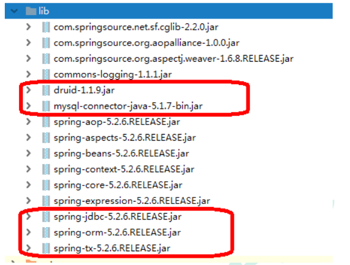

2）在 spring 配置文件配置数据库连接池

```xml
<!-- 数据库连接池 --> 
<bean id="dataSource" class="com.alibaba.druid.pool.DruidDataSource" destroy-method="close"> 
    <property name="url" value="jdbc:mysql:///user_db" />
	<property name="username" value="root" />
	<property name="password" value="root" />
	<property name="driverClassName" value="com.mysql.jdbc.Driver" />
</bean>
```

3）配置 JdbcTemplate 对象，注入 DataSource

```xml
<!-- JdbcTemplate 对象 --> 
<bean id="jdbcTemplate" class="org.springframework.jdbc.core.JdbcTemplate">
	<!--注入 dataSource--> 
    <property name="dataSource" ref="dataSource"></property>
</bean>
```

4）创建 service 类，创建 dao 类，在 dao 注入 jdbcTemplate 对象

\* 配置文件

```xml
<!-- 组件扫描 --> 
<context:component-scan base-package="com.atguigu"></context:component-scan>
```

- Service

  ```java
  @Service
  public class BookService {
  	//注入 dao
  	@Autowired
  	private BookDao bookDao; 
  }
  ```

- Dao

  ```java
  @Repository
  public class BookDaoImpl implements BookDao {
  	//注入 JdbcTemplate
  	@Autowired
  	private JdbcTemplate jdbcTemplate; 
  }
  ```

## JdbcTemplate操作数据库（添加）

**1、对应数据库创建实体类**

**2、编写 service 和 dao**

1）在 dao 进行数据库添加操作

2）调用 JdbcTemplate 对象里面 update 方法实现添加操作

```java
update (String sql, 0bject... args )
```

有两个参数：

- 第一个参数：sql 语句
- 第二个参数：可变参数，设置 sql 语句值

```java
@Repository
public class BookDaoImpl implements BookDao {
	//注入 JdbcTemplate
	@Autowired
	private JdbcTemplate jdbcTemplate;
	//添加的方法
	@Override
	public void add(Book book) {
		//1 创建 sql 语句
		String sql = "insert into t_book values(?,?,?)";
		//2 调用方法实现
		Object[] args = {book.getUserId(), book.getUsername(), 
		book.getUstatus()};
		int update = jdbcTemplate.update(sql,args);
		System.out.println(update);
	} 
}
```

**3、测试类**

```java
@Test
public void testJdbcTemplate() {
	ApplicationContext context = new ClassPathXmlApplicationContext("bean1.xml");
	BookService bookService = context.getBean("bookService", BookService.class);
	Book book = new Book();
	book.setUserId("1");
	book.setUsername("java");
	book.setUstatus("a");
	bookService.addBook(book);
}
```

## JdbcTemplate操作数据库（修改和删除）

**1、修改**

```java
@Override
public void updateBook(Book book) {
	String sql = "update t_book set username=?,ustatus=? where user_id=?";
	Object[] args = {book.getUsername(), book.getUstatus(),book.getUserId()};
	int update = jdbcTemplate.update(sql, args);
	System.out.println(update);
}
```

**2、删除**

```java
@Override
public void delete(String id) {
	String sql = "delete from t_book where user_id=?";
	int update = jdbcTemplate.update(sql, id);
	System.out.println(update);
}
```

## JdbcTemplate操作数据库（查询）

### 1、查询返回某个值

1）查询表里面有多少条记录，返回是某个值

2）使用 JdbcTemplate实现查询返回某个值代码

```java
queryFor0bject (String sql, Class<T> requiredType)
```

有两个参数：

- 第一个参数：sql 语句
- 第二个参数：返回类型 Class

```java
//查询表记录数
@Override
public int selectCount() {
	String sql = "select count(*) from t_book";
	Integer count = jdbcTemplate.queryForObject(sql, Integer.class);
	return count;
}
```

### 2、查询返回对象

1）场景：查询图书详情

2）JdbcTemplate实现查询返回对象

```java
queryFor0bject (String sql, RowMapper<T> rowMapper, 0bject... args )
```

有三个参数：

- 第一个参数：sql 语句
- 第二个参数：RowMapper 是接口，针对返回不同类型数据，使用这个接口里面实现类完成数据封装
- 第三个参数：sql 语句值

```java
//查询返回对象
@Override
public Book findBookInfo(String id) {
	String sql = "select * from t_book where user_id=?";
	//调用方法
	Book book = jdbcTemplate.queryForObject(sql, new BeanPropertyRowMapper<Book>(Book.class), id);
	return book;
}
```

### 3、查询返回集合

1）场景：查询图书列表分页

2）调用JdbcTemplate 方法实现查询返回集合

```java
query(String sql, RowMapper<T> rowMapper, 0bject... args)
```

有三个参数：

- 第一个参数：sql 语句
- 第二个参数：RowMapper 是接口，针对返回不同类型数据，使用这个接口里面实现类完成数据封装
- 第三个参数：sql 语句值

```java
//查询返回集合
@Override
public List<Book> findAllBook() {
	String sql = "select * from t_book";
	//调用方法
	List<Book> bookList = jdbcTemplate.query(sql, new BeanPropertyRowMapper<Book>(Book.class));
	return bookList;
}
```

# 事务

## 事务概念

### 1、什么是事务

1）事务是数据库操作最基本单元，逻辑上一组操作，要么都成功，如果有一个失败所有操作都失败

2）典型场景：银行转账

\* lucy 转账 100 元 给 mary

\* lucy 少 100，mary 多 100

### 2、事务四个特性（ACID）

1）原子性

2）一致性

3）隔离性

4）持久性

## Spring管理事务介绍

1、事务添加到 JavaEE 三层结构里面 Service 层（业务逻辑层）
2、在 Spring 进行事务管理操作有两种方式：编程式事务管理和声明式事务管理（使用）
3、声明式事务管理
（1）基于注解方式（使用）
（2）基于 xml 配置文件方式
4、在 Spring 进行声明式事务管理，底层使用 AOP 原理
5、Spring 事务管理 API，提供一个接口，代表事务管理器，这个接口针对不同的框架提供不同的实现类

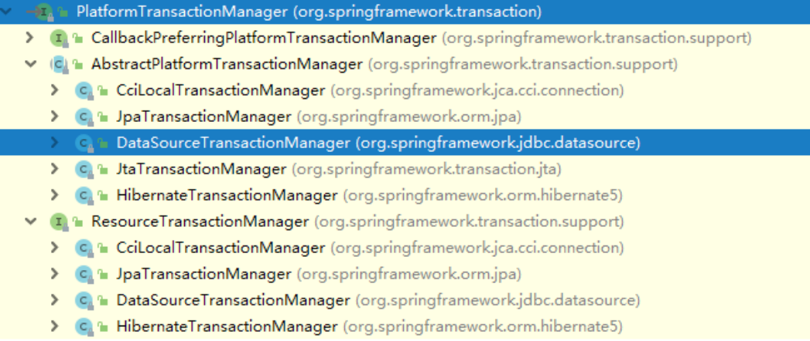

### 基于注解声明式事务管理

1、在 spring 配置文件配置事务管理器

```xml
<!--创建事务管理器--> 
<bean id="transactionManager" class="org.springframework.jdbc.datasource.DataSourceTransactionManager">
	<!--注入数据源--> 
    <property name="dataSource" ref="dataSource"></property>
</bean>
```

2、在 spring 配置文件，开启事务注解
（1）在 spring 配置文件引入名称空间 tx

```xml
<beans xmlns="http://www.springframework.org/schema/beans"
       xmlns:xsi="http://www.w3.org/2001/XMLSchema-instance"
       xmlns:context="http://www.springframework.org/schema/context"
       xmlns:aop="http://www.springframework.org/schema/aop"
       xmlns:tx="http://www.springframework.org/schema/tx"
       xsi:schemaLocation="http://www.springframework.org/schema/beans 
       http://www.springframework.org/schema/beans/spring-beans.xsd
       http://www.springframework.org/schema/context 
       http://www.springframework.org/schema/context/spring-context.xsd
       http://www.springframework.org/schema/aop 
       http://www.springframework.org/schema/aop/spring-aop.xsd
       http://www.springframework.org/schema/tx 
       http://www.springframework.org/schema/tx/spring-tx.xsd"> 
    
<beans/>
```

（2）开启事务注解

```xml
<!--开启事务注解--> 
<tx:annotation-driven transaction-manager="transactionManager"></tx:annotation-driven>
```

3、在 service 类上面（或者 service 类里面方法上面）添加事务注解
（1）@Transactional，这个注解添加到类上面，也可以添加方法上面
（2）如果把这个注解添加类上面，这个类里面所有的方法都添加事务
（3）如果把这个注解添加方法上面，为这个方法添加事务

```java
@Service
@Transactional
public class UserService {}
```

### 声明式事务的参数配置

在 service 类上面添加注解@Transactional，在这个注解里面可以配置事务相关参数

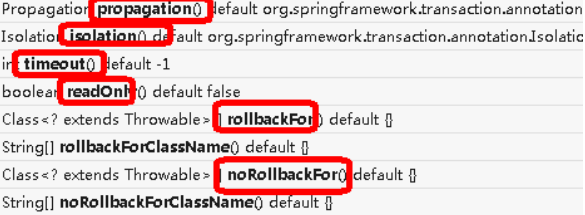

**1、propagation：事务传播行为**
多事务方法直接进行调用，这个过程中事务 是如何进行管理的

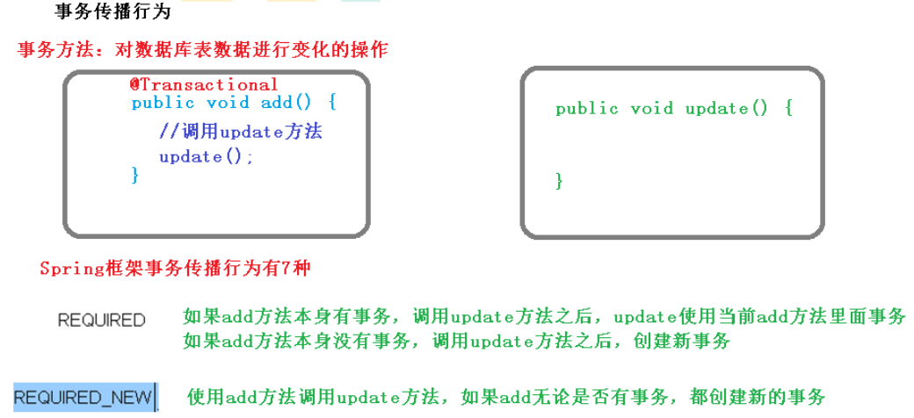

事务的传播行为可以由传播属性指定。Spring 定义了7种类传播行为。

|   传播属性    |                             描述                             |
| :-----------: | :----------------------------------------------------------: |
|   REQUIRED    | 如果有事务在运行，当前的方法就在这个事务内运行,否则，就启动一个新的事务，并在自己的事务内运行 |
| REQUIRED_NEW  | 当前的方法必须启动新事务，并在它自己的事务内运行.如果有事务正在运行，应该将它挂起 |
|   SUPPORTS    | 如果有事务在运行，当前的方法就在这个事务内运行.否则它可以不运行在事务中 |
| NOT_SUPPORTED |   当前的方法不应该运行在事务中.如果有运行的事务，将它挂起    |
|   MANDATORY   | 当前的方法必须运行在事务内部，如果没有正在运行的事务,就抛出异常 |
|     NEVER     |  当前的方法不应该运行在事务中，如果有运行的事务，就抛出异常  |
|    NESTED     | 如果有事务在运行，当前的方法就应该在这个事务的嵌套事务内运行.否则，就启动一个新的事务，并在它自己的事务内运行. |

**2、ioslation：事务隔离级别**
（1）事务有特性成为隔离性，多事务操作之间不会产生影响。不考虑隔离性产生很多问题
（2）有三个读问题：脏读、不可重复读、虚（幻）读

**脏读：**一个未提交事务读取到另一个未提交事务的数据（是一定要避免的）

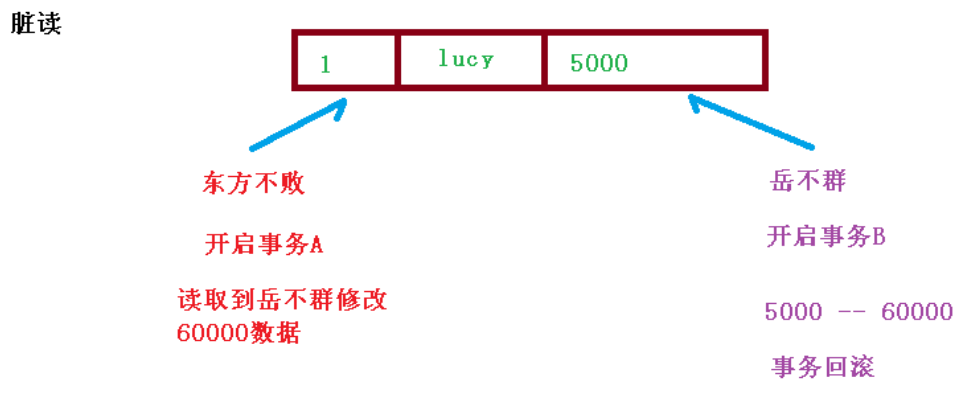

**不可重复读：**一个未提交事务读取到另一提交事务修改数据（属于一种现象）

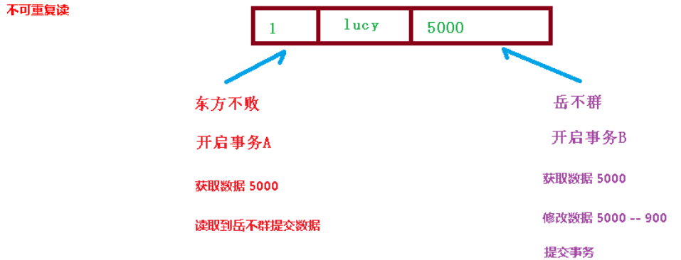

**虚读：**一个未提交事务读取到另一提交事务添加数据

（3）解决：通过设置事务隔离级别，解决读问题

|                            | 脏读 | 不可重复读 | 幻读 |
| :------------------------: | :--: | :--------: | :--: |
| READ_UNCOMMITTED(读未提交) |  有  |     有     |  有  |
| READ_COMMITTED( 读已提交)  |  无  |     有     |  有  |
| REPEATABLE_READ(可重复读)  |  无  |     无     |  有  |
|    SERIALIZABLE(串行化)    |  无  |     无     |  无  |

**3、timeout：超时时间**
（1）事务需要在一定时间内进行提交，如果不提交进行回滚
（2）默认值是 -1 ，设置时间以秒单位进行计算
**4、readOnly：是否只读**
（1）读：查询操作，写：添加修改删除操作
（2）readOnly 默认值 false，表示可以查询，可以添加修改删除操作
（3）设置 readOnly 值是 true，设置成 true 之后，只能查询
**5、rollbackFor：回滚**
（1）设置出现哪些异常进行事务回滚
**6、noRollbackFor：不回滚**
（1）设置出现哪些异常不进行事务回滚

# Spring整合Junit

Spring整合Junit可以使创建spring容器、获取实例的操作也简化成注解

```java
/**
 * @Author XiaoSe
 * Date on 2021/9/8  19:49
 */
/**
 * @RunWith 这个注解可以去替换运行器
 *     SpringJUnit4ClassRunner 单元测试框架
 * @ContextConfiguration 加载配置文件
 * 以上两个注解可以在spring程序运行的时候获取核心容器对象,并且只要注入想要使用的实例即可直接使用，相当于getBean()
 * 
 *  基于注解的方式：@ContextConfiguration(classes = SpringConfig.class)
 *  基于xml的方式：@ContextConfiguration(locations = "classpath:xml/beans.xml")
 */
@RunWith(SpringJUnit4ClassRunner.class)
@ContextConfiguration(locations = "classpath:beans.xml")
public class JunitTest1 {
    @Autowired
    private User user;

    @Test
    public void test1(){

        user.login();
    }

}
```

